# FocusFlow — Backend Architecture Guide (BAG)

**Product Name:** FocusFlow
**Document Type:** Backend Architecture Guide (BAG)
**Supersedes:** N/A — defines how the FocusFlow backend is organized, implemented, deployed, and maintained
**Source of Truth:** FocusFlow PRD (v1.0); WPS (v1.1); UXS (v1.1); DSS (v1.1); DTS (v1.1); DDD (v1.0); SAD (v1.0); AIS (v1.0); FAG (v1.0)
**Audience:** Backend Engineers, Software Architects, DevOps Engineers, QA Engineers, Security Engineers, Technical Leads, Future Contributors
**Status:** Draft v1.0
**Scope:** The complete backend engineering blueprint for FocusFlow — organization, module architecture, clean architecture, DDD implementation, application services, repositories, events, authentication, authorization, realtime, background jobs, integrations, files, search, caching, observability, error handling, security, scalability, testing, coding standards, DevOps readiness, plugins, AI readiness, governance, and future evolution. This is **not** source code; it is the architecture and engineering discipline from which implementation is produced.

**Stack (assumed):** Node.js (LTS) · TypeScript · Express.js · MongoDB · Redis · Socket.IO · BullMQ · JWT · bcrypt · Cloud Object Storage · Axios · Zod · Winston/Pino · OpenTelemetry · Vitest · Docker · Future Kubernetes

---

## Table of Contents

1. [Introduction](#1-introduction)
2. [Backend Philosophy](#2-backend-philosophy)
3. [High-Level Backend Architecture](#3-high-level-backend-architecture)
4. [Project Structure](#4-project-structure)
5. [Module Architecture](#5-module-architecture)
6. [Clean Architecture](#6-clean-architecture)
7. [Domain-Driven Design](#7-domain-driven-design)
8. [Application Services](#8-application-services)
9. [Repository Architecture](#9-repository-architecture)
10. [Event Architecture](#10-event-architecture)
11. [Authentication](#11-authentication)
12. [Authorization](#12-authorization)
13. [Realtime Architecture](#13-realtime-architecture)
14. [Background Jobs](#14-background-jobs)
15. [Integration Layer](#15-integration-layer)
16. [File Management](#16-file-management)
17. [Search Architecture](#17-search-architecture)
18. [Caching Strategy](#18-caching-strategy)
19. [Observability](#19-observability)
20. [Error Handling](#20-error-handling)
21. [Security Architecture](#21-security-architecture)
22. [Performance & Scalability](#22-performance--scalability)
23. [Testing Strategy](#23-testing-strategy)
24. [Coding Standards](#24-coding-standards)
25. [DevOps Readiness](#25-devops-readiness)
26. [Plugin Architecture](#26-plugin-architecture)
27. [AI Readiness](#27-ai-readiness)
28. [Architecture Governance](#28-architecture-governance)
29. [Future Evolution](#29-future-evolution)

---

## 1. Introduction

### 1.1 Purpose

The BAG is the **single engineering handbook** for building, deploying, and maintaining the FocusFlow backend. It defines how the backend is organized (modules), how each bounded context is built (clean architecture + DDD), how data flows (events, read/write separation), how the system stays secure, observable, scalable, and testable, and how it evolves over the next several years without major redesign.

It exists so that every backend engineer — regardless of team or tenure — builds the platform consistently, in exact alignment with the product (PRD/WPS/UXS), the data design (DDD), the system architecture (SAD), the API contract (AIS), and the frontend (FAG).

### 1.2 Scope

**In scope:** backend organization and module architecture; clean-architecture layering; DDD implementation strategy; application services and use cases; repository/read-model/write-model architecture; event-driven architecture (domain/application/integration events, outbox, DLQ, replay); authentication and authorization; realtime; background jobs; integration layer; file management; search; caching; observability; error handling; security; scalability; testing; coding standards; DevOps readiness; plugins; AI readiness; governance; evolution roadmap.

**Out of scope:** product behavior (PRD/WPS), UX (UXS), design values (DSS/DTS), database design (DDD), system-level architecture (SAD), API contracts (AIS), frontend architecture (FAG). This document **implements the engineering for** those; it does not redefine them.

### 1.3 Audience

Backend Engineers · Software Architects · Distributed Systems Engineers · DevOps Engineers · QA Engineers · Security Engineers · Technical Leads · Engineering Managers · Future Contributors.

### 1.4 Goals

| Goal | Mechanism in this document |
|---|---|
| Consistent implementation | One module structure (Ch. 4–5), one layering (Ch. 6), one DDD approach (Ch. 7) |
| Domain integrity | Aggregates own invariants; the QA gate and privacy boundary are structural (Ch. 7, Ch. 12) |
| Scalability | Stateless services, queue-driven workers, partitioned stores (Ch. 22) |
| Maintainability | Small modules, clear boundaries, shared kernel, governed changes (Ch. 5, Ch. 28) |
| Observability | Structured logs, metrics, traces, correlation IDs (Ch. 19) |
| Security | Defense in depth; secrets, rate limits, replay protection, plugin sandbox (Ch. 21) |
| Event-driven correctness | Outbox atomicity, idempotency, DLQ, replay (Ch. 10) |
| Future readiness | AI (Ch. 27), plugins (Ch. 26), roadmap (Ch. 29) without redesign |

### 1.5 Non-Goals

- Not a UI/UX spec (UXS/DSS) or frontend guide (FAG).
- Not an API reference (AIS) — the AIS is authoritative for contracts.
- Not a database design (DDD) — repository mapping here references DDD, never redefines the schema.
- Not a coding task: no Express/NestJS/Fastify code, no MongoDB schemas, no Dockerfiles/K8s manifests, no API implementation, no business-logic listings.
- Not a deployment manual with YAML (that is the DevOps & Deployment Guide, later in the Engineering Layer).

### 1.6 Relationship with Prior Documents

| Document | What the BAG implements | Where honored |
|---|---|---|
| **PRD** | Developer-first product; two experiences; automation-first reporting; AI/integration/mobile roadmap | Ch. 1, Ch. 8, Ch. 15, Ch. 27, Ch. 29 |
| **WPS** | Entities, roles, QA gate, releases, milestones, Mission Control, templates, Overview-first | Ch. 5, Ch. 7 (invariants), Ch. 11–13 |
| **UXS** | Command palette, Universal Timeline, intelligence surfacing, offline states | Ch. 10, Ch. 13, Ch. 27 |
| **DSS/DTS** | State/content conventions that constrain responses | Ch. 8 (validation/errors), Ch. 19 |
| **DDD** | The ten bounded contexts, aggregates, ownership, privacy boundary, consistency model, audit spine | Ch. 5, Ch. 7, Ch. 9, Ch. 10, Ch. 12 |
| **SAD** | Layering, service catalog, event spine, realtime, offline, scaling, ADRs | Ch. 3, Ch. 10, Ch. 13, Ch. 22 |
| **AIS** | `/api/v1` contract, envelopes, error codes, idempotency, sync, webhooks | Ch. 8, Ch. 11, Ch. 15, Ch. 20 |
| **FAG** | What the frontend expects: read models, optimistic flow, realtime→cache | Ch. 9, Ch. 13 |

**Consistency obligation:** the BAG never contradicts the above. It is the engineering discipline that makes their guarantees real. Where a rule (QA gate, privacy boundary, event schema) is defined in a prior document, the BAG references it and enforces it in architecture — never redefines it.

---

## 2. Backend Philosophy

### 2.1 Principles

| # | Principle | Meaning | Primary chapters |
|---|---|---|---|
| B1 | **Domain-Driven Design** | The domain is the heart; aggregates enforce invariants; contexts are explicit | Ch. 5, Ch. 7 |
| B2 | **Clean Architecture** | Dependencies point inward; the domain knows nothing about HTTP/DB/queues | Ch. 6 |
| B3 | **SOLID** | Single-responsibility modules, open/closed contexts, Liskov ports, interface segregation, dependency inversion | Ch. 4–6 |
| B4 | **Event-Driven** | State changes are events; consumers are projections; the spine is the source of truth for derived state | Ch. 10 |
| B5 | **Modular** | Bounded contexts as deployment-capable modules with explicit public surfaces | Ch. 4–5 |
| B6 | **Scalable** | Stateless services; scale-out reads and workers; partitioned data | Ch. 22 |
| B7 | **Observable** | Every request, event, job, and external call is traceable | Ch. 19 |
| B8 | **Secure by Design** | Defense in depth; privacy boundary is structural, not a UI filter | Ch. 12, Ch. 21 |
| B9 | **Automation First** | Reporting/intelligence are automated; jobs are first-class | Ch. 8, Ch. 14, Ch. 27 |
| B10 | **Offline Ready** | Server supports durable client queues, idempotent sync, conflict semantics | Ch. 10, Ch. 22 |
| B11 | **AI Ready** | Guarded, explainable intelligence; AI consumes read models, never mutates aggregates | Ch. 27 |
| B12 | **Plugin Ready** | Extension points are published contracts; plugins never bypass boundaries | Ch. 26 |
| B13 | **Maintainability** | Small files, clear names, bounded changes, governed ADRs | Ch. 4, Ch. 24, Ch. 28 |
| B14 | **Developer Experience** | Fast local dev, type-safe contracts, low-friction tests | Ch. 4, Ch. 23, Ch. 25 |

### 2.2 Trade-offs That Follow

| Decision | Rationale | Cost accepted |
|---|---|---|
| Event-driven over direct calls between contexts | Loose coupling, replayability, realtime (SAD ADR 2) | Eventual consistency in reads |
| Read/write separation | Strong writes, fast reads (SAD ADR 5) | Projection lag + projection engineering |
| Aggregate-scoped transactions only | No distributed transactions (DDD §2.4) | Cross-aggregate flows are async |
| Outbox for atomic write+event | No lost/duplicate events (SAD ADR 10) | Slight write-path overhead |
| Modules = bounded contexts | Team ownership + isolation (DDD §2) | Shared-kernel governance needed |
| Redis for cache/session/queues | Speed + one ops surface | Cache invalidation discipline (Ch. 18) |
| Node.js single-language | DX, shared contract types with frontend | CPU-bound work pushed to queues/workers |

### 2.3 How Philosophy Maps to Review

Every backend PR is reviewed against these principles via the review checklist (Ch. 24) and architecture governance (Ch. 28). Principles without enforcement drift; the checklist and ADR process are the enforcement.

---

## 3. High-Level Backend Architecture

### 3.1 System Overview

The backend is a set of **stateless application services** organized by bounded context (DDD §2), behind a single API gateway, with event-driven projections and queue-backed workers. It implements the SAD service catalog (SAD §5.2) as deployable modules.

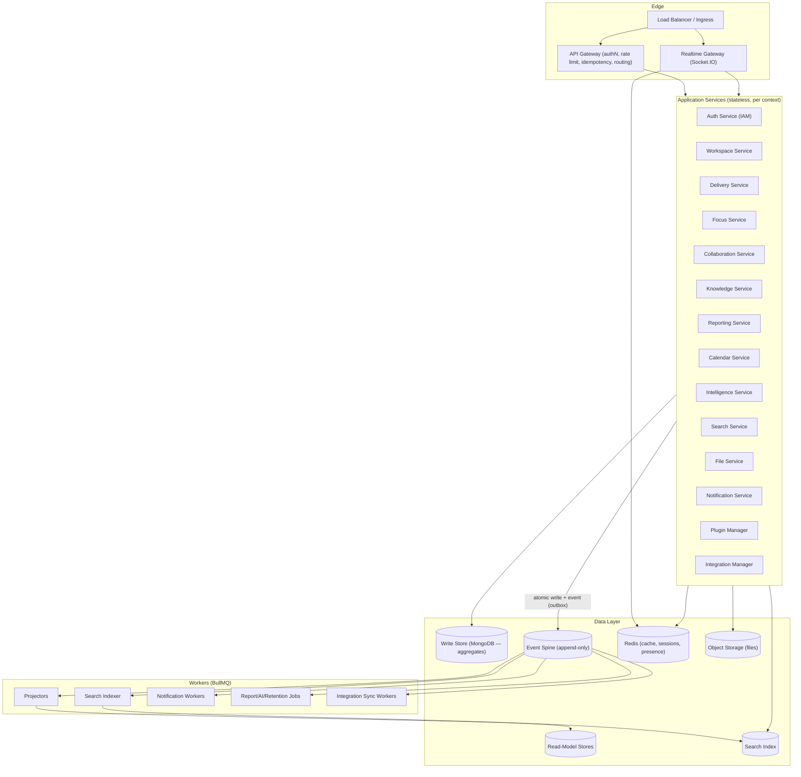

### 3.2 Service Layers

| Layer | Members | Responsibility | Constraint |
|---|---|---|---|
| **Edge** | LB/Ingress, API Gateway, Realtime Gateway | TLS, authN, rate limit, idempotency dedupe, routing, WS/SSE | No business rules |
| **Application Services** | One per bounded context | Orchestrate use cases; authorize; publish events | No invariants; delegate to domain |
| **Domain** | Aggregates, domain services, value objects | Enforce business invariants (QA gate, ownership, privacy) | No infrastructure knowledge |
| **Infrastructure** | Repositories, event bus, queue, cache, storage adapters, ACLs | Implement domain-owned ports | No business rules |
| **Workers** | Projectors, indexers, notifiers, job workers | Consume events/jobs; build read models; side effects | Idempotent, at-least-once |
| **Data** | MongoDB, Event Spine, Read stores, Redis, Search, Object Storage | Persist state | Partitioned, workspace-scoped |

### 3.3 Runtime Flow (request lifecycle)

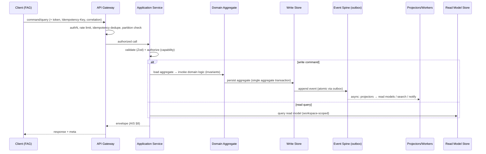

### 3.4 Dependency Graph

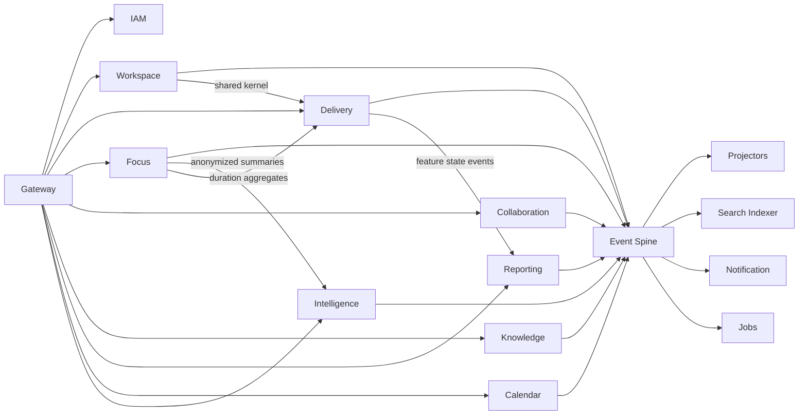

**Dependency direction:** services depend on the shared kernel + event spine; context-to-context dependencies are **event-mediated**, never direct data-structure sharing (DDD §2.4, §7.4).

### 3.5 Event Lifecycle

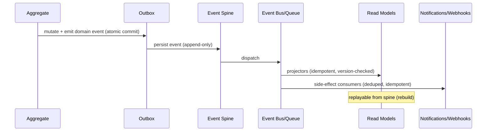

### 3.6 Command vs. Query Processing

| Aspect | Command path | Query path |
|---|---|---|
| Entry | `POST`-style (AIS commands) | `GET`-style read models |
| Store | Write store (aggregates) | Read-model stores |
| Consistency | Strong (aggregate-scoped) | Eventually consistent (< 5 s lag) |
| Invariants | Enforced in aggregate | N/A (projection of truth) |
| Idempotency | `Idempotency-Key` | Natural (GET) |
| Events | Publishes | Never |

---

## 4. Project Structure

### 4.1 Monorepo Layout

The backend is a **monorepo** (one repository, one pipeline) with independently deployable packages. This balances shared contracts, cross-context consistency, and per-context deployability (B5, B14).

```
focusflow-backend/
├── packages/
│   ├── shared-kernel/        # types, errors, validation, IDs, security primitives
│   ├── contracts/            # generated/checked API + event contract types
│   ├── core/                 # clean-architecture base, DI, outbox, envelope
│   ├── modules/
│   │   ├── iam/              # bounded context: IAM
│   │   ├── workspace/        # bounded context: Workspace
│   │   ├── delivery/         # bounded context: Delivery
│   │   ├── focus/            # bounded context: Focus & Time
│   │   ├── collaboration/    # bounded context: Collaboration
│   │   ├── knowledge/        # bounded context: Knowledge
│   │   ├── reporting/        # bounded context: Reporting & Analytics
│   │   ├── calendar/         # bounded context: Calendar
│   │   ├── intelligence/     # bounded context: Intelligence
│   │   └── system/           # bounded context: System Events & Audit
│   ├── infrastructure/       # db adapters, redis, queue, storage, http client
│   ├── api-gateway/          # edge routing, authN, rate limit, idempotency
│   ├── realtime/             # Socket.IO gateway + presence
│   ├── workers/              # projector/indexer/notification/job/worker packages
│   └── tools/                # dev scripts, codegen, contract checks
├── config/                   # env templates, feature flags, service configs
├── tests/                    # e2e suites (cross-context)
├── docs/                     # internal engineering docs (this guide + ADRs)
├── scripts/                  # CI/ops scripts (non-YAML)
├── package.json              # workspace root
└── tsconfig.base.json
```

### 4.2 Module (Bounded Context) Skeleton

Each module follows the identical shape (see Ch. 6 for layer rules):

```
delivery/
├── src/
│   ├── application/          # use cases, application services (ports)
│   ├── domain/               # aggregates, entities, value objects, domain services
│   ├── infrastructure/       # repositories, event adapters, mappers
│   ├── presentation/         # controllers, routes, DTOs, validation
│   └── index.ts              # public surface (module exports)
├── test/
│   ├── unit/                 # domain + application unit tests
│   └── integration/          # module integration tests
└── package.json
```

### 4.3 Naming Conventions

| Kind | Convention | Example |
|---|---|---|
| Packages/modules | `kebab-case` | `focus-flow-*` / `delivery` |
| Domain types | PascalCase | `Task`, `Sprint`, `WorkLogEntry` |
| Application services | `PascalCaseUseCase` | `CompleteTaskUseCase` |
| DTOs | `PascalCaseDto` | `TaskSummaryDto` |
| Controllers | `PascalCaseController` | `TaskController` |
| Enums/consts | PascalCase / SCREAMING | `TaskStatus`, `MAX_FIELD_LENGTH` |
| Functions | camelCase | `authorizeTaskMutation` |
| Repositories | `PascalCaseRepository` | `TaskRepository` |
| Events | dotted snake (DDD §8) | `task.updated` |
| Files | kebab-case | `task-summary.repository.ts` |

### 4.4 The Public Surface Rule

Each module exposes **only its `index.ts`** as public. Everything else is internal. Cross-module imports are forbidden by lint (`no-restricted-imports`). This is how the shared kernel + event contracts stay the only cross-context dependencies (Ch. 5.3).

### 4.5 Shared Kernel Contents

The shared kernel is the **small, stable** set of concepts all contexts agree on: ID types (ULID-based, DDD §4), common errors, envelope primitives, zod-validated base types, permission types, workspace-scoping helpers, and security primitives (hashing, token, audit). **No business rules live in the shared kernel.**

---

## 5. Module Architecture

### 5.1 Ten Bounded-Context Modules (DDD §2)

The backend has exactly ten bounded-context modules, mapped 1:1 from DDD:

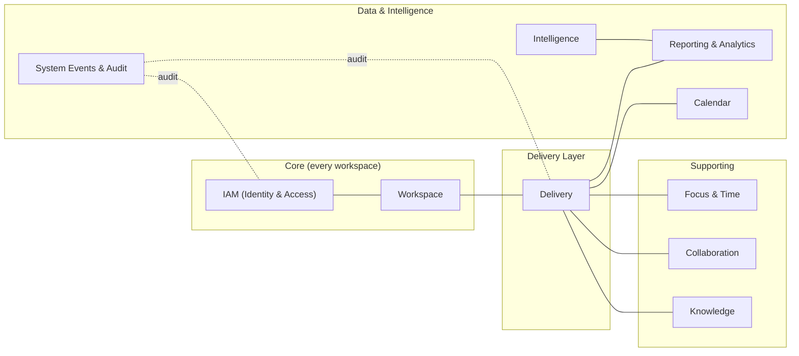

### 5.2 Module Responsibility Matrix

| Module | Responsibility (summary) | Key aggregates | Publishes (examples) |
|---|---|---|---|
| **IAM** | Users, identities, authentication, sessions, RBAC roles | User, Membership, Credential, Session, Invitation | `user.created`, `membership.role_changed` |
| **Workspace** | Workspace config, membership, structure (projects/spaces/teams) | Workspace, Project, Team, Membership | `project.created`, `membership.joined` |
| **Delivery** | Tasks, subtasks, lists, sprints, milestones, releases, worklogs, QA gate | Task, Sprint, Milestone, Release, WorkLog | `task.created`, `task.qa_approved`, `worklog.recorded` |
| **Focus & Time** | Focus sessions, time tracking, summaries, flow state | FocusSession, TimeEntry | `focus_session.completed`, `time_entry.recorded` |
| **Collaboration** | Comments, mentions, reactions, Universal Timeline | Comment, Mention, TimelineEvent | `comment.created` |
| **Knowledge** | Docs, pages, templates, content blocks | Document, Page, Template | `page.updated` |
| **Reporting & Analytics** | Reports, dashboards, metrics, Mission Control aggregates | Report, Metric, MissionControlState | `report.generated` |
| **Calendar** | Schedules, events, sync with external calendars | CalendarEvent, Schedule | `calendar_event.created` |
| **Intelligence** | AI summaries, suggestions, insight generation | IntelligenceRequest, Insight | `insight.generated` |
| **System Events & Audit** | Audit trail, outbox spine visibility, retention, event governance | AuditRecord, OutboxRecord | (consumes all) |

### 5.3 Dependency Rules Between Modules

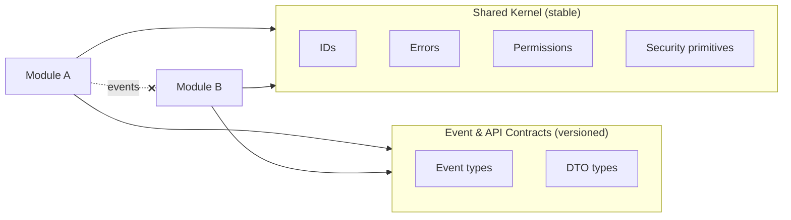

Rules:
1. Modules depend on **shared kernel** and **contracts** only.
2. No direct import between modules (lint-enforced, Ch. 4.4).
3. Cross-context coupling is **via events** only (DDD §7.4).
4. Contracts are **versioned**; breaking changes follow AIS versioning.
5. Modules must compile and test in isolation (CI gate, Ch. 25).

### 5.4 Per-Module Public Surface

| Module | Public: commands | Public: queries | Public: events emitted |
|---|---|---|---|
| Delivery | task commands, sprint commands, worklog commands, QA commands | task list/detail (read models), sprint board | `task.*`, `sprint.*`, `worklog.*`, `release.*` |
| Focus & Time | start/stop focus, log time | session summaries, focus metrics | `focus_session.*`, `time_entry.*` |
| Collaboration | post comment, react, mention | timeline feed, comment threads | `comment.*`, `mention.*` |
| Knowledge | CRUD pages/docs/templates | page tree, search slices | `page.*`, `template.*` |
| Reporting | request/generate report | report data, Mission Control snapshot | `report.*` |
| Calendar | CRUD events, external sync | calendar feed, availability | `calendar_event.*` |
| Intelligence | request summary/insight | insight list, AI status | `intelligence.*` |
| IAM | register, login, roles, sessions | user profile, memberships, permissions | `user.*`, `session.*` |
| Workspace | workspace/project/team CRUD, membership mgmt | workspace tree, membership list | `workspace.*`, `project.*`, `team.*`, `membership.*` |
| System & Audit | export audit | audit query | (consumes) |

### 5.5 Module Lifecycle & Evolution

Modules evolve under ADR governance (Ch. 28):
- **Add** a module only when a new bounded context appears (DDD §2).
- **Split** only when a context becomes load/team bottleneck — split by subdomain, not by service-primitive.
- **Merge** only when two contexts share one invariant owner.
- Every structural change requires a BAD (Backend ADR) recorded in `docs/adr/`.

---

## 6. Clean Architecture

### 6.1 The Dependency Rule

Every module enforces the dependency rule: source code dependencies point **inward**. The domain layer knows nothing about Express, MongoDB, Redis, Socket.IO, or HTTP. This implements SAD layering (SAD §6) as code.

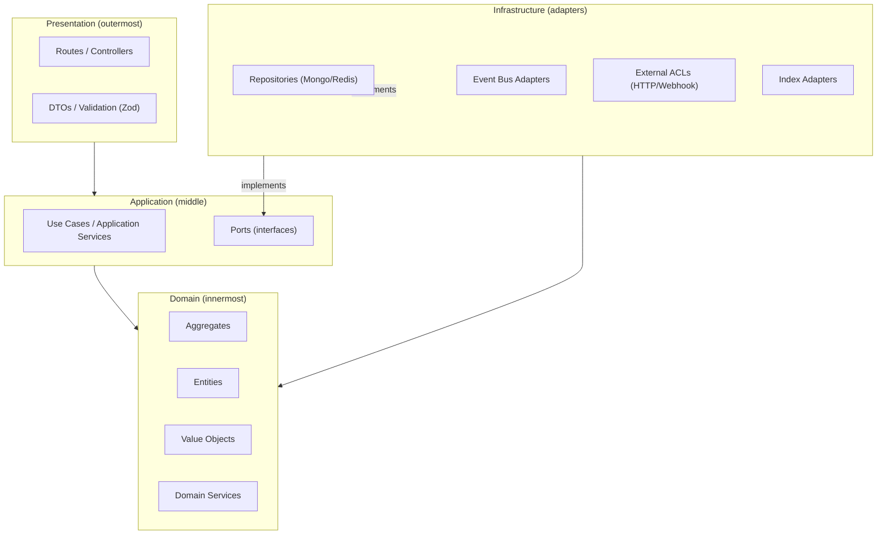

**Layering rules (hard):**

| Rule | Enforced by |
|---|---|
| `presentation` may import `application`, `domain`, shared kernel | ESLint import rules |
| `application` may import `domain`, shared kernel, ports | ESLint import rules |
| `domain` may import shared kernel **only** | ESLint import rules |
| `infrastructure` implements domain-owned ports | Code review + architecture tests |
| Domain never imports `express`, `mongoose`, `ioredis`, `socket.io`, `axios`, `bullmq` | Lint `no-restricted-imports` |

### 6.2 Ports & Adapters (Hexagonal)

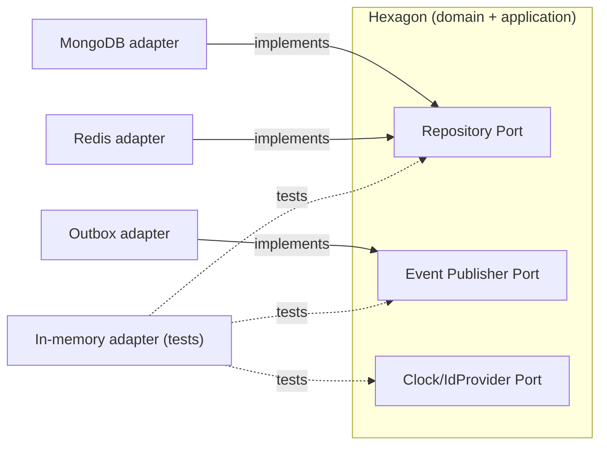

- The domain declares ports; infrastructure provides adapters.
- Tests inject in-memory/fake adapters (Ch. 23).
- Swapping Mongo→Postgres or Redis→in-memory is an adapter change, never a domain change.

### 6.3 Dependency Injection

- **Composition root** at module bootstrap (and gateway bootstrap for cross-module).
- No global service locator; constructor injection only.
- Framework-agnostic core: `core/` package defines the container and lifecycle, not Express.
- `container.ts` wires: repositories → application services → controllers, and registers event listeners at startup (Ch. 25 bootstrap).

### 6.4 Concurrency & Threading Model

- Node.js single-threaded event loop per process.
- **CPU-bound work** (report rendering, intelligence, PDF, heavy transforms) must **not** run in the request path — moved to BullMQ workers (Ch. 14).
- Async I/O dominates; `worker_threads` allowed only in isolated, memory-safe helpers (e.g., heavy parsing) behind a domain-owned port.
- All async flows use typed Promises; no unchecked callbacks (Ch. 24).

---

## 7. Domain-Driven Design

### 7.1 Strategic DDD in Code

- **Bounded contexts** = modules (Ch. 5.1).
- **Ubiquitous language** from DDD/WPS glossary used verbatim in types and names (e.g., `WorkLog` spelling is canonical; never `Worklog`/`Work_Log`).
- **Context map** (SAD §7.1) determines event relationships, not shared classes.

### 7.2 Aggregates & Invariants

Per DDD §3–4, aggregates are the unit of consistency. The backend implements the DDD aggregate catalog with these invariant rules:

| Invariant (source) | Where enforced | Mechanism |
|---|---|---|
| QA gate: task cannot reach `Done` without `Approved` QA (WPS §3.6.3, DDD §4.3) | Delivery aggregate | State-transition guard in aggregate method; Owner override writes an audited event (SAD ADR 14) |
| Privacy boundary: never expose member-private data across members (DDD §13.3) | Cross-cutting | Workspace-scoped repo access + domain-owned redaction + structural checks (Ch. 12) |
| Ownership: creator owns private; workspace owns structure; system owns generated (DDD §2.5) | Each aggregate | Ownership policy on create/update (Ch. 8) |
| WorkLog duration immutability after sync (DDD §4.4) | WorkLog aggregate | Value-object invariant + event append |
| One active session per member (Focus) | Focus aggregate | Guard in aggregate method |

### 7.3 Aggregate Method Discipline

- **Commands as methods**: `task.complete(byMember, at)`, `sprint.close()`, `worklog.append(entry)`.
- **State mutation is encapsulated**; no setters, no public state bypass.
- **Events from methods**: aggregate emits domain events; application service publishes them via outbox (Ch. 10).
- **Return values**: aggregates return result objects (`{ success }` or typed errors), never throw HTTP-coupled errors (Ch. 20).

### 7.4 Domain Services & Shared Kernel

- Cross-aggregate rules that don't belong to one aggregate live in **domain services** in the owning module (e.g., `ReleaseGateChecker`, `PrivacyRedactor`).
- Truly shared domain concepts (roles, IDs) live in the **shared kernel** (Ch. 4.5) — never business rules.
- Modules coordinate via events; the **anti-corruption layer (ACL)** in each module translates external context data (DDD §2.4, SAD ADR 11).

### 7.5 Tactical Patterns

| Pattern | Usage | Example |
|---|---|---|
| Aggregate | Consistency boundary | `Task`, `Sprint`, `FocusSession`, `Document` |
| Entity | Identity + mutable | `Membership`, `TimeEntry` |
| Value Object | Immutable, no identity | `WorkLogEntry`, `Duration`, `Email`, `RoleCapability` |
| Domain Service | Cross-aggregate rule | `ReleaseGateChecker`, `CapabilityResolver` |
| Domain Event | Fact of state change | `task.qa_approved` |
| Repository (port) | Aggregate persistence | `TaskRepository`, `SprintRepository` |
| Factory | Complex creation | `TaskFactory`, `WorkspaceFactory` |
| Spec | Query intent (read side) | `SprintSpec`, `ReportSpec` |

### 7.6 Cross-Cutting DDD Rules

1. **No distributed transactions** (DDD §2.4): one aggregate per transaction.
2. **Events are facts** (append-only spine) — never mutable, never deleted (Ch. 10).
3. **Projections are derived** — read models can be rebuilt from the spine.
4. **Privacy is a domain rule**, applied inside the boundary, not at the UI.
5. **IDs are opaque, workspace-scoped-safe** (ULID; DDD §4) — no incremental IDs, no cross-workspace enumeration.

---

## 8. Application Services

### 8.1 Role of Application Layer

The application layer orchestrates use cases: it **validates input, authorizes the caller, loads the aggregate, invokes domain logic, persists, and publishes events** — but contains **no business invariants** (those live in the domain, Ch. 7).

### 8.2 Use Case Pattern

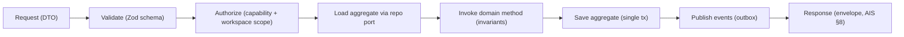

Every use case implements a contract:

```
interface IUseCase<TCommand, TResult> {
  execute(context: UseCaseContext, command: TCommand): Promise<Result<TResult>>;
}
```

- `UseCaseContext` carries: `memberId`, `workspaceId`, `capabilities`, `correlationId`, `requestId`, `idempotencyKey`.
- Result is a typed `Result<T, DomainError>` (never throws HTTP errors; Ch. 20).

### 8.3 Command/Query Separation (CQRS)

| Command side | Query side |
|---|---|
| `*Command`/`*UseCase` | `*Query`/`*Projector` |
| Writes aggregates | Reads projections |
| Synchronous, strong | Eventually consistent |
| Publishes events | Never publishes |

Projections are maintained by **projectors** consuming the spine (Ch. 10.5) and served by **query handlers** in the module.

### 8.4 Validation Strategy

| Layer | What | Tooling |
|---|---|---|
| Transport | Wire format, required fields, types, lengths | Zod schema per route (AIS field rules) |
| Application | Cross-field, business-shape validation before domain | Application service checks |
| Domain | Invariants on state transitions | Aggregate methods (Ch. 7.3) |
| Output | Response shape safety | Zod output schemas + contract tests |

Validation rules for text/limits follow DSS/DTS text guidance and WPS field rules; **server is authoritative** (never trust client).

### 8.5 Idempotency (Command Path)

Per AIS: write commands accept `Idempotency-Key`.

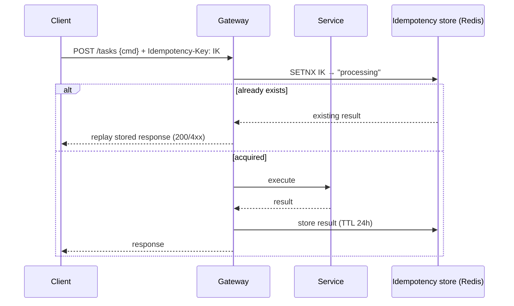

### 8.6 Context-to-Context Orchestration

When a use case needs data from another context, it **must not** import that module (Ch. 5.3). Options, in order:

1. **Read from the context's own projection** (fed by events) — preferred.
2. **ACL call** to the owning context's public query endpoint — acceptable for rare/denormalized needs.
3. **Request async via event** (long-lived flows like report generation) — for expensive work.

### 8.7 Use Case Categories (per module)

| Module | Write (commands) | Read (queries) |
|---|---|---|
| IAM | Register, login, logout, refresh, role assign, invite | Me, memberships, capabilities |
| Workspace | Workspace CRUD, project/team CRUD, membership mgmt | Tree, membership list |
| Delivery | Task commands, sprint commands, worklog, QA approve/reject | Board, list, detail, worklog |
| Focus | Start/stop session, log time | Summaries, focus metrics |
| Collaboration | Comment/reaction/mention | Timeline, threads |
| Knowledge | Page/doc/template CRUD | Tree, page, search slice |
| Reporting | Request report, configure dashboards | Report data, Mission Control |
| Calendar | Event CRUD, sync trigger | Feed, availability |
| Intelligence | Request summary/insight | Insight list, status |
| System | Export audit, retention config | Audit query |

### 8.8 Application Service Checklist (reviewable)

- [ ] Zod validation of command DTO
- [ ] Capability + workspace-scope authorization
- [ ] Load aggregate via port (never repository directly from controller)
- [ ] Invoke domain method; capture domain events
- [ ] Save + outbox-append atomically
- [ ] Return typed result → envelope
- [ ] `correlationId` threaded through all logging

---

## 9. Repository Architecture

### 9.1 Write-Side Repositories

- One repository port per aggregate root (DDD §4).
- Repositories **persist aggregates** and **restore aggregates** from the write store; they **never** contain business logic.
- Mongo adapter maps domain objects ↔ persisted documents via explicit mappers (no ORM magic; mapper lives in `infrastructure`).
- Aggregate version/`_version` guards optimistic concurrency (SAD ADR 5):

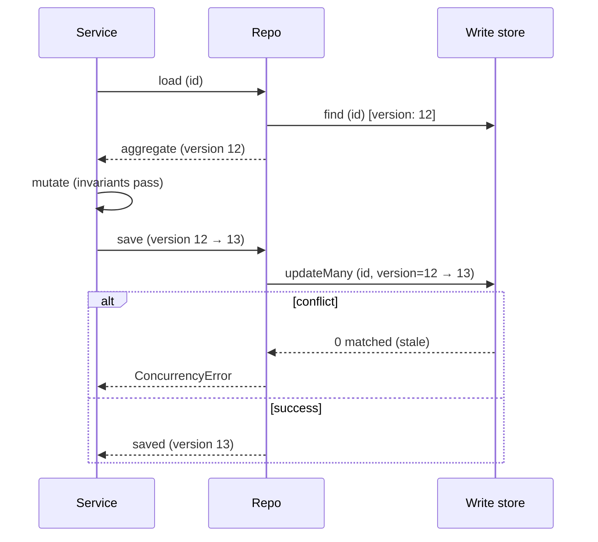

### 9.2 Read-Side Projections

- Read models are **denormalized views** built by projectors (Ch. 10.5), stored in read stores.
- Query handlers read projections only; they are never written by the command path.

| Projection (example) | Backs | Source events |
|---|---|---|
| `task_board_projection` | Board, Kanban (FAG) | `task.*`, `sprint.*`, `worklog.*` |
| `task_list_projection` | List/Overview views | `task.*` |
| `sprint_health_projection` | Sprint health metrics | `sprint.*`, `worklog.*`, `task.*` |
| `member_focus_projection` | Focus summaries | `focus_session.*`, `time_entry.*` |
| `timeline_projection` | Universal Timeline | `task.*`, `comment.*`, `worklog.*`, `mention.*` |
| `mission_control_projection` | Mission Control (WPS) | aggregated events |
| `audit_projection` | Audit queries | system events |

### 9.3 Repository Ports (contract)

```
interface AggregateRepository<TAggregate> {
  load(id: AggregateId): Promise<TAggregate | null>;
  save(aggregate: TAggregate): Promise<SaveResult>;   // optimistic version
}
interface ReadModelRepository<TModel> {
  find(spec: Spec, page: PageCursor): Promise<Page<TModel>>;
}
```

### 9.4 Query Specs & Pagination

- Queries are expressed as **Specs** (typed predicates) — never raw filter dicts escaping the module.
- Pagination follows AIS cursor convention (opaque cursor, stable sort keys).
- Every read query is **workspace-scoped** (always includes `workspaceId` in the spec; enforced by gateway + repo base class).
- Privacy boundary: read models are pre-redacted by projectors (Ch. 12.4) — queries never reach private data of other members.

### 9.5 Data Mapping & Consistency

```mermaid
flowchart LR
    DOM[Domain Aggregate] -->|mapper| DOC[Persisted doc]
    DOC -->|hydrator| DOM
    EVT[Spine event] -->|projector (idempotent)| RM[Read model]
    RM --> QUERY[Query handler]
```

Rules:
- Mappers are pure; no side effects.
- Projectors are **idempotent** (event `id` + `version` dedupe).
- Rebuild = replay spine from a given `afterPosition` (Ch. 10.6).
- Schema evolution: additive changes backward-compatible; breaking changes via versioned contracts (AIS §22).

### 9.6 Indexing & Partitioning Guidance

- Indexes are declared in the module (DDD §10) and applied via migration tooling (Ch. 25); no ad-hoc index creation.
- Workspace partitions: primary partition key `workspaceId` on high-volume collections; hot collections documented in DDD §10.
- Read-model stores may use MongoDB collections or dedicated stores (per SAD ADR 5) — the port contract hides the choice.

---

## 10. Event Architecture

### 10.1 Principles (SAD ADR 2, 10; DDD §8)

- Events are **facts**: immutable, append-only, never edited or deleted.
- **Outbox pattern** guarantees atomicity of "state change + event" (SAD ADR 10).
- Consumers are **idempotent**; delivery is **at-least-once**.
- Cross-context coupling is **event-mediated only** (Ch. 5.3).
- The spine is **replayable**; read models are rebuildable.

### 10.2 Event Types

| Type | Producer | Meaning | Examples |
|---|---|---|---|
| Domain event | Aggregate (owning module) | Fact of domain change | `task.qa_approved`, `worklog.recorded` |
| Application event | Application service | Command outcome for projection | `report.generated` |
| Integration event | ACL / sync workers | External state entered system | `calendar.external_synced` |
| System event | Infrastructure | Operational fact | `system.retention_run` |

### 10.3 Event Envelope (versioned)

```text
{
  id: "<ulid>",
  type: "task.qa_approved",           // dotted snake (DDD §8, AIS §14)
  version: 1,                          // schema version
  producedAt: "<iso>",
  aggregateId: "<ulid>",
  aggregateType: "task",
  workspaceId: "<ulid>",
  actorId: "<ulid>",
  correlationId: "<ulid>",
  causationId: "<ulid>",
  data: { ... }                        // validated payload
}
```

- Schema validated on publish **and** on consume (Zod contract, Ch. 4.5).
- `correlationId` links a user action across all events it causes.
- `causationId` links an event to the event that caused it.

### 10.4 Publish Flow (Outbox)

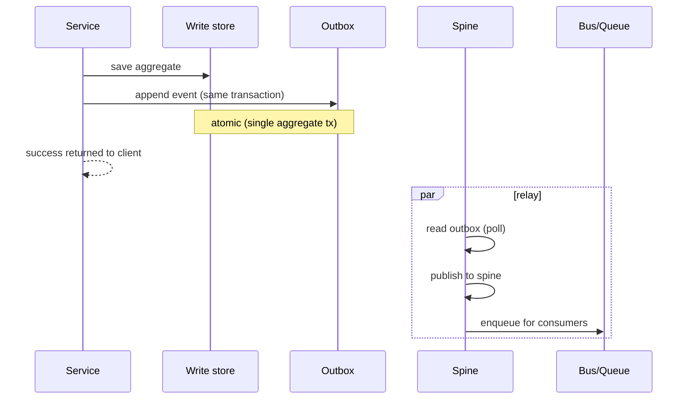

**Relay choices:** embedded relay (same process, transactional outbox collection) for v1; dedicated relay worker when volume grows (Ch. 22). At-least-once; consumers dedupe.

### 10.5 Consume Flow (Projectors & Side Effects)

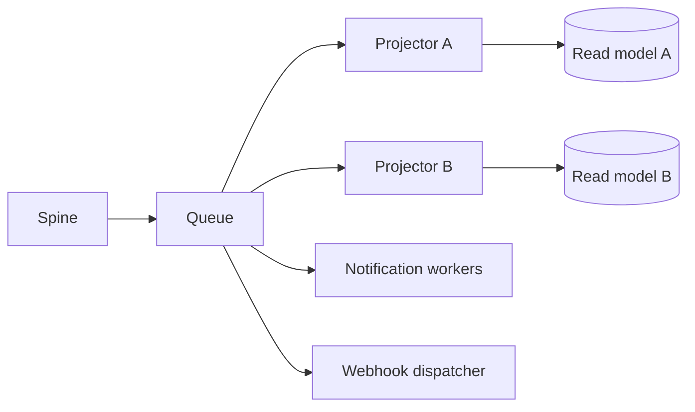

- **Projectors**: update read models; idempotent via `(eventId, version)`.
- **Side-effect consumers**: notifications, webhooks, search index, external sync, intelligence triggers.
- **Ordering**: per-`aggregateId` ordering preserved within a projection (partition key). Global order not guaranteed (Ch. 22).

### 10.6 Replay & Rebuild

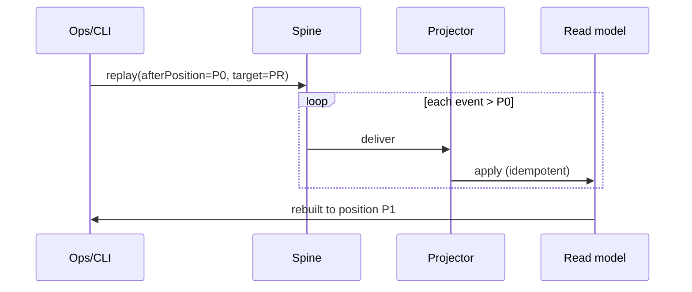

- Full rebuild supported per projection.
- Replay is **time-boxed**; long replays run as jobs (Ch. 14) with progress tracking.

### 10.7 Failure & Dead Letter Handling

| Failure | Handling |
|---|---|
| Publish failure | Outbox retries with backoff; poison-marker after N attempts; alert (Ch. 19) |
| Consumer failure | Retry with exponential backoff + jitter (Ch. 20) |
| Permanent poison | Event → **DLQ**; quarantine; alert; manual reconcile path |
| Schema mismatch | Version field + compat matrix (AIS §22); unknown version → DLQ + alarm |

### 10.8 Retention & Governance

- Spine is append-only but **retention-policy governed** (system events module): operational pruning + export path per privacy obligations (DDD §13, SAD ADR 12).
- Events are never rewritten; corrections are new events.
- Audit events are tamper-evident in intent (append-only; Ch. 21.7).

### 10.9 Event Catalog (subset — authoritative in AIS §14)

| Domain | Events |
|---|---|
| IAM | `user.created`, `user.deleted`, `session.revoked`, `membership.role_changed` |
| Workspace | `workspace.created`, `project.created`, `team.created`, `membership.joined` |
| Delivery | `task.created`, `task.updated`, `task.status_changed`, `task.qa_approved`, `task.qa_rejected`, `sprint.created`, `sprint.closed`, `worklog.recorded`, `release.created`, `milestone.reached` |
| Focus | `focus_session.started`, `focus_session.completed`, `time_entry.recorded` |
| Collaboration | `comment.created`, `comment.updated`, `mention.created` |
| Knowledge | `page.created`, `page.updated`, `template.created` |
| Reporting | `report.requested`, `report.generated`, `report.failed` |
| Calendar | `calendar_event.created`, `calendar_event.updated`, `calendar.external_synced` |
| Intelligence | `intelligence.requested`, `insight.generated` |
| System | `system.retention_run`, `system.audit_exported` |

---

## 11. Authentication

### 11.1 Model

Stateless JWT access tokens + refresh tokens (AIS §20), with server-side session revocation in Redis.

```mermaid
flowchart LR
    C[Client] --> L[POST /auth/login]
    L --> V[Verify credentials bcrypt]
    V --> AT[JWT access token]
    V --> RT[Refresh token (Redis session)]
    AT --> API[Protected APIs]
    RT --> RF[POST /auth/refresh]
    RF --> AT2[New access token]
    L --> REV[POST /auth/logout → revoke session]
```

### 11.2 Token Design

| Token | Lifetime | Storage | Revocation |
|---|---|---|---|
| Access (JWT) | Short (e.g., 15 min) | Client memory (per FAG) | Short-lived; revocation via Redis deny-list on demand |
| Refresh | Rotating, longer (e.g., 14 d) | Redis session record | Immediate revoke (logout, security event) |
| CSRF | Per-session (cookie transport) | HttpOnly SameSite cookie | Bounded by session |

Claims: `sub` (memberId), `workspaceId` (primary), `cap` (capability set, short-lived cache), `jti`, `iat`, `exp`, `iss`, `aud`.

### 11.3 Credential Storage

- Passwords: **bcrypt** with cost ≥ 10 (never plaintext, never reversible hash).
- MFA: TOTP secrets stored encrypted; recovery codes hashed.
- API/Webhook secrets (integrations): encrypted at rest, masked in logs, never returned after creation (Ch. 21).

### 11.4 Login Methods

| Method | Notes |
|---|---|
| Email + password | Primary; bcrypt; rate-limited (Ch. 21.4) |
| OAuth2/OIDC (future, WPS roadmap) | Delegated; account linking; idp user id mapping |
| SSO (enterprise, later) | SCIM-ready (Ch. 29) |
| Invitation magic-link (membership join) | Single-use, time-boxed, workspace-scoped (AIS) |

### 11.5 Session Lifecycle

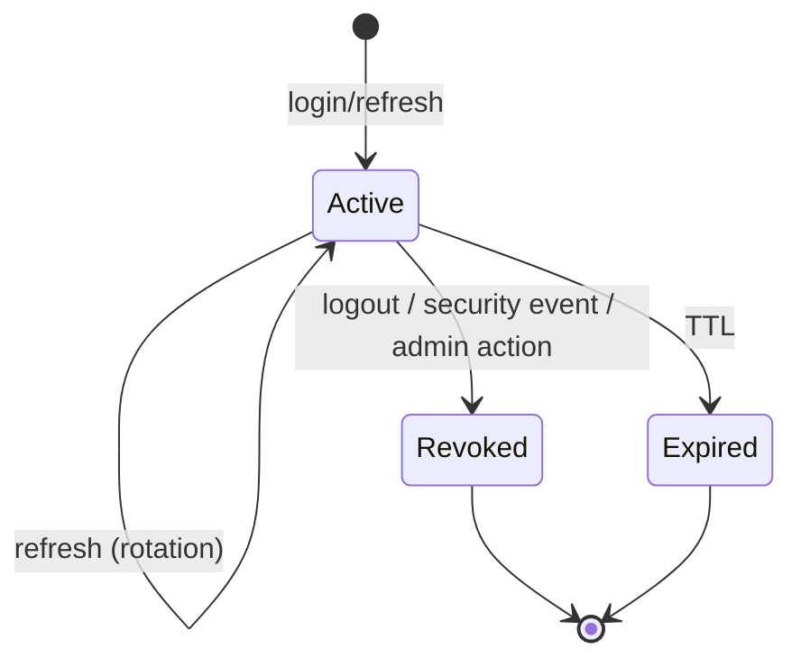

- Max concurrent sessions configurable (default per WPS/security).
- Revocation propagates to gateway via Redis session store read on each request (fast, cached with short TTL).
- Realtime (Ch. 13) binds socket auth to the same session lifecycle; disconnects on revoke.

### 11.6 Client & Server Responsibilities

| Actor | Responsibility |
|---|---|
| Client | Store access token in memory; use refresh; never log tokens; clear on 401 |
| Gateway | Verify JWT (signature, exp, iss, aud), attach `UseCaseContext` |
| Auth service | Issue/rotate/revoke tokens; session store; credential verify |
| Services | Trust verified context; never parse tokens themselves |

### 11.7 Multi-Workspace & Membership

- Tokens carry the **primary workspace**; workspace switching issues a scoped context (FAG/UXS command palette).
- A member in N workspaces has N membership capabilities; capability resolution is per-workspace (Ch. 12).
- Member-private data (DDD §13.3) is keyed by `memberId` + membership, never cross-member.

---

## 12. Authorization

### 12.1 Model: Role → Capability → Action

FocusFlow uses **RBAC** (roles: Owner/Admin/PM/Leader/Developer/QA/Viewer — WPS §5.1) resolved to **capabilities** (fine-grained), checked against **actions** (AIS operation IDs).

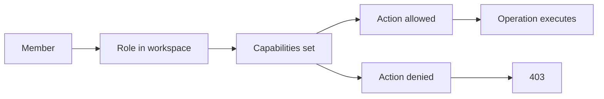

### 12.2 Capability Resolution

- Role → capabilities mapping is **defined once** (shared kernel, derived from WPS §5.1; authoritative capability table).
- Resolution: `membership.role` (read from write store or cached projection) → capability set → cache in Redis (short TTL, e.g., 5 min).
- Workspace settings (e.g., QA-gate override availability) refine capabilities at evaluation time.

### 12.3 Enforcement Points

| Enforcement point | What it checks | Mechanism |
|---|---|---|
| Gateway | Valid token, endpoint = action | Capability claim + route-action map |
| Service layer | Capability + workspace scope + ownership rules | `authorizeMutation()` guard in use case (Ch. 8) |
| Aggregate | Ownership/state invariants (e.g., QA gate) | Domain methods (Ch. 7) |
| Projection layer | Privacy boundary | Redaction at projector time (Ch. 12.4) |
| Realtime | Room membership + capability | Socket auth + per-room capability check |

### 12.4 Privacy Boundary Enforcement (DDD §13.3)

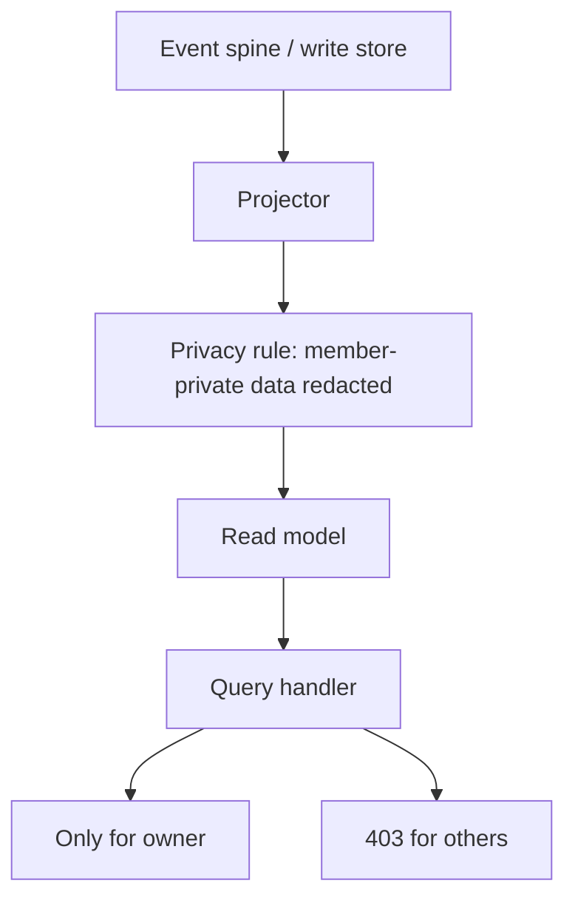

- Member-private data (DDD §13.3) is **never projected** into shared read models.
- Structural data (workspace-level) is readable per capability; personal data is owner-only.
- Redaction is **structural** (server-side), not a UI filter (SAD ADR 13).

### 12.5 Special Rules (from source docs)

| Rule | Implementation |
|---|---|
| QA gate override (Owner) (SAD ADR 14) | Capability `qa_gate_override` (Owner-only) + audited `task.qa_gate_overridden` event |
| Admin manages memberships (WPS) | Capability `member_manage` (Owner/Admin) |
| Privacy of member data | Read-model redaction + query-scope checks |
| Mission Control (Owner/PM/Leader) | Capability `mission_control_view` |
| Template management (PM) | Capability `template_manage` |
| Report automation (PM/Leader) | Capability `report_manage` |

### 12.6 Design-Time Rules

1. Capabilities are **additive**; deny is default (no implicit grants).
2. Role→capability changes require an ADR + migration of cached capability sets.
3. New endpoints must declare a capability + action in the AIS table before merge.
4. Authorization is **never** decided by the client; server is authoritative.
5. Every deny is logged (audit trail) without leaking why (Ch. 20).

### 12.7 Capability Table (illustrative — authoritative in AIS §21)

| Capability | Owner | Admin | PM | Leader | Developer | QA | Viewer |
|---|---|---|---|---|---|---|---|
| workspace_manage | ✓ | ✓ | – | – | – | – | – |
| member_manage | ✓ | ✓ | – | – | – | – | – |
| project_manage | ✓ | ✓ | ✓ | ✓ | – | – | – |
| task_manage | ✓ | ✓ | ✓ | ✓ | ✓ | ✓ | – |
| qa_gate_override | ✓ | – | – | – | – | – | – |
| qa_approve | ✓ | ✓ | ✓ | ✓ | – | ✓ | – |
| report_manage | ✓ | ✓ | ✓ | ✓ | – | – | – |
| timeline_view | ✓ | ✓ | ✓ | ✓ | ✓ | ✓ | ✓ |

---

## 13. Realtime Architecture

### 13.1 Scope

Realtime serves: live board/timeline updates, presence, mention/notification pushes, Mission Control live metrics (WPS), and collaboration presence. Transport: **Socket.IO** (SAD ADR 6), with SSE fallback where FAG requires.

### 13.2 Topology

```mermaid
flowchart LR
    C1[Client A] --> RT[Realtime Gateway (Socket.IO cluster)]
    C2[Client B] --> RT
    RT --> REDIS[Redis (adapter, pub/sub)]
    SP[Spine events] --> DISP[Dispatch service]
    DISP --> REDIS
    REDIS --> RT
    RT --> C1
    RT --> C2
```

- Multiple realtime instances scale via the **Redis adapter** (sticky rooms, cross-instance fan-out).
- Rooms = workspace + entity scope (e.g., `room:workspace:<id>:task:<id>`).
- Presence stored in Redis (TTL-backed heartbeats).

### 13.3 Event → Socket Mapping

| Backend event | Socket channel | Payload (read-model slice) |
|---|---|---|
| `task.updated` | `room:...task:<id>` | `TaskSummaryDto` |
| `comment.created` | `room:...timeline` | `TimelineEntryDto` |
| `worklog.recorded` | `room:...task:<id>` | `WorkLogDto` |
| `focus_session.*` | member room | `FocusStatusDto` |
| `report.generated` | member room | `ReportReadyDto` |
| `mention.created` | member room | `MentionDto` |
| presence | member room | `PresenceDto` |

### 13.4 Subscription & Capability Model

```mermaid
sequenceDiagram
    participant C as Client
    participant RT as Realtime
    participant AU as Auth service
    participant RED as Redis rooms
    C->>RT: connect (token)
    RT->>AU: verify token → member + workspace
    C->>RT: subscribe (room:...task:123)
    RT->>RT: check capability (task view) + membership
    RT->>RED: join room
    C-->>RT: ack
    SP-->>DISP: task.updated
    DISP->>RED: publish room:...task:123
    RT->>C: push event
```

Rules:
- Every subscribe requires **capability + workspace scope** (Ch. 12.3).
- On capability revoke/session revoke, socket is dropped (11.5).
- Payloads are **read-model slices**, never raw aggregates (privacy enforced, Ch. 12.4).

### 13.5 Ordering & Delivery

- Per-room ordering preserved (Redis pub/sub FIFO per channel; client sequence numbers).
- **Durable realtime:** if client offline, missed events are served by **sync cursor** on reconnect (AIS offline model; FAG §realtime/offline) — sockets are a hint, projections are truth.
- At-least-once delivery; clients dedupe by event id.

### 13.6 Presence & Heartbeat

- Heartbeat every 30 s; absent > 90 s → offline (configurable).
- Presence is **opt-in** for focus privacy (Focus & Time); respects `privacyPrefs` (DDD §13.3).
- Presence data is per-member room; never leaks cross-member.

### 13.7 Realtime Failure Handling

| Failure | Behavior |
|---|---|
| Redis unavailable | Degrade to polling/sync cursor; log; alert (Ch. 19) |
| Socket drop | Client reconnects with backoff; resume via sync cursor |
| Stale rooms (instance restart) | Rooms re-established on subscribe; presence reconciled via Redis TTL |
| Backpressure | Slow consumers → queue per channel (bounded), drop-oldest policy for non-critical metrics |

---

## 14. Background Jobs

### 14.1 Queue Architecture (BullMQ)

```mermaid
flowchart LR
    S[Services] -->|enqueue| BQ[BullMQ]
    BQ --> W1[Worker A]
    BQ --> W2[Worker B]
    BQ --> W3[Worker C]
    BQ --> W4[Worker D]
    W1 --> J1[Job: report render]
    W2 --> J2[Job: notification batch]
    W3 --> J3[Job: search index]
    W4 --> J4[Job: external sync]
```

- Queue per workload family (reports, notifications, indexing, sync, intelligence, retention, webhooks).
- Worker concurrency per queue; job payloads are **contracts** (validated) — never DOM types.

### 14.2 Job Lifecycle & States

```mermaid
stateDiagram-v2
    [*] --> Waiting
    Waiting --> Active: worker claims
    Active --> Completed
    Active --> Delayed: retry (backoff)
    Delayed --> Active
    Active --> Failed
    Failed --> Active: retry (manual/policy)
    Failed --> [*]: max attempts → DLQ
```

- Job idempotency: jobs carry `eventId`/`requestId`; workers dedupe.
- Attempts/backoff configured per queue (Ch. 20.3).
- Long jobs use **progress + status checkpoints** (report generation, intelligence).

### 14.3 Job Catalog

| Queue | Purpose | Criticality | Trigger |
|---|---|---|---|
| `reports` | Render/aggregate reports, Mission Control | Medium | Request/event/schedule |
| `notifications` | Batch notifications, push, email | Medium | Events |
| `search-index` | Update search index (per event) | Low | Events |
| `webhooks` | External webhook delivery | Medium | Events (AIS webhooks) |
| `sync` | External calendar/integration sync | Medium | Schedule/trigger |
| `intelligence` | AI summaries, insights, suggestion gen | Low | Request/event |
| `retention` | Spine/read-model retention jobs | High | Schedule |
| `emails` | Invitations, password reset, digests | Medium | Service/event |

### 14.4 Scheduling (Cron)

- Cron queues (BullMQ repeatable jobs) for: report schedules, retention windows, presence cleanup, external sync, digest emails, Mission Control snapshot.
- All cron definitions live in **code** (config), versioned, and audited via system events (Ch. 10.8).
- Time zone: workspace-localized schedules computed server-side (calendar).

### 14.5 Concurrency & Scale

```mermaid
flowchart LR
    SUB["Shared queue (BullMQ/Redis)"] --> W1
    SUB --> W2
    SUB --> W3
    W1[worker pod A]
    W2[worker pod B]
    W3[worker pod C]
```

- Stateless workers scale horizontally (Ch. 22); queues partition by priority + job type.
- Heavy jobs (reports, intelligence) are isolated in their own queue to avoid head-of-line blocking.
- Backpressure: queue depth monitored; alerts at thresholds (Ch. 19.4).

### 14.6 Worker Reliability

| Concern | Rule |
|---|---|
| Crash mid-job | Job re-queued (at-least-once); worker resumes via idempotency |
| Duplicate delivery | Dedupe by job id/event id |
| Poison jobs | Max attempts → DLQ + alert (Ch. 20.3) |
| Rate-limited external calls | Per-integration token bucket inside sync workers (Ch. 15) |
| Observability | Job correlation = `correlationId`; per-job structured logs + metrics (Ch. 19) |

### 14.7 Runtime Governance

- No business logic in job handlers beyond orchestration (Ch. 8 rules apply).
- Jobs declare their queue, attempts, backoff, TTL, priority, and required capability/side effects in a **job contract** reviewed in PR (Ch. 24).
- Every job run emits an outcome event (success/failure) for the audit/observability spine (Ch. 10.8).

---

## 15. Integration Layer

### 15.1 ACL & Integration Manager

External integrations enter through the **Integration Manager** (IM) — a dedicated module that owns third-party credentials, webhooks, and outbound calls. No other module talks to external systems directly (SAD ADR 11).

```mermaid
flowchart LR
    EXT1[Git provider]
    EXT2[Calendar provider]
    EXT3[CI/CD]
    EXT4[Slack/Teams]
    EXT5[Others]
    EXT1 --> IM[Integration Manager]
    EXT2 --> IM
    EXT3 --> IM
    EXT4 --> IM
    EXT5 --> IM
    IM --> ACL[ACL per provider]
    ACL --> SVC[Domain modules via events/commands]
    SVC -->|request external| IM
```

### 15.2 Provider Adapter Pattern (ACL)

- One adapter per provider (`<provider>.adapter.ts`), implementing a provider port: `connect`, `sync`, `disconnect`, `getWebhookSignature`, `verify`.
- Adapters translate **provider models → FocusFlow contracts** (anti-corruption, DDD §2.4).
- OAuth/OIDC flows are managed by IM (state/`code_verifier`, refresh, revoke).
- Credentials: encrypted at rest (KMS-style, Ch. 21.3), never logged.

### 15.3 Webhook Manager (AIS webhooks)

```mermaid
sequenceDiagram
    participant P as Provider
    participant WH as Webhook Manager
    participant S as System (event spine)
    participant SUB as Subscriber (client)
    P->>WH: POST webhook (signed)
    WH->>WH: verify signature (HMAC/timestamp)
    WH->>S: translate to internal event
    S-->>SUB: push event (AIS webhook contract)
```

- Signature verification + timestamp replay protection (Ch. 21.5).
- Idempotent handling by event id; DLQ on poison (Ch. 14).
- Outbound webhooks (client subscriptions) managed by the Webhook Manager: retries, signing, secret rotation, delivery receipts.

### 15.4 Outbound HTTP Discipline

| Concern | Rule |
|---|---|
| Timeouts | Per-call config; default modest; circuit breaker (Ch. 20.4) |
| Retries | Exponential backoff + jitter; only for idempotent calls |
| Rate limits | Per-provider token bucket (Redis) |
| Resilience | Timeouts, retries, circuit breakers, bulkheads per provider |
| Secrets | Provider tokens via secret store (Ch. 21.3) |

### 15.5 Integration Capabilities (WPS roadmap)

| Integration | Direction | Primary ops |
|---|---|---|
| Calendar providers | Bidirectional | `calendar.external_synced`, event create/update |
| Git providers (future) | Inbound events + metadata | repo events, PR/branch context into tasks |
| CI/CD (future) | Webhook events | build/deploy status into releases |
| Slack/Teams (future) | Notifications | project mentions, digests |
| Marketplace (future, WPS §18.1) | Via plugin host (Ch. 26) | extensions |

### 15.6 Sync & Conflict Policy

- Provider syncs run on `sync` queue (Ch. 14.3) with schedule + on-demand triggers.
- Conflict resolution: server-side anchors + last-writer-wins with **conflict event** logged (AIS offline model analog).
- Sync progress is check-pointed; resumable; idempotent per `(provider, externalId)`.
- External data is never authoritative over internal invariants (QA gate, ownership).

### 15.7 Security Boundaries

| Boundary | Enforcement |
|---|---|
| Credentials | IM owns; scoped; encrypted; rotated |
| Webhook signatures | Mandatory HMAC + timestamp check |
| OAuth tokens | Short-lived; refresh rotation; revoke on disconnect |
| PII/external data | Redaction by privacy rules (Ch. 12.4) before projection |
| Plugin marketplace | Sandbox (Ch. 26) — never in-process with core |

---

## 16. File Management

### 16.1 Model

Files (attachments, images, exports, avatars) use **Cloud Object Storage** + a File service module that owns metadata, signing, and lifecycle (SAD ADR 7).

```mermaid
flowchart LR
    C[Client] --> F[File service]
    F --> P1[Presigned upload URL]
    C --> OBJ[Object storage]
    OBJ -->|complete notification| F
    F -->|metadata + event| SP[Spine]
    SP --> PROJ[File projection]
```

### 16.2 Upload/Download Flow

```mermaid
sequenceDiagram
    participant C as Client
    participant F as File service
    participant O as Object storage
    participant DB as Metadata store
    C->>F: request upload (intent, type, size)
    F->>F: authorize (capability + workspace)
    F->>O: presign upload URL (TTL)
    F-->>C: { uploadUrl, fileId }
    C->>O: PUT (direct)
    O-->>F: completion notification
    F->>DB: metadata (fileId, owner, sha256, size, status)
    F->>SP: file.uploaded event
    C->>F: GET /files/:id → presigned download URL (workspace-scoped)
```

- Client uploads **directly to object storage** (never proxied through API).
- Download URLs are short-lived and workspace-scoped.

### 16.3 File Type & Size Policy

| Constraint | Rule (source: WPS/DSS file rules) |
|---|---|
| Allowed types | Whitelist per workspace plan (images, docs, archives, exports) |
| Max size | Per-type, enforced by service (metadata) + storage policy |
| Integrity | `sha256` recorded on completion; verified on download |
| Thumbnails | Generated async on `image` queue (image workers, Ch. 14) |

### 16.4 Security & Privacy

- **No path traversal / arbitrary reads**: access is by `fileId` + workspace membership + capability, never by storage key guess.
- Virus scanning: async scan on upload; infected files quarantined + event (Ch. 21.6).
- Private files: owner-only by default; shared via workspace project rules (privacy boundary, Ch. 12.4).
- Exports: generated asynchronously, TTL'd, access-audited (`system.audit_exported`).

### 16.5 Lifecycle & Retention

```mermaid
stateDiagram-v2
    [*] --> Uploading
    Uploading --> Ready: completion verified
    Ready --> Referenced: attached to entity
    Referenced --> Archived: retention policy
    Ready --> Quarantined: scan failed
    Archived --> Deleted: purge after retention
    Quarantined --> Deleted
```

- Orphan cleanup job (no references after TTL) on `retention` queue.
- Deletion is logical first (metadata tombstone), physical purge after retention window — never synchronous in request path.
- Storage metrics per workspace for quotas (WPS plans).

### 16.6 Object Storage Adapter Port

```
interface ObjectStorage {
  createUploadUrl(intent): Promise<PresignedUpload>;
  createDownloadUrl(fileId): Promise<PresignedDownload>;
  delete(objectKey): Promise<void>;
  onComplete(listener): Subscription;
}
```

- Implementation behind port → cloud-agnostic (S3-compatible, GCS, etc.).
- Tests use in-memory/local adapter (Ch. 23).

---

## 17. Search Architecture

### 17.1 Model

Global search (tasks, docs, comments, worklogs) uses a dedicated **search index** fed by spine events (SAD ADR 5), served by a Search service query path.

```mermaid
flowchart LR
    SP[Spine events] --> IDX[Search indexer workers]
    IDX --> SI[Search index]
    SI --> Q[Search query handler]
    Q --> GW[Gateway]
    GW --> UI[Frontend search UX]
```

### 17.2 Indexing Pipeline

```mermaid
sequenceDiagram
    participant S as Spine
    participant W as Indexer worker
    participant I as Search index
    S->>W: task.updated / page.updated / comment.created ...
    W->>W: transform to indexed doc (workspace-scoped, redacted)
    W->>I: upsert (docId = aggregateId + type)
    Note over W,I: idempotent; delete on tombstone events
```

- Indexed documents are **workspace-partitioned**; queries always include `workspaceId` (never cross-workspace).
- Redaction before index (privacy boundary, Ch. 12.4): member-private fields not indexed.

### 17.3 Query Capabilities

| Capability | Notes |
|---|---|
| Full-text (tasks, docs, comments, worklogs) | Analyzed per language (tokenizer config) |
| Facets | Status, type, assignee, tags, date |
| Snippets/highlights | Returned with result |
| Cursor pagination | AIS-style opaque cursor |
| Rank | Relevance + recency + role-appropriate boost (neutral) |
| Command palette (UXS) | Typed results aligned with FAG palette UX |

### 17.4 Reindex & Consistency

- Full reindex from spine available (rebuild job, Ch. 14).
- Lag SLA: near-real-time (< 5 s typical) via event-driven indexer.
- Dedup/idempotency: indexer keys on `(docId, eventVersion)`.
- Failed index ops → retry with backoff → DLQ + alert (Ch. 20.3).

### 17.5 Indexing for Reports & Intelligence

- Reporting aggregates are computed from projections (not from search index).
- Intelligence (Ch. 27) may consume indexed slices as **context**, with explicit consent/scope, never member-private data.

### 17.6 Operations & Scale

- Index cluster per environment; scale out replicas for read-heavy query load (Ch. 22).
- Index mapping changes are versioned (reindex on mapping upgrade).
- Monitoring: index lag, doc counts, query latency (Ch. 19.4).

---

## 18. Caching Strategy

### 18.1 Cache Layers

```mermaid
flowchart TB
    subgraph L1["L1: Client (FAG)"]
        FRONT["In-memory + local cache"]
    end
    subgraph L2["L2: Realtime push updates"]
        WS["Socket.IO event cache (rooms)"]
    end
    subgraph L3["L3: Redis (server)"]
        R1["Session/rate-limit/deny lists"]
        R2["Capability cache"]
        R3["Hot read-model cache"]
        R4["Query/response cache (TTL)"]
        R5["Presence, rooms, jobs, idempotency"]
    end
    subgraph L4["L4: Store / projection"]
        DB[(Read models)]
    end
    FRONT --> WS
    WS --> R3
    R3 --> DB
```

### 18.2 What to Cache

| Data | Key strategy | TTL | Invalidation |
|---|---|---|---|
| Capability sets | `cap:{memberId}:{workspaceId}` | 5 min | On role change event (event-driven) |
| Hot read models (board/timeline) | `rm:{workspaceId}:{type}:{id}` | 60 s | On entity event (event-driven) |
| Rate-limit counters | `rl:{action}:{memberId}` | Window | Sliding window |
| Idempotency records | `idem:{key}` | 24 h | N/A |
| Session/deny lists | `sess:{jti}` | session TTL | On revoke |
| Presence | `presence:{memberId}` | 90 s | Heartbeat |
| Static config/feature flags | `cfg:{env}:{flag}` | 60 s | On flag change |

### 18.3 Invalidation Strategy (event-driven)

```mermaid
flowchart LR
    SP[Spine event] --> INV[Cache invalidator]
    INV --> R1[delete rm:...]
    INV --> R2[bump capability cache]
    INV --> R3[push via realtime to L1/L2]
    R1 --> RM[(read model reload)]
    R3 --> FRONT[FAG refreshes L1]
```

Rules:
- **Never** cache writes-path outputs; cache read-model responses only.
- Invalidation is **event-driven**, never timer-guessed, for entity data.
- TTL as backstop for anything not explicitly invalidated.
- Cache-aside pattern: read → miss → query projection → populate; safe with TTL.

### 18.4 Cache Consistency Boundaries

| Boundary | Rule |
|---|---|
| Writes | Always bypass cache; invalidate after commit + outbox append |
| Read-after-write | Client sees own write via realtime push + read-model freshness (FAG) |
| Cross-member data | Only shared structural data cached; private member data never cached cross-member |
| Stale reads | Bounded by TTL ≤ 60 s for hot paths; reports not cached beyond their generation |
| Redis failure | Cache miss → fall back to projection (degraded, never inconsistent) |

### 18.5 Redis Roles (single ops surface)

| Role | Detail |
|---|---|
| Cache | Read models, capabilities, sessions |
| Pub/Sub | Realtime adapter (Ch. 13), cross-instance invalidation |
| Job/queue | BullMQ broker + storage |
| Rate limiter | Sliding-window counters |
| Idempotency | SETNX records |
| Presence | Heartbeat keys |

### 18.6 Anti-Cache-Avalanche Measures

- Jittered TTLs for popular keys (avoid synchronized expiry).
- Empty-result caching for hot negative lookups (short TTL).
- Circuit breaker on Redis: if down, bypass cache → projection, alert (Ch. 19).
- Per-workspace quotas so a hot workspace cannot evict cold ones (partition-aware eviction).

---

## 19. Observability

### 19.1 Pillars

```mermaid
flowchart TB
    LOG[Structured logs - Winston/Pino]
    MET[Prometheus metrics]
    TR[OpenTelemetry traces]
    EV[Event spine (audit)]
    OBS[Observe: dashboards, alerts]
    LOG --> OBS
    MET --> OBS
    TR --> OBS
    EV --> OBS
```

Every request, event, job, and external call is traceable via **correlationId** (B7).

### 19.2 Structured Logging

| Field | Always present | Example |
|---|---|---|
| `ts` | ✓ | ISO-8601 |
| `level` | ✓ | `info` |
| `service` | ✓ | `delivery` |
| `correlationId` | ✓ | ulid |
| `requestId` | ✓ | per request |
| `memberId`, `workspaceId` | ✓ (context) | ulid |
| `event`/`job`/`action` | ✓ | `task.complete` |
| `durationMs`, `status` | ✓ | 42, 200 |
| `error` (on failure) | ✓ | sanitized |

- **No PII, no secrets, no tokens, no member-private data in logs** (Ch. 21.3).
- Log at boundaries: gateway, service entry/exit, outbox, consumers, external calls.
- Standard log fields enforced by a shared logging utility (shared kernel).

### 19.3 Metrics (RED/USE)

| Layer | Metric group |
|---|---|
| Request | Requests/s, latency p50/p95/p99, error rate, 4xx/5xx |
| Queue | Depth, active, delayed, failed, processing time per queue |
| External | Provider latency, error rate, circuit state |
| Storage | Mongo op latency, read-model lag, index lag |
| Cache/Redis | Hit rate, evictions, connection count |
| Resources | CPU, memory, event-loop delay, RSS |

Dashboards: SRE + product dashboards (request/queue/realtime/index). Alerts per Ch. 25.

### 19.4 Alerts (examples)

| Alert | Threshold | Severity |
|---|---|---|
| 5xx error rate | > 1% over 5 min | P1 |
| p95 latency | > threshold 5 min | P2 |
| Queue depth (reports/intelligence) | > threshold | P2 |
| Read-model lag | > 10 s sustained | P2 |
| Redis outage | down | P1 |
| DLQ non-empty | > 0 for 10 min | P1 |
| Index lag | > 60 s | P2 |

### 19.5 Distributed Tracing (OpenTelemetry)

- Instrument: gateway → service → repo → outbox → consumer → external calls.
- **Span attributes**: `workspaceId`, `aggregateId`, `operation`, `provider`, `queue`.
- Exporters to OTLP collector → backend of choice; sampling: head-based for hot paths (e.g., 10%), full for events/jobs.
- Trace-to-log correlation via `traceId` in log fields.

### 19.6 Event/Job Observability

- Each event published and each job run emits an **outcome event** on the system spine (Ch. 10.8) → replayable operational history.
- Dead-letter and poison events are visible in a dedicated dashboard.
- Job progress fields (Ch. 14.2) feed latency metrics.

### 19.7 Health & Readiness

- Liveness probe: process up.
- Readiness probe: DB, Redis, queue reachable + no fatal config error.
- Gateway routes on readiness; workers on their queue broker.
- Startup logs report config hash (sanitized) for reproducibility.

---

## 20. Error Handling

### 20.1 Error Taxonomy

```mermaid
flowchart LR
    ERR[Error]
    ERR --> DOM[DomainError]
    ERR --> APP[ApplicationError]
    ERR --> INT[InfrastructureError]
    DOM --> INV[Invariant violations]
    DOM --> NOTF[Not found / state]
    APP --> VAL[Validation]
    APP --> AUTH[Authorization/403]
    APP --> RATE[Rate limit/429]
    INT --> EXT[External provider]
    INT --> DB[Storage/queue failure]
```

### 20.2 Mapping to Envelope (AIS §8, §9)

| Error | HTTP | Envelope code (AIS) | Retryable |
|---|---|---|---|
| Validation | 400 | `invalid_request` | No |
| AuthN | 401 | `unauthenticated` | No |
| AuthZ | 403 | `forbidden` | No |
| Not found | 404 | `not_found` | No |
| Conflict | 409 | `conflict` (stale version) | Client retries with fresh read |
| Rate limited | 429 | `rate_limited` | Yes (with backoff) |
| Idempotency conflict | 409 | `idempotency_conflict` | No |
| Upstream | 502/504 | `upstream_error` | Yes |
| Internal | 500 | `internal_error` | No (client backoff) |

- Responses always use the AIS envelope; never leak stack traces or internal detail (Ch. 21).
- Error messages: developer-appropriate, sanitized, no secrets (DSS tone).

### 20.3 Retry & Backoff Policy

| Context | Policy |
|---|---|
| HTTP idempotent calls | Exponential backoff + jitter, max N (per AIS `Retry-After`) |
| External provider calls | Per-provider backoff; circuit breaker (Ch. 20.4) |
| Queue jobs | Per-queue attempts/backoff (Ch. 14.2); DLQ after max |
| Consumer retries | Backoff + jitter; never infinite |

### 20.4 Circuit Breakers & Bulkheads

```mermaid
stateDiagram-v2
    [*] --> Closed
    Closed --> Open: failure threshold
    Open --> HalfOpen: cooldown
    HalfOpen --> Closed: probe success
    HalfOpen --> Open: probe failure
```

- **Circuit breaker** per provider/integration (Ch. 15) and per external dependency (Redis, search).
- **Bulkhead** per provider pool (bounded concurrency) so one provider cannot starve others.
- Open-circuit responses: cached fallback or typed `upstream_error` with `Retry-After`.

### 20.5 Error Handling Rules (code-level)

1. Domain throws/returns **domain-typed** errors only (no HTTP knowledge).
2. Application maps domain errors → envelope codes once, centrally.
3. Controllers never contain `try/catch` around domain logic; global error middleware converts.
4. Async boundaries: every Promise awaited or handled; no unhandled rejections (process guard + alert).
5. Validation errors aggregate all field issues (Zod `flatten`) per AIS.
6. Security errors log the event but return generic messages (avoid oracle behavior).

### 20.6 Failure Isolation

| Failure | Containment |
|---|---|
| Slow query | Timeouts + per-repo deadline; circuit to projection fallback |
| Provider outage | Circuit open + bulkhead + cached fallback |
| Redis down | Bypass cache → projection; degrade realtime to sync (Ch. 13.7) |
| Queue overload | Backpressure + per-queue priority; slow consumers isolated |
| Spike of errors | Rate-limit + circuit + audit event `system.error_spike` |

---

## 21. Security Architecture

### 21.1 Threat Model Overview

| Threat | Mitigation | Chapter |
|---|---|---|
| Account takeover | bcrypt, MFA-ready, session rotation, rate limits | Ch. 11, 21.4 |
| Token theft | Short-lived access, HttpOnly cookies, revocation | Ch. 11 |
| Authorization bypass | Central capability enforcement, server-authoritative | Ch. 12 |
| Cross-tenant leakage | Workspace-scoped queries, partition keys, redaction | Ch. 9, 12.4 |
| Injection (NoSQL/command) | Typed specs, Zod, parameterized queries | Ch. 9, 24 |
| XSS (via content) | Server-side sanitization/whitelisting on ingest | Ch. 21.6 |
| SSRF (integrations) | ACLs only via IM; allow-listed URLs; no user URL fetch | Ch. 15 |
| Replay/CSRF | Idempotency keys, CSRF tokens, webhook timestamps | Ch. 21.5 |
| Secrets exposure | KMS-style store; masked logs; rotation | Ch. 21.3 |
| Malicious plugins | Sandbox, capability-scoped (Ch. 26) | Ch. 26 |
| DoS | Rate limiting, bulkheads, timeouts | Ch. 20, 22 |
| Audit tampering | Append-only spine + hashed-chain intent | Ch. 21.7 |

### 21.2 Defense in Depth (layers)

```mermaid
flowchart TB
    WAF[WAF / TLS / IP allowlists]
    RL[Rate limit + abuse detection]
    GW[AUTHN at gateway]
    SRV[AUTHZ at service]
    DOM[Domain invariants]
    PRIV[Privacy redaction at projection]
    STORE[Encryption at rest]
    GW --> SRV --> DOM --> PRIV --> STORE
```

### 21.3 Secrets & Key Management

| Secret | Storage | Access |
|---|---|---|
| Service secrets / JWTs | Env-injected (KMS-managed in cloud) | Never in code/repo |
| Provider OAuth tokens | Encrypted in DB (KMS wrapping), IM module only | IM only |
| Webhook secrets | IM, per subscriber | IM only |
| User TOTP secrets | Encrypted, member-scoped | IAM only |
| DB/Redis creds | Env secrets, rotated | Infra layer only |

Rules: no secrets in logs (Ch. 19.2), no secrets in commits (secret-scanning in CI, Ch. 25), masked by default, rotation policy per secret class, least-privilege IAM roles in cloud.

### 21.4 Rate Limiting & Abuse

| Bucket | Basis | Policy |
|---|---|---|
| Per-member per-endpoint | `memberId` + action | Sliding window (AIS limits) |
| Per-workspace | `workspaceId` | Aggregate cap (avoid hot-workspace DoS) |
| Per-IP (unauthenticated) | IP | Login/register/invite joins |
| Per-provider (integration) | provider token | Token bucket (Ch. 15) |

Over-limit → `429 rate_limited` + `Retry-After`; abuse signals → audit event + auto-throttle.

### 21.5 Replay & CSRF Protection

- **Idempotency keys** dedupe replays of writes (Ch. 8.5).
- **Webhook signatures**: HMAC + timestamp window (Ch. 15.3).
- **CSRF**: for cookie-transported auth, per-session CSRF token; SameSite cookies.
- **Nonce/exp** in JWT + jti rotation.
- Realtime: socket handshake bound to valid session; replay-safe by cursor (Ch. 13.5).

### 21.6 Content Security & Scanning

- Ingest sanitization: HTML/rich-text whitelisting, URL allow-list, attachment type whitelist.
- **File scan** on upload (Ch. 16.4): AV scan async, quarantine, event.
- Anti-XSS: sanitize before storage (server-side canonical) so projections are safe.
- Output encoding handled by FAG, but server never returns executable content headers.

### 21.7 Audit & Non-Repudiation

- Audit records on: authN, authZ denials, membership/role changes, QA overrides, exports, integrations, plugin installs (system events module).
- Append-only; retention governed (Ch. 10.8); tamper-evident intent (hash chain per workspace partition).
- Exportable to workspace Owners/Admins per WPS compliance needs.

### 21.8 Dependency & Supply Chain

- Lockfiles committed; CI dependency audit (`npm audit`) blocks on critical/high.
- Minimal image surface (distroless) at runtime (Ch. 25).
- Signatures/checksums verified on third-party packages where available.
- Plugin marketplace reviewed/verified before publish (Ch. 26).

### 21.9 Security Review Gate

New endpoints, integrations, webhooks, and plugin surfaces require a **security review checklist** in PR (Ch. 24): authZ declared, secrets handled, rate limit present, replay/idempotency correct, PII/privacy boundary respected.

---

## 22. Performance & Scalability

### 22.1 Scale Model

```mermaid
flowchart TB
    subgraph SMALL["Small: single instance"]
        GW1[Gateway] --> S1[Services + workers (co-located)]
        S1 --> D1[(Mongo + Redis)]
    end
    subgraph MED["Medium: horizontal"]
        LB2[LB] --> G2[Gateway × N]
        G2 --> S2[Service instances × N]
        S2 --> RED2[(Redis)]
        S2 --> Q2[BullMQ workers × N]
        S2 --> D2[(Mongo replicaset)]
    end
    subgraph LARGE["Large: partitioned"]
        LB3[LB] --> G3[Gateway × N]
        G3 --> P3[Partitioned services by context]
        P3 --> RED3[(Redis cluster)]
        P3 --> Q3[Queues by domain]
        P3 --> D3[(Sharded stores)]
    end
```

- **Statelessness** is the enabling rule: any instance can serve any request for its module.
- Scale reads via read-model replicas; scale writes via sharding on `workspaceId` (Ch. 9.6).

### 22.2 Stateless Service Rule

- No in-memory state across requests (except cold caches, allowed for perf with invalidation discipline, Ch. 18).
- Sessions, capabilities, presence, queues live in Redis.
- Any service instance can restart with zero data loss (events/outbox are durable).

### 22.3 Write Path Scaling

| Concern | Rule |
|---|---|
| Hot aggregates | Partition by aggregate; per-aggregate ordering preserved |
| Outbox throughput | Relay batch reads; dedicated relay worker at scale (Ch. 10.4) |
| MongoDB writes | Indexes per DDD §10; shard key `workspaceId` where volume demands |
| Optimistic concurrency | `_version` guards keep conflicts rare and cheap |

### 22.4 Read Path Scaling

- Read models cached (Ch. 18) and served from projection stores — hot reads never hit write store.
- Query partitioning: cursor pagination bounds result sets (AIS).
- Index-backed sort/filter; no unbounded scans (Ch. 9.6).

### 22.5 Realtime Scaling

- Multiple realtime instances behind the Redis adapter (Ch. 13.2); rooms sharded by workspace.
- Presence state in Redis; per-instance stateless.
- Channel capacity monitored; large-workspace fan-out bounded (batch pushes).

### 22.6 Worker Scaling

- Queues partitioned by workload; workers scale per queue independently.
- Heavy queues (reports, intelligence) get dedicated worker pools (Ch. 14.5).
- Backpressure + DLQ monitoring (Ch. 19.4).

### 22.7 Performance Budgets

| Metric | Budget |
|---|---|
| p50 request latency | < 150 ms |
| p95 request latency | < 500 ms |
| p99 | < 1 s (excluding report/intelligence jobs) |
| Event → projection lag | < 5 s p95 |
| Realtime push latency | < 200 ms p95 |
| Report generation | Async; progress-tracked (Ch. 14.2) |
| Search query | < 100 ms p95 |

Budgets are enforced by alerts (Ch. 19.4) and load tests in CI (Ch. 23).

### 22.8 Capacity & Load Testing

- Load tests per critical path (board load, timeline, report generation, search).
- Tests run in CI on schedule (nightly) + pre-release.
- Capacity model per workspace tier (WPS plans) drives autoscaling rules.

### 22.9 Degradation & Graceful Decline

| Dependency loss | Behavior |
|---|---|
| Redis | Cache bypass → projection; realtime → sync cursor (Ch. 13.7, 18.6) |
| Search | Fallback to projection-scoped filtered queries (reduced) |
| Provider | Circuit open + cached fallback (Ch. 20.4) |
| Queue broker | Publish retries with backoff; outbox accumulates safely (Ch. 10.4) |
| Mongo | Read replicas serve; writes degrade with queue + alert |

---

## 23. Testing Strategy

### 23.1 Test Pyramid

```mermaid
flowchart TB
    E2E["E2E (cross-context, few) - Vitest + service"]
    INT["Integration (module, adapter) - many"]
    UNIT["Unit (domain, use case, pure) - most"]
    E2E --> INT --> UNIT
```

| Layer | Scope | Speed | Gate |
|---|---|---|---|
| Unit | Aggregates, invariants, value objects, use cases | ms | PR required |
| Integration | Repository/adapters, outbox, realtime, queue, file | s | PR + CI |
| Contract | API/event schema conformance (AIS) | s | CI |
| E2E | Cross-context flows (QA gate, privacy, sync) | min | Release gate |
| Load/Perf | Budgets (Ch. 22.7) | min | Nightly/pre-release |

### 23.2 Unit Testing

- **Domain-first**: every invariant has a test (QA gate, ownership, WorkLog duration, privacy redaction).
- Use cases tested with **in-memory fakes** of ports (Ch. 6.2).
- Table-driven tests for validation/transitions; property-style for value objects (email, duration).
- Naming: `should <behaviour> when <condition>`.

### 23.3 Integration Testing

- Real Mongo/Redis via **testcontainers** (or dedicated local) per CI.
- Repositories tested for: versioning/optimistic concurrency, workspace scoping, mapper round-trips.
- Outbox: atomicity (write+event), relay, DLQ.
- Realtime: subscribe/authz/push/ordering.
- Queue workers: enqueue → process → idempotent duplicate.

### 23.4 Contract Testing

- API schemas (Zod) exported from `contracts` package; **test against the contract** (both server and FAG types share source — Ch. 4.2).
- Event schemas validated on both sides (publish/consume, Ch. 10.3).
- Schema drift check: server responses must conform to contract types in CI.

### 23.5 E2E Testing

Critical journeys (from PRD/WPS):
1. Registration → workspace → invite → role → permissions.
2. Task lifecycle incl. **QA gate** (Developer → QA → Approved → Done; override audited).
3. Privacy: member-private data never visible to other members.
4. Realtime: board/timeline updates push; offline sync cursor.
5. Report automation → Mission Control snapshot.
6. Calendar external sync; webhook delivery with signature.
7. File upload/download security.

### 23.6 Test Data & Isolation

- Randomized ULID fixtures; no shared mutable fixtures.
- Each test isolated (transactions rolled back or dedicated DB per suite).
- Seeded data is **workspace-scoped** by default (matches runtime).
- No network calls in tests except controlled fakes (webhooks/providers stubbed).

### 23.7 Coverage & Quality Gates

| Gate | Rule |
|---|---|
| Unit coverage (domain) | ≥ 90% lines for domain layer |
| Overall line coverage | ≥ 80% (PR merge gate) |
| Mutation quality | Critical invariants covered by mutation tests (targeted) |
| Contract conformance | 100% of exposed schemas |
| Lint/type | Zero errors (Ch. 24) |
| Security scan | Dependency audit clean (Ch. 21.8) |

### 23.8 Testing for Failure & Chaos

- Fault-injection tests: Redis down → degraded path; provider circuit opens; queue broker retry.
- Replay/rebuild tests: projection rebuild from spine yields correct state.
- Idempotency tests: duplicate events/jobs produce single effect.

---

## 24. Coding Standards

### 24.1 Language & Tooling Baseline

| Tool | Standard |
|---|---|
| Node.js | LTS only |
| TypeScript | strict mode; no `any` (exceptions via ADR) |
| Formatter | Prettier (repo config) |
| Linter | ESLint + import rules (Ch. 4.4, 6.1) |
| Validation | Zod for all boundary schemas |
| Testing | Vitest (Ch. 23) |
| Git | Conventional Commits (repo convention) |

### 24.2 Style & Structure Rules

1. **No comments unless they explain "why"** (B14); code expresses "what".
2. Files < 300 lines; one aggregate/service per file.
3. Naming per Ch. 4.3; domains use the **ubiquitous language** verbatim.
4. No business logic in controllers, repositories, or workers (Ch. 6.1).
5. No `any`/`unknown` escapes; exhaustiveness on unions enforced.
6. Errors are typed results (Ch. 20), never ad-hoc throw.
7. Side effects only via ports (publish, persist, queue); pure domain otherwise.
8. Feature flags for all behavior switches (Ch. 25); no environment-branch logic.

### 24.3 Concurrency & Async Rules

- `async/await` only; no floating promises (`no-floating-promises`).
- Timeouts on all external awaits (Ch. 20.4).
- No blocking sync calls in event loop; CPU work → workers (Ch. 14).
- Shared mutable state avoided; per-request context object only.

### 24.4 API/Event Authoring Rules

- Every new endpoint declares: action, capability, method, rate limit, idempotency, error codes (AIS table) before code.
- Events follow the dotted-snake + version contract (Ch. 10.3).
- DTOs derived from contract types; server never invents response shapes.

### 24.5 Dependency Rules

- Pin exact versions (lockfile); no floating ranges.
- New runtime dependency requires justification in PR (Ch. 21.8 audit).
- Cross-module imports forbidden (lint); shared kernel is the only cross-context dependency (Ch. 5.3).

### 24.6 Pull Request Checklist

- [ ] Tests written/updated (unit for invariants, integration for adapters)
- [ ] Lint + typecheck + contract check green
- [ ] New endpoint/event registered in AIS table
- [ ] Security review checklist (Ch. 21.9) complete
- [ ] Logging/observability fields present (correlationId threaded)
- [ ] No secrets, no `any`, no cross-module imports
- [ ] Changelog/ADR updated when architecture-affecting

### 24.7 Documentation Standards

- Architecture-affecting change → **BAD** (Backend ADR) in `docs/adr/` (Ch. 28).
- Readme per module: purpose, public surface, invariants, how to run/test.
- This BAG is the source for patterns; docs link here rather than duplicate.

---

## 25. DevOps Readiness

### 25.1 Environments & Promotion

| Env | Purpose | Gate |
|---|---|---|
| `local` | Developer; dockerized deps | — |
| `dev` | Integration; feature flags on | merge |
| `staging` | Release candidate | full suite + contract |
| `prod` | Customers | staging gate + manual |

Promotion is **automated** per environment (no manual prod deploys without pipeline).

### 25.2 CI Pipeline

```mermaid
flowchart LR
    PUSH[push/PR] --> L[Lint + typecheck]
    L --> U[Unit tests]
    U --> I[Integration tests]
    I --> C[Contract checks]
    C --> SEC[Dependency/secret scan]
    SEC --> BUILD[Build images]
    BUILD --> DEPLOY[Deploy to dev/staging]
    DEPLOY --> E2E[E2E]
    E2E --> PROMOTE[Promote to prod]
```

### 25.3 Build & Containerization

- Multi-stage builds; **distroless** runtime images (Ch. 21.8).
- Each package produces a deployable image (gateway, services, workers, realtime).
- Immutable tags + checksum verification; images signed where feasible.
- No secrets baked into images (env-injected, Ch. 21.3).

### 25.4 Configuration & Feature Flags

- Config via typed env schema (Zod-validated at boot — fail fast).
- **Feature flags** via a versioned flag service (Redis-backed, Ch. 18.2); used for staged rollouts, kill-switches, A/B.
- Flags are code-reviewed like code; expired flags removed (no dead branches).

### 25.5 Database & Index Migration

- Schema migrations versioned, ordered, idempotent; applied via pipeline (Ch. 9.6).
- **Backward-compatible additive changes** always (AIS versioning) to allow zero-downtime.
- Index builds time-boxed; applied outside peak (retention window).
- Migration dry-run + rollback plan per change.

### 25.6 Observability Tooling (Ops)

- Dashboards per service/queue/realtime (Ch. 19.3); SRE runbooks linked to alerts.
- Log aggregation; trace exploration; error triage workflows.
- On-call escalation paths for P1/P2 (Ch. 19.4).

### 25.7 Backup & Restore

| Asset | Policy |
|---|---|
| Write store (Mongo) | Periodic snapshots + point-in-time; tested restore |
| Event spine | Snapshot + replay capability (source of truth for read models) |
| Object storage | Versioning/retention on bucket |
| Redis | Rebuildable (cache/session); backup only for idempotency continuity |

Restore drill executed quarterly (documented runbook).

### 25.8 Deployment Strategy

- Rolling/blue-green deploy; zero-downtime (stateless + outbox absorbs restarts, Ch. 22.2).
- Canary for risky releases (feature flags gate).
- Rollback: redeploy prior immutable tag; state compatible via additive migrations.
- Realtime cluster drained during deploys (rooms re-established, Ch. 13.7).

### 25.9 Kubernetes Roadmap (future)

- When scale demands: K8s orchestration; HPA on workers/services; node pools per queue workload (Ch. 22).
- This BAG is **K8s-agnostic**: services stay stateless so orchestration is an ops decision (SAD ADR 15).

---

## 26. Plugin Architecture

### 26.1 Extension Model

Plugins extend FocusFlow (WPS §18.1 roadmap, marketplace) **without** compromising the core boundaries. Plugins never get in-process access to core internals.

```mermaid
flowchart LR
    CORE[Core services]
    PLG[Plugin host/sandbox]
    PM[Plugin Manager]
    API[Extension APIs: commands, queries, events, hooks, UI slots]
    MP[Marketplace registry]
    PLG --> API
    API --> CORE
    PM --> PLG
    PM --> MP
```

### 26.2 Plugin Capability Surface

| Capability | Detail |
|---|---|
| Commands | Call documented core commands (AIS contract), capability-scoped |
| Queries | Read core projections (workspace-scoped, redacted) |
| Events | Subscribe to public events (Ch. 10); publish scoped events |
| Hooks | Lifecycle hooks (onTaskCreated, onReportGenerated) |
| UI slots | Frontend extension points (FAG) — backend exposes typed data only |
| Webhooks | Register/consume webhooks (Ch. 15.3) |

### 26.3 Sandbox & Isolation

```mermaid
flowchart TB
    PLG[Plugin] --> SANDBOX[Sandbox runtime]
    SANDBOX --> PERM[Per-plugin capability grants]
    PERM --> CORE[Core via extension API]
    CORE --> AUDIT[Audit: plugin actions logged]
```

- Plugins run in an **isolated runtime** (process/VM container) — never in-process with core (Ch. 21.8).
- Per-plugin capability grants (least privilege); resource quotas (CPU/mem/rate).
- Timeouts + circuit on plugin callbacks; plugin crashes cannot take core down.
- Audit trail for every plugin action (Ch. 21.7).

### 26.4 Plugin Lifecycle

```mermaid
stateDiagram-v2
    [*] --> Submitted
    Submitted --> Reviewed: marketplace review
    Reviewed --> Approved
    Approved --> Installed: owner/admin installs
    Installed --> Active: enabled
    Active --> Disabled: admin disables
    Disabled --> Active
    Active --> Uninstalled
    Uninstalled --> [*]
    Reviewed --> Rejected
```

- Install requires Owner/Admin capability; each install recorded in system audit.
- Versioned plugins; upgrades go through review again.
- Revocation: capability grant can be revoked at runtime (kill-switch).

### 26.5 Plugin Development Standards

- Plugin API is a **published contract** (typed, versioned, documented).
- No private-API access; plugins that need core change → feature request/ADR instead.
- Plugin manifests declare: name, version, capabilities requested, permissions, webhooks.
- Plugin store listing is verified (signature/checksum, Ch. 21.8).

### 26.6 Marketplace (future)

- Catalog of vetted plugins; install/update/disable via Admin UI (FAG) backed by Plugin Manager.
- Marketplace registry serves verified manifests + binaries (signatures).
- Revenue model follows WPS roadmap; billing handled by platform (future module), never in plugins.

---

## 27. AI Readiness

### 27.1 AI Principles

```mermaid
flowchart LR
    SUB["AI never mutates aggregates directly"] --> GEN["Generates content/suggestions only"]
    GEN --> REV["Human review / approval for side effects"]
    REV --> SCOPED["Scoped + consented context only"]
    SCOPED --> AUDIT["Audited + observable"]
```

- **AI is a consumer, not a writer**: intelligence requests produce outputs (summaries, insights, suggestions); mutating actions still go through normal commands + authorization (B11, SAD ADR 16).
- **Explainability**: every generated insight carries provenance (source events, scope, model/version).
- **Privacy**: AI context is drawn only from consented, redacted, workspace-scoped data (never member-private by default, Ch. 12.4).

### 27.2 Intelligence Module Architecture

```mermaid
flowchart TB
    REQ[Request: summarize / suggest / insight] --> GATE[Intelligence gateway]
    GATE --> SCOPING[Scope + consent + redaction]
    SCOPING --> CTX[Build context (read models + redacted slices)]
    CTX --> GEN[Generation worker (queue)]
    GEN --> OUT[Output artifact (typed, schema'd)]
    OUT --> AUDIT[Provenance + audit event]
    OUT --> CLIENT[Deliver to requester / insert as suggestion]
```

### 27.3 AI Workloads

| Workload | Inputs (redacted, scoped) | Output | Trigger |
|---|---|---|---|
| Summaries | Tasks/worklogs/timeline slices | `SummaryArtifact` | Request |
| Insights | Reporting metrics, activity signals | `Insight[]` (ranked) | Event/schedule |
| Suggestions | Task context, plan templates | `Suggestion[]` (reviewable) | Request/event |
| Command-palette AI (UXS) | Query + scoped context | Ranked results | Request |
| Draft assistance | Context + prompt | Draft content (user edits) | Request |

### 27.4 Guardrails & Safety

| Guardrail | Enforcement |
|---|---|
| Scope/consent | Context assembly refuses non-consented data (DDD §13.3) |
| No write-path bypass | Outputs are artifacts; mutations need normal commands |
| Output validation | Zod schema + length/safety checks before delivery |
| Model/version pinning | Model choice is config; rollback = config change |
| Cost/rate control | Per-workspace AI quotas + budget (WPS plan) |
| Sensitive-content filter | Post-generation filter on artifacts |
| Provenance | `modelId`, `promptHash`, `contextRefs` in audit event |

### 27.5 Realtime & UX Integration (UXS, FAG)

- Insights surface in Mission Control and Universal Timeline (WPS/UXS) via **read models**, not AI calls at render.
- Suggested actions render as **reviewable actions** — approval triggers normal commands.
- Polling avoided: AI results delivered via events + realtime push (Ch. 13), with async progress for long generations.

### 27.6 Operations & Scaling

- Generation runs on `intelligence` queue (Ch. 14.3) with dedicated worker pool (cost isolation).
- Batching: summarization/insight jobs are batched per workspace/window.
- Observability: per-request latency, cost, model, and success/fail metrics (Ch. 19).
- Fallbacks: on provider/model failure → typed `intelligence` error + degraded UX (no AI results), never silent corruption.

### 27.7 Data & Privacy for AI

- Training: **no customer data used for training** without explicit opt-in (privacy policy, WPS).
- Context retention: derived artifacts follow retention policies (Ch. 10.8); deleted source → invalidated artifacts.
- Redaction: context builder applies privacy rules before any provider call (Ch. 12.4).

### 27.8 Future AI Surface (roadmap)

- Voice/task-automation and deeper summarization across modules (WPS §18.1 AI Workspace phase) reuse the same intelligence gateway — additions are new workloads, not new architecture.

---

## 28. Architecture Governance

### 28.1 Governance Model

```mermaid
flowchart LR
    PROPOSAL[Change proposal] --> IMPACT{Architecture-affecting?}
    IMPACT -- No --> PR[Standard PR review]
    IMPACT -- Yes --> BAD[Backend ADR]
    BAD --> REVIEW[Architecture review]
    REVIEW --> APPROVE{Approved?}
    APPROVE -- Yes --> IMPL[Implement + register]
    APPROVE -- No --> FEEDBACK[Feedback loop]
    IMPL --> DOCS[Update BAG if needed]
```

### 28.2 Backend ADR (BAD) Process

An architecture-affecting change requires a **BAD** (Backend Architecture Decision Record) before code:

| Section | Required content |
|---|---|
| Context | Problem, constraints, non-goals |
| Options | 2–4 considered alternatives with trade-offs |
| Decision | Chosen option + rationale |
| Consequences | Accepted costs, migration, rollback |
| References | SAD/AIS/FAG/DDD sections touched |

BADs are stored in `docs/adr/bad-<NNN>-<slug>.md`, referenced in code/PRs, and reviewed like code.

### 28.3 What Requires a BAD

- New/merged/split module (Ch. 5.5)
- New cross-context coupling or contract change (AIS §22)
- Change to consistency/invariant enforcement (QA gate, privacy)
- New external dependency/integration pattern (Ch. 15)
- Queue/event/outbox structural change (Ch. 10)
- Deployment/topology change affecting scaling model (Ch. 22)
- Plugin or AI surface change (Ch. 26, 27)
- Observability/security control change (Ch. 19, 21)

### 28.4 Consistency Enforcement (DoD)

Merge of architecture-affecting changes requires:
1. BAD approved and referenced.
2. This BAG (and SAD/AIS as needed) updated to stay consistent.
3. Contracts regenerated + contract checks green (Ch. 23.4).
4. Security checklist complete (Ch. 21.9).
5. ADR list in `docs/adr/` updated.

### 28.5 Roles & Responsibilities

| Role | Responsibility |
|---|---|
| Backend engineer | Follows BAG; proposes BADs; keeps module public surfaces |
| Tech lead | Approves BADs; enforces Ch. 24 checklist |
| Architect | Owns BAG; arbitrates cross-context trade-offs |
| DevOps | Pipeline/env gates; zero-downtime + observability SLAs |
| QA/Security | Gates at Ch. 23, 21 |

### 28.6 Periodic Reviews

- **Architecture review** each milestone (WPS §18.1 phases) vs. this BAG: drift identified → corrective BADs.
- **Tech debt register** in repo: items reference BAG chapter + priority; items merge-gated.
- **Quarterly load/perf review** against Ch. 22.7 budgets.

### 28.7 Evolution Paths (allowed)

| Change | Path |
|---|---|
| New context (AI, marketplace) | New module + BAD (Ch. 5.5) |
| Volume growth | Partitioning + workers + read replicas (Ch. 22) |
| Provider diversity | New ACL adapter (Ch. 15) |
| Multi-tenant/region | Data partitioning + audit (Ch. 22, 21) |

---

## 29. Future Evolution

### 29.1 Roadmap Alignment (WPS §18.1)

| Phase | Backend focus | BAG readiness |
|---|---|---|
| **Core (v1)** | Ten modules, outbox spine, read/write separation, RBAC, QA gate, realtime, files, search, reports, calendar, integrations | Ch. 3–20 |
| **Advanced Team** | Deeper analytics, Mission Control, automation/reports scheduling, advanced roles | Ch. 8, 12, 14, 27 |
| **Engineering Platform** | Plugins/marketplace, integration depth (git/CI), API robustness | Ch. 15, 26 |
| **AI Workspace** | Intelligence scale-up, voice/task automation, deeper summarization | Ch. 27 |
| **Developer OS** | Long-horizon; new contexts via same patterns | Ch. 29.2 |

### 29.2 Evolution Principles

- **No redesigns**: growth is additive — new modules, new ACLs, new workloads — under existing patterns (Ch. 5, 22, 28).
- **Contract stability**: public contracts (AIS) evolve by version, never by breaking silently (Ch. 10.3, 24.4).
- **Ops-driven**: K8s adoption is an ops decision enabled by statelessness (Ch. 25.9), not a rewrite.
- **Consistency preserved**: privacy, QA gate, ownership, and audit invariants are enforced identically in every future module (Ch. 7, 12, 21).

### 29.3 Future Topics (when they become ADRs)

- Multi-region deployment + geo-partitioning (Ch. 22, 28).
- Enterprise SSO/SCIM integration (Ch. 11.4).
- Advanced marketplace billing module (Ch. 26.6).
- Event-sourced rebuild at scale (outbox → full CQRS with dedicated materialization, Ch. 10).
- Mobile backend surface (PRD roadmap) — reuses the same gateway/contracts.

### 29.4 Keeping This Guide Alive

The BAG is a **living document**: updated via BAD process (Ch. 28) and reviewed each phase. It is the agreed engineering discipline — when it changes, the change is deliberate, ADR-recorded, and consistent with SAD/AIS/DDD/FAG.

---

## Revision History

| Version | Date | Author | Summary of Changes |
|---|---|---|---|
| v1.0 | TBD | Backend Architecture Team | Initial release — complete Backend Architecture Guide (29 chapters) |
| | | | |
