# FocusFlow — DevOps & Deployment Guide (DDG)

**Product Name:** FocusFlow
**Document Type:** DevOps & Deployment Guide (DDG)
**Supersedes:** N/A — defines how FocusFlow is deployed, operated, secured, monitored, scaled, and maintained
**Source of Truth:** FocusFlow PRD (v1.0); WPS (v1.1); UXS (v1.1); DSS (v1.1); DTS (v1.1); DDD (v1.0); SAD (v1.0); AIS (v1.0); FAG (v1.0); BAG (v1.0); TQS (v1.0)
**Audience:** DevOps Engineers, Platform Engineers, Site Reliability Engineers, Cloud Architects, Security Engineers, Backend Engineers, Frontend Engineers, QA Engineers, Technical Leads, Engineering Managers, Product Managers, Operations Teams
**Status:** Draft v1.0
**Scope:** The complete operational blueprint for FocusFlow — DevOps architecture, environment strategy, infrastructure topology, CI/CD strategy, configuration and secrets management, monitoring, logging, observability, backup and recovery, disaster recovery, scaling, security operations, operational runbooks, release management, cost management, platform governance, compliance, and the evolution of the platform from single-region cloud to a global, enterprise-grade SaaS. This document intentionally contains **no** Dockerfiles, docker-compose files, Kubernetes YAML, Terraform, CloudFormation, Helm charts, GitHub Actions YAML, shell scripts, or CI/CD configuration. It defines **how FocusFlow is operated**, not the syntax of its operators.

**Stack context (assumed, per prior documents):** Node.js (LTS) · TypeScript · Express.js · MongoDB · Redis · Socket.IO · BullMQ · JWT · bcrypt · Cloud Object Storage · OpenTelemetry · Docker · Future Kubernetes (BAG Ch. 25, SAD §19, §1.6).

**Consistency obligations.** The PRD, WPS, UXS, DSS, DTS, DDD, SAD, AIS, FAG, BAG, and TQS are authoritative. This document does not redesign the product, modify the architecture, introduce new business workflows, or contradict prior engineering decisions. Where this document references product, data, or architecture behavior, it does so by citing those documents. If a conflict appears, the referenced source-of-truth document wins and this document is corrected.

---

## Table of Contents

1. [Introduction](#1-introduction)
2. [DevOps Architecture](#2-devops-architecture)
3. [Environment Strategy](#3-environment-strategy)
4. [Infrastructure Architecture](#4-infrastructure-architecture)
5. [CI Strategy](#5-ci-strategy)
6. [CD Strategy](#6-cd-strategy)
7. [Configuration Management](#7-configuration-management)
8. [Secrets Management](#8-secrets-management)
9. [Monitoring Strategy](#9-monitoring-strategy)
10. [Logging Strategy](#10-logging-strategy)
11. [Observability](#11-observability)
12. [Backup & Recovery](#12-backup--recovery)
13. [Disaster Recovery](#13-disaster-recovery)
14. [Scaling Strategy](#14-scaling-strategy)
15. [Security Operations](#15-security-operations)
16. [Operational Runbooks](#16-operational-runbooks)
17. [Release Management](#17-release-management)
18. [Cost Management](#18-cost-management)
19. [Platform Governance](#19-platform-governance)
20. [Compliance & Audit](#20-compliance--audit)
21. [Future Evolution](#21-future-evolution)

### Appendices

- [A. Required Diagrams Index](#a-diagram-index)
- [B. Operational Checklists](#b-operational-checklists)
- [C. Operational KPIs](#c-operational-kpis)
- [D. SLO Targets Summary](#d-slo-targets-summary)
- [E. Runbook Index](#e-runbook-index)
- [F. Glossary](#f-glossary)
- [G. Relationship to Other Documents](#g-relationship-to-other-documents)
- [H. Revision History](#h-revision-history)

---

## 1. Introduction

### 1.1 Purpose

The DDG is the **single operational handbook** for FocusFlow. It defines how the platform is deployed, operated, secured, monitored, scaled, maintained, and recovered — from a developer's first commit to a multi-region, enterprise-grade SaaS. It exists so that every engineer, SRE, and operator runs FocusFlow consistently, with the same deployment discipline, the same observability, the same security posture, and the same recovery guarantees — regardless of phase, team, or cloud provider.

The DDG operationalizes the decisions already made in the architecture layer. It does **not** make new product or architecture decisions; it answers *how* the platform defined by the PRD, WPS, UXS, DSS, DTS, DDD, SAD, AIS, FAG, BAG, and TQS is kept running, reliable, and secure.

### 1.2 Scope

**In scope:** the DevOps lifecycle; environment strategy and promotion; infrastructure architecture (hosting, compute, data, networking, edge, observability); CI strategy and quality gates; CD strategy (progressive deployment, rollback, feature flags, hotfixes); configuration and secrets management; monitoring, logging, and observability (SLIs/SLOs/error budgets); backup and recovery; disaster recovery; scaling and capacity planning; security operations; operational runbooks; release management; cost management; platform governance; compliance and audit; and the evolution of the platform across five infrastructure phases.

**Out of scope:** product behavior (PRD/WPS), UX and visual design (UXS/DSS/DTS), database design (DDD), software architecture (SAD), API contracts (AIS), frontend engineering (FAG), backend engineering (BAG), and testing strategy (TQS). This document references those; it does not redefine them. It also contains **no** implementation artifacts (no Dockerfiles, no YAML, no Terraform, no scripts) — per the scope statement above.

### 1.3 Audience

DevOps Engineers · Platform Engineers · Site Reliability Engineers · Cloud Solution Architects · Security Engineers · Backend Engineers · Frontend Engineers · QA Engineers · Technical Leads · Engineering Managers · Product Managers · Operations Teams · Compliance and Audit Teams · Future contributors.

### 1.4 Goals

| Goal | Mechanism in this document |
|---|---|
| Reliable deployments | Immutable artifacts, automated promotion, progressive deployment, rehearsed rollback (Ch. 5–6, 17) |
| High availability | Zero-downtime deploys, stateless services, managed stateful data, failover strategy (Ch. 4, 13) |
| Security by default | Zero-trust posture, secrets management, scanning gates, least privilege (Ch. 5, 8, 15) |
| Everything observable | SLIs/SLOs/error budgets, RED metrics, structured logs, traces, dashboards (Ch. 9–11) |
| Disaster readiness | Documented RPO/RTO, verified backups, rehearsed DR drills, runbooks (Ch. 12–13, 16) |
| Scalability by design | Stateless scale-out, partitioned data, autoscaling philosophy (Ch. 14) |
| Cost awareness | Tagging, utilization monitoring, rightsizing, cost alerts (Ch. 18) |
| Developer experience | Fast CI, preview environments, self-service, clear gates (Ch. 3, 5, 19) |
| Governance & compliance | Ownership boundaries, change management, audit trails (Ch. 19–20) |
| Future readiness | Five-phase evolution without operational redesign (Ch. 21) |

### 1.5 Non-Goals

- Not a product spec (PRD/WPS) or UX spec (UXS).
- Not a design system/token document (DSS/DTS).
- Not a database design (DDD) — backup/recovery here references DDD, never redefines the schema.
- Not a system architecture (SAD) — infrastructure here *implements* the SAD topology, it does not replace it.
- Not an API contract (AIS) — observability and rate-limiting here reference AIS, never redefine it.
- Not a frontend (FAG) or backend (BAG) engineering guide.
- Not a testing strategy (TQS) — CI gates here reference TQS gates, never replace them.
- Not a coding task: no Dockerfiles, docker-compose, Kubernetes manifests, Terraform, Helm charts, CloudFormation, GitHub Actions YAML, shell scripts, or CI/CD configuration.

### 1.6 Relationship with Previous Architecture Documents

| Document | What the DDG operationalizes | Where honored |
|---|---|---|
| **PRD** | Developer-first product; automation-first; offline; AI roadmap | Ch. 1, 3, 9, 21 |
| **WPS** | Workspace types, templates, roles, releases, Mission Control, roadmap phases (§18.1) | Ch. 3, 6, 17, 21 |
| **UXS** | Realtime surfaces, offline states, intelligence surfacing, performance budgets | Ch. 9–11 |
| **DSS/DTS** | Theme/design system constraints that affect build output and caching | Ch. 5, 9 |
| **DDD** | Ten bounded contexts, privacy boundary (§13.3), event spine, read/write separation, retention | Ch. 4, 9–13 |
| **SAD** | Service catalog, event spine, realtime, offline, deployment topology (§19), scalability, ADRs | Ch. 2, 4, 6, 14 |
| **AIS** | Versioned REST + read models, realtime protocols, sync, idempotency, rate limits | Ch. 5, 7, 9, 11 |
| **FAG** | Static SPA deployable, CDN + config injection, deployment considerations (Ch. 25) | Ch. 4, 5, 6 |
| **BAG** | Module/deployable structure, DevOps readiness (Ch. 25), images, config, migrations, backups | Ch. 2, 4, 5, 12 |
| **TQS** | Quality gates, environment strategy (Ch. 17), release quality (Ch. 18), test data | Ch. 3, 5, 6, 17 |

**Consistency obligation:** the DDG never contradicts the documents above. It is the operational discipline that makes their guarantees real. Where a rule (privacy boundary, immutable evidence, event spine, QA gate, additive migrations) is defined in a prior document, the DDG references it and enforces it in operations — never redefines it.

### 1.7 Operational Vision

One sentence: **FocusFlow is deployed as immutable, stateless containers behind a managed edge, with all state in managed data services, promoted through purpose-built environments by automated pipelines, observed through SLO-driven telemetry, protected by a zero-trust security posture, and recovered through documented, rehearsed, verified procedures.**

Five structural commitments:

1. **Immutable artifacts, reproducible deploys.** Every deployable is built once, signed, versioned, and promoted unchanged between environments. Environments differ only in configuration and data — never in code.
2. **Stateless compute, managed state.** Application containers are disposable; nothing required for recovery lives inside them. State lives in managed write stores, the event spine, read-model stores, search, cache, and object storage.
3. **Automation first, humans at the gates.** Promotion, verification, and rollback are automated. Humans approve at deliberate, documented gates (staging → production) and for emergency paths.
4. **SLO-driven operations.** Availability, latency, freshness, and recovery are defined as measurable SLIs with SLOs and error budgets; dashboards, alerts, and runbooks are built around them.
5. **Recovery is a feature.** Backups are verified, restores are rehearsed, disaster recovery is drilled, and every runbook is exercised — so that when failure happens, recovery is boring and predictable.

---

## 2. DevOps Architecture

### 2.1 The DevOps Lifecycle

The DevOps lifecycle connects the developer's intent to the running system, and closes the loop with feedback from production back into the product.

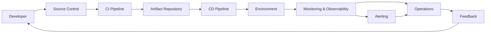

### 2.2 Stage Responsibilities

| Stage | Responsibility | Owner | Consistency with prior documents |
|---|---|---|---|
| **Developer** | Writes code, runs local gates, opens PRs; every change is a candidate for delivery | Engineering | SAD §22, FAG/BAG standards |
| **Source Control** | Single source of truth (monorepo, SAD §22.2); protected branches; history + attribution | Engineering/Platform | SAD §22.2, BAG Ch. 4 |
| **CI Pipeline** | Validates every change: static analysis, security, unit/integration/contract tests, build; produces immutable artifacts | CI Owner (DevOps/Platform) | TQS Ch. 15, BAG Ch. 25 |
| **Artifact Repository** | Versioned, signed, immutable deployables; provenance + checksums; retention policy | DevOps/Platform | BAG Ch. 25.3 |
| **CD Pipeline** | Promotes artifacts through environments with automated verification and gated approvals | DevOps/SRE | TQS Ch. 17–18 |
| **Environment** | Purpose-built runtime for each stage (dev/QA/staging/prod/preview/sandbox) with isolated data | DevOps/SRE/QA | TQS Ch. 17 |
| **Monitoring & Observability** | Metrics, logs, traces, audit; SLO-based alerting; dashboards per audience | SRE/DevOps | SAD §16, BAG Ch. 25.6 |
| **Operations** | Runbooks, incident response, capacity, security, backup/DR, release support | SRE/DevOps/Security | SAD §16.3, Ch. 15–16 of this document |
| **Feedback** | Post-release evidence, incident learnings, cost data, SLO reviews → product backlog | Engineering/Product/SRE | TQS Ch. 18.8 |

### 2.3 Delivery Flow (End to End)

```mermaid
flowchart LR
    PR[PR / push] --> STATIC[Static: lint, format, type, imports, secrets]
    STATIC --> UNIT[Unit + component]
    UNIT --> INT[Integration + contract]
    INT --> SEC[Security: SAST, deps, secrets]
    SEC --> BUILD[Build immutable artifacts]
    BUILD --> PREV[Preview env + ephemeral test env]
    PREV --> QAENV[QA]
    QAENV --> STG[Staging: release candidate, full gates]
    STG --> APPROVE[Release approval]
    APPROVE --> CANARY[Canary deploy]
    CANARY --> EXPAND[Blue-green / full roll-out]
    EXPAND --> POST[Post-release validation]
```

### 2.4 Ownership Boundaries

| Domain | Owned by |
|---|---|
| Pipelines, artifact repository, environments, infrastructure-as-code, secrets, monitoring platform | **DevOps/Platform** |
| SLOs, alerting, on-call, runbooks, incident command, capacity, DR | **SRE** |
| Image/content trust, scanning, vulnerability management, access reviews | **Security** |
| Release coordination, approval gates, feature readiness | **Release Manager / QA** |
| Deployable boundaries and runtime contracts (health endpoints, metrics ports) | **Engineering (BAG/FAG owners)** |
| Cost budgets and efficiency | **Finance + Engineering + DevOps** |

---

## 3. Environment Strategy

### 3.1 Strategy Overview

Environments are **purpose-built, promotion-aligned, and data-managed** so that verification at each stage reflects what will actually reach production (BAG Ch. 25.1, TQS Ch. 17). The same immutable artifact is promoted; environments differ only in configuration and data.

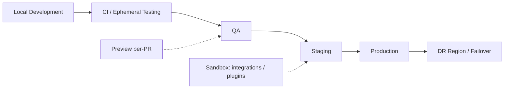

### 3.2 Environment Catalogue

| Environment | Purpose | Deploy policy | Data policy | Isolation |
|---|---|---|---|---|
| **Local Development** | Developer inner-loop; dockerized dependencies (Mongo, Redis, queue, search, storage) | None (local) | Local seeds, deterministic | Per-developer machine |
| **Development** | Integration; feature flags on; continuous delivery of `main` | Auto on merge | Dev fixtures + synthetic | Shared but disposable |
| **Testing (CI, ephemeral)** | Per-PR/nightly verification in a clean room | Ephemeral per PR; destroyed on merge/close | Factories + fixtures; no prod data | Disposable, parallel-safe |
| **QA** | Manual + exploratory + acceptance testing | Promotion after CI green | Anonymized snapshot (subset) + seeds; weekly refresh | Stable, realistic |
| **Staging** | **Release candidate**; production-shaped data + config; perf/chaos/DR rehearsal | Automated after QA gate + manual approval | Anonymized snapshot (full shape); weekly refresh | Production-like topology |
| **Production** | Customers | Canary/blue-green after staging gate + approval | Real | Hard isolation, least privilege |
| **Preview** | Per-PR visual/UX review (FAG-driven), a11y spot checks, PM feedback | Auto per PR; auto-destroyed | Ephemeral seeds | Isolated per PR |
| **Sandbox** | External provider integrations (calendar, webhooks) and plugin development | On demand | Synthetic + integration fixtures; no prod data | Isolated credentials |
| **DR / Failover** | Recovery target in a secondary region (Phase 2+) | Promoted from validated backup | Replicated/promoted production data | Isolated region |

### 3.3 Data Policy

| Environment | Data source | Refresh | Guard |
|---|---|---|---|
| Local Development | Local seeds | On demand | No production data |
| Development | Dev fixtures | On demand | No production data |
| Testing/CI | Factories + fixtures | Per run | No production data |
| QA | Anonymized snapshot (subset) + seeds | Weekly | Anonymization verified |
| Staging | Anonymized snapshot (full shape) | Weekly | Anonymization verified; config guard |
| Sandbox | Synthetic + integration fixtures | On demand | No production data |
| Production | Real | N/A | Least-privilege read-only for QA tooling |

Rules (per TQS Ch. 17.9):

- No production data in development/CI; no development data in staging (config guard).
- Anonymization must respect DDD §13.3: member-private execution data is irreversibly transformed and never member-identifiable.
- Test-data version matches schema/contract version (TQS Ch. 16.8).

### 3.4 Deployment Policy per Environment

| Environment | Trigger | Approval | Verification |
|---|---|---|---|
| Development | Auto on merge to `main` | None | CI gates + smoke |
| QA | Promotion of passing CI | QA lead | Smoke + exploratory |
| Staging | Promotion of QA-passing candidate | Release Manager | Full gates + chaos subset + migration rehearsal |
| Production | Staging-green candidate | Release approval (evidence + risk sign-off) | Canary → blue-green → post-release validation |

Promotion is **automated** per environment — there are no manual production deploys outside the pipeline (BAG Ch. 25.1).

### 3.5 Configuration per Environment

- Typed, validated configuration via Zod schema at boot — fail fast (BAG Ch. 25.4).
- Environment-specific values injected at deploy time; secrets never in config files (Ch. 8).
- Config drift detection between staging and production: the same artifacts must differ only by env values (TQS Ch. 17.10).
- Feature flags per environment matrix (dev/QA/staging/prod) with kill-switch capability (TQS Ch. 18.6).

### 3.6 Promotion Strategy

1. Artifact built once, verified in CI, stored immutable.
2. Promote the **same artifact** through QA → staging → production. Never rebuild for an environment.
3. Each promotion runs the environment's verification suite and records evidence (test results, checksums, timestamps, approver).
4. Production promotion is canary/blue-green with watch window (Ch. 6).
5. Any promotion failure halts promotion; the release candidate is either fixed (new artifact) or rolled back.

### 3.7 Isolation

- **Data isolation:** each environment has its own data stores; no environment shares production state.
- **Network isolation:** non-production environments are segregated; staging mirrors production topology but is not reachable from production.
- **Credential isolation:** each environment has its own secret set; cross-environment credential reuse is blocked (Ch. 8).
- **Tenant isolation:** within production, workspace partitioning (workspaceId) and the DDD §13.3 privacy boundary are enforced structurally (SAD §17.4) — the operational layer preserves, never weakens, this.

### 3.8 Environment Ownership

| Environment | Owned by | Change authority |
|---|---|---|
| Local / Development / Preview | Engineering | Self-service via pipeline |
| CI / ephemeral | DevOps/QA | Pipeline definition |
| QA | QA | QA lead |
| Staging | SRE/DevOps | Release Manager + SRE |
| Production | SRE | Change management (Ch. 19) |
| Sandbox / DR | DevOps/SRE/Security | Platform team |

---

## 4. Infrastructure Architecture

### 4.1 Overview

FocusFlow deploys as containers on a managed orchestration platform (assumed Kubernetes; any equivalent works — SAD §19.1). All components are **ephemeral**; state lives in **managed data services**. This chapter defines topology and responsibilities, not YAML (SAD §19.1).

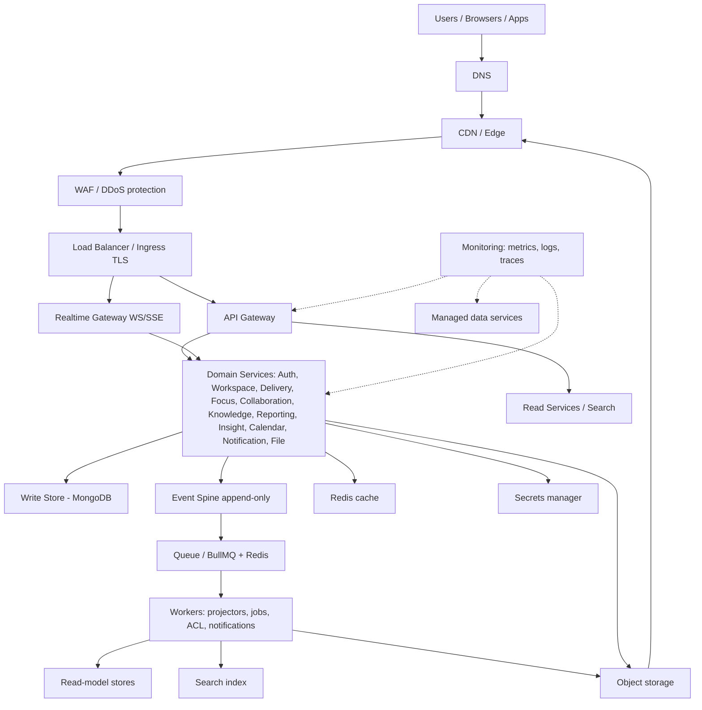

### 4.2 Component Responsibilities

| Component | Responsibility | Statefulness | Prior-doc anchor |
|---|---|---|---|
| **Frontend Hosting** | Static SPA (hashed, immutable assets) served from CDN + HTML shell + config injection (FAG Ch. 25) | Stateless | FAG Ch. 25, SAD §4 |
| **Backend Services** | Stateless application services per bounded context (SAD §5.2 catalog); commands → domain; reads → read models | Stateless | SAD §5, BAG Ch. 5 |
| **API Gateway** | AuthN/AuthZ boundary, validation, rate limiting, routing, command/RPC translation, TLS termination | Stateless | SAD §5.1, AIS |
| **Realtime Gateway** | WS/SSE fan-out of events to clients; presence | Stateless (in-memory rooms re-established on restart) | SAD §14, BAG Ch. 13 |
| **Write Store (MongoDB)** | Strongly consistent aggregates; single-aggregate transactions + outbox | **Stateful** | DDD §2.4, BAG Ch. 9.6 |
| **Event Spine** | Append-only, immutable event record; source of truth for derived state and audit | **Stateful** | DDD §8, SAD §7 |
| **Read-Model Stores** | Materialized projections (dashboards, boards, timelines, snapshots) | **Stateful (rebuildable from spine)** | DDD §7, SAD §9 |
| **Search Index** | Derived inverted index; per-workspace shards; vector index reserved (future) | **Stateful (rebuildable)** | DDD §9–10, SAD §11 |
| **Cache (Redis)** | Read-model cache, rate-limit counters, presence, feature flags, sessions | Stateful (rebuildable) | BAG Ch. 18 |
| **Queue System (BullMQ/Redis)** | Background jobs, projectors, notifications, ACL outbound | Stateful (operational continuity) | SAD §13, BAG Ch. 14 |
| **Object Storage** | Attachments, files, exports, report assets | **Stateful** | SAD §12 |
| **Monitoring / Metrics** | RED + domain metrics, dashboards, SLO burn-rate alerts | Stateful (ops) | SAD §16 |
| **Logging** | Structured log aggregation, retention, search | Stateful (ops) | SAD §16.1 |
| **Tracing** | Distributed traces across gateway → service → store → worker → external ACL | Stateful (ops) | SAD §16.1 |
| **Secrets** | Managed secret store; encryption keys; rotation | **Stateful (critical)** | BAG Ch. 21.3 |
| **Networking** | VPC/network isolation, security groups, private endpoints for data | Stateless (config) | BAG Ch. 21 |
| **CDN** | Static asset delivery, TLS, edge caching | Stateless | FAG Ch. 25 |
| **DNS** | Names, records, failover routing | Config | This document |
| **Load Balancer / Ingress** | TLS, traffic distribution, health-based routing | Stateless | SAD §19.1 |

### 4.3 Deployment Architecture

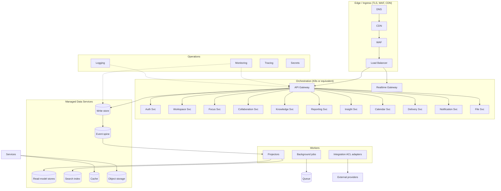

### 4.4 Runtime Data Flow

| Flow | Path | Consistency |
|---|---|---|
| **Read** | Client → CDN → LB → Gateway → read-model store → cached client | Eventually consistent (fresh < 5s, SAD §17.3) |
| **Write** | Client → Gateway → service → domain → write store (+ outbox event) → spine → projectors | Strong on write; eventual on reads |
| **Realtime** | Spine event → realtime gateway → WS/SSE to clients | Near real time (< 1s, SAD §17.3) |
| **Background** | Spine → queue → worker → side-effect (idempotent, at-least-once) | At-least-once |
| **Offline write** | Client queue → sync endpoint → domain (same write path) | Resolved on reconnect (SAD §15) |

### 4.5 Zero-Downtime Principle

- All application components are stateless; deploys are rolling/blue-green with health checks before traffic cutover (SAD §19.3).
- Migrations are versioned, additive, backward-compatible, and rehearsed on staging (BAG Ch. 25.5).
- Realtime clusters drain during deploys; rooms are re-established (BAG Ch. 25.8).
- Nothing required for recovery lives in application containers (SAD §19.3).

### 4.6 Future Kubernetes

- Kubernetes orchestration is a **future ops decision**, not an architecture change (BAG Ch. 25.9, SAD ADR 15).
- The platform stays orchestration-agnostic because services are stateless; when adopted, node pools map to workload classes (services, workers, realtime) and HPA scales workers by queue depth (Ch. 14).
- This document treats "managed orchestration platform" as the contract; K8s is one implementation, not a requirement.

### 4.7 Future Multi-Region

- Multi-region is additive (Ch. 21, Phases 2–3): per-region stateless service fleets behind global DNS + traffic manager; primary region hosts write state; secondaries host read replicas and serve read/read-model traffic.
- The workspace-isolation and privacy guarantees (SAD §17.4) are preserved: partitioning by workspaceId extends to regional placement without architectural change.

---

## 5. CI Strategy

### 5.1 Principles

CI makes every change a **verified, immutable candidate for delivery**. The pipeline is the enforcement point for the quality gates defined in TQS Ch. 15. Nothing ships to any environment that has not passed CI.

```mermaid
flowchart LR
    PUSH[Push / PR] --> STATIC[Static: format, lint, type, imports, secrets]
    STATIC --> UNIT[Unit + component + coverage]
    UNIT --> INT[Integration + contract + drift]
    INT --> SEC[Security: SAST, dependency, secrets]
    SEC --> PERF[Perf budget (alert-level)]
    PERF --> BUILD[Build + validate immutable artifacts]
    BUILD --> STORE[Store in artifact repository]
    BUILD --> PREV[Deploy preview]
    BUILD --> TESTENV[Deploy ephemeral test env]
    TESTENV --> APIE2E[API + E2E + a11y]
    APIE2E --> NIGHTLY[Nightly: full perf + security + soak]
```

### 5.2 CI Stages and Gates

| Stage | What it verifies | Blocking | Owner | Prior-doc anchor |
|---|---|---|---|---|
| Formatting | Prettier-style consistency | Yes | Developer | FAG Ch. 23, BAG Ch. 24 |
| Linting | Static style + import rules (module boundaries) | Yes | Developer | SAD §22.4, BAG Ch. 5 |
| Type checking | TypeScript correctness across monorepo | Yes | Developer | SAD §22.4 |
| Static analysis (SAST) | Code-level vulnerabilities, taint, injection | Yes | Security | TQS Ch. 15.7 |
| Dependency scanning | Known-vulnerability check on lockfile; drift | Yes | Security | TQS Ch. 15.7 |
| Secret scanning | No secrets/tokens in code or build output | Yes | Security | TQS Ch. 15.7 |
| Unit + component tests | Domain invariants, application services, components | Yes | Developer/QA | TQS Ch. 5–6 |
| Coverage gate | Minimum coverage on changed code / overall | Yes | Developer/QA | TQS Ch. 6 |
| Integration tests | Adapter/port behavior with real dependencies (testcontainers) | Yes | Developer/QA | TQS Ch. 6 |
| Contract tests | API contract conformance; drift detection | Yes | Developer/QA | TQS Ch. 7, AIS |
| Accessibility (static/component) | WCAG 2.2 AA automated checks | Yes | Developer/QA | TQS Ch. 12 |
| Perf budget | Bundle size, hot-path budget regressions | Alert on PR; block at release | SRE/Perf | SAD §17.3, TQS Ch. 13 |
| Build validation | Reproducible, immutable, signed build; no secrets baked; size checks | Yes | DevOps | TQS Ch. 15.9, BAG Ch. 25.3 |
| API + E2E | Critical journeys in ephemeral env | Release gate + nightly | QA | TQS Ch. 15.10 |
| Migration dry-run | Additive migrations apply cleanly; rollback plan valid | Yes | DevOps/Backend | BAG Ch. 25.5 |

### 5.3 Artifact Creation

- The monorepo produces deployable packages per SAD §22.2 and BAG Ch. 25.3: gateway, services (Auth, Workspace, Delivery, Focus, Collaboration, Knowledge, Reporting, Search, Insight, Calendar, Notification, File), workers (projectors, jobs, ACL), realtime gateway, and the static frontend bundle.
- Multi-stage builds with **distroless** runtime images (BAG Ch. 25.3).
- Immutable tags + checksum verification; images signed where feasible (BAG Ch. 25.3).
- No secrets baked into images (env-injected, BAG Ch. 21.3).
- Every artifact records provenance: commit SHA, build job, trigger, inputs, checksum, signer.

### 5.4 Quality Gates

- A PR cannot merge if any blocking gate fails (SAD §22.4).
- Gate matrix (TQS Ch. 15.11) defines which gates run per-commit, per-PR, nightly, and at release.
- Flaky tests are defects: quarantined + fixed under SLA; unquarantined failures block (TQS Ch. 15.12).

### 5.5 Approval Workflow

- **Per-commit/per-PR:** automated gates only; required code review (branch protection).
- **Release:** approval by Release Manager with evidence bundle (gates, test results, risk sign-off from Security and Tech Leads, rollback plan) — TQS Ch. 18.
- **Emergency hotfix:** documented fast path with reduced-but-never-zero gates (static + smoke minimum), expedited approval, canary-minimum (TQS Ch. 18.9).

### 5.6 Branch Policies

- `main` is protected: no direct pushes; PRs only; all blocking gates green; linear history preferred.
- Release branches (`release/*`) created at release-cut; hotfix branches (`hotfix/*`) off the release branch for emergency fixes.
- Feature flags gate unfinished work — code merges dark; surfaces enable by flag (SAD §19.2, TQS Ch. 18.4).

### 5.7 Pull Request Validation

Every PR must:

- Pass static, unit, integration (affected), contract, security, a11y, perf-alert, and build gates.
- Pass in a clean ephemeral environment (no local-only green) — TQS Ch. 17.3.
- Deploy a preview environment for visual/UX/a11y review where UI is affected (TQS Ch. 17.7).
- Include a migration dry-run when schema-affecting.
- Pass the module-import rule check (bounded-context isolation, SAD §22.2).

### 5.8 CI Performance & Developer Experience

- Fine-grained caching and parallelism for the monorepo (SAD R8 mitigation).
- Affected-only builds/tests (changed-package graph) to keep CI fast.
- Cache of dependencies and build outputs keyed by content hash.
- Nightly full-suite runs for suites too slow for per-PR.

---

## 6. CD Strategy

### 6.1 Principles

CD delivers **verified, immutable artifacts** to environments with automated verification and gated approvals, using progressive deployment so risk is controlled and rollback is instant (TQS Ch. 18).

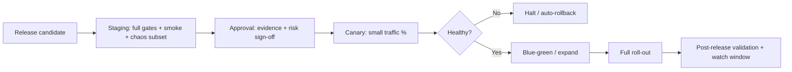

### 6.2 Deployment Models

| Model | Use | Mechanics | Rollback |
|---|---|---|---|
| **Rolling** | Routine low-risk services | Replace pods incrementally; health checks gate the next batch | Revert to previous artifact |
| **Blue-Green** | Frontend, gateway, major releases | Two full environments; switch traffic; immediate revert by router/DNS flip (TQS Ch. 18.7) | Instant router flip |
| **Canary** | Risky features, service changes | Route small % of traffic; observe error rate/latency/RUM; expand or halt (TQS Ch. 18.6) | Halt/redirect |
| **Immutable redeploy (rollback)** | Any | Rollback = redeploy the prior immutable tag (BAG Ch. 25.8) | Native |

### 6.3 Automatic vs. Manual

| Deployment | Automation | Approval |
|---|---|---|
| Development | Fully automatic on merge | None |
| QA | Automatic after CI green | QA lead |
| Staging | Automatic after QA gate | Release Manager |
| Production | Pipeline-driven canary/blue-green | Release approval (evidence + risk) |

### 6.4 Progressive Deployment

1. Deploy to canary (small percentage, e.g., 1–5%).
2. Watch window with automated + human gates: error rate, latency, RUM, realtime health (push latency, reconnect) — TQS Ch. 18.6.
3. If healthy, expand through blue-green to full.
4. Post-release validation per TQS Ch. 18.8 (smoke, synthetic, watch window, soak 24–72h).

### 6.5 Rollback

- Rollback = redeploy the previous immutable tag; state compatibility guaranteed by **additive, backward-compatible migrations** (BAG Ch. 25.5, TQS Ch. 18.5).
- Realtime/queue drain during rollback; cursors resume.
- Rollback rehearsed in staging before every release; rollback runbook current (TQS Ch. 18.5).
- A rollback is always recorded and post-incident-reviewed; the trigger conditions (SLO breach, error spike, data anomaly) are documented.

### 6.6 Feature Flags

- Feature flags via a versioned flag service (Redis-backed, BAG Ch. 25.4); used for staged rollouts, kill-switches, A/B.
- Flags are code-reviewed like code; expired flags removed (no dead branches).
- Flag behavior tested: on/off/percentage states (TQS Ch. 18.6).
- Kill-switch paths tested before release; every new surface ships dark and enables by flag (SAD §19.2).

### 6.7 Release Promotion

1. Release candidate tagged (`vX.Y.Z`) with changelog.
2. Promotion through QA → staging with evidence recorded at each step.
3. Staging green (full gates + smoke + chaos subset) is a hard prerequisite for production (TQS Ch. 17.5).
4. Production promotion via canary/blue-green with watch window.
5. Post-release report feeds the backlog (TQS Ch. 18.8).

### 6.8 Hotfix Strategy

- Documented emergency path: small patch, full static + smoke gates (reduced but never zero), expedited approval, canary-minimum, watch window (TQS Ch. 18.9).
- Hotfixes respect schema compatibility and rollback; learnings fed back to prevent recurrence.
- Hotfix branches are merged back to `main` to avoid drift.

### 6.9 Emergency Deployment

- Reserved for P1 production incidents requiring immediate mitigation.
- Triggers the incident process (Ch. 16); deployment is approved by the incident commander; smoke + canary-minimum still apply.
- After stabilization, a full post-incident review produces a permanent fix through the normal pipeline.

---

## 7. Configuration Management

### 7.1 Principles

Configuration is **typed, validated, environment-specific, versioned, and audited**. Code is never modified for an environment; environments are expressed as configuration (TQS Ch. 17.10, BAG Ch. 25.4).

### 7.2 Configuration Hierarchy

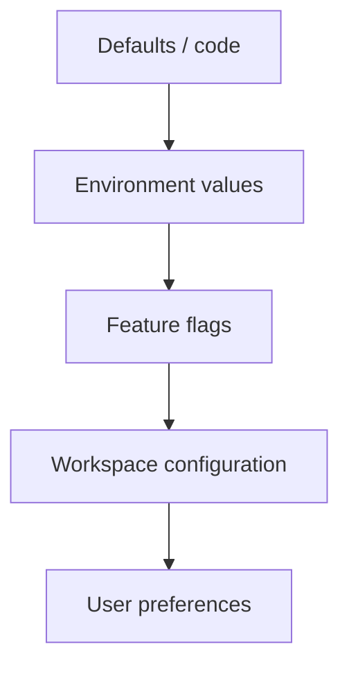

| Level | Example | Who sets | Where stored |
|---|---|---|---|
| **Defaults / code** | Schema, constants, safe defaults | Engineering | Repo (versioned) |
| **Environment values** | API URLs, log level, feature-flag endpoints | DevOps | Deploy-time injection (env) |
| **Feature flags** | Rollout %, kill-switches, surface enablement | Platform/Product | Flag service (Redis) |
| **Workspace configuration** | Timezone, working days, templates, branding, integrations | Admin/Owner | Application data (WPS §17.1) |
| **User preferences** | Theme, favorites, recents, layouts | User | Application data (DDD §5.4) |

### 7.3 Environment Variables

- All environment-specific values via typed env schema (Zod-validated at boot — fail fast, BAG Ch. 25.4).
- Never secrets in plaintext env files committed to the repo (Ch. 8).
- Env schema is versioned with the code; a config missing a required key fails boot, not runtime.

### 7.4 Application Configuration

- Config schema is centralized and versioned; per-package subsets are derived for each deployable.
- Config drift detection between staging and production: same artifacts, differing only by env values (TQS Ch. 17.10).
- Config changes are reviewed like code; config changes to production follow change management (Ch. 19).

### 7.5 Feature Flags

| Aspect | Policy |
|---|---|
| Storage | Versioned flag service (Redis-backed, BAG Ch. 25.4) |
| Lifecycle | New surface ships off; enables by flag; expires removed |
| Rollout | Percentage-based staged rollouts + kill-switch |
| Review | Flags reviewed like code |
| Test | On/off/percentage states tested (TQS Ch. 18.6) |

### 7.6 Workspace Configuration

- Workspace-scoped settings (timezone, working days, defaults, branding, templates, integration connections) are **application data**, owned by Admin/Owner (WPS §17.1, DDD §3.2).
- These are not infrastructure config; they are versioned and audited by the application layer.

### 7.7 AI Configuration

- AI enablement is per-workspace and opt-in; every AI interaction is audited; capability-scoped tokens (SAD §21.3).
- AI provider configuration (endpoints, keys, model selection, guardrails) is secrets-backed (Ch. 8) and feature-flagged.
- Graceful degradation: a failing provider never affects core functionality (SAD §21.3) — config ensures isolation.

### 7.8 Integration Configuration

- Per-integration, per-workspace configuration (OAuth scopes, webhook URLs, event toggles) is application data (DDD §3.2 IntegrationConnection).
- Webhook secrets per integration per workspace; signature validation mandatory (SAD §18.4).
- Integration credentials are encrypted and revocable (Ch. 8).

### 7.9 Validation

- Boot-time Zod validation of the full config; fail fast.
- Schema-versioned config; drift detection automated between environments.
- Runtime validation of feature-flag values against known enum/schema.

### 7.10 Versioning & Audit

- Config schema versioned with code; env templates versioned in repo.
- Flag changes logged with actor + timestamp; workspace config changes audited as ActivityEvents (DDD §8).
- Every config change to non-production and production is reviewable through the change log.

---

## 8. Secrets Management

### 8.1 Principles

Secrets are **never in code, images, logs, or plaintext config**. They live in a managed secrets service with encryption, access control, rotation, and audit (BAG Ch. 21.3).

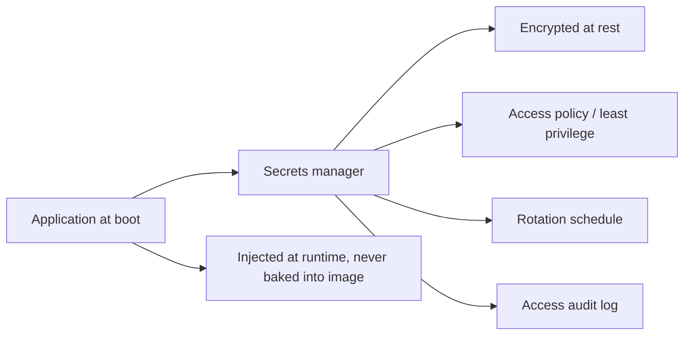

### 8.2 Secret Catalogue

| Secret | Sensitivity | Storage | Rotation |
|---|---|---|---|
| API keys (integrations, AI providers) | High | Secrets manager | On exposure / scheduled |
| JWT signing secrets | High | Secrets manager (dedicated) | Scheduled; dual-key overlap |
| OAuth credentials (providers) | High | Secrets manager; scoped tokens | On provider policies |
| Database credentials | Critical | Secrets manager; private network | Scheduled; per-app credentials |
| Cloud storage credentials | High | Secrets manager; IAM-preferred | On exposure / scheduled |
| SMTP credentials | Medium | Secrets manager | On exposure / scheduled |
| Webhook secrets | Medium | Secrets manager; per-integration | On exposure / rotation |
| Encryption keys (at-rest, data) | Critical | Managed key service (KMS) | On policy; never in app memory long-term |

### 8.3 Access Policy

- **Least privilege:** each service/worker/realtime component receives only the secrets it needs (per-deployable scoped access).
- **Environment-isolated:** each environment has its own secret set; cross-environment credential reuse is blocked.
- **Human access:** break-glass access only, time-boxed, dual-approved, and fully audited.
- **No plaintext:** secrets are injected at runtime; never baked into images (BAG Ch. 25.3); never echoed to logs (SAD §16.1 redaction).

### 8.4 Rotation

| Secret | Rotation cadence | Overlap |
|---|---|---|
| JWT signing keys | Scheduled (e.g., quarterly) + on suspicion | Dual-key window allows token validity across rotation |
| Database credentials | Scheduled + on exposure | Zero-downtime via dual-user rotation |
| Provider OAuth tokens | Per provider refresh lifecycle | Managed by Integration Manager (SAD §18.4) |
| Webhook secrets | Scheduled + on suspected compromise | Signature validation on both keys during overlap |
| Encryption keys | Per key policy | Key-version rotation with envelope encryption |

### 8.5 Encryption Keys

- At-rest encryption for all data; attachments encrypted at rest (DDD §13.4).
- Keys in a managed key service; app code never holds long-lived raw keys.
- Envelope encryption: data keys wrapped by master keys; rotation re-wraps, not re-encrypts.

### 8.6 Audit

- Every secret access (who, when, which secret, from which component) is logged.
- Rotation, exposure reports, and break-glass access are audited and reviewed (Ch. 20).
- Secret scanning in CI catches accidental commits (TQS Ch. 15.7).

---

## 9. Monitoring Strategy

### 9.1 Principles

Monitoring answers "is the system healthy, and why not?" It is **SLO-driven, layered (application/infra/business/user), and privacy-safe** (SAD §16: observability never ingests raw Focus & Time execution data — only anonymized aggregates).

### 9.2 Monitoring Architecture

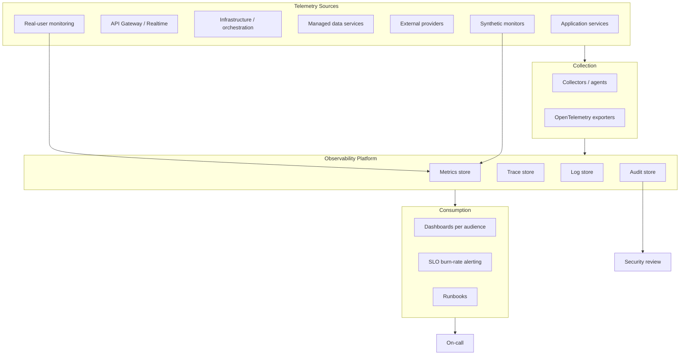

### 9.3 Monitoring Layers

| Layer | What it watches | Examples | Prior-doc anchor |
|---|---|---|---|
| **Application** | Service health, RED, domain metrics | Latency p50/p95/p99, error rate, throughput, event rates, projection lag, queue depth | SAD §16.2 |
| **Infrastructure** | Compute, network, storage, orchestration | CPU/mem, pod health, node pool, disk, network I/O, DNS/TLS, CDN origin health | SAD §19 |
| **Business** | Product adoption and health | Active workspaces, sessions, feature throughput, Mission Control usage, reports generated | WPS/UXS usage patterns |
| **User** | Real-user experience | RUM (LCP, CLS, INP, FCP), page errors, realtime delivery latency, offline sync latency | FAG Ch. 16, SAD §17.3 |
| **Realtime** | Live collaboration health | WS/SSE delivery p95, connect/reconnect, presence freshness, fan-out lag | SAD §14, §16.2 |
| **AI** | AI service health (future/guarded) | Provider latency, error rate, guardrail rejections, audit counts | SAD §21 |
| **Background jobs** | Queue health | Queue depth, DLQ count, job duration, retry/backoff, worker saturation | SAD §16.2, BAG Ch. 14 |
| **Queue** | BullMQ/Redis | Depth by queue, age of oldest, stalled jobs, dead-letter growth | BAG Ch. 14 |
| **Database** | Write store, read stores | Replication lag, cache hit rate, slow queries, connection saturation, backup success | DDD §7, Ch. 12 of this document |
| **Search** | Index health | Index lag, query p95, shard health, reindex progress | SAD §11 |
| **Cache** | Redis health | Hit rate, memory, eviction, latency | BAG Ch. 18 |

### 9.4 Dashboard Strategy

Dashboards are per-audience (SAD §16.3):

| Audience | Dashboards |
|---|---|
| **Engineering (RED)** | Per-service latency/error/throughput; event spine; projection lag; queue; search; realtime |
| **Product** | Adoption, mission-control usage, report generation, activation |
| **Security** | Auth/audit anomalies, failed access, privilege changes, secret rotations |
| **SRE/Operations** | SLO burn, error budget, capacity, backup/DR status, cost |

### 9.5 Health Indicators

| Indicator | Definition | Source |
|---|---|---|
| Service readiness | Liveness/readiness endpoints pass; no dependency degradation | Health endpoints (Ch. 11.4) |
| Dependency health | DB, Redis, search, queue, object storage, external ACLs | Health endpoints + probes |
| Projection lag | Read-model freshness vs. event spine (target p95 < 5s, SAD §17.3) | Metrics |
| Realtime health | Delivery p95 < 1s (SAD §17.3) | Metrics |
| Queue health | Depth within budget; DLQ zero (alert) | Metrics |
| Error budget | Burn within SLO allowance | Metrics (Ch. 11) |

### 9.6 Alerting

- Alerts are **SLO-based (burn-rate)** with severity tiers; DLQ and security events page immediately (SAD §16.3).
- Alert routing to on-call with escalation paths for P1/P2 (BAG Ch. 25.6).
- Every alert links to a runbook (Ch. 16); alerts without runbooks are a defect.

---

## 10. Logging Strategy

### 10.1 Principles

Logs are **structured, correlated, privacy-safe, searchable, and retained by policy**. They are evidence for debugging, security, and audit (SAD §16.1).

### 10.2 Structured Logging

- JSON-structured logs with consistent fields: timestamp, level, service, instance, trace/correlation IDs, workspaceId (scoped), event/request metadata.
- PII and private execution data redacted at source — never log tokens or member-private data (SAD §16.1).

### 10.3 Correlation IDs & Request IDs

- Every request carries a correlation ID spanning gateway → service → domain → store → worker → external ACL.
- Every event and job carries the originating correlation/trace ID (SAD §7.1 metadata).
- Offline sync operations carry client-supplied IDs to join server logs with client telemetry.

### 10.4 Log Types

| Type | Content | Retention |
|---|---|---|
| **Request logs** | HTTP method/path/status/duration/correlation | 30 days (summarized after) |
| **Event logs** | Event type, aggregate, workspaceId, actor | 90 days (policy; spine is the durable record) |
| **Job logs** | Job type, queue, duration, retries, result | 30 days |
| **Application logs** | Service runtime, errors, warnings | 30 days |
| **Security logs** | Auth events, failed access, privilege changes, secret access/rotation, exports, shares | 1 year (policy) |
| **Audit logs** | Append-only ActivityEvents projection for compliance | Per policy; cold storage after retention (DDD §13.4) |
| **Infrastructure logs** | Orchestration, network, storage events | 90 days |

### 10.5 Log Levels

| Level | Use |
|---|---|
| DEBUG | Troubleshooting only; sampled heavily or disabled in prod |
| INFO | Normal lifecycle events (started, request summaries) |
| WARN | Degradation, retries, rate-limit hits, circuit opens |
| ERROR | Failed operations, exceptions, job failures |
| FATAL | Process-fatal conditions (page immediately) |

### 10.6 Sampling

- High-volume DEBUG/INFO sampled (e.g., 1–10%) in production; ERROR and above always captured.
- Security and audit logs are never sampled.
- Realtime/heartbeat logs suppressed or aggregated (presence is transient, DDD §3).

### 10.7 Retention & Privacy

- Retention per table above; analytics history summarized before purge (DDD §13.4).
- Raw Focus & Time execution data is never shipped to the log platform — only anonymized aggregates (SAD §16.1).
- Log access is role-gated; export is audited (Ch. 20).

### 10.8 Searchability

- Logs are indexed for search: correlation ID, service, level, time, workspaceId, error code.
- Log search supports incident triage workflows; error triage views aggregate by signature.

### 10.9 Logging Pipeline

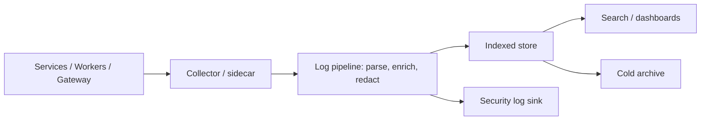

---

## 11. Observability

### 11.1 The Three Pillars + Audit

| Pillar | Practice | Prior-doc anchor |
|---|---|---|
| **Metrics** | RED (rate/errors/duration) per service + domain metrics (events/s, projection lag, queue depth, sync latency) | SAD §16.1 |
| **Traces** | Distributed tracing across gateway → service → domain → store → worker → external ACL | SAD §16.1 |
| **Logs** | Structured, correlation-ID tagged; PII redacted at source | SAD §16.1 |
| **Audit** | Append-only audit log for security + compliance | SAD §16.1, DDD §8 |

### 11.2 Metrics

Standard service metrics (OpenTelemetry-aligned):

- `http.request.duration` (p50/p95/p99), `http.requests.total`, `http.errors.total`
- `event.publish.total`, `projection.lag` (seconds), `projection.progress`
- `queue.depth`, `queue.age`, `queue.stalled`, `queue.dlq`
- `realtime.delivery.latency` (p95), `realtime.connections`, `realtime.reconnects`
- `sync.reconciliation.latency`, `search.query.duration` (p95), `search.index.lag`
- `db.replication.lag`, `db.slow_queries`, `cache.hit_ratio`
- `backup.success`, `restore.success`, `dr.last_drill`

### 11.3 Tracing

- Distributed traces with parent/child spans across all hops (AIS-correlated).
- Sampling: tail-based sampling retains error + slow traces fully; representative sampling of healthy traces.
- Trace IDs = correlation IDs; join logs, metrics, and audit by ID.

### 11.4 Health Endpoints

- **Liveness:** process alive (no external dependency checks).
- **Readiness:** dependency health (DB, Redis, search, queue, object storage) + internal readiness (migrations applied, outbox draining).
- **Dependency health:** per-dependency status/latency so orchestrators and dashboards can isolate root cause.
- Health endpoints are used for rolling/blue-green cutover gates (Ch. 4.5, 6).

### 11.5 Service Health

- A service is **healthy** when: liveness passes, readiness passes, no error budget breach, projection/queue metrics within budget, dependency health green.
- SLO dashboards aggregate service health into a single operational view.

### 11.6 Synthetic Monitoring

- Synthetic checks run against production (and staging) at cadence: login, workspace load, board read, feature create, realtime message, search, report generation.
- Synthetics validate the full path (edge → gateway → service → data) and alert on availability/latency SLOs.

### 11.7 SLIs

| Surface | SLI |
|---|---|
| API availability | % of valid requests served successfully |
| API latency | % of requests under p95 budget |
| Read-model freshness | % of reads served within projection-lag budget |
| Realtime delivery | % of events delivered under p95 budget |
| Search | % of queries under latency budget with correct results |
| Sync | % of offline reconciliations within budget |
| Worker/queue | % of jobs completed without exceeding age budget |

### 11.8 SLOs

Targets (align with SAD §17.3 budgets and TQS):

| SLO | Target (window) |
|---|---|
| API availability (production) | 99.9% (30-day) |
| API read latency p95 | < 300 ms |
| Write ack latency p95 | < 500 ms |
| Realtime event → client p95 | < 1 s |
| Projection lag p95 | < 5 s |
| Search query p95 | < 500 ms |
| Backup success | 100% (drill-verified) |
| DR RTO | Target in Ch. 12 (e.g., RTO 4h, RPO 15 min) |

### 11.9 Error Budgets

- Error budget = (1 − SLO) over the window; burn measured continuously (burn-rate alerting).
- Error budget exhaustion policy: freeze risky releases, prioritize reliability work, review in SLO review cadence.
- Post-release error-budget review per TQS Ch. 18.8.

### 11.10 Operational Dashboards

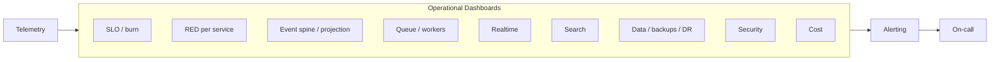

### 11.11 Synthetic + RUM

- RUM captures real-user vitals (LCP/CLS/INP), page errors, and API error rates (FAG Ch. 16).
- Synthetic monitors availability regardless of traffic; RUM monitors real experience.
- Both feed SLOs and release gates.

---

## 12. Backup & Recovery

### 12.1 Principles

Backups exist to make **recovery boring and verified**. Everything required to run the platform is either backed up or provably rebuildable (SAD §19.3).

| Asset | Backup policy | Rebuildable? |
|---|---|---|
| Write store (Mongo) | Periodic snapshots + point-in-time recovery; tested restore | No — must be restored |
| Event spine | Snapshot + replay capability (source of truth for read models) | Append-only; snapshot + WAL replay |
| Read-model stores | Rebuildable from event spine (projectors) — not backup-critical | Yes |
| Search index | Rebuildable from events | Yes |
| Cache (Redis) | Rebuildable; backup only for idempotency continuity | Yes |
| Object storage | Versioning + retention on bucket | No — versioned restore |
| Configuration | Versioned in repo + env templates | Yes |
| Secrets | Managed service replication + export per policy | Yes (managed) |
| Audit/Activity | Part of spine; cold archive after retention | Yes (append-only) |

### 12.2 Backup Coverage

- **Database:** full snapshot + incremental + point-in-time recovery logs (RPO 15 min target).
- **Object storage:** versioning enabled; retention policy; lifecycle to cold storage.
- **Configuration:** infra-as-code versioned; env templates versioned; drift detection.
- **Secrets:** managed replication; export per compliance policy; never plaintext at rest.

### 12.3 RPO / RTO Targets

| Metric | Target | Notes |
|---|---|---|
| **RPO (Recovery Point Objective)** | 15 minutes | Write store + spine point-in-time |
| **RTO (Recovery Time Objective)** | 4 hours (Phase 1); 1 hour (Phase 2+) | Restore + verification + traffic cutover |
| **DR drill cadence** | Quarterly (restore drill) | BAG Ch. 25.7 |
| **DR full drill** | Annually (region-level) | Ch. 13 |

### 12.4 Backup Flow

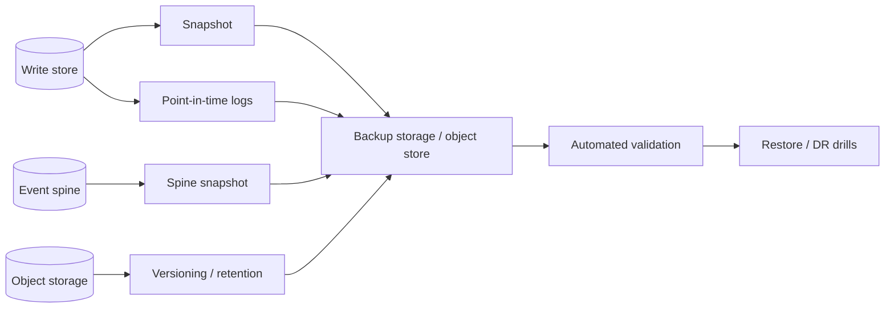

### 12.5 Restore Validation

- **Restore validation:** automated restore of a random recent backup to an isolated environment; integrity + application smoke checks.
- **Restore drills:** quarterly, documented runbook (BAG Ch. 25.7); measures actual RTO.
- **Data checks:** row/collection counts, checksums, sample application-level verification (login, board read, report).

### 12.6 Backup Verification

- Backup success monitored (metric `backup.success`); failures page on-call.
- Retention honored and verified (no silent truncation, DDD §13.4).
- Backup encryption verified (at-rest policy).
- Test-restore evidence recorded and reviewed (Ch. 20).

### 12.7 Archive Policy

- Activity/audit retained per policy, then archived to cold storage — never silently truncated while under audit requirements (DDD §13.4).
- Session/metric history summarized before purge (DDD §13.4).
- Archive is searchable/restorable; archive access is audited.

---

## 13. Disaster Recovery

### 13.1 Principles

DR is **documented, rehearsed, and tested**. Failures are expected; recovery is designed. Every failure mode has a runbook (Ch. 16) and a recovery workflow.

### 13.2 Failure Modes

| Failure | Impact | Recovery strategy | RTO target |
|---|---|---|---|
| Infrastructure (compute/node) | Service degradation | Stateless redeploy; orchestration self-healing | Minutes |
| Database failure | Writes/reads impaired | Failover to replica / restore from backup | Hours (RTO) |
| Region failure | Full platform outage | Failover to DR region (Phase 2+) | DR RTO |
| Storage failure | Files/attachments unavailable | Object-storage multi-AZ + versioned restore | Hours |
| Search failure | Search degraded | Rebuild index from events; degraded search UX | Hours |
| Realtime failure | Live collaboration degraded | Realtime gateway drain/re-establish; SSE fallback | Minutes |
| Queue failure | Background work stalls | Redis HA + job re-enqueue; DLQ inspection | Minutes–hours |
| AI service failure | AI surfaces unavailable | Feature-flag isolation; graceful degradation (SAD §21.3) | Minutes |
| Third-party integration failure | Integrations degrade | ACL isolation; circuit breaking; cached fallback | Minutes |

### 13.3 Regional DR (Phase 2+)

- Primary region hosts write state (write store, spine); secondary region hosts read replicas + read-model service fleet.
- Global DNS / traffic manager routes users; on regional failure, reads continue in the secondary and writes fail over via promoted replica.
- Workspace partitioning (workspaceId) enables per-workspace regional placement without redesign (SAD §17.4).

### 13.4 DR Flow

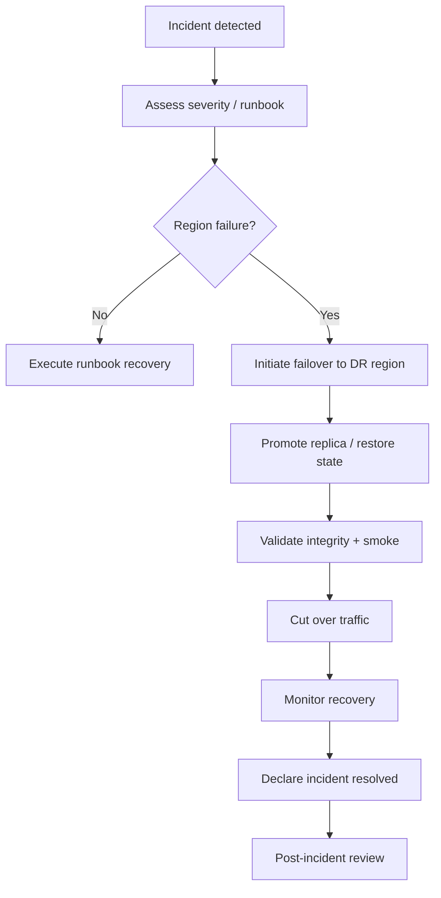

### 13.5 Recovery Workflow

1. Detect (alert) → assess severity → declare incident (Ch. 16).
2. Select the runbook for the failure class.
3. Execute immediate actions; keep the customer informed (communication plan below).
4. Restore or fail over; validate integrity + smoke before traffic cutover.
5. Cut over traffic; monitor; declare resolved; write post-incident review.

### 13.6 Failover Strategy

- **Replica failover:** for database/search/queue — automated promotion where supported, manual with dual approval otherwise.
- **Region failover:** traffic-manager switch with rehearsed runbook; DNS TTL tuned for fast cutover.
- **Stateless failover:** any healthy region/pool serves read + stateless traffic instantly.

### 13.7 Communication Plan

| Audience | When | Channel |
|---|---|---|
| Customers | Status page update at detection + within 15 min | Status page, in-app banner |
| On-call / responders | Immediately | Pager, incident channel |
| Internal stakeholders | At incident declaration + updates | Incident channel, briefing |
| Post-incident | After PIR | Summary to stakeholders |

### 13.8 Post-Incident Review (PIR)

- Timeline, root cause, impact, action items with owners.
- Blameless; learnings feed runbooks, tests, and backlog (TQS Ch. 18.8).
- Every action item tracked to closure; PIRs reviewed in the operational cadence (Ch. 19).

---

## 14. Scaling Strategy

### 14.1 Principles

Scaling is **horizontal first, stateless everywhere, partitioned data, and measured**. The architecture scales without redesign because services are stateless and data is partitioned by workspace (SAD §17, DDD §14).

### 14.2 Scaling Model

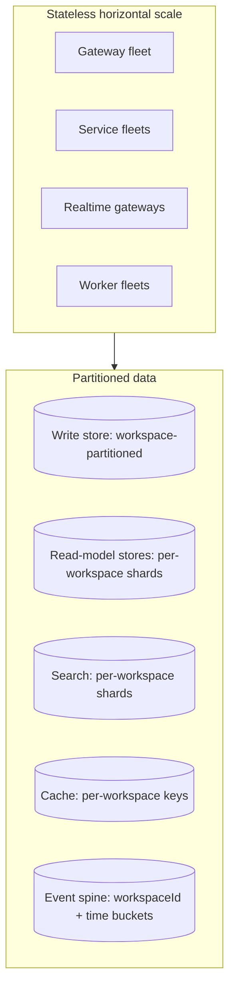

### 14.3 Horizontal Scaling

| Tier | Strategy |
|---|---|
| **Gateway / services** | Stateless horizontal scaling behind LB; no server session state (SAD §17.2) |
| **Realtime** | Stateless gateways + topic partitioning; horizontal fan-out |
| **Workers** | Auto-scale consumers by queue depth (SAD §17.2) |
| **Read models** | Partitioned by workspace; hot workspaces scale independently (DDD §14) |
| **Search** | Per-workspace shards; dedicated index cluster at scale (SAD §17.2) |

### 14.4 Vertical Scaling

- Used for targeted headroom (e.g., larger instances for specific worker classes), never as the primary strategy.
- Reserved for cases where horizontal scaling is constrained (e.g., large in-memory projections); documented per service.

### 14.5 Database Scaling

- Write store: scale by aggregate workload; strong consistency per aggregate (SAD §17.1); add capacity via larger/faster tiers before sharding; shard by workspaceId when a single workspace outgrows (DDD §14).
- Read models: scale independently; hot workspaces isolated (performance isolation, SAD §17.4).
- Event spine: partition by workspaceId + time buckets; no locking (SAD §17.2).

### 14.6 Cache Scaling

- Per-workspace cache keys; LRU + TTL (SAD §17.2).
- Cache clusters scale by read throughput; eviction/persistence monitored.

### 14.7 Queue Scaling

- Worker fleets scale by queue depth; queue health monitored (age, DLQ).
- Queue workload classes map to node pools when K8s is adopted (BAG Ch. 25.9).

### 14.8 Search Scaling

- Per-workspace shards; dedicated cluster at scale; index rebuildable from events (SAD §17.2).
- Vector index (future) is a derived, separate index — additive, no write-model change (DDD §9.7).

### 14.9 Realtime Scaling

- Stateless gateway + topic partitioning; per-entity subscriptions; SSE fallback for cost control (SAD R6).
- Presence is ephemeral (DDD §3); realtime state is not durable.

### 14.10 File Storage Scaling

- Object storage scales by design; lifecycle rules manage cost (Ch. 18).
- CDN offloads static + cached file delivery.

### 14.11 AI Scaling

- AI reads derived data (snapshots, search, event streams) — no write-model change (DDD §14.6).
- AI provider capacity is external; client-side batching, caching, and graceful degradation manage cost/latency.

### 14.12 Autoscaling Philosophy

- Autoscale stateless tiers by utilization (CPU/mem/queue depth/requests).
- Scale **down** as rigorously as up (cost awareness).
- Pre-provision headroom for known peaks (release times, report generation windows).
- Autoscaling decisions are reviewed against capacity plans.

### 14.13 Capacity Planning

| Input | Source |
|---|---|
| Usage forecasts | Product/analytics (WPS usage patterns) |
| Perf budgets | SAD §17.3 |
| Historical utilization | Metrics |
| Growth of data (spine, sessions) | DDD §14 scale targets |
| Cost envelope | Ch. 18 |

### 14.14 Cost Optimization

- Rightsizing by utilization; reserve capacity for baseline; spot/preemptible only for interruptible workers.
- Data lifecycle: hot/warm/cold tiers; summarization before purge (DDD §13.4).
- Realtime cost control: topic partitioning, per-entity subscriptions, SSE fallback (SAD R6).
- Full cost strategy in Ch. 18.

---

## 15. Security Operations

### 15.1 Principles

Security is **defense in depth, zero trust, and continuously verified**. The privacy boundary (DDD §13.3) is preserved at every operational layer; the operational posture never weakens the application's structural guarantees.

### 15.2 Runtime Security

- Least-privilege identities for every workload; no long-lived cloud keys in containers.
- Network isolation: private endpoints for data; no public exposure of data services.
- TLS everywhere; HSTS; secure cookies; CSP applied at the edge (FAG Ch. 21.8).
- Runtime integrity: image signing + admission validation (future K8s), read-only filesystems, non-root containers.

### 15.3 Dependency Scanning

- Lockfile + dependency scanning in CI (TQS Ch. 15.7); continuous monitoring of production dependencies.
- Policy: critical/high vulnerabilities block release; medium patched per SLA; deviations documented with risk owners.

### 15.4 Container Security (conceptually)

- Distroless runtime images (BAG Ch. 25.3); minimal attack surface.
- Image scanning in CI + registry; provenance (signed, checksummed, immutable).
- No secrets in images; runtime secret injection only (Ch. 8).

### 15.5 Vulnerability Management

| Severity | SLA | Gate |
|---|---|---|
| Critical | Fix within 24–72h | Blocks release |
| High | Fix within 7 days | Blocks release |
| Medium | Fix within 30 days | Tracked |
| Low | Prioritized quarterly | Tracked |

### 15.6 Patch Management

- Base images, runtime, and managed services patched on vendor cadence.
- Patch windows in maintenance windows (Ch. 19); emergency patches via emergency process.
- Immutable deploys mean patches ship through the normal pipeline, not hot-patching running containers.

### 15.7 Incident Response

- Security incidents follow the incident process (Ch. 16) with a security-specific runbook: contain → eradicate → recover → PIR.
- Escalation to Security immediately on: suspected compromise, data exposure, credential leak, privacy-boundary violation.
- Evidence preserved (logs, audit, snapshots) for analysis and compliance.

### 15.8 Access Control

- **Humans:** SSO-ready with MFA (enterprise-ready, additive per WPS §1.5); break-glass time-boxed + audited.
- **Services:** workload identities; per-service least privilege; no shared credentials.
- **Data:** private data never readable by any member including Admins (DDD §13.3) — operational access is additionally gated and audited.

### 15.9 Audit

- Security-relevant events always audited (login, failed access, export, share, role change, integration auth) — DDD §8, SAD §16.1.
- Audit log access is Admin/Owner-only; export is itself audited (DDD §13.5).
- Periodic security review of audit data (anomaly detection).

### 15.10 Compliance Readiness

- GDPR-style rights (export, deletion) preserve aggregate evidence while removing personal attribution where policy requires (DDD §13.7).
- Evidence collection: audit trails, backup/restore verification, DR drills, vulnerability and patch records (Ch. 20).
- Future certifications (SOC 2, ISO 27001, etc.) are supported by existing evidence posture.

### 15.11 Operational Security Reviews

- Regular review cadence: access reviews, secret audit, vulnerability posture, incident trend, DR/backup evidence.
- Every production config/secret change reviewed; change management in Ch. 19.

---

## 16. Operational Runbooks

### 16.1 Runbook Standard

Every runbook follows a fixed structure: **Symptoms · Diagnosis · Immediate actions · Recovery · Verification · Escalation · Postmortem**. Runbooks live with the SRE/DevOps team, link to alerts and dashboards, and are rehearsed.

| Field | Definition |
|---|---|
| **Symptoms** | What the operator observes (alerts, user reports, dashboards) |
| **Diagnosis** | How to isolate root cause (queries, dashboards, logs, traces) |
| **Immediate actions** | Stabilize first (contain, prevent spread, restore service) |
| **Recovery** | Restore normal operation (failover, restore, redeploy) |
| **Verification** | How to confirm recovery (SLOs, smoke, health) |
| **Escalation** | Who to page and when (P1/P2 paths) |
| **Postmortem** | What is recorded and reviewed (PIR, action items) |

### 16.2 Runbook Catalogue

| # | Runbook | Class |
|---|---|---|
| R1 | Application unavailable | Availability |
| R2 | Database unavailable | Data |
| R3 | High latency | Performance |
| R4 | Queue backlog | Background |
| R5 | Search outage | Search |
| R6 | Notification failure | Integration |
| R7 | Storage outage | Data |
| R8 | Realtime outage | Realtime |
| R9 | Deployment failure | Delivery |
| R10 | Rollback | Delivery |
| R11 | Secret rotation | Security |
| R12 | Certificate expiration | Edge |
| R13 | AI provider outage | AI |
| R14 | Security incident | Security |

### 16.3 Application Unavailable (R1)

- **Symptoms:** high error rate, SLO burn, health checks failing, users report blank/error pages.
- **Diagnosis:** dashboards (RED), health endpoints, logs/traces; isolate to service vs. dependency.
- **Immediate actions:** confirm scope (all services vs. one); check recent deploy (rollback if regression); check dependency health.
- **Recovery:** restart/roll; scale out; rollback to prior immutable tag if deploy-related; failover if data-related.
- **Verification:** health green; error rate within budget; synthetic checks pass; SLO burn stopped.
- **Escalation:** on-call; P1 path to SRE lead and incident commander if > 15 min.
- **Postmortem:** PIR with timeline, root cause, action items.

### 16.4 Database Unavailable (R2)

- **Symptoms:** writes failing, read-model refresh failing, connection saturation, replication lag.
- **Diagnosis:** DB dashboards (replication lag, connections, slow queries), health endpoints, backups status.
- **Immediate actions:** do not restart blindly (risk of partial writes); verify connectivity; check storage/compute; check for schema/migration incident.
- **Recovery:** failover to replica; if data loss, restore from point-in-time (RPO 15 min); validate integrity before cutover.
- **Verification:** replication healthy; write path green; data integrity checks; app smoke.
- **Escalation:** on-call; data-team and backend leads.
- **Postmortem:** PIR; backup/restore evidence reviewed.

### 16.5 High Latency (R3)

- **Symptoms:** p95/p99 exceeding budgets (SAD §17.3), RUM degradation, user complaints.
- **Diagnosis:** traces for slow path (gateway/service/store/external), metrics per dependency, network.
- **Immediate actions:** identify hotspot; scale out stateless tier; reduce load (rate-limit, cache); check external provider.
- **Recovery:** remove hotspot (cache warm, index build, capacity), restore budgets.
- **Verification:** latency budgets met; RUM improved; SLO back in budget.
- **Escalation:** on-call; perf/SRE.
- **Postmortem:** PIR; capacity plan updated.

### 16.6 Queue Backlog (R4)

- **Symptoms:** queue depth/age rising, DLQ growth, projections lagging, notifications delayed.
- **Diagnosis:** queue dashboards (depth, age, stalled), worker saturation, DLQ contents.
- **Immediate actions:** scale workers; inspect stalled jobs; check for poison messages; pause low-priority queues if needed.
- **Recovery:** drain backlog; replay from spine where idempotent (projectors rebuildable — SAD §9).
- **Verification:** queue depth within budget; DLQ zero; projections caught up (lag < 5s).
- **Escalation:** on-call; backend team for poison messages.
- **Postmortem:** PIR; root cause of backlog.

### 16.7 Search Outage (R5)

- **Symptoms:** search p95 high, empty/incorrect results, index lag.
- **Diagnosis:** search dashboards (lag, shard health, query errors), index rebuild status.
- **Immediate actions:** verify index health; reindex from events (rebuildable — SAD §11); degrade search UX gracefully.
- **Recovery:** rebuild index; verify freshness; restore search service.
- **Verification:** query p95 < 500 ms; results correct; lag within budget.
- **Escalation:** on-call; search/backend.
- **Postmortem:** PIR.

### 16.8 Notification Failure (R6)

- **Symptoms:** notification delivery failing, provider errors, queue of notifications building.
- **Diagnosis:** notification service metrics, provider ACL logs, webhook/email provider status.
- **Immediate actions:** isolate provider (feature flag/circuit); retain notifications in queue; fallback channel if configured.
- **Recovery:** provider restored; drain queue (idempotent); verify delivery.
- **Verification:** delivery success rate back to budget; queue drained.
- **Escalation:** on-call; integration team.
- **Postmortem:** PIR; provider reliability reviewed.

### 16.9 Storage Outage (R7)

- **Symptoms:** uploads/downloads failing, attachments unavailable, exports failing.
- **Diagnosis:** object-storage health, permissions, network; versioning/retention status.
- **Immediate actions:** confirm not a credential/network issue; verify multi-AZ status; keep app serving (failures isolated to files).
- **Recovery:** restore access; recover objects from versioning/backup.
- **Verification:** upload/download green; files consistent.
- **Escalation:** on-call; storage/platform.
- **Postmortem:** PIR.

### 16.10 Realtime Outage (R8)

- **Symptoms:** WS/SSE failing, realtime latency high, reconnects storm, presence stale.
- **Diagnosis:** realtime dashboards (delivery p95, connections, reconnects), gateway logs, network.
- **Immediate actions:** verify gateway fleet; drain + re-establish rooms (BAG Ch. 25.8); SSE fallback.
- **Recovery:** restore gateway fleet; clients reconnect (rooms re-established by design).
- **Verification:** delivery p95 < 1s; reconnects normal; presence fresh.
- **Escalation:** on-call; realtime/backend.
- **Postmortem:** PIR.

### 16.11 Deployment Failure (R9)

- **Symptoms:** deploy fails gates, health checks fail post-deploy, canary error-rate spike.
- **Diagnosis:** pipeline logs, canary metrics, health endpoints, migration status.
- **Immediate actions:** halt/abort deploy; do not force; if partially deployed, assess impact.
- **Recovery:** rollback to prior immutable tag (R10); or fix and redeploy via pipeline.
- **Verification:** previous version healthy; SLOs fine.
- **Escalation:** on-call; release manager.
- **Postmortem:** PIR; pipeline/test gaps fixed.

### 16.12 Rollback (R10)

- **Symptoms:** deploy-induced regression identified.
- **Diagnosis:** confirm regression attributable to current artifact.
- **Immediate actions:** redeploy prior immutable tag; drain realtime/queue during cutover (TQS Ch. 18.5).
- **Recovery:** confirm state compatibility (additive migrations mean prior code + current data is safe); revert feature-flag states if needed.
- **Verification:** smoke green; error budget restored; SLO stable.
- **Escalation:** on-call; release manager.
- **Postmortem:** PIR; release checklist updated.

### 16.13 Secret Rotation (R11)

- **Symptoms:** planned rotation due, suspected exposure, credential errors.
- **Diagnosis:** secret audit log; error signatures (403/401 from providers).
- **Immediate actions:** if exposure — revoke + rotate immediately; else scheduled rotation with dual-key overlap.
- **Recovery:** rotate per Ch. 8; verify services pick up new secrets without restart where possible.
- **Verification:** all services healthy; audit clean; no auth errors.
- **Escalation:** on-call; security.
- **Postmortem:** record rotation; PIR if exposure-driven.

### 16.14 Certificate Expiration (R12)

- **Symptoms:** TLS errors, handshake failures, monitoring alert on cert expiry.
- **Diagnosis:** certificate dashboard/alert; expiry dates.
- **Immediate actions:** verify scope (edge, internal, provider); renew via automated process.
- **Recovery:** issue/renew; propagate to edge; verify handshake.
- **Verification:** TLS valid everywhere; no handshake errors; monitoring green.
- **Escalation:** on-call; platform.
- **Postmortem:** PIR if automated renewal failed.

### 16.15 AI Provider Outage (R13)

- **Symptoms:** AI surfaces failing, provider latency high, guardrail errors.
- **Diagnosis:** AI ACL logs, provider status, feature-flag state.
- **Immediate actions:** isolate via feature flag/kill-switch; core functionality unaffected (SAD §21.3).
- **Recovery:** provider restored; enable AI surfaces; verify audit.
- **Verification:** AI latency/error budget restored; guardrails functioning.
- **Escalation:** on-call; AI/security.
- **Postmortem:** PIR; provider reliability reviewed.

### 16.16 Security Incident (R14)

- **Symptoms:** suspected compromise, data exposure, credential leak, privacy-boundary violation.
- **Diagnosis:** security dashboards, audit anomalies, failed-access patterns, secret audit.
- **Immediate actions:** contain (isolate affected scope, revoke credentials); preserve evidence; notify Security; page incident commander.
- **Recovery:** eradicate (remove access, rotate, patch); recover service; verify integrity.
- **Verification:** audit clean; access revoked; evidence preserved; no residual indicators.
- **Escalation:** Security immediately; legal/compliance per policy.
- **Postmortem:** PIR; compliance documentation (Ch. 20).

### 16.17 Incident Response Flow

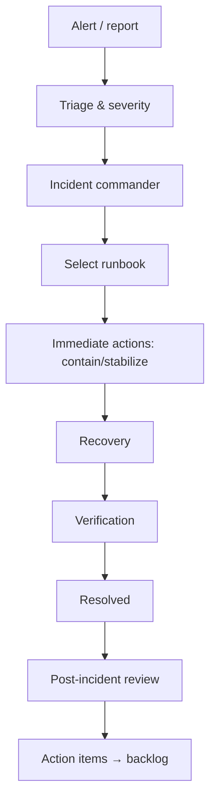

---

## 17. Release Management

### 17.1 Release Lifecycle

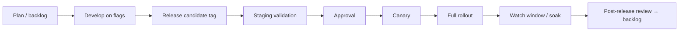

### 17.2 Versioning

- **Semantic versioning** for the product (major.minor.patch).
- Immutable artifact tags (`vX.Y.Z` + build metadata); checksums + provenance recorded.
- API versioning per AIS Ch. 20 (additive, backward-compatible; versioned endpoints).
- Schema/migration versioning per BAG Ch. 25.5 (additive, backward-compatible, ordered, idempotent).

### 17.3 Release Cadence

| Release type | Cadence | Content |
|---|---|---|
| **Continuous** | Per merge (dev/QA) | Small increments behind flags |
| **Scheduled** | Bi-weekly (target) | Candidate batch for production |
| **Hotfix** | As needed | Emergency fixes (TQS Ch. 18.9) |

### 17.4 Feature Freeze

- Feature freeze declared before release-cut (typically 1–2 days for scheduled releases); only fixes and release-blocking items merge.
- Freeze applies to production-destined branch; main continues with feature-flagged work.

### 17.5 QA Sign-Off

- Release candidate must pass the full gate suite + staging smoke (TQS Ch. 18.2 DoD).
- QA sign-off recorded as release evidence; per-feature AC traceability verified (TQS Ch. 18.4).
- Security sign-off required (Ch. 15); risk assessment per feature determines release depth (TQS Ch. 18.4).

### 17.6 Deployment Checklist

- [ ] Release candidate tagged with changelog; gates green (TQS Ch. 15).
- [ ] Staging validated: full API + E2E + a11y + perf + security subset (TQS Ch. 18.2).
- [ ] Smoke green post-deploy to staging.
- [ ] Rollback plan exercised (rehearsed) and ready.
- [ ] Feature flags verified; kill-switch paths tested.
- [ ] Dashboards/runbooks updated; on-call briefed.
- [ ] Post-release validation defined and scheduled.
- [ ] Approval recorded (evidence + risk sign-off).

### 17.7 Rollback Checklist

- [ ] Rollback target (prior immutable tag) identified and available.
- [ ] Schema compatibility confirmed (additive migrations — TQS Ch. 18.5).
- [ ] Realtime/queue drain planned; cursors resume.
- [ ] Feature-flag revert planned where relevant.
- [ ] Rollback rehearsed in staging.
- [ ] Post-rollback smoke + synthetic defined.
- [ ] Rollback recorded; PIR scheduled.

### 17.8 Post-Release Validation

- Immediate: smoke + synthetic on production; error rate, latency, queue depth within budget (TQS Ch. 18.8).
- Watch window (per release risk): RUM/APM, SLO/error-budget review, anomaly detection.
- 24–72 h soak for memory/queue drift.
- Post-release report: evidence, metrics, incidents, learnings → backlog and process improvements.

### 17.9 Release Notes

- Auto-drafted per release (release notes align with WPS §8.6.2 Release Note value object); include features, fixes, changes, migrations, deprecations, and rollout flags.
- Release notes versioned with the release; surfaced in-app and to stakeholders.

### 17.10 Release Ownership

| Role | Responsibility |
|---|---|
| Release Manager | Gate coordination, approval, watch window (TQS Ch. 18.10) |
| QA | Release evidence, smoke, E2E gate, post-release validation |
| SRE/DevOps | Deploy, canary/blue-green execution, rollback, monitoring |
| Security | Security sign-off, incident triage |
| Tech Leads | Risk assessment, rollback readiness |
| Product | Feature-readiness sign-off, go/no-go input |

---

## 18. Cost Management

### 18.1 Principles

Cost is **monitored, attributed, and optimized continuously** — not an afterthought. Tagging, utilization visibility, and lifecycle rules keep cost aligned with value.

### 18.2 Cost Monitoring

- Every resource tagged: environment, service, workspace-class, cost-center, owner.
- Cost dashboards by environment/service/cost-center; monthly trend; cost per active workspace (unit economics).
- Budgets per environment/service with alerts at thresholds (e.g., 80%/100%).

### 18.3 Resource Utilization

- Utilization metrics per compute tier (CPU/mem); rightsizing cadence.
- Idle/underutilized resource detection (dev/preview environments, stale namespaces) with automated cleanup.
- Preview environments auto-destroyed on PR merge/close (TQS Ch. 17.7).

### 18.4 Storage Optimization

- Lifecycle tiers: hot/warm/cold (Ch. 12.7); summarization before purge (DDD §13.4).
- Object storage lifecycle rules; attachment retention tied to host lifecycle.
- Search/read-model snapshot retention aligned with value.

### 18.5 Network Optimization

- CDN offload for static assets and cached files; edge caching reduces origin egress.
- Traffic shaping; per-workspace concurrency budgets avoid noisy-neighbor cost.
- Realtime cost control: topic partitioning, per-entity subscriptions, SSE fallback (SAD R6).

### 18.6 Caching Strategy

- Cache reduces read-path compute (BAG Ch. 18); cache hit ratio monitored.
- Read-model cache + client caches reduce origin load; cache keys versioned.

### 18.7 Compute Optimization

- Rightsizing by utilization; baseline reserved; spot/preemptible for interruptible workers only.
- Autoscaling with scale-down discipline (Ch. 14.12).

### 18.8 Scaling Economics

- Data-driven: scale decisions justified by capacity plans (Ch. 14.13); cost per additional unit of capacity documented.
- Unit economics: cost per workspace/active user tracked; informs product and infra decisions.

### 18.9 Cost Alerts

- Budget alerts (absolute + burn-rate); anomaly detection on spend.
- Alerts routed to cost owner; review in monthly cost review.

### 18.10 Future Budgeting

- Cost forecast per roadmap phase (Ch. 21): multi-region, AI, mobile, enterprise.
- Phase-gate review: each phase includes cost impact estimate before investment.
- Reserved/spend commitments only after baseline utilization data.

---

## 19. Platform Governance

### 19.1 Principles

Governance provides **ownership, control, and review** without slowing delivery. Change is deliberate, reviewed, and reversible.

### 19.2 Infrastructure Ownership

| Area | Owner |
|---|---|
| Pipelines, environments, IaC, artifacts | DevOps/Platform |
| SLOs, alerting, on-call, capacity, DR | SRE |
| Security posture, scanning, vuln mgmt | Security |
| Cost budgets | Finance + Engineering |
| Runtime contracts (health, metrics) | Engineering |

### 19.3 Deployment Approvals

- Automated gates are mandatory; human approvals at documented checkpoints (staging → prod; emergency path).
- Approval evidence recorded (who, what, when, why) for audit.

### 19.4 Environment Ownership

- Each environment has a named owner (Ch. 3.8); owner controls data, config, and access.
- Environment changes are change-managed (below).

### 19.5 Secrets Ownership

- Secrets owned by the consuming team (per service) with Security oversight; rotation and access are audited (Ch. 8).

### 19.6 Monitoring Ownership

- SRE owns the monitoring platform and SLOs; each service team owns its service dashboards and alert tuning.
- Alerts must link to runbooks; alert ownership is explicit.

### 19.7 Operational Reviews

| Cadence | Review |
|---|---|
| Daily | Incident handoff, alert review |
| Weekly | On-call review, change review, flaky tests |
| Monthly | SLO/error-budget review, cost review, capacity |
| Quarterly | Backup/restore drill evidence, DR drill, access review |
| Annually | Full DR drill, compliance review, security posture |

### 19.8 Change Management

| Change type | Process |
|---|---|
| Code deploy | Pipeline + gates + approval |
| Config change | Reviewed like code; production changes via change request |
| Schema/migration | Versioned, additive, rehearsed on staging |
| Feature-flag change | Reviewed + audited; kill-switch available |
| Infrastructure change | IaC-reviewed; rehearsal in staging |
| Emergency change | Incident process with expedited review + PIR |

### 19.9 Maintenance Windows

- Scheduled maintenance windows for: index builds, retention jobs, major migrations, DR rehearsal, platform upgrades.
- Communicated via status page; low-traffic windows preferred.
- Emergency maintenance outside windows only via incident process.

---

## 20. Compliance & Audit

### 20.1 Principles

Compliance is **evidence, not activity**. The operational layer produces verifiable records that satisfy internal policy and external standards (SOC 2, ISO 27001, GDPR readiness).

### 20.2 Audit Trails

- Application audit: append-only ActivityEvents (DDD §8) — the durable record.
- Operational audit: deploys, config changes, secret access, access reviews, drill evidence.
- Both are exportable, role-gated, and themselves audited.

### 20.3 Access Reviews

- Periodic review of human and service access (Ch. 15.8); least privilege enforced; expired access removed.
- Evidence of reviews retained for compliance.

### 20.4 Log Retention

- Log retention per Ch. 10 (security logs 1 year; audit per policy); cold archive preserved.
- Retention honored and verified (no silent truncation — DDD §13.4).

### 20.5 Operational Compliance

- Backup/restore evidence (Ch. 12); DR drill evidence (Ch. 13); vulnerability and patch records (Ch. 15).
- Change management records (Ch. 19); incident documentation (below).

### 20.6 Security Evidence

- Vulnerability scan results, patch status, secret audit, access reviews, security incident records.
- Compliance evidence aggregated in a single evidence store accessible to audit.

### 20.7 Incident Documentation

- Every PIR records: timeline, root cause, impact, containment, recovery, action items (Ch. 13.8, 16).
- Incident records retained per compliance policy.

### 20.8 Disaster Recovery Testing

- Restore drill quarterly (BAG Ch. 25.7); full region DR drill annually; evidence recorded (Ch. 12–13).
- Measured RTO/RPO compared to targets; gaps tracked to closure.

### 20.9 Backup Verification

- Backup success + restore success monitored; test-restore evidence retained (Ch. 12.5–12.6).

---

## 21. Future Evolution

### 21.1 Principles

Every phase below is **additive** — none requires operational redesign. Services stay stateless; state stays in managed data services; partitioning by workspace persists; the same pipelines, SLOs, runbooks, and governance apply.

| Phase | Name | Infrastructure evolution |
|---|---|---|
| **Phase 1** | Single-Region Cloud | Single-region managed orchestration; managed data services; CDN; this guide's baseline |
| **Phase 2** | High Availability | Multi-AZ everything; read replicas + failover; DR region standby; RTO tightening |
| **Phase 3** | Multi-Region | Active read regions + primary write region; traffic manager; per-workspace regional placement; data replication |
| **Phase 4** | Global Platform | Multiple write regions with data placement rules; regional compliance (data residency); global DNS + latency routing |
| **Phase 5** | Enterprise SaaS | Dedicated/enterprise tiers; SSO/IP-restrictions/audit exports; compliance certifications; custom SLAs |

### 21.2 Phase 1 — Single-Region Cloud

- Baseline: single-region managed orchestration, managed data, CDN, one pipeline.
- SLO: 99.9%; RPO 15 min; RTO 4 h.
- Targets: reliability, observability, security posture, release cadence.

### 21.3 Phase 2 — High Availability

- Multi-AZ compute + data; read replicas; automated failover for database/search/queue.
- DR region as standby (replica + periodic promotion drill).
- SLO: 99.95%; RTO 1 h.
- Evolutions: regional failover runbooks, replica monitoring, DR drills formalized.

### 21.4 Phase 3 — Multi-Region

- Primary write region; secondary read regions (read models, search, read replicas).
- Traffic manager routes reads near users; writes route to primary; per-workspace placement by workspaceId.
- Realtime: regional gateways with cross-region event propagation (topic partitioning).
- SLO: 99.95–99.99%; latency improvements via regional reads.

### 21.5 Phase 4 — Global Platform

- Multiple write regions with placement rules (data residency), conflict-aware sync (DDD §7.5 LWW-with-guardrails).
- Regional compliance: keep data within required boundaries; regional retention.
- Global DNS + latency routing; per-region capacity plans.

### 21.6 Phase 5 — Enterprise SaaS

- Enterprise tiers: dedicated compute, private networking, SSO/IP allow-lists (additive per WPS §1.5), audit exports, custom SLAs.
- Compliance certifications (SOC 2, ISO 27001, GDPR) built on existing evidence posture (Ch. 20).
- AI at enterprise scale: guarded AI reads derived data only (SAD §21); opt-in, audited (SAD §21.3).

### 21.7 What Never Changes

- Stateless services; managed state; workspace-partitioned data; the privacy boundary (DDD §13.3); immutable artifacts; the same CI/CD gates; the same SLO/runbook discipline; the same governance.

---

## Appendix A: Diagram Index

| Diagram | Location |
|---|---|
| DevOps Lifecycle | §2.1 |
| Delivery Flow (CI/CD end-to-end) | §2.3, §5.1 |
| Environment Promotion Flow | §3.1 |
| Infrastructure Overview | §4.1 |
| Deployment Architecture | §4.3 |
| CI Pipeline | §5.1 |
| CD Pipeline / Progressive Deployment | §6.1 |
| Config Hierarchy | §7.2 |
| Secret Management Flow | §8.1 |
| Monitoring Architecture | §9.2 |
| Logging Pipeline | §10.9 |
| Operational Dashboard Architecture | §11.10 |
| Backup Flow | §12.4 |
| Disaster Recovery Flow | §13.4 |
| Scaling Architecture | §14.2 |
| Incident Response Flow | §16.17 |
| Release Pipeline | §17.1 |

---

## Appendix B: Operational Checklists

### B.1 Developer Release Checklist

- [ ] Local gates pass (format, lint, type, unit).
- [ ] Feature flagged if incomplete; kill-switch path known.
- [ ] PR passes all CI gates; preview deployed for UI changes.
- [ ] Migration dry-run green (if schema-affecting).
- [ ] No secrets/keys committed (scanner green).
- [ ] Changelog entry written.
- [ ] Code reviewed; bounded-context import rules clean.

### B.2 Infrastructure Readiness Checklist

- [ ] Environments provisioned per Ch. 3 (dev/QA/staging/prod/preview/sandbox).
- [ ] IaC reviewed; config drift detection enabled.
- [ ] Secrets provisioned per environment (Ch. 8); rotation scheduled.
- [ ] Networking isolated; no public data services.
- [ ] Monitoring, logging, tracing pipelines installed per environment.
- [ ] SLOs + alerts + runbooks linked (Ch. 9–11, 16).
- [ ] Backups configured + verified (Ch. 12).

### B.3 Production Readiness Checklist

- [ ] Runbooks current for all services; on-call assigned and briefed.
- [ ] Dashboards per audience populated (Ch. 9.3).
- [ ] SLOs defined; error budgets tracked (Ch. 11).
- [ ] Backup/restore drill evidence current (Ch. 12).
- [ ] DR runbook rehearsed (Ch. 13).
- [ ] Security scanning + vuln management active (Ch. 15).
- [ ] Cost tagging + budgets active (Ch. 18).
- [ ] Compliance evidence collection started (Ch. 20).

### B.4 Deployment Checklist

- [ ] Release candidate tagged; gates green (TQS Ch. 15).
- [ ] Staging validated (full suite + smoke + chaos subset).
- [ ] Rollback plan rehearsed and ready.
- [ ] Feature-flag states verified; kill-switch tested.
- [ ] Dashboards/runbooks updated; on-call briefed.
- [ ] Approval recorded.
- [ ] Post-release validation defined.

### B.5 Rollback Checklist

- [ ] Prior immutable tag available.
- [ ] Schema compatibility confirmed.
- [ ] Realtime/queue drain planned.
- [ ] Feature-flag revert planned.
- [ ] Post-rollback smoke defined.
- [ ] Rollback recorded; PIR scheduled.

### B.6 Disaster Recovery Checklist

- [ ] Incident declared; runbook selected (Ch. 16).
- [ ] Communication plan activated (status page, stakeholders).
- [ ] Restore/failover executed per runbook.
- [ ] Integrity + smoke validated before cutover.
- [ ] Traffic cut over; recovery monitored.
- [ ] Resolved; PIR; action items tracked.

### B.7 Security Checklist

- [ ] Least-privilege workload identities; no baked secrets.
- [ ] Dependency + image scanning green; vulns triaged (Ch. 15.5).
- [ ] Secret rotation scheduled/executed (Ch. 8.4).
- [ ] Access reviews current (Ch. 20.3).
- [ ] Privacy boundary verified (no cross-member private reads — DDD §13.3).
- [ ] Security logs retained; audit exports tested.
- [ ] Security incident runbook current (R14).

### B.8 Monitoring Checklist

- [ ] RED metrics per service (Ch. 11.2).
- [ ] SLO burn alerts configured; no alert without runbook.
- [ ] Health endpoints (liveness/readiness/dependency) verified per service.
- [ ] Synthetic monitors on critical journeys.
- [ ] RUM enabled for web client.
- [ ] Queue/DLQ + projection lag + realtime dashboards live.
- [ ] Dashboard access role-gated.

### B.9 Backup Verification Checklist

- [ ] Backup success metric green (Ch. 12.6).
- [ ] Random recent backup restored + integrity checked.
- [ ] RPO/RTO measured against targets.
- [ ] Object-storage versioning/retention verified.
- [ ] Retention policy honored (no silent truncation).
- [ ] Test-restore evidence recorded.

### B.10 Incident Response Checklist

- [ ] Severity assessed; incident commander assigned.
- [ ] Runbook selected and followed.
- [ ] Stabilization first (contain, prevent spread).
- [ ] Communication per plan.
- [ ] Recovery executed; verified.
- [ ] Resolved; evidence preserved.

### B.11 Postmortem Checklist

- [ ] Blameless; timeline + root cause.
- [ ] Impact quantified.
- [ ] Action items with owners + due dates.
- [ ] Runbooks/tests updated.
- [ ] Review in operational cadence; tracked to closure.

---

## Appendix C: Operational KPIs

| KPI | Definition | Target | Owner |
|---|---|---|---|
| **Availability** | Uptime within SLO window | 99.9% (prod) | SRE |
| **Latency** | p95 read < 300 ms; write ack < 500 ms; realtime < 1 s | Per budget | SRE/Eng |
| **Deployment Frequency** | Production deploys per week | Increasing (target ≥ 2/week) | DevOps/Release |
| **Lead Time** | Merge → production | Shrinking (target < 1 day) | DevOps |
| **MTTR** | Mean time to restore service | Target < RTO; trend down | SRE |
| **MTBF** | Mean time between failures | Tracked; trend up | SRE |
| **Error Rate** | % of requests failing | < SLO burn allowance | SRE |
| **Queue Health** | Depth within budget; DLQ zero | DLQ zero | SRE |
| **Backup Success Rate** | Successful backups | 100% (drill-verified) | SRE/DevOps |
| **Recovery Success Rate** | Successful test restores | 100% | SRE |
| **Infrastructure Cost** | $ per environment/service; per active workspace | Within budget | Finance/Eng |
| **Capacity Utilization** | % utilization vs. headroom | 40–80% target band | SRE |
| **SLO Compliance** | % of windows meeting SLO | 100% of monthly target | SRE |
| **Flake Rate** | Flaky test rate | < threshold | QA |

---

## Appendix D: SLO Targets Summary

| SLO | Target | Window |
|---|---|---|
| API availability | 99.9% | 30-day |
| Read latency p95 | < 300 ms | rolling |
| Write ack p95 | < 500 ms | rolling |
| Realtime delivery p95 | < 1 s | rolling |
| Projection lag p95 | < 5 s | rolling |
| Search query p95 | < 500 ms | rolling |
| Backup success | 100% | monthly |
| Restore success | 100% | quarterly drill |
| RPO | 15 min | — |
| RTO | 4 h (Phase 1) / 1 h (Phase 2+) | — |

---

## Appendix E: Runbook Index

| # | Runbook | Section |
|---|---|---|
| R1 | Application unavailable | §16.3 |
| R2 | Database unavailable | §16.4 |
| R3 | High latency | §16.5 |
| R4 | Queue backlog | §16.6 |
| R5 | Search outage | §16.7 |
| R6 | Notification failure | §16.8 |
| R7 | Storage outage | §16.9 |
| R8 | Realtime outage | §16.10 |
| R9 | Deployment failure | §16.11 |
| R10 | Rollback | §16.12 |
| R11 | Secret rotation | §16.13 |
| R12 | Certificate expiration | §16.14 |
| R13 | AI provider outage | §16.15 |
| R14 | Security incident | §16.16 |

---

## Appendix F: Glossary

| Term | Definition |
|---|---|
| **Artifact** | Immutable, signed, versioned deployable produced by CI |
| **Blue-green deploy** | Two environments; traffic switched; instant revert |
| **Canary deploy** | Small % traffic; observe; expand/halt |
| **Correlation ID** | ID spanning a request/event across all hops |
| **Error budget** | Allowed failure within an SLO window |
| **Event spine** | Append-only, immutable event record (DDD §8) |
| **Feature flag** | Runtime switch gating a surface/behavior |
| **Immutable deploy** | Every deploy is a new artifact; never mutate a running artifact |
| **Kill-switch** | Flag that disables a feature instantly |
| **MTTR** | Mean time to restore service |
| **MTBF** | Mean time between failures |
| **PIR** | Post-incident review |
| **Projection** | Read model rebuilt from events |
| **RPO** | Recovery Point Objective — max acceptable data loss |
| **RTO** | Recovery Time Objective — max acceptable downtime |
| **Read model** | Derived, query-optimized projection (DDD §7) |
| **RED** | Rate, Errors, Duration metrics |
| **SLO** | Service Level Objective |
| **SLI** | Service Level Indicator |
| **Synthetic monitoring** | Scripted checks simulating user journeys |
| **Write store** | Strongly consistent aggregate store |

---

## Appendix G: Relationship to Other Documents

| Document | DDG Relationship |
|---|---|
| **PRD** | Product intent; DDG keeps it reliably available |
| **WPS** | Entity/roles/releases; DDG operationalizes release + environment policy |
| **UXS** | Surfaces and offline UX; DDG observes realtime/offline health |
| **DSS/DTS** | Design values; DDG preserves build/caching semantics |
| **DDD** | Bounded contexts, privacy boundary, event spine, retention; DDG operates them |
| **SAD** | Service catalog, topology, scalability; DDG implements deployment/ops |
| **AIS** | Contracts, idempotency, versioning; DDG gates on them |
| **FAG** | Static deployable + CDN; DDG hosts/promotes it |
| **BAG** | Backend structure, DevOps readiness; DDG is its operational continuation |
| **TQS** | Quality gates, environments, release quality; DDG enforces them in operations |

---

## Appendix H: Revision History

| Version | Date | Author | Change |
|---|---|---|---|
| v1.0 | Draft | FocusFlow Operations Team | Initial complete DevOps & Deployment Guide (DDG) aligned with PRD, WPS, UXS, DSS, DTS, DDD, SAD, AIS, FAG, BAG, TQS |

---

*End of document — FocusFlow DDG v1.0*
