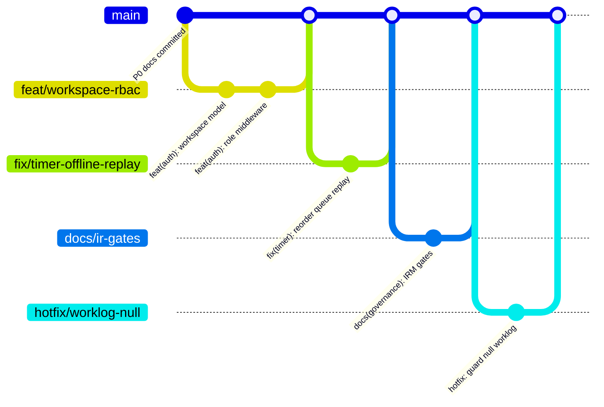
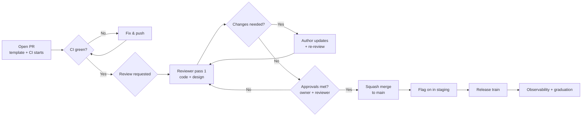
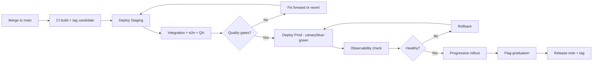
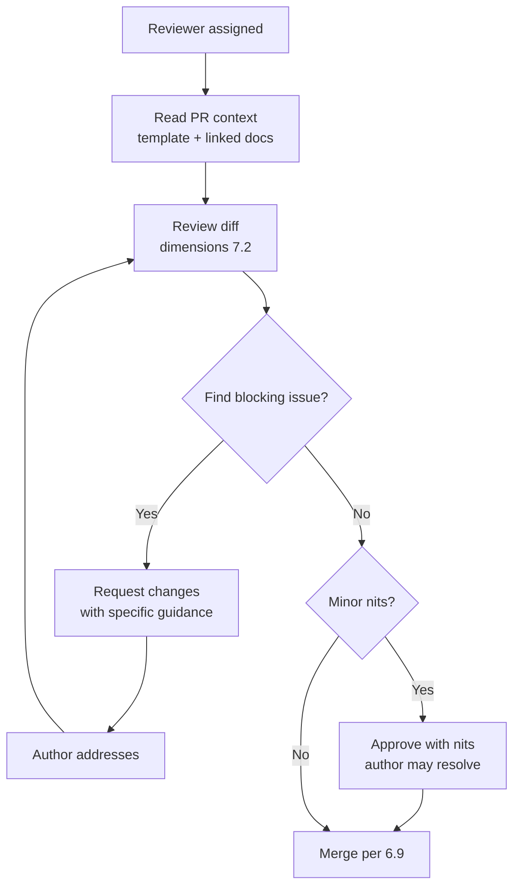
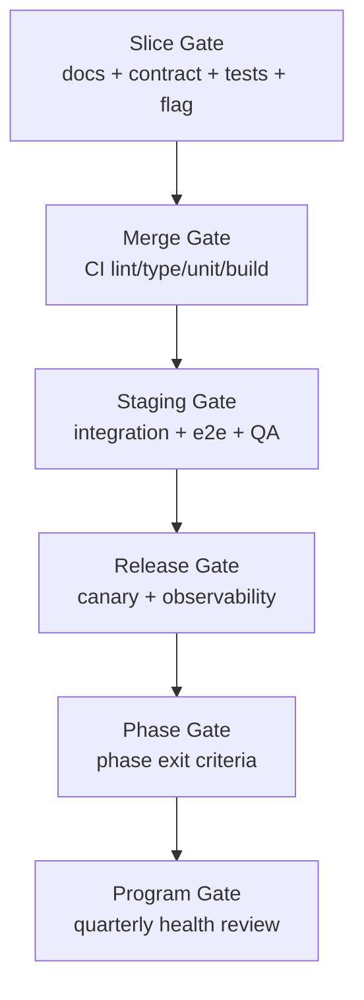
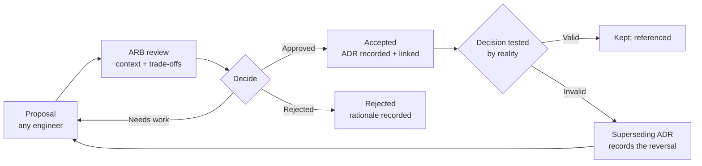
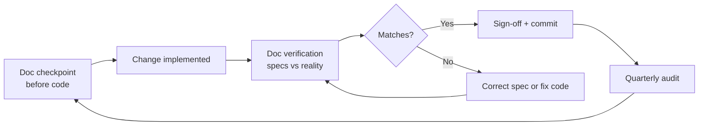
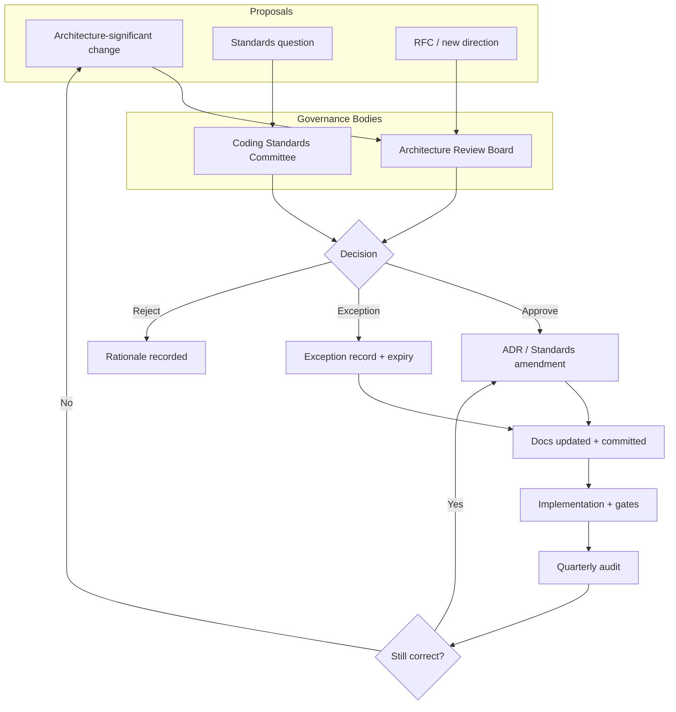
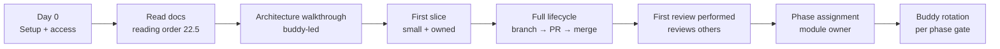

# FocusFlow — Engineering Standards & Best Practices (ESB)

**Product Name:** FocusFlow
**Document Type:** Engineering Standards & Best Practices (ESB)
**Supersedes:** N/A — defines how FocusFlow engineers write, review, ship, and maintain software
**Source of Truth:** FocusFlow PRD (v1.0); WPS (v1.1); UXS (v1.1); DSS (v1.1); DTS (v1.1); DDD (v1.0); SAD (v1.0); AIS (v1.0); FAG (v1.0); BAG (v1.0); TQS (v1.0); DDG (v1.0); IRM (v1.0)
**Audience:** Frontend Engineers, Backend Engineers, QA Engineers, DevOps Engineers, Security Engineers, AI Engineers, Technical Leads, Engineering Managers, Architects, and all future contributors
**Status:** Draft v1.0
**Scope:** The definitive engineering handbook for FocusFlow. This document defines **how engineers build software**: engineering culture, engineering principles, coding standards, repository and branching conventions, commit and pull-request discipline, code review, frontend/backend/API/database standards, security, performance, accessibility, testing, documentation, observability, error handling, technical debt management, AI-assisted development, engineering governance, developer onboarding, engineering checklists, and anti-patterns. It intentionally contains **no implementation code**, **no product redesign**, **no architecture modification**, and **no new workflows**. It defines how the work specified by the source-of-truth documents is performed with consistent, maintainable, secure, scalable, and high-quality discipline — from a solo developer to a multi-team enterprise platform.

**Stack context (assumed, per prior documents):** Node.js (LTS) · TypeScript · React · Vite · Tailwind CSS · Express.js · MongoDB (Mongoose) · Redis · Socket.IO · BullMQ · JWT · bcrypt · Zustand · Recharts · framer-motion · docx/html2pdf · Vitest · OpenTelemetry · Docker · Future Kubernetes (FAG, BAG, SAD §19, DDG Ch. 4, IRM Ch. 11).

**Consistency obligations.** The PRD, WPS, UXS, DSS, DTS, DDD, SAD, AIS, FAG, BAG, TQS, DDG, and IRM are authoritative. This document does **not** redesign the product, modify the architecture, introduce new business workflows, or contradict prior engineering decisions. It standardizes *how* the engineering work defined by those documents is executed. Where this document references product, data, architecture, or operations behavior, it does so by citing those documents. If a conflict appears, the referenced source-of-truth document wins and this document is corrected.

---

## Table of Contents

1. [Introduction](#1-introduction)
2. [Engineering Principles](#2-engineering-principles)
3. [Repository Standards](#3-repository-standards)
4. [Branching Strategy](#4-branching-strategy)
5. [Commit Standards](#5-commit-standards)
6. [Pull Request Standards](#6-pull-request-standards)
7. [Code Review Standards](#7-code-review-standards)
8. [Frontend Standards](#8-frontend-standards)
9. [Backend Standards](#9-backend-standards)
10. [API Standards](#10-api-standards)
11. [Database Standards](#11-database-standards)
12. [Security Standards](#12-security-standards)
13. [Performance Standards](#13-performance-standards)
14. [Accessibility Standards](#14-accessibility-standards)
15. [Testing Standards](#15-testing-standards)
16. [Documentation Standards](#16-documentation-standards)
17. [Logging & Observability Standards](#17-logging--observability-standards)
18. [Error Handling Standards](#18-error-handling-standards)
19. [Technical Debt Management](#19-technical-debt-management)
20. [AI-Assisted Development](#20-ai-assisted-development)
21. [Engineering Governance](#21-engineering-governance)
22. [Developer Onboarding](#22-developer-onboarding)
23. [Engineering Checklists](#23-engineering-checklists)
24. [Anti-Patterns](#24-anti-patterns)
25. [Future Evolution](#25-future-evolution)

### Appendices

- [A. Glossary](#a-glossary)
- [B. Relationship to Other Documents](#b-relationship-to-other-documents)
- [C. Revision History](#c-revision-history)

---

## 1. Introduction

### 1.1 Purpose

The ESB is the **engineering handbook** of FocusFlow. It is the single place where every engineer — today's solo developer and tomorrow's hundreds of contributors — learns *how this organization writes, reviews, ships, and maintains software*. It answers questions like:

- How do I name files, components, functions, and tables?
- How do I branch, commit, and open a pull request?
- What must pass before my code is merged, released, or shipped?
- How do I write a secure, accessible, fast, and testable slice?
- How do I propose an architectural change?
- How do I use AI assistance without losing ownership?

The ESB exists so that **quality is systemic, not heroic**. When the handbook is followed, a new engineer's first pull request and a staff engineer's hundredth pull request follow the same standards, review under the same gates, and ship with the same confidence.

### 1.2 Scope

**In scope:** engineering culture and principles; repository organization and naming; branching, commits, pull requests, and code review; frontend, backend, API, and database coding standards; security, performance, accessibility, testing, and documentation standards; logging and observability; error handling; technical debt management; AI-assisted development guidelines; engineering governance (ARB, CSC, ADRs, RFCs); developer onboarding; engineering checklists; anti-patterns; and the evolution of standards across organizational stages.

**Out of scope:** product behavior (PRD/WPS), UX and visual design (UXS/DSS/DTS), database design (DDD), software architecture (SAD), API contracts (AIS), frontend architecture (FAG), backend architecture (BAG), testing strategy (TQS), DevOps operations (DDG), and roadmap sequencing (IRM). The ESB references these documents and standardizes the *practice* around them; it does not redefine their content.

### 1.3 Audience

Frontend Engineers · Backend Engineers · QA Engineers · DevOps Engineers · Security Engineers · AI Engineers · Technical Leads · Engineering Managers · Solution/Software Architects · Product Managers (coordination) · Designers (interface) · all future contributors, contractors, and open-source collaborators.

### 1.4 Goals

The ESB has seven measurable goals:

1. **Consistency** — one codebase that reads as if written by one person.
2. **Maintainability** — every module is small, named clearly, and owned; change is local, safe, and reviewable.
3. **Security by design** — security is a property of the engineering process, not a late review step.
4. **Accessibility by default** — WCAG 2.2 AA compliance is the default state of shipped code.
5. **Performance as a feature** — latency and size budgets are enforced, not hoped for.
6. **Quality over speed** — the Quality Gates (§15.6) are immutable; schedules flex.
7. **Scale** — the standards remain correct as FocusFlow grows from one developer to an enterprise product (Chapter 25).

### 1.5 Engineering Vision

FocusFlow engineering is **documentation-driven, architecture-first, and automation-forward**. Engineers are trusted to make good decisions *within the guardrails the ESB defines*, and the guardrails exist so that trust does not produce inconsistency. The development lifecycle below is the canonical shape of every piece of work.

```mermaid
flowchart LR
    A[Idea / Ticket<br/>from source-of-truth doc] --> B[Architecture Check<br/>SAD/DDD/AIS placement]
    B --> C[Doc Checkpoint<br/>update spec]
    C --> D[Branch + Commits<br/>Conventional Commits]
    D --> E[Pull Request<br/>CI + gates]
    E --> F[Code Review<br/>owner + reviewer]
    F --> G[Merge to Trunk<br/>behind flag]
    G --> H[Release Train<br/>staging + QA]
    H --> I[Canary / Progressive<br/>rollout]
    I --> J[Observability<br/>metrics + logs]
    J --> K[Flag Graduation]
    K --> L[Doc Audit<br/>specs match reality]
    L --> A
```



### 1.6 Relationship with All Architecture Documents

The ESB is the **practice layer** over the **specification layer**. It never contradicts; it operationalizes.

| Document | Layer | What the ESB Adds |
|---|---|---|
| PRD, WPS | Product | Nothing — scope comes from here |
| UXS, DSS, DTS | Design | Component hygiene, accessibility, design-token usage discipline |
| DDD | Data | Schema conventions, migration discipline, indexing rules |
| SAD | Architecture | Architecture-compliance review, decomposition rules, ADRs |
| AIS | API | Contract-first practice, naming/versioning/error conventions |
| FAG | Frontend | Component/hook/styling/testing conventions |
| BAG | Backend | Service/repository/validation/logging conventions |
| TQS | Testing | Test naming, coverage floors, gate enforcement |
| DDG | Operations | Log/metric/trace standards, release gates, runbook discipline |
| IRM | Roadmap | Standards maturity by phase; onboarding aligned to phases |

If any ESB rule appears to conflict with a source-of-truth document, the source-of-truth document wins and the ESB is corrected (see Consistency Obligations).

### 1.7 How This Document Is Organized

- **Chapters 2–7** define how engineers work: principles, repository, branching, commits, PRs, and review.
- **Chapters 8–14** define how engineers build: frontend, backend, API, database, security, performance, accessibility.
- **Chapters 15–18** define how engineers verify: testing, documentation, observability, error handling.
- **Chapters 19–21** define how engineers govern: debt, AI assistance, and engineering governance.
- **Chapters 22–25** define how engineers grow: onboarding, checklists, anti-patterns, and future evolution.
- **Appendices A–C** provide glossary, relationships, and revision history.

---

## 2. Engineering Principles

### 2.1 The Thirteen Culture Principles

Every decision in the ESB derives from these thirteen principles. They are the tie-breakers for any ambiguous judgment call.

1. **Developer First** — the platform must be pleasant to build on: fast feedback, great tooling, low cognitive load. Standards exist to help developers, not to burden them.
2. **Architecture First** — no feature ships without its architectural placement specified (SAD, DDD). Architecture is decided once, in docs, and implemented consistently.
3. **Readability over Cleverness** — code is read ten times more often than it is written. Clear, boring code beats clever, dense code.
4. **Consistency over Preference** — the established pattern wins over personal taste. Consistency makes the codebase predictable.
5. **Documentation Driven Development** — documentation is the steering wheel, not the rear-view mirror (IRM Ch. 15).
6. **Automation First** — anything performed twice is automated: CI, tests, migrations, releases.
7. **Security by Design** — security decisions are made at design time and enforced by gates, not bolted on later.
8. **Accessibility by Default** — accessible code is the default state; inaccessible code is the defect.
9. **Performance as a Feature** — performance is a product feature with budgets and owners (Chapter 13).
10. **Quality over Speed** — quality gates are immutable; schedules flex, quality does not (IRM Ch. 16).
11. **Continuous Improvement** — every pull request leaves the code slightly better than it found it (the boy-scout rule).
12. **Evidence Based Decisions** — architecture and process changes are decided with data: benchmarks, incident postmortems, and measured outcomes — not opinions.
13. **Long-Term Maintainability** — every change is made as if it will be maintained for a decade by people who did not write it.

### 2.2 Design Principles

These design principles guide how code is *shaped* inside the standards chapters that follow.

| Principle | Meaning | Primary Application |
|---|---|---|
| Single Responsibility | A module has one reason to change | Components, services, routes |
| SOLID | S/O/L/I/D applied pragmatically | Backend services, frontend modules |
| DRY | Don't repeat yourself — but not at the cost of clarity | Shared utilities, hooks, services |
| KISS | Keep it simple; simplest correct solution first | All code |
| YAGNI | You aren't gonna need it — build for known needs only | Scope control, IRM alignment |
| Composition | Compose small pieces over deep inheritance | React components, services |
| Immutability | Prefer immutable state and data flows | State management (Zustand), reducers |
| Explicitness | Make intent explicit; no magic or implicit coupling | Props, dependencies, config |
| Fail Fast | Detect and surface errors early, loudly, and near the source | Validation, guards, assertions |
| Progressive Enhancement | Core function works without enhancements; enhancements layer on | PWA, offline, animations |
| Domain Driven Design | Model code after the business domain (DDD contexts) | Entities, services, aggregates |
| Clean Architecture | Depend inward; frameworks at the edges | Layering in SAD Ch. 5 |

### 2.3 Principle Priority & Trade-offs

Principles conflict; the ESB resolves conflicts with an explicit order for design decisions:

1. **Correctness** (does what the spec says, safely)
2. **Security** (no vulnerability introduced)
3. **Accessibility** (no user excluded)
4. **Performance** (meets budgets)
5. **Maintainability** (readable, named, owned)
6. **Consistency** (matches established patterns)

Example trade-offs: a "clever" optimization that harms readability is rejected (Readability over Cleverness). A YAGNI-rejected abstraction is acceptable even if DRY purists object (YAGNI before DRY when the second use is hypothetical). An immutable pattern that adds ceremony is preferred where state correctness matters (Immutability over brevity).

### 2.4 How Principles Apply

- **In review:** reviewers cite the principle being violated (e.g., "this violates Explicitness — the config is implicit").
- **In ADRs:** architectural trade-offs record which principles won and which were traded (Chapter 16, ADR template).
- **In exceptions:** principle overrides are granted only through the exception process (§21.4) and documented.

---

## 3. Repository Standards

### 3.1 Repository Organization

FocusFlow currently lives in a single repository root with the application under `mainApp/` and all engineering documents at the root (IRM Ch. 2.2). The ESB standardizes this layout and makes it **monorepo-ready** (§3.9).

**Canonical root layout:**

| Path | Purpose |
|---|---|
| `/docs/` | All engineering documents (PRD…IRM) — versioned, committed (IRM Ch. 2.8 G30) |
| `/mainApp/` | The application root: frontend SPA (`src/`) and backend server (`server/`) |
| `/mainApp/src/` | Frontend source (FAG structure) |
| `/mainApp/server/` | Backend source (BAG structure) |
| `/structure.txt` | Optional generated tree snapshot for reference |
| `.gitignore` | Excludes `node_modules`, `dist`, `.env`, tooling caches |

**Rules:**
1. **All source-of-truth documents are committed to `/docs/`** — the current "untracked docs" state is a P0 remediation (IRM Ch. 2.8, G30).
2. **One application root per project** until a multi-project monorepo is warranted (§3.9).
3. **No source lives at the repository root** except shared config and documentation.
4. **`node_modules`, `dist`, build output, `.env`, and local tooling caches are never committed.**

### 3.2 Folder Conventions

The Folder Convention Matrix is the canonical rule for where code lives. Deviations require a comment in the PR and an exception record (§21.4).

| Concern | Convention | Example |
|---|---|---|
| Frontend source | `src/` with `pages`, `components`, `hooks`, `store`, `types`, `utils`, `lib`, `styles` | `src/components/ui/` |
| Pages (routed) | `src/pages/<Feature>.tsx` (or folder) | `src/pages/Analytics.tsx` |
| Components | `src/components/<domain>/<Component>.tsx`; `ui/` for design-system primitives | `src/components/tasks/TaskCard.tsx` |
| Hooks | `src/hooks/use<Name>.ts` | `src/hooks/useActiveTimer.ts` |
| State | `src/store/use<Domain>Store.ts` (Zustand) | `src/store/useAuthStore.ts` |
| Domain types | `src/types/<domain>.ts` | `src/types/collaboration.ts` |
| Shared utilities | `src/utils/<name>.ts` | `src/utils/api.ts` |
| Libraries/engines | `src/lib/<domain>/` | `src/lib/docEngine/` |
| Backend source | `server/` with `routes`, `models`, `middleware`, `services`, `repositories`, `utils` | `server/routes/tasks.js` |
| Tests | colocated `*.test.ts(x)` next to source, or `__tests__/` for suites | `src/utils/api.test.ts` |
| Assets | `public/` (static) and `src/assets/` (bundled) | `public/favicon.svg` |
| Docs | `/docs/` at repository root | `/docs/DDG.md` |

### 3.3 Naming Strategy

The Naming Convention Matrix is binding. Consistency in naming is the cheapest maintainability investment in the codebase.

| Item | Convention | Good | Bad |
|---|---|---|---|
| Files (frontend) | `PascalCase.tsx` for components, `camelCase.ts` for logic | `TaskCard.tsx`, `api.ts` | `task-card.tsx`, `API.ts` |
| Files (backend) | `camelCase.js` (CommonJS) | `workLogs.js`, `auth.js` | `WorkLogs.JS` |
| React components | `PascalCase` | `NotificationCenter` | `notificationCenter` |
| Hooks | `use` prefix, `camelCase` | `useNotifications` | `notificationsHook` |
| Functions | `camelCase`, verb-first | `createTask` | `taskCreation` |
| Constants (immutable config) | `UPPER_SNAKE_CASE` | `VITE_API_URL` | `apiUrl` |
| Zustand stores | `use<Domain>Store` | `useCollaborationStore` | `collabStore` |
| TypeScript types/interfaces | `PascalCase`, no `I` prefix | `WorkspaceMember` | `IWorkspaceMember` |
| Enums/unions | `PascalCase` members | `SprintStatus` | `sprint_status` |
| CSS classes | Tailwind utilities; custom: `kebab-case` | `bg-surface-raised` | `backgroundColorRaised` |
| Mongo models | `PascalCase` (class-ish) | `WorkLog` | `worklog` |
| Mongo fields | `camelCase` | `workspaceId` | `workspace_id` |
| API routes | `kebab-case` paths, `camelCase` params | `/api/worklogs/:workLogId` | `/api/work_logs/` |
| Git branches | `type/scope-description` | `feat/workspace-rbac` | `myBranch` |
| Database collections | plural `lowerCamelCase` | `workLogs`, `sessions` | `WorkLogs`, `worklogs` |
| Environment variables | `UPPER_SNAKE_CASE` with prefix | `VITE_API_URL` | `api_url` |

**Naming rules:**
1. **Names communicate intent** — a name should answer "what/why", not "how".
2. **Avoid abbreviations** unless domain-standard (`api`, `id`, `rss`).
3. **Boolean variables read as questions** — `isLoading`, `hasErrors`, `canEdit`.
4. **No Hungarian notation, no type-prefix remnants.**
5. **Domain terms come from the WPS/DDD glossary** — the team names things once, in the specs, and reuses those names.

### 3.4 Module Ownership

- Every module (page, service, model, route) has a **named owner** and a **reviewer** (Appendix E of IRM, ESB Review Responsibility Matrix §7.5).
- Ownership is recorded in `docs/OWNERS.md` (module → owner) and kept current at each phase gate (IRM Ch. 19).
- A module with no owner is **unowned and cannot be modified** until an owner is assigned.
- Ownership does not mean exclusive write access; it means **accountability for quality, drift, and review** of that module.

### 3.5 Documentation Layout

- All specs live in `/docs/` (see §3.1).
- Every repository carries a root `README.md` (module-level READMEs per §16.3).
- Documentation follows the Documentation Lifecycle (IRM Ch. 15, ESB Ch. 16): doc checkpoint before code, doc audit after ship.
- Diagrams in docs are **Mermaid** (rendered in Markdown) unless a formal diagram (drawio/plantuml) is required — Mermaid keeps docs in-git and diffable.

### 3.6 Asset Organization

| Asset type | Location | Rules |
|---|---|---|
| Static served files | `public/` | Referenced by absolute path; no hashing needed |
| Bundled images/fonts | `src/assets/` | Imported in code; Vite hashes |
| Icons | `src/components/ui/icons/` or design-system icon set | Only design-system icons (DSS) |
| Fonts | `src/assets/fonts/` or CDN per DSS | Respect licensing; subset when possible |

### 3.7 Generated Files

- **Generated files are never edited by hand** and never committed unless their generators are unavailable in CI.
- Generated artifacts (lockfiles, type definitions from schemas, build output) are either committed by policy (lockfiles: yes) or ignored (`dist/`, coverage, caches).
- If a file is regenerated, the generator + config is committed so it is reproducible (Automation First).

### 3.8 Third-Party Code

- **Vendored code** is rare and only when no package exists; it lives in a clearly marked folder (`src/lib/vendor/`) with the license and source URL in a header comment.
- **Dependencies** are declared in `package.json` (never committed as built assets); licenses are validated by the dependency scan in CI (Security Checklist §12.6).
- **Pinning:** exact or `~` ranges for app dependencies; lockfiles are committed (DDG Ch. 7).
- **No arbitrary new dependencies without review** — a new dependency is a supply-chain decision reviewed under §12.6.

### 3.9 Monorepo Readiness

FocusFlow is **single-application today** and deliberately structured so a future monorepo is a move, not a rewrite (IRM Ch. 11, Phase 8 ecosystem):

- The app root (`mainApp/`) already separates frontend (`src/`) from backend (`server/`) — the natural future packages.
- Workspace tooling (npm workspaces / pnpm) is adopted when a **second package with shared code** appears (e.g., shared types, an SDK, mobile app) — not before (YAGNI).
- Package boundaries follow the Module Dependency Graph (IRM Ch. 7.3): shared core first, surfaces last.
- Monorepo triggers: a second deployable, shared internal library, or a public SDK (IRM P8). Until then, one root, one app.

## 4. Branching Strategy

### 4.1 Model: Trunk-Based Development with Short-Lived Branches

FocusFlow uses **trunk-based development** (IRM Ch. 13.3, DDG Ch. 5/17): a single long-lived `main` branch, short-lived feature branches, and **feature flags** for incomplete work (DDG Ch. 17). This is the model that best supports the two-week release train (IRM Ch. 9) and continuous delivery.

**Why trunk-based over Git Flow:** Git Flow's long-lived `develop`/`release` branches add merge overhead and delay integration; trunk-based keeps `main` always releasable, makes small merges routine, and relies on flags rather than branches to isolate incomplete work. FocusFlow is small and moving fast (IRM P0–P2); trunk-based matches. When the organization reaches the **Enterprise Product** stage (§25.4), long-lived release branches may be reintroduced for concurrent-version support — the ESB will document that change as a new ADR before it happens.

### 4.2 Branch Types

| Branch | Life | Created From | Merges Into | Purpose |
|---|---|---|---|---|
| `main` | permanent | — | — | Always releasable; every commit is a potential release candidate |
| `feat/<scope>-<description>` | short (≤ 1 train) | `main` | `main` | One vertical slice (IRM Ch. 13) |
| `fix/<scope>-<description>` | short | `main` | `main` | Bug fix with test |
| `docs/<scope>-<description>` | short | `main` | `main` | Documentation-only change |
| `chore/<description>` | short | `main` | `main` | Tooling, CI, dependencies, refactor with no behavior change |
| `hotfix/<description>` | very short | latest tag | `main` (+ patch release) | Sev-1 production fix (DDG Ch. 17) |
| `release/<version>` | temporary, only at Enterprise stage | `main` at tag | `main` | Concurrent-version support (§25.4) |

### 4.3 Git Branching Diagram



### 4.4 Branch Rules

1. **Branches are short-lived** — a branch older than one release train (2 weeks) is merged behind a flag or abandoned. No long-lived feature branches.
2. **Branches fork from a current `main`** and are rebased/merged-forward **before** opening a PR if `main` has moved.
3. **`main` is never committed to directly** — every change lands via a pull request (§6).
4. **Feature flags isolate incomplete work** — a branch is merged behind a flag; the feature graduates per §9.6 (DDG Ch. 17).
5. **Naming is enforced by convention** (`type/scope-description`, §3.3) and checked in CI where tooling allows.

### 4.5 Merge Strategy

| Context | Strategy | Why |
|---|---|---|
| Feature/fix branches → `main` | **Squash merge** | One clean commit per PR on `main`; keeps history linear and readable |
| `main` → long-lived `release/<version>` (Enterprise) | **Merge commit** | Preserves release history |
| `hotfix` → `main` | **Merge commit** (tagged) | Keeps hotfix identity visible in history (DDG Ch. 17) |
| Rebasing feature branches onto `main` | `git rebase` locally | Avoids merge noise before PR |

**Squash-merge policy:** squash merges produce a single conventional commit (§5) that references the PR and issue. Individual granular commits remain on the branch for review, but `main` records one coherent change per PR.

### 4.6 Conflict Resolution

1. **Resolve in the feature branch first** — rebase onto latest `main` and resolve locally.
2. **Resolve by domain owner** — when a conflict touches an owned module (§3.4), the module owner resolves or reviews the resolution.
3. **Never resolve a conflict by deleting the other side's intent** — resolve semantically (merge both intents) and confirm behavior with the PR author.
4. **Document non-obvious resolutions** in the PR conversation.

### 4.7 Release Tagging

- Every release-train ship is tagged with a **product version** (`vYYYY.MINOR.PATCH`, IRM Ch. 9.3) on `main`.
- Hotfixes produce a **patch tag** on `main` and (at Enterprise stage) on the `release/<version>` branch.
- Tags are signed where repository policy supports it; tag messages reference the release note.
- The Release Flow (§6.7) and Release Checklist (§23.7) enforce that a tag is created **only after** all gates are green.

---

## 5. Commit Standards

### 5.1 Conventional Commits

FocusFlow uses **Conventional Commits** (Conventional Commits 1.0). Every commit message has a structured header, and the body is used when context is needed.

**Format:**

```
<type>[optional scope]: <description>

[optional body]

[optional footer(s)]
```

**Types (binding):**

| Type | Meaning | Releasable |
|---|---|---|
| `feat` | A new user-facing capability | minor |
| `fix` | A bug correction | patch |
| `perf` | A performance improvement | patch |
| `refactor` | Code change with no behavior change | no |
| `docs` | Documentation only | no |
| `style` | Formatting, no logic change | no |
| `test` | Adding/correcting tests | no |
| `chore` | Tooling, deps, CI, non-user-facing | no |
| `build` | Build system changes | no |
| `ci` | CI configuration changes | no |
| `revert` | Reverts a previous commit | — |

### 5.2 Commit Message Rules

1. **Imperative mood, ≤ 72 chars in the header** — `feat(auth): add workspace role guard` not `feat(auth): added workspace role guard`.
2. **Scope is the module/domain** (auth, timer, worklog, api, docs, ci…).
3. **A body is required when the header cannot explain the "why"** — especially for non-obvious trade-offs, migrations, or behavior changes. The body explains *why*, not *what*.
4. **Breaking changes are marked** with `!` and a `BREAKING CHANGE:` footer describing the migration impact (§5.4).
5. **Commit bodies may reference issues/tickets** in the footer (`Refs: #123`), never secrets or customer data.
6. **No "wip", "asdf", "tmp", or vague messages.** If a change is too tangled to describe, it is too big for one commit (§5.3).

### 5.3 Commit Granularity & Atomic Commits

- **Atomic commit** = one logical change, fully described by its message, leaving the tree in a working state.
- **Rules:**
  1. Each commit compiles and passes its unit tests (a commit must not break `main` if cherry-picked).
  2. Formatting and logic are not mixed in one commit (separate `style`/`refactor` commits are fine).
  3. A commit is small enough to review, large enough to be a meaningful unit — typically one slice step, not one file.
  4. Secret, dependency, and generated-file changes are committed separately and reviewed separately.
- **Failed experiments** are amended/squashed, not committed as history noise.

### 5.4 Breaking Changes

A breaking change requires:

1. A `BREAKING CHANGE:` footer describing the change and the migration path.
2. The corresponding **Migration Guide** update (§16.7) and IRM Migration Matrix row (IRM Appendix H) where applicable.
3. **API version** bump per AIS (backward-compatible additive policy, IRM Ch. 10.1).
4. Approval in review by the module owner and, for API/contract changes, the AIS steward (§21.5).

### 5.5 Reverts

- A revert is itself a commit: `revert: <original type>(<scope>): <original description>`.
- **Revert first, discuss later** — if a commit breaks `main`, the first action is revert; the second is investigation (DDG Ch. 17 rollback-first culture).
- The revert body references the reverted commit hash and the reason.
- Reverting does not erase history; it records it.

### 5.6 Release Commits

- With squash-merge, `main` receives **one commit per PR** — the release "commit" is the tag (§4.7).
- Release notes are generated from Conventional Commit history between tags (feat → minor, fix/perf → patch) — another reason message discipline matters (§16.8).

### 5.7 Examples

```
feat(workspace): add owner/admin/manager role model

Introduces workspace membership with four roles and permission
guards per WPS Ch.4. Existing users are migrated to a default
personal workspace with the owner role.

Closes #214

BREAKING CHANGE: /api/workspaces responses now include a roles
field; clients must send Authorization headers with the new
workspace token format. See docs/migrations/M-AUTH.md.
```

```
fix(timer): replay offline queue in creation order

The offline queue was replayed by storage order, which could
start a session before the task it belonged to existed.

Fixes #189
```

```
docs(esb): document conventional commit examples

No behavior change. Adds examples from the ESB Ch.5.
```

---

## 6. Pull Request Standards

### 6.1 PR Size

- **Small by default: one vertical slice, ≤ ~400 changed lines** (excluding generated/lockfiles). Anything larger is split (IRM Ch. 13 vertical slices).
- **Hard ceiling ~800 lines.** Larger PRs require EM approval and a review plan.
- **A PR is one logical change** — bug fixes, refactors, and features are not mixed in one PR.
- **Why:** small PRs review faster, merge faster, are less likely to conflict, and produce cleaner `main` history.

### 6.2 PR Template

Every PR uses the repository PR template, which requires:

1. **Summary** — what and why (link the source-of-truth doc/ticket).
2. **Doc checkpoint** — which document was updated (IRM Ch. 15 rule 1) or explicit "no doc change because…".
3. **Changes** — bullet list of user-facing and internal changes.
4. **Testing evidence** — tests added/run, manual verification steps, screenshots (§6.4).
5. **Architecture impact** — does this touch SAD/DDD/AIS contracts, migration, or flags?
6. **Checklist** — the Pull Request Checklist (§23.2).
7. **Reviewers** — owner + reviewer per §6.8 and the Review Responsibility Matrix (§7.5).

### 6.3 Description Requirements

- **Describe the "why" and the "how"** — the diff shows the what.
- **Reference the source-of-truth requirement** (e.g., "per WPS Ch. 4 role model").
- **State trade-offs and alternatives considered** — the ESB values evidence and trade-off analysis (Principle 12).
- **Call out behavior changes, migrations, and flag status** explicitly.

### 6.4 Screenshots & Testing Evidence

- **UI changes require screenshots** (before/after) or a screen recording for motion changes.
- **Testing evidence is required**: which tests were run (unit, integration, e2e), results, and manual verification steps with expected vs observed.
- **Accessibility evidence**: if the change affects interaction, note the a11y checks performed (Chapter 14).
- **Performance evidence**: if the change can affect latency or bundle size, attach measurements (Chapter 13).

### 6.5 Architecture Impact

The PR must declare, for reviewers:

- Whether the change introduces a new module, service, route, collection, or public contract.
- Whether it follows the existing architectural placement (SAD/DDD/AIS) or requires an **ADR or exception** (§21.3, §21.4).
- Whether a migration is required (IRM Appendix H) and its status.

### 6.6 Review Checklist

The reviewer runs the Code Review standards (Chapter 7) — not a re-implementation of the author's work. The PR Review Checklist is §23.9.

### 6.7 Pull Request Lifecycle



### 6.8 Approval Rules

- **Two approvals minimum**: the **module owner** and the **designated reviewer** (Review Responsibility Matrix §7.5).
- **Architecture-significant PRs** additionally require an **Architecture approver** (SAD/DDD/AIS steward).
- **Security-significant PRs** (auth, payments, data export, AI) require a **Security reviewer** (§21.5).
- The **author never merges their own PR**; the last reviewer or a maintainer merges.
- Approvals expire if the branch drifts significantly or sits beyond one train — a re-review is triggered.

### 6.9 Merge Criteria

A PR merges only when **all** of:

1. All CI gates green (lint, type-check, unit, integration, build) — Quality Gates §15.6.
2. Coverage floor met for touched modules (Testing Responsibility Matrix §15.7).
3. Required approvals present (§6.8).
4. Doc checkpoint satisfied or waived with rationale (§16.5).
5. Feature-flag state correct (new behavior behind a flag unless it is the slice's graduation).
6. No unresolved review threads.
7. Rollback/migration notes attached if applicable.

### 6.10 From Merge to Release

Once merged to `main`, a change flows through the release pipeline; the Release Flow below is the deployment-side contract (operational detail in DDG Ch. 6, 17).



---

## 7. Code Review Standards

### 7.1 Review Philosophy

Code review is **the last quality gate before merge** and a **learning mechanism**, not a policing process. Reviewers approve, request changes, and comment to *raise the collective bar*, citing the ESB principle or standard being applied (§2.3). The goal: every merged PR is code that any of us would be proud to maintain.

**Modes:** reviewers may be an **owner/reviewer pair** (default), an **architecture reviewer** (significant PRs), or an **EM/QA reviewer** (governance gates).

### 7.2 Review Dimensions

The review evaluates, in order: **Correctness → Security → Architecture → Performance → Accessibility → Testing → Documentation → Maintainability → Consistency.**

| Dimension | Reviewer Asks |
|---|---|
| Correctness | Does it do what the spec/ticket says? Are edge cases handled? Does it fail fast (§18)? |
| Architecture | Does it belong where it is? Does it follow SAD/DDD/AIS placement? Does it respect module boundaries (IRM Ch. 7.3)? |
| Performance | Does it meet budgets (§13)? Any obvious N+1, re-render, or bundle regression? |
| Security | Any OWASP-class issue (§12)? Any secret, authz, or validation gap? |
| Accessibility | Keyboard, focus, contrast, screen-reader behavior (§14)? |
| Testing | Are the right tests present with meaningful assertions (§15)? |
| Documentation | Doc checkpoint honored? Comments explain why (§16.2)? |
| Maintainability | Named well, small, single-responsibility, no duplication (§2.2)? |
| Consistency | Matches the conventions in §3.3 and existing patterns? |

### 7.3 Code Review Flow



### 7.4 Constructive Feedback

1. **Be specific and actionable** — "move this validation into the service layer per BAG §x" not "this is messy".
2. **Separate blocking from non-blocking** — label nits; blocking issues are defects, spec violations, or standards violations.
3. **Explain, don't lecture** — reference standards and trade-offs; ask questions when unsure.
4. **Praise good work** — call out correct, clever-in-the-good-sense, or exemplary code.
5. **Assume good faith** — the author's intent is positive; discuss the code, not the person.
6. **Timely reviews** — reviews are expected within **1 working day**; slow review is a bottleneck (IRM Ch. 12 critical path).

### 7.5 Review Responsibility Matrix

| Change Type | Required Reviewers | Optional Reviewers | Gate |
|---|---|---|---|
| Frontend component change | Module owner + frontend reviewer | Designer (if UX-affecting) | Merge |
| Backend service/route change | Module owner + backend reviewer | — | Merge |
| API contract change | AIS steward + module owner | Architecture | Merge + ADR |
| Database model/migration | DDD steward + module owner | Architecture | Merge |
| Auth/security-sensitive change | Security reviewer + module owner | — | Merge + Security gate |
| Performance-sensitive change | Module owner + perf reviewer | — | Merge |
| Architecture-significant change | Architecture reviewer + module owner | ARB | ARB / ADR |
| Docs-only change | Doc steward + module owner | — | Merge |
| Hotfix | Module owner + reviewer | EM | Tag (DDG hotfix) |

### 7.6 Approval Criteria

A review **approves** when, after applying §7.2:

1. No unresolved blocking issues (defects, spec/standards violations).
2. Blocking security, accessibility, or performance concerns are absent or explicitly waived by the owning reviewer.
3. Tests are adequate for the change's risk.
4. Nits are clearly non-blocking and the author commits to addressing or has addressed them.
5. The reviewer would be comfortable supporting this change in production.

---

*Continue to Chapters 8–10 in the next section.*

## 8. Frontend Standards

The FAG (v1.0) defines frontend *architecture*; this chapter defines the *practice*. Stack context: React 18 + TypeScript + Vite + Tailwind + Zustand (IRM Ch. 2.3).

### 8.1 React Architecture

- **One-way data flow, top-down** — data flows from stores/page → components via props; components never reach upward.
- **Pages compose domain components**; domain components compose UI primitives (`components/ui/`). No page-level logic in `ui/` primitives and vice versa.
- **Lazy-load routes** (React Router `lazy`) — already the pattern in `App.tsx` (IRM Ch. 2.3); every new route is lazy.
- **Dumb/smart split by necessity, not dogma** — prefer local state; promote to a store only when genuinely shared (§8.4).
- **Feature-flag and authorization hooks wrap feature surfaces** (DDG Ch. 17, `components/auth/ProtectedRoute`).

### 8.2 Component Structure

- **One component per file**, `PascalCase` file name matching the component (§3.3).
- **Composition over inheritance and over deep prop drilling** — use compound components, children, or small dedicated components.
- **Small and single-responsibility** (§2.2) — a component that renders more than ~3 distinct concerns is split.
- **Presentational components are pure** — same props → same render (enables memo and testability).
- **File order:** imports → typed props (`interface <Name>Props`) → component → `export default` (or named export per repo convention — one, not both).
- **No inline styles for layout/theming** — use design tokens (DTS) via Tailwind classes (DSS compliance, §8.10).

### 8.3 Hooks

- **`use` prefix, camelCase** (§3.3); each hook does one job.
- **Custom hooks encapsulate non-visual logic** — timers, data fetching, subscriptions (e.g., `useActiveTimer`, `useNotifications`).
- **Hooks are tested like units** (§15.2) via `renderHook`.
- **Rules of hooks are enforced** (no conditionals around hooks; the lint rule is mandatory in CI).
- **Hook dependencies are exact** — exhaustive-deps lint is on; effect correctness is reviewed.

### 8.4 Props

- **Typed props on every component** (`interface XProps`), never `any`.
- **Props are small and flat** — a props object grows beyond ~5 fields, split the component or pass a domain object.
- **Defaults are explicit** — optional props have documented defaults; boolean defaults are `false`.
- **Event-handler props named `on<Event>`** — `onDelete`, `onSelect`; callback types are `() => void` or typed signatures.
- **Never mutate props or the objects passed in** (Immutability, §2.2).

### 8.5 State Management

- **Zustand for shared/global state** (`use<Domain>Store`, §3.3); **local state for component-only state** (useState).
- **Stores are domain-shaped**, mirroring the WPS/DDD domain — not "UI-slice" blobs.
- **Selectors are granular** — select the smallest slice to limit re-renders (perf, §13).
- **Server data flows through the API layer** (`utils/api`), not raw fetch in components; offline mutations go through the offline queue (IRM Ch. 2.3, M-OFFLINE).
- **Derived state is computed, not stored** — avoid duplicated truth (DRY).

### 8.6 Styling

- **Tailwind utilities with design tokens (DTS)**; custom values must use tokens — never ad-hoc hex in components.
- **`kebab-case` custom classes** only when Tailwind cannot express it; registered, not inline.
- **Dark mode via tokens** (`ThemeToggle` already exists) — new components must render correctly in both themes from day one.
- **No magic numbers** for spacing/color/type — token scale only.
- **CSS-in-JS only for dynamic runtime styles** that Tailwind cannot express, and only where the design system permits (DSS).

### 8.7 Accessibility

- **Semantic HTML first** — use the right element; ARIA is a supplement, not a replacement (Chapter 14).
- **Every interactive element is keyboard-reachable** and has a visible focus indicator.
- **Contrast and tap targets** per WCAG 2.2 AA (Chapter 14).
- **Motion is `prefers-reduced-motion`-aware** (framer-motion + `reduceMotion`).
- **No color-only meaning** — never convey state by color alone.

### 8.8 Animations

- **framer-motion for deliberate animation**, guided by DSS motion tokens.
- **Animations are subtle and purposeful** — loading, state change, guidance; not decoration.
- **Performance-aware** — animate `transform`/`opacity`, not `layout` properties; avoid animating large lists.
- **Respect `prefers-reduced-motion`** — reduced or eliminated by default for users who ask (WCAG 2.3.3).

### 8.9 Performance

- **Bundle budgets enforced in CI** (§13.3); lazy-load routes; **avoid giant synchronous imports**.
- **Re-render hygiene** — memoize expensive render paths, use granular selectors, keep lists keyed stably.
- **Lists paginate or virtualize** beyond ~100 rows (IRM P3 search/scale context).
- **Images are sized, lazy-loaded, and format-aware** (`loading="lazy"`, modern formats).
- **No layout thrash** — batch reads/writes to the DOM; React-managed DOM is default.

### 8.10 Responsive Design & Design-System Compliance

- **Mobile-first** responsive patterns (Tailwind breakpoints) — the PWA/mobile phase (IRM P7) starts from a responsive base.
- **All UI uses DSS components and DTS tokens** — no bespoke re-implementations of existing primitives (Build Once, IRM §5.1).
- **New UI primitives require design-system review** before adding to `components/ui/`.
- **Empty states, loading, and error states are designed**, not afterthoughts (`StandardEmptyState` pattern).

---

## 9. Backend Standards

The BAG (v1.0) defines backend *architecture*; this chapter defines the *practice*. Stack context: Node.js + Express + Mongoose + Redis + BullMQ + Socket.IO (IRM Ch. 2.4).

### 9.1 Module Organization

- **Routes are thin** — parse/validate input, call a service, map to the API response shape (AIS).
- **Services hold business logic** — one service per domain concern, single responsibility (§2.2).
- **Repositories isolate data access** — querying patterns live here, not in routes or services.
- **Models define schema + validation + indexes** (Chapter 11), never business rules.
- **Middleware is cross-cutting only** — auth, tenant scoping, request logging, error mapping.
- **Files map to `server/<routes|services|repositories|models|middleware|utils>`** (§3.2).

### 9.2 Application Services

- Application services orchestrate use cases (DDD): validate input → load aggregate → execute → persist → emit events.
- **One method = one use case**, named after the domain action (`assignTask`, `startSession`).
- Application services **never embed HTTP concerns** (no `req`/`res`); they are testable without a server.
- **Return domain results**, not raw database documents, to callers that need stable contracts.

### 9.3 Domain Services & Aggregates

- Domain rules that span multiple entities live in **domain services** (DDD).
- **Aggregates enforce invariants** — state changes go through the aggregate, not via ad-hoc updates.
- Domain services are **pure where possible** (no I/O) — I/O stays in repositories; purity makes them trivially testable.

### 9.4 Repositories

- One repository per aggregate; it **owns the query surface** for that aggregate.
- Repositories return domain-shaped objects; they encapsulate Mongoose specifics.
- **Complex queries live in repositories with named methods** (`findActiveByWorkspace(workspaceId)`), not inline in routes.
- **Index awareness** — every query pattern has a supporting index (Chapter 11, DDD).

### 9.5 Events

- **Domain events express "something happened"** — emitted after committed state changes, consumed by side-effects (notifications, projections, sync).
- Events are **named in past tense** (`task.assigned`, `session.started`) and **idempotent-safe** on the consumer side.
- **Cross-service events go through the queue (BullMQ/Redis)** per IRM Ch. 6.2 (Core Platform job queue) — no fire-and-forget in-process calls for cross-cutting effects.
- Event payloads are **versioned fields-additive** (backward compatible, IRM Ch. 10.1).

### 9.6 Validation

- **Validate at the boundary, always** — every API input is validated (schema or explicit validators) before touching business logic (§12.4).
- **Same validation, one place** — a shared validation layer per route/domain, reused by API and any internal consumers.
- **Fail fast** — invalid input returns immediately with a structured error (§18.3).
- **Never trust client types** — runtime validation, not TypeScript types, guards the boundary.

### 9.7 Logging

- **Structured JSON logs** with `level`, `ts`, `correlationId`, `scope`, `event`, and context fields (Chapter 17, DDG Ch. 10).
- **Log decisions and failures, not traffic noise** — no per-request success spam at info; debug only in dev.
- **Never log secrets, tokens, PII, or full payloads** (§17.1, §12.3).

### 9.8 Transactions

- **Multi-document changes are transactional** — use Mongo transactions where atomicity is required (DDD).
- **Design for idempotency** — background retries and realtime replays must be safe to run twice (IRM M-OFFLINE, DDG Ch. 14).
- **Outbox pattern for reliability** — events are published reliably, not best-effort, when a side effect must not be lost (BAG, SAD).

### 9.9 Caching

- **Cache at the correct layer** — HTTP, service, and DB caches are distinct; choose by invalidation need (DDG Ch. 14).
- **Cache keys are explicit and versioned**; invalidation is by event, not TTL guessing.
- **Never cache authorization decisions or user-scoped data across tenants** (Chapter 12).
- **Cache-aside with revalidation** — write-through/refresh patterns preferred over long TTLs for user-facing data.

### 9.10 Background Jobs

- **All long-running work goes through the queue** (BullMQ) — exports, mail, notifications, reports, AI (IRM Ch. 6.2 G18).
- **Jobs are idempotent, retried with backoff, and observably logged** (DDG Ch. 16 runbook standard).
- **Job definitions declare concurrency, priority, and a timeout**; poison-message handling is explicit.

### 9.11 Realtime

- **Realtime (Socket.IO) is event-shaped** — clients subscribe to workspace channels; presence is a first-class concept (IRM Ch. 6.3 G8).
- **Authorization is enforced server-side per channel** — a client is granted a channel only if it holds the workspace role (Chapter 12).
- **Realtime is a thin transport** — business logic stays in services; the socket layer validates, authorizes, and forwards events.
- **Reconnect and replay are designed** — missed events are reconciled via the sync engine (IRM M-OFFLINE), never assumed-delivered.

### 9.12 Plugin Architecture

- **Plugin seams are defined by contract first** (AIS), consumed via stable interfaces, not ad-hoc hooks.
- Plugins **inherit tenant/role isolation** and run inside the queue's resource guardrails (DDG Ch. 15).
- **No plugin may bypass validation, audit, or authz** — the platform enforces these after any plugin executes.
- New plugin types are approved by the Architecture Review Board (§21.3).

---

## 10. API Standards

The AIS (v1.0) defines API *contracts*; this chapter defines the *practice*. REST-first with a realtime channel (§9.11).

### 10.1 REST Conventions

- **Nouns for resources, verbs for actions** — `POST /api/workspaces/:workspaceId/tasks` not `/api/createTask`.
- **Plural collection resources** — `/tasks`, `/worklogs`, `/sessions`.
- **Actions that are not CRUD** are sub-resources or RPC-style with intent (`/focus/start`, `/focus/stop`) only when a resource framing is forced; prefer resource semantics.
- **Status codes are meaningful and consistent** (§18.3).
- **JSON everywhere** (content-type enforced); `camelCase` fields (AIS).

### 10.2 Naming

- Path segments `kebab-case`; query/body params `camelCase` (§3.3).
- **Resource identifiers are opaque** and stable — `:taskId`, `:workLogId`.
- Response envelopes: consistent shape per AIS (`{ data, meta }` style where specified) — one convention, applied everywhere.

### 10.3 Versioning

- **URL versioning for breaking changes** (`/api/v1/...`) per AIS; **additive changes are non-breaking** and do not bump the major (IRM Ch. 10.1).
- **Deprecation policy:** a deprecated field/route is announced, supported in parallel, then removed per the deprecation process (§21.5) — never removed silently.
- **Public API (IRM P8) is strictly SemVer**; internal API follows additive-compatibility.

### 10.4 Pagination

- **Cursor-based pagination for lists** by default (stable under writes); offset for simple admin lists.
- Response includes `nextCursor`/`hasMore` (or `page`, `pageSize`, `total` for offset) per AIS.
- **Defaults are sane** — a bounded page size, max enforced server-side.

### 10.5 Filtering & Sorting

- **Whitelisted filters and sort fields** — server defines allowed keys; unknown keys are ignored or rejected consistently (never both).
- **Composite filters use explicit operators** (`status=active&assignee=u1`), not bespoke query strings.
- **Sort is stable** — secondary sort key included to make pagination deterministic.
- **Full-text search goes through the search index** (IRM P3 G28), not `LIKE` scans (Chapter 11).

### 10.6 Error Responses

- **One error envelope** (`{ error: { code, message, details? } }` per AIS) — consistent across all routes and services.
- **Error codes are stable identifiers** (`workspace.not_found`), message is human-readable, `details` is machine-readable for validation (§18.3).
- **HTTP status matches semantics** — 4xx for client errors, 5xx for server faults; never leak stack traces (Chapter 12).
- **Validation errors list every field** that failed, in one response.

### 10.7 Authentication & Authorization

- **Authentication:** Bearer JWT (`ff_token` per IRM Ch. 2.3/2.4) via the auth middleware — the single auth path; no bespoke per-route auth.
- **Authorization:** enforced at the service/middleware boundary with workspace roles (IRM P1 RBAC, G17) — **authorization is never only in the UI**.
- **Tenant scoping is enforced server-side on every query** — a workspace-scoped request may never read outside its workspace (Chapter 12).
- **Rate limiting applies to public and sensitive endpoints** (DDG Ch. 15); API keys (P8) are hashed at rest.

### 10.8 Consistency

- **Contract-first** — routes implement the AIS contract; a contract test verifies responses match (Chapter 15).
- **Same error/validation semantics across v1 endpoints** — one convention, applied everywhere.
- **Deprecated endpoints continue to behave identically** until removed per §21.5.

### 10.9 Backward Compatibility

- **Additive-only by default** — new fields, new optional params, new endpoints; never change semantics of existing ones (IRM Ch. 10.1).
- **Migration of consumers** precedes removal; the Migration Matrix (IRM Appendix H) records the timeline.
- **Compatibility is tested** — a compatibility test suite runs old-contract expectations against new servers (§15.4).

---

*Continue to Chapters 11–14 in the next section.*

## 11. Database Standards

The DDD (v1.0) defines the *data design*; this chapter defines the *practice*. Stack context: MongoDB via Mongoose (IRM Ch. 2.4), with Redis (queue/cache), a future search index, and object storage.

### 11.1 Entity Design

- **Models mirror the DDD schema exactly** — a codebase model that diverges from DDD is a spec violation, corrected by updating DDD or the code (never silently).
- **Fields follow `camelCase`**, collections are plural `lowerCamelCase` (§3.3).
- **Every entity carries `createdAt`, `updatedAt`**; `workspaceId` where the entity is workspace-scoped (tenancy, §11.3).
- **Ids are opaque and generated** (`ObjectId` or ULID per DDD) — never user-controlled or sequential.
- **Embed vs reference follows DDD cardinality** — embedding for owned, bounded, always-loaded data; references for shared/large data (DDD).

### 11.2 Relationships

- **Owned children embed or reference by DDD rules**; cross-aggregate references are by id only — no shared mutable child documents (Invariant ownership, DDD).
- **Denormalized fields are deliberate and documented** — e.g., a workspace `membersCount` is a maintained denormalization, updated by event, not computed on read in hot paths.
- **Referential integrity is enforced in code** (application/repository layer) — MongoDB has no FKs; delete paths explicitly handle dependents (cascade or block, per DDD).

### 11.3 Ownership & Tenancy

- **Every workspace-scoped document is tenant-isolated** — the repository/service always scopes queries by `workspaceId` from the authenticated principal (IRM G27, Chapter 12).
- **No cross-workspace query paths** exist outside admin tooling, which is separately authorized.
- **Ownership is recorded** (`createdBy`, `ownerId`) and enforced — users act on resources they can access, not merely on resources they can name.

### 11.4 Indexes

- **Every query pattern has a supporting index** — a repository method that filters/sorts on fields without an index is a defect (DDG Ch. 14).
- **Compound indexes match real query shapes** (filter + sort), not speculative combinations (YAGNI).
- **Indexes are declared in the model or migration**, reviewed with the DDD steward, and **measured** — `explain()` evidence in performance-significant PRs (§13.6).
- **Index bloat is monitored** — unused indexes are dropped through the migration process, not ad-hoc.

### 11.5 Migration

- **Migrations are additive, non-destructive, reversible, and versioned** (IRM Ch. 10.1, Appendix H) — the Migration Matrix is the catalog.
- **Every schema change ships with: a forward script, a rollback plan, and a data-validation step.**
- **Migrations run through automation** (Automation First) — no manual `mongo` shell edits in any environment (DDG Ch. 4/7).
- **Data backfills are idempotent and batched** — safe to re-run, bounded memory.
- **Migration reviews require the DDD steward** (Review Responsibility Matrix §7.5).

### 11.6 Audit

- **Audit-relevant actions are recorded** in the audit trail (IRM P6 G29, DDG Ch. 20) — who, what, when, from which principal and workspace.
- **Audit records are append-only and immutable** — not updated or soft-deleted.
- **Audit coverage is verified by tests** — a privileged action without an audit record is a failing gate.

### 11.7 Soft Delete

- **Soft delete is used where history or restore matters** (worklogs, tasks with history, documents); **hard delete for volatile/transient data** (sessions in progress, caches) — per DDD.
- **Soft-deleted rows are excluded by default** via repository filters, not by scattered `where` clauses.
- **Soft-delete fields are indexed** when filtered; restore paths are explicit use cases, not hidden updates.

### 11.8 Versioning

- **Documents that support optimistic concurrency carry a `version` field**; updates check the version and fail-fast on conflict (Immutability + Fail Fast).
- **Event-sourced projections are versioned by event sequence** (DDD projections, IRM Ch. 6.2 G28) — replay and rebuild are explicit operations.
- **Schema evolution is additive** — new fields with defaults; no destructive renames (IRM Ch. 10.1).

### 11.9 Data Integrity

- **Validation is enforced at the model boundary** (§9.6) — required fields, enums, length, format; the database is the last line, not the first.
- **Unique constraints are enforced with indexes** (email, invite tokens) and handled gracefully in code (not a raw duplicate-key error).
- **Referential actions are coded and tested** — deleting a workspace cascade-blocks or archives per DDD; the behavior is explicit.
- **Checksums/hashes** for stored exports and audit blobs where tamper-evidence matters (DDG Ch. 20).

---

## 12. Security Standards

Security is **by design** (Principle 7): decisions at design time, enforced by gates (Security Checklist §12.6), owned by a Security reviewer (§7.5). Baseline: OWASP ASVS L1+ for the core app, L2 for auth/enterprise surfaces (IRM P6).

### 12.1 Authentication

- **One authentication path** — JWT via the auth middleware; tokens are short-lived, refresh handled centrally, secrets never client-visible (IRM Ch. 2.4).
- **Passwords are bcrypt-hashed with a current cost factor** — never plaintext, never reversible storage, never logged.
- **Session restoration via `/auth/me`** only — clients never trust stored identity.
- **Future SSO (IRM P6) is additive** — OIDC/SAML via the identity service, not per-app code.

### 12.2 Authorization

- **Enforce on the server** — UI guards (`AdminRoute`, workspace role checks) are UX, not security (API Standards §10.7).
- **Workspace role model** (Owner/Admin/Manager/Developer/Viewer) is the authorization source of truth (IRM P1 G17, WPS).
- **Fail closed** — unknown or missing permission denies; never default-open.
- **Negative tests are required** — proving a lower-role user *cannot* perform a privileged action (TQS, §15.4).

### 12.3 Secrets

- **No secrets in code, commits, or client bundles** — `.env` for local, a secrets manager for deployed environments (DDG Ch. 8).
- **Committed-secret detection runs in CI** — a scanned secret blocks merge and triggers rotation.
- **`VITE_*` is public-by-design** — anything in a client bundle is public; sensitive values never use `VITE_`.
- **Rotation is practiced** — tokens/keys have expiries and are rotated on exposure (DDG Ch. 8).

### 12.4 Validation & Injection

- **All input is validated at the boundary** (§9.6) — size, type, shape, allowlists for free-text.
- **No SQL/NoSQL injection** — parameterized queries; user input never concatenated into queries or aggregations.
- **No stored/reflected XSS** — rich-text content (proEditor) is sanitized on render and export; React escapes by default, but `dangerouslySetInnerHTML` is banned unless the content is sanitized and reviewed.
- **No command injection** — no `eval`/`child_process` on user input.

### 12.5 Encryption & Transport

- **TLS everywhere** (DDG Ch. 15); HSTS for prod.
- **Sensitive fields encrypted at rest** where DDD requires (secrets, tokens, export payloads).
- **Export/attachment payloads respect workspace ACLs** on download — the doc engine and Drive flow enforce authorization, never just obfuscation.

### 12.6 Dependency Management

- **Supply-chain hygiene**: lockfiles committed; `npm audit`/equivalent in CI; dependency-review on lockfile changes (DDG Ch. 7).
- **New dependencies are reviewed** — license, maintenance, security history, footprint (§3.8).
- **Vendored code is minimized** and license-tagged (§3.8).
- **Versions are updated on a cadence**, with the tech-debt register tracking overdue majors (Chapter 19).

### 12.7 OWASP Guidance

Apply the OWASP Top 10 to every review: broken access control (top risk for a multi-tenant workspace — §12.2), cryptographic failures, injection, insecure design, security misconfiguration, vulnerable/outdated components, identification failures, integrity failures (audit, §11.6), logging/monitoring failures (§17), SSRF (webhook/import features). New threat classes are logged as security ADRs (§21.3).

### 12.8 Plugin Security

- Plugins (integrations, IRM P8) run inside **tenant-scoped, rate-limited, credential-isolated** contexts (DDG Ch. 15).
- Plugin credentials are per-tenant, per-plugin, stored encrypted, and never shared.
- **Webhooks are signed** (HMAC) with replay protection (IRM P8 G16); delivery logs are audit-covered.

### 12.9 AI Security

- **AI outputs are untrusted data** — sanitized, rendered as content, never executed; prompt-injection defenses at the gateway (IRM P5 G12).
- **AI actions are audited and reversible** — every AI-generated write is attributed and logged (§17).
- **PII minimization** — AI features receive the minimum data the feature requires (DDD §13.3 privacy); no training on customer data without consent.
- **Token/cost guardrails** — per-workspace budgets and kill-switches (IRM P5, DDG Ch. 9).

### 12.10 Security Checklist

The Security Checklist is **mandatory for every PR** and verified by the reviewer; security-sensitive PRs add the Security reviewer (§7.5).

| # | Check | Owner | Gate |
|---|---|---|---|
| S1 | No secrets in code/commits/bundles; CI secret scan green | Author + CI | Merge |
| S2 | Input validated at boundary; no injection vectors | Author + Reviewer | Merge |
| S3 | Authorization enforced server-side; negative tests present | Author + Reviewer | Merge |
| S4 | Tenant isolation verified (workspace-scoped queries only) | Author + Reviewer | Merge |
| S5 | Error responses leak nothing (no stack traces, no internals) | Author + Reviewer | Merge |
| S6 | Rich text sanitized; no unsafe `dangerouslySetInnerHTML` | Author + Reviewer | Merge |
| S7 | No new/updated dependency without dependency-review green | Author + CI | Merge |
| S8 | Sensitive data encrypted at rest/in transit as required | Author + Reviewer | Merge |
| S9 | Audit record present for privileged/audit-relevant actions | Author + Reviewer | Merge |
| S10 | Webhook/integration flows signed, rate-limited, tenant-scoped | Author + Security | Merge |
| S11 | AI features: outputs sanitized, actions audited, PII minimized | Author + Security | Merge |
| S12 | OWASP Top 10 sweep on the change surface | Reviewer | Merge |

---

## 13. Performance Standards

Performance is a **feature** (Principle 9) with budgets, owners, and gates — aligned to the DDG SLO targets (IRM Ch. 14.3).

### 13.1 Frontend Performance

- **Route-level code splitting** (lazy) and **bundle budgets** (§13.3) enforced in CI.
- **First-load budget:** interactive in the target range per TQS; measured in CI (Lighthouse) on every PR touching the entry.
- **Re-render hygiene** (§8.9): granular selectors, memoization where measured-useful, stable list keys.
- **Long lists paginate/virtualize**; heavy charts (Recharts) render only visible data.

### 13.2 Backend Performance

- **Read p95 < 300ms, write ack p95 < 500ms** (DDG Appendix D, IRM Ch. 14.3) — service latency budgets are inherited by features.
- **No N+1** — repository methods batch queries; `populate`/aggregation are deliberate.
- **Heavy work goes to the queue** (§9.10) — never a synchronous request path.
- **JSON payloads are bounded** — projection/selection; no whole-document blobs for list endpoints.

### 13.3 Bundle Budgets

- Enforced in CI; a PR exceeding the budget blocks merge unless a documented, measured trade-off (e.g., a new required dependency) is approved.
- Budgets are owned by the DevEx/performance reviewer and reviewed at each IRM phase gate.

### 13.4 Database & Search Performance

- **Query plans are evidence** — explain/analyze for performance-significant queries (§11.4).
- **Search p95 < 500ms** via the index (IRM P3 G28); no unindexed full scans in hot paths (DDG Ch. 14).
- **Index maintenance** is scheduled and monitored; projection lag < 5s (DDG Appendix D).

### 13.5 Realtime Performance

- **Event delivery p95 < 1s** (DDG Appendix D); fan-out is bounded and channel-scoped.
- **Reconnect/replay** is efficient — no full-state resend; deltas/sync engine (IRM M-OFFLINE).

### 13.6 Caching Strategy

- Cache at the **correct layer** (§9.9); **keys are explicit and versioned**; invalidation via events.
- **Cache is never the source of truth for authz** (Chapter 12).
- Cold/warm behavior is defined — SLOs apply after warm-up; cache misses are monitored.

### 13.7 Performance Checklist

Mandatory for PRs that touch hot paths, listing, charts, realtime, or the API layer; the reviewer signs.

| # | Check | Owner | Gate |
|---|---|---|---|
| P1 | Route lazy-loaded; no new heavyweight sync imports | Author | Merge |
| P2 | Bundle budget green (CI) or approved trade-off | Author + CI | Merge |
| P3 | No N+1 or O(n²) in new query/loop paths | Author + Reviewer | Merge |
| P4 | List endpoints paginated; payloads projected | Author + Reviewer | Merge |
| P5 | Realtime fan-out bounded and channel-scoped | Author + Reviewer | Merge |
| P6 | New query has supporting index; explain evidence if hot | Author + Reviewer | Merge |
| P7 | Caching added/changed: key versioned, invalidation event-driven, authz never cached | Author + Reviewer | Merge |
| P8 | Heavy work queued, not synchronous | Author + Reviewer | Merge |
| P9 | No measurable regression in dashboard/chart render paths | Author | Merge |
| P10 | Performance measurement attached for changes to hot paths | Author | Merge |

---

## 14. Accessibility Standards

Accessibility is **by default** (Principle 8). The target is **WCAG 2.2 AA** across all shipped surfaces, verified by automated checks in CI and manual/assistive checks on interaction changes. The FAG/UXS/DSS define the design surface; this chapter defines the practice.

### 14.1 WCAG 2.2 AA

The compliance baseline is WCAG 2.2 AA (Perceivable, Operable, Understandable, Robust). PRs touching UI are assessed against the four principles; the Accessibility Checklist (§14.9) operationalizes them.

### 14.2 Keyboard Navigation

- **Every interactive element is reachable and operable by keyboard** (tab order, focus visible, no keyboard traps).
- **Custom widgets implement expected key behavior** — dialogs close on Escape, menus arrow-navigate, comboboxes type-to-filter (WAI-ARIA patterns).
- **Focus is managed on route change and dialog open** — focus moves meaningfully, returns on close.
- **`prefers-reduced-motion`** respected for all motion (§8.8, WCAG 2.3.3).

### 14.3 Contrast

- Text and UI contrast meet WCAG AA — using **design tokens** (DTS) that are contrast-checked, never ad-hoc colors.
- Both **light and dark themes** are contrast-verified (the app ships both; ThemeToggle).
- No **color-only** state indication — always pair with icon/text/pattern (§8.7).

### 14.4 Screen Readers

- **Semantic HTML** (`button`, `nav`, `main`, `table`, `heading` levels) is the primary structure; ARIA is supplementary.
- **Non-text content has text alternatives** — icons have accessible names (`aria-label` or `title`), charts have data alternatives (§14.7).
- **Live regions** for async updates (toasts, notifications) so changes are announced.
- **Landmarks and skip-link** present; heading order is logical.

### 14.5 Forms

- **Labels are programmatically associated** with inputs (explicit `label` + `htmlFor`).
- **Errors are associated with fields** and announced — not only a toast; error messages are clear and actionable (§18.7).
- **Required/optional and input constraints are conveyed** (visible + programmatic).
- **Focus is placed or announced on submit errors** so the user can recover.

### 14.6 Tables

- **Real `<table>` semantics** for tabular data (headers, scope) — never div-based pseudo-tables.
- **Sortable tables announce sort state** and are keyboard-operable.
- **Long tables paginate** (also a performance rule, §13.1).

### 14.7 Charts

- **Every chart has a text/data alternative** — a data table, description, or downloadable export (the doc engine can provide this).
- Charts are **not the only path** to the information (WPS/UXS compliance).
- Chart interaction (hover/tooltip) is **mouse-independent** where interaction is core; otherwise a summary is provided.

### 14.8 Animations

- Motion respects **`prefers-reduced-motion`** (§8.8); no flashing at rates that trigger vestibular issues (WCAG 2.3.1).
- Animations convey state and guidance, never essential information that appears-and-disappears.

### 14.9 Accessibility Checklist

Mandatory for UI-affecting PRs; automated axe/Pa11y in CI plus manual checks by the author.

| # | Check | Owner | Gate |
|---|---|---|---|
| A1 | Semantic HTML; landmarks + skip link; logical heading order | Author + axe CI | Merge |
| A2 | Full keyboard operability; visible focus; no traps | Author | Merge |
| A3 | AA contrast via tokens (light + dark) | Author + CI | Merge |
| A4 | No color-only meaning | Author | Merge |
| A5 | Screen-reader names for icons/controls; live regions for async | Author | Merge |
| A6 | Forms: associated labels, announced field errors, focus on error | Author | Merge |
| A7 | Tables: real table semantics; sort announced | Author | Merge |
| A8 | Charts: data alternative/table; non-mouse interaction or summary | Author | Merge |
| A9 | Motion respects prefers-reduced-motion; no harmful flashing | Author | Merge |
| A10 | Automated a11y scan green; manual assistive check on interaction changes | Author + QA | Merge |

---

*Continue to Chapters 15–18 in the next section.*

## 15. Testing Standards

The TQS (v1.0) defines the testing *strategy*; this chapter defines the *practice*. Stack context: Vitest + happy-dom today (IRM Ch. 2.6), with e2e and performance tooling added per TQS and the IRM phase gates (coverage floors rise with platform maturity — IRM Appendix F).

### 15.1 Testing Pyramid

Prefer the pyramid: **many unit tests, fewer integration tests, a small set of e2e tests** for the critical paths (auth, timer, worklog, sync). The pyramid keeps the suite fast and the failures local.

### 15.2 Unit Testing

- **One behavior per test**, named as `it('does <something> when <condition>')`.
- Tests assert **behavior, not implementation** — refactors should not break tests.
- **Hooks** (`renderHook`), pure utilities, services, and repositories are the primary unit-test targets.
- **No test-order dependence** — each test is isolated; shared fixtures are explicit.
- Mocks are **minimal and deliberate** — mock boundaries (network, timers, stores), not internals.

### 15.3 Integration Testing

- **Slice-level integration** — component + store + api-mock for a feature flow; service + repository against a test database for backend flows.
- **Realtime** — connection, authorization, and replay paths tested at integration level.
- **Migration integration** — schema/data migrations verified against a seeded dataset (Chapter 11, IRM Appendix H).

### 15.4 API & Contract Testing

- **Contract tests enforce the AIS shape** — responses match the documented envelope, codes, and fields (§10).
- **Compatibility suite** — old-contract expectations run against the current server (§10.9).
- **Negative authorization tests are mandatory** — proving forbidden access is denied (§12.2).

### 15.5 E2E & Performance & Accessibility Testing

- **E2E covers the critical user journeys** (login → timer → worklog → sync; workspace → project → sprint) in a test environment (TQS Ch. 15).
- **Performance testing** measures the §13 budgets in CI on hot paths (bundle, API latency, realtime delivery).
- **Accessibility scanning** (axe/Pa11y) runs in CI on every UI PR (§14.9).

### 15.6 Quality Gates

Tests are enforced by the **Quality Gates** (IRM Ch. 16, DDG Ch. 5) — a gate is red until its evidence is green. Nothing merges or ships past a red gate except a declared, gated hotfix (§16.6).



### 15.7 Coverage Expectations & Testing Responsibility Matrix

Coverage floors follow IRM Appendix F (rise from 60% critical paths in P0 to 75–80% by P8). **Coverage is a floor, not a target** — critical paths exceed it. The matrix assigns who writes and who verifies each test tier.

| Test Tier | Primary Author | Verify/Review | Where | Gate |
|---|---|---|---|---|
| Unit — frontend (components/hooks/utils) | Feature developer | Frontend reviewer | PR + CI | Merge |
| Unit — backend (services/repositories) | Feature developer | Backend reviewer | PR + CI | Merge |
| Integration — slice/flow | Feature developer | Module owner | PR + CI | Merge |
| API/contract | Feature developer + QA | AIS steward | PR + CI | Merge |
| Negative authz | Feature developer | Security reviewer | PR + CI | Merge |
| E2E — critical journeys | QA | EM + QA lead | Staging | Release |
| Performance (budgets) | Developer (change) + QA | Perf reviewer | CI + staging | Release |
| Accessibility (automated) | Developer | CI + QA | PR + CI | Merge |

---

## 16. Documentation Standards

Documentation **drives** development (Principle 5, IRM Ch. 15): a doc checkpoint precedes code, a doc audit follows ship. This chapter defines documentation *practice*.

### 16.1 Architecture Decision Records (ADR)

An ADR records a **significant architecture or standards decision** with context and trade-offs (Evidence Based Decisions, Principle 12).

**ADR template (binding):**

```
# ADR-<NNN>: <Title>
Status: Proposed | Accepted | Superseded
Date, Deciders, Technical Story
## Context      (the forces at play)
## Decision     (what we decided)
## Consequences (positive + negative; what principles were traded)
```

**ADR lifecycle:**



### 16.2 Code Comments

- **Comment "why", not "what"** — the code shows what; comments explain non-obvious constraints, trade-offs, and invariants.
- **No commented-out code** — delete it; history lives in git.
- **No decorative/obvious comments** — a comment that restates the code is noise.
- **TODOs are linked** to a ticket/debt-register entry (§19.5), dated, and owned — or not written.
- **Doc comments (JSDoc/TSDoc)** for public APIs, hooks, and services that others consume (§16.5).

### 16.3 README

- **Repository root README**: what the project is, quickstart, how to run tests/lint/build, reading order (§22.5).
- **Module READMEs** for significant modules (`server/`, `src/lib/docEngine/`): purpose, structure, key patterns, ownership (§3.4).
- READMEs are kept **short and truthful** — a wrong README is worse than none (verify at doc audit).

### 16.4 Module Documentation

- Each owned module (§3.4) has a brief doc: **purpose, boundaries, contracts (in/out), key decisions, owner.**
- Module docs live near the module (`docs/modules/` or a module `README.md`).
- The IRM Module Dependency Graph (IRM Ch. 7.3) is the map; module docs are the detail.

### 16.5 API Documentation

- **Public API surface is documented** from the AIS contracts (OpenAPI where adopted at P8).
- Doc comments on consumed hooks/services describe contracts, not implementation.
- **Deprecations are documented** with migration paths (§21.5, §10.3).

### 16.6 Release Notes

- Generated from **Conventional Commits** between tags (§5.6): what's new (feat), fixed (fix/perf), changed (breaking), and any migration instructions.
- Release notes are user-facing — plain language, no jargon, linked docs.

### 16.7 Migration Guides

- Every breaking/migration change ships a **migration guide** (`docs/migrations/`) matching the IRM Migration Matrix (IRM Appendix H): what changes, why, how to migrate, rollback.
- Migration guides are written before the change ships, reviewed with the DDD/AIS steward.

### 16.8 Diagrams & Change Logs

- **Mermaid** in Markdown for docs (diffable, in-git) per §3.5; formal diagrams only when Mermaid cannot express the idea.
- **CHANGELOG** derived from tags/commits; the doc steward keeps the manual narrative accurate.

### 16.9 Documentation Responsibility Matrix

| Artifact | Author | Reviewer | When | Standard |
|---|---|---|---|---|
| ADR | Proposing engineer | ARB (§21.3) | Before architecture-significant change | §16.1 |
| Source-of-truth spec updates | Doc steward + feature owner | Architecture | Doc checkpoint (before code) | IRM Ch. 15 |
| Code comments (why) | Author | Reviewer | In PR | §16.2 |
| README/module docs | Module owner | Doc steward | With module change | §16.3/16.4 |
| API docs | API author | AIS steward | With contract change | §16.5 |
| Release notes | EM/TPM | Doc steward | Each release train | §16.6 |
| Migration guides | Author | DDD/AIS steward | With migration | §16.7 |
| Doc audit | Doc steward | Architecture | Every phase gate | IRM Ch. 15 |

### 16.10 Documentation Flow



---

## 17. Logging & Observability Standards

The DDG (v1.0) defines the observability *architecture* (Ch. 9–11); this chapter defines the *practice* engineers follow when instrumenting code. Instrumentation appears in P0 and every feature ships observable (IRM Ch. 6.1, 14).

### 17.1 Logging

- **Structured JSON logs** — `level`, `ts` (ISO), `correlationId`, `scope`, `event`, and domain fields (§9.7).
- **Levels are meaningful:** `error` (action needed), `warn` (degradation), `info` (state change), `debug` (diagnostic, dev).
- **Never log secrets, tokens, PII, or payloads** — log identifiers and references (§12.3).
- **Frontend logs** are limited and purposeful (errors, key state changes) — no per-interaction spam.

### 17.2 Tracing

- **Every request carries a correlation ID** end-to-end (client → API → queue → job → realtime) so a user's problem is traceable across services (§18.3).
- **Distributed traces** are added at the DDG's observability layer (OpenTelemetry, DDG Ch. 11); engineers attach span context in services and jobs.

### 17.3 Metrics

- **RED for services** (Rate, Errors, Duration) and **USE for infra** (Utilization, Saturation, Errors) per DDG Ch. 9.
- **Business/domain metrics** where they matter (sessions started, sync conflicts, AI tokens) — instrumented with defined owners and targets (IRM Ch. 18, Appendix I).
- **Custom metrics are named and documented** — no ad-hoc metric sprawl; a metric not in the SLO/metrics catalog is suspicious.

### 17.4 Correlation IDs

- **Rule: one correlation ID per user action** — the API middleware stamps it; services, jobs, and realtime events carry it forward.
- Client errors report the correlation ID to the user for support (§18.7) — a support ticket is traceable.

### 17.5 Error Reporting

- **Errors are reported to the error system** (Sentry-class) with correlation ID, stack, and context — never raw secrets (§12.3).
- **Frontend errors are captured** with component/route context and the correlation ID.
- **Error grouping is enabled** — the same failure surfaces as one issue, not noise.

### 17.6 Operational Dashboards

- Dashboards follow the DDG (Ch. 9): **SLO dashboards** (error budget, latency), **service health** (RED/USE), and **domain metrics**.
- Dashboards are **owned and documented**; alerts trigger at SLO burn rate, not arbitrary thresholds.
- Every new service/surface ships with its dashboard before it reaches production (IRM Ch. 14.2).

### 17.7 Incident Documentation

- Incidents follow the **DDG runbook standard** (Symptoms / Diagnosis / Immediate actions / Recovery / Verification / Escalation / Postmortem — DDG Ch. 16).
- **Postmortems are blameless, evidence-based, and produce action items** with owners and dates (Principle 12).
- Postmortem action items enter the debt register (§19.5) and are tracked to closure.

---

## 18. Error Handling Standards

Errors are **designed**, not incidental: every failure mode has a defined user experience, an API shape, a log line, and a recovery path. Aligned to Chapter 17 and the DDG runbook standard.

### 18.1 Frontend Errors

- **Errors are contained** — an error in one component never crashes the app (error boundaries around routes/sections).
- **The UI communicates, not crashes** — clear message, retry where useful, correlation ID for support (§17.4).
- **Optimistic updates are rolled back** on failure, with user-visible confirmation.
- **Unhandled promise rejections and render errors are reported** (§17.5).

### 18.2 Backend Errors

- **Services throw domain-typed errors** (`TaskNotFoundError`, `PermissionDeniedError`) — mapped to HTTP and log level at the boundary (§10.6).
- **The error mapper is central** — one place converts domain errors to the API envelope; no ad-hoc `res.status` sprinkled in routes.
- **Unhandled errors are caught by a top-level handler** that logs with correlation ID and returns a generic 500 (no leakage, §12.4 S5).

### 18.3 API Errors

- **One envelope** (`{ error: { code, message, details } }`, §10.6); stable codes; correct HTTP semantics.
- **Validation errors list all failing fields** (§10.6); messages are actionable.
- **429 for rate limits, 401/403 distinct** — authentication vs authorization are different problems.
- **5xx carries no internals** — no stack traces, no SQL, no file paths (§12.4).

### 18.4 Validation

- Validation **fails fast and completely** — all field errors returned at once, not one-at-a-time (§9.6, §10.6).
- **Client and server validate the same rules** — the server is authoritative; the client is the fast-feedback layer.
- Validation errors are **user-actionable** in UI (§14.5).

### 18.5 Retry & Fallback

- **Idempotent operations retry** with exponential backoff and jitter; retries are bounded and logged (§9.8).
- **Queue jobs retry with backoff** and land in a dead-letter queue for inspection (§9.10).
- **Fallbacks are explicit** — a failed offline sync shows "queued", not "failed silently" (§18.7).
- **No infinite retry loops** — retry budgets everywhere.

### 18.6 Graceful Degradation

- **Optional dependencies degrade** — if realtime or a third-party integration is down, core features (timer, worklog) keep working.
- **Offline-first** (§8.5, IRM M-OFFLINE): the app functions offline and syncs on reconnect — the offline queue is the fallback path.
- **Feature flags can disable a broken feature without a deploy** (DDG Ch. 17) — the ultimate fallback.

### 18.7 User Feedback

- **Every failure the user can act on has a message** — toasts, inline errors, or empty states with retry.
- **Messages are human, specific, and calm** — "Couldn't save your worklog. Your changes are kept locally and will sync when you're back online."
- **Correlation IDs are surfaced** where support will be involved (§17.4).
- **Loading/error/empty states are designed** (§8.10) — never raw error objects rendered to users.

---

*Continue to Chapters 19–21 in the next section.*

## 19. Technical Debt Management

Debt is **managed, not moralized** (Continuous Improvement, Principle 11). The IRM budgets ≤ 15% capacity to continuous refactoring (IRM Ch. 11.4); this chapter defines how debt is classified, prioritized, and retired.

### 19.1 Classification

Debt is classified by **type** and **severity**:

**Types:** design debt (wrong abstraction), code debt (quality violations), test debt (missing/weak tests), doc debt (docs diverged), infra debt (tooling/CI gaps), process debt (standards not followed).

**Severity:** Critical (blocks delivery/security/scale), Major (measurable cost), Minor (cosmetic/cleanliness).

### 19.2 Prioritization

Debt is prioritized by **cost × risk**, not popularity:

1. **Pay interest-bearing debt first** — debt that compounds (e.g., untested monolith growth, docs drift) before one-off debt.
2. **Incorporate into feature work** — the boy-scout rule: the slice you touch gets a little better (IRM Ch. 11.4 budget).
3. **Bankrupt bad debt** — dead code, abandoned experiments, and speculative complexity are **deleted**, not refactored (YAGNI).
4. **Security and reliability debt is critical** — never deferred across a release.

### 19.3 Refactoring

- **Refactoring is behavior-preserving** — tests define the safety net; refactors run on green suites.
- **Small, committed, reviewed** — a refactor is its own `refactor:` commit/PR (§5.1), never mixed with features.
- **Strangler, not rewrite** — for system-level debt, follow the IRM architecture evolution pattern (IRM Ch. 11.3) rather than rewrites.
- **The 15% budget is spent deliberately** — debt work appears in the phase plan (IRM Ch. 11.4), not as guilt-driven afterthought.

### 19.4 Deprecation & Legacy Code

- **Deprecation follows the deprecation process** (§21.5): announce, parallel-support, remove — never silently.
- **Legacy code that is load-bearing but unowned** is quarantined: marked, tested at its boundary, and scheduled for extraction or retirement (§21.5).
- **No "we'll rewrite it later"** — a rewrite plan is an ADR with evidence, or it is not a plan.

### 19.5 Debt Register

- The **debt register** (`docs/DEBT.md`) is the single catalog: each item has **id, type, severity, cost×risk score, owner, linked ticket, target phase.**
- The register is **reviewed at every phase gate** (IRM Ch. 19.3); critical items are blocked from being carried silently.
- **Postmortem action items** and **CI suppressions** enter the register and are tracked to closure (§17.7).

### 19.6 Architecture Reviews

- **Architecture review is continuous, not event-driven** — every architecture-significant PR triggers the architecture reviewer (§7.5).
- **Quarterly architecture review** (IRM Ch. 15.4 audit) reconciles the codebase against SAD/DDD — drift becomes debt items with owners.

---

## 20. AI-Assisted Development

AI tools accelerate engineering; **engineers own the result** (Principle 1, 12). This chapter defines responsible use so AI increases quality without eroding standards, security, or ownership.

### 20.1 Guidelines for Responsible AI Use

1. **Human ownership** — the engineer is accountable for every line, decision, and failure of AI-assisted output. AI proposes; the engineer disposes.
2. **AI assists, standards govern** — AI output must satisfy the ESB like any other code: named, tested, reviewed, documented.
3. **No bypassing gates** — AI-generated code merges through the same PR, review, and quality gates as human code (§6.9).
4. **AI is a reviewer, not the reviewer** — tooling suggestions supplement, never replace, the two-approval review rule (§6.8).

### 20.2 Prompt Documentation

- **Significant prompts are documented** in the PR or a `docs/ai/prompts/` folder when they produced nontrivial design or code — reproducibility and reviewability (Evidence Based, Principle 12).
- Prompt histories that encode decisions become **ADRs** when they change architecture or standards.

### 20.3 Code Review Requirements

- **AI-generated code gets the same review as human code** — reviewers do not relax standards because "a tool wrote it."
- **Reviewers verify claims** — AI output often looks plausible; reviewers check contracts, security, and edge cases rather than reading for style.
- **Large AI-generated diffs are split** exactly like human diffs (§6.1).

### 20.4 Validation & Testing

- **AI-generated code ships with tests** — generated code without tests is incomplete (§15).
- **Behavioral verification required** — run the tests, exercise the path; "it compiled" is not validation.
- **Non-obvious AI logic is documented** (§16.2) — "why does this do this?" must be answerable by a human.

### 20.5 Security

- **AI output is security-reviewed like any dependency** — treat generated code as untrusted input until reviewed (§12).
- **No secrets to AI tools** — never paste production data, tokens, or PII into AI prompts (§12.3).
- **AI-generated authn/authz, validation, and serialization code gets extra scrutiny** — these are where plausible-but-wrong output is dangerous.

### 20.6 Copyright & Licensing

- **Engineers are responsible for licensing** of AI-generated output and incorporated snippets — no copying unknown-license code.
- Generated code is assumed covered by the repository license and must not import incompatible licenses (§3.8).
- Company-sensitive and proprietary context is not fed to external AI tools without approval.

### 20.7 AI Limitations

- AI tools **hallucinate** — names, APIs, and "standard" practices are verified against the real codebase, AIS, and installed versions.
- AI tools **lack codebase context** — a suggestion that ignores the existing architecture, tokens, or patterns is wrong regardless of how confident it sounds (Architecture First, Principle 2).
- AI tools **can't own debt** — debt created by accepting AI shortcuts is real debt (§19).

### 20.8 Human Ownership Statement

**The developer who merged AI-assisted code owns it** — its correctness, its security, its tests, its docs, and its long-term maintenance. There is no "the AI made a mistake" escape hatch; the process (review, gates, tests) is the safety net, exactly as it is for human-authored code.

---

## 21. Engineering Governance

Governance keeps standards **alive and evolving** — the ESB is a living document with explicit bodies, processes, and ownership (IRM Ch. 19 governance cadence).

### 21.1 Architecture Review Board (ARB)

- **Members:** architecture stewards, engineering manager/TPM, and rotating technical leads (IRM Ch. 8.1).
- **Mandate:** approve architecture-significant changes, ADRs (§16.1), exceptions (§21.4), and technical RFCs (§21.6); maintain architecture compliance (Appendix Compliance Matrix §21.8).
- **Cadence:** weekly during active phases; asynchronous otherwise (IRM Ch. 19.1).

### 21.2 Coding Standards Committee (CSC)

- **Members:** cross-domain engineers (frontend/backend/QA/DevOps).
- **Mandate:** own the ESB — interpret rules, propose amendments, review exceptions to coding standards, maintain checklists.
- **Outputs:** ESB amendments (via PR to this document, §21.7) and standard clarifications.

### 21.3 ADR Process

ADR lifecycle is defined in §16.1. Authority: **the ARB decides ADRs**; a superseding ADR reverses a prior one with evidence. ADRs live in `docs/adr/` and are numbered sequentially.

### 21.4 Exception Process

- **When to use:** a deliberate, time-boxed deviation from a standard (security, accessibility, performance, naming) with a documented trade-off.
- **How:** PR adds an exception entry (`docs/exceptions.md`) with: standard violated, reason, trade-off, duration, owner, review date.
- **Authority:** CSC for coding standards; ARB for architecture; Security reviewer for security; expiry is mandatory — exceptions are **reviewed and either closed or renewed**.

### 21.5 Deprecation Process

- Announce → parallel support → remove, with **migration guidance** at each step (§10.3, §16.7, IRM Appendix H).
- **Deprecation proposals require** the owning steward's review and, for contracts, the AIS steward (§7.5).
- **Removal is scheduled** — never ad-hoc; the IRM phase plan and Migration Matrix record the timeline.

### 21.6 Technical RFC Process

- RFCs propose **new technical direction** (new stack, new service, new process) before an ADR is written.
- Template: Context → Proposal → Alternatives considered → Trade-offs → Impact → Rollout → Open questions.
- RFCs are reviewed by the ARB; accepted RFCs produce one or more ADRs and updated docs (Documentation Driven, Principle 5).

### 21.7 Ownership of Standards

- **The CSC owns the ESB**; the **ARB owns architecture governance**; **doc stewards own their specs** (IRM Ch. 15.4).
- **Standards changes are PRs to this document** with the same review discipline (§6) and appear in the Revision History (Appendix C).
- **Any engineer can propose a standards change** — governance is a ladder, not a wall.

### 21.8 Architecture Compliance Matrix

Reviewers use this matrix to verify a change complies with the source-of-truth architecture before merge (ARB for significant changes, module reviewers otherwise).

| Concern | Compliance Question | Source | Approver |
|---|---|---|---|
| Data model | Matches DDD schema/relationships exactly | DDD | DDD steward |
| Service placement | Logic in the right layer (route/service/repository) | BAG, SAD | Backend reviewer |
| API contract | Matches AIS shape, naming, versioning | AIS | AIS steward |
| Frontend placement | Component in the right folder; token/DSS usage | FAG, DSS/DTS | Frontend reviewer |
| Tenancy & RBAC | Workspace-scoped; roles enforced server-side | WPS, IRM P1 | Security reviewer |
| Realtime | Event-shaped, channel-authorized, replay-safe | SAD | Backend reviewer |
| Offline/sync | Uses the sync engine; idempotent; reconciles | IRM M-OFFLINE | Architecture |
| Queued work | Heavy work on the queue; idempotent jobs | BAG, IRM P1 | Backend reviewer |
| Observability | Instrumented: logs, metrics, correlation ID | DDG | DevOps reviewer |
| Roadmap alignment | Serves an IRM phase deliverable; no scope creep | IRM | EM/TPM |
| Security posture | No new threat surface; OWASP sweep | DDG Ch. 15 | Security reviewer |

### 21.9 Architecture Governance Diagram



---

*Continue to Chapters 22–25 in the next section.*

## 22. Developer Onboarding

Onboarding is **documented, structured, and fast** — a new engineer is productive in the first phase they join (IRM Ch. 8, 19).

### 22.1 Development Setup

- **One-command local bootstrap** (Automation First): install deps, seed a local environment, start frontend + server (IRM P0 deliverable).
- Local stack mirrors the IRM stack context: Node LTS, MongoDB (local or container), Redis (when queue work begins), `.env` from `.env.example` (no real secrets, §12.3).
- `npm test`, `npm run lint`, `npm run typecheck`, `npm run build` are the standard commands; CI runs the same.

### 22.2 Required Tools

| Tool | Purpose | Required |
|---|---|---|
| Node.js LTS + npm | Runtime/tooling | Yes |
| Git + configured identity | Version control | Yes |
| Editor (VS Code default) + shared extensions | Development | Yes |
| MongoDB (local/container) | Local data | Yes |
| Redis | Queue/realtime (P1+) | When phase requires |
| Docker | Services/local parity | Recommended |
| Platform CLI (GitHub CLI etc.) | PRs, issues | Recommended |

### 22.3 Learning Path

Ordered so concepts build on each other:

1. **Product orientation** — read PRD + WPS (what we build).
2. **Architecture orientation** — SAD (topology) + DDD (data) + AIS (contracts).
3. **Practice orientation** — this ESB (how we build), then FAG/BAG/TQS/DDG by role.
4. **Roadmap orientation** — IRM (where we're going, current phase).
5. **Codebase walkthrough** — led by a buddy (§22.8), following the Folder Convention Matrix (§3.2).

### 22.4 Architecture Overview

The onboarding architecture session covers: the IRM current state (Ch. 2), the module dependency graph (IRM Ch. 7.3), the current → target architecture (IRM Ch. 11.1), and where the new engineer's first slice will land.

### 22.5 Workflow & Documentation Reading Order

```
PRD → WPS → SAD → DDD → AIS → ESB → (role guides: FAG / BAG / TQS / DDG) → IRM
```

Read **before** the first commit: ESB Ch. 3–7 (repo, branches, commits, PRs, review) — these govern the first contribution immediately.

### 22.6 First Contribution

- **First task is a small, owned slice** with a buddy — often a docs or tooling fix, or a small well-scoped bug with tests (never the critical path on day one).
- The engineer completes the full lifecycle once under supervision: branch → commit → PR → review → merge (§1.5).
- **First-PR criteria** mirror the Pull Request Checklist (§23.2).

### 22.7 Mentorship

- **Every new engineer has a buddy** (module owner or lead) for their first phase; buddies rotate at each phase gate.
- **Pairing on the first slice** — the buddy pairs for design and review; the engineer drives.
- **Feedback is bidirectional** — onboarding issues become onboarding improvements (docs, tooling, or process debt §19).

### 22.8 Developer Onboarding Diagram



---

## 23. Engineering Checklists

Checklists are the **operationalization** of standards — they are the practical gate between "I think it's fine" and "we verified it is fine" (§16.6 IRM gates). Each checklist is owned by the group in parentheses and enforced at its gate.

### 23.1 Developer Checklist (Author, before opening PR)

- [ ] Slice is small, single-responsibility, well-named (§3.3, §6.1)
- [ ] Doc checkpoint honored (spec updated or rationale recorded) (§16)
- [ ] Unit tests written for behavior, not implementation (§15.2)
- [ ] Integration/contract tests where applicable (§15.3–15.4)
- [ ] Lint, typecheck, build, tests green locally (§16.6 gates)
- [ ] Security Checklist (§12.10) self-reviewed
- [ ] Performance Checklist (§13.7) self-reviewed if hot path
- [ ] Accessibility Checklist (§14.9) self-reviewed if UI
- [ ] No debug code, no commented-out code, no TODOs without owners (§16.2)
- [ ] No secrets committed (§12.3)
- [ ] Commits are atomic with Conventional Commit messages (§5)

### 23.2 Pull Request Checklist (Author, on the PR)

- [ ] Template complete: summary, doc checkpoint, changes, testing evidence, screenshots (§6.2–6.4)
- [ ] Architecture impact declared (§6.5)
- [ ] Feature flag state correct (§6.9)
- [ ] CI green; coverage floor met for touched modules (§15.7)
- [ ] Reviewers assigned per §6.8 (§7.5 matrix)
- [ ] Migration notes attached if applicable (§16.7)

### 23.3 Architecture Checklist (Architecture reviewer)

- [ ] Placement matches SAD/DDD/AIS (Architecture Compliance Matrix §21.8)
- [ ] No module-boundary violation (IRM Ch. 7.3)
- [ ] Tenancy/RBAC enforced server-side (§12.2)
- [ ] New dependency or service justified; ADR/RFC triggered if significant (§21.3, §21.6)
- [ ] Observability instrumentation present (§17)
- [ ] Backward compatibility preserved or migration documented (§10.9)

### 23.4 Performance Checklist (Perf reviewer)

Run §13.7: budgets green, no N+1, pagination, indexes, caching versioned, heavy work queued, realtime bounded, measurement attached.

### 23.5 Security Checklist (Security reviewer)

Run §12.10 (S1–S12): secrets, injection, authz negative tests, tenant isolation, error leakage, rich-text sanitization, dependency review, encryption, audit, webhook/AI posture, OWASP sweep.

### 23.6 Accessibility Checklist (QA/reviewer)

Run §14.9 (A1–A10): semantics, keyboard, contrast (light+dark), no color-only, screen-reader names, forms, tables, charts, motion, automated scans green.

### 23.7 Release Checklist (EM/TPM + DevOps)

- [ ] All release gates green (Gate D, §15.6) — staging e2e/QA, canary, observability (§17)
- [ ] SLO checkpoints met (IRM Ch. 14.3)
- [ ] Rollback verified ready (IRM Ch. 10)
- [ ] Release note written from commits (§16.6)
- [ ] Migration guides published where breaking (§16.7)
- [ ] Tag created; version bumped (§4.7, §5.6)
- [ ] Feature flags staged for graduation (§9.6)

### 23.8 Documentation Checklist (Doc steward)

- [ ] Spec updates committed and reviewed (§16.9)
- [ ] Doc audit shows specs match reality (IRM Ch. 15)
- [ ] ADRs current; superseded ADRs recorded (§16.1)
- [ ] README/module docs truthful (§16.3)
- [ ] Debt register updated (§19.5)

### 23.9 Code Review Checklist (Reviewer)

Run §7.2 dimensions in order: correctness → security → architecture → performance → accessibility → testing → documentation → maintainability → consistency. Confirm merge criteria (§6.9) before approving.

### 23.10 Code Quality Matrix

The reviewer's rapid-quality gauge — a **red** in any row blocks merge; **yellow** rows are review-critical and block unless explicitly waived.

| Dimension | Red (blocking) | Yellow (waiver-required) | Green (expected) |
|---|---|---|---|
| Correctness | Wrong behavior vs spec/ticket | Edge case unhandled | Meets spec incl. edges |
| Security | Vulnerability, leaked secret, missing authz | Validated-but-no-negative-test | §12.10 green |
| Architecture | Boundary violation, wrong layer | Speculative abstraction | Placement per §21.8 |
| Performance | N+1, unbounded query, budget breach | Unmeasured hot path | §13.7 green |
| Accessibility | Keyboard trap, no label, no alternative | Contrast borderline | §14.9 green |
| Testing | No tests for new logic | Weak assertions | Behavior-tested (§15) |
| Documentation | Spec changed, docs not updated | TODO without owner | Doc checkpoint done |
| Maintainability | God object/function, duplicate logic | Large but split | Small, named, owned |
| Consistency | Violates naming/patterns | Minor deviation | Matches §3.3 |

---

## 24. Anti-Patterns

Anti-patterns are **documented mistakes** — naming them makes them reviewable. A red-flag reference to this chapter in review is a precise, principled objection.

| # | Anti-pattern | Symptoms | Why it's harmful | Fix |
|---|---|---|---|---|
| AP1 | **God components** | A component renders many unrelated concerns, hundreds of lines, dozens of props | Hard to read, test, reuse; re-render storms | Split by responsibility (§8.2); compose |
| AP2 | **God services** | A service mixes domains, does all I/O + logic + formatting | Untestable; single point of failure; ownership unclear | Split by domain (§9.1) |
| AP3 | **Circular dependencies** | Modules import each other (A→B→A) | Initialization bugs; test coupling; bundler issues | Extract shared module; invert dependency |
| AP4 | **Premature optimization** | Micro-optimizations without measured need | Complexity with no evidence (YAGNI); hard to maintain | Optimize after measurement (§13) |
| AP5 | **Duplicated logic** | Copy-paste across components/services | Fixes apply in one place; drift | Extract to shared hook/service (§2.2 DRY) |
| AP6 | **Hidden state** | State in module globals, implicit props, or magic | Untraceable bugs; hard to test | Explicit store/props (§8.4, §8.5) |
| AP7 | **Overfetching** | Endpoints return whole documents; UI fetches unused fields | Slow payloads, wasted bandwidth, SLO risk | Project/select (§13.2, §10.4) |
| AP8 | **Architecture violations** | Logic in wrong layer; bypassing services; direct DB from routes | Hard to test; security gaps; divergence from SAD | Architecture Compliance Matrix (§21.8) |
| AP9 | **Poor naming** | Abbreviations, type-prefixes, vague names | Codebase becomes unreadable; onboarding slows | Naming Convention Matrix (§3.3) |
| AP10 | **Insufficient testing** | Logic shipped without tests or with trivial assertions | Regressions; fear of change; debt compounds | Testing standards (§15) |
| AP11 | **Shotgun merging** | One giant PR or commit touching everything | Unreviewable; unrevertable; history noise | Small PRs (§6.1), atomic commits (§5.3) |
| AP12 | **Flag sprawl** | Feature flags never graduated; flags accumulate | Config debt; dead code paths; confusion | Flag graduation per release (§9.6) |
| AP13 | **Trusting client input** | Authorization or tenant scoping only in UI | Privilege escalation, cross-tenant access | Server-side enforcement (§12.2) |
| AP14 | **Silent failure** | Errors swallowed or logged without user feedback | User unaware data not saved; support blind | Error handling standards (§18) |
| AP15 | **Unowned code** | Modules no one owns, no reviewer | Bit rot; drift; nobody accountable | Module ownership (§3.4) |

---

## 25. Future Evolution

Standards must **evolve with the organization** (Continuous Improvement). The ESB is designed to remain correct from solo development to an open-source ecosystem; each stage changes *governance weight*, not *engineering values*.

### 25.1 Solo Developer

**Today's stage.** One developer, one codebase, one pair of eyes.

- **Standards are personal discipline** — the solo developer follows the ESB as if a reviewer watched (they are reviewing their future self).
- **Governance is lightweight** — no ARB sessions; ADRs still written (they are the memory of decisions).
- **Emphasis:** commit discipline (§5), documentation (IRM Ch. 15), and the boy-scout rule (§2.1) — these are the habits that scale.
- **CI is the reviewer** — automation stands in for a second pair of eyes (§14, §15.6).

### 25.2 Small Team (2–8 engineers)

**The IRM Workspace phase (P2–P3) is where this typically begins.**

- **Governance activates:** owners + reviewers (§7.5), the review flow (§7.3), the PR template (§6.2), the release train (IRM Ch. 9).
- **ARB forms informally** — a weekly architecture discussion; ADRs become the decision record.
- **CSC forms** — standards questions have an owner; the ESB gets its first amendments.
- **Emphasis:** code review quality (§7), test floors (§15.7), and module ownership (§3.4).

### 25.3 Engineering Organization (multiple teams)

**The IRM Intelligence/Enterprise phases (P4–P6).**

- **Formal governance** — standing ARB and CSC with cadences (§21.1–21.2); RFCs for new direction (§21.6).
- **Specialist reviewers** — security, performance, accessibility reviewers join the matrix (§7.5).
- **Standards enforcement scales** — linters, automated gates, and quality bots enforce what reviewers used to check by hand (§14, Automation First).
- **Emphasis:** architecture compliance (§21.8), technical debt management at scale (§19), AI-assisted development policy (§20).

### 25.4 Enterprise Product

**The IRM Enterprise/Surface phases (P6–P7).**

- **Enterprise governance** — audit-driven change control, deprecation discipline (§21.5), compliance reviews (DDG Ch. 20).
- **Release model may evolve** — concurrent-version support can reintroduce long-lived release branches; the ESB would document that as an ADR before adoption (§4.1).
- **Standards are contractual** — exceptions require formal sign-off (§21.4); standards drift is measured and reported.

### 25.5 Open Source Ecosystem

**The IRM Developer Ecosystem phase (P8).**

- **Contribution governance** — external contributors follow the same ESB; a contributor guide and CLA supplement it.
- **Standards become community-owned** — the CSC opens; RFCs become public proposals.
- **Security scales** — dependency, supply-chain, and plugin security become central (§12.6, §12.8).
- **The ESB itself** becomes an open artifact — versioned, reviewed, and amended in the open, with the same documentation discipline it preaches.

### 25.6 Governance Change Summary

| Stage | Review | Governance Bodies | Standards Enforcement | Key Risks |
|---|---|---|---|---|
| Solo | CI + self-review | None (habits) | Personal discipline | Consistency, bus factor |
| Small team | Owner + reviewer | Informal ARB/CSC | CI + review | Review quality, drift |
| Engineering org | Specialist reviewers | Standing ARB/CSC | Automated gates + bots | Compliance at scale |
| Enterprise | Formal sign-off | Audited governance | Contractual gates | Change control friction |
| OSS ecosystem | Open community review | Public ARB/CSC | Open contribution gates | Supply chain, license |

**The invariant across all stages:** the thirteen principles (§2.1) and the core standards — readability, consistency, security, accessibility, performance, quality, documentation, and automation — do not change. Only the *weight and formality of governance* change as FocusFlow grows.

---

*This is the end of the main body. Appendices A–C follow.*

## A. Glossary

| Term | Definition |
|---|---|
| ADR | Architecture Decision Record — records a significant decision with context and trade-offs (§16.1). |
| ARB | Architecture Review Board — approves architecture-significant changes and ADRs (§21.1). |
| CSC | Coding Standards Committee — owns the ESB and interprets standards (§21.2). |
| Correlation ID | An identifier stamped on a user action and carried across services/jobs to trace a request end-to-end (§17.4). |
| Feature Flag | A runtime switch controlling feature exposure independent of deployment (DDG Ch. 17). |
| Gate | A quality checkpoint that must be green before work advances (IRM Ch. 16, §15.6). |
| God Component/Service | An anti-pattern: a component or service that does too many unrelated things (AP1/AP2). |
| Module Owner | The engineer accountable for a module's quality, drift, and review (§3.4). |
| Release Train | The two-week fixed cadence on which releases are produced (IRM Ch. 9). |
| Slice | A complete end-to-end feature cut (UI → API → persistence → tests) delivered as one unit (IRM Ch. 13). |
| Steward | The named owner of a document's consistency (IRM Ch. 15.4). |
| Strangler | Incremental extraction of a service/monolith without a rewrite (IRM Ch. 11.3). |
| Trunk-Based Development | A model with one long-lived `main` and short feature branches behind flags (§4.1). |
| Vertical Slice | See Slice. |
| WCAG 2.2 AA | The accessibility compliance baseline (§14.1). |

## B. Relationship to Other Documents

### B.1 Source-of-Truth Hierarchy

The ESB consumes all thirteen authoritative documents and standardizes the practice around them:

| Document | What It Defines | How ESB Uses It |
|---|---|---|
| PRD v1.0 | Product vision & features | Scope of engineering work |
| WPS v1.1 | Product & business workflows | Domain terms, workspace roles |
| UXS v1.1 | User experience | UI practice alignment |
| DSS v1.1 | Design system | Component/token discipline (§8.10) |
| DTS v1.1 | Design tokens | Styling discipline (§8.6, §14.3) |
| DDD v1.0 | Database design | Schema/migration/index practice (§11) |
| SAD v1.0 | Software architecture | Placement and compliance (§21.8) |
| AIS v1.0 | API contracts | Contract-first practice (§10) |
| FAG v1.0 | Frontend architecture | Frontend practice (§8) |
| BAG v1.0 | Backend architecture | Backend practice (§9) |
| TQS v1.0 | Testing strategy | Test practice and floors (§15) |
| DDG v1.0 | DevOps & deployment | Observability, gates, runbooks (§14, 17) |
| IRM v1.0 | Implementation roadmap | Phases, gates, migration matrix, onboarding alignment |

### B.2 Stewardship

The ESB is owned by the **Coding Standards Committee** (§21.2). Architecture governance is owned by the **ARB** (§21.1). Document stewards for each source-of-truth document are defined in IRM Appendix K.2.

### B.3 Direction of Authority

The ESB standardizes practice; it never overrides content. If the ESB appears to contradict a source-of-truth document, the source-of-truth document wins and the ESB is corrected (see Consistency Obligations).

## C. Revision History

| Version | Date | Author | Change |
|---|---|---|---|
| v0.1 | 2026-08-02 | Engineering Standards Working Group | Initial draft (header, Ch 1–3) |
| v0.2 | 2026-08-02 | Engineering Standards Working Group | Added Ch 4–7 |
| v0.3 | 2026-08-02 | Engineering Standards Working Group | Added Ch 8–10 |
| v0.4 | 2026-08-02 | Engineering Standards Working Group | Added Ch 11–14 |
| v0.5 | 2026-08-02 | Engineering Standards Working Group | Added Ch 15–18 |
| v0.6 | 2026-08-02 | Engineering Standards Working Group | Added Ch 19–21 |
| v0.7 | 2026-08-02 | Engineering Standards Working Group | Added Ch 22–25 + Appendices |
| v1.0 | TBD | Coding Standards Committee | Approved after review |

---

*End of document. For product scope consult the PRD/WPS; for architecture the SAD/DDD/AIS; for role specifics FAG/BAG/TQS; for operations the DDG; for sequencing the IRM.*


