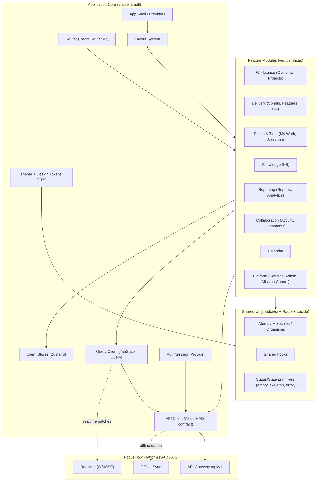
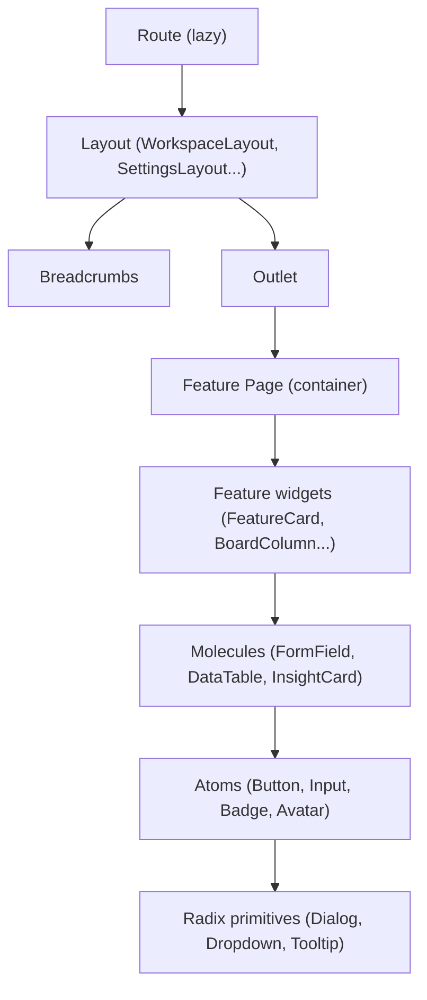
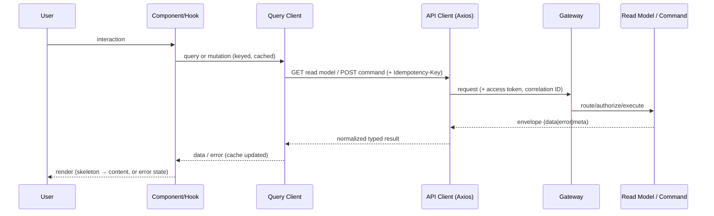
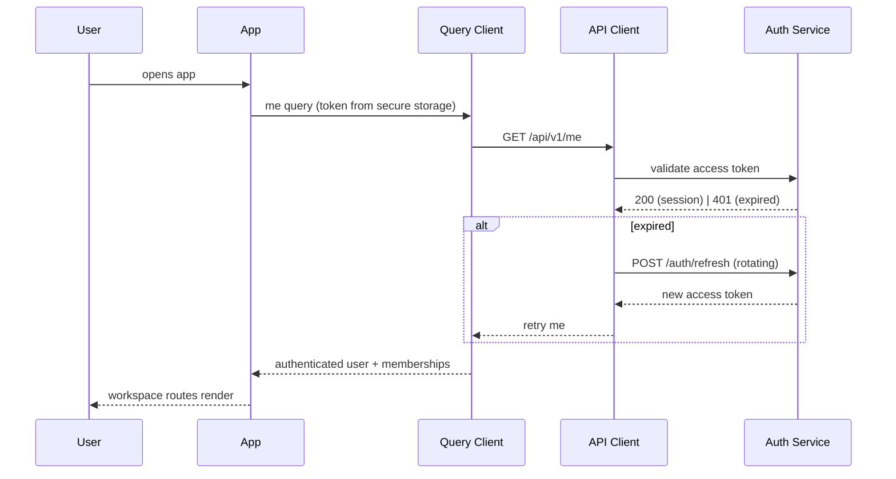
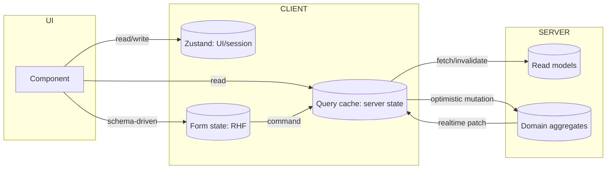
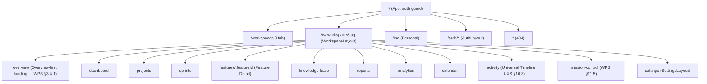
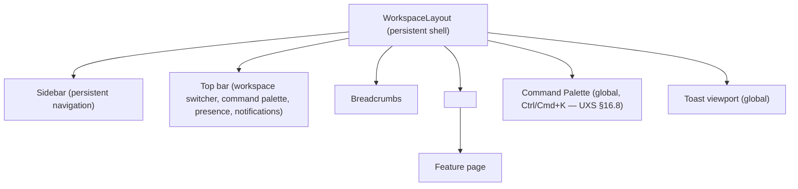
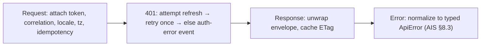
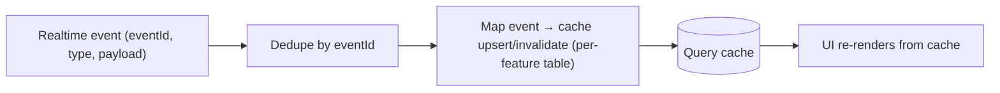

# FocusFlow — Frontend Architecture Guide (FAG)

**Product Name:** FocusFlow
**Document Type:** Frontend Architecture Guide (FAG)
**Supersedes:** N/A — defines how the FocusFlow frontend is architected, organized, developed, maintained, tested, and scaled
**Source of Truth:** FocusFlow PRD (v1.0); WPS (v1.1); UXS (v1.1); DSS (v1.1); DTS (v1.1); DDD (v1.0); SAD (v1.0); AIS (v1.0)
**Audience:** Frontend Engineers, Mobile/Desktop Engineers, Full-Stack Engineers, QA Engineers, Design Engineers, Technical Leads, Engineering Managers
**Status:** Draft v1.0
**Scope:** The complete frontend engineering blueprint for FocusFlow — organization, routing, layout, components, state, API consumption, authentication, forms, data fetching, errors, loading, performance, accessibility, i18n, animation, responsive design, security, testing, code standards, feature modules, deployment, and best practices. This is **not** source code; it is the architecture from which implementation is produced.

**Stack (assumed):** React 19 · TypeScript · Vite · React Router v7 · Tailwind CSS v4 · TanStack Query · Zustand · React Hook Form · Zod · Framer Motion · shadcn/ui · Radix UI · Lucide Icons · Axios · Day.js · React Hot Toast · ESLint · Prettier · Vitest · React Testing Library

---

## Table of Contents

1. [Introduction](#1-introduction)
2. [Frontend Architecture Principles](#2-frontend-architecture-principles)
3. [High-Level Frontend Architecture](#3-high-level-frontend-architecture)
4. [Project Folder Structure](#4-project-folder-structure)
5. [Routing Architecture](#5-routing-architecture)
6. [Layout System](#6-layout-system)
7. [Component Architecture](#7-component-architecture)
8. [Design System Integration](#8-design-system-integration)
9. [State Management Strategy](#9-state-management-strategy)
10. [API Layer Architecture](#10-api-layer-architecture)
11. [Authentication & Authorization](#11-authentication--authorization)
12. [Forms Architecture](#12-forms-architecture)
13. [Data Fetching Strategy](#13-data-fetching-strategy)
14. [Error Handling](#14-error-handling)
15. [Loading & Empty States](#15-loading--empty-states)
16. [Performance Optimization](#16-performance-optimization)
17. [Accessibility (WCAG 2.2 AA)](#17-accessibility-wcag-22-aa)
18. [Internationalization (Future Ready)](#18-internationalization-future-ready)
19. [Animation Guidelines](#19-animation-guidelines)
20. [Responsive Design Strategy](#20-responsive-design-strategy)
21. [Security Considerations](#21-security-considerations)
22. [Testing Strategy](#22-testing-strategy)
23. [Code Standards](#23-code-standards)
24. [Feature Module Template](#24-feature-module-template)
25. [Deployment Considerations](#25-deployment-considerations)
26. [Frontend Best Practices](#26-frontend-best-practices)
27. [Appendix](#27-appendix)

---

## 1. Introduction

### 1.1 Purpose

The FAG is the **single engineering handbook** for building the FocusFlow frontend. It answers: how is the frontend organized? How are features structured? How are pages composed? How do developers add a new feature? How is the API consumed? How is state managed? How is routing implemented? How are reusable components written? How are errors handled? How is performance optimized? How is accessibility implemented? How does the frontend scale over many years?

It exists so that every frontend developer — on any team, in any phase — builds the application **consistently, without architectural drift**, and in exact alignment with the product, design, data, and API contracts already defined.

### 1.2 Scope

**In scope:** application organization (feature modules), routing, layout shells, component architecture, design-system integration (DSS/DTS), state management, API layer (AIS), authentication/authorization UI, forms, data fetching, error/loading/empty states, performance budgets, accessibility, internationalization readiness, animation, responsive strategy, security, testing, code standards, feature-module creation, deployment, and best practices.

**Out of scope:** backend architecture (SAD), database design (DDD), API contracts (AIS), product behavior (PRD/WPS), UX behavior (UXS), design values (DSS/DTS). This document **references** those; it does not redefine them.

### 1.3 Audience

Frontend Engineers · Mobile & Desktop Engineers · Full-Stack Engineers · QA Engineers · Design Engineers (design→code bridge) · Technical Leads · Engineering Managers · Platform/DevOps Engineers (for deployment sections).

### 1.4 Goals

| Goal | Mechanism in this document |
|---|---|
| Consistent build | Feature-first architecture + one folder structure (Ch. 4) |
| No architectural drift | Codified principles (Ch. 2), standards (Ch. 23), and a feature template (Ch. 24) |
| Fast, accessible UI | Performance budgets (Ch. 16) + WCAG 2.2 AA commitments (Ch. 17) |
| Server-aligned data | Read-model-first data fetching aligned with AIS read models (Ch. 10, 13) |
| Multi-surface future | Web core designed so Desktop/Mobile clients reuse the same contracts (SAD §4.1) |
| Long-term maintainability | Boundaries, naming, testing, and review checklists (Ch. 22, 23, 26) |

### 1.5 Non-Goals

- Not a UI spec (that is UXS/DSS).
- Not an API reference (that is AIS).
- Not a backend/DB design (SAD/DDD).
- Not a step-by-step implementation guide with code listings; examples appear only where they clarify a pattern.
- Not a design token inventory (DTS) or component styleguide (DSS).

### 1.6 Relationship with Prior Documents

| Document | What the FAG inherits | Where honored |
|---|---|---|
| **PRD** | Two experiences (Personal Workspace + Workspace); developer-first product; mobile/desktop roadmap | Ch. 4 (feature modules), Ch. 20, Ch. 25 |
| **WPS** | Entities (Project/Sprint/Feature/Task), roles (Owner/Admin/PM/Leader/Dev/QA/Viewer), Overview-first landing, Mission Control, Command Center | Ch. 5 (routes), Ch. 6 (layouts), Ch. 8, Ch. 11 |
| **UXS** | Navigation order (Overview first), breadcrumbs `Workspace → Project → Sprint → Feature`, command palette grammar, progressive disclosure, smart empty states, favorites/recents | Ch. 5, Ch. 6, Ch. 8, Ch. 15 |
| **DSS** | Component library, states (loading/error/empty/permission/archived), skeleton-first loading, toast/animation/accessibility rules | Ch. 7, Ch. 8, Ch. 15, Ch. 17, Ch. 19 |
| **DTS** | Semantic tokens (`<category>-<semantic>[-<modifier>]`), primitive→semantic mapping, dark/light value sets | Ch. 8 (Tailwind theme bridge) |
| **DDD** | Bounded contexts, ownership model, privacy boundary (private execution data never crosses), LWW/conflict semantics | Ch. 9, Ch. 11, Ch. 13 (conflict UI) |
| **SAD** | Clean architecture layering, read/write separation, realtime fan-out, offline-first, feature flags, perf budgets | Ch. 3, Ch. 9, Ch. 10, Ch. 13, Ch. 16 |
| **AIS** | `/api/v1` contract, envelopes, error codes, cursor pagination, idempotency, realtime topics, offline sync, webhooks | Ch. 10, Ch. 12, Ch. 13, Ch. 14 |

**Consistency obligation:** the FAG never contradicts the above. Where the frontend must encode a product/design rule (e.g., QA gate display), it references the owning document rather than redefining it.

---

## 2. Frontend Architecture Principles

### 2.1 The Principles

| # | Principle | Meaning | Primary chapters |
|---|---|---|---|
| P1 | **Feature-first architecture** | Code is organized by product capability, not by technical layer; features own their slices | Ch. 4, Ch. 24 |
| P2 | **Reusability** | Shared, generic capabilities live in `components/`; feature specifics stay in `features/` | Ch. 4, Ch. 7 |
| P3 | **Separation of concerns** | Presentation, behavior (hooks), data access (services), and state are layered and testable | Ch. 3, Ch. 9, Ch. 10 |
| P4 | **Composition over inheritance** | UIs are composed from small parts; shared behavior composes via hooks | Ch. 7 |
| P5 | **Atomic UI** | Components at atom/molecule/organism scale (shadcn/ui + Radix primitives) | Ch. 7, Ch. 8 |
| P6 | **Scalability** | Additive growth: new features land as isolated modules without touching core | Ch. 4, Ch. 24 |
| P7 | **Accessibility-first** | A11y is a build-time constraint (WCAG 2.2 AA), not a retrofit | Ch. 17 |
| P8 | **Performance-first** | Budgets (payload, latency) are enforced in CI; lazy + code-split by default | Ch. 16 |
| P9 | **Mobile-first** | Layouts build from the smallest viewport up; responsive is structural | Ch. 20 |
| P10 | **Maintainability** | Small files, clear naming, minimal prop-drilling, boundaries that survive years | Ch. 4, Ch. 23 |
| P11 | **Type safety** | The AIS contract is encoded as shared TypeScript types; no `any` at boundaries | Ch. 10, Ch. 23 |
| P12 | **Predictability** | One way to fetch, one way to validate, one way to render each state | Ch. 9, Ch. 12, Ch. 13 |
| P13 | **Single source of truth** | Server state lives in the query cache; client state lives in stores; neither duplicates the other | Ch. 9, Ch. 13 |

### 2.2 Trade-offs That Follow From the Principles

| Decision | Rationale | Cost accepted |
|---|---|---|
| Feature-first over layer-first | Matches the AIS/SAD bounded-context structure; teams own vertical slices | Some shared duplication risk → mitigated by shared `components/` |
| Read-model-first data flow | UIs render read models exactly as the API serves them (SAD §9) | Requires disciplined query-key naming (Ch. 13) |
| Server state in Query cache, not Zustand | No duplication; cache invalidation owned by one library | Zustand reserved for small UI/session state |
| Tokens via Tailwind theme bridge (DTS) | One place tokens flow into components; dark mode = semantic swap | Theme-bridge configuration must be governed (Ch. 8) |
| Lazy by default | Performance budget < 200 KB initial payload (SAD §17.3) | Slightly more routing boilerplate (Ch. 5) |
| Conservative optimistic UI | AIS server-authoritative model; conflicts surfaced not guessed (DDD §7) | Less "instant" feel on contested fields |

### 2.3 How Principles Map to Review

Every PR is reviewed against these principles via the code-review checklist (Ch. 26). The checklist is the **enforcement mechanism**; principles alone drift.

---

## 3. High-Level Frontend Architecture

### 3.1 Overall Frontend Architecture

The frontend is a **single-page React application** built as a composition of vertical feature modules around a small, stable core. It follows the client half of the SAD layered model (SAD §4).



### 3.2 Application Layers

| Layer | Responsibility | Depends on | Never depends on |
|---|---|---|---|
| **Core / Shell** | Providers, router, layouts, theme, auth session, query client | — | Feature modules |
| **Feature modules** | One per bounded-context surface; owns pages, components, hooks, services, stores, types, tests | Core, Shared UI | Other feature modules (via public API only, if ever) |
| **Shared UI** | Generic atoms/molecules, state primitives, hooks | Design tokens, Radix | Feature modules |
| **API layer** | Axios client, interceptors, typed AIS contracts, read-model + command services | AIS contract package | UI components |
| **State layer** | Query cache (server), Zustand (client), form state | — | — |

### 3.3 Component Hierarchy



### 3.4 Request Lifecycle



### 3.5 Authentication Flow



### 3.6 State Flow



### 3.7 Data Flow Rules

1. **Read:** components read server state only from the query cache (never fetch ad hoc). Read models map 1:1 to UI widgets (AIS Ch. 4 read-model bundles).
2. **Write:** forms/hooks issue commands through the API layer; the query cache applies optimistic patches and reconciles with the authoritative response (AIS §8.5).
3. **Realtime:** WS/SSE patches flow into the query cache by event ID (idempotent, AIS Ch. 10); components re-render from cache — no bespoke event handling in components.
4. **Privacy:** Focus & Time private surfaces render only owner data; the frontend never renders or requests private execution data in shared surfaces (DDD §13.3).

---

## 4. Project Folder Structure

### 4.1 Canonical Structure

```
src/
├── app/                 # Application composition root: providers, root router, app-wide error boundary
│   ├── App.tsx
│   ├── providers.tsx    # QueryClient, Auth, Theme, Realtime providers
│   └── error-boundary.tsx
├── features/            # Feature-first: one folder per product capability (P1)
│   ├── workspace/
│   ├── delivery/
│   ├── focus/           # Focus & Time (sessions, worklogs, journal) — privacy-aware
│   ├── knowledge/
│   ├── reporting/
│   ├── collaboration/
│   ├── calendar/
│   └── platform/        # Settings, Admin, Mission Control
├── components/          # Shared, generic UI (atoms/molecules/organisms)
│   ├── ui/              # shadcn/ui registry components (Button, Input, Dialog...)
│   ├── primitives/      # Status/state primitives (EmptyState, Skeleton, ErrorState)
│   └── icons/           # Lucide wrappers
├── layouts/             # Layout shells (AuthLayout, WorkspaceLayout, SettingsLayout...)
├── pages/               # Thin route-level composition only (usually empty; pages live in features)
├── hooks/               # Shared hooks (useDebounce, useMediaQuery, useQueryParams)
├── services/            # Thin API adapters per AIS category (see 4.2)
├── api/                 # Axios client, interceptors, typed contract helpers
│   ├── client.ts
│   ├── interceptors.ts
│   └── contract/        # Imported/derived from the shared AIS contract package
├── store/               # Zustand stores (client state only; never server data)
├── lib/                 # Framework glue: query client factory, router factory, theme bridge
├── utils/               # Pure helpers (date, format, cn, invariant)
├── constants/           # Static constants (feature flags keys, route names, event types)
├── types/               # Cross-cutting types (from AIS contract) + domain refinements
├── styles/              # Tailwind entry, token bridge (DTS → Tailwind), global css
├── assets/              # Static assets (images, fonts) — imported, not URL strings
├── providers/           # React context providers (prefers app/providers.tsx; per-feature here)
├── config/              # Runtime config (env-typed)
└── routes/              # Route tree definitions + guards (see Ch. 5)
```

### 4.2 Feature Module Internal Structure

Each `features/<name>/` folder is self-contained (detailed in Ch. 24):

```
src/features/delivery/
├── api/                 # service functions for this feature's AIS endpoints
├── components/          # feature-specific components (FeatureCard, BoardColumn)
├── hooks/               # feature-specific hooks (useBoardData, useQaGate)
├── pages/               # route page components for this feature
├── store/               # feature-scoped client state (if any)
├── types/               # feature types refined from AIS contract
├── lib/                 # feature-local pure logic (status order, health color)
├── constants/           # feature constants (lifecycle enum, rule keys)
└── __tests__/           # colocated unit/component tests
```

### 4.3 Why Feature-First Architecture Is Preferred

| Criterion | Feature-first | Layer-first (all components in one tree) |
|---|---|---|
| Team ownership | One folder per team capability (WPS/DDD bounded contexts) | Cross-cutting files create merge contention |
| Onboarding | New dev learns one feature folder end-to-end | Must traverse the whole tree to understand one screen |
| Removal/refactor | Delete a folder; impact is contained | Touch many folders for one feature change |
| Testing | Colocated tests per feature | Tests scattered or orphaned |
| Scalability (P6) | New features add folders, never touch core | Core grows unboundedly |

**The trade-off:** feature-first can duplicate similar small widgets across features. Mitigation: shared capabilities move **up** to `components/` when the *third* feature needs them (the Rule of Three, Ch. 7).

### 4.4 `pages/` Is Intentionally Thin

Route pages are composition points: they assemble feature widgets + layout. Almost all real work lives in feature modules. This keeps the route tree readable (Ch. 5) and prevents page-level code accumulation.

### 4.5 What Lives Where (Decision Table)

| Concern | Home |
|---|---|
| Server data fetching | `features/<name>/api/` or `services/` (thin), consumed via hooks |
| Typed API contract | `api/contract/` (shared package mirror) |
| Client-only UI state | `store/` (Zustand) or component state |
| Server state / cache | TanStack Query cache (never in Zustand) |
| Generic reusable UI | `components/` |
| Feature-specific UI | `features/<name>/components/` |
| Layouts | `layouts/` |
| Pure logic | `utils/` (generic) or `features/<name>/lib/` (specific) |
| i18n strings | `locales/` (Ch. 18) |
| Runtime config | `config/` (env-typed) |

---

## 5. Routing Architecture

### 5.1 Route Model

Routing is **data-driven**: the route tree lives in `src/routes/` as a typed, lazy-loaded configuration consumed by the router. Routes are always scoped:

- Public: `/login`, `/signup`, `/auth/*` (password reset, email verify), `/invite/:token`, `/landing`.
- Authenticated root: `/` → workspace hub (`/workspaces`).
- Workspace-scoped: `/w/:workspaceSlug/...` — mirrors the AIS `workspaceId` scoping (AIS §7.2).
- Member-private: `/me/...` (My Work, Sessions, Journal, Settings personal) — mirrors AIS `/me` resources.

### 5.2 Route Hierarchy



### 5.3 Nested Routing & Layouts

Nested routes attach layouts (Ch. 6): `WorkspaceLayout` wraps all `/w/:workspaceSlug/*`; `SettingsLayout` wraps settings; `AuthLayout` wraps auth screens. Outlets compose — the active child renders inside the parent layout's `<Outlet/>`.

### 5.4 Protected & Public Routes

| Route class | Guard | Behavior on failure |
|---|---|---|
| Public | Redirect to `/workspaces` if authenticated | — |
| Authenticated | Valid session (Ch. 11) | Redirect to `/auth/login?next=` |
| Workspace-member | Membership check for `workspaceSlug` | 404 (do not reveal existence) or "not a member" state |
| Role-gated | Capability check (Ch. 11 §11.6) | Explained permission state (DSS two-tier: hidden vs. explained) |
| Owner/Admin | Settings/Admin/Mission-Control management routes | Explained permission state |

- **Workspace membership** is checked against the session's memberships (AIS §5.8), **not** re-fetched per route.
- **Role-gated routes** render a "Viewers can't edit projects — contact an Admin" explained state rather than a dead screen (DSS §14.x).

### 5.5 Lazy Loading

- Every route's page/module is **lazy-loaded** (`React.lazy` / route-level dynamic import) — code splitting by feature (Ch. 16).
- The shell + auth screen are eager; everything else is lazy. Target: initial route payload < 200 KB gzipped (SAD §17.3).
- Suspense boundaries per lazy segment render skeletons (Ch. 15), never blank screens.

### 5.6 Route Guards

Guards are **composable functions** attached to the route config: `requireAuth`, `requireWorkspaceMembership`, `requireRole(roles)`, `requireFlag(flag)`. They execute during navigation (before render) and can redirect or render an explained state. Feature-flag gating uses the same guard mechanism (DSS Appendix D lifecycle: Experimental/Beta gated).

### 5.7 Breadcrumbs

- Breadcrumb model from UXS: `Workspace → Project → Sprint → Feature`.
- Breadcrumbs are **derived from route data** (`handle.breadcrumb`) — never hard-coded in layouts.
- Feature/project titles resolve from the query cache (no extra fetch); show skeleton crumbs while loading.

### 5.8 Dynamic Routes & URL State

- Dynamic params: `workspaceSlug`, `projectId`, `sprintId`, `featureId`, `kbDocId`, `reportId`, `memberId`.
- **Filter/sort/pagination state lives in the URL** (search params) for shareable, back-button-friendly surfaces (board filters, timeline filters, report params) — a core UXS requirement.
- `useQueryParams` hook (shared) serializes typed params; unknown params are ignored (AIS forward-compat: additive query params).

### 5.9 Error Routes

| Scenario | Handling |
|---|---|
| Route-level load failure | Route error element → DSS error state with retry |
| API failure on page | Error boundary + retry (Ch. 14) |
| Lazy chunk load failure | Retry chunk; on repeat failure → full reload state |

### 5.10 404 Strategy

- Unknown path under a workspace → workspace 404 ("This page doesn't exist in this workspace") with back-to-Overview action.
- Unknown workspace slug → workspace-level 404 (do not reveal whether the slug exists).
- Global 404 → root 404 with search + navigation help.
- 404 pages are **composed empty states** (DSS/UXS §16.4): explanation + recommended action + shortcut hint.

### 5.11 Loading Routes

- Route transition uses a top progress bar (Ch. 15) + skeleton per segment.
- No full-page spinners for known content shapes (DSS §7.28): skeletons mirror the final layout.

---

## 6. Layout System

### 6.1 Layout Catalogue

| Layout | Scope | Contents |
|---|---|---|
| **AuthLayout** | `/auth/*`, `/invite/*` | Centered card, brand mark, minimal chrome |
| **AppShell / HubLayout** | `/workspaces` | Workspace hub/switcher (UXS §4.2) |
| **WorkspaceLayout** | `/w/:workspaceSlug/*` | Sidebar (Overview-first order: Overview, Dashboard, modules), top bar, command palette trigger, breadcrumbs, outlet |
| **SettingsLayout** | `/w/:workspaceSlug/settings/*` | Left settings nav (nested) |
| **MissionControlLayout** | `/w/:workspaceSlug/mission-control` | Fullscreen wall (WPS §11.5), minimal chrome |
| **PersonalLayout** | `/me/*` | Personal nav (My Work, Sessions, Journal, Reports, Settings) |
| **AdminLayout** | `/w/:workspaceSlug/admin/*` | Admin nav (members, audit, flags, usage) |
| **LandingLayout** | `/landing` | Marketing surface, no app chrome |

### 6.2 Shell Architecture



### 6.3 Persistent Navigation

- Sidebar order is fixed per UXS §3.2: **Overview first**, then Dashboard, then modules.
- Sidebar includes a **Favorites section** (UXS §3.7, pinnable, drag-to-reorder) and Recents.
- Active route highlights; keyboard-first navigation (`Ctrl/Cmd+K` palette, arrow keys).
- Progress disclosure: advanced items collapse into "Advanced" sections; core navigation never hides (UXS §7.18).

### 6.4 Responsive Layout Behavior

| Breakpoint | Sidebar | Top bar | Navigation pattern |
|---|---|---|---|
| < md | Hidden (drawer) | Compact, menu button | Drawer navigation |
| md–lg | Collapsible (icons) | Full | Rail + expandable |
| ≥ lg | Fixed, full | Full | Persistent sidebar (Ch. 20) |

### 6.5 Layout Rules

1. Layouts own chrome and **no business logic**; pages own content.
2. Layout state (sidebar collapsed, favorites order) persists per user (Zustand + storage; DDD §5.4 personal).
3. `Outlet` composition keeps nested layouts trivial to add (settings sections, etc.).
4. Fullscreen/dim surfaces (Mission Control) exit with `Esc` (WPS §11.5).

---

## 7. Component Architecture

### 7.1 Component Taxonomy

| Kind | Definition | Example | Location |
|---|---|---|---|
| **Presentational** | Pure UI from props; no data access | `Button`, `Badge`, `EmptyState` | `components/` |
| **Container** | Behavior + data access; renders presentational parts | `BoardColumn` (fetches, filters) | `features/<name>/components/` |
| **Shared** | Generic, reused across features | `DataTable`, `Dialog`, `FormField` | `components/` |
| **Feature** | Owned by one feature, not generic | `FeatureCard`, `QaGatePanel` | `features/<name>/components/` |
| **Layout** | Chrome and composition | `WorkspaceLayout`, `SettingsLayout` | `layouts/` |
| **Page** | Route-level composition | `ProjectsPage` | `features/<name>/pages/` |

### 7.2 Composition Rules

- **Compose, don't inherit** (P4): reuse via nesting and props; behavior via hooks.
- **Rule of Three:** a generic capability moves to `components/` when a third feature needs it; two uses stay local (avoids premature abstraction).
- **Containers are thin:** data hooks (Ch. 13) + presentational composition; heavy logic lives in hooks and services, not JSX.

### 7.3 Props Design

- Props are **explicit and typed** (no implicit `any`); the AIS contract types flow down.
- Prefer **narrow props** (pass data the component renders) over passing whole entities where a component needs a slice.
- **`children` composition** for flexible layout (Dialog content, card actions) instead of flag-driven variants.
- Variants use design-system semantics (DTS) rather than ad-hoc booleans; style props stay at the token level.

### 7.4 Controlled vs. Uncontrolled

| Case | Choice | Reason |
|---|---|---|
| Inputs in forms | Uncontrolled (React Hook Form `register`) | RHF owns state; fewer re-renders |
| Shared inputs outside forms | Uncontrolled + `defaultValue` | Simpler; value via ref |
| Rich components needing external state (date pickers, tables) | Controlled | Parent needs the value |
| Compound components (Tabs, Dialog, Dropdown) | Controlled by context internally | Radix pattern |

### 7.5 Component Boundaries

- **Boundary by capability** (feature) and **by reuse** (shared). A component belongs to exactly one owner.
- Components must not reach into the query cache or stores directly — they receive data/handlers via hooks in their container, or props. (Direct data access only inside feature hooks/containers.)
- **No cross-feature imports of feature internals:** features communicate via shared contracts (types/hooks in `components/` or shared `services/`), never via one another's internals (mirrors DDD bounded contexts).

### 7.6 Reusable Patterns

| Pattern | Where | Notes |
|---|---|---|
| Compound components | Dialogs, Dropdown, Tabs, DataTable | Radix-based; consistent API |
| Slot/children | Card actions, table cells | Flexible without variant explosion |
| Render via hooks | `useFeatureList()`, `useBoardData()` | Data + state combined, testable |
| Presentational + container | All feature screens | Testable presentational layer |
| Polymorphic (`asChild`) | Buttons, links | shadcn/ui convention |
| Composition over config | Layouts, empty states | Avoid mega-props objects |

---

## 8. Design System Integration

### 8.1 Token Bridge (DTS → Tailwind)

- **Design tokens are the single source of truth** (DTS). A build-time bridge maps semantic tokens (`<category>-<semantic>[-<modifier>]`) into Tailwind v4 theme variables.
- **Primitive→semantic** only: components reference semantic tokens (`surface-raised`, `text-muted`, `status-success`), never raw primitives (`gray-900`).
- **Dark/light are value sets over the same semantic names** (DTS §6): components don't branch on theme; the token value swaps.

```
DTS semantic tokens ──► token-bridge (build time) ──► Tailwind v4 theme
                                                        │
                                     CSS variables per theme (light/dark)
                                                        │
                                       components consume via utility classes
```

### 8.2 Typography & Spacing

- Type scale + spacing from DTS; fluid type at container level (Ch. 20).
- Text uses semantic styles (heading, body, caption, code); no ad-hoc font sizes in components.
- Spacing always from the token scale (DTS §4) — never arbitrary px.

### 8.3 Color System

- Semantic color roles from DTS/DSS (background, surface, border, text, status, accent).
- Status colors align with WPS health semantics: Healthy/At Risk/Blocked/Waiting/Planned (WPS §10.5) and QA/release states.
- Dark mode is a token value set (DTS), toggled by theme provider (system/preference/manual).

### 8.4 Icons
- Lucide only, via a thin wrapper in `components/icons/`; size and color from tokens; decorative icons `aria-hidden`.

### 8.5 Component Inventory (from DSS, via shadcn/ui registry)

| Category | Components |
|---|---|
| Actions | Button, IconButton, DropdownMenu, SplitButton |
| Inputs | Input, Textarea, Select, Combobox, Switch, Checkbox, Radio, Slider, DatePicker |
| Feedback | Toast, Banner, Progress, Spinner |
| Data display | Card, Badge, Avatar, Tag, DataTable, DataTree |
| Overlays | Dialog, Sheet, Popover, Tooltip, Command (palette) |
| Navigation | Tabs, Breadcrumb, Sidebar, CommandMenu |
| Charts | (Analytics feature) chart primitives on tokenized axes |

All registered via the shadcn/ui registry and versioned with DSS Appendix D lifecycle (Stable consumable; Experimental/Beta gated).

### 8.6 State Primitives (shared, DSS-mandated)

- **EmptyState** — composed per UXS §16.4 (explanation + recommended action + shortcut hint + related docs/template).
- **Skeleton** — mirrors final content shape (DSS §7.28).
- **ErrorState** — contextual, "what happened + what to do" + retry (DSS §13.x).
- **PermissionState** — two-tier: hidden vs. explained ("Viewers can't edit projects — contact an Admin").
- **OfflinePill / PendingBadge** — offline + sync reconciliation states (UXS §9.4, §11.3).

### 8.7 Theming
- Theme provider resolves system/manual; persists per user (DDD §5.4).
- No hard-coded colors outside the bridge; `prefers-reduced-motion` honored (Ch. 19).
- Theme switching is instant (token swap), not a full reload; FOUC avoided by early theme script.

---

## 9. State Management Strategy

### 9.1 State Taxonomy & Ownership

| State | Tool | Where | Example |
|---|---|---|---|
| **Server state** (read models) | TanStack Query cache | Query cache, keyed | Project list, feature detail, board |
| **Server mutations** | TanStack Query mutations | Query layer | Create feature, QA transition |
| **Session/auth** | Zustand (persisted token envelope) + Query (`me`) | `store/session.ts` | Access/refresh token, memberships, current workspace |
| **Client UI state** | Zustand (or component state) | `store/` | Sidebar collapsed, palette open, filter draft |
| **Form state** | React Hook Form | Local to form | Feature create form |
| **URL state** | Search params | Router | Board filters, timeline filters |
| **Server cache metadata** | Query client options | Query layer | Stale time, retry, background refresh |

### 9.2 The Single Source of Truth Rule (P13)

> Server data lives **only** in the query cache. Zustand holds **only** client-side state. A piece of state has exactly one owner.

Violations to reject in review: putting fetched data into Zustand; refetching data that is already cached; two stores holding the same flag.

### 9.3 Tool Selection Matrix

| Need | Tool | Why |
|---|---|---|
| Fetch/cache server read models | TanStack Query | Caching, retry, background refresh, invalidation, optimistic updates (Ch. 13) |
| Small client UI state | React `useState`/`useReducer` | Local, ephemeral |
| Cross-feature client state (few writers) | Zustand | Small, fast, no boilerplate |
| Cross-feature client state (frequent, complex) | Zustand with selectors | Selective subscriptions |
| Theme / feature flags / session | Zustand (persisted) or Context | Per case |
| Auth identity, memberships | Query cache (`me`) + session store | Cache owns data; store owns envelope |
| Realtime patches | Query cache (invalidate/upsert) | Cache is the UI truth (SAD §9.3) |

### 9.4 When to Use React Context vs Zustand

- **Context** for: low-frequency, provider-scoped values (theme, current workspace slug, locale). Fine for < dozens of consumers.
- **Zustand** for: state that must survive across the tree and be subscribed selectively (session, palette, sidebar), or where context re-renders would be wasteful.
- Context is **not** used to share server data or as a general store.

### 9.5 Optimistic Updates

- Pattern per AIS: optimistic mutation → temp ID → server ack replaces temp with canonical ID; conflict → reconcile per AIS §11.4 (AIS offline merge matrix applies to online optimistic flow too).
- Optimistic updates are **conservative** (Ch. 2 §2.2): only for low-contention fields (feature status, comments, checklists). Never for QA gate transitions or immutable evidence (first-completion-final, DDD §7.2).
- All optimistic mutations carry `Idempotency-Key` (AIS §7.9).

### 9.6 Persistence

- Persisted client state: session envelope (secure storage, Ch. 21), theme, sidebar prefs, favorites order, recent items (UXS §3.7, §3.8).
- **Never persist** server cache to localStorage (staleness/privacy); the query cache is in-memory, rebuilt from the API + realtime.

### 9.7 State Boundaries (privacy)

- Focus & Time private state (sessions, worklogs, journal) never enters shared stores or cross-feature state.
- Personal preferences/favorites/recents are owner-only (DDD §5.4).
- Mission Control focus totals render only anonymized aggregates (WPS §11.5, DDD §13.3).

---

## 10. API Layer Architecture

### 10.1 API Client (Axios)

A single typed Axios instance is the **only** HTTP client in the app.

| Responsibility | Implementation |
|---|---|
| Base URL + versioning | `/api/v1` from `config/` |
| Auth headers | Access token attached via interceptor (Ch. 11) |
| Correlation IDs | `X-Request-ID` / `X-Correlation-ID` per request/batch |
| Idempotency | `Idempotency-Key` header on mutations (AIS §7.9) |
| Localization | `Accept-Language` from locale (Ch. 18) |
| Timezone | `X-Timezone` from user profile (AIS §7.13) |
| Error normalization | Interceptor → typed `ApiError` from the AIS envelope (Ch. 14) |
| Cancellation | AbortController wired to TanStack Query lifecycle |
| Retry | Only for `retryable` errors (AIS §8.5), with backoff |

### 10.2 Interceptors



### 10.3 Authentication Headers & Refresh

- Access token from secure storage; on `401`/`TOKEN_EXPIRED`, interceptor silently refreshes (AIS §5.3) and retries once. On refresh failure → session expiry event (Ch. 11).
- Refresh requests themselves never use the access token; refresh token is HttpOnly/Secure cookie or secure storage (AIS §19.2).

### 10.4 Typed Contracts

- Request/response types come from the **shared AIS contract package** (SAD §8.3) — the single mirror of `/api/v1`.
- The client exposes per-category service functions (`workspaceApi.listProjects`, `deliveryApi.createFeature`) rather than raw Axios calls scattered in components.
- Responses are unwrapped to `data` by an interceptor; `meta` (pagination/correlation) exposed via typed hooks.

### 10.5 Request Cancellation

- Query-driven requests cancel automatically when the component unmounts (TanStack Query + AbortController).
- Manual cancel only for long-running user-initiated jobs (export, AI generation) via job endpoints (AIS §18.6).

### 10.6 Pagination, Filtering, Sorting

| Concern | Convention (AIS Ch. 7) |
|---|---|
| Pagination | Cursor-based; `limit` + opaque `cursor`; hooks expose `nextCursor` + infinite loading |
| Filtering | Declarative `?status=&assigneeId=&...`; serialized into URL state (Ch. 5) |
| Sorting | `?sort=field:dir`; allowed fields per resource (AIS §7.5) |
| Search | `?q=` for list endpoints; dedicated Search APIs for global/command-palette (AIS Ch. 12) |

### 10.7 Caching (HTTP-level)

- Read models: `Cache-Control: private, max-age=0, must-revalidate`; ETag/304 conditional requests (AIS §8.6).
- The API layer surfaces ETags to the query client; realtime patches keep the cache fresh (Ch. 13).

---

## 11. Authentication & Authorization

### 11.1 Session Model

- **Session = access token (short-lived, ~15 min) + rotating refresh token** (AIS §5.1–5.3).
- The app keeps a **session envelope** in a persisted Zustand store: token presence, user profile id, memberships, default workspace, current workspace.
- The authoritative user/membership data lives in the `me` query cache entry; the envelope is a client convenience (P13: no duplication of server data).

### 11.2 Login Flow

```
User → /auth/login → RHF + Zod form → authApi.login()
   → access + refresh stored securely → session store hydrated
   → `me` query fetched → route guard resolved → workspace (Overview-first) rendered
```

- `next` query param returns the user to their intended route.
- On `423` (suspended) show the DSS contact-Admin state.

### 11.3 Logout Flow

- `authApi.logout()` → revoke refresh → clear secure storage → reset session store + clear query cache (all workspace data) → redirect to `/auth/login`.
- Logout clears the **entire query cache** — no cross-account data leak (session isolation).

### 11.4 Session Validation & Expiry

- Access-token expiry handled by the API interceptor (silent refresh, Ch. 10 §10.3).
- **Auto-logout** on refresh failure or a `401 TOKEN_REVOKED`: emit a session-expiry event → redirect to login with a message ("Your session expired").
- Realtime connection closes on expiry; presence clears on logout/disconnect (WPS §11.1).

### 11.5 Protected Routes

- Route guards (Ch. 5 §5.4) consult the session store + `me` cache. Guard resolution is **synchronous from cache** — no flicker; stale cache refreshed in background.
- Guard order: authenticated → membership → role capability.

### 11.6 Role-Based Access (RBAC)

- The role set is fixed (Owner/Admin/PM/Leader/Developer/QA/Viewer — WPS §5.1).
- A shared `useCan(permission)` hook + `requireRole` guard map to the AIS permission matrix (AIS §6.4).
- **UI hiding vs. explanation (DSS):** low-stakes controls hide for unauthorized roles; high-stakes actions (QA gate, settings) show an explained state when the user could plausibly expect them.

### 11.7 Permission Checks

- Client checks are **UX only** — the server is authoritative (AIS §19). The UI never relies on a hidden button as a security boundary.
- Feature flags (DSS Appendix D lifecycle) gate new surfaces; capabilities and flags are both consumed via typed hooks.

### 11.8 Token Lifecycle (summary)

```
login ──▶ access (15m) + refresh (rotating)
             │
   interceptor: 401 → refresh → retry once
             │
   refresh failure / revoked ──▶ auto-logout (clear cache + storage)
```

### 11.9 Security Notes (client-side)

- Tokens in secure storage (Ch. 21 §21.3); never in localStorage by default, never in state/URLs/logs.
- No credentials in client-side memory beyond request time (minimize exposure surface).

---

## 12. Forms Architecture

### 12.1 Stack & Roles

| Concern | Tool |
|---|---|
| Field state + registration | React Hook Form |
| Validation | Zod schemas (resolver) |
| Rendering | Radix/shadcn inputs wrapped as `FormField` |
| Error display | DSS form-field error + field-level messages (AIS §8.3 details) |

### 12.2 Reusable Form Components

- `FormField` wraps RHF `Controller`/`register` + label + error + hint (DSS form anatomy).
- Primitives: `TextField`, `TextArea`, `SelectField`, `DateField`, `SwitchField`, `ComboboxField`, `TagInputField`.
- Forms render schema-driven fields where a form has many fields (reports, settings).

### 12.3 Validation Strategy

- **Zod schema = single source of truth** for shape + invariants; mirrors AIS validation rules (Ch. 4 cards) so client messages match server codes.
- Client validation is UX-fast; server `422` details still surface (server is authoritative, AIS §8.5).
- Field-level: validate on blur/touch; form-level on submit; async field validation (slug uniqueness, email existence-style checks) debounced.

### 12.4 Async Validation

- Debounced server checks for fields that need it (e.g., workspace slug availability) via a query/mutation; show inline loading + result.
- Never block submit on pure-client checks that the server also enforces.

### 12.5 Error Display

- Field errors: DSS field error under the input, linked via `aria-describedby`.
- Form-level errors: banner (what happened + what to do).
- `409` conflicts and `422` invariant violations (QA gate, scope) surface as DSS contextual banners — never swallowed (AIS §8.5).

### 12.6 Form Composition

- Forms compose via `FormSection` components; each section owns its sub-schema (large forms).
- Reset/initial values derived from the query cache (edit forms) or defaults (create forms).

### 12.7 Large & Wizard Forms

- **Wizard** (e.g., workspace creation with template picker, onboarding — UXS §16.1): step schemas merged at submit; progress persisted (draft state) so refresh doesn't lose progress; step X of N; skip/resume honored (UXS §16.1).
- Large forms: sections + progressive disclosure (Advanced sections per UXS §7.18); autosave for long-form content (docs, journal).

### 12.8 Autosave

- Used for long-form content (KB docs, journal, notes) and settings drafts.
- Debounced save with `Idempotency-Key` + optimistic patch; offline → queue (Ch. 13 §13.7); explicit "Saved / Saving… / Offline" indicator (UXS §9.4).

---

## 13. Data Fetching Strategy

### 13.1 Query Model

TanStack Query is the single data-fetching layer (P13). Rules:

- Every read is a **query with a typed key**; every write is a **mutation**.
- Queries are **idempotent and cacheable**; mutations carry `Idempotency-Key` (AIS §7.9).
- Data is read from cache; **no component fetches directly** (Ch. 3 §3.7).

### 13.2 Query Keys (canonical)

Keys are hierarchical and scoped, mirroring AIS routes. A key factory per feature.

| Key | Data |
|---|---|
| `me` | Session user + memberships |
| `['workspace', slug]` | Workspace metadata |
| `['workspace', slug, 'overview']` | Overview bundle (AIS 4.3.4) |
| `['workspace', slug, 'projects']` + filters | Project list |
| `['workspace', slug, 'projects', id, 'board']` | Board |
| `['feature', id]` | Feature detail |
| `['feature', id, 'detail']` | Feature detail bundle (AIS 4.6.7) |
| `['me', 'sessions']` + range | Private sessions |
| `['workspace', slug, 'mission-control']` | MC bundle |

- Filter/pagination params are **part of the key** (deterministic cache), serialized from URL state (Ch. 5).
- Never put non-serializable values (callbacks, component instances) in keys.

### 13.3 Mutations & Cache Invalidation

| Mutation type | Cache strategy |
|---|---|
| Create | Invalidate parent list; optimistic insert with temp ID |
| Update | Optimistic patch → reconcile with response; invalidate dependent read models |
| Transition (status/QA) | Optimistic on low-risk; invalidate board/feature/health keys |
| Async job (report/export/AI) | `202` → job status query + realtime completion (AIS §18.6) |

Invalidation targets are declared in a per-feature map (`featureMutationEffects`) — one place, not scattered `invalidateQueries` calls.

### 13.4 Background Refresh

- Defaults: `staleTime` (e.g., 30–60 s for lists, longer for static), `refetchOnWindowFocus` enabled for collaborative surfaces (presence, activity), disabled where wasteful.
- Per-query tuning by surface: dashboards tolerate sub-second staleness (DDD §11); static KB/docs refresh rarely.

### 13.5 Infinite Queries

- Cursor pagination (AIS §7.4) via `useInfiniteQuery`; "Load more"/infinite scroll (DSS §14.7) for feeds, activity/timeline, audit log.
- `nextCursor` drives the next page; end-of-list state is an explicit terminal (no repeated empty fetches).

### 13.6 Polling & Prefetching

- Polling: presence (heartbeat-based), long-running job status — only where realtime is unavailable (SSE fallback per AIS §10.1).
- Prefetch: on hover/navigation intent (feature detail, next page of a list), command palette top results (UXS §16.8).
- Never poll what realtime already pushes (AIS Ch. 10).

### 13.7 Offline Behavior

- Reads: serve cached read models when offline; show offline pill + "showing saved data" (UXS §9.4, DSS §14.x).
- Writes: enqueue to the durable offline queue with temp IDs + base version (AIS §11); on reconnect, `POST /sync` replay, then pull (`/sync/pull`), reconcile conflicts per AIS §11.4.
- Conflict results surface per AIS merge matrix (field-level LWW, semantic `422` with reason, immutable-evidence rejection) via dedicated conflict UI — never silent.
- Reconciliation summary: "3 changes synced, 1 needs review" (UXS §11.3).

### 13.8 Realtime → Cache



- Event→cache mapping lives in feature modules (`registerRealtimeHandlers`), never scattered in components.
- Missing/gapped events trigger targeted refetch or `/sync/pull` catch-up (AIS §10.4).

---

## 14. Error Handling

### 14.1 Error Taxonomy

| Error | Source | Handling |
|---|---|---|
| API/network errors | API layer → typed `ApiError` (AIS §8.3) | Per-state UI (below) |
| Validation errors | RHF/Zod + server `400/422` | Field + banner |
| Auth errors | `401/403/423` | Refresh/redirect/permission state |
| 404 | Route/resource | Composed 404 (Ch. 5 §5.10) |
| 5xx / unavailable | Server | Retryable banner + backoff |
| Render errors | Component throw | Error boundaries |

### 14.2 Global vs. Local

- **Global:** auth failures (session expiry → auto-logout), catastrophic app errors (root boundary → recoverable screen), connection lost (offline pill is app-wide).
- **Local:** per-surface API failures render **in context** (DSS banner/card in the widget), so one failing widget never blanks a page.

### 14.3 API Error Normalization

The interceptor converts every failure into a typed error carrying the AIS envelope fields: `code`, `message`, `details[]`, `retryable`, `retryAfterSeconds` (AIS §8.3). Components switch on stable `code`, never on HTTP numbers alone.

### 14.4 Retry UI

- **Automatic** retry for `retryable` (429/5xx/503) with exponential backoff (AIS §8.5).
- **Manual** retry button on persistent banner states ("Still loading…" > 3 s slow state, DSS §2.14).
- Idempotency keys make manual retries safe for mutations.

### 14.5 Toast Strategy

- React Hot Toast, global viewport; **priority-aware** (DSS §7.26: High persists; Medium/Low center-only/digest).
- Toasts for async completions (report generated, export ready, AI job done), notifications, and transient confirmations.
- Error toasts are reserved for actions the user just took; page errors use in-context banners, not toasts.
- Toast accessibility: `role="status"`/`role="alert"` + focus behavior (Ch. 17).

### 14.6 Fallback UI

- **Route-level error element** per lazy segment → DSS error state + retry.
- **Error boundaries** at: app root, route segments, and heavy feature widgets (Mission Control can fail independently).
- Boundary renders a composed state (what happened + what to do + retry), never a blank screen; boundary reset on route change.

### 14.7 Conflict Handling

- `409`/`422` conflicts (stale version, QA gate, scope) open the **conflict resolution UI** (AIS §11.4, SAD §15.3): per-field options, evidence, "rejected — reason" states.
- Offline reconciliation conflicts use the same component.

---

## 15. Loading & Empty States

### 15.1 Loading Philosophy (DSS §7.28)

- **Skeleton-first:** for known content shapes, skeletons mirror the final layout — never full-page spinners.
- Replace skeleton ≤ 1.5 s typical; > 3 s → slow-state pattern ("Still loading…" + cancel/retry).
- Suspense boundaries render skeletons per segment (Ch. 5 §5.5).

### 15.2 State Components

| State | Component | When |
|---|---|---|
| Loading | `Skeleton` | Known shape, first paint pending |
| Loading slow | `SlowState` | > 3 s (DSS §2.14) |
| Inline busy | `Progress` / `Spinner` | In-button, in-cell actions |
| Route transition | Top progress bar | Navigations |
| Empty | `EmptyState` | No records (composed per UXS §16.4) |
| No results | `EmptyState` variant | Filters/search returned nothing |
| Not enough data | `EmptyState` variant | Analytics need more history ("Connect more sprints…") |
| Permission-scoped | `PermissionState` | Hidden/explained (DSS §14.x) |
| Archived filter | `EmptyState` variant | Archived-only results |

### 15.3 Empty State UX (UXS §16.4)

Every composed empty state includes:
1. Illustration/glyph
2. **Explanation** (why it's empty)
3. **Recommended next action** (primary button)
4. **Shortcut hint** (e.g., `⌘K` → Create)
5. **Related documentation / template suggestion**

Surface-specific examples (per UXS §16.4): board "Start a sprint" + "Create a project"; QA queue "QA queue is clear"; releases "No releases yet — they'll appear when a project ships."

### 15.4 Distinguishing Empty Cases

The API/read-model layer distinguishes `empty` (no records), `no-results` (filters), `not-enough-data` (insufficient history), and `permission-scoped` — the UI renders the correct composed state for each (AIS §8, DSS §14.x). A bare "No items" is never acceptable.

### 15.5 Placeholder Strategy

- Image placeholders (avatars, branding) use tokenized fallbacks; no broken-image flashes.
- Skeleton shapes must match real content dimensions to avoid layout shift (CLS budget, Ch. 16).

---

## 16. Performance Optimization

### 16.1 Budgets (SAD §17.3)

| Metric | Budget | Enforcement |
|---|---|---|
| Initial route payload | < 200 KB gzipped | Bundle analysis in CI |
| Read-model p95 | < 300 ms | Perf tests / observability |
| Write ack p95 | < 500 ms | Observability |
| Realtime → UI | < 1 s | Observability |
| LCP | < 2.5 s | Lighthouse in CI |
| CLS | < 0.1 | Lighthouse in CI |

### 16.2 Lazy Loading & Code Splitting

- Route-level dynamic imports (Ch. 5 §5.5) split by feature module.
- Heavy third-party libraries (charts, date pickers, markdown) are feature-loaded, never in the shell.
- Vendors split by strategy; React/query/shell stay in a stable chunk for caching.

### 16.3 Memoization

- `React.memo` on expensive presentational components **only where** re-renders are measured as hot; default is no premature memo.
- Selectors with Zustand (`useShallow`) and query cache selectors (`select`) to limit re-renders.
- Contexts: split providers to avoid broad re-renders (theme vs. data).
- Framer Motion: isolate motion components (transform-only) to avoid layout re-render costs (Ch. 19).

### 16.4 Virtualization

- Long lists: activity/timeline, audit log, member lists, KB tree expansion, large tables.
- Use a virtualizer for lists > ~100 rows; keep skeleton + empty states compatible.

### 16.5 Image Optimization

- Avatars/branding: responsive `srcset`, correct format (webp/avif), lazy `loading="lazy"` below the fold.
- No full-resolution images in list views; thumbnails generated server-side (File APIs, AIS Ch. 13).

### 16.6 Bundle Optimization & Tree Shaking

- Import from library subpaths where required (Radix, Lucide, Day.js plugins) to keep tree shaking effective.
- No `*` imports of icon libraries (shakes poorly) — use named imports.
- Analyze bundles per PR (budget check); flag accidental feature-to-shell leakage.

### 16.7 Caching & Preloading

- Query cache reuse across routes (key discipline, Ch. 13).
- Preload: route-level `prefetch` on hover/intent (Ch. 13 §13.6); fonts preloaded; critical CSS inline.
- Fonts: tokenized type scale; subset + `font-display: swap` to avoid invisible-text flash.

### 16.8 Performance Rules of Thumb

- Never render large data synchronously; paginate/virtualize.
- Avoid layout-thrashing effects; use transform/opacity animations (Ch. 19).
- Realtime updates upsert cache entries — never replace whole lists when one item changed.
- Profile before optimizing; keep a performance budget in CI as the gate.

---

## 17. Accessibility (WCAG 2.2 AA)

### 17.1 Commitment

WCAG 2.2 AA is a **release requirement** (P7). The design system (DSS) encodes most requirements; the FAG defines how the frontend **applies and verifies** them. Accessibility is checked in review (Ch. 26 checklist) and tested automatically.

### 17.2 Keyboard Navigation

- Everything operable by mouse is operable by keyboard (WCAG 2.1.1): buttons, links, menu items, dialogs, toggles, sliders.
- Visible focus indicators everywhere (DSS focus tokens); focus never trapped except in modals (then properly trapped + returned).
- Command palette (UXS §16.8): `Ctrl/Cmd+K` opens; arrow keys navigate; Enter selects; `Esc` closes; focus returns to trigger.
- Custom shortcuts never conflict with browser/screen-reader shortcuts.

### 17.3 Focus Management

| Surface | Focus behavior |
|---|---|
| Dialog/Sheet | Focus into dialog on open (first focusable or dialog itself); trap; return to trigger on close (Radix handles by default) |
| Toast | Toast is announced (`role="status"`/`alert`), focus not stolen for info toasts; action-required toasts may move focus deliberately |
| Route change | Focus the main content container (skip-link target) on navigation |
| Optimistic conflict dialog | Focus the first resolution control |
| Skeleton→content | No focus jump; content is announced naturally |

### 17.4 ARIA

- Use Radix components' ARIA behavior (dialog roles, listbox, combobox, menu, tabs) — do not hand-roll ARIA where a Radix primitive exists.
- Decorative icons: `aria-hidden`; interactive icons get accessible names via labels.
- Status regions: `aria-live` for activity feed, presence, and sync indicators; assertive only for destructive failures.
- Custom components (charts, dependency graph) expose accessible summaries (`aria-label` + off-screen text summary; charts also have a table/summary view).

### 17.5 Semantic HTML

- Use native elements first (button, input, select, dialog via Radix→`<Dialog>` maps to roles correctly); headings in order; `nav`, `main`, `aside`, `header`, `footer` landmarks.
- One `<main>` per page (skip-link target); breadcrumbs as `nav aria-label="Breadcrumb"`.
- No `div`-on-click pretending to be a button.

### 17.6 Contrast

- Text/background contrast ≥ 4.5:1 (AA); large text ≥ 3:1; non-text contrast (focus rings, borders, status colors) ≥ 3:1 (WCAG 1.4.11).
- Status colors (health, QA) are **never the only signal** — paired with icons/labels (DSS data-viz + color-blind-safe rules).
- Dark and light themes both pass contrast; verified per token in the theme QA.

### 17.7 Screen Readers

- All interactive elements have accessible names (visible or `aria-label`).
- Data tables: proper header association; sort buttons announce direction; pagination announced.
- Charts/graphs: textual summary + data table fallback.
- Avatar/status badges: screen-reader text for state (e.g., "Feature F-42 — At Risk").

### 17.8 Forms

- Labels associated with controls (Radix `FormField` + `htmlFor`/`aria-describedby`); errors linked to fields; required indicators not color-only.
- Grouped controls (radio groups, tag inputs) use fieldsets/roles; validation messages announced (`aria-live`).
- Errors: focus moves to first invalid field on submit (WCAG 3.3.1/3.3.3).

### 17.9 Tables

- Native `<table>` for tabular data (or virtualized table with proper roles); sort/filter state announced.
- DataTable component owns a11y: header scope, caption/summary, pagination labels.

### 17.10 Dialogs

- Modal semantics (Radix): role=dialog, aria-modal, labelled + described, focus trap, Esc close, backdrop click, return focus.
- Non-modal popovers (combobox, menu) use inline/`aria-expanded` patterns — not modal dialog roles.

### 17.11 Toast Accessibility

- Info/success: `role="status"` (polite); error/critical: `role="alert"`.
- Toast content is announced without stealing focus; dismissable by keyboard; high-priority toasts persist (DSS §7.26).

### 17.12 Testing & Verification

- Automated: axe-core in CI + per-component a11y tests (Ch. 22).
- Manual: keyboard-only walkthrough per feature; screen-reader (NVDA/VoiceOver) smoke test of critical journeys (onboarding, board, mission control).
- `prefers-reduced-motion` honored app-wide (Ch. 19).

---

## 18. Internationalization (Future Ready)

### 18.1 Model

i18n is **architected now, activated per market**. Strings are never hard-coded; the app ships `en` and is ready for additional locales without refactor.

### 18.2 Localization Architecture

- A single i18n provider + library (ICU-style messages) with namespaced translation files per feature (`features/<name>/locales/en.json`).
- `Accept-Language` / user locale from profile (AIS §7.12); fallback chain locale → workspace default → `en`.
- Message keys are stable; content (DSS content rules: verb-first, sentence case) is authored once and translated.

### 18.3 Translation Files

```
locales/
└── en/
    ├── common.json        # shared strings
    ├── errors.json        # error messages keyed by AIS error code (Ch. 8/14)
    └── features/          # per-feature namespaces (mirrors features/ tree)
```

- Error messages keyed by stable AIS codes (AIS §8.4); codes themselves are never localized.

### 18.4 Date & Number Formatting

- All display formatting via `Intl` (per user locale): dates, times, relative time, durations, numbers, percentages.
- Parsing/serialization to the API always ISO-8601 UTC (AIS §7.13); display conversion is a UI-only concern.
- Day buckets and availability interpreted in the user timezone (`X-Timezone`, AIS §7.13).

### 18.5 RTL Support

- Layouts must tolerate RTL: logical properties (inset-inline, margin-inline) instead of physical (left/right) in all components.
- Token/utility layer uses logical CSS; components avoid `text-align: left` etc.
- Icons/chevrons flip in RTL via logical transforms where semantically required (breadcrumbs, pagination).
- Direction is a layout concern (not a string concern); provider toggles `dir` + logical utilities.

### 18.6 Plurals & Text Expansion

- ICU plurals/selects for dynamic strings (item counts, notifications).
- Layouts assume text expansion (150%+): no fixed-width strings in menus/buttons; truncation with tooltips where needed.

---

## 19. Animation Guidelines

### 19.1 Motion Architecture

- **Framer Motion** is the standard; motion is a **presentational concern** — components never animate business state.
- Durations/easing come from **DTS motion tokens** (DSS §10), not ad-hoc values.
- Motion is layered: page transitions (route-level), component transitions (mount/unmount, layout), micro-interactions (hover, press, focus), and status feedback (success/error).

### 19.2 Motion Layers

| Layer | Examples | Where defined |
|---|---|---|
| Page transitions | Route enter/exit (fade/slide, subtle) | Layout-level wrapper |
| Component transitions | Dialog/sheet/dropdown/popover (Radix + motion) | Shared components |
| Micro-interactions | Button hover/press, card lift, checkbox, toast enter | Shared components |
| Loading | Skeleton shimmer, indeterminate progress, command-palette results | State primitives |
| Success | Checkmark on completed mutation, "synced" indicator | Shared feedback |
| Error | Shake/banner entrance — reserved, restrained | Shared feedback |

### 19.3 Transitions & Page Animations

- Page transitions: short (< 300 ms), fade + slight slide; respect `prefers-reduced-motion` (skip entirely).
- Navigation never delays content availability: animate in **after** content is present (skeleton → fade-in), never block on animation.
- Route change focus behavior (Ch. 17) is independent of motion.

### 19.4 Micro-interactions

- Hover/press feedback on interactive elements (DSS interaction tokens).
- Cards (FeatureCard) lift on hover; health badges pulse only for critical states and only briefly (calm motion — UXS §15 intelligence is calm by design).
- Command palette: results animate in with stagger, capped to avoid distraction.

### 19.5 Loading & Success/Error Animations

- Skeletons use tokenized shimmer (not rapid strobing); indeterminate progress smooth.
- Success: inline check/state transition, not confetti-style (UXS §16.1 explicitly: no confetti on onboarding).
- Error: restrained shake or banner entrance; never flashing alerts (WCAG 2.3.1/2.3.3).

### 19.6 Accessibility Considerations

- **`prefers-reduced-motion: reduce`** → disable all non-essential motion (transitions, micro-interactions, shimmer); content still appears instantly.
- No motion that could trigger vestibular issues: no large parallax, no auto-rotating carousels, blink-free.
- Motion must not hide content or delay interaction; reduced-motion is a first-class test case.

---

## 20. Responsive Design Strategy

### 20.1 Philosophy (P9)

**Mobile-first:** layouts, spacing, and type build from the smallest supported viewport up; enhancements apply at breakpoints. Desktop is not the default with mobile "fixed later" — both are designed together.

### 20.2 Breakpoints (aligned with layout behavior, Ch. 6)

| Breakpoint | Viewport | Behavior |
|---|---|---|
| base | < 640 px | Single column; drawer nav; stacked panels |
| sm | ≥ 640 | — |
| md | ≥ 768 | Collapsible sidebar; two-column where useful |
| lg | ≥ 1024 | Persistent sidebar; dashboard grids |
| xl | ≥ 1280 | Dense layouts; Mission Control wall (WPS §11.5 16:9/21:9) |
| 2xl | ≥ 1536 | Max content width; wide analytics |

Breakpoints are used for **layout**, not for arbitrary visual tweaks.

### 20.3 Fluid Layouts

- Grids are fluid: `repeat(auto-fit, minmax(...))`-style containers for cards (projects, members, features), with container-relative sizing.
- Panels stack on small screens, become side-by-side at `md`+; dashboard grids reflow per breakpoint.
- Content max-width for readability; Mission Control uses full bleed (WPS §11.5).

### 20.4 Responsive Typography

- Fluid type at **container level** (type scales clamped between min/max sizes via container queries or `clamp`), not per-element overrides.
- Headings scale down on small viewports; body text stays readable (≥ 16 px effective).
- Long strings (feature titles, report names) truncate/tooltip at small widths (Ch. 18 §18.6).

### 20.5 Responsive Spacing

- Spacing uses the token scale; sections reduce padding/gap on small screens (e.g., `sm` variant of section spacing).
- Density differs by intent: dense tables on desktop, touch-target spacing (≥ 44 px) on mobile (WCAG 2.5.5).

### 20.6 Adaptive Navigation

| Surface | Small | Large |
|---|---|---|
| Workspace sidebar | Drawer (hamburger) | Persistent rail/sidebar |
| Command palette | Full-screen sheet | Centered dialog |
| Data tables | Card list / horizontal scroll with sticky first column | Full table |
| Board (Kanban) | Vertical list or horizontal swipe of columns | Multi-column |
| Mission Control | Scrollable sections | Full wall layout |
| Favorites/Recents | Within drawer | Sidebar section |

### 20.7 Touch & Pointer

- Touch targets ≥ 44 × 44 px on interactive elements; hover-only states never gate critical actions.
- Pointer/coarse-precision handling in shared hooks (`useMediaQuery`, `hover:` gated by media support).
- Scroll behavior: sticky headers/sidebars within viewport; pull-to-refresh only where native (mobile clients).

---

## 21. Security Considerations

### 21.1 Client-Side Security Model

The frontend's job is to **not introduce** client-side vulnerabilities and to **respect** the server-enforced boundary (AIS §19). The server is authoritative; client checks are UX, not security (Ch. 11 §11.7).

### 21.2 XSS Prevention

- React escapes rendered text by default; **never use `dangerouslySetInnerHTML`** except for a vetted, sanitized rich-text pipeline (KB markdown) with server-side sanitization.
- User-generated content (comments, KB, worklogs, journal) is rendered as text or through the sanitized markdown renderer — never raw HTML.
- Links: `rel="noopener noreferrer"` on external links; URL schemes restricted to `https:`/`mailto:`.

### 21.3 Secure Storage

| Data | Storage |
|---|---|
| Access token | In-memory only (session) or secure storage; **not** plain localStorage |
| Refresh token | HttpOnly+Secure cookie (web) or OS secure storage (desktop/mobile) |
| User preferences, theme, favorites | localStorage (non-sensitive) |
| Offline queue + private data | IndexedDB/encrypted device storage (DDD §12; SAD §15.4) |

- No tokens in URLs, query params, logs, or analytics.
- Session store never serialized to unencrypted persistence.

### 21.4 CSRF Considerations

- Access tokens are sent via `Authorization` header (not cookies) → CSRF-resistant for state changes.
- Where refresh cookies are used, they are SameSite + Secure; any cookie-authenticated state change requires CSRF token or is header-authenticated.

### 21.5 Input Sanitization

- Zod schemas enforce shape/type/length at the boundary (mirrors AIS validation).
- Markdown rendered with a safe renderer + sanitizer (allow-list of tags/attrs); no `javascript:` URLs.
- File uploads: client validates type/size (server re-validates; AIS Ch. 13 §13.4).

### 21.6 Environment Variables

- All config via typed env vars (`import.meta.env`) validated at startup (`zod` env schema); no secrets in the client bundle.
- **Never** put API keys/secrets in frontend env — only public identifiers (feature flags, analytics IDs, CDN URLs).
- `.env` files are never committed; documented in `.env.example`.

### 21.7 API Security (client-side roles)

- Only the typed API client talks to `/api/v1`; no raw `fetch` to arbitrary endpoints.
- Redirects are internal/validated; SSRF-style concerns are server-side, but the client never follows untrusted redirects.
- Response sanitization: never render server-provided URLs/hrefs without validation (safe href helper).

### 21.8 Content Security Policy

- Production CSP: `default-src 'self'`; scripts from hashed bundles (no unsafe-inline/unsafe-eval); styles via hashed/self; images/WS from allowed origins (WS for realtime, AIS Ch. 10).
- CSP is verified in CI (build-time header check) and per environment; deviations are exceptions, not the norm.

---

## 22. Testing Strategy

### 22.1 Philosophy

- **Test behavior, not implementation.** Tests assert rendered outcomes, accessibility roles, and interactions — not internal function calls.
- **Colocated tests** live next to what they cover (`features/<name>/__tests__/`).
- **Pyramid:** many unit/component tests, focused integration tests, few critical E2E journeys (Ch. 3 SAD §22.3 maps test layers).

### 22.2 Test Types

| Type | Tool | Covers | Examples |
|---|---|---|---|
| Unit | Vitest | Pure logic: utils, lib, schema validation, hooks (renderHook) | status order, health color mapping, cursor parsing, token handling |
| Component | Vitest + RTL | Components render/interact | Button states, EmptyState composition, FormField errors |
| Integration | RTL + MSW | Feature flows through hooks/API layer | Create-feature form → optimistic → server ack; board filter → URL state |
| Contract | RTL + MSW (typed) | Client↔AIS contract adherence | Envelope parsing, error normalization, idempotency header |
| E2E | Playwright (critical journeys) | Onboarding, login, board, QA gate, mission control | Happy path + a11y smoke |
| A11y | axe-core | WCAG checks | Every component test + CI scan |

### 22.3 Mocking APIs

- **MSW** (Mock Service Worker) for API mocking — shared handlers from the AIS contract fixtures.
- Service layer functions are thin; tests exercise hooks/components against MSW, not mocked hook internals.
- Realtime: fake WS/SSE in integration tests; event→cache mapping tested deterministically.
- Query cache cleared between tests; deterministic fake timers for debounce/backoff.

### 22.4 Coverage Goals

| Layer | Target |
|---|---|
| Unit (utils, lib, schema) | ≥ 90% |
| Hooks (renderHook) | ≥ 80% |
| Components (critical + shared) | ≥ 75% |
| Feature integration | Critical paths covered (not line-count gated) |
| E2E | Critical journeys, not exhaustive |

Coverage is a guardrail, not a goal in itself: behavior tests for critical paths outrank blanket coverage.

### 22.5 Test Folder Organization

```
src/features/delivery/__tests__/       # colocated feature tests
src/features/delivery/api/__tests__/   # service tests (MSW)
src/components/ui/__tests__/           # shared component tests
src/lib/__tests__/                     # pure logic tests
e2e/                                   # Playwright specs (root)
```

### 22.6 Testing Rules

1. No test reaches a real network; all API via MSW.
2. Queries by role/text, never by test-id unless no semantic query exists.
3. Every error/empty/loading state has at least one test per feature (DSS states are contract).
4. A11y assertions (axe) run in component tests of shared components and on critical pages.
5. Failing a11y or perf budget fails CI (Ch. 26).

---

## 23. Code Standards

### 23.1 Naming Conventions

| Kind | Convention | Examples |
|---|---|---|
| Files/folders | `kebab-case` | `feature-card.tsx`, `use-board-data.ts`, `workspace-settings.ts` |
| Components | `PascalCase` | `FeatureCard`, `QaGatePanel`, `MissionControlWall` |
| Hooks | `use` + `PascalCase` | `useBoardData`, `useCan`, `useQueryParams` |
| Types/interfaces | `PascalCase`; interfaces preferred for objects, types for unions | `FeatureDetail`, `ApiError`, `Role` |
| Query keys factory | `camelCase` function returning arrays | `featureKeys.detail(id)` |
| Constants/enums | `UPPER_SNAKE` for consts; `PascalCase` enum members | `FEATURE_STATUS`, `Status.Active` |
| Utils | `camelCase` verbs | `formatDuration`, `mergeConflicts` |
| Test files | `*.test.ts(x)` / `*.spec.ts(x)` | `feature-card.test.tsx` |
| CSS/utilities | Token utilities + `cn()` | `cn("surface-raised", ...)` |

### 23.2 Folder Naming
- `kebab-case` everywhere; feature folders match WPS entity/product naming (`delivery`, `workspace`, `focus`, `knowledge`, `reporting`, `collaboration`, `calendar`, `platform`).
- Folders that group by type are plural nouns (`components/`, `hooks/`, `services/`, `pages/`).

### 23.3 Component Naming
- Component name = file name (one component per file by default).
- Suffix by role when helpful: `Page`, `Form`, `List`, `Card`, `Row`, `Dialog`, `Provider`.
- Boolean props: `is*`/`has*`/`can*`; event handlers: `on*`; refs: `*Ref`.

### 23.4 Hook Naming
- `use` prefix; return objects (stable, destructured).
- Domain hooks: `use<Domain><Noun>` (`useProjectList`, `useFeatureDetail`).
- Capability hooks: `useCan`, `useRole`, `useFeatureFlags`.
- Generic hooks live in `hooks/`; feature hooks in `features/<name>/hooks/`.

### 23.5 Type Naming
- Types mirror AIS contract names (from the shared package): `Workspace`, `Member`, `Feature`, `FeatureDetailBundle`.
- Refinements: `FeatureFormValues`, `FeatureListParams`, `BoardColumn`, `MissionControlBundle`.
- Error/success unions for mutation results (`MutationResult`), conflicts (`ConflictResolution`).

### 23.6 Constants, Enums, Interfaces

| Kind | Rule |
|---|---|
| Constants | `constants/` or feature `constants/`; `as const` where literal unions needed; no magic strings in components |
| Enums | Business enums match AIS/WPS (`Status.Active`, `Role.QA`); never re-invent values (WPS §10.3 lifecycle, WPS §5.1 roles) |
| Interfaces | Extend contract types; prefer `interface` for object shapes, `type` for unions/mapped types |
| Import order | linted (ESLint import/order): external → internal alias groups; path aliases `@/features/*`, `@/components/*`, `@/api/*` |

### 23.7 File Organization
- One conceptual unit per file; files < ~250 lines preferred (split by concern otherwise).
- Colocate: test, story (if used), and module in the same folder.
- Barrel files only at feature boundaries (public API), never for deep internals.

### 23.8 Documentation
- Components: brief purpose doc comment when non-obvious; complex props documented via types (JSDoc for contracts, not re-implementation).
- Feature modules: `README.md` per feature (Ch. 24) describing scope, endpoints, key hooks.
- Architecture changes: update FAG or propose ADR-style note (Ch. 27 §27.4) — no silent divergence.

### 23.9 Comments
- Comments explain **why** (constraints, trade-offs), rarely **what**.
- No commented-out code; dead code removed (lint `no-unused`).
- `TODO`/`FIXME` linked to a ticket reference; treated as debt, tracked in review.

---

## 24. Feature Module Template

### 24.1 Purpose

This is the **blueprint for adding a new feature module**. Follow it exactly so the codebase scales predictably (P6). A feature = a product capability with a bounded surface (aligns with WPS modules + DDD bounded contexts).

### 24.2 Folder Structure (per feature)

```
src/features/<feature-name>/
├── api/                 # service functions for this feature's AIS endpoints
│   └── __tests__/
├── components/          # feature-specific components (presentational + feature)
├── hooks/               # feature hooks (data, mutations, capability)
├── pages/               # route page components (thin composition)
├── store/               # feature client state (only if needed)
├── types/               # contract refinements
├── lib/                 # pure logic (status order, health colors, formatting)
├── constants/           # feature constants (enum values, rule keys, query key factory)
├── locales/en.json      # feature i18n strings (Ch. 18)
├── realtime.ts          # event→cache mapping (Ch. 13 §13.8)
└── README.md            # scope, endpoints, key hooks, decisions
```

### 24.3 Feature Checklist (what every feature includes)

| Item | Guidance |
|---|---|
| **API** | Thin service functions typed from the AIS contract; one file per resource or per surface |
| **Components** | Presentational pieces compose in the page; shared widgets stay in `components/` (Rule of Three) |
| **Hooks** | `use<Feature>List/Detail/Mutations`; capability guards via `useCan` |
| **Store** | Only client UI state; server data stays in the query cache |
| **Types** | Refine AIS contract types (form values, params, bundle slices) |
| **Tests** | Colocated: unit (lib), hooks (renderHook + MSW), components, integration (feature flow) |
| **Assets** | Feature-local images/icons (or shared); no URL string hacks |
| **Documentation** | README + JSDoc for non-obvious contracts |
| **Routing** | Route(s) registered in `routes/` with guards + lazy loading (Ch. 5) |
| **Realtime** | `realtime.ts` mapping events → cache upserts/invalidations |
| **i18n** | `locales/en.json`; no hard-coded strings |
| **A11y** | Keyboard + focus + axe tests pass (Ch. 17) |

### 24.4 Adding a Feature (steps)

1. **Check the contract:** confirm the AIS has the endpoints; if not, follow API governance (AIS §21.2) before building.
2. **Scaffold** the folder per §24.2.
3. **Types + API:** derive types from the AIS contract; write service functions + MSW fixtures.
4. **Data hooks:** queries/mutations with canonical keys + invalidation map.
5. **UI:** compose presentational components → page → register route (lazy + guarded).
6. **Realtime:** register event→cache handlers.
7. **States:** loading/empty/error/permission per DSS/UXS (Ch. 15, Ch. 14).
8. **Tests + a11y + perf budget check.**
9. **README** + review against the checklists (Ch. 26).

### 24.5 What a Feature Must NOT Do

- Import another feature's internals (Ch. 7 §7.5) — only shared contracts.
- Fetch outside the API layer, or store server data in Zustand (Ch. 9).
- Render raw server HTML, bypass Zod at boundaries, or hard-code strings/tokens.
- Add a new entity/state/workflow not present in the source-of-truth docs.

---

## 25. Deployment Considerations

### 25.1 Build Model

Vite production build → static assets (hashed, immutable) served from a CDN + a small HTML shell + config injection. The frontend is a **static deployable** — no server runtime for the SPA (SAD §19 topology has the API behind its own gateway).

### 25.2 Environment Configuration

- Typed env via `import.meta.env` + Zod validation at startup (Ch. 21 §21.6).
- Environments: `development`, `staging`, `production` (SAD §19.2). Public config (API base URL, WS URL, feature flags, analytics IDs) baked per build or injected at deploy.
- No secrets in the bundle (Ch. 21); config surface is public-by-design.

### 25.3 Build Optimization

- Route-level code splitting + stable vendor chunk (Ch. 16).
- Compression: gzip/br on static assets; CDN caching with hashed filenames (immutable cache).
- Minification, tree shaking, and per-PR bundle budget in CI (< 200 KB initial, SAD §17.3).
- Fonts subset + preload; critical CSS inline for first paint.

### 25.4 Production Configuration

- CSP headers applied at the edge (Ch. 21 §21.8) or via deploy config; verified in CI.
- HSTS, X-Content-Type-Options, Referrer-Policy, frame-ancestors (no framing of app) headers.
- Cache headers: hashed assets `immutable`; `index.html` no-store (serves the app shell with current asset refs).

### 25.5 CDN & Asset Hashing

- All assets hashed (`[hash].js/css/img`) → cache-busting without manual versioning.
- CDN serves static assets globally; WS/API traffic goes to the platform gateway (AIS), never through the CDN.
- SPA fallback routing: CDN/edge rewrites unknown paths to `index.html` (client-side routing handles the rest).

### 25.6 Monitoring Hooks

- Web Vitals (LCP, CLS, INP) reported to the observability pipeline (SAD §16).
- Frontend error tracking (React error boundaries → error events with correlation ID).
- Session/feature analytics (anonymized; respects privacy boundary — never private execution data).
- Feature-flag state + environment tags on events for debugging.

### 25.7 Source Maps

- Production: source maps **uploaded to the error-tracking service, not published publicly** (avoid exposing source).
- Staging/CI: full maps for debugging; build provenance (commit + version) embedded and surfaced in diagnostics.

### 25.8 Release Flow (summary)

```
build (CI: lint, typecheck, tests, a11y, bundle budget, CSP check)
  → staging deploy → smoke + preview flag → production deploy (hashed assets)
  → monitoring (Vitals + errors) → rollback = redeploy previous immutable assets
```

---

## 26. Frontend Best Practices

### 26.1 Dos and Don'ts

| Do | Don't |
|---|---|
| Fetch through the API layer + query cache | Don't call Axios/fetch directly in components |
| Put server data only in the query cache | Don't mirror server data into Zustand |
| Use semantic tokens from the theme bridge | Don't hard-code colors/sizes/fonts |
| Lazy-load routes by feature | Don't import feature modules into the shell |
| Render DSS states (empty/skeleton/error/permission) | Don't show bare "No items" or blank screens |
| Validate with Zod at boundaries | Don't trust unvalidated user input |
| Test behavior + a11y | Don't write tests asserting internals |
| Compose from primitives | Don't build 400-line single-purpose monsters |
| Follow the feature template (Ch. 24) | Don't invent parallel structures |

### 26.2 Architecture Guidelines (recap)

- Feature-first folders; Rule of Three for shared components (Ch. 4, Ch. 7).
- Read-model-first data flow; realtime → cache → UI (Ch. 3, Ch. 13).
- URL state for filters; query keys canonical (Ch. 5, Ch. 13).
- Server authoritative; optimistic UI conservative (Ch. 9, Ch. 11).

### 26.3 Common Mistakes to Avoid (anti-patterns)

| Anti-pattern | Why it hurts | Fix |
|---|---|---|
| Global store for server data | Cache divergence, invalidation bugs | TanStack Query (Ch. 9) |
| Fetching in `useEffect` directly | Race conditions, no cache | Query hooks (Ch. 13) |
| Giant page components | Untestable, unmaintainable | Compose (Ch. 7) |
| Hard-coded theme values | Dark mode/theme drift | Token bridge (Ch. 8) |
| Toasts for page errors | Lost context, noise | In-context banners (Ch. 14) |
| Optimistic QA-gate updates | Invariant violations surfacing as conflicts | Conservative optimism (Ch. 9) |
| Ignoring `prefers-reduced-motion` | A11y regression | Motion layer (Ch. 19) |
| Stringly-typed statuses | Typos, drift from AIS | Enum/union types (Ch. 23) |
| Importing feature internals cross-feature | Coupling, boundary leaks | Shared contracts only (Ch. 7) |

### 26.4 Performance Checklist

- [ ] Initial payload < 200 KB gzipped (CI-gated)
- [ ] Routes lazy; vendor chunk stable
- [ ] Virtualized long lists; paginated/cursor reads
- [ ] Optimized images (srcset, format, lazy below fold)
- [ ] No layout shift in skeletons/empty states (CLS < 0.1)
- [ ] Realtime upserts cache; no whole-list refetch on one event
- [ ] Memoization only where measured hot
- [ ] Reduced-motion respected

### 26.5 Accessibility Checklist

- [ ] Keyboard-operable; visible focus; focus not trapped (except modals, then returned)
- [ ] Axe scan clean on shared components + critical pages
- [ ] Contrast ≥ AA on all text/non-text (both themes)
- [ ] Semantic HTML + landmarks + one `<main>` per page
- [ ] Forms: labels, `aria-describedby` errors, focus-to-first-error
- [ ] Dialogs: modal semantics + focus return
- [ ] Toasts announced (`role=status/alert`) without focus theft
- [ ] Status not color-only (icon + label)
- [ ] Screen-reader smoke test on critical journeys

### 26.6 Code Review Checklist

- [ ] Follows the feature template; no boundary violations (Ch. 24, Ch. 7)
- [ ] Data via query cache; keys canonical; invalidation mapped (Ch. 13)
- [ ] Zod at boundaries; AIS contract types used (Ch. 10, Ch. 12)
- [ ] DSS states covered; i18n strings (no hard-coded text); tokens used (Ch. 8, Ch. 18)
- [ ] Tests: unit + component + integration; error/empty/loading covered; axe run (Ch. 22)
- [ ] Performance budget unaffected; no shell bloat (Ch. 16)
- [ ] Security: no raw HTML, no secrets, safe links/hrefs (Ch. 21)
- [ ] Docs: README/JSDoc updated; no dead code or commented-out code (Ch. 23)
- [ ] No contradiction with PRD/WPS/UXS/DSS/DTS/DDD/SAD/AIS

---

## 27. Appendix

### 27.1 Glossary

| Term | Definition |
|---|---|
| **Feature module** | A vertical slice of the app for one product capability (Ch. 4, Ch. 24) |
| **Read model** | A server-projected view the UI renders (SAD §9, AIS) |
| **Query cache** | TanStack Query's server-state store — the UI's single truth for server data (Ch. 13) |
| **Optimistic update** | UI applies a predicted change before server ack, reconciled afterward (Ch. 9) |
| **Conflict notice** | UI for a `409/422` semantic/version conflict requiring user resolution (AIS §11.4) |
| **Token bridge** | Build-time mapping of DTS semantic tokens into Tailwind theme variables (Ch. 8) |
| **Offline queue** | Durable per-device queue of pending commands replayed on reconnect (AIS §11) |
| **State primitive** | Shared DSS component for a UI state (EmptyState, Skeleton, ErrorState, PermissionState) |
| **Rule of Three** | Promote a local capability to shared when a third feature needs it (Ch. 7) |

### 27.2 Abbreviations

AIS API & Integration Specification · DDD Database Design Document · DSS Design System Specification · DTS Design Token Specification · FAG Frontend Architecture Guide · PRD Product Requirements Document · RHF React Hook Form · RTL React Testing Library / Right-to-Left (per context) · SAD System Architecture Document · UXS User Experience Specification · WPS Workspace Product Specification · MSW Mock Service Worker · RBAC Role-Based Access Control · WCAG Web Content Accessibility Guidelines · CLS Cumulative Layout Shift · LCP Largest Contentful Paint · INP Interaction to Next Paint

### 27.3 Reference Documents

| Doc | Version | Used for |
|---|---|---|
| FocusFlow PRD | v1.0 | Product goals, two experiences, roadmap |
| FocusFlow WPS | v1.1 | Entities, roles, Overview-first, Mission Control, templates |
| FocusFlow UXS | v1.1 | Navigation, command palette, smart empty states, progressive disclosure |
| FocusFlow DSS | v1.1 | Components, states, motion, content design, a11y |
| FocusFlow DTS | v1.1 | Semantic tokens, theming, aliasing |
| FocusFlow DDD | v1.0 | Bounded contexts, ownership, privacy, conflicts, offline |
| FocusFlow SAD | v1.0 | Layering, realtime, offline, perf budgets, feature flags |
| FocusFlow AIS | v1.0 | `/api/v1` contract, envelopes, errors, events, sync |

### 27.4 Architecture Decisions (frontend)

| ID | Decision | Rationale | Status |
|---|---|---|---|
| FAD-1 | Feature-first folder structure | Team ownership + scalability (P1, P6) | Adopted |
| FAD-2 | Server state in TanStack Query, client state in Zustand | Single source of truth (P13) | Adopted |
| FAD-3 | Read-model-first data flow + realtime → cache | Aligns with SAD §9, avoids bespoke event handling | Adopted |
| FAD-4 | DTS → Tailwind token bridge | Semantic tokens, instant theming | Adopted |
| FAD-5 | Lazy route segments by feature | < 200 KB initial budget | Adopted |
| FAD-6 | Conservative optimistic updates + idempotency keys | Server-authoritative, conflict-safe (AIS) | Adopted |
| FAD-7 | Zod at every boundary; AIS contract types | Type safety + validation parity (P11) | Adopted |
| FAD-8 | WCAG 2.2 AA as release requirement | Accessibility-first (P7) | Adopted |
| FAD-9 | i18n architected now, activated per market | Future readiness without refactor | Adopted (ready) |
| FAD-10 | Desktop/Mobile reuse the same web core contracts | Multi-surface roadmap (PRD §14.2) | Adopted |

### 27.5 Future Improvements

| Item | Phase (WPS §18.1) | Notes |
|---|---|---|
| GraphQL layer in front of read models | When justified (SAD ADR 8 open) | Client-adaptive queries; additive to REST |
| First-class mobile navigation gestures | Mobile client | Shared hooks already abstract responsive nav |
| Design-token documentation site | Ongoing | Auto-generated from DTS + component registry |
| Container queries for widget layouts | Ongoing | Refine dashboard grids without viewport breakpoints |
| Server Components / RSC evaluation | Track | Only if runtime benefits justify for read-model pages |
| Streamed AI responses | Phase 3 | Contract additive (AIS §18.6) |
| Desktop local-first sync polish | Desktop client | Same offline engine (Ch. 13 §13.7) |

---

## Revision History

| Version | Date | Author | Notes |
|---|---|---|---|
| v1.0 | 2026 | FocusFlow Architecture Team | Initial FAG — complete frontend architecture guide (27 chapters) aligned with PRD, WPS, UXS, DSS, DTS, DDD, SAD, AIS |

---

*This document is a professional engineering blueprint, not source code. It defines how the FocusFlow frontend is architected, organized, developed, maintained, tested, and scaled — consistently, without architectural drift, and fully consistent with every prior FocusFlow specification.*
