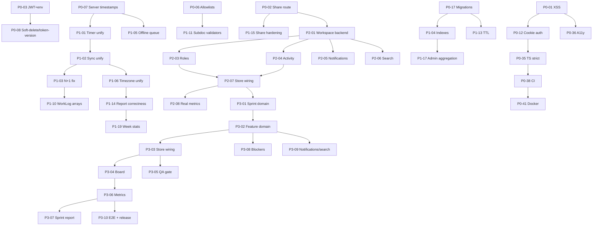

# FocusFlow — Implementation Execution Sprint (IES)

> The day-to-day execution manual. Converts the Engineering Audit Report (EAR) into
> buildable engineering work — no new audit, no redesign, no new architecture or specs.
> **Source of truth:** PRD · WPS · UXS · DSS · DTS · DDD · SAD · AIS · FAG · BAG · TQS · DDG · ESB · MPEP · EAR (`AUDIT.md`)

---

## 0. How to use this document

1. **Engineers** — pick the next unstarted item from the current sprint's task list (§4). Every item is self-contained: what, why, where, how to verify, and when it is done.
2. **Tech lead / TPM** — use §6 (critical path + parallel tracks) to assign work and §7 (risks) to unblock. Run the daily checklist (§8.2).
3. **QA** — every item has explicit Testing Requirements and a Definition of Done; the global DoD (§8.5) gates every sprint.
4. **Repo lead** — create GitHub issues per the hierarchy in §2 and §3, using the branch/commit/PR naming in each item.

Work begins from the **current repository** (`feature/updates` branch), not a greenfield project. Nothing here introduces new features beyond what the EAR already requires.

---

## 1. Conventions

### 1.1 ID scheme
- `IES-P0-xx` — Phase 0, Foundation Stabilization.
- `IES-P1-xx` — Phase 1, Platform Stabilization.
- `IES-P2-xx` — Phase 2, Workspace Foundation.
- `IES-P3-<F>-<N>` — Phase 3, Sprint & Feature Management (planned; traces to MPEP E9 / WPS §9–10, see §3.3 note).
- Each item traces to EAR findings (e.g., `CFG-1`, `BE-8`, `DB-4`, `FE-3`, `CM-2`) listed under **Refs** (P3 items trace to MPEP/WPS instead).

### 1.2 Priority
- **Critical** — active security hole / data loss / must fix before any deploy.
- **High** — integrity, fraud, availability, or scaling ceiling blocking normal use.
- **Medium** — correctness drift, maintainability, moderate performance.
- **Low** — hygiene, DX, polish.

### 1.3 Complexity
- **S** — small, < 1 day. **M** — 1–3 days. **L** — 3–10 days. **XL** — multi-week, cross-cutting.

### 1.4 Risk
- **Low** — contained change, reversible. **Med** — touches shared paths or data. **High** — data migration, auth, or concurrency risk; requires staging verification.

### 1.5 Global Definition of Done (applies to every item unless overridden)
1. Code merged to `feature/updates` behind a scoped branch (§3 GitHub fields).
2. `npm run build` passes (client) and server boots clean; `npm run typecheck` green.
3. New/changed logic has a passing automated test (unit or integration per Testing Requirements).
4. No `console.log` debug leftovers; sensitive data never logged (EAR BE-24/BE-39).
5. API changes are backward-compatible or coordinated with the client in the same sprint.
6. PR description lists the EAR finding IDs fixed and how each was verified.

---

## 2. Epic & Story hierarchy (GitHub)

| Epic | Label | Stories | Phase |
|---|---|---|---|
| **Epic: Security hardening** | `epic/security` | XSS, Access control, AuthN/AuthZ, Secrets, Headers/Rate-limit | 0 |
| **Epic: API core foundation** | `epic/api-core` | Errors/envelope, Validation, Migrations, Ops (shutdown/health/logging) | 0 |
| **Epic: Frontend foundation** | `epic/frontend-core` | Theme, Dead code, State hygiene, A11y, DX | 0 |
| **Epic: Quality & release tooling** | `epic/ops` | CI, Tests, Docker, Env, Gitignore | 0 |
| **Epic: Timer & sessions** | `epic/timer` | Timer unification, Offline queue, Sync integrity | 1 |
| **Epic: Data model & reports** | `epic/data-model` | Indexes, Validation bounds, Task/Journal/WorkLog, Reports | 1 |
| **Epic: Analytics, dashboard, settings, admin** | `epic/analytics` | Real metrics, Pagination, Settings, Admin hardening | 1 |
| **Epic: Workspace foundation** | `epic/workspace` | Teams, Roles, Projects, Activity, Notifications, Search, Collab UI | 2 |
| **Epic: Sprint & feature management** | `epic/P3-delivery` | Sprint/Feature domain, Store/Board, Metrics/Report, Blockers, Integration, Release | 3 |

Story template: `story/<epic>/<area>` (e.g. `story/security/xss`). Task template: `task/<epic>/<p0-01>`.
Branch: `fix/` or `feat/` + `<p0-01>-<kebab-title>`; Commit scope: `fix(security):`, `feat(api):`, `refactor(ui):`, etc.; PR title: `<scope>: <Title> (<item id>)`.

---

## 3. Implementation items

### 3.0 Phase 0 — Foundation Stabilization

---

#### IES-P0-01 · Replace hand-rolled markdown renderer with a sanitized renderer (stored XSS)
- **Refs:** CFG-1, FE-13, FE-14, EAR R1
- **Priority:** Critical · **Complexity:** M · **Hours:** 8 · **Deps:** —
- **Description:** `renderMarkdown` (`proEditor.tsx:10-51`) escapes only `&<>`, allows `javascript:` URLs and attribute breakout, and is injected via `dangerouslySetInnerHTML` at 13 call sites. Replace with `react-markdown` + `rehype-sanitize` (or DOMPurify-wrapped output). Move the renderer into `src/lib` as a pure function so `lib/docEngine` stops importing React components.
- **Affected files:** `src/components/ui/proEditor.tsx`, `src/lib/docEngine/templates/developerDoc.ts`, `src/lib/docEngine/export/docx.ts`, `src/pages/WorkLogDetail.tsx:380-533`, `src/pages/Reports.tsx:403-441`, `src/pages/Admin.tsx:934`, `src/pages/admin/AdminPeople.tsx:178`, `src/pages/Journal.tsx:302-304` (align), `src/lib/index.ts`.
- **Architecture refs:** SAD (client layering), DSS (content rendering), EAR Part 1 F1.
- **Risk:** Med (visual regressions in rich text).
- **Testing:** Unit tests with payloads `[x](javascript:alert(1))`, `" onmouseover=` breakout, and script/img variants assert inert output; render regression on WorkLogDetail/Reports/Admin.
- **DoD:** No `dangerouslySetInnerHTML`/`innerHTML` sinks remain in `src`; renderer lives in `src/lib`; fuzz payloads inert; docEngine imports only from `src/lib`.

#### IES-P0-02 · Delete legacy unauthenticated report-share endpoint
- **Refs:** BE-1, CFG-2, CM-1, EAR R2
- **Priority:** Critical · **Complexity:** S · **Hours:** 4 · **Deps:** —
- **Description:** Remove `GET /api/reports/share/:userId/:date` (`reports.js:313-336`); it bypasses auth and leaks any user's daily report by guessable ObjectId+date. Keep the token-gated `/share/token/:token` (reports.js:291). Also remove/redirect the client share-URL wiring at `Reports.tsx:130-132` and `App.tsx:95` to the token flow.
- **Affected files:** `server/routes/reports.js`, `src/pages/Reports.tsx`, `src/App.tsx`.
- **Architecture refs:** SAD (API auth), EAR Part 2 CFG-2.
- **Risk:** Low.
- **Testing:** Integration test: anonymous GET of `/share/<userId>/<date>` → 404/401; token flow still works; expired/revoked token → 404.
- **DoD:** Legacy route gone; no client reference to it; test added; share UI uses token URL.

#### IES-P0-03 · Replace placeholder JWT secret + boot-time fail-fast env validation
- **Refs:** BE-2, CFG-3, CFG-11, EAR R3
- **Priority:** Critical · **Complexity:** S · **Hours:** 4 · **Deps:** —
- **Description:** `server/.env:2` ships the literal placeholder secret. Generate a random secret, inject via env (never committed), and add a startup validator in `server/index.js` that refuses to boot if `JWT_SECRET` is missing, <32 chars, or equals the known placeholder. Cover `MONGODB_URI`, `GOOGLE_CLIENT_ID/SECRET`, `GOOGLE_REDIRECT_URI`, `CLIENT_URL`, `PORT`.
- **Affected files:** `server/index.js`, `server/.env` (value only), `server/.env.example` (new), `server/middleware/auth.js` (no change needed).
- **Architecture refs:** SAD (config), EAR Part 2 BE-2/CFG-11.
- **Risk:** Low.
- **Testing:** Boot test with placeholder/missing/weak secret fails fast; valid secret boots.
- **DoD:** Fail-fast validator present; `.env.example` created; real secret rotated; no placeholder value in any tracked file.

#### IES-P0-04 · Stop serializing Google OAuth tokens to the client
- **Refs:** BE-3, DB-2, EAR R4
- **Priority:** Critical · **Complexity:** S · **Hours:** 4 · **Deps:** —
- **Description:** `User.toJSON` (`models/User.js:42-44`) strips only `passwordHash`, so `googleTokens` (incl. long-lived `refreshToken`) leak via 11 paths (auth.js:33/59/70/110, profile.js:9/22, admin.js:49/59/88/119/136). Add `-googleTokens` to the toJSON transform and to every User fetch used in responses. Verify with grep no response path serializes tokens.
- **Affected files:** `server/models/User.js`, `server/middleware/auth.js`, `server/routes/profile.js`, `server/routes/admin.js`, `server/routes/auth.js`.
- **Architecture refs:** SAD (auth), EAR Part 2 BE-3.
- **Risk:** Low (server-side Drive code reads tokens from the doc, not the response).
- **Testing:** Unit test: `user.toJSON()` has no `googleTokens`; integration: GET /me, /profile, /admin/users contain no `accessToken`/`refreshToken`.
- **DoD:** No `googleTokens` in any API response (grep-verified); Drive sync still works.

#### IES-P0-05 · Rotate production credentials and move secrets out of repo
- **Refs:** BE-4, CFG-4, EAR R3
- **Priority:** Critical · **Complexity:** S · **Hours:** 2 · **Deps:** —
- **Description:** `server/.env:1` holds a live Atlas URI with username-as-password (`AJAY:AJAY`) and a real Google client secret. Rotate the Atlas DB user password and the Google OAuth secret; restrict Atlas network access to the server IP; store secrets via deploy-time env injection (or a secret manager), never committed. Confirm `.gitignore` covers all env variants (see IES-P0-21).
- **Affected files:** `server/.env` (rotated values), deployment env.
- **Architecture refs:** SAD (config), EAR Part 2 BE-4/CFG-4.
- **Risk:** Med (operational; requires deploy coordination).
- **Testing:** Verify old creds are revoked; app boots with new creds.
- **DoD:** Old Atlas/Google creds revoked; new creds only in secret store/deploy env; documented rotation runbook.

#### IES-P0-06 · Field allowlists for PATCH endpoints (kill mass assignment)
- **Refs:** BE-5, BE-6, BE-7, DB-3, EAR R5
- **Priority:** Critical · **Complexity:** M · **Hours:** 8 · **Deps:** —
- **Description:** Tasks (`tasks.js:60`), WorkLogs (`workLogs.js:319`) and Journals (`journals.js:52`) apply `$set: req.body` verbatim, letting users transfer ownership, inflate time/points, or hijack `googleDocId`. Whitelist editable fields per route (mirror `habits.js:57-61`); strip `userId`, `_id`, `googleDocId`, `googleDocUrl`, `totalTime`/`totalActiveMs` (server-derived).
- **Affected files:** `server/routes/tasks.js`, `server/routes/workLogs.js`, `server/routes/journals.js`.
- **Architecture refs:** SAD (API), EAR Part 2 BE-5/6/7.
- **Risk:** Low-Med (client PATCH payloads must stay in whitelist).
- **Testing:** Unit tests: PATCH attempting `userId`/`totalTime`/`googleDocId` is ignored; valid fields persist.
- **DoD:** No route applies raw `req.body` to `$set`; tests prove immutability of ownership/server fields.

#### IES-P0-07 · Server-authoritative session timestamps (kill points/streak fraud)
- **Refs:** BE-8, CM-4, EAR R5
- **Priority:** Critical · **Complexity:** M · **Hours:** 8 · **Deps:** —
- **Description:** `sessions.js` trusts client `startTime`/`pauseTime`/`resumeTime`/`endTime` (lines 95-101, 162-163, 189-190, 217-218). Use `Date.now()` server-side, or validate: no future times, end>start, within 24h recency, clamp `activeTime`. Propagate to offline replay (IES-P1-05) so queued ops can't fabricate time.
- **Affected files:** `server/routes/sessions.js`, `src/utils/offlineQueue.ts` (payload usage), client API session calls.
- **Architecture refs:** SAD (sessions), EAR Part 2 BE-8.
- **Risk:** Med (client timer flows must remain correct; coordinate with IES-P1-01).
- **Testing:** Unit tests: past/future/absent timestamps handled safely; integration: fraudulent session rejected; normal flow recorded.
- **DoD:** No unbounded client timestamp accepted; `activeTime`/points/streak derive from server-validated values.

#### IES-P0-08 · Enforce soft-delete + token versioning
- **Refs:** DB-1, BE-12, BE-33, EAR R6
- **Priority:** Critical · **Complexity:** M · **Hours:** 8 · **Deps:** —
- **Description:** Admin soft-delete (`admin.js:107-124`) sets `deletedAt` but login (`auth.js:49`) and `protect` (`middleware/auth.js:19`) ignore it. Filter `deletedAt: null` in login and `protect`; add a per-user `tokenVersion` incremented on delete/role change and embed in JWT (`auth.js:10-11`) so tokens invalidate immediately. Add `{ email, deletedAt }` and `{ _id, deletedAt }` index considerations.
- **Affected files:** `server/middleware/auth.js`, `server/routes/auth.js`, `server/routes/admin.js`, `server/models/User.js`.
- **Architecture refs:** SAD (auth), EAR Part 2 DB-1/BE-12.
- **Risk:** Med (all existing sessions invalidated → re-login).
- **Testing:** Integration: deleted user gets 401 and cannot login; role change invalidates old token; active user unaffected.
- **DoD:** Deleted users blocked at login and per-request; token version check present; tests cover delete/restore/role-change.

#### IES-P0-09 · Add rate limiting (auth + global)
- **Refs:** BE-9, CFG-6, EAR R3
- **Priority:** High · **Complexity:** S · **Hours:** 4 · **Deps:** —
- **Description:** Add `express-rate-limit`: strict per-IP+per-account limit on `/api/auth/login` and `/api/auth/register`, lenient global limit on `/api` (report/admin paths). Add account lockout after N failures. Verify package added to `server/package.json`.
- **Affected files:** `server/index.js`, `server/routes/auth.js`, `server/package.json`.
- **Architecture refs:** SAD (API security), EAR Part 2 BE-9.
- **Risk:** Low.
- **Testing:** Load/unit tests: burst login attempts → 429; legitimate traffic passes; lockout message after N.
- **DoD:** Rate limit middleware active on auth and API; tests assert 429 behavior.

#### IES-P0-10 · Harden Google OAuth: opaque state, PKCE, refresh-token rotation
- **Refs:** BE-10, BE-32, CFG-12, EAR R3
- **Priority:** High · **Complexity:** M · **Hours:** 8 · **Deps:** —
- **Description:** Replace the JWT-in-`state` (`auth.js:79-95`) with an opaque single-use nonce stored (hashed) with expiry; add PKCE (`code_challenge`/`code_verifier`); rotate refresh tokens on each exchange (`auth.js:133-143`); never place the bearer token in URLs.
- **Affected files:** `server/routes/auth.js`, `server/utils/googleDrive.js`, `server/models/User.js` (nonce storage).
- **Architecture refs:** SAD (auth), EAR Part 2 BE-10/BE-32.
- **Risk:** Med (OAuth flow rework; verify full connect/disconnect cycle).
- **Testing:** Integration: connect flow issues no token in URL; replay of callback code fails; refresh rotates.
- **DoD:** No JWT in OAuth URLs; PKCE + nonce enforced; refresh tokens rotated.

#### IES-P0-11 · Add security headers / CSP (helmet)
- **Refs:** BE-11, CFG-8, EAR R3
- **Priority:** High · **Complexity:** S · **Hours:** 4 · **Deps:** —
- **Description:** Add `helmet` (CSP, `X-Frame-Options`, `X-Content-Type-Options`, HSTS, `Referrer-Policy: no-referrer`) to `index.js`. CSP must allow `fonts.googleapis.com`/`fonts.gstatic.com` (index.html:8-10) and the API origin; `frame-ancestors 'none'`. Add matching CSP meta as backstop.
- **Affected files:** `server/index.js`, `mainApp/index.html`, `server/package.json`.
- **Architecture refs:** SAD (API security), EAR Part 2 BE-11/CFG-8.
- **Risk:** Low-Med (inline styles in index.html must be allowed/removed — see FE-6/IES-P0-25).
- **Testing:** curl headers assertion; app loads fonts and styles correctly; no console CSP errors.
- **DoD:** Security headers present; strict CSP active; UI unaffected.

#### IES-P0-12 · Move session token to httpOnly cookie (remove localStorage JWT)
- **Refs:** CFG-5, EAR R3
- **Priority:** High · **Complexity:** L · **Hours:** 16 · **Deps:** IES-P0-01 (XSS first, else cookie change is moot)
- **Description:** Replace `ff_token` in localStorage (`useAuthStore.ts:33-81`, `utils/api.ts:12-23`) with an `httpOnly`+`Secure`+`SameSite=Lax` cookie set by the server; add CSRF protection (double-submit token or SameSite + Origin check); add server-side logout/session invalidation. Keep short access token + refresh flow optional.
- **Affected files:** `server/routes/auth.js`, `server/middleware/auth.js`, `server/index.js` (cookie-parser/CORS creds), `src/store/useAuthStore.ts`, `src/utils/api.ts`, `src/pages/Login.tsx`, `src/pages/Register.tsx`.
- **Architecture refs:** SAD (auth), EAR Part 2 CFG-5.
- **Risk:** High (auth rewrite; all login flows + CSRF). **Do sequentially after Sprint 1 security fixes.**
- **Testing:** End-to-end: login/register/me/logout with cookies; CSRF attack rejected; token not readable via JS.
- **DoD:** No JWT in localStorage; session cookie httpOnly/Secure/SameSite; CSRF-protected; logout revokes server-side.

#### IES-P0-13 · Dependency vulnerability remediation
- **Refs:** CFG-7, CFG-9, CFG-10, EAR R15
- **Priority:** High · **Complexity:** S · **Hours:** 4 · **Deps:** —
- **Description:** Client: upgrade `react-router-dom` ≥7.18.0 (GHSA-2j2x-hqr9-3h42, GHSA-jjmj-jmhj-qwj2, constructor-injection), `uuid` ≥11.1.1. Server: `mongoose` ≥8.24.1, `express` ≥4.22.2, `body-parser` ≥1.20.6, npm `overrides` for `qs ≥6.15.2` and `brace-expansion ≥2.1.3`/`glob ≥11` (googleapis chain). Re-run `npm audit --omit=dev` to zero high/moderate where fixable.
- **Affected files:** `mainApp/package.json` + lock, `mainApp/server/package.json` + lock.
- **Architecture refs:** EAR Part 2 CFG-7/9/10, Appendix B.
- **Risk:** Med (react-router major jump; verify routing smoke test).
- **Testing:** `npm audit --omit=dev` clean; full client build + route smoke test; server boots and routes respond.
- **DoD:** Zero High; zero Moderate where fix exists; all tests pass.

#### IES-P0-14 · Standardize error handling (no err.message leaks, JSON 404, 500 sanitization)
- **Refs:** BE-13, BE-14, BE-15, CFG-13, EAR R3
- **Priority:** High · **Complexity:** M · **Hours:** 8 · **Deps:** —
- **Description:** Global handler (`index.js:48-51`) and ~40 route catch blocks return raw `err.message`. Add JSON 404 catch-all; map known validation errors to structured 400s; log full error server-side, return generic message for 5xx; fix `protect` to distinguish auth failure (401) from DB error (500 via `next(err)`).
- **Affected files:** `server/index.js`, `server/middleware/auth.js`, all `server/routes/*.js` catch blocks.
- **Architecture refs:** SAD (API), EAR Part 2 BE-13/14/15.
- **Risk:** Med (touches every route's response shape; client error handling must tolerate generic messages).
- **Testing:** Contract tests: unknown route → JSON 404; forced 500 → generic message; validation → 400 with code.
- **DoD:** No raw `err.message` in responses; JSON 404; single error middleware owns 5xx.

#### IES-P0-15 · Standardize API response envelope
- **Refs:** BE-17, EAR R14
- **Priority:** Medium · **Complexity:** M · **Hours:** 8 · **Deps:** IES-P0-14
- **Description:** Adopt one envelope `{ data: ... }` (+ `{ error: { code, message } }`) across routes, replacing the current mix of `{ user }`, raw arrays, and raw docs (auth.js:31-34/57-60/69-71, profile.js:9/22, admin.js:49/59, tasks/journals/habits/sessions/worklogs). Update the client API layer accordingly.
- **Affected files:** All `server/routes/*.js`; `src/utils/api.ts`, client stores/pages consuming responses.
- **Architecture refs:** SAD (API), EAR Part 2 BE-17.
- **Risk:** Med (wide client touch; do in same sprint as client updates).
- **Testing:** Contract tests per endpoint shape; client e2e smoke on all pages.
- **DoD:** Consistent envelope documented and enforced; client no longer special-cases shapes.

#### IES-P0-16 · Adopt a validation library for body/params/query
- **Refs:** BE-16, CFG-24, EAR R5
- **Priority:** Medium · **Complexity:** M · **Hours:** 8 · **Deps:** IES-P0-14/15
- **Description:** Add `zod` (or `express-validator`); validate every write route body and all numeric/date params (`admin.js:147-166`, `tasks.js:43`, `sessions.js:95-101`, `habits.js:143-145`, `projects.js:30`, `reports.js:254-257`). Fix `Number()` NaN coercion with `Number.isFinite`; validate dates with `isValid`.
- **Affected files:** All `server/routes/*.js`; `server/package.json`.
- **Architecture refs:** SAD (API), EAR Part 2 BE-16/CFG-24.
- **Risk:** Med (must keep client contracts; run contract tests).
- **Testing:** Validation unit/contract tests: NaN, bad dates, oversized strings rejected with 400; valid requests pass.
- **DoD:** All routes validated; no NaN/junk persisted; tests cover reject+accept paths.

#### IES-P0-17 · Remove destructive migration script; add versioned migrations framework
- **Refs:** BE-25, DB-13, EAR R15
- **Priority:** Medium · **Complexity:** M · **Hours:** 8 · **Deps:** —
- **Description:** Delete `server/drop-worklog-index.js` from repo root (it drops a unique index against production Atlas on run). Add `server/migrations/` with a versioned, idempotent, logged runner (guarded by `NODE_ENV` + explicit flag). Index/schema changes (IES-P1-04 etc.) ship as migrations.
- **Affected files:** `server/drop-worklog-index.js` (delete), `server/migrations/` (new), `server/package.json` (script).
- **Architecture refs:** SAD (data), EAR Part 2 BE-25/DB-13.
- **Risk:** Low.
- **Testing:** Migration runner dry-run + apply on a scratch DB; idempotency test.
- **DoD:** Script gone; migration framework in place with documented usage; PLAN.md/DDG updated.

#### IES-P0-18 · Graceful shutdown + boot retry
- **Refs:** BE-27, CFG-14, EAR R15
- **Priority:** Medium · **Complexity:** S · **Hours:** 4 · **Deps:** —
- **Description:** Capture server handle in `index.js:53-60`; handle SIGINT/SIGTERM → `server.close()` + `mongoose.disconnect()` with timeout force-exit; replace hard `process.exit(1)` on Mongo failure with bounded retry/backoff.
- **Affected files:** `server/index.js`.
- **Architecture refs:** SAD (deployment), EAR Part 2 BE-27/CFG-14.
- **Risk:** Low.
- **Testing:** Signal test: graceful drain of in-flight request; Mongo-down boot retries then exits with code 1.
- **DoD:** Signals handled; no dropped in-flight requests on restart; boot retry present.

#### IES-P0-19 · Health/readiness + metrics endpoint
- **Refs:** CFG-23, EAR R15
- **Priority:** Medium · **Complexity:** S · **Hours:** 4 · **Deps:** —
- **Description:** Upgrade `/api/health` (`index.js:46`) to report `mongoose.connection.readyState`, uptime, memory; add `/api/health/ready` (DB liveness) and optional `/api/metrics` (simple counters).
- **Affected files:** `server/index.js`.
- **Architecture refs:** SAD (deployment), EAR Part 2 CFG-23.
- **Risk:** Low.
- **Testing:** Health returns ready/failing states correctly (stop DB → not ready).
- **DoD:** Liveness + readiness endpoints accurate; used by Docker healthcheck (IES-P0-41).

#### IES-P0-20 · Structured logging with redaction
- **Refs:** BE-24, BE-39, CFG-22, EAR R15
- **Priority:** Medium · **Complexity:** M · **Hours:** 8 · **Deps:** —
- **Description:** Replace ad-hoc `console.log` request logging (`index.js:27-30`) with `pino` JSON logs (request id, status, duration); redact share tokens, ObjectIds, and email from URLs (`reports.js` share paths); stop logging raw `err` and user titles (`tasks.js:16/46`, `journals.js:14`, `projects.js:54/89`, `googleDrive.js:30/52/109`).
- **Affected files:** `server/index.js`, `server/utils/googleDrive.js`, `server/routes/*.js` log calls, `server/package.json`.
- **Architecture refs:** SAD (observability), EAR Part 2 BE-24/CFG-22.
- **Risk:** Low.
- **Testing:** Log assertions: no tokens/ObjectIds/emails/titles in output; request id present.
- **DoD:** JSON structured logs; redaction verified; no PII/token logging.

#### IES-P0-21 · Harden .gitignore for all env variants + secret-scan guard
- **Refs:** CFG-19, EAR R15
- **Priority:** Medium · **Complexity:** S · **Hours:** 2 · **Deps:** —
- **Description:** Replace `.gitignore:4-6` (`.env`, `.env.local`) with `.env`, `.env.*` plus exceptions for `.env.example`/`.env.sample`; add a pre-commit hook or CI secret-scan (gitleaks).
- **Affected files:** `.gitignore`, CI (IES-P0-38).
- **Architecture refs:** EAR Part 2 CFG-19.
- **Risk:** Low.
- **Testing:** `git check-ignore` on `.env.production` matches; secret-scan passes on clean tree.
- **DoD:** No env variant can be committed; secret-scan wired.

#### IES-P0-22 · Client env validation (kill localhost fallback)
- **Refs:** CFG-11, FE-27, CFG-20, EAR R15
- **Priority:** Medium · **Complexity:** S · **Hours:** 2 · **Deps:** —
- **Description:** `utils/api.ts:1` silently falls back to `http://localhost:5001/api`; `src/.env` is dead config. Remove the fallback (or make it explicit per-env), delete `mainApp/src/.env`, document root `.env`/`.env.production` as the single source; add Vite env contract.
- **Affected files:** `src/utils/api.ts`, `mainApp/.env`, `mainApp/src/.env` (delete), `README.md`/`INTEGRATION_README.md`.
- **Architecture refs:** SAD (config), EAR Part 2 CFG-11/CFG-20/FE-27.
- **Risk:** Low.
- **Testing:** Build without `VITE_API_URL` fails loudly; build with it uses it.
- **DoD:** No dead env file; no silent localhost fallback in production builds.

#### IES-P0-23 · Remove orphan root lockfile and clarify repo layout
- **Refs:** CFG-27, EAR R14
- **Priority:** Low · **Complexity:** S · **Hours:** 1 · **Deps:** —
- **Description:** Delete the 88-byte root `package-lock.json` stub (no root `package.json`). Optionally introduce a root `package.json` with npm workspaces over `mainApp`/`mainApp/server`, or document the two-app layout in README.
- **Affected files:** `package-lock.json` (root, delete), optionally root `package.json`.
- **Architecture refs:** EAR Part 2 CFG-27.
- **Risk:** Low.
- **Testing:** `npm ci` in both apps still resolves.
- **DoD:** Root stub removed (or workspaces added); repo layout documented.

#### IES-P0-24 · Add React Error Boundary + Suspense fallback
- **Refs:** CFG-15, EAR R16
- **Priority:** High · **Complexity:** S · **Hours:** 4 · **Deps:** —
- **Description:** `main.tsx:6-9` renders 30+ lazy routes under one `<Suspense>` with no error boundary; any render error blanks the app. Add a top-level `ErrorBoundary` (with reload/retry) and a `Suspense` error fallback for lazy chunks.
- **Affected files:** `src/main.tsx`, `src/App.tsx`, new `src/components/ui/ErrorBoundary.tsx`.
- **Architecture refs:** SAD (client), EAR Part 2 CFG-15.
- **Risk:** Low.
- **Testing:** Unit: boundary renders fallback on thrown child error; manual chunk-failure test.
- **DoD:** No blank-page on uncaught errors; fallback UI with recovery.

#### IES-P0-25 · Complete theme token consistency (fix hardcoded brand colors)
- **Refs:** FE-6, EAR R16
- **Priority:** Medium · **Complexity:** M · **Hours:** 4 · **Deps:** —
- **Description:** `.btn-primary` and `.input:focus` hardcode pink/blue (`src/index.css:114-132`, `316-321`) bypassing the `--color-brand-*` override system (`useStore.ts:55-91`). Replace with `var(--color-brand-*)` + color-mix shadows; reconcile `.gradient-text`.
- **Affected files:** `src/index.css`, `src/store/useStore.ts` (theme apply).
- **Architecture refs:** DSS (design tokens), EAR Part 2 FE-6.
- **Risk:** Low-Med (visual change; run visual regression).
- **Testing:** Visual check across all themes/accent colors; primary CTAs respond to accent change.
- **DoD:** No hardcoded brand hex outside the base token definitions; accent changes propagate.

#### IES-P0-26 · Remove dead Admin monolith and typo routes
- **Refs:** FE-17, FE-11, CFG-25, EAR R14
- **Priority:** Medium · **Complexity:** S · **Hours:** 3 · **Deps:** —
- **Description:** `src/pages/Admin.tsx` (1,210 lines) is unreferenced (routed admin lives in `pages/admin/*`). Delete it after confirming route coverage. Remove typo routes in `App.tsx:106/136/138/144-145/151` (`"overview hover"`, `"/team text"`, etc.) and restore intended paths.
- **Affected files:** `src/pages/Admin.tsx` (delete), `src/App.tsx`.
- **Architecture refs:** SAD (routing), EAR Part 2 FE-17/FE-11/CFG-25.
- **Risk:** Low.
- **Testing:** Route table test: no path contains spaces; all canonical routes resolve.
- **DoD:** Admin.tsx gone; route table clean; navigation smoke passes.

#### IES-P0-27 · Consolidate status/mood configuration
- **Refs:** FE-18, EAR R14
- **Priority:** Medium · **Complexity:** S · **Hours:** 3 · **Deps:** —
- **Description:** Status maps (`statusConfig.ts`, `colors.ts:29`, `WorkLog.tsx:24-29`, `ShareReport.tsx:13-16`) and mood maps (`MOOD_EMOJIS`/`MOOD_LABELS` in WorkLog.tsx:34-35, WorkLogDetail.tsx:39, Reports.tsx:71, ShareReport.tsx:12, unused Journal.tsx:7) are duplicated. Consolidate into one `src/lib/config.ts`; remove unused imports.
- **Affected files:** `src/lib/statusConfig.ts`, `src/lib/colors.ts`, `src/lib/config.ts` (new), `src/pages/WorkLog.tsx`, `src/pages/WorkLogDetail.tsx`, `src/pages/Reports.tsx`, `src/pages/ShareReport.tsx`, `src/pages/Journal.tsx`.
- **Architecture refs:** SAD (client), EAR Part 2 FE-18.
- **Risk:** Low.
- **Testing:** Unit: single source maps status/mood → color/label/emoji; pages render identically.
- **DoD:** One config module; no duplicated maps; all pages import it.

#### IES-P0-28 · Unify document mapping and autosave logic
- **Refs:** FE-12, EAR R14
- **Priority:** Medium · **Complexity:** M · **Hours:** 6 · **Deps:** —
- **Description:** `mapLog` (`useWorkLogStore.ts:230-384`) and `mapDoc` (`WorkLogDetail.tsx:77-106`) duplicate shape mapping with divergent debounce (`proEditor.tsx` ~750ms vs `WorkLog.tsx` AutoInput ~700ms). Extract one shared mapper and one `AutoSaveEditor` component with a single debounce constant.
- **Affected files:** `src/store/useWorkLogStore.ts`, `src/pages/WorkLogDetail.tsx`, `src/pages/WorkLog.tsx`, `src/components/ui/proEditor.tsx`, `src/lib/dataMapper.ts`.
- **Architecture refs:** SAD (client), EAR Part 2 FE-12.
- **Risk:** Low-Med (autosave behavior; verify save latency consistent).
- **Testing:** Unit: both views produce identical docs from same source; debounce constant single-sourced.
- **DoD:** Single mapper + single editor component; behavior parity verified.

#### IES-P0-29 · Add optimistic-mutation rollback helper
- **Refs:** FE-5, EAR R16
- **Priority:** High · **Complexity:** M · **Hours:** 6 · **Deps:** —
- **Description:** Optimistic mutations in `useStore.ts` (deleteTask:375-384, toggleSubtask:496-506), `useHabitStore.ts` (deleteHabit:263-279, stopTimer:355-370, updateHabit:253-258), `useWorkLogStore.ts` (updateField:547-557, updateEntry:589-608, deleteLog:622-632) and admin pages (AdminPeople.tsx:223-236, AdminTeams.tsx:175-179) have no rollback. Add a shared `runMutation` helper: optimistic apply, on failure rollback + toast, no unhandled rejections.
- **Affected files:** new `src/utils/mutation.ts`, the stores/pages above.
- **Architecture refs:** SAD (state), EAR Part 2 FE-5.
- **Risk:** Low-Med.
- **Testing:** Unit: failed request rolls state back and toasts; success path leaves state.
- **DoD:** All optimistic paths use helper; no unhandled promise rejections; rollback verified by tests.

#### IES-P0-30 · Fix toast timer cleanup
- **Refs:** FE-21, EAR R16
- **Priority:** Low · **Complexity:** S · **Hours:** 2 · **Deps:** —
- **Description:** `useToastStore.ts:40` schedules dismissal without storing the timeout; manual dismiss can dismiss the wrong toast. Track `Map<id, timeout>` and clear in `dismiss`.
- **Affected files:** `src/store/useToastStore.ts`.
- **Architecture refs:** EAR Part 2 FE-21.
- **Risk:** Low.
- **Testing:** Unit: dismiss clears its own timeout; ids don't collide.
- **DoD:** No leaked timeouts; manual dismiss reliable.

#### IES-P0-31 · Fix auth form autofill + consistent post-login routing
- **Refs:** FE-10, EAR R16
- **Priority:** Medium · **Complexity:** S · **Hours:** 3 · **Deps:** —
- **Description:** Login.tsx:65-89 and Register.tsx:75-134 inputs lack `name`/`autoComplete`; Login routes to `/hub`, Register to `/dashboard`. Add `name="email|password|name"` + `autoComplete` attrs; route both to the same destination.
- **Affected files:** `src/pages/Login.tsx`, `src/pages/Register.tsx`.
- **Architecture refs:** UXS (auth flows), EAR Part 2 FE-10.
- **Risk:** Low.
- **Testing:** Manual: password managers autofill; both flows land on same page.
- **DoD:** Autofill works; routing consistent.

#### IES-P0-32 · Fix stale closures in effects
- **Refs:** FE-8, EAR R16
- **Priority:** Medium · **Complexity:** M · **Hours:** 4 · **Deps:** —
- **Description:** `WorkLogWidget.tsx:12-14` reads `todayLog` once; `useNotifications.ts` interval closes over stale `prefs`/`profile`/`habits`. Use `useStore.getState()` inside interval callbacks or subscribe via selectors; recreate interval on dep change.
- **Affected files:** `src/components/worklog/WorkLogWidget.tsx`, `src/hooks/useNotifications.ts`.
- **Architecture refs:** SAD (state), EAR Part 2 FE-8.
- **Risk:** Low.
- **Testing:** Unit: after store change, widget/notifications reflect new state without reload.
- **DoD:** No mount-only stale reads in these components.

#### IES-P0-33 · Remove dead controls (search, export, workspace settings, admin settings)
- **Refs:** FE-9, EAR R16
- **Priority:** Medium · **Complexity:** M · **Hours:** 4 · **Deps:** —
- **Description:** Global search (GlobalHeader.tsx:48-54), "Export Report (PDF/JSON)" (ReportsAnalyticsPage.tsx:37-39), workspace settings Save (WorkspaceSettingsPage.tsx:13-22) and AdminSettings page have no handlers. Implement or remove: wire search to filtering, export via installed `html2pdf.js`/`file-saver`, persist settings via store, or replace with disabled-state cards.
- **Affected files:** `src/components/layout/GlobalHeader.tsx`, `src/pages/collaboration/ReportsAnalyticsPage.tsx`, `src/pages/collaboration/WorkspaceSettingsPage.tsx`, `src/pages/admin/AdminSettings.tsx`.
- **Architecture refs:** UXS, EAR Part 2 FE-9.
- **Risk:** Low.
- **Testing:** Manual: every visible control produces feedback or is removed.
- **DoD:** No dead affordances; behavior verified.

#### IES-P0-34 · AdminRoute loading state (no blank flash)
- **Refs:** FE-22, EAR R16
- **Priority:** Low · **Complexity:** S · **Hours:** 2 · **Deps:** —
- **Description:** `ProtectedRoute.tsx:41` returns `null` while auth loads. Render a spinner/skeleton during bootstrap.
- **Affected files:** `src/components/routing/ProtectedRoute.tsx`.
- **Architecture refs:** UXS, EAR Part 2 FE-22.
- **Risk:** Low.
- **Testing:** Manual: no blank flash navigating to admin.
- **DoD:** Loading state rendered and announced.

#### IES-P0-35 · TypeScript strictness: typecheck script, noUnused, remove `as any`
- **Refs:** FE-19, FE-23, CFG-26, EAR R14
- **Priority:** Medium · **Complexity:** M · **Hours:** 6 · **Deps:** —
- **Description:** Add `typecheck` script (`tsc --noEmit`), enable `strict` in `tsconfig.node.json`, enable `noUnusedLocals`/`noUnusedParameters`; remove the 13 `as any` casts (admin pages, collaboration store, API layer) with real types; remove unused params/state (FeaturesPage.tsx:13/25, QADashboardPage.tsx:11, ReportsAnalyticsPage.tsx:11, MemberProfilePage.tsx:16).
- **Affected files:** `mainApp/package.json`, `tsconfig.json`, `tsconfig.node.json`, files with `as any`/unused code.
- **Architecture refs:** EAR Part 2 FE-19/CFG-26.
- **Risk:** Low-Med (type errors surface; fix as part of the sprint).
- **Testing:** `npm run typecheck` passes; no `as any` in grep.
- **DoD:** typecheck script green in CI; no explicit `any` casts; unused-checks on.

#### IES-P0-36 · Accessibility pass (labels, keyboard, focus, contrast)
- **Refs:** FE-10/14/22 (a11y), FE-6 (contrast), EAR R16
- **Priority:** Medium · **Complexity:** M · **Hours:** 8 · **Deps:** IES-P0-01
- **Description:** Add `aria-label`s to icon buttons, focus states to all interactive controls, ensure keyboard reachability for worklog/admin/collab pages, verify WCAG AA contrast after theme work (IES-P0-25), and add loading announcements (IES-P0-34). Run automated a11y scan (axe) and fix critical findings.
- **Affected files:** Shared components (`src/components/ui/*`), `src/pages/WorkLog.tsx`, `src/pages/Admin*.tsx`, `src/pages/collaboration/*`.
- **Architecture refs:** UXS (a11y), DSS (tokens), TQS (quality), EAR Part 1 scorecard A11y.
- **Risk:** Med (wide surface).
- **Testing:** axe scan < critical errors; keyboard-only walkthrough of primary flows.
- **DoD:** Axe-critical-free on core flows; keyboard navigable; contrast AA on primary surfaces.

#### IES-P0-37 · Responsive audit and fixes
- **Refs:** EAR Part 1 scorecard (Responsive), R16
- **Priority:** Medium · **Complexity:** M · **Hours:** 6 · **Deps:** IES-P0-25
- **Description:** Audit worklog, admin, dashboard, collaboration pages at 360/768/1280/1920px; fix overflow, grid collapse, unreadable densities. Follow existing `--breakpoint`/responsive patterns in `index.css`.
- **Affected files:** `src/index.css`, `src/pages/WorkLog.tsx`, `src/pages/Admin*.tsx`, `src/pages/collaboration/*`, dashboard widgets.
- **Architecture refs:** UXS (responsive), DSS.
- **Risk:** Low-Med.
- **Testing:** Screenshot matrix at 4 breakpoints per page.
- **DoD:** No horizontal scroll on primary flows at target widths; grids collapse gracefully.

#### IES-P0-38 · CI/CD pipeline (GitHub Actions)
- **Refs:** CFG-17, EAR R12
- **Priority:** High · **Complexity:** M · **Hours:** 8 · **Deps:** IES-P0-35, IES-P0-39
- **Description:** Add `.github/workflows/ci.yml`: `npm ci` for both apps, `typecheck`, `test`, `build`, and `npm audit --audit-level=high` gate. Gate merges to `main`/`feature/updates` on green CI.
- **Affected files:** `.github/workflows/ci.yml`, both `package.json` (scripts already partly present).
- **Architecture refs:** EAR Part 2 CFG-17.
- **Risk:** Low.
- **Testing:** Push a PR; CI runs all gates; failing audit blocks merge.
- **DoD:** Green CI on PRs; quality gates enforced.

#### IES-P0-39 · Make tests runnable (vitest env) + baseline client tests
- **Refs:** CFG-18, EAR R12
- **Priority:** High · **Complexity:** M · **Hours:** 8 · **Deps:** —
- **Description:** `timerEngine.test.ts` uses `localStorage` but no vitest environment is configured → `npm test` fails. Add `vitest.config.ts` (or `test.environment: 'happy-dom'`) and verify `npm test` passes. Add baseline tests for `time.ts`, `offlineQueue`, `dataMapper`.
- **Affected files:** `mainApp/vitest.config.ts` (new), `mainApp/vite.config.ts`, `mainApp/package.json`.
- **Architecture refs:** TQS, EAR Part 2 CFG-18.
- **Risk:** Low.
- **Testing:** `npm test` green locally and in CI.
- **DoD:** Test suite runnable; baseline coverage for core client utils.

#### IES-P0-40 · Server test scaffolding + security tests
- **Refs:** BE-1/2/3/5/8 (test targets), EAR R12
- **Priority:** High · **Complexity:** M · **Hours:** 8 · **Deps:** IES-P0-02/03/04/06/07
- **Description:** Add a server test harness (node:test or vitest) with a test MongoDB (mongodb-memory-server or scratch DB). Cover: auth middleware (deleted user, token version), report access control (legacy route gone, token gating), PATCH allowlists, session timestamp validation, login/register contract.
- **Affected files:** `mainApp/server/test/`, `server/package.json` (test script), config for test DB.
- **Architecture refs:** TQS, EAR Part 2.
- **Risk:** Low.
- **Testing:** `npm test` in server green in CI.
- **DoD:** Server test suite runnable; security-critical behaviors covered by tests.

#### IES-P0-41 · Containerization + nginx + healthcheck
- **Refs:** CFG-16, EAR R15
- **Priority:** Medium · **Complexity:** L · **Hours:** 12 · **Deps:** IES-P0-18/19, IES-P0-38
- **Description:** Add multi-stage `Dockerfile` (client build → static, server node), `docker-compose.yml` (app + optional mongo), nginx config serving the SPA + reverse-proxying `/api` with TLS guidance, healthcheck using `/api/health/ready` (IES-P0-19).
- **Affected files:** `Dockerfile` (root), `docker-compose.yml`, `nginx.conf`, `mainApp/Dockerfile` (client stage), `server/Dockerfile`.
- **Architecture refs:** SAD (deployment), EAR Part 2 CFG-16.
- **Risk:** Med.
- **Testing:** `docker compose up` serves app; healthcheck passes/fails correctly; restart keeps data.
- **DoD:** Reproducible containerized deploy; documented runbook.

### 3.1 Phase 1 — Platform Stabilization

---

#### IES-P1-01 · Consolidate timer implementations onto the single engine
- **Refs:** FE-3, FE-20, FE-31, EAR R8
- **Priority:** Critical · **Complexity:** L · **Hours:** 16 · **Deps:** IES-P0-07
- **Description:** Three timers diverge: engine (`useStore.ts` timerEngine + `useActiveTimer.ts:41`), TaskDetail LiveTimer (17-38), FocusMode Pomodoro (38). Delete `useTimer.ts` + `tick`; make FocusMode a mode over `timerEngine`; TaskDetail renders engine display; memoize formatted display.
- **Affected files:** `src/store/useStore.ts`, `src/hooks/useTimer.ts` (delete), `src/hooks/useActiveTimer.ts`, `src/pages/TaskDetail.tsx`, `src/pages/FocusMode.tsx`, `src/components/tasks/TaskCard.tsx`, `src/components/layout/Sidebar.tsx`.
- **Architecture refs:** SAD (timer), DDD (domain), MPEP Ch.9 (SEB timer defects T-01..T-08), EAR Part 2 FE-3.
- **Risk:** High (core UX; regression risk on all timer surfaces).
- **Testing:** Unit: engine transitions/idempotent start-stop; e2e: start→navigate→resume→stop records one session; FocusMode records to work log.
- **DoD:** One timer code path; FocusMode sessions persisted; no per-second store ticks; no dead `useTimer`.

#### IES-P1-02 · Unify session↔worklog sync; make GET read-only
- **Refs:** BE-19, BE-21, CM-7, EAR R7
- **Priority:** Critical · **Complexity:** L · **Hours:** 16 · **Deps:** IES-P0-07, IES-P0-16
- **Description:** `syncSessionToWorkLogs` (sessions.js:35-76) and `syncWorkEntries` (workLogs.js:101-145) use different day-grouping and merge semantics and double-count across timezones; `GET /api/worklogs` writes documents. Extract shared timezone-aware sync; make the read path compute effective totals without saving; ensure session-stop is the single writer.
- **Affected files:** `server/routes/sessions.js`, `server/routes/workLogs.js`, shared `server/utils/dates.js` (new).
- **Architecture refs:** SAD (sessions/worklogs), DDD, EAR Part 2 BE-19/21.
- **Risk:** High (existing totals may need backfill migration; see IES-P1-08).
- **Testing:** Integration: worklog totals identical after GET vs session-stop; no writes on GET; timezone cases correct.
- **DoD:** Single sync implementation; GET is side-effect-free; migration reconciles historical `totalActiveMs`.

#### IES-P1-03 · Fix N+1 queries in worklog sync and session timeline
- **Refs:** BE-20, DB-11, EAR R7/R11
- **Priority:** High · **Complexity:** M · **Hours:** 8 · **Deps:** IES-P1-02
- **Description:** `workLogs.js:154-160` runs a `Session.find` + `log.save()` per worklog; `sessions.js:19-28/51-72` saves per matched log. Batch with a single `Session.find({ userId, taskId: { $in } })`, aggregate in memory, use `bulkWrite`/`updateMany`.
- **Affected files:** `server/routes/workLogs.js`, `server/routes/sessions.js`.
- **Architecture refs:** EAR Part 2 BE-20/DB-11.
- **Risk:** Med.
- **Testing:** Performance test: 100 logs → bounded query count; results identical.
- **DoD:** N+1 eliminated; query count constant in log count.

#### IES-P1-04 · Add compound indexes for hot report/analytics paths
- **Refs:** DB-4, DB-5, DB-6, DB-20, DB-21, BE-22, EAR R11
- **Priority:** High · **Complexity:** M · **Hours:** 6 · **Deps:** IES-P0-17 (migrations)
- **Description:** Add: `Session { userId, startTime, isActive }`, `{ userId, isActive, startTime }`; `WorkLog { userId, taskRef }`, `workEntries.date` multikey; `Task { userId, status }`, `{ userId, createdAt }`; `Journal { userId, taskId, createdAt }`; `User { leaderboardOptIn, totalPoints }` partial + `deletedAt`; `Habit { userId, archived, updatedAt }` (exists). Ship as migrations, validate with `explain()`.
- **Affected files:** `server/models/*.js`, `server/migrations/`.
- **Architecture refs:** DDG (data guide), DDD, EAR Part 2 DB-4/5/6/20/21.
- **Risk:** Med (index build on large collections; run during low-traffic window).
- **Testing:** `explain()` shows IXSCAN on all hot queries; no COLLSCAN on report paths.
- **DoD:** Indexes live via migrations; hot query plan verified.

#### IES-P1-05 · Offline queue reliability (no drops, idempotent replay)
- **Refs:** CM-2, CM-3, CM-4, EAR R9
- **Priority:** High · **Complexity:** M · **Hours:** 8 · **Deps:** IES-P0-07
- **Description:** `offlineQueue.ts` drops ops after 3 failed attempts (line 125-131) or 5 retries (line 114), has no idempotency (replayed START can duplicate sessions), and replays client timestamps. Never discard failed ops (persist + backoff); add client-generated `opId` deduped server-side; drop client timestamps from replay (server validates).
- **Affected files:** `src/utils/offlineQueue.ts`, `server/routes/sessions.js` (opId dedupe), `src/store/useStore.ts` (enqueue calls).
- **Architecture refs:** SAD (offline), EAR Part 2 CM-2/3/4.
- **Risk:** Med.
- **Testing:** Unit: failed op survives reload and replays once online; duplicate opId ignored; no fabricated time.
- **DoD:** No silent op loss; idempotent replay; server rejects client timestamps.

#### IES-P1-06 · Unify timezone/day-key handling (streaks, habits, deadlines)
- **Refs:** FE-4, DB-10, BE-26, BE-35, EAR R10
- **Priority:** High · **Complexity:** L · **Hours:** 12 · **Deps:** IES-P1-02 (shares date helpers)
- **Description:** Streak uses UTC key but server-local boundary (sessions.js:248-266); habits server-local (habits.js:8-21); worklogs/reports user-tz; client uses UTC in habits/notifications (useHabitStore.ts:73-77, useNotifications.ts:81) and local in timerPersist. Adopt one `YYYY-MM-DD` day-key from `user.settings.timezone` everywhere (client + server); store deadlines as local `YYYY-MM-DD`, not UTC-ISO.
- **Affected files:** `server/routes/sessions.js`, `server/routes/habits.js`, `server/utils/dates.js`, `src/utils/time.ts`, `src/store/useHabitStore.ts`, `src/hooks/useNotifications.ts`, `src/store/timerPersist.ts`, `src/store/useStore.ts:358`, `src/components/tasks/CreateTaskModal.tsx:34`.
- **Architecture refs:** DDG (date handling), DDD, EAR Part 2 FE-4/DB-10.
- **Risk:** High (historical day attribution changes; run migration/backfill).
- **Testing:** Timezone unit tests (±UTC offsets); integration: habit/streak/deadline correct per tz.
- **DoD:** Single day-key source of truth; no `toISOString`-based "today" outside `time.ts`; backfill documented.

#### IES-P1-07 · Session schema bounds + focusScore validation
- **Refs:** DB-7, DB-12, DB-27, EAR R11
- **Priority:** Medium · **Complexity:** S · **Hours:** 4 · **Deps:** —
- **Description:** Add `min:0` to `activeTime`, `totalPauseDuration`, `pauseCount` (Session.js:17-19); `focusScore { min:0, max:100 }` (Session.js:20); `min:0` on User `totalPoints`, `streak.current/best`; bounds on `settings.dailyGoal`; email `match`; length caps on name/avatar.
- **Affected files:** `server/models/Session.js`, `server/models/User.js`, `server/routes/sessions.js:237-243` (clamp upper).
- **Architecture refs:** DDD, DDG, EAR Part 2 DB-7/12/27.
- **Risk:** Low.
- **Testing:** Model validation tests: negative/oversized rejected; normal persists.
- **DoD:** Schema enforces bounds; invalid values rejected at write time.

#### IES-P1-08 · totalActiveMs single source + atomic points/streak
- **Refs:** DB-22, DB-23, EAR R11
- **Priority:** Medium · **Complexity:** M · **Hours:** 8 · **Deps:** IES-P1-02/07
- **Description:** `totalActiveMs` maintained in 3 places (sessions.js:70, workLogs.js:142, 623) drifts; concurrent stops race on `user.totalPoints`/`streak` (sessions.js:247-278). Make it derived (pre-save hook or compute-on-read); use atomic `$inc` for points and conditional update for streak day-gate; optionally wrap stop in a transaction.
- **Affected files:** `server/routes/sessions.js`, `server/routes/workLogs.js`, `server/models/WorkLog.js`, `server/models/User.js`.
- **Architecture refs:** DDD, EAR Part 2 DB-22/23.
- **Risk:** Med (concurrency behavior change).
- **Testing:** Concurrent-stop test: points/streak increments never lost; totals consistent.
- **DoD:** One source of truth for totals; atomic updates; race test passes.

#### IES-P1-09 · Task-delete cascade integrity
- **Refs:** DB-9, EAR R11
- **Priority:** Medium · **Complexity:** M · **Hours:** 4 · **Deps:** —
- **Description:** Deleting a task (tasks.js:79-86) removes sessions and `$unset`s `taskRef` but leaves `workEntries[].sessionIds` dangling and `totalActiveMs` stale. On delete, recompute worklog totals and strip orphaned `sessionIds`; add `ref: 'Session'` on the array items.
- **Affected files:** `server/routes/tasks.js`, `server/models/WorkLog.js:73`, `server/routes/workLogs.js`.
- **Architecture refs:** DDD, EAR Part 2 DB-9.
- **Risk:** Med.
- **Testing:** Integration: delete task → worklog totals recomputed; no stale sessionIds; reports match.
- **DoD:** No orphaned references after task delete; historical totals correct.

#### IES-P1-10 · WorkLog unbounded arrays (16 MB ceiling)
- **Refs:** DB-8, DB-16, EAR R11
- **Priority:** High · **Complexity:** L · **Hours:** 12 · **Deps:** IES-P1-02
- **Description:** WorkLog holds 8 unbounded arrays (WorkLog.js:128-135) that grow with every timer event/entry (sessions.js:12-32, workLogs.js pushes). Cap/prune `timelineEntries` (keep newest N), move `workEntries`/`completedItems` to child collections, strip heavy arrays from list responses.
- **Affected files:** `server/models/WorkLog.js`, `server/routes/workLogs.js`, `server/routes/sessions.js`, `server/routes/reports.js` (serialization).
- **Architecture refs:** DDD, DDG, EAR Part 2 DB-8/16.
- **Risk:** High (data model change; migration + API shape change for detail views).
- **Testing:** Volume test near cap; migration idempotent; detail view still renders.
- **DoD:** No unbounded array can reach 16 MB; migration run; list responses lean.

#### IES-P1-11 · WorkLog/Task/Journal subdoc validators (`$push` routes)
- **Refs:** DB-14, DB-15, BE-37, EAR R5
- **Priority:** Medium · **Complexity:** M · **Hours:** 6 · **Deps:** —
- **Description:** `$push` routes (workLogs.js:335-349, 352-371, 390-409, 450-469, 488-502, 521-541, 561-576; tasks.js:97-109) bypass validators. Add `runValidators: true`, `minlength:1` on required strings, and length caps on titles/labels.
- **Affected files:** `server/routes/workLogs.js`, `server/routes/tasks.js`, `server/models/WorkLog.js`, `server/models/Task.js`, `server/models/Journal.js`.
- **Architecture refs:** DDD, EAR Part 2 DB-14/15.
- **Risk:** Low-Med.
- **Testing:** Push invalid subdoc → rejected; empty titles rejected; valid pushes persist.
- **DoD:** No invalid subdocuments persist; validators active on all push/update ops.

#### IES-P1-12 · Project uniqueness + regex hardening
- **Refs:** BE-34, DB-24, EAR R5
- **Priority:** Low · **Complexity:** S · **Hours:** 3 · **Deps:** —
- **Description:** `projects.js:30` interpolates user input into `new RegExp`; unique index is case-sensitive while the check is case-insensitive. Use an exact-match query (or escaped regex); store a lowercased `nameKey` with a `{ userId, nameKey }` unique index.
- **Affected files:** `server/routes/projects.js`, `server/models/Project.js`.
- **Architecture refs:** DDD, EAR Part 2 BE-34/DB-24.
- **Risk:** Low.
- **Testing:** Unit: names with regex metachars; case-duplicate race blocked.
- **DoD:** No regex-injection path; duplicates blocked case-insensitively at DB.

#### IES-P1-13 · Activity + ReportShare TTL/retention
- **Refs:** DB-17, DB-18, EAR R11
- **Priority:** Medium · **Complexity:** S · **Hours:** 4 · **Deps:** IES-P0-17
- **Description:** Activity (models/Activity.js) and ReportShare grow unbounded; `expiresAt` never enforced by TTL. Add TTL index on `Activity.createdAt` (e.g. 90 days) and `ReportShare.expiresAt` (expireAfterSeconds:0); require bounded `expiresAt` on share creation.
- **Affected files:** `server/models/Activity.js`, `server/models/ReportShare.js`, `server/routes/reports.js:247-274`.
- **Architecture refs:** DDG, EAR Part 2 DB-17/18.
- **Risk:** Low.
- **Testing:** TTL indexes present; expired docs purged.
- **DoD:** Retention policy enforced; collections stop growing unboundedly.

#### IES-P1-14 · Report aggregation correctness
- **Refs:** CM-5, CM-6, EAR Part 2 CM
- **Priority:** Medium · **Complexity:** M · **Hours:** 8 · **Deps:** IES-P1-02
- **Description:** `buildDayReport` counts `completedItems` across all fetched worklogs regardless of day (reports.js:157) and derives `totalMs` only from sessions while worklog `workEntries.activeMs` diverge (reports.js:119-147). Reconcile: count completed items by date; make report totals consistent with the unified sync (IES-P1-02).
- **Affected files:** `server/routes/reports.js`, `server/utils/dates.js`.
- **Architecture refs:** DDD (reports), EAR Part 2 CM-5/6.
- **Risk:** Med (report numbers change; notify via changelog).
- **Testing:** Fixture: worklog with items from prior days → not counted today; totals match worklog view.
- **DoD:** Report metrics accurate per day; unit fixture coverage.

#### IES-P1-15 · Report share route hardening
- **Refs:** BE-40, BE-41, EAR R2
- **Priority:** Medium · **Complexity:** S · **Hours:** 3 · **Deps:** IES-P0-02
- **Description:** Share routes (`reports.js:291/313`) are order-fragile and serve sensitive content without `Cache-Control: no-store`. Move legacy route to distinct prefix (after P0-02 it is deleted), set `no-store` on token route, keep ordering documented.
- **Affected files:** `server/routes/reports.js`.
- **Architecture refs:** SAD (API), EAR Part 2 BE-40/41.
- **Risk:** Low.
- **Testing:** Response headers assert no-store; revoke → cached copy not served.
- **DoD:** no-store on share responses; route ordering explicit.

#### IES-P1-16 · Leaderboard: index + exclude deleted users
- **Refs:** DB-21, EAR R11
- **Priority:** Medium · **Complexity:** S · **Hours:** 3 · **Deps:** IES-P1-04
- **Description:** Leaderboard (reports.js:341-344) is unindexed and includes soft-deleted users. Add partial index `{ leaderboardOptIn:1, totalPoints:-1 }` filtered to `deletedAt: null`; update query.
- **Affected files:** `server/models/User.js`, `server/routes/reports.js`.
- **Architecture refs:** EAR Part 2 DB-21.
- **Risk:** Low.
- **Testing:** Deleted user absent from leaderboard; explain shows index.
- **DoD:** Leaderboard excludes deleted; query indexed.

#### IES-P1-17 · Admin analytics → MongoDB aggregation pipeline
- **Refs:** BE-23, EAR R11
- **Priority:** Medium · **Complexity:** L · **Hours:** 12 · **Deps:** IES-P1-04
- **Description:** `admin.js:304-391` loads ALL sessions/tasks/users into memory and aggregates in JS. Rewrite with aggregation pipeline (`$match`/`$group`/`$bucket`), `countDocuments`, capped outputs.
- **Affected files:** `server/routes/admin.js`, `server/routes/reports.js` (summary sharing).
- **Architecture refs:** EAR Part 2 BE-23.
- **Risk:** Med.
- **Testing:** Fixture data: pipeline results equal previous JS output; large-set timing bounded.
- **DoD:** No full-collection loads into JS; analytics bounded memory.

#### IES-P1-18 · Admin list pagination
- **Refs:** BE-30, EAR R11
- **Priority:** Medium · **Complexity:** M · **Hours:** 8 · **Deps:** —
- **Description:** `GET /api/admin/users`, `/users/deleted` and activity (admin.js:45-63, 394-410) return unbounded lists. Add cursor-based pagination with page-size cap and stable ordering; update admin client pages.
- **Affected files:** `server/routes/admin.js`, `src/pages/admin/AdminPeople.tsx`, `src/pages/admin/AdminActivity.tsx`.
- **Architecture refs:** SAD (API), EAR Part 2 BE-30.
- **Risk:** Med (client contract change).
- **Testing:** Pagination contract test; large dataset pages correctly.
- **DoD:** Paginated responses; client handles cursors; no full-user dumps.

#### IES-P1-19 · Week/dashboard stats from real data
- **Refs:** FE-15, EAR R16
- **Priority:** Medium · **Complexity:** M · **Hours:** 8 · **Deps:** IES-P1-06
- **Description:** `getWeekTime` (useStore.ts:585-591) sums lifetime totals labeled "week"; Dashboard "last week" is fabricated 85% (Dashboard.tsx:552-556). Compute current-week totals from `timerPersist` day caches (ISO week), remove fabricated comparison until real history exists.
- **Affected files:** `src/store/useStore.ts`, `src/store/timerPersist.ts`, `src/pages/Dashboard.tsx`.
- **Architecture refs:** EAR Part 2 FE-15.
- **Risk:** Med (metric meaning changes).
- **Testing:** Unit: week totals match day-cache; empty week → 0 not fabricated.
- **DoD:** Week stats real; no invented comparisons.

#### IES-P1-20 · Feature/metrics correctness (completed count, completion rate)
- **Refs:** FE-32, FE-16, EAR R16
- **Priority:** Medium · **Complexity:** S · **Hours:** 4 · **Deps:** —
- **Description:** `featureCompletionRate` returns 100% on empty tasks (ReportsAnalyticsPage.tsx); `todayLog` falls back to yesterday's log (useWorkLogStore.ts:390-395). Return 0/null with "No data" on empty; return `undefined` when no today log and render empty state.
- **Affected files:** `src/pages/collaboration/ReportsAnalyticsPage.tsx`, `src/store/useWorkLogStore.ts`, `src/components/worklog/WorkLogWidget.tsx`.
- **Architecture refs:** EAR Part 2 FE-16/32.
- **Risk:** Low.
- **Testing:** Unit: empty set → 0/undefined; UI shows empty state.
- **DoD:** No fabricated empty-state metrics; empty states render.

#### IES-P1-21 · Settings: store-driven (remove full-page reloads)
- **Refs:** FE-7, EAR R16
- **Priority:** Medium · **Complexity:** M · **Hours:** 6 · **Deps:** —
- **Description:** `Settings.tsx:342/428/436` call `window.location.reload()`, discarding state. Update stores and call `applyThemeToDOM` on theme change; no reloads.
- **Affected files:** `src/pages/Settings.tsx`, `src/store/useStore.ts`, `src/store/useAuthStore.ts`.
- **Architecture refs:** SAD (state), EAR Part 2 FE-7.
- **Risk:** Low.
- **Testing:** Manual: toggle settings without reload; timer/drafts preserved.
- **DoD:** No reloads; settings persist via API; UI updates in place.

#### IES-P1-22 · Admin PATCH user: validate `settings` object
- **Refs:** BE-28, EAR R5
- **Priority:** Medium · **Complexity:** S · **Hours:** 4 · **Deps:** IES-P0-16
- **Description:** `admin.js:80` accepts arbitrary nested `settings`. Whitelist sub-fields and types; validate `dailyGoal`, `timezone`, `pomodoro*`, `fontSize`, etc.; use schema validators.
- **Affected files:** `server/routes/admin.js`, `server/models/User.js` (settings sub-schema).
- **Architecture refs:** EAR Part 2 BE-28.
- **Risk:** Low.
- **Testing:** Validation test: junk settings rejected; valid settings persist.
- **DoD:** Admin writes validated; no corruption of downstream report/streak logic.

#### IES-P1-23 · Soft-delete cascade + analytics exclusion
- **Refs:** DB-19, EAR R11
- **Priority:** Medium · **Complexity:** L · **Hours:** 8 · **Deps:** IES-P0-08
- **Description:** Soft-deleted users keep child data counted in analytics (admin.js:144-206, teams analytics) and team membership. Add `deletedAt: null` filters across analytics/team/leaderboard queries; scrub deleted users from Teams/ReportShares; document data retention.
- **Affected files:** `server/routes/admin.js`, `server/routes/teams.js`, `server/routes/reports.js`, `server/routes/projects.js`.
- **Architecture refs:** EAR Part 2 DB-19.
- **Risk:** Med.
- **Testing:** Deleted user excluded from all aggregates; team membership cleaned.
- **DoD:** Deleted users fully excluded; cleanup documented.
- **Data retention (documented in `server/routes/admin.js:250-259`):** Soft-delete keeps
  the account row and all child data (sessions/tasks/worklogs, audit history, revoked
  report shares until the TTL index retires them) for forensic/audit purposes. Deleted
  users are scrubbed from every shared surface: team membership (`$pull` on the cascade),
  token-gated report shares (revoked), and all analytics/team/leaderboard aggregates
  (`deletedAt: null` filters). They can never re-authenticate (login + `protect` reject
  `deletedAt` set) and their issued sessions die immediately (tokenVersion bumped).

#### IES-P1-24 · Google Drive reliability (single-flight refresh, error surfacing)
- **Refs:** BE-31, BE-42, EAR R15
- **Priority:** Medium · **Complexity:** M · **Hours:** 6 · **Deps:** —
- **Description:** Concurrent token refresh races (`googleDrive.js:15-62`); Drive failures degrade silently (projects.js:42-46, workLogs.js:255-257, googleDrive.js:226-229). Add per-user refresh promise cache; surface Drive failures to the client (`driveSyncError` flag) so users can reconnect.
- **Affected files:** `server/utils/googleDrive.js`, `server/routes/projects.js`, `server/routes/workLogs.js`, `src/pages/Settings.tsx` (drive status), `src/pages/WorkLog.tsx`.
- **Architecture refs:** EAR Part 2 BE-31/42.
- **Risk:** Med.
- **Testing:** Concurrent sync test: one refresh; failure surfaces driveSyncError; retry works.
- **DoD:** No duplicate refresh; failures visible to user; recovery path works.

#### IES-P1-25 · Register/login race + password/email policy
- **Refs:** BE-29, BE-36, EAR R5
- **Priority:** Medium · **Complexity:** M · **Hours:** 4 · **Deps:** —
- **Description:** Register TOCTOU leaks raw E11000 (auth.js:24-29,36). Map duplicate-key → 409. Enforce password ≥12 or complexity; email format validation; document reset flow (out of scope to build unless PRD requires).
- **Affected files:** `server/routes/auth.js`, `server/models/User.js` (email match), `src/pages/Register.tsx` (validation UI).
- **Architecture refs:** PRD (auth), EAR Part 2 BE-29/36.
- **Risk:** Low-Med.
- **Testing:** Concurrent register → one 201, one 409; weak password rejected.
- **DoD:** No raw Mongo errors; duplicate handling correct; policy enforced.

#### IES-P1-26 · Pause/resume & zombie session handling
- **Refs:** DB-28, EAR R11
- **Priority:** Medium · **Complexity:** M · **Hours:** 4 · **Deps:** IES-P1-01
- **Description:** `Session.isActive` never expires (Session.js:21); abandoned sessions linger. Add `lastHeartbeat` + reaper job or TTL on a computed expiry; keep the start-time orphan sweep (sessions.js:113-129) but back it with a reaper.
- **Affected files:** `server/models/Session.js`, `server/routes/sessions.js`, new `server/jobs/reaper.js`.
- **Architecture refs:** EAR Part 2 DB-28.
- **Risk:** Med.
- **Testing:** Zombie session reclaimed; active sessions unaffected; "active now" accurate.
- **DoD:** No zombie active sessions in analytics; reaper tested.

#### IES-P1-27 · Remaining naming/type drift cleanup
- **Refs:** DB-25, DB-30, EAR R14
- **Priority:** Low · **Complexity:** M · **Hours:** 4 · **Deps:** —
- **Description:** Epoch-ms vs `Date` drift (WorkLog/Session subdocs), `taskRef` vs `taskId`, `projectId` vs `projectRef`, legacy `problem` vs `problemFlow` dual-state (workLogs.js:30). Standardize canonical names; fold legacy fields via migration; add shared time constants.
- **Affected files:** `server/models/WorkLog.js`, `server/models/Session.js`, `server/routes/workLogs.js`, `server/routes/sessions.js`, `server/utils/dates.js`.
- **Architecture refs:** DDD, DDG, EAR Part 2 DB-25/30.
- **Risk:** Med.
- **Testing:** Migration idempotent; no dual-state reads after cleanup.
- **DoD:** Canonical naming; legacy fields folded; drift risk removed.

### 3.2 Phase 2 — Workspace Foundation

---

#### IES-P2-01 · Workspace/Team backend: real models + CRUD routes
- **Refs:** FE-1, FE-2 (root cause: no backend), EAR R13
- **Priority:** High · **Complexity:** XL · **Hours:** 24 · **Deps:** IES-P0-06/08, IES-P1-23
- **Description:** The collaboration module is client-side demo data (useCollaborationStore.ts seed 20-381, in-memory mutations). Build the real backend: `Team` model (members, createdBy, name), workspace-scoped routes (`server/routes/teams.js` extension or new `workspaces.js`) with `protect`+ownership, member invite/join, projects under workspace. Keep UI working via store wiring (IES-P2-08).
- **Affected files:** `server/models/Team.js`, `server/routes/teams.js` (new routes), new `server/routes/workspaces.js`, `server/models/Project.js` (workspaceRef), `server/models/User.js`.
- **Architecture refs:** PRD (collaboration), DDD (domain), SAD (API), MPEP Phase 2, EAR Part 2 FE-1.
- **Risk:** High (new domain surface).
- **Testing:** Integration: workspace CRUD, membership, ownership scoping, auth required; contract tests.
- **DoD:** Real workspace backend with tested CRUD + ownership; demo data no longer authoritative.

#### IES-P2-02 · Team member validation + indexes
- **Refs:** DB-26, EAR R11
- **Priority:** Medium · **Complexity:** S · **Hours:** 4 · **Deps:** IES-P2-01
- **Description:** `members` accepts any ObjectId without existence checks (Team.js:7-8, teams.js:27-43); no indexes. Validate member ids exist; add `members`/`createdBy` indexes; member-based queries.
- **Affected files:** `server/models/Team.js`, `server/routes/teams.js`.
- **Architecture refs:** DDD, EAR Part 2 DB-26.
- **Risk:** Low.
- **Testing:** Nonexistent member rejected; populate returns real users.
- **DoD:** Validated members; indexed; analytics ignore nothing silently.

#### IES-P2-03 · Roles & permissions model + middleware
- **Refs:** EAR R13 (roles listed in IES scope), SAD (authz)
- **Priority:** High · **Complexity:** L · **Hours:** 16 · **Deps:** IES-P2-01
- **Description:** Add workspace-level roles (owner/admin/member/viewer) and permission checks on workspace/project/member routes. Extend `middleware/admin.js` pattern with workspace-role middleware; document permission matrix in FAG/SAD.
- **Affected files:** new `server/middleware/workspace.js`, `server/routes/workspaces.js`, `server/models/Team.js` (roles on members).
- **Architecture refs:** SAD (authz), PRD (roles), EAR Part 2.
- **Risk:** High (authorization surface).
- **Testing:** Permission matrix tests: owner vs member vs viewer on each mutation.
- **DoD:** Roles enforced on all workspace mutations; matrix documented; tests green.

#### IES-P2-04 · Activity feed (real backend)
- **Refs:** FE-1 (feed is demo), DB-17 (Activity exists), EAR R13
- **Priority:** Medium · **Complexity:** M · **Hours:** 8 · **Deps:** IES-P2-01, IES-P0-20
- **Description:** Back workspace activity feed with the existing `Activity` model (activity.js) — workspace-scoped events (task.created, member.joined, etc.); expose `GET /api/workspaces/:id/activity` with pagination; replace hardcoded timeline in TeamWorkspace (lines 196 seed).
- **Affected files:** `server/routes/workspaces.js`, `server/routes/teams.js`, `server/models/Activity.js`, `src/pages/collaboration/TeamWorkspace.tsx`.
- **Architecture refs:** DDD, EAR Part 2 FE-1/DB-17.
- **Risk:** Med.
- **Testing:** Integration: events recorded and listed scoped to workspace; pagination works.
- **DoD:** Activity feed real and scoped; no fabricated timeline.

#### IES-P2-05 · Notifications backend + client (fix stale intervals)
- **Refs:** FE-8 (stale interval), FE-1, EAR R16/R13
- **Priority:** Medium · **Complexity:** M · **Hours:** 8 · **Deps:** IES-P2-01
- **Description:** Real notifications: server endpoint for user/workspace notifications (mentions, invites, task assignments), client notification center replacing fabricated data; fix `useNotifications.ts` stale-closure interval (reads fresh store state via selectors).
- **Affected files:** new `server/routes/notifications.js`, `server/models/Notification.js`, `src/hooks/useNotifications.ts`, `src/components/layout/GlobalHeader.tsx` (bell), `src/pages/collaboration/*`.
- **Architecture refs:** PRD (notifications), SAD, EAR Part 2 FE-8.
- **Risk:** Med.
- **Testing:** Integration: notification created on invite/mention; client reflects live state.
- **DoD:** Notifications real; interval never stale; UI updates live.

#### IES-P2-06 · Global + workspace search
- **Refs:** FE-9 (dead search box), EAR R16/R13
- **Priority:** Medium · **Complexity:** M · **Hours:** 8 · **Deps:** IES-P2-01
- **Description:** Wire the global search box (GlobalHeader.tsx:48-54) to a real `GET /api/search?q=` endpoint across tasks/worklogs/projects/workspaces with auth + workspace scoping and result limit; add debounce.
- **Affected files:** new `server/routes/search.js`, `server/index.js`, `src/components/layout/GlobalHeader.tsx`, `src/pages/SearchResults.tsx` (new).
- **Architecture refs:** SAD (API), UXS (search), EAR Part 2 FE-9.
- **Risk:** Med.
- **Testing:** Search contract: scoped results, empty handling, rate-limit safe.
- **DoD:** Search functional, scoped, debounced; results page renders.

#### IES-P2-07 · Collaboration store wired to real API (remove seed data)
- **Refs:** FE-1, FE-24, EAR R13
- **Priority:** High · **Complexity:** L · **Hours:** 16 · **Deps:** IES-P2-01/03, IES-P0-29
- **Description:** Replace `useCollaborationStore.ts` seed data (lines 20-381) and in-memory mutations (461-504) with API-backed actions mirroring `useAuthStore`/`useWorkLogStore` patterns; load on mount; optimistic with rollback (IES-P0-29).
- **Affected files:** `src/store/useCollaborationStore.ts`, `src/utils/api.ts` (new collab endpoints), `src/pages/collaboration/*`.
- **Architecture refs:** SAD (state), EAR Part 2 FE-1.
- **Risk:** High (store rewrite; all collab pages depend on it).
- **Testing:** Store unit tests with mocked API; e2e: create workspace/project/task persists across refresh.
- **DoD:** No seed data; all actions API-backed; persistence verified.

#### IES-P2-08 · Collaboration pages: real data (remove fabricated metrics)
- **Refs:** FE-2, FE-24, FE-25, FE-32, EAR R13
- **Priority:** High · **Complexity:** L · **Hours:** 16 · **Deps:** IES-P2-07
- **Description:** Replace literal fabricated numbers in TeamWorkspace.tsx (220-221, 537-545), ReportsAnalyticsPage.tsx (47-125), MemberProfilePage.tsx (19/48/120/126), QADashboardPage.tsx (99, 112-113), TeamProjects.tsx (172) with computed store/API values; empty states instead of fallbacks (FE-32); realistic defaults in CreateProjectModal.tsx (11-19).
- **Affected files:** `src/pages/collaboration/*`, `src/components/collaboration/*`.
- **Architecture refs:** UXS, EAR Part 2 FE-2/24/25/32.
- **Risk:** Med (visual metrics change).
- **Testing:** Each metric traced to a store/API source; empty state renders "No data".
- **DoD:** No fabricated metrics; all numbers derived; empty states correct.

#### IES-P2-09 · Journal task-attach explicit
- **Refs:** FE-25 (Journal auto-links to first active task), EAR R16
- **Priority:** Low · **Complexity:** S · **Hours:** 2 · **Deps:** —
- **Description:** Journal silently attaches new entries to the first active task when none selected. Make task selection explicit with a visible default/none.
- **Affected files:** `src/pages/Journal.tsx`.
- **Architecture refs:** UXS, EAR Part 2 FE-25.
- **Risk:** Low.
- **Testing:** Manual: unattached entry stays unattached unless user selects.
- **DoD:** No silent auto-attach.

#### IES-P2-10 · Landing page truthful copy
- **Refs:** FE-26, EAR R16
- **Priority:** Medium · **Complexity:** S · **Hours:** 4 · **Deps:** IES-P0-01 (renderer), IES-P1-01 (pause detection claim)
- **Description:** Landing.tsx:14-20 claims features that don't exist (automatic pause detection, rich text editing, ambient sound); testimonials/stats fabricated (28-39). Align copy with shipped features; mark stats as illustrative or remove; update per PRD value prop.
- **Affected files:** `src/pages/Landing.tsx`, `src/index.css` (landing styles).
- **Architecture refs:** PRD (marketing), UXS, EAR Part 2 FE-26.
- **Risk:** Low.
- **Testing:** Manual copy review; no claim exceeds shipped behavior.
- **DoD:** No fabricated claims; copy matches product.

#### IES-P2-11 · Collaboration page hygiene (unused params/state)
- **Refs:** FE-23, FE-30, FE-29, EAR R14
- **Priority:** Low · **Complexity:** S · **Hours:** 3 · **Deps:** IES-P2-07
- **Description:** Remove unused `workspaceId` params/state (FeaturesPage.tsx:13/25, QADashboardPage.tsx:11, ReportsAnalyticsPage.tsx:11, MemberProfilePage.tsx:16); fix WorkspaceSelector duplicate stats + empty catch (19/22); replace breadcrumb id-length heuristic (Breadcrumbs.tsx:32) with route-derived labels.
- **Affected files:** `src/pages/collaboration/*`, `src/pages/WorkspaceSelector.tsx`, `src/components/ui/Breadcrumbs.tsx`.
- **Architecture refs:** EAR Part 2 FE-23/29/30.
- **Risk:** Low.
- **Testing:** typecheck clean; no unused destructures.
- **DoD:** Clean collab pages; breadcrumbs derive from route.

#### IES-P2-12 · Remove unnecessary `@types/file-saver`
- **Refs:** FE-28, EAR R14
- **Priority:** Low · **Complexity:** S · **Hours:** 1 · **Deps:** —
- **Description:** `file-saver` v2 ships its own types; drop `@types/file-saver` from `mainApp/package.json`.
- **Affected files:** `mainApp/package.json` + lock.
- **Architecture refs:** EAR Part 2 FE-28.
- **Risk:** Low.
- **Testing:** typecheck/build green after removal.
- **DoD:** Dependency removed; build green.

### 3.3 Phase 3 — Sprint & Feature Management (planned)

> **Status: Proposed — do not start until the Phase-2 (S9) release-readiness checklist (§8.4) closes.**
> Phase 3 continues the IES execution cadence **beyond the EAR scope**, implementing the next roadmap epic
> MPEP **E9** ("Sprint & Feature Management", WPS §9–§10) — the "delivery data plane." Unlike P0–P2 items,
> these tasks trace to **MPEP E9 / WPS §9–10**, not EAR findings; they close the PRD core loop
> (session → worklog → report → **sprint review**), which today ends in client-local ephemeral state
> (`useCollaborationStore` `createSprint`/`createTask` fake `m1`/`ct-${Date.now()}` ids; no `Sprint`/`Feature`/
> `Blocker` models or routes exist). Full blueprint: `EPIC-SPRINTS-FEATURES.md`. All existing Phase-2
> infrastructure is reused (workspace RBAC, activity, notifications, search, pagination, `runMutation`,
> `@hello-pangea/dnd`). Total ≈ 26 dev-days (≈ 2 sprints at IES capacity) + 25% contingency ≈ 33 days.

#### IES-P3-01-01 · Sprint model + indexes
- **Refs:** MPEP E9, WPS §9; blueprint F3.1
- **Priority:** High · **Complexity:** M · **Hours:** 4 · **Deps:** IES-P2-01 (workspace layer)
- **Description:** New `server/models/Sprint.js`: `workspaceRef`, `projectRef`, `name`, `goal`, `startDate`/`endDate`, `status` enum (`future|active|completed`), `capacityHours`, `targetVelocity`, `createdBy`, timestamps. Indexes: `{workspaceRef, status}`, `{workspaceRef, endDate}`.
- **Affected files:** `server/models/Sprint.js`, DB.
- **Architecture refs:** SAD (data), DDD (sprint domain), WPS §9.
- **Risk:** Low (additive, no migration).
- **Testing:** Model bounds; workspace-scoped uniqueness.
- **DoD:** Collection + 2 indexes live; bounds enforced.

#### IES-P3-01-02 · Sprint routes + RBAC
- **Refs:** MPEP E9, WPS §9; blueprint F3.1
- **Priority:** High · **Complexity:** M · **Hours:** 12 · **Deps:** IES-P3-01-01, IES-P2-03 (role middleware)
- **Description:** `server/routes/sprints.js` mounted under `/api/workspaces/:id/sprints` (list/create) and `/api/sprints/:id` (get/patch/delete, `POST :id/start`, `POST :id/complete`). Reuse `loadWorkspace`/`requireMember/Manager`. Lifecycle rules: only `future→active→completed`; `active` needs a valid date range. Emit `sprint.created`/`sprint.completed` Activity events.
- **Affected files:** `server/routes/sprints.js`, activity hooks, `server/index.js` (mount).
- **Architecture refs:** SAD (API/authz), DDD, WPS §9.
- **Risk:** Med (new domain surface).
- **Testing:** CRUD, role matrix, lifecycle transitions, soft-delete behavior.
- **DoD:** Routes mounted with RBAC; lifecycle + Activity events tested.

#### IES-P3-02-01 · Feature model + indexes
- **Refs:** MPEP E9, WPS §10; blueprint F3.2
- **Priority:** High · **Complexity:** M · **Hours:** 8 · **Deps:** IES-P3-01-01 (sprintRef)
- **Description:** New `server/models/Feature.js`: `workspaceRef`, `projectRef`, `sprintRef?`, `title≤200`, `description≤5000`, `status` enum (reuse `backlog|ready|in_progress|review|done`), `priority`, `ownerId`/`assigneeId`/`reviewerId`, `followerIds[]`, `labels[]`, `estimatedHours`, `subtasks[{title,completed}]`, `dependencies[]` (feature ids), `gitContext`, `actualHours` (server-derived), timestamps. Indexes: `{workspaceRef, status}`, `{workspaceRef, sprintRef}`, `{assigneeId, status}`. Replaces the frontend-only `CollaborativeTask` concept for workspace scope (personal `Task` untouched).
- **Affected files:** `server/models/Feature.js`, `src/types/collaboration.ts` (rename coordination).
- **Architecture refs:** SAD (data), DDD, WPS §10.
- **Risk:** Med (rename churn — do the `CollaborativeTask`→`Feature` rename early).
- **Testing:** Bounds, status enum, sub-doc caps.
- **DoD:** Collection + indexes live; rename coordinated with IES-P3-03-01.

#### IES-P3-02-02 · Feature routes + derived actuals
- **Refs:** MPEP E9, WPS §10; blueprint F3.2
- **Priority:** High · **Complexity:** L · **Hours:** 20 · **Deps:** IES-P3-02-01, IES-P3-01-02
- **Description:** `server/routes/features.js`: list (filter by workspace/sprint/status/assignee), create, get, patch, delete, `PATCH :id/status` (enforces transition rules + `requireReviewForDone`), `PATCH :id/git-context`, subtasks + dependency edges. `actualHours` recomputed from linked WorkLogs/Sessions server-side on read (aggregation, cached at sprint granularity). Role rules: Viewer read-only; Developer transitions items where assignee/owner; Manager create/assign/plan.
- **Affected files:** `server/routes/features.js` + `server/utils/featureDerived.js` (new), `server/index.js` (mount).
- **Architecture refs:** SAD (API/authz), DDD, WPS §10, EAR Part 1 integrity rules (computed, never self-reported).
- **Risk:** Med-High (workflow + derived values; the epic's long pole).
- **Testing:** Workflow matrix, QA-gate setting, actuals vs fixtures, dependency-cycle rejection.
- **DoD:** Routes with RBAC; `actualHours` server-derived; status workflow enforced.

#### IES-P3-03-01 · Types + API client
- **Refs:** MPEP E9; blueprint F3.3
- **Priority:** High · **Complexity:** M · **Hours:** 8 · **Deps:** IES-P3-01-02/02-02 (API contract) · **parallel to** IES-P3-02-01
- **Description:** `src/types/collaboration.ts`: rename/replace `CollaborativeTask`→`Feature` (keep alias while callers migrate), align `Sprint` to the model; extend `src/utils/api.ts` with `api.sprints.*` and `api.features.*` (+blockers).
- **Affected files:** `src/types/collaboration.ts`, `src/utils/api.ts`, collab pages importing `CollaborativeTask`.
- **Architecture refs:** SAD (client layering).
- **Risk:** Med (rename across collab pages).
- **Testing:** `api.collaboration.test.ts` surface tests.
- **DoD:** Types aligned to models; API client covers new endpoints.

#### IES-P3-03-02 · Store loaders + runMutation actions
- **Refs:** MPEP E9; blueprint F3.3
- **Priority:** High · **Complexity:** L · **Hours:** 16 · **Deps:** IES-P3-03-01
- **Description:** `useCollaborationStore`: add `sprints`/`features`/`blockers` to the load graph in `loadCollabData`; replace `createSprint`/`createTask`/`updateTaskStatus`/`updateGitContext`/`createBlocker`/`resolveBlocker` with `runMutation`-backed actions; remove hardcoded `'m1'`/fake ids (use `useAuthStore` user). Optimistic move + rollback on status transitions.
- **Affected files:** `src/store/useCollaborationStore.ts`.
- **Architecture refs:** SAD (state), EAR Part 2 FE-5 (optimistic rollback helper).
- **Risk:** High (store rewrite; all collab pages depend on it).
- **Testing:** Store unit tests for every new action (optimistic + rollback + failure).
- **DoD:** No client-local work-item mutations remain; all actions API-backed.

#### IES-P3-03-03 · Persistence e2e extension
- **Refs:** MPEP E9; blueprint F3.3
- **Priority:** High · **Complexity:** S · **Hours:** 8 · **Deps:** IES-P3-03-02
- **Description:** Extend `collabPersistence.test.ts`: create sprint → add feature → move status → resolve blocker → simulate refresh → assert restored. Update the coverage note (no longer "client-local").
- **Affected files:** `src/store/__tests__/collabPersistence.test.ts`.
- **Testing:** e2e refresh suite.
- **DoD:** Refresh survival proven for sprints/features/blockers.

#### IES-P3-04-01 · Board data + sprint selector
- **Refs:** WPS §9; blueprint F3.4
- **Priority:** High · **Complexity:** M · **Hours:** 8 · **Deps:** IES-P3-03-02
- **Description:** `TeamWorkspace.tsx` sprints tab: sprint selector (active/completed/future), board scoped to selected sprint; header shows capacity, committed, done from real store data.
- **Affected files:** `src/pages/collaboration/TeamWorkspace.tsx`.
- **Architecture refs:** UXS (board), SAD (client).
- **Risk:** Med (UI state).
- **Testing:** Component renders with store fixtures.
- **DoD:** Board reads real sprint/feature store data; no fabricated header numbers.

#### IES-P3-04-02 · Drag-and-drop status moves
- **Refs:** WPS §9; blueprint F3.4
- **Priority:** High · **Complexity:** M · **Hours:** 16 · **Deps:** IES-P3-04-01
- **Description:** Wire `@hello-pangea/dnd` (already a dependency) across the 5 columns; drop → `updateFeatureStatus` via `runMutation` (optimistic, rollback on failure); quick-status select retained for a11y fallback.
- **Affected files:** `src/pages/collaboration/TeamWorkspace.tsx`.
- **Architecture refs:** UXS, EAR Part 2 FE-5.
- **Risk:** Med (drag-state bugs).
- **Testing:** Store-level move/rollback; component smoke.
- **DoD:** DnD persists status via API; rollback on failure; a11y fallback works.

#### IES-P3-05-01 · Feature detail drawer
- **Refs:** WPS §10; blueprint F3.5
- **Priority:** High · **Complexity:** M · **Hours:** 16 · **Deps:** IES-P3-03-02
- **Description:** Drawer/modal from board card + FeaturesPage row: fields edit (title, desc, priority, labels, estimate, assignee/reviewer, git context), subtask add/toggle, discussions (existing modal), dependency links.
- **Affected files:** `src/components/collaboration/FeatureDetail.tsx` (new), `src/pages/collaboration/FeaturesPage.tsx`.
- **Architecture refs:** UXS, SAD (components).
- **Risk:** Med.
- **Testing:** Component + store actions.
- **DoD:** Detail drawer fully editable; changes persist.

#### IES-P3-05-02 · QA gate enforcement
- **Refs:** WPS §9/§10, workspace `settings.requireReviewForDone`; blueprint F3.5
- **Priority:** High · **Complexity:** M · **Hours:** 8 · **Deps:** IES-P3-05-01, IES-P3-02-02 (server-side gate)
- **Description:** Status transition UI disables/explains disallowed moves; when `settings.requireReviewForDone` is on, `backlog/in_progress→done` must route through `review` with a reviewerId set; QADashboard approve → `review→done` only.
- **Affected files:** board + `src/pages/collaboration/QADashboardPage.tsx`.
- **Architecture refs:** UXS, DDD (workflow).
- **Testing:** Gate logic unit tests; store guard.
- **DoD:** Workflow enforced in UI + store, mirroring the route rule.

#### IES-P3-06-01 · Burndown + velocity widgets
- **Refs:** WPS §9; blueprint F3.6
- **Priority:** Medium · **Complexity:** M · **Hours:** 16 · **Deps:** IES-P3-04-01
- **Description:** Replace fabricated "Active Sprint Velocity" tile (TeamWorkspace.tsx:231) and sprint header numbers with derived values: burndown series from feature done-dates (or sprint-scoped actual hours per day from worklogs), velocity = completed points over last N sprints, capacity hours. All numbers traceable to store/API; empty states per EAR FE-32.
- **Affected files:** `src/pages/collaboration/TeamWorkspace.tsx`, `src/lib/sprintMetrics.ts` (new).
- **Architecture refs:** EAR Part 2 FE-32 (empty states).
- **Risk:** Med (metric meaning).
- **Testing:** Metrics unit tests against fixtures.
- **DoD:** No fabricated sprint numbers; empty states render.

#### IES-P3-07-01 · Auto-generated sprint report + export
- **Refs:** PRD §2.1 (report feeds sprint review); blueprint F3.7
- **Priority:** Medium · **Complexity:** M · **Hours:** 16 · **Deps:** IES-P3-06-01
- **Description:** Report tab/section for the selected sprint: goal, dates, feature list w/ status+estimates+actuals, per-developer actual hours, blockers, link to worklog summaries. Export JSON + DOCX (reuse `docx` engine used by reports). Read-only; role-gated.
- **Affected files:** `src/pages/collaboration/SprintReport.tsx` (new) + export util.
- **Architecture refs:** SAD (client), DDD (reports).
- **Risk:** Med (export fidelity).
- **Testing:** Report content matches fixtures; export smoke.
- **DoD:** Sprint report auto-generated + exportable JSON/DOCX.

#### IES-P3-08-01 · Blocker model + routes
- **Refs:** WPS §9; blueprint F3.8
- **Priority:** Medium · **Complexity:** M · **Hours:** 12 · **Deps:** IES-P3-02-01
- **Description:** `server/models/Blocker.js` (`workspaceRef`, `featureRef?`, `worklogRef?`, `title`, `severity`, `status`, `ownerId`, `reporterId`, `impactDescription`, `resolvedAt`) + routes create/resolve/list. Activity: `blocker.added`/`blocker.resolved`. Notification `blocker_added` to assignee/owner.
- **Affected files:** `server/models/Blocker.js`, `server/routes/blockers.js` (new), activity hooks, `server/index.js` (mount).
- **Architecture refs:** SAD (API), DDD, PRD (blockers).
- **Risk:** Low-Med.
- **Testing:** CRUD, resolve idempotency.
- **DoD:** Blockers persisted; Activity + notification emitted.

#### IES-P3-08-02 · Store + UI wiring
- **Refs:** WPS §9; blueprint F3.8
- **Priority:** Medium · **Complexity:** S · **Hours:** 8 · **Deps:** IES-P3-08-01, IES-P3-03-02
- **Description:** `createBlocker`/`resolveBlocker` API-backed; TeamWorkspace blockers tab + WorkspaceLayout badge use real data; remove hardcoded `'m1'`.
- **Affected files:** `src/store/useCollaborationStore.ts`, `TeamWorkspace.tsx`, WorkspaceLayout.
- **Testing:** Store action tests; persistence test add.
- **DoD:** No hardcoded author/ids; blockers real and persisted.

#### IES-P3-09-01 · Workflow notifications
- **Refs:** PRD (notifications), WPS §9; blueprint F3.9
- **Priority:** Medium · **Complexity:** M · **Hours:** 12 · **Deps:** IES-P3-02-02 (transition hooks)
- **Description:** Emit `assigned` (on assignee set/change), `review_requested` (on move to review), `sprint_started` (on sprint start) using the existing Notification model; render in existing bell + NotificationCenter.
- **Affected files:** features/sprints routes (emission), NotificationCenter (types already modeled).
- **Architecture refs:** SAD (notifications), PRD.
- **Risk:** Low-Med.
- **Testing:** Notification creation tests.
- **DoD:** Notifications fire for the four workflow events.

#### IES-P3-09-02 · Search facets
- **Refs:** WPS (search); blueprint F3.9
- **Priority:** Medium · **Complexity:** S · **Hours:** 8 · **Deps:** IES-P3-03-01
- **Description:** Add `sprints` + `features` to `server/routes/search.js` and `SearchResultItem` kinds; global palette + SearchResults page render them.
- **Affected files:** `server/routes/search.js`, `src/pages/SearchResults.tsx`.
- **Architecture refs:** SAD (search).
- **Testing:** Search suite extension.
- **DoD:** Sprints/features searchable and rendered.

#### IES-P3-10-01 · Role + QA-gate e2e
- **Refs:** blueprint F3.10
- **Priority:** High · **Complexity:** M · **Hours:** 8 · **Deps:** IES-P3-02-02, IES-P3-05-02
- **Description:** Server e2e: Viewer 403 on create; Developer cannot move to `done` when `requireReviewForDone`; Manager planning flows.
- **Affected files:** server test file.
- **Architecture refs:** TQS (quality).
- **Testing:** Role/QA matrix.
- **DoD:** Role + QA-gate e2e green.

#### IES-P3-10-02 · Regression + docs + release notes
- **Refs:** blueprint F3.10
- **Priority:** High · **Complexity:** M · **Hours:** 12 · **Deps:** all above
- **Description:** Full frontend+server suites, tsc, build, audit gate; update SAD/AIS/BAG/DDD/IES for new models+routes; write Phase-3 release notes.
- **Affected files:** docs + release notes (`RELEASES.md`).
- **Risk:** Low.
- **Testing:** Full regression.
- **DoD:** All gates green; docs + release notes updated; deployed per §8.4.

---

## 4. Sprint planning

Cadence: **2-week sprints**. Capacity model: 3 engineers (1 FE, 1 BE, 1 full-stack/QA). Backlog runs from §3; sprint scope below balances FE/BE load and dependency order. Rebalance at each planning based on velocity.

### Sprint 1 — Stop the bleeding (Security Criticals)
- **Objectives:** Close the four active security holes: stored XSS, unauthenticated report leak, forgeable JWT, Google-token leakage. Harden credentials and auth integrity. (Phase 0)
- **Stories:** `story/security/xss` (P0-01) · `story/security/access` (P0-02) · `story/security/secrets` (P0-03, P0-05) · `story/security/tokens` (P0-04, P0-08) · `story/security/validation` (P0-06, P0-07)
- **Tasks:** IES-P0-01, IES-P0-02, IES-P0-03, IES-P0-04, IES-P0-05, IES-P0-06, IES-P0-07, IES-P0-08
- **Deliverables:** Sanitized renderer in `src/lib`; legacy share route removed; fail-fast env validation; `googleTokens` never serialized; rotated creds; PATCH allowlists; server-authoritative session times; soft-delete + token version.
- **Engineering deliverables:** FE: P0-01, P0-06(client check). BE: P0-02/03/04/05/06/07/08. DB: schema changes only (deletedAt/email index). Testing: IES-P0-40 seed tests for P0-02/03/04/06/07. Docs: `.env.example`, security notes in SAD. Deploy: none (staging only).
- **Quality gates:** All Critical findings closed; `npm audit --audit-level=high` clean; no `dangerouslySetInnerHTML`; no raw `req.body` in `$set`.
- **Review criteria:** Attack simulations pass (XSS payload, anonymous share fetch, forged token, leaked token grep); security tests green.

### Sprint 2 — API & auth hardening (Phase 0)
- **Objectives:** Rate limiting, OAuth hardening, security headers, error/response standards, validation library, ops foundations.
- **Stories:** `story/security/oauth` (P0-10) · `story/security/headers` (P0-11, P0-09) · `story/api/errors` (P0-14, P0-15) · `story/api/validation` (P0-16) · `story/api/ops` (P0-17, P0-18, P0-19, P0-20)
- **Tasks:** IES-P0-09, IES-P0-10, IES-P0-11, IES-P0-13, IES-P0-14, IES-P0-15, IES-P0-16, IES-P0-17, IES-P0-18, IES-P0-19, IES-P0-20
- **Deliverables:** Rate-limited auth; PKCE/nonce OAuth; helmet+CSP; deps upgraded; standardized errors/envelope/validation; migrations framework; graceful shutdown; health/readiness; structured logs.
- **Engineering deliverables:** FE: P0-15 (client envelope updates), P0-13 smoke. BE: everything else. DB: migrations framework. Testing: contract tests for errors/envelope/validation; P0-40 extended. Docs: API contract, migration runbook. Deploy: staging.
- **Quality gates:** 429 behavior; CSP active; no `err.message` leaks; JSON 404; all routes validated; graceful shutdown verified.
- **Review criteria:** Contract test suite green; audit high/moderate zero; OAuth connect/disconnect cycle passes with PKCE.

### Sprint 3 — Frontend foundation + security cookie (Phase 0)
- **Objectives:** Move token to httpOnly cookie (after XSS fixed), frontend hygiene: boundaries, theme, dead code, state, a11y/responsive, DX.
- **Stories:** `story/security/session` (P0-12) · `story/frontend/theme` (P0-25) · `story/frontend/hygiene` (P0-26, P0-27, P0-28, P0-30, P0-33) · `story/frontend/state` (P0-29, P0-32) · `story/frontend/a11y` (P0-31, P0-34, P0-36, P0-37) · `story/frontend/dx` (P0-35)
- **Tasks:** IES-P0-12, IES-P0-24, IES-P0-25, IES-P0-26, IES-P0-27, IES-P0-28, IES-P0-29, IES-P0-30, IES-P0-31, IES-P0-32, IES-P0-33, IES-P0-34, IES-P0-35, IES-P0-36, IES-P0-37
- **Deliverables:** Cookie-based auth with CSRF; error boundary; theme tokens; dead code removed; config consolidated; rollback helper; a11y/responsive pass; typecheck gate.
- **Engineering deliverables:** FE: most. BE: P0-12 (cookie/CORS/CSRF). DB: none. Testing: e2e auth cookie + CSRF; axe scan. Docs: auth flow in SAD, a11y notes. Deploy: staging.
- **Quality gates:** No JWT in localStorage; CSRF test passes; axe-critical-free; typecheck script green; no dead controls.
- **Review criteria:** Full auth e2e (login/register/logout/CSRF) green; theme change recolors all CTAs; a11y report.

### Sprint 4 — Quality gates & release tooling (Phase 0 close)
- **Objectives:** CI, runnable tests, Docker, env/git hardening, close remaining P0 Low items.
- **Stories:** `story/ops/ci` (P0-38, P0-39, P0-40) · `story/ops/deploy` (P0-41) · `story/ops/hygiene` (P0-21, P0-22, P0-23)
- **Tasks:** IES-P0-21, IES-P0-22, IES-P0-23, IES-P0-38, IES-P0-39, IES-P0-40, IES-P0-41
- **Deliverables:** GitHub Actions CI; vitest env + baseline tests; server test harness; Docker/compose/nginx; hardened gitignore/env.
- **Engineering deliverables:** FE: P0-39. BE: P0-40. DevOps: P0-38, P0-41. Docs: deploy runbook, env contract. Deploy: first containerized staging deploy.
- **Quality gates:** CI green on PR; `npm test` green both trees; Docker image builds; healthcheck works.
- **Review criteria:** PR flow demonstrated; container runs end-to-end; Phase 0 DoD met.
- **Phase 0 Exit Criteria:** No Critical/High security findings open; CI+tests green; cookie auth live; docs updated.

### Sprint 5 — Timer, sessions & sync integrity (Phase 1)
- **Objectives:** Single timer engine; server-authoritative sync; read-only GETs; N+1 fixes; indexes.
- **Stories:** `story/timer/unify` (P1-01) · `story/timer/offline` (P1-05) · `story/timer/sync` (P1-02, P1-03) · `story/data/indexes` (P1-04)
- **Tasks:** IES-P1-01, IES-P1-02, IES-P1-03, IES-P1-04, IES-P1-05
- **Deliverables:** One timer path; unified timezone-aware sync; GET side-effect-free; batched queries; compound indexes shipped.
- **Engineering deliverables:** FE: P1-01, P1-05. BE: P1-02, P1-03, P1-04. DB: P1-04 (migrations). Testing: timer e2e, sync integration, `explain()` verification. Docs: sync design in SAD/DDD. Deploy: staging (index build window).
- **Quality gates:** No writes on GET; single sync writer; N+1 eliminated; timer regression suite green.
- **Review criteria:** Full timer lifecycle test passes; worklog totals stable across GET/stop; index plans verified.

### Sprint 6 — Data model integrity (Phase 1)
- **Objectives:** Timezone unification, schema bounds, array caps, task-cascade, validators, TTLs, report correctness.
- **Stories:** `story/data/timezone` (P1-06) · `story/data/bounds` (P1-07, P1-08, P1-11) · `story/data/worklog` (P1-09, P1-10) · `story/data/reports` (P1-14, P1-15) · `story/data/ttl` (P1-13) · `story/data/misc` (P1-12)
- **Tasks:** IES-P1-06, IES-P1-07, IES-P1-08, IES-P1-09, IES-P1-10, IES-P1-11, IES-P1-12, IES-P1-13, IES-P1-14, IES-P1-15
- **Deliverables:** Single day-key; schema bounds; atomic points/streak; WorkLog array caps + migration; cascade integrity; validators on pushes; TTLs; accurate reports.
- **Engineering deliverables:** FE: P1-06 (client day-key), P1-14 (report UI). BE: all others. DB: P1-06/10 (migrations + backfill). Testing: timezone unit matrix, volume tests, report fixtures. Docs: data model updates in DDD/DDG. Deploy: staging + backfill.
- **Quality gates:** No `toISOString` "today" outside time.ts; no unbounded arrays; schema bounds enforced; report fixtures pass.
- **Review criteria:** Timezone matrix passes; report totals match worklog view; backfill validated.

### Sprint 7 — Analytics, dashboard, settings, admin (Phase 1 close)
- **Objectives:** Real analytics; aggregation pipeline; pagination; settings store-driven; admin hardening.
- **Stories:** `story/analytics/real` (P1-19, P1-20, P1-16) · `story/analytics/scale` (P1-17, P1-18) · `story/admin` (P1-22, P1-23, P1-25, P1-26, P1-27) · `story/settings` (P1-21)
- **Tasks:** IES-P1-16, IES-P1-17, IES-P1-18, IES-P1-19, IES-P1-20, IES-P1-21, IES-P1-22, IES-P1-23, IES-P1-24, IES-P1-25, IES-P1-26, IES-P1-27
- **Deliverables:** Real week stats; empty-state correctness; aggregation pipeline; paginated admin; validated settings; soft-delete cascade; Drive reliability; auth policy fixes; zombie session reaper; naming cleanup.
- **Engineering deliverables:** FE: P1-19/20/21, admin pages pagination. BE: P1-16/17/18/22/23/24/25/26/27. DB: P1-16 (index), P1-13 TTL. Testing: analytics fixtures, pagination contract, concurrency tests. Docs: naming/data conventions. Deploy: staging.
- **Quality gates:** Admin analytics bounded memory; pagination contract; no deleted users in aggregates; no fabricated metrics.
- **Review criteria:** Analytics numbers match DB fixtures; admin paginates large datasets; settings without reload.
- **Phase 1 Exit Criteria:** Timer/session/worklog integrity proven; reports accurate; analytics real; admin hardened.

### Sprint 8 — Workspace backend (Phase 2)
- **Objectives:** Real workspace/team backend: CRUD, roles/permissions, activity feed, notifications, search.
- **Stories:** `story/workspace/api` (P2-01, P2-02) · `story/workspace/roles` (P2-03) · `story/workspace/activity` (P2-04) · `story/workspace/notify` (P2-05) · `story/workspace/search` (P2-06)
- **Tasks:** IES-P2-01, IES-P2-02, IES-P2-03, IES-P2-04, IES-P2-05, IES-P2-06
- **Deliverables:** Workspace CRUD + membership; role middleware + permission matrix; activity feed endpoint; notifications; search endpoint.
- **Engineering deliverables:** FE: P2-05 (notification UI scaffold), P2-06 (search UI). BE: P2-01/02/03/04/05/06. DB: P2-01/02 models + indexes. Testing: permission matrix tests, integration suites. Docs: permission matrix, API ref. Deploy: staging.
- **Quality gates:** Ownership/roles enforced on every workspace mutation; activity/notification/search scoped; tests green.
- **Review criteria:** Multi-user role scenario test passes; feeds/scoped-search verified.

### Sprint 9 — Collaboration UI on real APIs + release readiness (Phase 2 close)
- **Objectives:** Wire store to backend, remove all fabricated metrics, truthful landing, repo hygiene; release.
- **Stories:** `story/workspace/store` (P2-07) · `story/workspace/ui` (P2-08) · `story/workspace/polish` (P2-09, P2-10, P2-11) · `story/release` (release checklist)
- **Tasks:** IES-P2-07, IES-P2-08, IES-P2-09, IES-P2-10, IES-P2-11, IES-P2-12
- **Deliverables:** API-backed collaboration store; real metrics everywhere; explicit journal task-attach; truthful landing; clean collab pages.
- **Engineering deliverables:** FE: P2-07/08/09/10/11/12. BE: none (API complete in Sprint 8). DB: none. Testing: store unit tests, e2e collab flows, full regression. Docs: release notes. Deploy: **production release** per Release Readiness Checklist (§8.4).
- **Quality gates:** No seed data in store; no fabricated metrics in UI; e2e collab flow persists across refresh; regression suite green.
- **Review criteria:** Release readiness checklist fully green; demo to stakeholders; DoD all sprints.

### Sprint 10 — Sprint & Feature domain + board (Phase 3)
- **Objectives:** Real Sprint/Feature/Blocker backend with RBAC, store rewiring, board + detail/QA-gate UI. **Gate: Phase-2 (S9) release-readiness checklist (§8.4) must close first.**
- **Stories:** `story/sprint/domain` (P3-01-01..02) · `story/feature/domain` (P3-02-01..02) · `story/workspace/store` (P3-03-01..03) · `story/sprint/board` (P3-04-01..02) · `story/feature/ui` (P3-05-01..02) · `story/blockers/persist` (P3-08-01 BE)
- **Tasks:** IES-P3-01-01, IES-P3-01-02, IES-P3-02-01, IES-P3-02-02, IES-P3-03-01, IES-P3-03-02, IES-P3-03-03, IES-P3-04-01, IES-P3-04-02, IES-P3-05-01, IES-P3-05-02, IES-P3-08-01
- **Deliverables:** Sprint/Feature/Blocker models + routes + RBAC; `actualHours` derived server-side; store wired via `runMutation` (no local work-item state); board DnD; feature detail + QA gate.
- **Engineering deliverables:** FE: P3-03-01/02/03, P3-04-01/02, P3-05-01/02. BE: P3-01-01/02, P3-02-01/02, P3-08-01. DB: Sprint/Feature/Blocker collections + indexes (additive). Testing: T1 backend suite (F3.1/3.2), T2 persistence e2e + frontend suite (F3.3), T3 board/QA-gate tests (F3.4/3.5). Docs: API contract review (R1), derived-actuals design (R2). Deploy: staging.
- **Quality gates:** Roles enforced on every sprint/feature mutation; persistence e2e survives refresh; `requireReviewForDone` workflow enforced (server + store); suites green.
- **Review criteria:** Multi-role scenario test passes; refresh-survival demo (board identical after reload); no client-local work-item mutation remains.

### Sprint 11 — Metrics, report, integration + release (Phase 3 close)
- **Objectives:** Real sprint metrics, auto-generated sprint report, blockers FE, notifications/search integration, role/QA-gate e2e, release.
- **Stories:** `story/sprint/metrics-report` (P3-06-01, P3-07-01) · `story/blockers/persist` (P3-08-02 FE) · `story/workflow/integration` (P3-09-01..02) · `story/release` (P3-10-01..02)
- **Tasks:** IES-P3-06-01, IES-P3-07-01, IES-P3-08-02, IES-P3-09-01, IES-P3-09-02, IES-P3-10-01, IES-P3-10-02
- **Deliverables:** Burndown/velocity from real data; auto-generated sprint report + JSON/DOCX export; blockers FE; workflow notifications; search facets; role/QA-gate e2e; Phase-3 release notes + docs.
- **Engineering deliverables:** FE: P3-06-01, P3-07-01, P3-08-02, P3-09-01 (NotificationCenter render), P3-09-02 (SearchResults). BE: P3-09-01 (emission), P3-09-02 (search facets). DB: none (additive only). Testing: T4 metrics/report/notifications/search tests, T5 full regression + audit gate. Docs: SAD/AIS/BAG/DDD/IES + release notes. Deploy: **production** per Release Readiness Checklist (§8.4).
- **Quality gates:** Every metric traceable to store/API (no fabricated numbers); four workflow notifications verified; search facets live; full regression + audit gate green.
- **Review criteria:** Release readiness checklist green; stakeholder demo; Phase-3 DoD met (no client-local work-item state; persistence proven; role tests green).

---

## 5. Engineering deliverables matrix (per sprint)

| Sprint | Frontend | Backend | Database | Testing | Documentation | Deployment |
|---|---|---|---|---|---|---|
| S1 | P0-01, P0-06 client | P0-02/03/04/05/06/07/08 | deletedAt/email indexes | P0-40 security tests | `.env.example`, SAD security | staging only |
| S2 | P0-15 client | P0-09/10/11/13/14/16/17/18/19/20 | migrations framework | contract tests | API contract, migration runbook | staging |
| S3 | P0-24/25/26/27/28/29/30/31/32/33/34/35/36/37 | P0-12 | — | e2e auth+CSRF, axe | SAD auth, a11y notes | staging |
| S4 | P0-39 | P0-40 | — | baseline suites | deploy runbook, env contract | containerized staging |
| S5 | P1-01, P1-05 | P1-02/03/04 | P1-04 indexes | timer e2e, sync int, explain | sync design (SAD/DDD) | staging |
| S6 | P1-06, P1-14 | P1-07/08/09/10/11/12/13/15 | migrations + backfill | tz matrix, volume, report fixtures | DDD/DDG updates | staging + backfill |
| S7 | P1-19/20/21, admin pagination | P1-16/17/18/22/23/24/25/26/27 | P1-13 TTL | analytics fixtures, pagination, concurrency | naming conventions | staging |
| S8 | P2-05/06 UI | P2-01/02/03/04/05/06 | P2-01/02 models/indexes | permission matrix, integration | permission matrix, API ref | staging |
| S9 | P2-07/08/09/10/11/12 | — | — | store tests, e2e collab, regression | release notes | **production** |
| S10 | P3-03/04/05 (types, store, board, detail, QA gate) | P3-01/02/08-01 (sprint/feature/blocker domain) | Sprint/Feature/Blocker + indexes (additive) | T1 backend, T2 persistence e2e, T3 board/gate | API contract, derived-actuals design | staging |
| S11 | P3-06/07/08-02/09 FE (metrics, report, blockers, notifications, search) | P3-09 BE (notification emission, search facets) | — | T4 metrics/report/integration, T5 full regression + audit | SAD/AIS/BAG/DDD/IES + release notes | **production** |

---

## 6. Parallel development, dependency graph, critical path

### 6.1 Dependency graph

### 6.2 Critical path
1. **S1:** P0-01 XSS → P0-02 share → P0-03 JWT → P0-04 tokens → P0-06 allowlists → P0-07 timestamps → P0-08 soft-delete
2. **S2:** P0-14/15/16 error/envelope/validation (foundation for all BE) → P0-17 migrations
3. **S3:** P0-12 cookie auth (depends on P0-01)
4. **S5:** P1-01 timer unify → P1-02 sync unify → P1-03 N+1 → P1-06 timezone → P1-14 reports
5. **S8:** P2-01 workspace backend → P2-03 roles → P2-07 store wiring → P2-08 real metrics → **S9 release**
6. **S10:** P3-01 sprint domain → P3-02 feature domain → P3-03 store wiring → P3-04 board → P3-06 metrics → P3-07 sprint report → **S11 release**

Long pole risk: **P1-02 (sync unify)** and **P1-10 (array caps)** are the hardest data-integrity items — protect them with full-time BE ownership from S5. In Phase 3, **P3-02-02 (feature routes + derived actuals)** and **P3-03-02 (store rewiring)** are the long poles — give them full-time BE/FE ownership in S10.

### 6.3 Parallel tracks (independent, can proceed simultaneously)
- **Track FE-1:** P0-24→P0-25→P0-26/27/28→P0-29/30/31/32/33 (frontend hygiene, S3) — runs parallel to Track BE-1.
- **Track BE-1:** P0-09/10/11/13/14/15/16/17/18/19/20 (S2) — no FE dependency until envelope update.
- **Track OPS:** P0-38/39/40/41 + P0-21/22/23 (S4) — parallel to everything after S1.
- **Track DATA:** P1-04/07/08/09/11/12/13 (S6) — parallel to timer track (S5) once P0-07/P0-17 land.
- **Track WORKSPACE:** P2-01/02/03 (S8) — needs only P0-06/P0-08; can start early if S8 capacity frees.
- **Track P3-BE:** P3-01/02 backend (S10) ∥ **Track P3-FE:** P3-03-01 types/api client built against the agreed API contract (R1 review before wiring). After P3-03-02: P3-08-BE + P3-09-BE run parallel; board/detail (P3-04/05) parallel to metrics/report (P3-06/07) in S11.

---

## 7. Risk management

| # | Risk | Likelihood | Impact | Mitigation |
|---|---|---|---|---|
| RM-1 | P1-02/P1-10 data migration corrupts existing worklog/session totals | Med | High | Back up DB before migration; versioned, idempotent migration; dry-run on staging clone; rollback plan; verification queries after. |
| RM-2 | Cookie-auth migration (P0-12) breaks sessions in the field | Med | High | Feature-flag cookie vs header auth; both accepted during transition; e2e regression; staged rollout. |
| RM-3 | Timer unification (P1-01) regresses recording UX | Med | High | Keep engine FSM; exhaustive transition tests; manual QA on all entry points; ship behind flag if needed. |
| RM-4 | react-router 7 upgrade (P0-13) breaks lazy routes | Med | Med | Upgrade in Sprint 2 with route smoke test; revert commit if blocking. |
| RM-5 | `$set` allowlists (P0-06) break legitimate client updates | Med | Med | Audit all client PATCH payloads before merge; contract tests; QA pass on worklog/task/journal editing. |
| RM-6 | Timezone unification (P1-06) shifts users' historical day attribution | Med | Med | Backfill documented; changelog; default tz = previous behavior for existing users; new users use settings.tz. |
| RM-7 | Collaboration backend (P2-01/03) grows scope | Med | Med | Strict MVP scope from PRD; permission matrix frozen; no gold-plating; spike first. |
| RM-8 | Index builds (P1-04) impact production | Low | Med | Build in maintenance window; background index build; monitor Atlas RU. |
| RM-9 | Security work exposes other latent issues (staging only) | Med | Med | Dedicated staging env; secrets rotated; no prod exposure until S9. |
| RM-10 | Team capacity (3 eng) insufficient for S6+S8 overlap | Med | Med | Track DATA and WORKSPACE only overlap after S6; rebalance scope per sprint; drop non-essential Low items. |
| RM-11 | `CollaborativeTask`→`Feature` rename breaks collab pages | Med | Med | Rename internal to collab types + store only; keep alias while callers migrate; personal `Task` untouched; do the rename early in the epic. |
| RM-12 | Existing ephemeral collab tasks/sprints disappear at release | Low | Low | Acceptable and documented — they never persisted (fake `m1`/`ct-${Date.now()}` ids); no backfill needed. |
| RM-13 | Board DnD drag-state regressions | Med | Med | Reuse installed `@hello-pangea/dnd`; optimistic moves roll back on failure; store-level move/rollback tests; quick-status select as a11y fallback. |
| RM-14 | `actualHours`/velocity accuracy drift from self-reporting | Med | High | Derive from sessions/worklogs server-side (already integrity-tested in Phase 1); never client-reported; fixture tests + R2 design review. |
| RM-15 | Status-workflow bypass when `requireReviewForDone` is on | Med | High | Enforce transition rules in the route **and** store/UI; QA-gate e2e (IES-P3-10-01); viewer/developer/manager role matrix. |
| RM-16 | Scope creep into realtime/presence/Mission Control | Med | Med | Explicit non-goals (Appendix A of `EPIC-SPRINTS-FEATURES.md`); tracked as Phase 3b backlog; feature-flag not needed (additive). |

---

## 8. Final deliverables & checklists

### 8.1 Engineering checklist (per item)
- [ ] Item card fields reviewed (priority, hours, deps, files).
- [ ] Branch created from `feature/updates` per §3 naming.
- [ ] Code implements exactly the item's Description; no scope creep.
- [ ] Automated test added/updated per Testing Requirements.
- [ ] `npm run typecheck` and `npm run build` green (client); server boots (BE items).
- [ ] No secrets, tokens, or PII logged (EAR BE-24/BE-39).
- [ ] PR references EAR finding IDs; reviewer checklist completed.
- [ ] Definition of Done (global + item) satisfied; checklist in PR.

### 8.2 Daily execution checklist
- [ ] Pull latest `feature/updates`; verify CI green.
- [ ] Pick next unstarted item in current sprint (FIFO by priority/deps).
- [ ] 30-min standup: what I did, what's blocked, what I pick next.
- [ ] Keep one item in progress; move it when DoD met (not when code compiles).
- [ ] Update the sprint board: To Do → In Progress → In Review → Done.
- [ ] Log blocker to tech lead immediately (RM list §7) — never sit silently.
- [ ] End of day: commit working state; branch pushed.

### 8.3 Weekly review checklist (every Friday)
- [ ] Sprint board reflects reality; burndown reviewed.
- [ ] All merged items meet global DoD; test coverage present.
- [ ] CI green for the week; flaky tests fixed, not ignored.
- [ ] Risk register (§7) reviewed; new risks added with owners.
- [ ] Staging deploy of merged work; smoke test of primary flows.
- [ ] Update IES sprint plan if scope changed; note rebalancing.
- [ ] Stakeholder demo (optional but recommended every 2 weeks).

### 8.4 Release readiness checklist (Gate before S9 production release)
- [ ] All Critical and High findings closed (EAR Part 2 verified against code).
- [ ] `npm audit --omit=dev` shows zero High (and zero Moderate where fixable).
- [ ] CI green: typecheck, tests, build, audit gate for both apps.
- [ ] Cookie auth + CSRF verified in production-like environment.
- [ ] Secrets rotated and injected via deploy env; `.env` not bundled; secret-scan clean.
- [ ] Security headers + rate limiting active; health/readiness passing.
- [ ] Timer/worklog/report regression suite green; timezone matrix green.
- [ ] Dockerized deploy exercised; graceful shutdown verified; logs structured.
- [ ] Permission matrix tested for workspace roles (Phase 2).
- [ ] Backup + restore verified; migration dry-run passed on staging clone.
- [ ] Docs updated: SAD, DDD, DDG, FAG, BAG, TQS, IES (if scope changed).
- [ ] Rollback plan documented; feature flags ready if needed.
- [ ] Release notes written; stakeholder approval.

### 8.5 Definition of Done (sprint-level)
- [ ] Every item in the sprint's task list meets its item DoD and the global DoD (§1.5).
- [ ] Sprint quality gates (§4) all pass; no open Critical/High findings for the phase.
- [ ] CI green; all new tests passing; no skipped/failing tests without tracked follow-up issue.
- [ ] Documentation deliverables for the sprint (§5 matrix) updated.
- [ ] No known data-integrity regressions; migrations applied cleanly on staging.
- [ ] Backlog items for the next sprint are ordered and sized; risks reviewed.

---

## 9. Finding traceability (coverage check)

All 143 EAR findings are mapped to items:

| EAR finding set | Count | Covered by |
|---|---|---|
| FE-1…FE-32 | 32 | P0-01/11/14/20/24/25/26/27/28/29/30/31/32/33/34/35/36/37 · P1-19/20/21 · P2-01/07/08/09/10/11/12 |
| BE-1…BE-42 | 42 | P0-02/03/04/05/06/07/08/09/10/11/12/13/14/15/16/17/18/20 · P1-02/03/05/12/15/17/18/22/23/24/25/26/27 |
| DB-1…DB-30 | 30 | P0-04/08/17 · P1-04/06/07/08/09/10/11/12/13/14/16/17/18/23/26/27 · P2-02 |
| CFG-1…CFG-27 | 27 | P0-01/02/03/04/05/09/10/11/12/13/14/16/19/20/21/22/23/24/38/39/41 |
| CM-1…CM-12 | 12 | P0-02/07 · P1-02/03/05/10/14 (CM-1→P0-02, CM-2/3/4→P1-05, CM-5/6→P1-14, CM-7→P1-02, CM-8/9→P1-01) |

*Any finding not explicitly named in a card is folded into the item whose Refs list the enclosing group; the "Affected files" and "Description" of each card name the exact code touched.*

*Phase 3 items (`IES-P3-*`) are outside the EAR scope and do not map to EAR findings; they trace to **MPEP Epic E9** (Sprint & Feature Management) and **WPS §9–§10**, as noted in their Refs and the §3.3 header.*

---

*End of IES — proceed to Sprint 1. Revisit §6 critical path weekly; rebalance §4 after each planning ceremony.*
