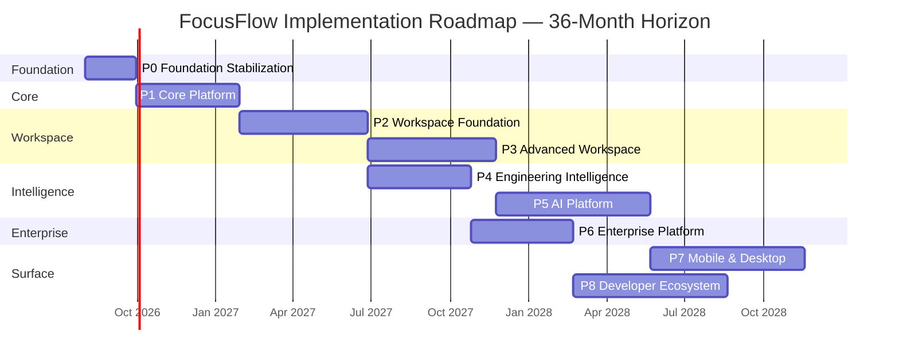
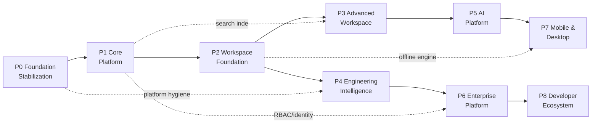
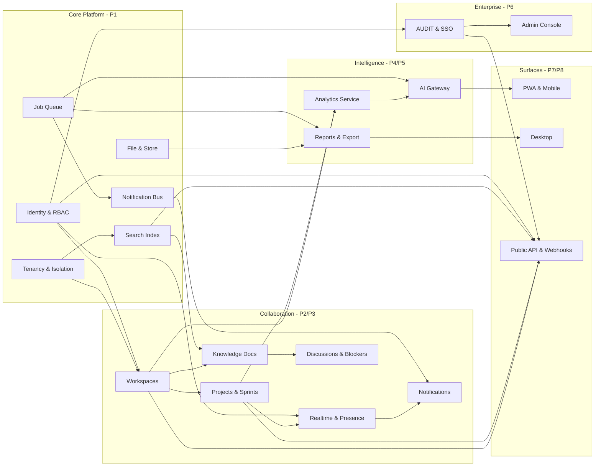
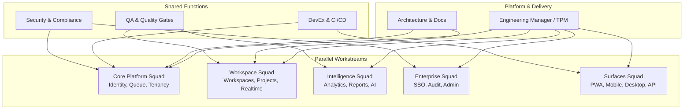
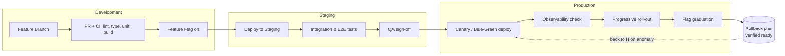
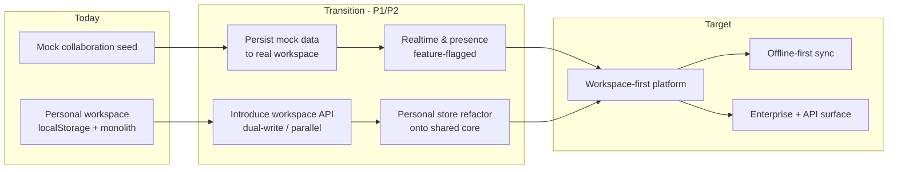
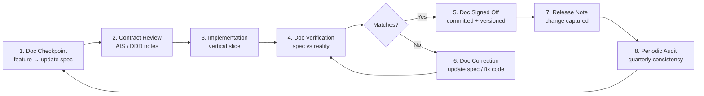
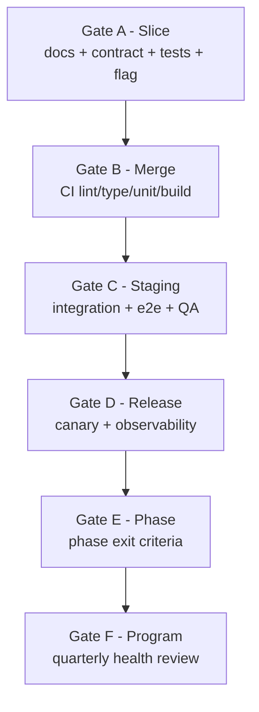

# FocusFlow — Implementation Roadmap (IRM)

**Product Name:** FocusFlow
**Document Type:** Implementation Roadmap (IRM)
**Supersedes:** N/A — defines how FocusFlow's roadmap is sequenced, executed, delivered, and governed
**Source of Truth:** FocusFlow PRD (v1.0); WPS (v1.1); UXS (v1.1); DSS (v1.1); DTS (v1.1); DDD (v1.0); SAD (v1.0); AIS (v1.0); FAG (v1.0); BAG (v1.0); TQS (v1.0); DDG (v1.0)
**Audience:** Engineering Managers, Technical Program Managers, Solution Architects, Software Architects, Team Leads, Backend Engineers, Frontend Engineers, DevOps Engineers, QA Engineers, Product Managers, Data Engineers, Designers, Future Contributors
**Status:** Draft v1.0
**Scope:** The complete master execution blueprint for FocusFlow — current-state assessment, gap analysis, phased roadmap (Foundation → Core Platform → Workspace Foundation → Advanced Workspace → Engineering Intelligence → AI Platform → Enterprise Platform → Mobile & Desktop → Developer Ecosystem), dependency modeling, team structure, release strategy, migration strategy, architecture evolution, critical path, engineering workflow, DevOps alignment, documentation lifecycle, quality gates, risk management, success metrics, delivery governance, and a five-year long-term vision. This document intentionally contains **no** React components, no Node.js code, no API schemas, no database migrations, no sprint tickets, and no GitHub issues. It defines **what to build, in what order, by whom, and how progress is governed** — not the implementation itself.

**Stack context (assumed, per prior documents):** Node.js (LTS) · TypeScript · React · Vite · Tailwind CSS · Express.js · MongoDB (Mongoose) · Redis · Socket.IO · BullMQ · JWT · bcrypt · Zustand · Recharts · docx/html2pdf · Vitest · OpenTelemetry · Docker · Future Kubernetes (BAG Ch. 25, SAD §19, §1.6, DDG Ch. 4).

**Consistency obligations.** The PRD, WPS, UXS, DSS, DTS, DDD, SAD, AIS, FAG, BAG, TQS, and DDG are authoritative. This document does **not** redesign the product, modify the architecture, introduce new business workflows, or contradict prior engineering decisions. It sequences and governs the work already defined by those documents. Where this document references product, data, architecture, or operations behavior, it does so by citing those documents. If a conflict appears, the referenced source-of-truth document wins and this document is corrected.

---

## Table of Contents

1. [Executive Summary](#1-executive-summary)
2. [Current State Assessment](#2-current-state-assessment)
3. [Gap Analysis](#3-gap-analysis)
4. [Roadmap Overview](#4-roadmap-overview)
5. [Guiding Principles](#5-guiding-principles)
6. [Phase Detail](#6-phase-detail)
7. [Phase & Module Dependencies](#7-phase--module-dependencies)
8. [Team Structure & Parallel Work](#8-team-structure--parallel-work)
9. [Release Strategy](#9-release-strategy)
10. [Migration Strategy](#10-migration-strategy)
11. [Architecture Evolution](#11-architecture-evolution)
12. [Critical Path](#12-critical-path)
13. [Engineering Workflow](#13-engineering-workflow)
14. [DevOps Alignment](#14-devops-alignment)
15. [Documentation Lifecycle](#15-documentation-lifecycle)
16. [Quality Gates & Verification](#16-quality-gates--verification)
17. [Risk Management](#17-risk-management)
18. [Success Metrics & KPIs](#18-success-metrics--kpis)
19. [Delivery Governance](#19-delivery-governance)
20. [Long-Term Vision](#20-long-term-vision)

### Appendices

- [A. Feature Priority Matrix](#a-feature-priority-matrix)
- [B. Phase Deliverables Matrix](#b-phase-deliverables-matrix)
- [C. Module Dependency Matrix](#c-module-dependency-matrix)
- [D. Risk Register](#d-risk-register)
- [E. Engineering Ownership Matrix](#e-engineering-ownership-matrix)
- [F. Quality Gate Matrix](#f-quality-gate-matrix)
- [G. Release Matrix](#g-release-matrix)
- [H. Migration Matrix](#h-migration-matrix)
- [I. Success Metrics Matrix](#i-success-metrics-matrix)
- [J. Glossary](#j-glossary)
- [K. Relationship to Other Documents](#k-relationship-to-other-documents)
- [L. Revision History](#l-revision-history)

---

## 1. Executive Summary

### 1.1 Purpose

The IRM is the **single execution handbook** for FocusFlow. It tells every engineer, manager, and stakeholder *what will be built, in what order, by which team, on what schedule, with what quality bar, and how we will know we are on track*. It transforms the product vision (PRD, WPS) and the engineering blueprints (DDD, SAD, AIS, FAG, BAG, TQS, DDG) into an **ordered, governed, measurable sequence of delivery**.

The IRM answers five questions:

1. **Where are we?** — A factual, evidence-based assessment of the current codebase (Chapter 2).
2. **Where is the gap?** — The difference between what exists today and what the 12 source-of-truth documents define (Chapter 3).
3. **How do we get there?** — A phased roadmap with dependencies, teams, releases, and migration steps (Chapters 4–11).
4. **How do we stay on track?** — Quality gates, metrics, governance, and risk management (Chapters 12–19).
5. **What is the destination?** — A five-year long-term vision (Chapter 20).

### 1.2 What Exists Today

FocusFlow today is a **functional single-user Personal Workspace**:

- A React 18 + TypeScript + Vite SPA with Zustand state, React Router, Tailwind, and Recharts (frontend).
- A Node.js/Express + Mongoose (MongoDB) monolith server with JWT auth and 10 domain route groups (auth, tasks, sessions, workLogs, habits, journals, projects, teams, reports, admin).
- A mature personal-productivity feature set: deep-focus timer engine (with offline persistence), tasks, work logs, journals, habits, analytics, reports, and DOCX/PDF export via an in-house doc engine.
- Early collaboration scaffolding: a team/workspace UI layer backed by seeded mock data in localStorage, and worklog-attachment export to Google Drive.

### 1.3 The Roadmap in One Paragraph

Over roughly **36 months** of engineering effort, FocusFlow evolves in **nine phases**: **Phase 0 (Foundation Stabilization)** hardens today's monolith into a trustworthy base; **Phase 1 (Core Platform)** adds the shared backend services, RBAC, and real workspace data that everything else depends on; **Phase 2 (Workspace Foundation)** delivers real, persisted multi-user workspaces with teams, projects, sprints, and realtime collaboration; **Phase 3 (Advanced Workspace)** adds knowledge base, notifications, and deeper collaboration; **Phase 4 (Engineering Intelligence)** brings analytics, dashboards, and reporting to teams; **Phase 5 (AI Platform)** integrates AI features; **Phase 6 (Enterprise Platform)** adds SSO, audit, admin, and enterprise governance; **Phase 7 (Mobile & Desktop)** ships PWA, mobile apps, and a desktop client; **Phase 8 (Developer Ecosystem)** opens APIs, webhooks, and integrations. Every phase ships value continuously, respects backward compatibility, and is gated by the same quality discipline.

### 1.4 How This Document Is Organized

- **Chapters 1–5** set context: where we are, where we need to go, and the rules of the road.
- **Chapters 6–11** are the heart: the phased plan, dependencies, teams, releases, migrations, and architecture evolution.
- **Chapters 12–15** define the operating rhythm: critical path, engineering workflow, DevOps alignment, and documentation lifecycle.
- **Chapters 16–19** define how quality, risk, metrics, and governance keep the plan honest.
- **Chapter 20** describes the five-year vision.
- **Appendices A–I** are the nine required working matrices referenced throughout; Appendices J–L provide glossary, cross-references, and revision history.

### 1.5 Key Commitments

The IRM commits the organization to the following non-negotiables:

1. **Incremental delivery over big-bang** — every phase ends in something users can touch.
2. **Backward compatibility at every step** — no phase may break an existing user's data or workflow (Chapter 10).
3. **Quality before speed** — no phase ships without passing the Phase Quality Gate (Chapter 16).
4. **Documentation drives implementation** — each phase starts with doc updates and ends with doc verification (Chapter 15).
5. **Build once, reuse everywhere** — the Core Platform services built in Phase 1 are reused by every later phase (Chapter 7).
6. **Automation first** — anything done twice is automated (Chapter 14).

---

## 2. Current State Assessment

### 2.1 Evidence Base

This chapter is based on direct inspection of the repository (`mainApp/`), not on assumptions. The assessment covers the frontend application, the backend server, shared libraries, and the tooling estate. All findings below were verified against the working tree at the time of writing.

### 2.2 Repository Layout

The repository root contains the twelve engineering documents plus `PLAN.md`, `structure.txt`, `pending-tasks.docx/pdf`, and a single application root `mainApp/`:

| Path | Contents |
|---|---|
| `mainApp/` | Frontend SPA (`src/`), Express server (`server/`), `dist/`, `node_modules/` |
| `mainApp/src/` | Pages, components, hooks, stores, lib/docEngine, types, utils |
| `mainApp/server/` | `index.js`, 10 route groups, 10 Mongoose models, 2 middleware |
| `mainApp/public/` | Static assets |

### 2.3 Frontend Application (mainApp/src)

**Framework and build stack.** The SPA is React 18.3 + TypeScript 5.5 built with Vite 5.4, styled with Tailwind CSS 3.4, state managed with Zustand 4.5, routing via React Router 6.26. Charts use Recharts; animation uses framer-motion; test tooling is Vitest + happy-dom. Document export is implemented with `docx` and `html2pdf` (browser-side).

**Page surface (routed).** Landing, Login, Register, Dashboard, Tasks, TaskDetail, Analytics, Journal, FocusMode, Habits, Reports, Settings, Admin, Leaderboard, WorkspaceHub, and TeamProjects. Routing is lazy-loaded via `App.tsx`.

**Layout system.** Three layout families exist: the general `AppLayout` with its sidebar, the `WorkspaceLayout` for the team/workspace experience, and the `AdminLayout` for the admin console. These are separate implementations today rather than one shared shell.

**Component estate.** The UI layer is organized into `components/auth` (ProtectedRoute, AdminRoute), `components/layout`, `components/tasks`, `components/worklog` (WorkLogWidget, ReflectionView, ProblemFlowEditor, TechnicalDecisionsView, StructuredBlockersView, TimelineView, TomorrowPlanView, AttachmentsView, ReadingModeView, WorkLogExporterModal), `components/collaboration` (CreateBlockerModal, CreateDocModal, CreateProjectModal, DiscussionsModal, GlobalCommandPalette, NotificationCenter), and `components/ui` (proEditor, Skeleton, StandardEmptyState, ThemeToggle, ToastContainer, etc.).

**State and persistence.** Application state lives in Zustand stores: `useStore` (personal workspace) and `useAuthStore` (session/workspace). The auth model today supports workspace types **`'personal' | 'admin'`** only. A `useCollaborationStore` maintains workspace/team/project/sprint data in localStorage seeded from `INITIAL_*` constants. Timer state is persisted via `utils/timerPersist` and driven by `utils/timerEngine`.

**Offline behavior.** Offline handling is currently **timer-only**: a queue (`ff_offline_timer_queue`) records `START_SESSION`, `PAUSE_SESSION`, `RESUME_SESSION`, and `STOP_SESSION` operations and replays them on the `online` event (`utils/offlineQueue`). No other domain supports offline mutation today.

**Doc engine.** `lib/docEngine` provides a data mapper, shared types, DOCX and PDF export modules, and a `developerDoc` template — the foundation for future export/report features.

### 2.4 Backend Server (mainApp/server)

The server is a **Node.js/Express 4 monolith** using Mongoose 8 against MongoDB. It is CommonJS (`type: commonjs`), run via `nodemon` in dev and `node index.js` in prod.

| Aspect | Evidence |
|---|---|
| Auth | JWT via `jsonwebtoken`; passwords bcrypt-hashed; middleware `auth.js` and `admin.js` |
| Routes | `admin`, `auth`, `habits`, `journals`, `profile`, `projects`, `reports`, `sessions`, `tasks`, `teams`, `workLogs` |
| Models | `Activity`, `Habit`, `Journal`, `Project`, `ReportShare`, `Session`, `Task`, `Team`, `User`, `WorkLog` |
| Integrations | `googleapis` for Google Drive attachment export (`utils/googleDrive.js`) |
| Config | `.env`-driven (`dotenv`), CORS enabled, `VITE_API_URL || 'http://localhost:5001/api'` convention |

The API surface is REST over HTTP; there is no realtime layer, no background job queue, no Redis, and no service boundary beyond the single Express app. The SPA consumes `Bearer` tokens stored in `localStorage` (`ff_token`) and restores sessions via `/auth/me`.

### 2.5 Collaboration Today: UI-First, Mock-Backed

The WorkspaceHub, TeamProjects, team, and discussion surfaces exist as polished UI, but their data lives in **localStorage seeded mock data** (workspaces like "Acme AI Engineering", teams Frontend/Backend/AI/DevOps, sprints, kanban, discussions, notifications). There is **no workspace persisted server-side today**; the server has `Team` and `Project` models/routes, but no workspace membership, roles, sprints, comments, or realtime sync endpoints consumed by these surfaces. This is the single largest gap between current state and the collaborative product defined in the WPS (Chapter 3).

### 2.6 Developer Experience & Tooling

- **Tests:** Vitest configured with the happy-dom environment; test coverage is early-stage and inconsistent across modules.
- **Lint/format:** No dedicated lint or format command surfaced in `package.json` scripts at the time of writing; TypeScript `tsc` via the build is the only static check in the default path.
- **CI/CD:** No repository CI configuration exists in-repo. All deployments are manual. There is no staging, no automated promotion, no feature flags, and no observability stack.
- **Docs:** Twelve engineering documents exist as authoritative source of truth (see K.1); all are currently **untracked in git** (present on disk, not committed).

### 2.7 Strengths

1. A real, working Personal Workspace with a deep focus-timer engine and offline timer queue.
2. A consistent TypeScript codebase with a typed domain model (`types/collaboration`, doc engine types).
3. A production-viable auth system (JWT, bcrypt, role middleware) and a real REST API.
4. A genuine export capability (DOCX/PDF) built in-house — a differentiator.
5. Clean component organization and a mature worklog feature suite.
6. A deliberate, document-driven engineering culture — twelve consistent specs already exist.

### 2.8 Weaknesses & Liabilities

1. **Mock collaboration data** in a UI that implies real multi-user functionality.
2. **Single-user workspace model** (`'personal' | 'admin'`) — no workspace membership or roles in the backend.
3. **Monolith with no service boundaries** and no queue — long-running operations (exports, notifications, AI) will block or fail at scale.
4. **Timer-only offline queue** — no offline support for tasks, journals, habits, or worklogs.
5. **No realtime channel** — no Socket.IO presence, no live sync, despite collaboration UI.
6. **No automated tests at meaningful coverage**, no lint, no CI.
7. **No observability** — no structured logs, metrics, or tracing in production.
8. **Documentation untracked in git** — the source-of-truth estate is not versioned.
9. **No feature flags, no release automation, no staged environments.**

### 2.9 Assessment Verdict

The current state is a **strong single-user MVP with collaboration-shaped UI**. The product is demonstrable and the architecture is conventional and maintainable. The gap is not "we need to write code from scratch"; it is "we need to **harden, then extend**": stabilize the monolith, introduce real persistence and roles for workspaces, then layer realtime, intelligence, AI, enterprise, and mobile capabilities on a shared core. This is precisely what Chapters 3–11 sequence.

---

## 3. Gap Analysis

### 3.1 Method

Each capability defined in the authoritative documents was compared against the current state (Chapter 2) and classified into one of four statuses:

- **DONE** — implemented and verified in the current codebase.
- **PARTIAL** — implemented in part (usually frontend UI, missing backend/persistence).
- **MISSING** — not present in any form.
- **FOUNDATION** — infrastructure/prerequisite required by later work, not yet present.

The result is the Gap Table below, which is the direct input to the Phase Planning in Chapter 6.

### 3.2 Capability Gap Table

| # | Capability | Source | Status | Notes |
|---|---|---|---|---|
| G1 | Single-user task management | PRD | DONE | Full CRUD + timer + offline queue |
| G2 | Deep-focus timer engine | PRD/WPS | DONE | timerEngine, timerPersist, offline replay |
| G3 | Work logs + structured reflection | WPS | DONE | Full worklog suite + DOCX/PDF export |
| G4 | Journals, habits, analytics, reports (personal) | PRD/WPS | DONE | Personal-level only |
| G5 | User auth (register/login/me) | PRD | DONE | JWT + bcrypt + admin middleware |
| G6 | Workspace model (multi-type, membership, roles) | WPS | **MISSING** | Backend has no workspace/roles; auth limited to `personal\|admin` |
| G7 | Real persisted teams, projects, sprints | WPS | PARTIAL | UI + seed data only; server Team/Project models underused |
| G8 | Realtime collaboration (presence, live sync) | WPS | **MISSING** | No Socket.IO channel |
| G9 | Discussions, blockers, knowledge docs | WPS | PARTIAL | UI modals + mock store only |
| G10 | Notifications (in-app) | WPS | PARTIAL | UI present; no server push/queue |
| G11 | Team analytics, dashboards, leaderboards | PRD | PARTIAL | Personal analytics exist; team-level missing |
| G12 | AI features (auto-standups, review assist, etc.) | PRD | **MISSING** | Deferred to Phase 5 |
| G13 | Integrations (Google Drive, calendars, git) | WPS | PARTIAL | Drive export only |
| G14 | Enterprise (SSO, audit, admin governance) | PRD | PARTIAL | Admin panel + admin middleware exist; no SSO/audit |
| G15 | Mobile/PWA/desktop clients | WPS | **MISSING** | Web only |
| G16 | Public API, webhooks, SDK | PRD | **MISSING** | Internal REST only |
| G17 | RBAC + permission model (workspace-level) | WPS | **MISSING** | Only global admin role |
| G18 | Background job queue (exports, mail, notifications) | SAD/BAG | **MISSING** | Monolith, no BullMQ |
| G19 | Real-time sync + presence engine | SAD | **MISSING** | See G8 |
| G20 | Observability (logs, metrics, tracing, SLOs) | DDG | **MISSING** | Nothing instrumented |
| G21 | CI/CD, environments, release automation | DDG/BAG | **MISSING** | No CI config in repo |
| G22 | Feature flags & progressive delivery | DDG | **MISSING** | Not present |
| G23 | Test coverage on critical paths | TQS | PARTIAL | Vitest exists; coverage low |
| G24 | Automated quality gates in pipeline | TQS | **MISSING** | Manual only |
| G25 | Offline-first for all user data | PRD/SAD | PARTIAL | Timer-only today |
| G26 | Doc-engine generalization (reporting) | SAD | PARTIAL | developerDoc template only |
| G27 | Multi-tenancy & tenant isolation | WPS/DDD | **MISSING** | Single-tenant in practice |
| G28 | Search (global, cross-workspace) | PRD/WPS | **MISSING** | Not present |
| G29 | Audit trail (enterprise) | PRD | **MISSING** | Not present |
| G30 | Versioned docs & specs in git | Culture | PARTIAL | Docs on disk, untracked |

### 3.3 Gap Themes

The thirty gaps cluster into five themes, each becoming the anchor of a phase group:

1. **Persistence & Identity (G6, G7, G17, G27)** — the foundation. Nothing collaborative is real until workspaces, memberships, and roles are persisted server-side. → Phases 1–2.
2. **Realtime & Collaboration (G8, G9, G10)** — the experience. Presence, live sync, discussions, and notifications. → Phases 2–3.
3. **Intelligence & Reporting (G11, G12, G26)** — the value-add. Team analytics, AI features, generalized export. → Phases 4–5.
4. **Scale, Enterprise & Governance (G14, G20–G24, G29, G30)** — the discipline. Observability, CI/CD, quality gates, audit, SSO. → Phases 1, 4, 6, and every phase.
5. **Surface Expansion (G13, G15, G16)** — the reach. Integrations, mobile, desktop, public API. → Phases 7–8.

### 3.4 Gap Closure Strategy

Each gap is closed **inside a specific phase** (Chapter 6), with an explicit owner team (Chapter 8) and a quality gate (Chapter 16). Gaps are never closed "in passing"; they are scheduled work items with definition-of-done tied to the authoritative spec. The Feature Priority Matrix (Appendix A) ranks all gaps by business value, effort, and dependency so that the phases in Chapter 6 are sequenced by data, not by preference.

---

## 4. Roadmap Overview

### 4.1 The Nine Phases at a Glance

| Phase | Name | Core Outcome | Primary Gap Closure |
|---|---|---|---|
| P0 | Foundation Stabilization | Hardened monolith, baseline tests, CI, versioned docs | G21, G23, G24, G30 |
| P1 | Core Platform | Shared backend services, RBAC, workspace persistence foundation | G6, G17, G18, G27 |
| P2 | Workspace Foundation | Real persisted workspaces, teams, projects, sprints, realtime | G7, G8, G17 |
| P3 | Advanced Workspace | Knowledge base, notifications, deeper collaboration | G9, G10, G28 |
| P4 | Engineering Intelligence | Team analytics, dashboards, reports, generalized doc engine | G11, G26, G13 |
| P5 | AI Platform | AI features across the product | G12 |
| P6 | Enterprise Platform | SSO, audit, admin governance, tenant controls | G14, G29 |
| P7 | Mobile & Desktop | PWA, mobile apps, desktop client, offline-first | G15, G25 |
| P8 | Developer Ecosystem | Public API, webhooks, SDK, marketplace | G16, G13 |

### 4.2 Overall Roadmap Timeline



### 4.3 Sequencing Logic

The ordering is driven by three rules, in priority order:

1. **Dependency first** — a phase starts only after the phase it depends on meets its quality gate (Appendix B, C). P1 must precede P2; P2 must precede P3 and P4; P5 and P7 depend on P3; P6 and P8 depend on earlier platform work.
2. **Vertical value early** — phases are scheduled so users receive complete, usable vertical slices quickly (P1 ships a login-to-workspace slice; P2 ships a create-workspace-to-sprint slice).
3. **Risk reduction** — risky or high-uncertainty work (AI in P5, mobile in P7) is delayed until the platform is stable, while foundational risk (persistence, identity) is retired first.

### 4.4 Overlap & Parallelism

Phases are sequential at the **milestone** level but overlap at the **workstream** level. The phase dependency graph (Chapter 7), the team structure (Chapter 8), and the critical path (Chapter 12) define exactly which tracks may run in parallel and which must wait. As a rule: **Core services and Workspace run strictly sequentially; Intelligence, Enterprise, and AI tracks run in parallel once their dependencies are done.**

### 4.5 Deliverables Ownership

Every phase produces a defined deliverable set (Appendix B) owned by a named team (Appendix E), released through the release train (Chapter 9), and migrated via the migration plan (Chapter 10). Nothing ships "at the end of a phase"; value ships continuously within each phase (Chapter 9).

---

## 5. Guiding Principles

### 5.1 The Eleven Principles

Every roadmap decision in this document derives from these eleven principles. They are the tie-breakers for any ambiguous scheduling, scoping, or delivery decision.

1. **Architecture First** — no feature ships without its architectural placement being specified (SAD, DDD). Architecture is decided once, in docs, and implemented consistently.
2. **Build Once, Reuse Everywhere** — every cross-cutting capability (auth, RBAC, notifications, export, search, file storage, realtime) is built once in the Core Platform and reused by all other phases. Duplication is a design defect.
3. **Incremental Delivery** — the roadmap delivers in small, releasable increments. Each phase ends with working, usable software, not a document.
4. **Vertical Slices** — teams deliver complete vertical slices (UI → API → persistence → tests) rather than horizontal layers. A user-facing feature is "done" only when it works end-to-end.
5. **Feature Completeness** — a feature is complete when it meets the acceptance criteria in its source-of-truth spec, including edge cases, offline behavior, and accessibility — not when the happy path works.
6. **Backward Compatibility** — no release may break existing users' data or workflows. Migrations are additive, non-destructive, and reversible (Chapter 10).
7. **Continuous Refactoring** — the monolith is improved continuously toward the target architecture (Chapter 11) through small, safe refactors inside feature work — never big-bang rewrites.
8. **Automation First** — any task performed more than twice is automated: CI, tests, migrations, releases, environment provisioning (Chapter 14).
9. **Documentation Driven Development** — documentation is the steering wheel, not the rear-view mirror. Each feature starts by updating docs and ends by verifying docs against reality (Chapter 15).
10. **Quality Before Speed** — no phase or feature passes a gate by compressing quality. The Quality Gates (Chapter 16) are immutable.
11. **Developer Experience** — the platform and its roadmap must be pleasant to build on: fast builds, good tooling, clear ownership, low cognitive load, great docs.

### 5.2 How Principles Shape the Roadmap

| Principle | Roadmap Consequence |
|---|---|
| Architecture First | Phase 1 builds the shared services the architecture requires before feature work accelerates |
| Build Once, Reuse Everywhere | Realtime, RBAC, notifications, search are single workstreams, not per-feature builds |
| Incremental Delivery | Phases ship continuous releases (Chapter 9); no phase is a silent multi-month black box |
| Vertical Slices | P1 "login → workspace" slice; P2 "workspace → sprint" slice — not "all API first" |
| Feature Completeness | Offline-first (G25) and accessibility are in scope per feature, not deferred globally |
| Backward Compatibility | Migration Matrix (Appendix H) applies to every phase with data or API changes |
| Continuous Refactoring | The monolith-to-services evolution (Ch 11) is interleaved into phases, not a separate project |
| Automation First | CI, gates, and releases appear in P0, not "later when we have time" |
| Documentation Driven Development | Every phase opens with a doc task and closes with a doc audit (Ch 15) |
| Quality Before Speed | Quality gates (Ch 16) are fixed; schedules flex, quality does not |
| Developer Experience | P0 includes tooling/CI/scripts so every later phase starts fast |

## 6. Phase Detail

### 6.1 Phase 0 — Foundation Stabilization (≈ 2 months)

**Purpose.** Make the current monolith a trustworthy base for everything that follows. No new product features ship in P0; the deliverable is *confidence*: versioned docs, baseline tests, CI, lint, and a reproducible local/CI environment.

**Scope.**
- Establish repository hygiene: commit the twelve engineering documents; add a `docs/` versioning policy (Chapter 15).
- Stand up CI (lint, type-check, unit tests, build) per TQS Ch. 15 and DDG Ch. 5 (CI Strategy).
- Establish the environment model (Local/Dev/CI/QA/Staging/Prod per DDG Ch. 3) and a reproducible local setup (one-command dev bootstrap).
- Baseline test coverage on the critical paths: auth, timer engine, worklog persistence, offline queue (TQS).
- Add structured logging and a metrics sidecar to the Express server (DDG Ch. 9–11), so every later phase is observable from day one.
- Introduce feature flags (DDG Ch. 17) so every later phase can ship dark.

**Exit criteria (Phase Quality Gate 0).** Docs committed; CI green on every PR; coverage ≥ 50% on critical paths; feature flags live; structured logs flowing in Staging; zero open Sev-1/Sev-2 defects in the personal workspace.

### 6.2 Phase 1 — Core Platform (≈ 4 months)

**Purpose.** Build the shared backend services that every future phase reuses: identity & workspace RBAC, the job queue, the notification bus, the file/store layer, and search indexing foundations. This is the "Build Once, Reuse Everywhere" phase.

**Scope.**
- **Identity & RBAC service:** workspace entity, membership, roles (Owner/Admin/Manager/Developer/Viewer), invite flow, and permission middleware (WPS, DDD contexts). Closes G6, G17.
- **Job queue infrastructure:** BullMQ (Redis) for async work — exports, mail, notifications, later AI jobs (SAD, BAG Ch. 25). Closes G18.
- **Notification service:** in-app notification store + delivery via the queue (WPS). Closes G10 partially.
- **File/store layer:** object-storage abstraction (DDG Ch. 4); migrate Google Drive export onto it (SAD). Closes G13 partially.
- **Search index foundations:** an indexable, event-sourced projection for tasks/worklogs/workspaces (DDG Ch. 14, DDD projections). Closes G28 partially.
- **Tenant isolation model:** workspace-scoped data access at the DB and API layer (DDD, WPS). Closes G27.

**Exit criteria.** New workspace API live and test-covered; RBAC enforced across all workspace routes; queue processing in staging; notifications delivered; storage abstraction used by exports; feature-flagged rollout to a pilot workspace.

### 6.3 Phase 2 — Workspace Foundation (≈ 5 months)

**Purpose.** Deliver the real, persisted, collaborative workspace: users can create a workspace, invite members, form teams, create projects and sprints, and see each other's presence — all server-backed and realtime.

**Scope.**
- Persist workspaces/teams/projects/sprints server-side; replace the `INITIAL_*` mock seed with real data flows (Chapter 2 findings). Closes G7.
- Realtime layer: Socket.IO presence, live cursors/updates, and workspace event fan-out (SAD §16). Closes G8.
- Kanban/board and sprint management wired to the API (WPS).
- Offline-first for task/worklog mutations using the generalized offline queue pattern already proven by the timer (G25, Phase 2 scope).
- Team page, workspace settings, member management UI (UXS).

**Exit criteria.** A real multi-user workspace runs end-to-end with presence and live updates; the mock seed is gone; offline task mutations sync on reconnect; workspace RBAC enforced in UI and API.

### 6.4 Phase 3 — Advanced Workspace (≈ 5 months)

**Purpose.** Deepen the collaboration surface: knowledge, discussion, blockers, and notifications across the workspace.

**Scope.**
- Knowledge base: real persisted docs with roles and search (WPS; the doc engine generalizes for rendering/export — G26). Closes G9.
- Discussions and comment threads wired to realtime and notifications (WPS). Closes G9.
- Notification Center server-backed; unread/push-ready (G10). Closes G10.
- Global command palette searches across workspace data (G28).
- Admin workspace controls (archiving, member management, audit-lite).

**Exit criteria.** Knowledge docs create/read/search/edit with RBAC; discussions live-sync; notifications deliver and persist; global search returns across tasks, worklogs, docs, and people.

### 6.5 Phase 4 — Engineering Intelligence (≈ 4 months)

**Purpose.** Turn the data the workspace generates into insight: team analytics, dashboards, reports, and export.

**Scope.**
- Team analytics service: velocity, focus-time aggregation, blocker analytics, leaderboards (PRD; reuse personal analytics patterns in Analytics page).
- Realtime dashboards for teams/leads (Recharts + realtime channel).
- Generalized reporting via the doc engine: team reports, export-to-DOCX/PDF, scheduled exports through the job queue (G26).
- Reports/insights surfaced in the workspace and admin surfaces.

**Exit criteria.** Team dashboards live; scheduled report exports run via the queue; report definitions are user-configurable; exports render correctly in DOCX and PDF.

### 6.6 Phase 5 — AI Platform (≈ 6 months)

**Purpose.** Integrate the AI features defined in the PRD/WPS: auto-standups, meeting summaries, code-review assist, and intelligent insights — on top of the now-mature platform.

**Scope.**
- AI gateway service: provider abstraction, prompt/template registry, token budgeting, audit (SAD, BAG).
- Auto-standup generation from worklogs (PRD).
- Intelligent insights: focus recommendations, anomaly alerts, weekly digests.
- AI-assisted worklog/reflection drafting; code-review assistance in TeamProjects (PRD).
- All AI jobs run through the queue; outputs are stored and searchable; every AI action is auditable (enterprise-ready).

**Exit criteria.** AI features live behind flags; auto-standups and digests accurate on pilot data; token usage metered and cost-capped; AI outputs stored and auditable.

### 6.7 Phase 6 — Enterprise Platform (≈ 4 months)

**Purpose.** Make FocusFlow enterprise-ready: SSO, audit, granular admin governance, compliance, and tenant management.

**Scope.**
- SSO/SAML/OIDC (AIS auth schema).
- Audit trail for workspace and admin actions (G29).
- Enterprise admin console: tenant controls, usage quotas, role policies (extends Admin panel).
- Compliance tooling per DDG Ch. 20 (retention, export, DSRs for DDD §13.3 privacy).
- Billing/seats groundwork if required by PRD (deferred by default).

**Exit criteria.** SSO login works for a pilot enterprise tenant; audit events capture all privileged actions; admin console meets the admin feature spec; privacy/DSR flows operable.

### 6.8 Phase 7 — Mobile & Desktop (≈ 6 months)

**Purpose.** Expand the surface: PWA, then mobile apps, then desktop client — with offline-first as the core principle.

**Scope.**
- PWA: installability, offline shell, service-worker caching of the SPA (reuses offline queue generalization).
- Mobile apps (iOS/Android) — shared core, native wrappers, push notifications, offline sync engine.
- Desktop client (Windows/macOS) via the shared core, tray timer integration, local export.
- Cross-device sync consistency (DDD event sourcing alignment; DDG RPO/RTO targets).

**Exit criteria.** PWA installable and functional offline; mobile apps pass store review; desktop client ships with timer + worklog parity; sync conflict-resolution validated.

### 6.9 Phase 8 — Developer Ecosystem (≈ 6 months)

**Purpose.** Open the platform: public API, webhooks, SDKs, and an integration marketplace.

**Scope.**
- Public REST + realtime API v1 (versioned, rate-limited, key-managed) (AIS).
- Webhooks with signing, retries, and delivery logs (DDG Ch. 17).
- SDKs (TypeScript, plus community language stubs).
- Integrations: calendars, git providers, Slack/Discord, Google Workspace (G13, G16).
- Marketplace/extensions foundation if business case supports it (deferred by default).

**Exit criteria.** Public API docs live; webhook delivery ≥ 99.9% with retries; at least three partner integrations in production; SDK published.

### 6.10 Phase Entry/Exit Discipline

Every phase:

1. **Opens** with a Documentation Checkpoint (Chapter 15) and a kickoff covering scope, ownership (Appendix E), and the phase milestone plan.
2. **Runs** as a sequence of vertical-slice increments on the release train (Chapter 9).
3. **Closes** with the Phase Quality Gate (Chapter 16) and a go/no-go review before the next phase starts.

No phase may start until the previous phase's gate is **green** and its rollback plan (Chapter 10) is validated.

---

## 7. Phase & Module Dependencies

### 7.1 Phase Dependency Graph



### 7.2 Dependency Rules

1. **Hard dependencies** (must complete before the dependent phase starts): P0→P1→P2→P3; P3→P5; P2→P4.
2. **Soft dependencies** (dependent phase may start in parallel, but must consume the dependency's contract): P1 services → P3, P4, P6; P2 offline engine → P7; P3 knowledge/search → P5.
3. **Milestone-level unlocks** — a dependent phase may start its *non-blocked* workstreams while a predecessor finishes, but only when the predecessor has passed its gate (Chapter 16) or formally waived specific deliverables (Appendix B).

### 7.3 Module Dependency Graph



### 7.4 Module Dependency Matrix

The full matrix (each module × depends-on × depends-by × phase) is provided in **Appendix C**. Key structural facts:

- **Identity & RBAC is the most depended-upon module** — every collaboration, enterprise, and surface module consumes it. It is therefore the first module built in P1 and the most protected from change.
- **Job Queue is the integration backbone** — notifications, reports, AI, and webhooks all run through it. It must be stable before P3, P4, or P5 work streams depend on it.
- **Realtime & Presence is depended on by notifications, dashboards, and collaboration surfaces** — it must be versioned and backward-compatible (Chapter 10).
- **The offline sync engine (built P2) is depended on by PWA/mobile/desktop** — its design therefore anticipates multi-entity sync from the start.

---

## 8. Team Structure & Parallel Work

### 8.1 Team Model

FocusFlow is designed to be delivered by a **solo founder or small team today** and to scale to **parallel squads** as resourcing allows. The IRM therefore defines **logical teams (roles)** that map 1:1 to actual people when the team is small, and to multiple people per team when it grows. Ownership is defined at the **logical team** level (Appendix E) so the roadmap is independent of headcount.

### 8.2 Parallel Team Structure



### 8.3 Squad Composition by Phase

| Phase | Active Squads (beyond Platform & Delivery) | Notes |
|---|---|---|
| P0 | (single stream) | All hands on hygiene + tooling |
| P1 | Core Platform | One squad; possibly solo |
| P2 | Core Platform + Workspace | Workspace joins when P1 API stabilizes |
| P3 | Workspace + (Intelligence prep) | Intelligence starts research only |
| P4 | Intelligence + Workspace | Reports/analytics squad spins up |
| P5 | Intelligence + AI specialists | AI squad added; Workspace thins out |
| P6 | Enterprise + Intelligence | SSO/audit squad runs in parallel |
| P7 | Surfaces + Enterprise | Mobile/desktop squad joins |
| P8 | Surfaces + Ecosystem | API/webhooks squad; Enterprise winds down |

### 8.4 Parallel Work Rules

1. **One phase owner** per active phase (a person, not a committee).
2. **Shared contracts before parallel work** — a squad may parallelize only on modules whose contracts are stable (Appendix C).
3. **Feature-flag isolation** — parallel squads ship toggled-off until integration (DDG Ch. 17).
4. **Documentation is written by the owning squad** — no code lands without its doc checkpoint (Chapter 15).
5. **Bus-factor ≥ 2** on every critical module by the time it reaches production.

### 8.5 Engineering Ownership Matrix

The full ownership map (module × owning squad × reviewer × phase) is in **Appendix E**. Ownership is stable; review is rotating to spread context.

---

## 9. Release Strategy

### 9.1 Release Train

FocusFlow uses a **two-week release train** once CI is live (P0+): every two weeks, the current branch set produces a releasable candidate. Releasing is a **calendar event, not a scramble** — features that miss the train wait for the next one (DDG Ch. 17 release management).

### 9.2 Release Flow



### 9.3 Versioning

- **SemVer** for the public API from P8 onward (AIS).
- **Product releases** follow `YYYY.MINOR.PATCH` with a release note per train (DDG Ch. 17).
- **Internal services** are versioned independently but published in lockstep with the product release they first ship in.

### 9.4 Release Matrix

The Release Matrix (**Appendix G**) maps every phase to its release train outcomes, cadence, rollback strategy, and flag-graduation criteria. Rollback is always **preferred over fix-forward** for the first 24 hours; fix-forward after root cause is known (DDG Ch. 17).

---

## 10. Migration Strategy

### 10.1 Principles

1. **Additive, never destructive** — migrations add new entities/fields; they do not drop or rewrite user data.
2. **Reversible** — every migration ships with a validated rollback path before it runs.
3. **Dual-write where risky** — during sensitive transitions (auth model, workspace persistence), the new path and the old path run side-by-side with consistency checks.
4. **Backward-compatible APIs** — API versions are additive; old clients keep working (AIS).
5. **Users see continuity** — the single-user personal workspace keeps working identically as workspace features come online; no user is forced to migrate until they choose (or until a clean cutover passes its gate).

### 10.2 Migration Strategy Diagram



### 10.3 Migration Matrix

The Migration Matrix (**Appendix H**) enumerates every planned migration (data, schema, auth model, offline, UI) with its trigger, strategy, rollback, and owner. Critical migrations:

- **M-AUTH (P1):** workspace membership/roles added to the identity model; existing users get a default personal workspace automatically; `'personal' | 'admin'` model extended without breaking sessions.
- **M-MOCK (P2):** the `INITIAL_*` seed data is migrated into a real, user-ownable workspace via an import path — users lose nothing; the mock store is then removed.
- **M-OFFLINE (P2/P7):** timer-only queue generalizes to a multi-entity sync engine; old queue payloads still replay.
- **M-SEARCH (P3):** search moves from in-memory to the index; no data loss, results may temporarily be fresher via dual-write.
- **M-SURFACE (P7):** PWA/mobile/desktop consume the same API; web-first users unaffected.

## 11. Architecture Evolution

### 11.1 Current → Target Architecture

The target architecture is defined by the SAD (v1.0) and DDD (v1.0); this chapter sequences the *evolution* from today's monolith toward it. The goal is **continuous, incremental evolution** — no rewrite.

```mermaid
flowchart TB
    subgraph Current[Current - Monolith]
        C1[SPA<br/>React 18 + Vite + Zustand]
        C2[Express API<br/>10 route groups]
        C3[MongoDB<br/>10 models]
        C4[localStorage mock<br/>collaboration]
        C5[Timer offline queue]
        C1 --> C2
        C2 --> C3
        C1 --> C4
        C1 --> C5
    end

    subgraph Interim[Interim - Hardened Monolith + Services (P1-P3)]
        I1[SPA + workspace UI]
        I2[Express API + RBAC]
        I3[MongoDB + tenancy]
        I4[Redis + BullMQ]
        I5[Realtime Gateway]
        I6[Search Index]
        I7[Object Storage]
        I1 --> I2
        I2 --> I3
        I2 --> I4
        I4 --> I5
        I2 --> I6
        I2 --> I7
    end

    subgraph Target[Target - Modular Platform (P4-P8)]
        T1[Web / PWA / Mobile / Desktop]
        T2[API Gateway + Public API]
        T3[Identity & RBAC Service]
        T4[Core API Services]
        T5[AI Gateway]
        T6[Analytics & Reports]
        T7[Event Bus / Queue]
        T8[Data Layer - Mongo + Search + Cache]
        T9[Observability + Audit]
        T1 --> T2
        T2 --> T3
        T2 --> T4
        T4 --> T7
        T4 --> T8
        T3 --> T8
        T5 --> T7
        T6 --> T7
        T7 --> T8
        T9 -.monitors all.-> T2
    end

    Current -->|incremental refactor<br/>P0-P3| Interim
    Interim -->|service extraction<br/>P4-P8| Target
```

### 11.2 Evolution Steps by Phase

| Phase | Architecture Action | Pattern |
|---|---|---|
| P0 | Instrument the monolith; add flags, logs, CI | Observable monolith |
| P1 | Extract shared capabilities (identity, queue, notifications, storage) as internal services; keep the monolith in front | Strangler with internal services |
| P2 | Add realtime gateway; generalize offline engine | Sidecar gateway + sync engine |
| P3 | Extract search into an indexed projection | CQRS / event-sourced projections |
| P4 | Extract analytics/reporting service; generalize doc engine | Read-model services |
| P5 | Add AI gateway as a service behind the queue | Gateway + jobs |
| P6 | Add SSO/audit; harden tenancy | Enterprise services |
| P7 | Surfaces consume the API via the gateway | Client-agnostic API |
| P8 | Publish the internal API surface as a versioned public API; add webhooks | Public gateway + events |

### 11.3 Decomposition Discipline

1. **Extract only when needed** — a service is extracted when it has distinct scaling, ownership, or security requirements (SAD); otherwise it stays in the monolith. No speculative services.
2. **Contract before extraction** — the API contract of the extracted service is documented (AIS) and stabilized before code moves.
3. **Strangler, not rewrite** — services are extracted from the monolith incrementally; the monolith shrinks but never stops working.
4. **Data follows behavior** — each extracted service owns its data; migrations follow Appendix H.
5. **Reuse the Core Platform** — any capability that already exists in the Core Platform is consumed, never reimplemented (Principle 2).

### 11.4 Technical Debt Budget

Each phase allocates an explicit **≤ 15% engineering capacity** to continuous refactoring (Principle 7): dependency upgrades, dead-code removal, type tightening, and debt from the current state (Chapter 2.8). This is not optional slack; it is scheduled work so the target architecture is reached with *less* debt, not more.

---

## 12. Critical Path

### 12.1 Definition

The critical path is the longest sequence of dependent milestones from P0 to the first revenue-defining capability (Workspace Foundation, P2) and onward to the platform capabilities. **Any delay on the critical path delays the roadmap.** Non-critical workstreams are parallelizable (Chapter 8); critical-path work is protected.

### 12.2 Critical Path Diagram

```mermaid
flowchart LR
    A[P0 Gate 0<br/>CI + docs + flags] --> B[P1.1 Identity & RBAC<br/>workspace model]
    B --> C[P1.2 Job Queue + Notifications]
    C --> D[P1 Gate 1<br/>workspace API live]
    D --> E[P2.1 Workspace persistence<br/>kill mock seed]
    E --> F[P2.2 Realtime & presence]
    F --> G[P2.3 Offline sync engine]
    G --> H[P2 Gate 2<br/>real multi-user workspace]
    H --> I[P3.1 Knowledge + search]
    I --> J[P3.2 Notifications + discussions]
    J --> K[P3 Gate 3<br/>advanced collaboration]
    K --> L[P5.1 AI gateway + auto-standups]
    L --> M[P5 Gate 5<br/>AI platform live]
    M --> N[P7.1 Offline-first surfaces]
    N --> O[P8.1 Public API + webhooks]
    O --> P[P8 Gate 8<br/>ecosystem live]
```



### 12.3 Critical Path Milestones

| Milestone | Phase | Exit Evidence |
|---|---|---|
| Gate 0 — Foundation | P0 | CI green, docs committed, flags live |
| Gate 1 — Core Platform | P1 | Workspace API + RBAC + queue in staging |
| Gate 2 — Workspace Foundation | P2 | Real multi-user workspace, realtime, offline |
| Gate 3 — Advanced Workspace | P3 | Knowledge, search, notifications live |
| Gate 5 — AI Platform | P5 | Auto-standups and digests in production behind flags |
| Gate 7 — Surfaces | P7 | PWA + mobile + desktop shipped |
| Gate 8 — Ecosystem | P8 | Public API + webhooks + 3 integrations |

### 12.4 Protecting the Critical Path

1. **Critical-path items are never parallelized into two owners** — one accountable owner per milestone (Appendix E).
2. **Critical-path items get the quality-gate exemption from nothing** — quality is fixed; schedule is flexible (Principle 10).
3. **Critical-path risk is reviewed weekly** in the delivery governance cadence (Chapter 19) against the Risk Register (Appendix D).
4. **Buffer is explicit** — each phase carries a 10–15% schedule buffer on critical-path milestones, consumed only with a documented decision.

---

## 13. Engineering Workflow

### 13.1 The Standard Slice

Every feature, in every phase, follows the same end-to-end slice workflow. This is the operationalization of the Vertical Slices principle.

```mermaid
flowchart LR
    A[1. Doc Checkpoint<br/>update source-of-truth] --> B[2. Design & Contract<br/>AIS/DDD notes]
    B --> C[3. Vertical Slice<br/>UI + API + persistence]
    C --> D[4. Tests<br/>unit + integration + e2e]
    D --> E[5. Feature Flag on]
    E --> F[6. Code Review<br/>owner + reviewer]
    F --> G[7. Release Train<br/>CI + staging]
    G --> H[8. Observability<br/>metrics + logs]
    H --> I[9. Flag Graduation]
    I --> J[10. Doc Audit<br/>specs match reality]
```



### 13.2 Slice Ownership & Definition of Done

- **Owner** (Appendix E) is accountable for steps 1–5 and 10.
- **Reviewer** is accountable for step 6 (design + code).
- **Definition of Done** for a slice: docs updated (Ch 15), contract reviewed, vertical slice merged, tests green (Ch 16), flag on in staging, metrics wired, doc audit passed.

### 13.3 Working Agreements

1. **Trunk-based development** — short-lived feature branches merged to trunk behind flags (DDG Ch. 5/17).
2. **Pull-request discipline** — every PR runs lint, type-check, unit tests, and build; coverage gates apply per TQS.
3. **No long-lived branches** — any branch older than a release train is merged or abandoned.
4. **Pairs and swarms for critical path** — critical-path milestones are pair-built to protect bus-factor (Ch 12).
5. **Documentation is code** — docs are committed, reviewed, and versioned alongside code (Ch 15).
6. **Automation first** — manual steps in the workflow are reported to the DevEx function and automated (Principle 8).

### 13.4 Workflow Evolution

In P0 the workflow is manual-but-documented; by P1 it is enforced by CI; by P4 it is enforced by CI + a quality bot (gates in PR). The process steps never change; the automation level rises (Chapter 14).

---

## 14. DevOps Alignment

### 14.1 Relationship to the DDG

The IRM sequences *when* DevOps capabilities come online; the **DDG (v1.0)** defines *how* they operate. This chapter is the bridge. All operational definitions — environments, promotion, monitoring, SLOs, runbooks, DR — are owned by the DDG and cited here, not redefined.

### 14.2 DevOps Capabilities by Phase

| Phase | DevOps Capability Brought Online | DDG Reference |
|---|---|---|
| P0 | CI pipeline; environment model (Local/Dev/CI/QA/Staging/Prod); feature flags; structured logging; baseline SLOs | DDG Ch. 3, 5, 9, 17 |
| P1 | Staging promotion automation; metrics + tracing sidecars; queue/infra monitoring | DDG Ch. 6, 9, 11 |
| P2 | Realtime monitoring (Socket.IO), presence SLOs; offline sync telemetry | DDG Ch. 9, Appendix D |
| P3 | Search index observability; notification delivery SLIs | DDG Ch. 9, 14 |
| P4 | Report/export job monitoring; analytics pipeline alerts | DDG Ch. 9, 16 |
| P5 | AI gateway monitoring (latency, tokens, cost); model-provider failover | DDG Ch. 9, 14 |
| P6 | SSO/audit monitoring; compliance dashboards; retention jobs | DDG Ch. 19, 20 |
| P7 | Push-notification SLIs; cross-device sync conflict alerts | DDG Ch. 9, Appendix D |
| P8 | Public API SLOs, rate-limit monitoring, webhook delivery SLIs | DDG Ch. 9, 17 |

### 14.3 Target SLOs (from DDG Appendix D)

The IRM phases inherit the DDG's SLO targets as the **operational exit criteria** for the relevant capabilities:

- API availability 99.9%; read latency p95 < 300ms; write ack p95 < 500ms.
- Realtime event delivery p95 < 1s; search p95 < 500ms.
- Projection lag < 5s.
- RPO 15 minutes; RTO 4h (Phase 1) improving to 1h (Phase 2+ of DDG infrastructure).

### 14.4 Environments & Promotion

Promotion is **automated per environment** (BAG Ch. 25.1, DDG Ch. 3): code moves from Dev → Testing-CI → QA → Staging → Prod only by passing the gates of the current environment. Production changes use **canary/blue-green** with automated observability checks and a validated rollback path (DDG Ch. 17). Feature flags control user-facing exposure independent of deployment.

### 14.5 Runbooks & On-Call

Runbooks follow the DDG standard structure (Symptoms / Diagnosis / Immediate actions / Recovery / Verification / Escalation / Postmortem). On-call rotation starts when a capability reaches production; every new production capability ships with its runbook in the DDG's runbook index (DDG Ch. 16, Appendix E).

---

## 15. Documentation Lifecycle

### 15.1 Documentation Drives Development

The twelve source-of-truth documents are **living, authoritative artifacts** (Principle 9). The IRM defines their lifecycle so they steer implementation instead of describing it after the fact.

### 15.2 Documentation Lifecycle Diagram



### 15.3 Documentation Rules

1. **No feature work starts without a doc checkpoint** — the owning squad updates the relevant source-of-truth doc before or with the first commit.
2. **Docs are committed and versioned** — the current state of "docs untracked in git" is remediated in P0 (Chapter 2.8, G30).
3. **Docs are reviewed like code** — the architecture reviewer signs off on doc changes (Appendix E).
4. **Doc verification is part of done** — a slice is not done until its spec matches reality.
5. **Cross-document consistency** — when one document changes, the IRM's relationship map (Appendix K) tells which others must be checked.

### 15.4 Documentation Ownership

Each document has a **named steward** (Appendix K.2). The steward approves changes, tracks divergence, and runs the quarterly consistency audit. The IRM itself is stewarded by the Engineering Manager / TPM and is updated at every phase gate.

## 16. Quality Gates & Verification

### 16.1 Quality Philosophy

Quality is **defined before work starts and enforced by gates** (Principle 10). Gates are immutable; schedules flex. The TQS (v1.0) defines the testing strategy; this chapter defines the *gate sequence* that gates delivery.

### 16.2 The Gate Sequence

Every feature, release, and phase passes the same gate ladder. A gate is **red** until its evidence is green.



### 16.3 Gate Criteria

| Gate | Applies To | Minimum Evidence |
|---|---|---|
| A — Slice | Every vertical slice | Doc checkpoint merged; contract reviewed; unit + integration tests green; flag on |
| B — Merge | Every PR | CI green (lint, type-check, unit, build); coverage floor met (TQS); review approved |
| C — Staging | Every release candidate | Deployed to staging; e2e + integration green; QA sign-off; observability dashboards populated |
| D — Release | Every production release | Canary healthy; SLO checkpoints met (Ch 14.3); rollback verified ready; release note written |
| E — Phase | Every phase end | Phase exit criteria (Ch 6) + doc audit (Ch 15) + coverage targets (Appendix F) |
| F — Program | Quarterly | All SLOs, KPIs (Ch 18), risk posture (Ch 17) reviewed; roadmap re-validated |

### 16.4 Quality Gate Matrix

The **Quality Gate Matrix (Appendix F)** maps each phase to its coverage floor, e2e scope, performance budget, and security checks. Coverage floors rise with the maturity of the platform: personal-critical paths ≥ 60% (P0) rising to ≥ 80% for Core Platform services and ≥ 75% overall by P8 (per TQS Ch. 15/17/18).

### 16.5 Verification Methodologies

- **Automated:** lint, type-check, unit, integration, e2e, contract tests, accessibility scans, dependency/security scans.
- **Manual-but-structured:** exploratory test scripts per release train, QA sign-off checklists.
- **Observability-based:** SLO burn-rate checks, error-budget reviews, performance budgets in staging and prod.
- **Documentation-based:** the doc audit (Ch 15.2 step 8) verifies specs match shipped reality.

### 16.6 Gate Exceptions

The only legitimate reason to bypass a gate is a **declared Sev-1 production incident fix**, and even then: hotfixes follow DDG Ch. 17's hotfix path and must retroactively pass all gates within one release train. Everything else waits.

---

## 17. Risk Management

### 17.1 Risk Process

Risks are logged in the **Risk Register (Appendix D)** at phase kickoff, reviewed weekly in the delivery cadence (Ch 19), and re-scored at every gate. A risk is retired only when its residual impact is accepted by the accountable owner.

### 17.2 Key Strategic Risks

| Risk | Phase | Impact | Response |
|---|---|---|---|
| Mock-data collaboration misleads users/investors | P0–P2 | Reputation | Honest labeling; fast-track persistence (P1/P2 critical path) |
| Solo-founder bus factor on critical modules | P1–P8 | Delivery | Pairing on critical path; doc-driven onboarding; bus-factor ≥ 2 before production |
| Scope creep from AI ambitions | P5 | Delay | AI gated behind flags; token budget; vertical slice discipline |
| Realtime complexity destabilizes core | P2 | Reliability | Realtime isolated behind gateway; SLOs; canary release |
| Migration breaks existing users' data | P1–P7 | Trust | Additive migrations; dual-write; rollback-first (Ch 10, Appendix H) |
| Docs diverge from code | all | Debt | Doc audit gate; named stewards; versioned docs (Ch 15) |
| Observability gap masks regressions | P0+ | Reliability | Observability in P0; SLO burn-rate alerts from first prod release |
| Offline sync conflicts | P2/P7 | Data integrity | Sync engine design review; conflict-resolution tests; DDG RPO/RTO |

### 17.3 Risk Response Playbook

1. **Identify** at phase kickoff and on any material plan change.
2. **Score** likelihood × impact (1–5) and set an owner (Appendix E).
3. **Treat** — avoid, mitigate, transfer, or accept; the chosen response is recorded.
4. **Monitor** — weekly review; score drift triggers the owner to act.
5. **Escalate** — risks above threshold go to the delivery governance board (Ch 19) with options.

---

## 18. Success Metrics & KPIs

### 18.1 Metric Tiers

| Tier | Audience | Examples | Cadence |
|---|---|---|---|
| Delivery | EM/TPM | On-time gate rate, release-train stability, cycle time, flagged defect rate | Weekly |
| Product | PM/Leadership | Activation, weekly active workspaces, retention, NPS, feature adoption | Monthly |
| Engineering | Leads | Coverage, SLO attainment, error budget, tech-debt hours, lead time | Weekly |
| Business | Executives | Revenue/ARR (when applicable), churn, expansion, cost per workspace | Quarterly |

### 18.2 Success Metrics Matrix

The **Success Metrics Matrix (Appendix I)** ties each phase to its success metric, target, baseline (Chapter 2), and measurement method. High-level targets:

- **P0:** CI pass rate ≥ 98%; docs committed; coverage ≥ 60% critical paths.
- **P1:** workspace API availability 99.9% in staging; RBAC test coverage ≥ 85%.
- **P2:** realtime delivery p95 < 1s; zero data-loss incidents in offline sync; mock-seed removal confirmed by tests.
- **P3:** search p95 < 500ms; notification delivery ≥ 99% within 60s.
- **P4:** dashboard load p95 < 2s; scheduled reports delivered on time ≥ 99%.
- **P5:** auto-standup accuracy ≥ 90% on pilot; token cost per user within budget.
- **P6:** SSO setup < 15 min; audit event capture = 100% of privileged actions.
- **P7:** PWA install success ≥ 60%; mobile crash-free sessions ≥ 99.5%; sync conflict auto-resolve ≥ 99%.
- **P8:** public API availability 99.9%; webhook delivery ≥ 99.9%; integration NPS ≥ 40.

### 18.3 Measurement Discipline

- Every metric has a **named owner**, a **baseline**, and a **target** (Appendix I).
- Metrics are **observed, not guessed** — where instrumentation is missing, the metric is marked "pending instrumentation" and instrumented before it can be reported (ties to P0 observability).
- **Leading indicators** (cycle time, WIP, defect escape) are reviewed weekly; **lagging indicators** (retention, NPS) monthly.

---

## 19. Delivery Governance

### 19.1 Governance Cadence

| Forum | Cadence | Participants | Purpose |
|---|---|---|---|
| Standups | Daily | Squad + owner | Unblock, status |
| Delivery Review | Weekly | EM, owners, QA, DevEx | Critical-path status, risk review, gate queue |
| Release Review | Bi-weekly (train) | EM, QA, DevEx, leads | Train candidate sign-off (Gate C/D) |
| Phase Gate Review | Per phase end | EM, architecture, stakeholders | Gate E go/no-go; doc audit |
| Quarterly Health Review | Quarterly | All | Gate F; roadmap re-validation; success-metrics review |

### 19.2 Decision Rights

| Decision | Decides | Escalation |
|---|---|---|
| Slice scope within phase | Squad owner | EM |
| Phase scope changes | EM + architecture | TPM/leadership |
| Critical-path schedule changes | EM + TPM | Leadership |
| Gate bypass (hotfix only) | EM | Leadership + postmortem |
| Doc divergence correction | Doc steward | Architecture |
| Public API/contract changes | Architecture + AIS steward | EM |

### 19.3 Roadmap Change Control

- **Changes** to phases, gates, or scope are proposed in writing, reviewed at the Delivery Review, and recorded in the Revision History (Appendix L).
- **Reprioritization** inside a phase is the owner's right; **reprioritization across phases** requires the governance board.
- **Added scope** must identify the trade-off (which item slips) — no unbounded additions.
- **Removed scope** is recorded with rationale so nothing disappears silently.

### 19.4 Reporting

The standard reporting pack, produced weekly:

1. Critical-path milestone status vs plan (Ch 12).
2. Gate queue: which slices/features are waiting on which gates (Ch 16).
3. Risk Register delta (Appendix D).
4. Key metrics vs targets (Ch 18).
5. Documentation audit exceptions (Ch 15).

---

## 20. Long-Term Vision

### 20.1 Year 1 — Trust & Foundation (P0–P2)

By end of Year 1, FocusFlow is a **trusted, observable platform** with a real multi-user Workspace: persisted workspaces, RBAC, teams, projects, sprints, realtime presence, and offline sync. The mock-data era is over; the first real collaborative teams use FocusFlow daily. CI/CD, flags, SLOs, and runbooks are normal operating practice.

### 20.2 Year 2 — Intelligence & Collaboration Depth (P3–P5)

By end of Year 2, FocusFlow is **intelligent and deep**: knowledge base, global search, notifications, team analytics and reports, and the first AI features (auto-standups, digests, insights) shipped behind flags. The platform has shifted from monolith to modular services (Ch 11 interim→target), and the first enterprise conversations are credible (SSO/audit foundations complete).

### 20.3 Year 3 — Enterprise & Surface (P6–P8)

By end of Year 3, FocusFlow is **enterprise-ready and omnipresent**: SSO, audit, admin governance, PWA + mobile + desktop surfaces, offline-first everywhere, and a public API + webhooks ecosystem with live third-party integrations. The product competes credibly in the developer-operating-system category with a defensible integrations moat.

### 20.4 Year 4 — Ecosystem Flywheel

FocusFlow is a **platform**, not just a product: public API, SDK, partner integrations, and (business-permitting) a marketplace. Community contributions follow the open contribution path; developer experience becomes a first-class product surface. AI features mature with measurable productivity outcomes published as evidence.

### 20.5 Year 5 — Category Leadership

FocusFlow defines the **developer-operating-system category**: default-on collaboration, ambient intelligence, zero-setup onboarding, and enterprise-grade governance. The roadmap's five-year arc — Personal → Workspace → Intelligence → AI → Enterprise → Ecosystem — completes, and the platform's next evolution (multi-region, global scale) follows the DDG's own five-phase infrastructure arc (DDG Ch. 21).

### 20.6 Vision Guardrails

- The vision never sacrifices the **single-user truth**: the deep-focus personal experience that started FocusFlow remains excellent at every scale.
- The vision is **documentation-driven**: each Year's plan is a revision of this IRM, gated by the same quality discipline.
- The vision is **reversible**: every Year's work is layered on backward-compatible foundations (Ch 10), so the roadmap can pause, pivot, or accelerate without breaking users.

---

*This is the end of the main body. The appendices that follow contain the nine required working matrices and supporting reference material.*

## A. Feature Priority Matrix

Ranks every gap from Chapter 3 by business value, effort, dependency, and the phase that closes it. Priority = Value ÷ Effort, adjusted for dependency position (a dependency-earned gap may outrank an independent high-value one).

| Gap ID | Capability | Value (1–5) | Effort (1–5) | Dependency Score (1–5) | Priority | Phase |
|---|---|---|---|---|---|---|
| G6 | Workspace model + roles | 5 | 3 | 5 | **Critical** | P1 |
| G17 | RBAC + permission model | 5 | 3 | 5 | **Critical** | P1 |
| G7 | Persisted teams/projects/sprints | 5 | 3 | 4 | **High** | P2 |
| G8 | Realtime collaboration | 5 | 3 | 4 | **High** | P2 |
| G27 | Tenancy & isolation | 5 | 3 | 5 | **High** | P1 |
| G18 | Background job queue | 4 | 3 | 5 | **High** | P1 |
| G21 | CI/CD + environments | 4 | 2 | 5 | **High** | P0 |
| G30 | Versioned docs in git | 4 | 1 | 5 | **High** | P0 |
| G9 | Discussions/blockers/knowledge | 4 | 3 | 3 | High | P3 |
| G10 | Notifications | 4 | 2 | 3 | High | P3 |
| G28 | Global search | 4 | 3 | 3 | High | P3 |
| G23 | Test coverage on critical paths | 4 | 2 | 4 | High | P0 |
| G24 | Automated quality gates | 4 | 2 | 4 | High | P0 |
| G11 | Team analytics/dashboards | 4 | 3 | 3 | High | P4 |
| G12 | AI features | 5 | 5 | 2 | Medium | P5 |
| G26 | Generalized doc engine | 3 | 2 | 3 | Medium | P4 |
| G13 | Integrations (cal/git/chat) | 4 | 3 | 2 | Medium | P8 |
| G14 | SSO/audit/admin governance | 4 | 3 | 2 | Medium | P6 |
| G29 | Audit trail | 4 | 2 | 2 | Medium | P6 |
| G15 | Mobile/PWA/desktop | 4 | 4 | 2 | Medium | P7 |
| G25 | Offline-first all data | 4 | 3 | 2 | Medium | P2→P7 |
| G16 | Public API/webhooks/SDK | 4 | 3 | 2 | Medium | P8 |
| G22 | Feature flags & progressive delivery | 3 | 1 | 5 | High (early) | P0 |
| G20 | Observability | 4 | 2 | 4 | High | P0 |

## B. Phase Deliverables Matrix

Maps every phase to its required deliverables, each tied to the gap it closes and the gate that verifies it.

| Phase | Deliverable | Closes | Exit Evidence (Gate) |
|---|---|---|---|
| P0 | Docs committed + versioned | G30 | Gate 0 |
| P0 | CI (lint/type/unit/build) + coverage floor | G21, G23 | Gate 0 |
| P0 | Environment model + flags + logging/metrics | G22, G20 | Gate 0 |
| P1 | Workspace API + RBAC + invites | G6, G17, G27 | Gate 1 |
| P1 | Job queue (BullMQ/Redis) | G18 | Gate 1 |
| P1 | Notification service + storage layer | G10 | Gate 1 |
| P1 | File/store abstraction (Drive→storage) | G13 | Gate 1 |
| P2 | Persisted workspaces/teams/projects/sprints | G7 | Gate 2 |
| P2 | Realtime + presence + live sync | G8 | Gate 2 |
| P2 | Generalized offline sync engine | G25 | Gate 2 |
| P3 | Knowledge base + discussions + blockers | G9 | Gate 3 |
| P3 | Server-backed notifications + global search | G10, G28 | Gate 3 |
| P4 | Team analytics + dashboards + leaderboards | G11 | Gate 4 |
| P4 | Generalized report export (DOCX/PDF) | G26 | Gate 4 |
| P5 | AI gateway + auto-standups + digests + insights | G12 | Gate 5 |
| P6 | SSO/SAML/OIDC + audit + enterprise admin | G14, G29 | Gate 6 |
| P7 | PWA + mobile + desktop + offline-first | G15, G25 | Gate 7 |
| P8 | Public API v1 + webhooks + SDK + integrations | G16, G13 | Gate 8 |

## C. Module Dependency Matrix

Every module, its dependency set, its dependents, and the phase that builds it. Read as: a module may be built only after all its "Depends On" are green; its "Depended On By" modules reuse it.

| Module | Phase | Depends On | Depended On By |
|---|---|---|---|
| Identity & RBAC | P1 | — | Workspaces, Realtime, Notifications, Audit/SSO, Public API |
| Job Queue | P1 | Redis | Notifications, Reports, AI, Webhooks |
| Notification Bus | P1 | Job Queue | Notifications UI, Realtime |
| File & Store | P1 | Object Storage | Reports/Export, Knowledge Docs, Public API |
| Search Index | P1 | Tenancy, Projections | Knowledge, Global Search, Public API |
| Tenancy & Isolation | P1 | Identity | All workspace-scoped modules |
| Workspaces | P2 | Identity, Tenancy | Projects, Knowledge, Analytics, Public API |
| Projects & Sprints | P2 | Workspaces | Realtime, Analytics, Public API |
| Realtime & Presence | P2 | Identity, Projects | Notifications, Dashboards, Mobile/Desktop |
| Offline Sync Engine | P2 | Workspaces | PWA, Mobile, Desktop |
| Knowledge Docs | P3 | Workspaces, Search, File | Discussions, Search, Reports |
| Discussions & Blockers | P3 | Workspaces, Realtime | Notifications |
| Notifications (UI) | P3 | Notification Bus, Realtime | All surfaces |
| Analytics Service | P4 | Workspaces, Projects | Dashboards, AI insights |
| Reports & Export | P4 | File, Job Queue, Doc Engine | Desktop, scheduled exports |
| AI Gateway | P5 | Job Queue, Analytics | Auto-standups, Digests, Insights |
| Audit & SSO | P6 | Identity | Admin Console, Public API |
| Admin Console | P6 | Audit, Tenancy | Enterprise tenants |
| PWA/Mobile | P7 | Offline Sync, Public API (internal) | Users |
| Desktop | P7 | Offline Sync, Reports | Users |
| Public API & Webhooks | P8 | All core services | Partner integrations, SDK |

## D. Risk Register

Living risk log. Score = Likelihood × Impact (each 1–5). Review weekly (Ch 19); re-score at every gate (Ch 16).

| ID | Risk | L | I | Score | Owner | Response | Phase | Status |
|---|---|---|---|---|---|---|---|---|
| R1 | Mock collaboration data misleads users | 4 | 3 | 12 | EM | Fast-track persistence; honest labeling | P0–P2 | Open |
| R2 | Solo-founder bus factor on critical modules | 3 | 5 | 15 | EM | Pairing; doc-driven onboarding; bus-factor ≥ 2 | All | Open |
| R3 | AI scope creep delays platform | 3 | 4 | 12 | TPM | Flags; token budget; vertical slices | P5 | Open |
| R4 | Realtime complexity destabilizes core | 3 | 4 | 12 | Arch | Isolated gateway; SLOs; canary | P2 | Open |
| R5 | Migration breaks existing user data | 3 | 5 | 15 | Arch | Additive migrations; dual-write; rollback-first | P1–P7 | Open |
| R6 | Docs diverge from code | 4 | 3 | 12 | Doc steward | Doc audit gate; named stewards | All | Open |
| R7 | Observability gap masks regressions | 3 | 4 | 12 | DevEx | Observability in P0; burn-rate alerts | P0+ | Open |
| R8 | Offline sync data conflicts | 3 | 4 | 12 | WSQ | Conflict design review; auto-resolve tests | P2/P7 | Open |
| R9 | Third-party (AI/cloud) dependency risk | 2 | 3 | 6 | SEC | Provider abstraction; failover | P5 | Open |
| R10 | Compliance/legal gaps at enterprise stage | 2 | 5 | 10 | SEC | DDG Ch. 20 alignment; DSR tooling | P6 | Open |

## E. Engineering Ownership Matrix

Logical teams own modules; reviewers rotate. Owner is accountable; reviewer approves design and code (Ch 13).

| Module / Workstream | Owner (Logical Team) | Reviewer | Phase |
|---|---|---|---|
| Foundation hygiene, CI, flags, observability | DevEx | Architecture | P0 |
| Identity & RBAC | Core Platform | Architecture + Security | P1 |
| Job Queue / Notification Bus | Core Platform | Backend Lead | P1 |
| File & Store / Search Index | Core Platform | Architecture | P1 |
| Workspaces / Projects / Sprints | Workspace | Core Platform | P2 |
| Realtime & Presence | Workspace | Backend Lead | P2 |
| Offline Sync Engine | Workspace | Architecture | P2 |
| Knowledge / Discussions / Notifications UI | Workspace | Frontend Lead | P3 |
| Analytics / Reports | Intelligence | Architecture | P4 |
| AI Gateway / features | AI | Intelligence + Security | P5 |
| SSO / Audit / Enterprise Admin | Enterprise | Architecture + Security | P6 |
| PWA / Mobile / Desktop | Surfaces | Frontend Lead | P7 |
| Public API / Webhooks / SDK | Ecosystem | Architecture | P8 |
| Documentation steward (per doc) | Architecture | Doc steward per doc | All |

## F. Quality Gate Matrix

Phase-level quality requirements. Coverage floors are minimums; critical-path modules exceed them (TQS Ch. 15/17/18).

| Phase | Unit/Integration Floor | E2E Scope | Performance Budget | Security Checks | Gate |
|---|---|---|---|---|---|
| P0 | ≥ 60% critical paths | Login→Timer→Worklog | SPA build < 2 min | Secret scan in CI | 0 |
| P1 | ≥ 80% (identity/queue/tenancy) | Workspace API flow | API p95 < 300ms (staging) | OWASP scan; RBAC tests | 1 |
| P2 | ≥ 75% overall | Create workspace → sprint with presence | Realtime p95 < 1s | AuthZ negative tests | 2 |
| P3 | ≥ 75% overall | Knowledge CRUD + search + notify | Search p95 < 500ms | XSS/CSRF on rich text | 3 |
| P4 | ≥ 75% overall | Dashboard + scheduled report export | Dashboard p95 < 2s | Export path access control | 4 |
| P5 | ≥ 75% overall | Auto-standup generation | AI p95 < 5s; token cap | Prompt injection tests; audit | 5 |
| P6 | ≥ 75% overall | SSO + audit trail replay | SSO < 5s | SAML/OIDC validation; audit integrity | 6 |
| P7 | ≥ 75% overall | Offline create → sync → reconcile | Sync reconcile < 1s | Secure storage on device | 7 |
| P8 | ≥ 80% (public API) | Webhook delivery + retry | Webhook p95 < 1s | Rate limit; HMAC signing | 8 |

## G. Release Matrix

Release-train outcomes by phase. Cadence is a two-week train once CI is live (Ch 9).

| Phase | Releases Produced | Train Outcome | Rollback Strategy | Flag Graduation |
|---|---|---|---|---|
| P0 | Internal hygiene releases | Baseline deployable artifact | Revert artifact | n/a (flags introduced) |
| P1 | Workspace API preview (feature-flagged) | Partner/pilot access | Blue-green | Pilot workspace |
| P2 | Public workspace GA | Real user workspaces | Canary + feature flags | 100% after 2 weeks green |
| P3 | Knowledge + search + notifications | Advanced collaboration | Canary | Per-feature |
| P4 | Team dashboards + reports | Intelligence GA | Canary | Per-feature |
| P5 | AI features (flagged) | AI preview → GA | AI off-switch (kill flag) | After accuracy SLO |
| P6 | SSO + audit | Enterprise GA | Tenant-scoped rollback | Per-tenant |
| P7 | PWA → mobile → desktop | Surface GA | Store/managed rollout | Per-surface |
| P8 | Public API + webhooks | Ecosystem GA | API version pin | Contract-stable |

## H. Migration Matrix

Every planned migration with strategy and rollback (Ch 10).

| ID | Migration | Phase | Trigger | Strategy | Rollback | Owner |
|---|---|---|---|---|---|---|
| M-AUTH | Extend auth to workspace memberships/roles | P1 | Workspace API launch | Additive; default personal workspace per user | Feature flag: old auth path | Core Platform |
| M-MOCK | Replace `INITIAL_*` mock seed with real data | P2 | Persistence gate | Import path migrates seed into user workspace; remove store after | Import re-runnable | Workspace |
| M-OFFLINE | Timer-only queue → multi-entity sync | P2 | Offline engine gate | Generalize queue; old payloads still replay | Old queue kept read-only | Workspace |
| M-SEARCH | In-memory → indexed search | P3 | Search gate | Dual-write index + DB | Fallback to DB scan | Core Platform |
| M-EXPORT | Google Drive direct → storage abstraction | P1 | Storage gate | Adapter pattern | Keep Drive adapter | Core Platform |
| M-AI | AI outputs into searchable store | P5 | AI gate | Append-only store + audit | AI kill flag | AI |
| M-SURFACE | Web → PWA/mobile/desktop shared API | P7 | Surface gate | Client-agnostic API; progressive | Feature flag per surface | Surfaces |
| M-API | Internal API → public versioned API | P8 | Ecosystem gate | Contract freeze + versioning | Version pin per client | Ecosystem |

## I. Success Metrics Matrix

Phase success metrics with baseline (Ch 2) and target (Ch 18).

| Phase | Metric | Baseline (Today) | Target | Measurement |
|---|---|---|---|---|
| P0 | CI pass rate | No CI | ≥ 98% | CI system |
| P0 | Critical-path coverage | Low/partial | ≥ 60% | Coverage report |
| P1 | Workspace API availability (staging) | n/a | 99.9% | SLO monitor |
| P1 | RBAC coverage | 0% | ≥ 85% | Coverage report |
| P2 | Realtime delivery p95 | n/a | < 1s | Realtime SLI |
| P2 | Offline sync data-loss incidents | n/a | 0 | Sync telemetry |
| P3 | Search p95 | n/a | < 500ms | Search SLI |
| P3 | Notification delivery (60s) | n/a | ≥ 99% | Queue SLI |
| P4 | Dashboard load p95 | n/a | < 2s | Perf monitor |
| P4 | Scheduled report on-time | n/a | ≥ 99% | Job monitor |
| P5 | Auto-standup accuracy | n/a | ≥ 90% | Human eval sample |
| P6 | SSO setup time | n/a | < 15 min | Support ticket |
| P6 | Audit capture of privileged actions | n/a | 100% | Audit tests |
| P7 | PWA install success | n/a | ≥ 60% | Analytics |
| P7 | Mobile crash-free sessions | n/a | ≥ 99.5% | Crash telemetry |
| P8 | Public API availability | n/a | 99.9% | SLO monitor |
| P8 | Webhook delivery | n/a | ≥ 99.9% | Webhook SLI |

## J. Glossary

| Term | Definition |
|---|---|
| Phase Gate | The quality checkpoint at the end of each phase (Ch 16, Gate E). |
| Release Train | The two-week fixed cadence on which releases are produced (Ch 9). |
| Vertical Slice | An end-to-end feature cut (UI → API → persistence → tests) delivered complete (Ch 13). |
| Core Platform | The shared services built in P1 and reused by all phases (Ch 6.2, 7). |
| Critical Path | The longest sequence of dependent milestones that determines roadmap duration (Ch 12). |
| Doc Checkpoint | The rule that no feature work starts without updating its source-of-truth spec (Ch 15). |
| Feature Flag | A runtime switch controlling feature exposure independent of deployment (DDG Ch. 17). |
| Backward Compatibility | The rule that no release breaks existing data or workflows (Principle 6, Ch 10). |
| Logical Team | A role-based team that maps to one or many people depending on headcount (Ch 8). |
| Strangler Evolution | The incremental extraction of services from the monolith without a rewrite (Ch 11). |
| SLO / SLI / Error Budget | Service-level objective / indicator / allowable error, per DDG Ch. 9, Appendix D. |
| Steward | The named owner of a document's consistency (Ch 15). |

## K. Relationship to Other Documents

### K.1 Source-of-Truth Hierarchy

The IRM consumes all twelve authoritative documents and does not redefine them:

| Document | What It Defines | How IRM Uses It |
|---|---|---|
| PRD v1.0 | Product vision & features | Feature roadmap scope |
| WPS v1.1 | Product & business workflows | Workspace/collaboration scope |
| UXS v1.1 | User experience | UX release sequencing |
| DSS v1.1 | Design system | UI build order |
| DTS v1.1 | Design tokens | Theming work |
| DDD v1.0 | Database design | Tenancy, projections, data migration |
| SAD v1.0 | Software architecture | Target architecture, evolution (Ch 11) |
| AIS v1.0 | API contracts | Contract-first slicing (Ch 13) |
| FAG v1.0 | Frontend engineering | Frontend standards/gates |
| BAG v1.0 | Backend engineering | Backend standards, queue patterns |
| TQS v1.0 | Testing strategy | Quality gates (Ch 16), coverage floors |
| DDG v1.0 | DevOps & deployment | DevOps alignment (Ch 14), SLOs |

### K.2 Document Stewards

| Document | Steward Role |
|---|---|
| All specs | Architecture + doc steward per document |
| IRM (this doc) | Engineering Manager / TPM |
| DDG | DevOps Lead |

### K.3 Direction of Authority

IRM sequences and governs; the twelve source-of-truth documents define content. If the IRM appears to contradict a source-of-truth document, the source-of-truth document wins and the IRM is corrected (see Consistency Obligations).

## L. Revision History

| Version | Date | Author | Change |
|---|---|---|---|
| v0.1 | 2026-08-02 | Engineering Planning | Initial draft (header, Ch 1–5) |
| v0.2 | 2026-08-02 | Engineering Planning | Added Ch 6–10 |
| v0.3 | 2026-08-02 | Engineering Planning | Added Ch 11–15 |
| v0.4 | 2026-08-02 | Engineering Planning | Added Ch 16–20 + Appendices A–L |
| v1.0 | TBD | Engineering Manager | Approved after document review |

---

*End of document. For operational definitions, consult the DDG; for testing detail, the TQS; for architecture, the SAD; for data, the DDD; for API contracts, the AIS.*


