# FocusFlow — Master Product Execution Plan (MPEP)

**Product Name:** FocusFlow
**Document Type:** Master Product Execution Plan (MPEP)
**Supersedes:** N/A — the single execution source of truth that transforms FocusFlow's specifications into an ordered, owned, measurable engineering build
**Source of Truth:** FocusFlow PRD (v1.0); WPS (v1.1); UXS (v1.1); DSS (v1.1); DTS (v1.1); DDD (v1.0); SAD (v1.0); AIS (v1.0); FAG (v1.0); BAG (v1.0); TQS (v1.0); DDG (v1.0); IRM (v1.0); ESB (v1.0)
**Audience:** Founder, CTO, Engineering Manager, Technical Program Manager, Product Manager, Software Architect, Frontend Engineers, Backend Engineers, QA Engineers, DevOps Engineers, AI Engineers, Technical Writers, and all future contributors
**Status:** Draft v1.0
**Scope:** The complete engineering execution blueprint for FocusFlow — the vision and target product; a verified current-state assessment; the nine-phase product evolution roadmap; the epic, feature, and task breakdowns that decompose the roadmap into owned, ordered work; module dependency and critical-path modeling; multi-team allocation; the sprint, milestone, release, and quality-gate frameworks; full documentation traceability; the risk register; engineering metrics; governance; and the five-year growth strategy. This document intentionally contains **no implementation code**, **no project-management tooling**, **no GitHub issues**, and **no ticket lists**. It defines **what to build, in what order, by which team, to what standard, and how progress is proven** — the engineering execution handbook for the lifetime of the project.

**Stack context (assumed, per prior documents):** Node.js (LTS) · TypeScript · React · Vite · Tailwind CSS · Express.js · MongoDB (Mongoose) · Redis · Socket.IO · BullMQ · JWT · bcrypt · Zustand · Recharts · framer-motion · docx/html2pdf · Vitest · OpenTelemetry · Docker · Future Kubernetes (FAG, BAG, SAD §19, DDG Ch. 4, IRM Ch. 11, ESB stack context).

**Consistency obligations.** The PRD, WPS, UXS, DSS, DTS, DDD, SAD, AIS, FAG, BAG, TQS, DDG, IRM, and ESB are authoritative. This document does **not** redesign the product, invent architecture, modify workflows, or create new features. It transforms the work already defined by those documents into an execution roadmap with epics, features, tasks, teams, sprints, milestones, gates, and metrics. Where this document references product, data, architecture, or operations behavior, it does so by citing those documents. If a conflict appears, the referenced source-of-truth document wins and this document is corrected.

---

## Table of Contents

1. [Executive Overview](#1-executive-overview)
2. [Current State Assessment](#2-current-state-assessment)
3. [Product Evolution Roadmap](#3-product-evolution-roadmap)
4. [Epic Breakdown](#4-epic-breakdown)
5. [Feature Breakdown](#5-feature-breakdown)
6. [Task Decomposition](#6-task-decomposition)
7. [Module Dependency Matrix](#7-module-dependency-matrix)
8. [Team Allocation Strategy](#8-team-allocation-strategy)
9. [Sprint Planning Framework](#9-sprint-planning-framework)
10. [Milestone Planning](#10-milestone-planning)
11. [Release Strategy](#11-release-strategy)
12. [Quality Gates](#12-quality-gates)
13. [Documentation Mapping](#13-documentation-mapping)
14. [Risk Register](#14-risk-register)
15. [Engineering Metrics](#15-engineering-metrics)
16. [Governance](#16-governance)
17. [Future Growth](#17-future-growth)

### Appendices

- [A. Priority Matrix](#a-priority-matrix)
- [B. Glossary](#b-glossary)
- [C. Revision History](#c-revision-history)

---

## 1. Executive Overview

### 1.1 Vision

FocusFlow becomes the **Developer Operating System**: a deep-focus, self-tracking, intelligent workspace where developers run their day, teams run their projects, and organizations run their engineering intelligence — on one platform, from a solo notebook to an enterprise fleet. The MPEP is the execution blueprint that takes FocusFlow from today's working single-user MVP to that destination, **without rebuilding what works** (IRM Ch. 1, 4).

The plan deliberately supports every stage of the journey — solo development, small teams, large engineering organizations, future contributors, open source, and enterprise scaling — with a **single, unchanging execution philosophy** (Chapter 1.4).

### 1.2 Current Product

FocusFlow today is a **functional Personal Workspace** (verified in IRM Ch. 2 and summarized in MPEP Chapter 2):

- **Authentication** — register/login/session-restore, JWT + bcrypt, admin middleware.
- **Dashboard** — personal overview, active timer, worklog widget.
- **Tasks** — personal task CRUD tied to the timer and worklogs.
- **Timer & Sessions** — deep-focus timer engine with offline queue and session persistence.
- **Work Logs** — the flagship: structured logs, reflections, blockers, technical decisions, timeline, DOCX/PDF export via an in-house doc engine.
- **Reports, Journal, Habits, Analytics** — personal productivity surface.
- **Settings, Admin, Focus Mode, Leaderboard** — supporting surfaces.
- **Collaboration UI** — workspaces, teams, projects, sprints, discussions rendered with **mock localStorage data**.

### 1.3 Target Product

The target is the **complete Developer Operating System** defined across the fourteen source-of-truth documents:

| Dimension | Today (MVP) | Target (DevOS) |
|---|---|---|
| Workspaces | Mock localStorage seed | Real persisted multi-tenant workspaces with RBAC |
| Collaboration | UI only | Realtime presence, projects, sprints, knowledge, discussions |
| Intelligence | Personal analytics | Team analytics, reports, engineering intelligence |
| AI | None | Auto-standups, digests, insights, AI-assisted worklogs |
| Enterprise | Admin panel | SSO, audit, governance, compliance, tenant controls |
| Surfaces | Web SPA | Web + PWA + mobile + desktop, offline-first |
| Ecosystem | None | Public API, webhooks, SDK, integrations |
| Engineering health | Manual | CI/CD, quality gates, observability, SLOs |

### 1.4 Execution Strategy

FocusFlow executes in **nine phases** (Chapter 3) delivered through **epics, features, and tasks** (Chapters 4–6), owned by **teams** (Chapter 8), run in **sprints** (Chapter 9), measured by **milestones and gates** (Chapters 10–12), traced to **documents** (Chapter 13), and governed by **risk, metrics, and governance** (Chapters 14–16). The strategy has five pillars:

1. **Evolve, never rebuild** — every phase extends the existing MVP; the monolith is hardened and then gradually decomposed (IRM Ch. 11), never replaced wholesale.
2. **Dependencies before features** — the shared Core Platform (identity, tenancy, queue, notifications) is built first because everything depends on it (Chapter 7).
3. **Vertical slices** — teams deliver complete UI→API→persistence→tests slices, not horizontal layers (IRM Ch. 13).
4. **Quality gates are immutable** — every phase passes the mandatory gates of Chapter 12; schedules flex, quality does not.
5. **Documentation drives implementation** — every task maps to its authoritative document (Chapter 13); no task proceeds without its doc checkpoint (ESB §16, IRM Ch. 15).

### 1.5 Success Definition

The MPEP is successful when, at each gate and at the end of each phase, the following are simultaneously true:

1. **Product:** the phase's features are complete per their acceptance criteria and Definition of Done (Chapters 5–6).
2. **Quality:** all quality gates passed; coverage, security, accessibility, and performance floors met (Chapter 12).
3. **Traceability:** every delivered task maps to its authoritative document and back to the roadmap (Chapter 13).
4. **No drift:** the architecture, data model, and API conform to SAD/DDD/AIS at the compliance review (Chapters 7, 12, 16).
5. **Evidence:** success metrics trend to target (Chapter 15), and the risk register shows the phase's risks mitigated or accepted (Chapter 14).
6. **Sustainable:** the team delivered without exhausting its capacity plan, and the next phase is ready in Definition of Ready (Chapter 9).

### 1.6 Project Scope

**In scope:** the nine-phase evolution; all epics, features, and tasks defined in Chapters 4–6; the shared platform services; the workspace/collaboration, intelligence, AI, enterprise, mobile/desktop, and ecosystem capabilities as specified by the source-of-truth documents; engineering infrastructure (CI/CD, observability, quality gates); documentation; and the operating frameworks (teams, sprints, milestones, releases, governance, metrics).

**Out of scope:** new product features not in the PRD/WPS; architectural changes not in the SAD/DDD/AIS; new workflows not in the WPS; and any implementation code (this is an execution plan, not a codebase). Business activities (pricing, marketing, sales) are referenced only where they gate releases (Chapter 11).

### 1.7 How This Document Is Organized

- **Chapters 1–3** define where we are, where we're going, and the phased path.
- **Chapters 4–6** decompose the roadmap into epics, features, and tasks.
- **Chapters 7–8** model dependencies and allocate teams.
- **Chapters 9–12** define how work is planned, milestone-d, released, and gated.
- **Chapters 13–16** provide traceability, risk, metrics, and governance.
- **Chapter 17** defines the five-year strategic evolution.
- **Appendices A–C** provide the priority matrix, glossary, and revision history.

---

## 2. Current State Assessment

This chapter is the **verified** current state, based on direct inspection of the repository at `mainApp/` (evidence in IRM Ch. 2). It is the baseline every phase, epic, and metric in this plan is measured against.

### 2.1 Completed Features

| Area | Status | Evidence |
|---|---|---|
| Authentication (register/login/session) | Complete | `server/routes/auth.js`, JWT + bcrypt, `/auth/me` restore |
| Dashboard | Complete | Personal overview, active timer, worklog widget |
| Tasks (personal CRUD) | Complete | `server/routes/tasks.js`, `models/Task.js`, task pages |
| Timer engine | Complete | `utils/timerEngine`, `timerPersist`, offline queue replay |
| Sessions | Complete | `models/Session.js`, `routes/sessions.js`, focus mode |
| Work Logs (structured) | Complete | Worklog suite: reflections, blockers, decisions, timeline, DOCX/PDF export |
| Reports | Complete | Personal reports, export via doc engine |
| Journal | Complete | `models/Journal.js`, `routes/journals.js` |
| Habits | Complete | `models/Habit.js`, `routes/habits.js` |
| Analytics | Complete | Recharts-based personal analytics |
| Settings, Admin, Focus Mode, Leaderboard | Complete | Admin panel + `admin.js` middleware, leaderboard |
| Google Drive export | Complete | `server/utils/googleDrive.js` |

### 2.2 Incomplete Features

| Feature | Current | Missing |
|---|---|---|
| Workspaces | Mock UI (`INITIAL_*` localStorage seed) | Persistence, membership, roles, realtime |
| Teams | Mock data | Real team entities, membership, roles |
| Projects & sprints | Mock data + server models (`Project.js`, `Team.js`) | Wired end-to-end flows, kanban/board persistence |
| Discussions, blockers, knowledge docs | Modal UI + mock store | Persistence, RBAC, realtime, search |
| Notifications | UI shell | Server delivery, queue, read-state, push |
| Team analytics/leaderboards | Personal only | Workspace-scoped aggregation |

### 2.3 Legacy Components & Technical Debt

| Item | Classification | Notes (IRM Ch. 2.8) |
|---|---|---|
| Mock collaboration store | Legacy scaffold | `useCollaborationStore` seeded from `INITIAL_*`; to be replaced (IRM M-MOCK) |
| `'personal' \| 'admin'` auth model | Legacy constraint | No workspace roles/membership; to be extended (IRM M-AUTH) |
| Timer-only offline queue | Legacy scope | Generalized to multi-entity sync (IRM M-OFFLINE) |
| Monolith Express server | Design debt | Hardened first (P0), then decomposed (IRM Ch. 11) |
| Duplicated layout families | Code debt | `AppLayout`/`WorkspaceLayout`/`AdminLayout` share shell patterns |
| Docs untracked in git | Process debt | Remediated in P0 (IRM G30) |
| Inconsistent test coverage | Test debt | Vitest present; coverage low (IRM Ch. 2.6) |

### 2.4 Missing Infrastructure

| Capability | Status |
|---|---|
| CI/CD pipeline | **Missing** (no repo CI config; manual deploys) |
| Lint/format enforcement | **Missing** (no lint command in scripts) |
| Environments (staging, prod) | **Missing** (Local-only in practice) |
| Feature flags | **Missing** |
| Observability (logs, metrics, tracing, SLOs) | **Missing** (DDG baseline work) |
| Background job queue (BullMQ/Redis) | **Missing** |
| Realtime layer (Socket.IO) | **Missing** |
| Search index | **Missing** |
| Object storage abstraction | Partial (Google Drive direct) |

### 2.5 Missing Testing

- Unit tests: partial (auth, timer paths); coverage below the P0 floor (IRM Appendix F).
- Integration/contract tests: **missing**.
- E2E critical journeys: **missing**.
- Accessibility scanning: **missing**.
- Performance budgets: **missing**.
- Negative authorization tests: **missing**.

### 2.6 Missing Documentation

- Twelve docs exist (PRD…DDG) plus IRM and ESB; **all untracked in git**.
- Module READMEs, ADRs, migration guides, debt register: **missing** (established in ESB Ch. 16, 19).

### 2.7 Migration Requirements

Migrations required by the plan are cataloged in IRM Appendix H and summarized here: **M-AUTH** (workspace roles, P1), **M-MOCK** (real workspace persistence, P2), **M-OFFLINE** (sync engine, P2/P7), **M-SEARCH** (indexed search, P3), **M-EXPORT** (storage abstraction, P1), **M-AI** (AI output store, P5), **M-SURFACE** (PWA/mobile/desktop, P7), **M-API** (public API, P8).

### 2.8 Architecture Compliance

The current codebase broadly conforms to SAD/DDD/AIS for the personal surface. Known compliance gaps: tenancy (no workspace scoping in the data layer — single-tenant in practice), RBAC (only global admin), realtime (absent), and service boundaries (monolith). These are precisely the gaps the roadmap closes (Chapter 3) — **no existing conformant surface is redesigned**.

### 2.9 Risk Assessment (Summary)

Top current-state risks (detailed in Chapter 14): mock-data collaboration could misrepresent the product to users/investors (R1); solo bus-factor on critical modules (R2); no observability means regressions are silent (R7); migration of auth/workspace models risks existing user data (R5).

### 2.10 Baseline for Metrics

The metrics in Chapter 15 use this chapter as their baseline: no CI (deployment frequency 0, MTTR n/a), low coverage, no measured performance budgets, no SLO attainment, docs drift (untracked), and no automated a11y/security scanning.

---

*Continue to Chapter 3 in the next section.*

## 3. Product Evolution Roadmap

### 3.1 Roadmap Model

The MPEP executes the **nine-phase evolution** below. It is the execution realization of the IRM phase model (IRM Ch. 4): MPEP Phase 7 (Developer Ecosystem) absorbs the IRM surfaces (PWA/mobile/desktop) as part of ecosystem surface expansion, and MPEP Phase 8 (Production Excellence) adds the operational-hardening capstone. Phase numbering and intent otherwise map directly onto IRM P0–P8, and every phase inherits its IRM phase gate (IRM Ch. 6.10, 16).

### 3.2 The Nine Phases

| Phase | Name | Core Outcome | Primary Gap Closure (Ch 2) |
|---|---|---|---|
| P0 | Foundation Stabilization | Trustworthy base: docs versioned, CI, lint, flags, observability | §2.4, §2.5, §2.6 |
| P1 | Platform Core | Shared services: identity/tenancy/RBAC, queue, notifications, storage | §2.4, §2.8 |
| P2 | Workspace Foundation | Real persisted workspaces, teams, members, projects, sprints, realtime | §2.2, §2.3 |
| P3 | Advanced Workspace | Knowledge base, mission control, notifications, search | §2.2 |
| P4 | Engineering Intelligence | Team analytics, reports, dashboards, generalized doc engine | §2.2 |
| P5 | AI Platform | Auto-standups, digests, insights, AI-assisted features | §2.2 |
| P6 | Enterprise Platform | SSO, audit, admin governance, tenant controls | §2.2, §2.8 |
| P7 | Developer Ecosystem | Public API, webhooks, SDK, plugins, PWA/mobile/desktop surfaces | §2.2, §2.4 |
| P8 | Production Excellence | SLO attainment, hardening, cost/compliance, operating excellence | §2.4, §2.8 |

### 3.3 Overall Roadmap

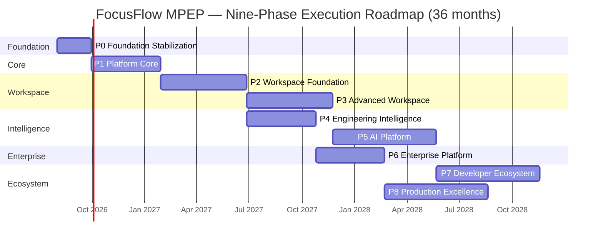

### 3.4 Phase Detail (execution view)

**P0 — Foundation Stabilization (≈ 8 sprints of 1 week, or 4 of 2 weeks).** Commit all docs to `/docs/`; stand up CI (lint/type/unit/build); establish environments and feature flags; add structured logging and metrics; baseline coverage on critical paths. *Exit:* Gate 0 (IRM Ch. 6.1). *Deliverables:* E1.

**P1 — Platform Core (≈ 12–16 sprints).** Identity & workspace RBAC; tenancy/isolation; job queue (BullMQ/Redis); notification service; storage abstraction; search-index foundations. *Exit:* Gate 1 — workspace API live behind flags. *Deliverables:* E2, E3, E4.

**P2 — Workspace Foundation (≈ 14–16 sprints).** Persisted workspaces, teams, members/roles, projects, sprints/board, realtime presence, generalized offline sync; retire the mock seed. *Exit:* Gate 2 — a real multi-user workspace with realtime. *Deliverables:* E5–E10.

**P3 — Advanced Workspace (≈ 12–14 sprints).** Knowledge base, mission control, server-backed notifications, global search, workspace admin. *Exit:* Gate 3. *Deliverables:* E11–E14.

**P4 — Engineering Intelligence (≈ 10–12 sprints).** Team analytics, dashboards, reports, scheduled export via the doc engine. *Exit:* Gate 4. *Deliverables:* E15, E16.

**P5 — AI Platform (≈ 14–16 sprints).** AI gateway, auto-standups, digests, insights, AI-assisted worklogs — audited, metered, behind flags. *Exit:* Gate 5. *Deliverables:* E17.

**P6 — Enterprise Platform (≈ 10–12 sprints).** SSO/SAML/OIDC, audit trail, enterprise admin, compliance/DSR tooling. *Exit:* Gate 6. *Deliverables:* E18.

**P7 — Developer Ecosystem (≈ 14–16 sprints).** Public API v1, webhooks, SDK, plugins/integrations; PWA, mobile, desktop surfaces with offline-first. *Exit:* Gate 7. *Deliverables:* E19, E20.

**P8 — Production Excellence (≈ 12–14 sprints).** SLO attainment, load/capacity hardening, cost management, compliance close-out, runbook drills, exit-criteria excellence. *Exit:* Gate 8 and the MPEP success definition (Ch 1.5). *Deliverables:* E21.

### 3.5 Phase Interlock

Phases interlock through **hard dependencies** (P0→P1→P2→P3; P3→P5; P2→P4; P4→P6; P6→P8) and **soft dependencies** (Ch 7.4, IRM Ch. 7.2). A phase may begin non-blocked workstreams in parallel once its predecessor's gate is green and contracts are stable (Chapter 8, 12).

---

## 4. Epic Breakdown

### 4.1 Epic Model

The roadmap is decomposed into **21 epics** (E1–E21). Each epic is a coherent, vertically-shippable body of work with a business objective, a technical objective, dependencies, required documents/architecture, a testing and deployment strategy, Definition of Ready (DoR), Definition of Done (DoD), exit criteria, success metrics, and future expansion — per the Execution Rules.

Every epic is delivered over a **suggested sprint count** through features (Chapter 5) and tasks (Chapter 6), and passes its phase's quality gates (Chapter 12).

### 4.2 Epic Matrix

| Epic | Name | Phase | Sprints | Complexity | Business Value | Primary Docs |
|---|---|---|---|---|---|---|
| E1 | Foundation | P0 | 4–8 | L | Enables all delivery speed | ESB, DDG, TQS, IRM |
| E2 | Platform Core | P1 | 6–8 | XL | Multi-tenancy foundation | SAD, BAG, DDD, AIS, IRM |
| E3 | Authentication & Identity | P1 | 4–6 | M | Secure access | PRD, AIS, BAG, WPS |
| E4 | Personal Workspace | P1 | 4–6 | M | Core MVP continuity | PRD, UXS, FAG |
| E5 | Workspace Foundation | P2 | 6–8 | XL | The collaborative product | WPS, DDD, AIS, SAD |
| E6 | Teams | P2 | 3–4 | M | Org structure | WPS, DDD |
| E7 | Members & Roles | P2 | 4–5 | H | RBAC enforcement | WPS, DDD, AIS |
| E8 | Projects | P2 | 4–5 | H | Work organization | WPS, DDD, AIS |
| E9 | Sprints & Board | P2 | 4–6 | H | Agile delivery | WPS, UXS, DDD |
| E10 | Realtime & Presence | P2 | 4–5 | H | Live collaboration | SAD, AIS, BAG |
| E11 | Knowledge Base | P3 | 5–6 | H | Persistent team memory | WPS, DDD, AIS, FAG |
| E12 | Mission Control | P3 | 4–5 | H | Team overview & command | WPS, UXS |
| E13 | Notifications | P3 | 3–4 | M | Engagement & follow-through | WPS, AIS, BAG |
| E14 | Search | P3 | 4–5 | H | Find anything fast | WPS, DDD, DDG |
| E15 | Reports | P4 | 4–5 | H | Exportable intelligence | WPS, SAD, FAG |
| E16 | Analytics | P4 | 5–6 | H | Engineering insight | PRD, WPS, UXS |
| E17 | AI Platform | P5 | 8–10 | XXL | Differentiator | PRD, WPS, SAD, BAG, ESB |
| E18 | Enterprise Platform | P6 | 6–8 | XL | Enterprise readiness | PRD, AIS, DDG, ESB |
| E19 | Developer Ecosystem & Plugins | P7 | 6–8 | XL | Platform moat | PRD, AIS, DDG, ESB |
| E20 | Mobile & Desktop | P7 | 6–8 | XL | Every-surface presence | WPS, UXS, SAD, IRM |
| E21 | Production Excellence | P8 | 6–8 | H | Operational trust | DDG, IRM, ESB, TQS |

### 4.3 Epic E1 — Foundation

- **Business Objective:** Give every later phase a fast, safe, observable delivery base.
- **Technical Objective:** CI/CD baseline, environments, feature flags, lint, structured logging/metrics, versioned docs, baseline test coverage.
- **Dependencies:** None (starts the roadmap). **Risks:** R7 (observability gap), R11 (tooling sprawl).
- **Estimated Complexity:** Low. **Suggested Sprint Count:** 4–8.
- **Required Documents:** ESB Ch. 3–7, 14, 17; DDG Ch. 3, 5, 8, 9, 17; TQS Ch. 15; IRM Ch. 6.1.
- **Required Architecture:** SAD §19 deployment posture; DDG environment model.
- **Testing Strategy:** establish unit floor on critical paths; CI gates. **Deployment Strategy:** first staged environments; manual→automated promotion.
- **Definition of Ready:** docs committed; toolchain choices agreed.
- **Definition of Done:** CI green on every PR; flags live; logs/metrics flowing in staging; coverage ≥ 60% critical paths.
- **Exit Criteria (Gate 0):** IRM Ch. 6.1 exit criteria met. **Success Metrics:** CI pass rate ≥ 98%; docs tracked. **Future Expansion:** foundation is reused by every later epic.

### 4.4 Epic E2 — Platform Core

- **Business Objective:** Make multi-tenancy, identity, and async work a shared platform asset (Build Once, Reuse Everywhere).
- **Technical Objective:** Identity & RBAC service; tenancy isolation; BullMQ queue; notification bus; object-storage abstraction; search-index foundations.
- **Dependencies:** E1. **Risks:** R5 (migration), R9 (third-party), R12 (over-engineering).
- **Estimated Complexity:** Very High. **Suggested Sprint Count:** 6–8.
- **Required Documents:** SAD (services), BAG Ch. 9–12, DDD (tenancy), AIS, IRM Ch. 6.2, ESB Ch. 9.
- **Required Architecture:** IRM Ch. 11 interim architecture; Core Platform module graph (IRM Ch. 7.3).
- **Testing Strategy:** service + integration + negative authz tests (ESB §15.4). **Deployment Strategy:** feature-flagged, pilot workspace.
- **DoR:** contracts for each service agreed with AIS steward. **DoD:** workspace API live, RBAC enforced, queue processing in staging, storage abstraction used by exports.
- **Exit Criteria (Gate 1):** IRM Ch. 6.2. **Success Metrics:** API availability 99.9% (staging); RBAC coverage ≥ 85%. **Future Expansion:** every later epic consumes E2 services.

### 4.5 Epic E3 — Authentication & Identity

- **Business Objective:** Secure, seamless access for every user.
- **Technical Objective:** JWT lifecycle, session restore (`/auth/me`), workspace-aware identity, role model foundation (Owner/Admin/Manager/Developer/Viewer).
- **Dependencies:** E2 (identity/tenancy). **Risks:** R5 (M-AUTH migration), R6 (security regression).
- **Estimated Complexity:** Medium. **Suggested Sprint Count:** 4–6.
- **Required Documents:** PRD (auth), AIS (auth schema), BAG, WPS (roles), ESB Ch. 12.
- **Required Architecture:** identity service (IRM Ch. 6.2), SAD auth flows.
- **Testing Strategy:** unit + integration + negative authz + contract tests (ESB §15.4). **Deployment Strategy:** flag-gated; M-AUTH migration with rollback.
- **DoR:** auth contracts stable. **DoD:** register/login/me secure and workspace-aware; negative tests green; audit hooks in place.
- **Exit Criteria:** no regressions on existing personal users. **Success Metrics:** auth error rate; SSO-ready seam. **Future Expansion:** E18 (SSO) consumes this epic's identity seam.

### 4.6 Epic E4 — Personal Workspace

- **Business Objective:** Protect and polish the existing MVP while the platform grows beneath it.
- **Technical Objective:** Refactor personal features onto the shared core without behavior change; offline timer continuity; dashboard/UX polish.
- **Dependencies:** E2 (shared core), E3. **Risks:** R5 (regression risk to existing users).
- **Estimated Complexity:** Medium. **Suggested Sprint Count:** 4–6.
- **Required Documents:** PRD, UXS, FAG, IRM Ch. 2/10 (backward compatibility).
- **Required Architecture:** IRM Ch. 11 evolution steps P1.
- **Testing Strategy:** regression suite on personal critical paths (login→timer→worklog). **Deployment Strategy:** additive, flag-gated.
- **DoR:** personal-critical regression suite exists. **DoD:** personal features work identically on shared core; offline queue still replays.
- **Exit Criteria:** zero personal-workspace regressions. **Success Metrics:** personal retention steady. **Future Expansion:** becomes the default workspace inside the collaborative product.

### 4.7 Epic E5 — Workspace Foundation

- **Business Objective:** Ship the collaborative product: real, persisted, multi-user workspaces.
- **Technical Objective:** Workspace entity + CRUD + settings + branding, member/role wiring, retirement of the mock seed (M-MOCK), workspace switching.
- **Dependencies:** E2, E3, E4. **Risks:** R1 (mock-data perception), R5 (M-MOCK), R4 (realtime complexity — shared with E10).
- **Estimated Complexity:** Very High. **Suggested Sprint Count:** 6–8.
- **Required Documents:** WPS (workspace spec), DDD (schema), AIS (contracts), UXS (workspace UI), IRM Ch. 6.3.
- **Required Architecture:** workspace module (IRM Ch. 7.3), tenancy enforcement.
- **Testing Strategy:** end-to-end create→invite→use workspace; tenancy negative tests. **Deployment Strategy:** flag-gated pilot → GA.
- **DoR:** workspace API contract + WPS flows agreed. **DoD:** mock seed removed; workspaces persisted; switching works; roles enforced.
- **Exit Criteria (Gate 2):** IRM Ch. 6.3. **Success Metrics:** workspace creation success, weekly active workspaces. **Future Expansion:** knowledge, intelligence, AI, enterprise all hang off the workspace.

### 4.8 Epic E6 — Teams

- **Business Objective:** Give workspaces organizational structure.
- **Technical Objective:** Team entities, membership, team-level settings, team→project association.
- **Dependencies:** E5. **Risks:** R3 (scope creep). **Complexity:** Medium. **Sprints:** 3–4.
- **Required Documents:** WPS, DDD (Team model), AIS. **Architecture:** workspace module extension.
- **Testing Strategy:** team CRUD + membership + scoping tests. **Deployment:** flag-gated.
- **DoR:** team model contract agreed. **DoD:** teams persisted, RBAC-scoped, associated to projects.
- **Exit Criteria:** team flows complete. **Success Metrics:** teams/workspace. **Future Expansion:** team-level analytics (E16).

### 4.9 Epic E7 — Members & Roles

- **Business Objective:** Trustworthy, enforceable access inside workspaces.
- **Technical Objective:** Invite flow, membership lifecycle, role definitions, permission middleware, audit hooks.
- **Dependencies:** E5, E6. **Risks:** R6 (privilege escalation). **Complexity:** High. **Sprints:** 4–5.
- **Required Documents:** WPS (roles), AIS, ESB Ch. 12, DDG Ch. 15.
- **Architecture:** RBAC middleware in the identity/workspace boundary (IRM Ch. 6.2).
- **Testing Strategy:** negative authz matrix (role × action × resource). **Deployment:** flag-gated.
- **DoR:** role/permission matrix signed off. **DoD:** every workspace action enforced; negative tests green; audit records present.
- **Exit Criteria:** permission matrix fully enforced. **Success Metrics:** authz negative-test pass; zero privilege-escalation incidents. **Future Expansion:** enterprise role policies (E18).

### 4.10 Epic E8 — Projects

- **Business Objective:** Organize work into bounded, trackable projects.
- **Technical Objective:** Project CRUD, milestones, membership, repository links, status lifecycle.
- **Dependencies:** E5, E6. **Risks:** R3. **Complexity:** High. **Sprints:** 4–5.
- **Required Documents:** WPS, DDD (Project model), AIS, UXS.
- **Architecture:** projects module (IRM Ch. 7.3).
- **Testing Strategy:** project lifecycle + permission tests. **Deployment:** flag-gated.
- **DoR:** project model + lifecycle agreed. **DoD:** projects persisted, scoped, milestone-aware.
- **Exit Criteria:** project flows complete. **Success Metrics:** projects/workspace. **Future Expansion:** analytics/reports/AI consume project data.

### 4.11 Epic E9 — Sprints & Board

- **Business Objective:** Deliver the agile surface: sprint planning and kanban/board.
- **Technical Objective:** Sprint entities, board, backlog, drag-drop, status workflow, story points, sprint reports.
- **Dependencies:** E8. **Risks:** R4 (realtime coupling). **Complexity:** High. **Sprints:** 4–6.
- **Required Documents:** WPS, UXS (board), DDD (sprint schema), AIS.
- **Architecture:** realtime events (E10), CQRS-ish reads.
- **Testing Strategy:** board interactions e2e; workflow state tests. **Deployment:** flag-gated.
- **DoR:** board UX + sprint schema agreed. **DoD:** sprint lifecycle and board interactions live and realtime-synced.
- **Exit Criteria:** board usable end-to-end. **Success Metrics:** board task interactions p95 < 2s. **Future Expansion:** AI sprint insights (E17).

### 4.12 Epic E10 — Realtime & Presence

- **Business Objective:** Make collaboration feel live.
- **Technical Objective:** Socket.IO gateway, channel authorization, presence, live updates, reconnect/replay.
- **Dependencies:** E5 (workspaces). **Risks:** R4. **Complexity:** High. **Sprints:** 4–5.
- **Required Documents:** SAD (realtime), AIS (realtime contracts), BAG Ch. 9.11, DDG Ch. 9.
- **Architecture:** realtime gateway (IRM Ch. 7.3, 11).
- **Testing Strategy:** connection/auth/replay integration tests; delivery SLO tests. **Deployment:** canary.
- **DoR:** realtime contract + channel model agreed. **DoD:** presence live; events authorized per channel; replay reconciles.
- **Exit Criteria:** realtime p95 < 1s delivery. **Success Metrics:** event delivery p95 < 1s. **Future Expansion:** notifications, dashboards, mobile push all reuse it.

### 4.13 Epic E11 — Knowledge Base

- **Business Objective:** Persistent, searchable team memory.
- **Technical Objective:** Knowledge docs CRUD, roles, rich text, version history, search indexing, doc-engine export.
- **Dependencies:** E5, E10, E14 (search). **Risks:** R3, R6 (XSS). **Complexity:** High. **Sprints:** 5–6.
- **Required Documents:** WPS, DDD (knowledge schema), AIS, ESB Ch. 14/12 (rich text).
- **Architecture:** knowledge module + search projection (IRM Ch. 7.3).
- **Testing Strategy:** CRUD + RBAC + sanitization + search integration. **Deployment:** flag-gated.
- **DoR:** knowledge data model agreed. **DoD:** docs create/read/search/edit with roles; sanitization verified.
- **Exit Criteria:** knowledge usable. **Success Metrics:** docs/workspace, search p95 < 500ms. **Future Expansion:** AI summarization (E17).

### 4.14 Epic E12 — Mission Control

- **Business Objective:** One screen where a team/lead sees everything that matters.
- **Technical Objective:** Workspace overview dashboard: activity, focus, blockers, sprint health, recent work, leaderboard.
- **Dependencies:** E5–E10, E16 (analytics data). **Risks:** R3, R8 (dashboard performance). **Complexity:** High. **Sprints:** 4–5.
- **Required Documents:** WPS, UXS, DSS/DTS.
- **Architecture:** read-model aggregation (IRM Ch. 11, DDG Ch. 14).
- **Testing Strategy:** dashboard e2e + performance budget. **Deployment:** flag-gated.
- **DoR:** mission-control wireframe approved. **DoD:** dashboard aggregates live data; load p95 < 2s.
- **Exit Criteria:** mission control operational. **Success Metrics:** dashboard load p95 < 2s. **Future Expansion:** AI standup digest surfaces here (E17).

### 4.15 Epic E13 — Notifications

- **Business Objective:** Keep people informed and follow-through high.
- **Technical Objective:** Notification service (queue-driven), read-state, preferences, in-app center, realtime delivery.
- **Dependencies:** E2 (queue/bus), E10 (realtime). **Risks:** R9. **Complexity:** Medium. **Sprints:** 3–4.
- **Required Documents:** WPS, AIS, BAG Ch. 9.10.
- **Architecture:** notification bus (IRM Ch. 6.2).
- **Testing Strategy:** delivery + idempotency + preference tests. **Deployment:** flag-gated.
- **DoR:** notification taxonomy agreed. **DoD:** notifications persisted, delivered, preferences honored.
- **Exit Criteria:** notification delivery ≥ 99% in 60s. **Success Metrics:** delivery SLI. **Future Expansion:** push on mobile (E20).

### 4.16 Epic E14 — Search

- **Business Objective:** Find any task, worklog, doc, or person instantly.
- **Technical Objective:** Global search index, cross-entity results, filters, tenancy-scoped, typeahead.
- **Dependencies:** E2 (index foundations), E5. **Risks:** R9, R8. **Complexity:** High. **Sprints:** 4–5.
- **Required Documents:** WPS, DDD (projections), DDG Ch. 14, AIS.
- **Architecture:** search index + event-sourced projections (IRM Ch. 6.2 G28).
- **Testing Strategy:** relevance + tenancy isolation + projection lag tests. **Deployment:** dual-write (M-SEARCH).
- **DoR:** search contract + projection model agreed. **DoD:** global search works with index; projection lag < 5s.
- **Exit Criteria:** search p95 < 500ms. **Success Metrics:** search p95; zero cross-tenant leaks. **Future Expansion:** AI retrieval (E17).

### 4.17 Epic E15 — Reports

- **Business Objective:** Turn work data into shareable, exportable intelligence.
- **Technical Objective:** Report definitions, team reports, scheduled exports (queue), DOCX/PDF via generalized doc engine.
- **Dependencies:** E5, E2 (queue). **Risks:** R3, R8. **Complexity:** High. **Sprints:** 4–5.
- **Required Documents:** WPS, SAD (doc engine), FAG, IRM G26.
- **Architecture:** reports service + doc-engine generalization (IRM Ch. 6.5).
- **Testing Strategy:** export render tests (DOCX/PDF), scheduled delivery tests. **Deployment:** flag-gated.
- **DoR:** report taxonomy agreed. **DoD:** user-configurable reports; scheduled exports delivered on time.
- **Exit Criteria:** report on-time delivery ≥ 99%. **Success Metrics:** export fidelity. **Future Expansion:** enterprise report packs (E18).

### 4.18 Epic E16 — Analytics

- **Business Objective:** Give teams and leads engineering insight from real data.
- **Technical Objective:** Team analytics service, velocity, focus-time aggregation, dashboards, leaderboards, chart components.
- **Dependencies:** E5–E9, E14. **Risks:** R8, R3. **Complexity:** High. **Sprints:** 5–6.
- **Required Documents:** PRD, WPS, UXS, DSS/DTS.
- **Architecture:** analytics read-model (IRM Ch. 6.5).
- **Testing Strategy:** aggregation correctness + dashboard perf + a11y charts. **Deployment:** flag-gated.
- **DoR:** analytics KPIs agreed with product. **DoD:** dashboards correct and live; charts accessible (ESB §14.7).
- **Exit Criteria:** dashboard p95 < 2s. **Success Metrics:** KPI accuracy. **Future Expansion:** AI insights feed (E17).

### 4.19 Epic E17 — AI Platform

- **Business Objective:** The differentiator: ambient engineering intelligence.
- **Technical Objective:** AI gateway (provider abstraction, prompt registry, token metering, audit), auto-standups, digests, insights, AI-assisted worklogs.
- **Dependencies:** E3 (identity/audit), E13 (delivery), E16 (data), E2 (queue). **Risks:** R3 (scope), R9, R14 (AI risk). **Complexity:** Extra High. **Sprints:** 8–10.
- **Required Documents:** PRD, WPS (AI), SAD, BAG, ESB Ch. 12.9/20, IRM Ch. 6.6.
- **Architecture:** AI gateway service (IRM Ch. 6.6), queue-backed jobs.
- **Testing Strategy:** accuracy evals, injection tests, token-budget tests, audit tests. **Deployment:** feature-flagged with kill-switch.
- **DoR:** AI scope + evaluation set approved. **DoD:** features live behind flags; outputs stored/auditable; cost-capped.
- **Exit Criteria (Gate 5):** auto-standup accuracy ≥ 90% on pilot. **Success Metrics:** accuracy, token cost/user. **Future Expansion:** marketplace AI plugins (E19).

### 4.20 Epic E18 — Enterprise Platform

- **Business Objective:** Make FocusFlow enterprise-buyable.
- **Technical Objective:** SSO (OIDC/SAML), audit trail, enterprise admin console, tenant controls, compliance/DSR tooling, retention.
- **Dependencies:** E3 (identity), E5 (tenancy), E13. **Risks:** R10 (compliance), R6. **Complexity:** Very High. **Sprints:** 6–8.
- **Required Documents:** PRD, AIS, DDG Ch. 19–20, ESB Ch. 12/21.
- **Architecture:** SSO/audit services (IRM Ch. 6.7), DDG compliance posture.
- **Testing Strategy:** SSO flows, audit-integrity tests, DSR drills. **Deployment:** per-tenant rollout.
- **DoR:** enterprise requirements + compliance checklist agreed. **DoD:** SSO works for pilot tenant; 100% privileged-action audit capture; DSR operable.
- **Exit Criteria (Gate 6):** IRM Ch. 6.7. **Success Metrics:** SSO setup < 15 min. **Future Expansion:** compliance packs, regional data residency.

### 4.21 Epic E19 — Developer Ecosystem & Plugins

- **Business Objective:** Build the platform moat: open API, integrations, plugins.
- **Technical Objective:** Public REST+realtime API v1, webhooks (signed/retried), SDK, plugin runtime, partner integrations.
- **Dependencies:** E2, E5, E18. **Risks:** R9, R13 (API design). **Complexity:** Very High. **Sprints:** 6–8.
- **Required Documents:** AIS, DDG Ch. 17, ESB Ch. 12.8, IRM Ch. 6.9.
- **Architecture:** public API gateway + webhook delivery (IRM Ch. 11 target).
- **Testing Strategy:** API contract tests, webhook delivery/retry tests, plugin security tests. **Deployment:** version-pinned public launch.
- **DoR:** public API contract + security review approved. **DoD:** API docs live; webhook delivery ≥ 99.9%; ≥ 3 integrations.
- **Exit Criteria (Gate 7):** IRM Ch. 6.9. **Success Metrics:** API availability 99.9%. **Future Expansion:** marketplace.

### 4.22 Epic E20 — Mobile & Desktop

- **Business Objective:** Every-surface presence for the DevOS.
- **Technical Objective:** PWA (installable/offline), mobile apps (iOS/Android), desktop client, offline-first sync engine, cross-device consistency.
- **Dependencies:** E5, E14, E17 (API). **Risks:** R4, R5 (M-OFFLINE), R8 (sync conflicts). **Complexity:** Very High. **Sprints:** 6–8.
- **Required Documents:** WPS, UXS, SAD, IRM Ch. 6.8, ESB Ch. 14 (a11y).
- **Architecture:** client-agnostic API; sync engine (IRM M-OFFLINE).
- **Testing Strategy:** offline→sync→reconcile tests; store-review checklists; device matrix. **Deployment:** store/controlled rollout.
- **DoR:** sync contract agreed; device matrix defined. **DoD:** PWA installable offline; mobile apps pass store review; desktop parity.
- **Exit Criteria (Gate 7):** IRM Ch. 6.8. **Success Metrics:** crash-free sessions ≥ 99.5%. **Future Expansion:** native OS integrations.

### 4.23 Epic E21 — Production Excellence

- **Business Objective:** Earn operational trust and sustain it.
- **Technical Objective:** SLO attainment, load/capacity hardening, cost management, compliance close-out, runbook drills, operational dashboards, incident program.
- **Dependencies:** all prior epics. **Risks:** R7, R11. **Complexity:** High. **Sprints:** 6–8.
- **Required Documents:** DDG (SLOs, runbooks, cost, governance), IRM Ch. 14, ESB Ch. 17.
- **Architecture:** DDG five-phase infrastructure arc (DDG Ch. 21).
- **Testing Strategy:** chaos/load drills; SLO burn-rate drills; DR rehearsal. **Deployment:** full pipeline, automated.
- **DoR:** SLO targets + runbook inventory current. **DoD:** SLO attainment; runbook drills pass; cost budgets met.
- **Exit Criteria (Gate 8):** MPEP success definition (Ch 1.5). **Success Metrics:** MTTR, SLO attainment, error budget. **Future Expansion:** multi-region (DDG Phase 3+).

---

*Continue to Chapters 5–6 in the next section.*

## 5. Feature Breakdown

### 5.1 Feature Model

Every epic is delivered as **features** — user- and system-visible increments. Each feature carries: **dependencies, acceptance criteria, Definition of Done, required documents, testing requirements, and deployment requirements**. Features are delivered as vertical slices (ESB §6, IRM Ch. 13): one slice = UI + API + persistence + tests complete.

The Feature Matrix (§5.2) enumerates the feature groups per epic. A representative feature definition set (§5.3) shows the full feature template applied to the highest-value epics; every other feature is defined with the same template at the point of sprint planning (Chapter 9, Definition of Ready).

### 5.2 Feature Matrix

| Epic | Feature Group | Key Features | Depends On |
|---|---|---|---|
| E1 Foundation | Delivery Base | CI pipeline, environments, flags, lint, logging/metrics, doc versioning, coverage baseline | — |
| E2 Platform Core | Shared Services | Identity service, tenancy, job queue, notification bus, storage, search index | E1 |
| E3 Auth & Identity | Identity | Register/login/me, token lifecycle, workspace-aware identity, role foundations | E2 |
| E4 Personal Workspace | Continuity | Core features on shared core, offline timer continuity, dashboard polish | E2, E3 |
| E5 Workspace Foundation | Workspace | Creation, settings, branding, switching, overview, analytics entry | E2, E3, E4 |
| E6 Teams | Teams | Team CRUD, membership, team settings, team-project association | E5 |
| E7 Members & Roles | Access | Invites, roles, permission middleware, member lifecycle, audit hooks | E5, E6 |
| E8 Projects | Projects | Project CRUD, milestones, members, repository links, status | E5, E6 |
| E9 Sprints & Board | Agile | Sprint CRUD, backlog, board, drag-drop, workflow, points, sprint reports | E8, E10 |
| E10 Realtime & Presence | Live | Gateway, channels, presence, live updates, reconnect/replay | E5 |
| E11 Knowledge Base | Docs | Doc CRUD, roles, rich text, history, search, export | E5, E10, E14 |
| E12 Mission Control | Overview | Activity feed, focus status, blockers, sprint health, leaderboard | E5–E10, E16 |
| E13 Notifications | Alerts | Taxonomy, service, preferences, center, realtime delivery | E2, E10 |
| E14 Search | Find | Index, global search, filters, typeahead, tenancy-scoped | E2, E5 |
| E15 Reports | Export | Report definitions, team reports, scheduled export, DOCX/PDF | E5, E2 |
| E16 Analytics | Insight | Team analytics, velocity, focus aggregation, dashboards, leaderboards | E5–E9, E14 |
| E17 AI Platform | Intelligence | Gateway, auto-standups, digests, insights, AI-assisted worklogs | E3, E13, E16, E2 |
| E18 Enterprise | Governance | SSO, audit, admin console, tenant controls, compliance/DSR | E3, E5, E13 |
| E19 Ecosystem | Open | Public API, webhooks, SDK, plugin runtime, integrations | E2, E5, E18 |
| E20 Surfaces | Reach | PWA, mobile, desktop, offline sync, cross-device | E5, E14, E17 |
| E21 Excellence | Operate | SLOs, load hardening, cost, compliance close-out, drills | All |

### 5.3 Feature Definitions (representative, full template)

The following definitions apply the full feature template. Remaining features are decomposed with this identical template at sprint planning (Chapter 9) and are listed with their mapping in the Feature Matrix and Documentation Matrix (Chapter 13).

#### F-E5.1 Workspace Creation (E5)
- **Dependencies:** E2 identity/tenancy; E3 auth.
- **Acceptance Criteria:** an authenticated user can create a workspace (name, type, icon, description, settings), receives owner role automatically, and is redirected into it; duplicate-name conflicts are handled; M-MOCK import path migrates seeded data.
- **Definition of Done:** workspace persisted with tenancy; owner role assigned; e2e test green; negative authz test green; doc checkpoint honored (WPS).
- **Required Documents:** WPS (workspace spec), DDD (Workspace schema), AIS (create-workspace contract), UXS (creation UI).
- **Testing Requirements:** unit (service), integration (persistence+tenancy), e2e (create→enter), negative (non-member denied).
- **Deployment Requirements:** flag-gated (P2 pilot), migration M-MOCK ready.

#### F-E5.2 Workspace Switching (E5)
- **Acceptance Criteria:** a user with membership in multiple workspaces can switch context; per-workspace state is isolated; the personal workspace remains accessible.
- **Definition of Done:** switching updates scoped state and routing; tenancy scoping verified in all downstream reads.
- **Required Documents:** UXS, AIS, WPS.
- **Testing:** integration (scope isolation), e2e (switch + data isolation). **Deployment:** flag-gated.

#### F-E7.1 Role Model & Permission Enforcement (E7)
- **Acceptance Criteria:** Owner/Admin/Manager/Developer/Viewer roles exist; every workspace action maps to a permission; enforcement is server-side; a lower-role user is denied privileged actions.
- **Definition of Done:** permission matrix implemented and tested (negative matrix); audit hooks on privileged actions.
- **Required Documents:** WPS (roles), AIS, ESB Ch. 12. **Testing:** negative authz matrix. **Deployment:** flag-gated.

#### F-E9.1 Sprint & Board (E9)
- **Acceptance Criteria:** create/plan/close sprints; backlog and board; drag-drop updates status via realtime; story points aggregate; sprint report generates.
- **Definition of Done:** board fully realtime-synced; workflow states validated; sprint report exportable.
- **Required Documents:** WPS, UXS (board), DDD (sprint), AIS. **Testing:** board e2e + realtime integration + perf budget. **Deployment:** flag-gated.

#### F-E11.1 Knowledge Document CRUD (E11)
- **Acceptance Criteria:** create/read/update/delete docs with roles; rich text editing with sanitization; version history; searchable; exportable.
- **Definition of Done:** RBAC enforced; sanitization verified (ESB §12.4); search index updated.
- **Required Documents:** WPS, DDD, AIS, ESB Ch. 14. **Testing:** CRUD + RBAC + sanitization + search. **Deployment:** flag-gated.

#### F-E12.1 Mission Control Dashboard (E12)
- **Acceptance Criteria:** aggregates activity, focus status, blockers, sprint health, leaderboard; updates in realtime; accessible charts.
- **Definition of Done:** dashboard p95 < 2s; a11y chart alternatives present.
- **Required Documents:** WPS, UXS, DSS/DTS. **Testing:** perf budget + e2e + a11y scan. **Deployment:** flag-gated.

#### F-E17.1 Auto-Standup Generation (E17)
- **Acceptance Criteria:** generates standup summaries from worklogs per project; user can edit/correct; accuracy measured; audit trail records AI output.
- **Definition of Done:** accuracy ≥ 90% on pilot eval; token cost capped; output stored and auditable.
- **Required Documents:** PRD, WPS (AI), ESB Ch. 20. **Testing:** eval set, injection tests, audit tests. **Deployment:** flag-gated with kill-switch.

#### F-E18.1 SSO Login (E18)
- **Acceptance Criteria:** enterprise user logs in via OIDC/SAML; identity mapped to workspace membership; session lifecycle consistent with native auth.
- **Definition of Done:** SSO flows pass contract tests; audit captures login events; setup < 15 min for pilot tenant.
- **Required Documents:** PRD, AIS, DDG Ch. 20, ESB Ch. 12. **Testing:** SSO contract + negative + audit. **Deployment:** per-tenant rollout.

#### F-E20.1 Offline-First Sync (E20)
- **Acceptance Criteria:** task/worklog mutations made offline queue and reconcile on reconnect; conflicts resolve automatically or are surfaced; no data loss.
- **Definition of Done:** sync reconcile < 1s; conflict auto-resolve ≥ 99%; offline e2e green.
- **Required Documents:** SAD, IRM M-OFFLINE, ESB §18.6. **Testing:** offline→sync→reconcile suite. **Deployment:** staged per surface.

### 5.4 Complete Feature Definition Register

Every feature group in §5.2 is defined below with the full template — **dependencies, acceptance criteria, Definition of Done, required documents, testing, and deployment**. Definitions are compact but complete; sprint planning (Chapter 9) expands acceptance criteria into tasks (Chapter 6) without changing any contract below.

#### F-E1.x Delivery Base (E1)
- **Dependencies:** none (foundation).
- **Acceptance Criteria:** CI runs on every PR; environments (dev/staging/prod) exist; feature-flag mechanism works in all envs; lint/format enforce; structured logging and metrics flow; coverage baseline reported.
- **Definition of Done:** Gate 0 passed; every PR gated; flags toggleable in prod; logs visible in observability tooling.
- **Required Documents:** DDG Ch. 5–17, ESB Ch. 14–17. **Testing:** CI self-test, flag e2e. **Deployment:** all environments.

#### F-E2.x Shared Platform Core (E2)
- **Acceptance Criteria:** identity service exists; tenancy enforced at data layer; job queue processes jobs with retries; notification bus delivers; storage abstraction handles exports; search index update pipeline works.
- **Definition of Done:** tenancy isolation tests green; queue retry policy verified; abstraction adapter-tested.
- **Required Documents:** BAG Ch. 9, DDD, SAD, AIS. **Testing:** isolation, queue, adapter. **Deployment:** flag-gated.

#### F-E3.x Identity & Auth (E3)
- **Acceptance Criteria:** register/login/me; token lifecycle (issue/refresh/revoke); workspace-aware identity; role foundations.
- **Definition of Done:** token lifecycle tested; session restore secure; role foundations in schema.
- **Required Documents:** AIS, BAG, WPS, ESB Ch. 12. **Testing:** auth e2e, token, negative. **Deployment:** flag-gated.

#### F-E4.x Personal Workspace Continuity (E4)
- **Acceptance Criteria:** all personal features run on shared core; offline timer continuity; dashboard polish.
- **Definition of Done:** zero regressions on personal suite; offline timer queue reconciles.
- **Required Documents:** IRM Ch. 11, ESB §9. **Testing:** regression suite. **Deployment:** staged.

#### F-E5.3 Workspace Settings & Branding (E5)
- **Acceptance Criteria:** workspace settings persist (name, type, icon, branding, locale); branding applies to surfaces.
- **Definition of Done:** settings persist; branding rendered; tenancy-scoped.
- **Required Documents:** WPS, UXS, DDD. **Testing:** integration, e2e. **Deployment:** flag-gated.

#### F-E5.4 Workspace Overview & Analytics Entry (E5)
- **Acceptance Criteria:** overview shows workspace health summary; analytics entry point navigates to E16.
- **Definition of Done:** overview loads p95 < 2s; navigation correct.
- **Required Documents:** WPS, UXS. **Testing:** e2e, perf budget. **Deployment:** flag-gated.

#### F-E6.1 Teams (E6)
- **Acceptance Criteria:** create/read/update/delete teams; membership; team settings; team-project association.
- **Definition of Done:** team CRUD green; association tenancy-scoped.
- **Required Documents:** WPS, DDD, AIS. **Testing:** integration, e2e. **Deployment:** flag-gated.

#### F-E7.2 Invites & Member Lifecycle (E7)
- **Acceptance Criteria:** invite flow (email/link); accept/decline; role assignment; member removal/suspension.
- **Definition of Done:** invite e2e; lifecycle state transitions tested.
- **Required Documents:** WPS, AIS, ESB Ch. 12. **Testing:** integration, negative. **Deployment:** flag-gated.

#### F-E8.1 Projects (E8)
- **Acceptance Criteria:** project CRUD; milestones; members; repository links; status.
- **Definition of Done:** project lifecycle e2e; milestone tracking works.
- **Required Documents:** WPS, DDD, AIS. **Testing:** e2e, integration. **Deployment:** flag-gated.

#### F-E9.2 Sprint Reports (E9)
- **Acceptance Criteria:** sprint report (burndown, points, done/remaining) generates and exports.
- **Definition of Done:** report accuracy verified; export works.
- **Required Documents:** WPS, UXS, DDD. **Testing:** correctness, export. **Deployment:** flag-gated.

#### F-E10.1 Realtime Gateway & Presence (E10)
- **Acceptance Criteria:** gateway connects clients; channels scope by workspace/project; presence shows online status; live updates push; reconnect/replay works.
- **Definition of Done:** delivery p95 < 1s; presence accurate; reconnect no data loss.
- **Required Documents:** SAD, AIS. **Testing:** realtime, reconnect, load. **Deployment:** flag-gated.

#### F-E11.2 Knowledge Roles, History, Search, Export (E11)
- **Acceptance Criteria:** doc roles enforced; version history; searchable; exportable.
- **Definition of Done:** RBAC enforced; sanitization verified; history immutable.
- **Required Documents:** WPS, DDD, AIS, ESB Ch. 14. **Testing:** RBAC, history, search. **Deployment:** flag-gated.

#### F-E12.2 Focus Status & Blockers (E12)
- **Acceptance Criteria:** focus status (deep/blocked/away); blockers surface with owners.
- **Definition of Done:** status realtime; blockers actionable.
- **Required Documents:** WPS, UXS. **Testing:** e2e, realtime. **Deployment:** flag-gated.

#### F-E13.1 Notifications (E13)
- **Acceptance Criteria:** taxonomy of notifications; service enqueues; preferences per user; center UI; realtime delivery.
- **Definition of Done:** ≥ 99% delivered in 60s; preferences honored.
- **Required Documents:** BAG Ch. 9.10, WPS, AIS. **Testing:** delivery, preferences, realtime. **Deployment:** flag-gated.

#### F-E14.1 Global Search (E14)
- **Acceptance Criteria:** index; global search; filters; typeahead; tenancy-scoped results.
- **Definition of Done:** index lag < 5s; results tenancy-scoped; typeahead p95 < 300ms.
- **Required Documents:** DDD, DDG Ch. 14, SAD. **Testing:** lag, scope, perf. **Deployment:** flag-gated.

#### F-E15.1 Report Definitions & Scheduled Export (E15)
- **Acceptance Criteria:** report definitions; team reports; scheduled export; DOCX/PDF fidelity.
- **Definition of Done:** definitions persist; scheduled export on time; fidelity verified.
- **Required Documents:** SAD, FAG, DDG. **Testing:** render fidelity, schedule. **Deployment:** flag-gated.

#### F-E16.1 Team Analytics & Dashboards (E16)
- **Acceptance Criteria:** team analytics; velocity; focus aggregation; dashboards; leaderboards.
- **Definition of Done:** KPI accuracy; dashboards a11y-compliant; p95 < 2s.
- **Required Documents:** IRM Ch. 6.5, DDD, SAD. **Testing:** correctness, perf, a11y. **Deployment:** flag-gated.

#### F-E17.2 AI Digests & Insights (E17)
- **Acceptance Criteria:** daily/weekly digests; insights from focus data; AI-assisted worklog entry.
- **Definition of Done:** eval ≥ 90%; kill-switch; audit trail.
- **Required Documents:** PRD, WPS (AI), ESB Ch. 20. **Testing:** eval, injection, audit. **Deployment:** flag-gated with kill-switch.

#### F-E18.2 Audit Trail & DSR (E18)
- **Acceptance Criteria:** audit events captured 100%; admin console; DSR export/deletion.
- **Definition of Done:** audit capture verified; DSR e2e green.
- **Required Documents:** ESB Ch. 11.6, WPS, AIS. **Testing:** audit, DSR. **Deployment:** per-tenant.

#### F-E19.1 Public API & Webhooks (E19)
- **Acceptance Criteria:** API gateway with keys; rate limits; contract-first; webhooks with retries.
- **Definition of Done:** API 99.9%; webhook delivery ≥ 99.9%; rate limits enforced.
- **Required Documents:** AIS, DDG Ch. 15, ESB. **Testing:** contract, rate, delivery. **Deployment:** key-gated.

#### F-E19.2 SDK & Plugin Runtime (E19)
- **Acceptance Criteria:** SDK wraps API; plugin runtime sandboxed.
- **Definition of Done:** SDK contract tests; plugin sandbox verified.
- **Required Documents:** AIS, SAD. **Testing:** SDK, sandbox. **Deployment:** staged.

#### F-E20.2 PWA/Mobile/Desktop (E20)
- **Acceptance Criteria:** installable PWA; mobile and desktop surfaces; cross-device sync.
- **Definition of Done:** PWA installable offline; surface matrix passes; sync reconcile.
- **Required Documents:** UXS, SAD, ESB Ch. 14. **Testing:** PWA, device matrix. **Deployment:** staged per surface.

#### F-E21.1 SLOs & Operational Excellence (E21)
- **Acceptance Criteria:** SLO dashboards; burn-rate alerts; load hardening; cost guardrails; compliance close-out; drills.
- **Definition of Done:** budgets met 30 days; drills pass; cost within guardrail.
- **Required Documents:** DDG, ESB Ch. 17. **Testing:** load, burn-rate, drills. **Deployment:** production.

---

## 6. Task Decomposition

### 6.1 Task Model

Each feature decomposes into **engineering tasks**. A task is the smallest owned unit of work with: **purpose, owner role, estimated difficulty, dependencies, architecture references, UX references, testing requirements, and Definition of Done**. Tasks contain **no implementation code** — they specify what must be built and how it is verified.

**Task ID convention:** `E<epic>.<feature>.<n>` (e.g., `E5.1.3`). Task IDs are the stable execution keys used in sprint planning (Chapter 9) and metric tracking (Chapter 15).

### 6.2 Task Matrix (representative)

| Task ID | Purpose | Owner | Difficulty | Dependencies | Docs/Arch | Testing | DoD |
|---|---|---|---|---|---|---|---|
| E1.1.1 | Version docs into `/docs/` | Tech Writer | Easy | — | ESB Ch. 15, IRM G30 | CI doc check | All docs committed |
| E1.2.1 | Stand up CI pipeline | DevOps | Medium | E1.1.1 | DDG Ch. 5, ESB Ch. 14 | CI self-test | Every PR gated |
| E1.3.1 | Add feature-flag mechanism | Platform | Medium | E1.2.1 | DDG Ch. 17 | Flag e2e | Flags in all envs |
| E1.4.1 | Structured logging + metrics | Backend | Medium | E1.2.1 | DDG Ch. 9–11, ESB Ch. 17 | Log assertions | Logs flow in staging |
| E2.1.1 | Workspace data model + tenancy | Backend | Hard | E1.4.1 | DDD, BAG Ch. 9 | Model + isolation | Tenancy enforced |
| E2.2.1 | Job queue setup (BullMQ/Redis) | Backend | Medium | E2.1.1 | BAG Ch. 9.10, SAD | Queue integration | Jobs process in staging |
| E2.3.1 | Storage abstraction | Backend | Medium | E2.1.1 | SAD, DDG Ch. 4 | Adapter tests | Exports use abstraction |
| E3.1.1 | Workspace-aware auth/session | Backend | Medium | E2.1.1 | AIS, BAG | Auth integration | Session restore secure |
| E3.2.1 | Role/permission middleware | Backend | Hard | E3.1.1 | WPS, ESB Ch. 12 | Negative matrix | RBAC enforced |
| E4.1.1 | Personal features on shared core | Full-stack | Hard | E2.x, E3.x | IRM Ch. 11, ESB §9 | Regression suite | Zero regressions |
| E5.1.1 | Workspace CRUD + create flow | Full-stack | Medium | E3.2.1 | WPS, UXS, AIS | e2e | Create flow green |
| E5.2.1 | Retire mock seed (M-MOCK) | Full-stack | Medium | E5.1.1 | IRM App. H | Migration test | Seed removed |
| E7.1.1 | Invite + membership lifecycle | Backend | Medium | E3.2.1 | WPS, AIS | Integration | Invite flow green |
| E8.1.1 | Project CRUD + milestones | Full-stack | Medium | E5.1.1 | WPS, DDD | e2e | Project lifecycle green |
| E9.1.1 | Board + realtime sync | Frontend | Hard | E8.x, E10.x | UXS, SAD | Board e2e | Board live-synced |
| E10.1.1 | Realtime gateway + channels | Backend | Hard | E2.1.1 | SAD, AIS | Realtime tests | Delivery p95 < 1s |
| E11.1.1 | Knowledge doc CRUD + rich text | Full-stack | Hard | E10.x, E14.x | WPS, ESB §14 | Sanitization | Docs searchable |
| E12.1.1 | Mission-control aggregation | Backend | Hard | E16.x | IRM Ch. 11 | Perf budget | Load p95 < 2s |
| E13.1.1 | Notification service | Backend | Medium | E2.2.1 | BAG Ch. 9.10 | Delivery tests | ≥ 99% in 60s |
| E14.1.1 | Search index + projections | Backend | Hard | E2.1.1 | DDD, DDG Ch. 14 | Lag tests | Lag < 5s |
| E15.1.1 | Doc-engine generalization | Backend | Hard | E2.3.1 | SAD, FAG | Render tests | DOCX/PDF fidelity |
| E16.1.1 | Analytics aggregation service | Backend | Hard | E8.x | IRM Ch. 6.5 | Correctness | KPI accuracy |
| E17.1.1 | AI gateway + provider abstraction | Backend | Hard | E2.2.1 | SAD, ESB Ch. 20 | Gateway tests | Metering/audit live |
| E17.2.1 | Auto-standup pipeline | AI/Backend | Hard | E17.1.1 | PRD, WPS | Eval set | Accuracy ≥ 90% |
| E18.1.1 | SSO (OIDC/SAML) integration | Backend | Hard | E3.1.1 | AIS, DDG Ch. 20 | SSO contract | Pilot tenant login |
| E18.2.1 | Audit trail service | Backend | Medium | E2.1.1 | ESB Ch. 11.6 | Audit tests | 100% capture |
| E19.1.1 | Public API gateway + keys | Backend | Hard | E2.x, E18.x | AIS, DDG Ch. 15 | Contract + rate | API 99.9% |
| E19.2.1 | Webhook delivery + retries | Backend | Medium | E19.1.1 | DDG Ch. 17 | Delivery tests | ≥ 99.9% |
| E20.1.1 | Sync engine (offline-first) | Full-stack | Hard | E5.x | SAD, IRM M-OFFLINE | Sync suite | Auto-resolve ≥ 99% |
| E20.2.1 | PWA shell + offline | Frontend | Medium | E20.1.1 | UXS, ESB §14 | PWA tests | Installable offline |
| E21.1.1 | SLO dashboards + alerts | DevOps | Medium | E1.4.1 | DDG Ch. 9 | Burn-rate tests | SLOs measured |
| E21.2.1 | Load/capacity hardening | DevOps | Hard | all | DDG Ch. 14 | Load tests | Budgets met |

### 6.3 Task Decomposition Example — E5 Workspace Foundation (slice of E5.1)

Decomposing feature F-E5.1 (Workspace Creation) into its engineering tasks:

| Task | Purpose | Owner | Difficulty | Deps | Architecture Ref | UX Ref | Testing | DoD |
|---|---|---|---|---|---|---|---|---|
| E5.1.1 | Workspace model + repository (schema, tenancy) | Backend | Medium | E2.1.1 | DDD (Workspace), BAG §9.4 | — | Model + tenancy unit | Persisted, tenant-scoped |
| E5.1.2 | Create-workspace API + validation | Backend | Medium | E5.1.1 | AIS (contract) | — | Contract + validation | Envelope-compliant |
| E5.1.3 | Workspace creation UI (modal/form) | Frontend | Medium | E5.1.2 | FAG, DSS | UXS | Component + e2e | Create flow green |
| E5.1.4 | Owner-role auto-assignment | Backend | Medium | E5.1.2 | WPS (roles), ESB §12 | — | Negative authz | Role enforced |
| E5.1.5 | M-MOCK migration import path | Full-stack | Hard | E5.1.3 | IRM App. H | — | Migration test | Seed data imported |
| E5.1.6 | Workspace settings persistence | Full-stack | Medium | E5.1.3 | WPS, DDD | UXS | Integration | Settings persist |

### 6.4 Task Standards

1. **One purpose per task** — a task is atomic in Definition of Ready (§9.10).
2. **Owners are roles, not names** — tasks map to the Ownership Matrix (Chapter 8) so the plan is headcount-independent.
3. **Difficulty is a planning input** — Easy (≤ 1 day), Medium (2–4), Hard (5–10), Very Hard (10+), calibrated in sprint planning.
4. **Every task references its documents** — no task proceeds without its doc checkpoint (Chapter 13).
5. **Definition of Done is verifiable** — a reviewer can check the box from evidence, not vibes.

---

*Continue to Chapters 7–8 in the next section.*

## 7. Module Dependency Matrix

### 7.1 Purpose

This chapter makes the **ordering** of the plan explicit and machine-checkable: which epics/features block which, what can run in parallel, and what sits on the critical path. It extends the IRM Module Dependency Graph (IRM Ch. 7.3) and the ESB Module Ownership rules (§3.4) into the execution layer.

### 7.2 Epic Dependency Graph

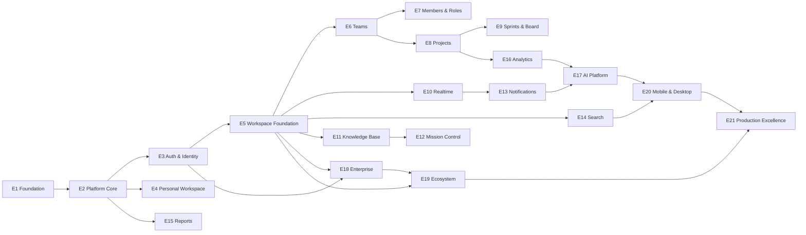

### 7.3 Feature Dependency Graph (workspace cluster)

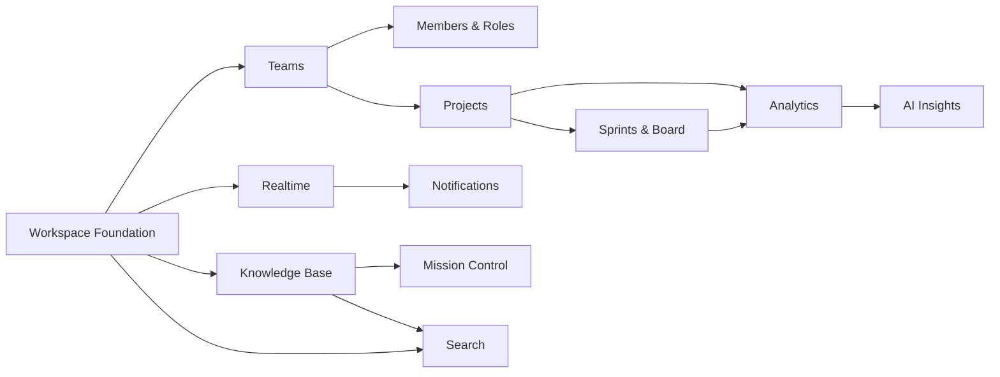

### 7.4 Critical Path

The critical path is the longest dependency chain and is **protected** (IRM Ch. 12): any slip on these items delays the roadmap.

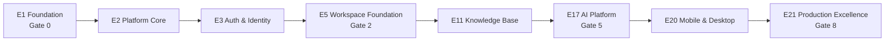

**Parallel tracks (off the critical path):** E4 (Personal Workspace) runs alongside E3; E6/E7/E8/E9/E10 (teams/projects/sprints/realtime) parallelize after E5; E13/E14/E15/E16 run after their soft dependencies; E18/E19 run late but depend on E3/E5.

### 7.5 Dependency Matrix

| Module / Epic | Depends On (hard) | Depends On (soft) | Blocks |
|---|---|---|---|
| E1 Foundation | — | — | everything |
| E2 Platform Core | E1 | — | E3–E21 |
| E3 Auth & Identity | E2 | — | E5, E18, E19 |
| E4 Personal Workspace | E2, E3 | — | none (parallel) |
| E5 Workspace Foundation | E2, E3, E4 | — | E6–E12, E14, E18–E20 |
| E6 Teams | E5 | — | E7, E8 |
| E7 Members & Roles | E5, E6 | — | E18, E19 |
| E8 Projects | E5, E6 | — | E9, E16 |
| E9 Sprints & Board | E8, E10 | — | E12, E16 |
| E10 Realtime & Presence | E5 | — | E9, E11, E13, E16 |
| E11 Knowledge Base | E5, E10, E14 | — | E12, E17 |
| E12 Mission Control | E5–E10, E16 | — | none |
| E13 Notifications | E2, E10 | — | E17, E18 |
| E14 Search | E2, E5 | — | E11, E20 |
| E15 Reports | E2, E5 | — | none |
| E16 Analytics | E5–E9, E14 | — | E12, E17 |
| E17 AI Platform | E3, E13, E16, E2 | E11 | E20, E19 |
| E18 Enterprise | E3, E5, E13 | — | E19, E21 |
| E19 Ecosystem | E2, E5, E18 | — | E21 |
| E20 Mobile & Desktop | E5, E14, E17 | — | E21 |
| E21 Production Excellence | all | — | — |

**Infrastructure dependencies:** every epic after E1 depends on the E1 delivery base (CI, flags, environments, observability). Redis/queue (E2) underpins E13/E15/E17; the search index (E2) underpins E11/E14/E20; object storage (E2) underpins E15/E11 exports; the realtime gateway (E10) underpins E9/E11/E12/E13/E16.

### 7.6 Dependency Governance

- **Contracts before parallel work** — a parallel track starts only when the module it consumes has a stable contract (ESB §7, IRM Ch. 7.2).
- **Feature-flag isolation** — parallel teams ship toggled-off until integration (DDG Ch. 17).
- **Dependency violations** are caught in the Architecture Compliance review (Chapter 12, ESB §21.8) — a module depending on something it must not is a merge blocker.

---

## 8. Team Allocation Strategy

### 8.1 Team Model

The MPEP assumes **multiple teams** but is headcount-independent: teams are **logical squads** that map to one or many people depending on the organization's stage (ESB Ch. 25). A solo developer plays every role; a large organization staffs each team. The Ownership Matrix (§8.4) is role-based so the plan never changes shape as headcount changes.

### 8.2 Parallel Workstreams

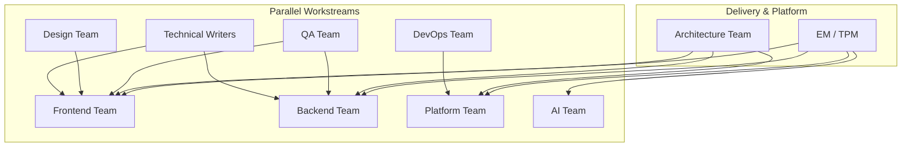

### 8.3 Team Responsibilities

| Team | Responsibilities | Primary Epics |
|---|---|---|
| **Architecture Team** | SAD/DDD/AIS conformance, ADRs/RFCs, ARB, architecture review, compliance | all (horizontal) |
| **Frontend Team** | React/TS SPA, components, state, a11y, design-system compliance, PWA/mobile/desktop surfaces | E4, E9, E11, E12, E16, E20 |
| **Backend Team** | Express services, models, repositories, APIs, validation, RBAC, events, integrations | E2, E3, E5–E8, E13–E15, E18 |
| **Platform Team** | Shared core, queue, realtime, storage, search index, sync engine | E2, E10, E14, E20 |
| **QA Team** | Test strategy execution, e2e, contract/negative tests, gates, a11y/perf verification | all |
| **DevOps Team** | CI/CD, environments, flags, observability, releases, SLOs, runbooks | E1, E21 |
| **Design Team** | UXS/DSS/DTS conformance, interaction design, a11y review | E5, E9, E12, E16, E20 |
| **AI Team** | AI gateway, prompts, evals, metering, AI security | E17 |
| **Technical Writers** | Doc checkpoints, module docs, ADR records, release notes, migration guides, docs audit | all |

### 8.4 Ownership Matrix

| Module / Deliverable | Primary Owner | Reviewer | Approver (Gate) |
|---|---|---|---|
| CI/CD, environments, flags | DevOps | Architecture | Release |
| Identity & RBAC | Backend | Security + Architecture | Merge |
| Job queue / notifications | Backend | Architecture | Merge |
| Realtime & presence | Platform | Backend | Merge |
| Storage / search index | Platform | Architecture | Merge |
| Workspace / teams / members | Backend + Frontend | Backend + Architecture | Merge |
| Projects / sprints / board | Frontend + Backend | UX + Backend | Merge |
| Knowledge base | Full-stack | Backend + Security | Merge |
| Mission control / analytics | Frontend + Backend | UX + Architecture | Merge |
| Reports / doc engine | Backend | Frontend + Architecture | Merge |
| AI gateway & features | AI | Security + Architecture | ARB + Security |
| SSO / audit / enterprise | Backend | Security + Architecture | ARB |
| Public API / webhooks / SDK | Backend | AIS + Architecture | ARB |
| Mobile / desktop / sync | Platform + Frontend | UX + Architecture | ARB |
| SLOs / runbooks / excellence | DevOps | Architecture | Release |
| Documentation / docs audit | Technical Writers | Doc stewards | Phase |

### 8.5 Team Operating Rules

1. **One accountable owner per module** (ESB §3.4) — even when multiple teams touch a module.
2. **Bus-factor ≥ 2 on critical-path modules** by the time they reach production (IRM Ch. 12.4).
3. **Squads own vertical slices, not layers** — a frontend team owns UI *and* its integration tests; a backend team owns service *and* its contract tests.
4. **Capacity is explicit** — sprint capacity per team is planned, not assumed (Chapter 9).
5. **Handoff is minimized** — wherever a feature needs two teams, the owning team owns the integration end-to-end.

---

*Continue to Chapters 9–11 in the next section.*

## 9. Sprint Planning Framework

### 9.1 Cadence

FocusFlow runs **two-week sprints** (IRM Ch. 12.2) with a **monthly (every two sprints) release** to staging and a **quarterly GA milestone** (Chapter 10). Every sprint delivers at least one vertical slice end-to-end; nothing merges that does not pass a Gate (Chapter 12).

### 9.2 Sprint Ceremonies

| Ceremony | Cadence | Duration | Owner | Output |
|---|---|---|---|---|
| Sprint Planning | Sprint start (Mon) | 2–4 h | TPM + team | Sprint goal, sprint backlog |
| Daily Stand-up | Daily | 15 min | Team | Unblocked team |
| Backlog Grooming | Mid-sprint | 1 h | PM/TPM + team | Refined backlog (DoR) |
| Epic Planning | Pre-phase | 4 h | TPM + Architecture | Epic slices, phase plan |
| Release Planning | Every 2 sprints | 2 h | TPM + DevOps + QA | Release scope, date |
| Sprint Review | Sprint end | 1 h | TPM + stakeholders | Demo of done slices |
| Sprint Retrospective | Sprint end | 1 h | Scrum master | Action items |
| Capacity Planning | Pre-sprint | 1 h | TPM + team | Team capacity, focus factor |

### 9.3 Definition of Ready (DoR)

A task/feature is *ready* for a sprint only when all are true:

1. **Clear** — one purpose; unambiguous acceptance criteria.
2. **Sized** — effort estimated; difficulty class assigned (Ch 6.4).
3. **Dependencies known** — all hard dependencies are met or sequenced.
4. **Docs checkpointed** — required documents (Ch 13) are referenced or provided.
5. **Testable** — acceptance criteria are testable; test approach defined.
6. **Gate-compatible** — the slice fits a Gate (Chapter 12) and does not span Gate boundaries illegally.
7. **Owned** — a role owner is assigned.

### 9.4 Definition of Done (DoD)

A task/feature is *done* only when all are true (extends ESB Ch. 15 and IRM Ch. 12.3):

1. **Code** — implementation merged to `main` via PR.
2. **Tests** — unit/integration/e2e required for the slice are green.
3. **Docs** — required document checkpoint updated (Ch 13).
4. **Gate** — applicable quality Gate passed (Chapter 12).
5. **Observability** — logs/metrics/errors captured in the release environments.
6. **Flags** — feature-flag state defined (on/off/percent).
7. **Runbook** — any operational step is documented (DDG Ch. 17).
8. **A11y** — accessibility requirements met (ESB Ch. 14).
9. **Evidence** — evidence is linked in the task (test run, gate sign-off, doc link).

### 9.5 Sprint Flow

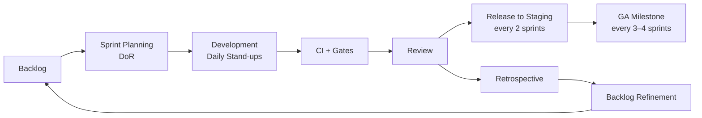

### 9.6 Sprint Structure (2-week example)

| Day | Activity |
|---|---|
| Mon | Sprint planning; capacity; sprint goal |
| Tue–Thu | Development; pair reviews; continuous CI |
| Fri | Stand-up only; no merge freeze unless stated |
| Mon–Thu (wk 2) | Development; feature freezes for release |
| Fri (wk 2) | Review, retrospective, release planning |

### 9.7 Sprint Rules

1. **No change to sprint goal** mid-sprint except by TPM consent (scope creep is a Gate violation).
2. **Every PR passes CI** before merge (ESB Ch. 15.7).
3. **DoD is binary** — a slice is done or not; partial DoD is a defect.
4. **Sprint capacity** is team-specific and reviewed at planning.
5. **Retro action items** are tracked to closure (Chapter 15 tracks their impact).

---

## 10. Milestone Planning

### 10.1 Milestone Model

Milestones are **evidence checkpoints** on the roadmap, not just dates. Each milestone bundles: **deliverables, business outcomes, engineering outcomes, architecture/testing validation, and release criteria** (IRM Ch. 12.4).

### 10.2 Milestone Table

| Milestone | Phase | Focus | Business Outcome | Engineering Outcome | Architecture/Testing Validation | Release Criteria |
|---|---|---|---|---|---|---|
| M-0 | P0 | Foundation | Docs are source of truth; CI green | CI/CD, flags, environments, observability | Gate 0; all 14 docs versioned | Every PR gated; docs tracked |
| M-1 | P1 | Platform Core | Workspace + shared core stable | Tenancy, identity, queue, storage, search | Gate 1; tenancy isolation tests | Workspace created and tenant-scoped |
| M-2 | P2 | Workspace Foundation | First workspace features | Workspace CRUD, switching, analytics entry | Gate 2; feature-flag isolation | Workspaces usable in pilot |
| M-3 | P3 | Teams & Collaboration | Teams can collaborate | Teams, members, roles, projects, sprints, board | Gate 3; RBAC negative matrix | Board live-synced; roles enforced |
| M-4 | P4 | Realtime & Knowledge | Real-time team knowledge | Realtime, presence, knowledge base, search, notifications | Gate 4; realtime perf; sanitization | Knowledge base live; search < 5s lag |
| M-5 | P5 | Analytics & AI | Focus intelligence | Mission control, analytics, AI standups/insights | Gate 5; eval ≥ 90%; kill-switch | AI features flagged, audited |
| M-6 | P6 | Enterprise | Enterprise-ready | SSO, audit, admin console, DSR | Gate 6; SSO contract; audit 100% | Pilot tenant signs off |
| M-7 | P7 | Ecosystem | Ecosystem opens | Public API, webhooks, SDK, plugins | Gate 7; API 99.9%; webhook 99.9% | External developer builds on API |
| M-8 | P8 | Excellence | Production excellence | SLOs met, load hardening, compliance close-out | Gate 8; burn-rate green | GA; budgets met for 30 days |

### 10.3 Business vs Engineering Outcomes

- **Business outcomes** are user-visible and measurable (feature adoption, MAU, pilot sign-offs, reduced time-to-close).
- **Engineering outcomes** are internal and measurable (deploy frequency, defect escape, coverage, latency budgets).
- A milestone is **complete only when both** outcome sets are met — business without engineering evidence is not done (Evidence-Driven Progress, Chapter 15).

### 10.4 Milestone Governance

- Milestones are reviewed at the **Release Board** (Chapter 16) with evidence linked.
- **Milestone slippage** triggers a re-baseline review, not silent date-moving.
- **Cross-phase dependencies** (Chapter 7) are checked at each milestone boundary.

---

## 11. Release Strategy

### 11.1 Release Model

FocusFlow uses **staged releases with feature flags** (IRM Ch. 12.5, DDG Ch. 15): no feature is released by default; every release is reversible; and every release meets its Gate (Chapter 12).

### 11.2 Release Stages

| Stage | Audience | Environment | Duration | Purpose |
|---|---|---|---|---|
| Alpha | Internal team | dev / staging | 2–3 sprints | Smoke, core loops |
| Internal Beta | Dogfooders | staging / canary | 1–2 quarters | Feedback, bugs |
| Closed Beta | Pilot customers | canary + production | 1–2 quarters | Validation, sign-offs |
| Public Beta | Invited users | production (flag) | 2 sprints | Scale test, telemetry |
| Release Candidate (RC) | All flagged | production | 1–2 sprints | Final hardening |
| General Availability (GA) | All | production | ongoing | Feature complete |

After GA: **LTS / Maintenance / Support** releases per the support policy (Chapter 17 growth).

### 11.3 Release Timeline

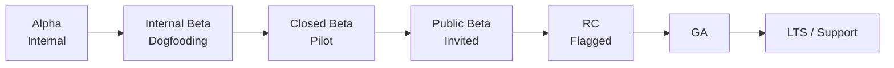

### 11.4 Release Rules

1. **Flags first** — a feature ships dark unless its flag is explicitly raised (DDG Ch. 17).
2. **Rollback first** — every release has a rollback path (database migrations reversible, features flaggable).
3. **Freeze discipline** — no merges to `main` during release windows without DevOps consent.
4. **Release notes** — every GA includes release notes owned by Technical Writers.
5. **Migration discipline** — schema/data migrations are versioned and backward-compatible (IRM Appendix H).

### 11.5 Release Matrix

| Release | Epic(s) | Stage | Gate(s) | Rollback | Notes |
|---|---|---|---|---|---|
| R0 (P0) | E1 | Alpha | Gate 0 | Full revert | Delivery base only |
| R1 (P1) | E2, E3 | Internal Beta | Gate 1 | Tenant revert | Identity + tenancy |
| R2 (P2) | E4, E5 | Closed Beta | Gate 2 | Flag revert | Workspaces pilot |
| R3 (P3) | E6–E10 | Closed Beta | Gate 3 | Flag revert | Collaboration |
| R4 (P4) | E11–E14 | Public Beta | Gate 4 | Flag + data | Knowledge, search |
| R5 (P5) | E12, E16, E17 | Public Beta | Gate 5 | Flag + eval | AI features |
| R6 (P6) | E18 | RC | Gate 6 | SSO revert | Enterprise |
| R7 (P7) | E19 | RC | Gate 7 | API key revoke | Ecosystem |
| R8 (P8) | E20, E21 | GA | Gate 8 | Full rollback | Production excellence |
| R9+ | patches | LTS/Support | Gate 0+ | Patch revert | Maintenance |

### 11.6 Post-Release

- **Post-release review** within 1 week (metrics, defects, incidents).
- **Feature-flag health** reviewed each release.
- **Support tiers** defined (Chapter 17) before first GA.

---

*Continue to Chapters 12–13 in the next section.*

## 12. Quality Gates

### 12.1 Gate Model

Quality Gates are the **mandatory review checkpoints** every slice, feature, epic, and release must pass (IRM Ch. 12.4, ESB Ch. 21). A Gate is a binary pass/fail with **evidence**, not a conversation. Ten gates are defined; they are reviewed in the order shown.

### 12.2 The Ten Mandatory Gates

| Gate | Name | Scope | Evidence Required |
|---|---|---|---|
| G0 | Architecture | Module/feature design conformance to SAD/DDD/AIS; no drift | ARB review record |
| G1 | UX | Interaction/visual conformance to UXS/DSS/DTS; a11y basics | Design review + UX checklist |
| G2 | Design System | Component reuse, token compliance, no re-invention | Design-system audit |
| G3 | Security | Threat model, authz matrix, injection/SAN/SSRF checks, secrets scan | Security review + scan report |
| G4 | Performance | Budgets (p95, TTFT, size), no unbounded queries | Perf test run + budgets |
| G5 | Accessibility | WCAG 2.1 AA, keyboard, contrast, focus, screen-reader | A11y scan + manual pass |
| G6 | Testing | Required unit/integration/e2e/negative tests green; coverage ≥ threshold | Test run + coverage report |
| G7 | Documentation | Doc checkpoint updated; ADR/RFC filed if architecture changed | Doc steward sign-off |
| G8 | Deployment | Migration-safe, flag-defined, rollback plan, env parity | Deployment run + rollback test |
| G9 | Operational Readiness | Logs, metrics, alerts, runbooks, SLO budgets | Ops review + runbook drill |

### 12.3 Quality Gates Flow

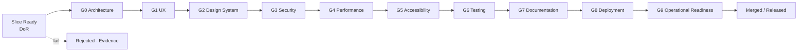

### 12.4 Quality Gate Matrix

| Gate | Applies To | Owner | Frequency | Failure Action | Exit Criteria |
|---|---|---|---|---|---|
| G0 Architecture | PRs, epics, releases | Architecture | Every PR + phase | Block merge | No drift, ADR filed |
| G1 UX | Features, surfaces | Design | Every feature | Block release | UX checklist passed |
| G2 Design System | UI components | Design-system | Every component | Block merge | Tokens/compliance |
| G3 Security | All | Security | Every PR + release | Block merge/release | Scan + matrix green |
| G4 Performance | Features, releases | Backend | Feature + release | Block release | Budgets met |
| G5 Accessibility | Features, surfaces | Design + QA | Every feature | Block release | WCAG AA passed |
| G6 Testing | All | QA | Every PR + release | Block merge | Required tests green |
| G7 Documentation | All | Tech Writer | Every change | Block merge | Checkpoint updated |
| G8 Deployment | Releases | DevOps | Every release | Block release | Rollback proven |
| G9 Ops Readiness | Releases, SLOs | DevOps | Every release + monthly | Block GA | Burn-rate green |

### 12.5 Gate Escalation

A failed Gate blocks the artifact; **only the Gate owner's approver** (Chapter 8.4) may override, and an override must be documented with a risk entry in the Risk Register (Chapter 14). Overrides are exceptions, not norms.

---

## 13. Documentation Mapping

### 13.1 Purpose

FocusFlow is **Documentation Driven** (IRM Ch. 13): the 14 source-of-truth documents are not artifacts — they are the **execution contracts**. This chapter maps which document governs which slice, and how every work item traces to a document.

### 13.2 Traceability Chain

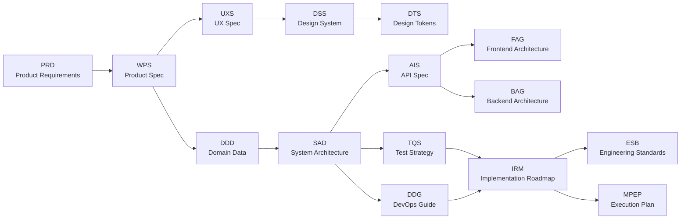

### 13.3 Documentation Traceability (execution mapping)

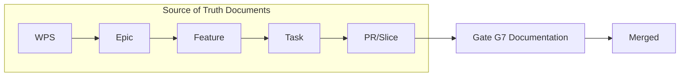

### 13.4 Architecture Traceability

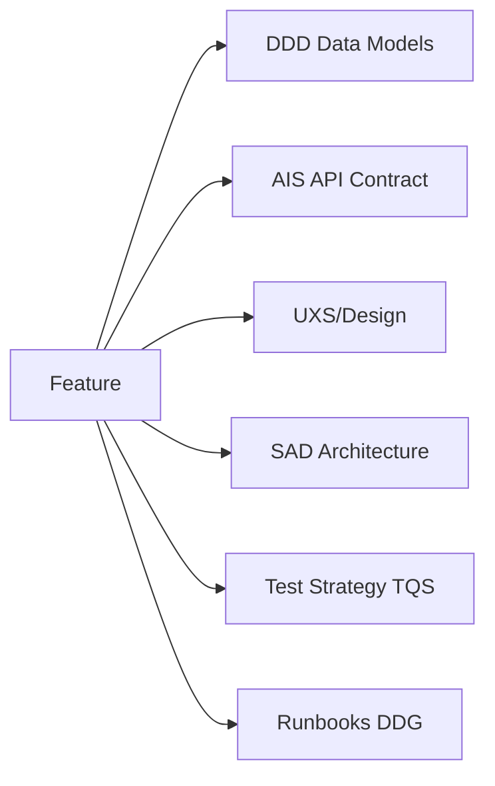

### 13.5 Documentation Matrix

| Work Item | Primary Doc | Supporting Docs | Doc Checkpoint | When |
|---|---|---|---|---|
| Workspace features | WPS Ch. Workspace | UXS, DDD, AIS, SAD | WPS + DDD + AIS | Before build |
| Identity & roles | AIS, WPS | ESB Ch. 12, BAG | AIS + BAG | Before build |
| Projects/sprints/board | WPS, UXS | DDD, AIS, SAD | UXS + DDD | Before build |
| Knowledge base | WPS | DDD, AIS, ESB Ch. 14 | DDD + AIS | Before build |
| Realtime/presence | SAD | AIS, ESB | SAD + AIS | Before build |
| Search | DDD, DDG Ch. 14 | SAD, ESB | DDD + DDG | Before build |
| Reports/doc engine | SAD, FAG | DDG | SAD + FAG | Before build |
| Analytics | IRM Ch. 6.5 | DDD, SAD | IRM + SAD | Before build |
| AI features | WPS (AI) | ESB Ch. 20, PRD | WPS + ESB Ch. 20 | Before build |
| SSO/enterprise | AIS, DDG Ch. 20 | ESB Ch. 12 | AIS + DDG | Before build |
| Public API/webhooks | AIS, DDG Ch. 15 | ESB | AIS + DDG | Before build |
| Sync/mobile | SAD | UXS, IRM App. H | SAD + UXS | Before build |
| SLOs/runbooks | DDG | ESB Ch. 17 | DDG | Before release |

### 13.6 Doc Update Policy

1. **Every code change that alters behavior updates its primary doc in the same PR** (IRM Ch. 13.3).
2. **Doc stewards** (Technical Writers) own the docs audit; a Phase is not closed until its docs are current.
3. **ADR/RFC** (Chapter 16) capture decisions; architecture changes trigger an ADR regardless of gate outcome.
4. **Traceability is enforced** — a PR without its doc checkpoint fails Gate G7.

---

*Continue to Chapters 14–15 in the next section.*

## 14. Risk Register

### 14.1 Risk Model

Every risk is logged with **likelihood, impact, mitigation, owner, and monitoring**. Likelihood and impact are rated 1–5; exposure = L × I. Risks are reviewed each sprint and escalated at Gate G9.

### 14.2 Risk Matrix

| ID | Risk | Category | L | I | Exposure | Mitigation | Owner | Monitoring |
|---|---|---|---|---|---|---|---|---|
| R-01 | Architecture drift from SAD/DDD | Architecture | 3 | 5 | 15 | Gates G0/G3; ADR/RFC; monthly compliance audit | Architecture | Compliance score per release |
| R-02 | Tenancy isolation bug leaks data across workspaces | Security | 2 | 5 | 10 | Tenancy isolation test suite; security review at Gate G3 | Security | Isolation test coverage |
| R-03 | Mock seed data (M-MOCK) not retired cleanly | Technical | 4 | 3 | 12 | Migration M-MOCK in IRM App. H; flag-gated removal | Backend | Migration completeness |
| R-04 | Realtime subsystem latency exceeds budget | Performance | 3 | 4 | 12 | Load tests; p95 budgets at Gate G4 | Backend | Perf dashboards |
| R-05 | AI feature accuracy below 90% | AI | 3 | 4 | 12 | Eval set at Gate G5; kill-switch; pilot gating | AI | Eval score per release |
| R-06 | SSO/enterprise integration slips schedule | Product | 3 | 3 | 9 | Parallel track; contract-first | Backend | Milestone M-6 |
| R-07 | Public API/webhook abuse or quota breach | Security | 2 | 4 | 8 | API keys, rate limits, webhook retries, abuse monitoring | Platform | Rate-limit alerts |
| R-08 | SLO breach / availability dip at GA | Operations | 3 | 4 | 12 | Burn-rate alerts; runbooks; capacity hardening E21 | DevOps | SLO burn rate |
| R-09 | Docs fall behind code (doc drift) | Process | 4 | 3 | 12 | Gate G7; doc stewards; PR checkpoint | Tech Writer | Doc audit score |
| R-10 | Feature-flag config error causes bad release | Operations | 2 | 4 | 8 | Flag review at Gate G8; rollout plans | DevOps | Release checklists |
| R-11 | Search index lag or drift | Performance | 2 | 3 | 6 | Projections, lag tests at Gate G4 | Platform | Lag metrics |
| R-12 | Browser/SDK compat breaks (mobile/desktop) | Product | 3 | 3 | 9 | Browser matrix; PWA tests; device labs | Frontend | Compat matrix |
| R-13 | Velocity overestimated → milestone slip | Process | 4 | 3 | 12 | Capacity planning; re-baseline discipline | TPM | Velocity trend |
| R-14 | Vendor/third-party dependency risk (Redis, AI, storage) | Third-party | 3 | 3 | 9 | Abstraction layers; exit plans; multi-provider | Platform | Dependency reviews |
| R-15 | Data-loss risk in offline sync | Product | 2 | 5 | 10 | Sync engine reconcile; auto-resolve ≥ 99%; backups | Platform | Sync metrics |
| R-16 | Security/DSR compliance close-out incomplete | Security | 2 | 4 | 8 | Compliance plan in E18; audit trail; DSR tooling | Security | Compliance checklist |

### 14.3 Risk Responses

- **Mitigate** — reduce likelihood or impact (most risks above).
- **Accept** — documented residual risk with owner and review date (e.g., low-L/low-I).
- **Transfer** — insurance, vendors, managed services (infra resilience).
- **Avoid** — remove the risky option (e.g., no shadow-AI without evals).

### 14.4 Risk Review Cadence

- **Sprint review** — current risks re-scored; new risks added.
- **Release review** — risk exposure gates the release (Gate G9).
- **Quarterly** — full risk register re-baseline against the roadmap.

---

## 15. Engineering Metrics

### 15.1 Metric Model

Metrics follow the **Evidence-Driven Progress** principle: no milestone closes without measured evidence. Metrics are split into **delivery, quality, operational, and business** families (ESB Ch. 17, DDG Ch. 9).

### 15.2 Metric Family Table

| Family | Metric | Target | Owner | Cadence |
|---|---|---|---|---|
| Delivery | Sprint velocity (points/sprint) | Trend, no cliff | TPM | Sprint |
| Delivery | Lead time (idea → merged) | < 10 days median | TPM | Sprint |
| Delivery | Cycle time (PR → merge) | < 2 days median | TPM | Sprint |
| Delivery | Deploy frequency | ≥ 1/week (staging), GA cadence (prod) | DevOps | Weekly |
| Delivery | Throughput (slices/quarter) | Phase target | TPM | Quarter |
| Quality | Bug escape (defects to prod) | < 5% of defects | QA | Release |
| Quality | Test coverage | ≥ 80% core modules | QA | Release |
| Quality | Negative/authz coverage | 100% matrix | QA | Release |
| Quality | Reopened defects | < 5% | QA | Sprint |
| Operational | MTTR | < 30 min for Sev-2 | DevOps | Weekly |
| Operational | SLO attainment | ≥ target per SLO | DevOps | Monthly |
| Operational | Alert noise | < 10 actionable alerts/day | DevOps | Weekly |
| Performance | p95 latency budgets | Per-service | Backend | Release |
| Performance | Client bundle size | ≤ budget | Frontend | Release |
| Architecture | Compliance score | ≥ 90% | Architecture | Release |
| Architecture | Tech debt index | Flat/decreasing | Architecture | Quarter |
| Accessibility | WCAG AA violations | 0 in core | QA | Release |
| Developer | Developer satisfaction | Trend ≥ baseline | TPM | Quarter |
| Business | MAU / activation | Phase target | Product | Month |
| Business | Feature adoption | ≥ target per feature | Product | Release |
| Business | NPS / CSAT | Trend | Product | Quarter |
| AI | Eval accuracy | ≥ 90% | AI | Release |
| AI | AI cost per user | ≤ budget | AI | Month |

### 15.3 Metric Governance

1. **Every metric has an owner and cadence** (above) — no orphan metrics.
2. **Metrics are reviewed at sprint review and release review**; adverse trends trigger a risk review (Chapter 14).
3. **Team health is measured too** — developer satisfaction and toil feed capacity planning.
4. **Metrics are evidence** — dashboards are linked in milestones, not narrated.

---

*Continue to Chapters 16–17 in the next section.*

## 16. Governance

### 16.1 Governance Model

Governance ensures the MPEP stays **living**: decisions are made with evidence, recorded, and auditable. The governance bodies mirror ESB Ch. 21 and IRM Ch. 15–16.

### 16.2 Governance Bodies

| Body | Composition | Mandate | Cadence |
|---|---|---|---|
| **Architecture Review Board (ARB)** | Architecture lead + staff engineers | Approves SAD/DDD/AIS changes, ADRs, architecture gates (G0) | Fortnightly |
| **Engineering Council** | Team leads + architects | Standards decisions, tooling, ESB updates | Monthly |
| **Release Board** | TPM + DevOps + QA + Product | Approves releases (Gate G8/G9), rollback decisions | Per release |
| **Security Review** | Security owner + ARB | Security gates (G3), threat model, audit | Per release + incidents |
| **Product Council** | Product + Design + stakeholders | Feature priority, roadmap re-baseline | Quarterly |

### 16.3 Decision Records

- **ADR (Architecture Decision Record)** — required for any architectural change; filed by the author; reviewed by ARB; append-only.
- **RFC (Request for Comment)** — for significant proposals; circulated ≥ 2 weeks; merged as an ADR when accepted.
- **Decision Log** — every gate override and milestone re-baseline is logged with rationale and risk entry.

### 16.4 Code & Change Management

1. **Pull requests only** — no direct pushes to `main`; PRs pass CI and all applicable Gates.
2. **Code review** — required two-person review on critical-path modules; bus-factor ≥ 2 (Ch 8.5).
3. **Change management** — feature flags, migrations, and releases follow DDG Ch. 15–17.
4. **Documentation updates** — behavior-changing PRs update their primary doc in the same PR (Ch 13.6).

### 16.5 Release Approval Chain

1. Feature slices pass their Gates (Ch 12) → merged.
2. Release scope approved at Release Board with evidence.
3. Staged rollout per Release Strategy (Ch 11).
4. Post-release review within 1 week; incidents logged and runbooked.

### 16.6 Escalation & Override

- Gate failures escalate to the owning body; overrides are documented exceptions with risk entries.
- Architecture disputes escalate to ARB; product disputes to Product Council.
- No metric, gate, or governance decision is changed by a single person without a record.

---

## 17. Future Growth

### 17.1 Growth Model

FocusFlow evolves from the working MVP into the **Developer Operating System** (PRD §1.2) through five growth years. Each year has a **focus, business outcome, and engineering commitment** — growth never abandons the Execution Rules.

### 17.2 Year 1 — Production SaaS

- **Focus:** Ship the GA (Chapter 11) and stabilize SLOs (DDG).
- **Business:** First production customers; adoption of workspaces, teams, sprints, knowledge base.
- **Engineering:** Hardening, incident response, compliance close-out (E21), LTS/support tiers.

### 17.3 Year 2 — AI Workspace

- **Focus:** AI platform becomes differentiated (auto-standups, digests, insights — E17).
- **Business:** AI-led retention and expansion; measured accuracy and cost discipline.
- **Engineering:** AI evals, metering, kill-switches; AI gates at every release.

### 17.4 Year 3 — Enterprise Platform

- **Focus:** Enterprise features land at depth (SSO, audit, admin console, DSR — E18).
- **Business:** Enterprise sign-offs and procurement readiness.
- **Engineering:** Tenancy, compliance, audit; enterprise support tiers.

### 17.5 Year 4 — Marketplace

- **Focus:** Ecosystem opens (E19) — public API, webhooks, SDK, plugins.
- **Business:** Third-party integrations and marketplace revenue.
- **Engineering:** API SLAs, plugin runtime, marketplace governance.

### 17.6 Year 5 — Developer Operating System

- **Focus:** FocusFlow becomes the integrated developer operating layer — tasks, focus, knowledge, AI, and ecosystem in one system.
- **Business:** Category leadership in developer productivity.
- **Engineering:** Continual evolution under the same Architecture First, Documentation Driven, Quality Gate discipline.

### 17.7 Growth Principles

1. **Evolve, never rebuild** — the working MVP and its architecture are the foundation of every growth year.
2. **Every year has a gate** — no growth milestone closes without evidence (Ch 15).
3. **Governance scales** — ARB/Engineering Council/Release Board adapt as teams grow (Ch 16).
4. **The MPEP is the living contract** — growth updates the MPEP itself, so it always reflects the next horizon.

---

## Appendix A — Priority Matrix

Priority is assigned by **impact × value / cost × risk**. Every feature/task in Ch 5–6 carries one of these priorities:

| Priority | Label | Meaning |
|---|---|---|
| P0 | Critical | Blocks GA or a Phase; no workaround |
| P1 | High | Core loop; delayable by one sprint only |
| P2 | Medium | Feature-complete requirement; schedule-flexible |
| P3 | Low | Enhancement; parkable |
| P4 | Deferred | Roadmap only |

| Work Item | Epic | Priority | Notes |
|---|---|---|---|
| Delivery base (CI, flags, envs) | E1 | P0 | Blocks everything |
| Tenancy + identity | E2/E3 | P0 | Critical path |
| Workspace foundation | E5 | P0 | Gate 2 |
| Teams/members/roles | E6/E7 | P1 | |
| Projects/sprints/board | E8/E9 | P1 | |
| Realtime/presence | E10 | P1 | |
| Knowledge base | E11 | P1 | |
| Search | E14 | P2 | |
| Mission control | E12 | P2 | |
| Notifications | E13 | P2 | |
| Reports | E15 | P2 | |
| Analytics | E16 | P2 | |
| AI platform | E17 | P1 | Differentiator |
| Enterprise (SSO/audit/DSR) | E18 | P1 | |
| Ecosystem (API/webhooks/SDK) | E19 | P2 | |
| Mobile/desktop/sync | E20 | P2 | |
| Production excellence (SLOs) | E21 | P0 | GA |

---

## Appendix B — Glossary

| Term | Definition |
|---|---|
| **AD (Architecture Decision Record)** | Append-only decision record reviewed by ARB |
| **Definition of Done (DoD)** | Evidence checklist for a task/feature (Ch 9.4) |
| **Definition of Ready (DoR)** | Readiness checklist before sprint intake (Ch 9.3) |
| **Epic** | Largest unit of plan, maps to a phase (Ch 4) |
| **Evidence** | Measured artifact that proves a gate/DoD is met |
| **Feature** | User/system-visible increment of an epic (Ch 5) |
| **Feature flag** | Runtime toggle governing release exposure |
| **Gate** | Mandatory binary quality checkpoint (Ch 12) |
| **M-MOCK** | Migration retiring mock seeded data (IRM App. H) |
| **MPEP** | This document — the execution plan |
| **PWA** | Progressive Web App (E20 surface) |
| **Release** | Versioned, gate-approved bundle (Ch 11) |
| **SLO / SLI / SLA** | Service level objective / indicator / agreement (DDG) |
| **Slice** | Vertical unit: UI + API + persistence + tests |
| **Tenancy** | Multi-tenant data isolation (E2) |
| **Vertical slice** | See Slice |

---

## Appendix C — Revision History

| Version | Date | Author | Summary |
|---|---|---|---|
| 1.0 | 2026-08-02 | Execution | Initial MPEP — 17 chapters, 10 matrices, 13 diagrams; aligns all 14 source-of-truth docs into one execution contract |

---

*End of MPEP.*

