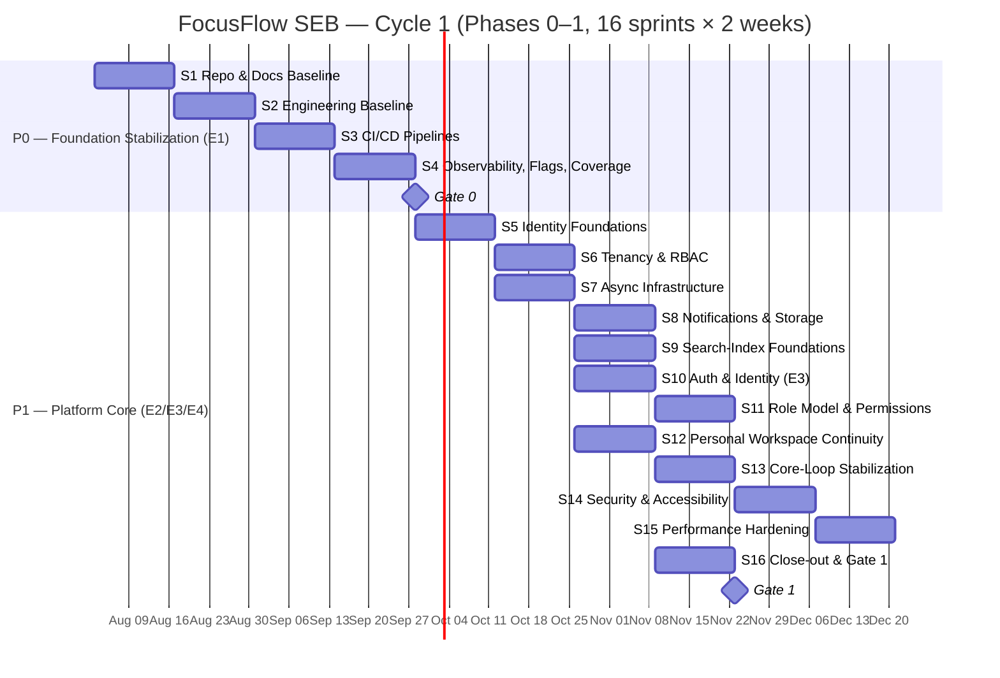
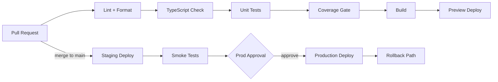
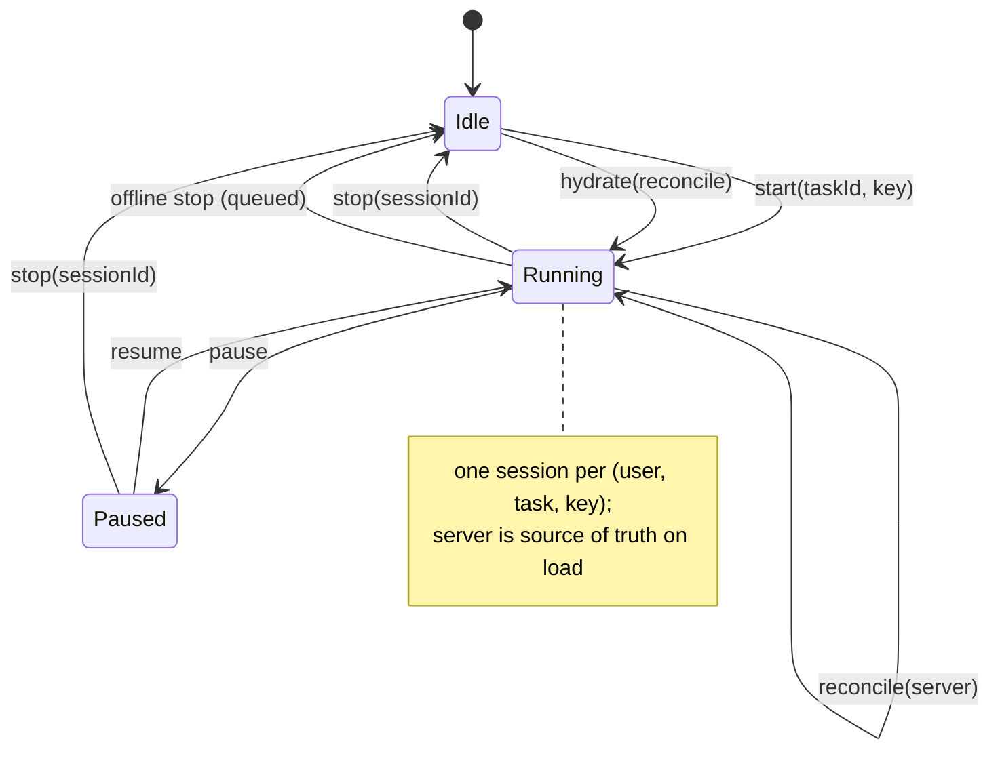
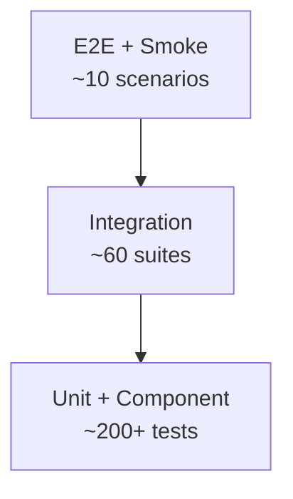
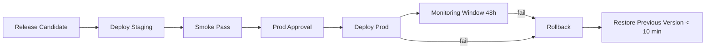
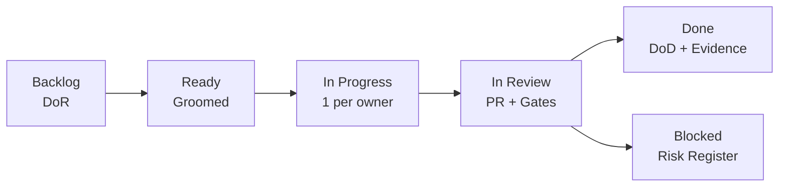
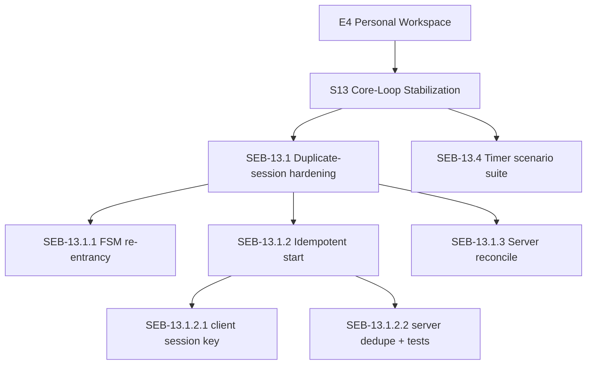

# FocusFlow — Sprint Execution Blueprint (SEB)

**Product Name:** FocusFlow
**Document Type:** Sprint Execution Blueprint (SEB) — Cycle 1
**Supersedes:** N/A — the first executable engineering plan; the team's day-to-day implementation guide derived from the MPEP
**Source of Truth:** FocusFlow PRD (v1.0); WPS (v1.1); UXS (v1.1); DSS (v1.1); DTS (v1.1); DDD (v1.0); SAD (v1.0); AIS (v1.0); FAG (v1.0); BAG (v1.0); TQS (v1.0); DDG (v1.0); IRM (v1.0); ESB (v1.0); and the MPEP (v1.0) — this document executes only the work those documents already define
**Audience:** Founder, CTO, Engineering Manager, Technical Program Manager, Product Manager, Software Architect, Frontend Engineers, Backend Engineers, QA Engineers, DevOps Engineers, AI Engineers, Technical Writers, and all contributors executing Cycle 1
**Status:** Draft v1.0
**Scope:** The executable engineering plan for **Phase 0 (Foundation Stabilization)** and **Phase 1 (Platform Core)** only — Cycle 1 of the MPEP. It defines the 16-sprint program, the full sprint backlog (stories, tasks, subtasks with ID, priority, hours, dependencies, difficulty, owner, DoR, DoD, acceptance criteria, testing, and deployment), the engineering checklist, CI/CD, database, backend, and frontend task streams, the Timer and Work Log stabilization programs, the testing plan, the release checklist, the risk register, and the measurable success criteria for Sprint completion. It intentionally contains **no implementation code** and **no new product features** — it hardens and stabilizes the working MVP so the Platform Core can be built beneath it (MPEP Ch. 1.4, 3.2; IRM Ch. 4, 11).

**Stack context (per source-of-truth docs):** Node.js (LTS) · TypeScript · React · Vite · Tailwind CSS · Express.js · MongoDB (Mongoose) · Redis · Socket.IO · BullMQ · JWT · bcrypt · Zustand · Recharts · framer-motion · docx/html2pdf · Vitest · OpenTelemetry · Docker (FAG, BAG, SAD §19, DDG Ch. 4, IRM Ch. 11, ESB stack context). Current repo is React 18.3 + TS 5.5 (strict) + Vite 5.4 + Zustand 4.5 on the client and a plain-JS Express 4 + Mongoose 8 monolith on the server (`mainApp/server`).

**Consistency obligations.** The 14 source-of-truth documents and the MPEP are authoritative. This document does **not** redesign the product, change architecture, modify workflows, or create new features. It executes only MPEP Phase 0 (Epic E1) and Phase 1 (Epics E2, E3, E4). Where this document references product, data, architecture, or operations behavior, it does so by citing those documents. If a conflict appears, the referenced source-of-truth document wins and this document is corrected. **Architectural drift is prevented** by gating every task against its authoritative document (MPEP Ch. 13) and the ten mandatory quality gates (MPEP Ch. 12).

---

## Table of Contents

1. [Executive Summary](#1-executive-summary)
2. [Cycle Overview & Sprint Timeline](#2-cycle-overview--sprint-timeline)
3. [Sprint Backlog](#3-sprint-backlog)
4. [Engineering Checklist](#4-engineering-checklist)
5. [CI/CD Tasks](#5-cicd-tasks)
6. [Database Tasks](#6-database-tasks)
7. [Backend Tasks](#7-backend-tasks)
8. [Frontend Tasks](#8-frontend-tasks)
9. [Timer Stabilization](#9-timer-stabilization)
10. [Work Log Stabilization](#10-work-log-stabilization)
11. [Testing Plan](#11-testing-plan)
12. [Release Checklist](#12-release-checklist)
13. [Risk Register](#13-risk-register)
14. [Success Criteria](#14-success-criteria)
15. [Deliverables](#15-deliverables)

### Appendices

- [A. Glossary](#a-glossary)
- [B. Revision History](#b-revision-history)

---

## 1. Executive Summary

### 1.1 Sprint Goal (Cycle 1)

> **Make FocusFlow trustworthy before it grows.** Cycle 1 stabilizes the working MVP's engineering foundation (Phase 0) and builds the shared Platform Core beneath it (Phase 1) — so that every later phase (workspaces, teams, realtime, AI) builds on a tested, observable, secure base. **The product is improved and stabilized, never rebuilt** (MPEP Ch. 1.4; IRM Ch. 11).

The cycle completes when **Gate 0** (Phase 0 exit) and **Gate 1** (Phase 1 exit) are met (MPEP Ch. 10, 12; IRM Ch. 6.1–6.2): the workspace API is live behind feature flags, RBAC is enforced, queue/notifications/storage/search foundations exist, the personal workspace (auth → timer → worklog) runs without regressions, and the engineering delivery base (CI, flags, environments, observability) is proven.

### 1.2 Expected Deliverables

| # | Deliverable | Phase | Epic | Exit Evidence |
|---|---|---|---|---|
| D-01 | All 15 source-of-truth docs committed and versioned in `/docs/` | P0 | E1 | Docs tracked in git; doc check in CI |
| D-02 | Engineering baseline: ESLint, Prettier, TypeScript strict clean | P0 | E1 | Lint/format/typecheck green in CI |
| D-03 | CI/CD: GitHub Actions lint → test → build → deploy (staging + prod), preview, rollback | P0 | E1 | Every PR gated; deploy + rollback proven |
| D-04 | Feature-flag mechanism usable in all environments | P0 | E1 | Flags toggle in dev/staging/prod |
| D-05 | Structured logging + metrics + health endpoints + coverage baseline (≥ 60% critical paths) | P0 | E1 | Logs/metrics flowing in staging; Gate 0 passed |
| D-06 | Identity & tenancy model + contracts (AIS) | P1 | E2 | AIS contracts agreed; schema merged |
| D-07 | Job queue (BullMQ/Redis) processing in staging | P1 | E2 | Queue jobs complete with retries |
| D-08 | Notification bus + object-storage abstraction used by exports | P1 | E2 | Export uses abstraction; notifications deliver |
| D-09 | Search-index foundations (projection pipeline) | P1 | E2 | Index lag < 5s in staging |
| D-10 | JWT lifecycle, session restore (`/auth/me`), workspace-aware identity | P1 | E3 | Auth e2e + negative tests green |
| D-11 | Role-model foundation (Owner/Admin/Manager/Developer/Viewer) + permission enforcement | P1 | E3 | RBAC negative matrix green |
| D-12 | Personal workspace on shared core, zero regressions; timer/worklog hardened | P1 | E4 | Regression suite green; offline queue replays |
| D-13 | Security, accessibility, and performance review passes | P1 | E1/E4 | Gate 3/5/4 reports attached |
| D-14 | Gate 1 evidence pack + release to staging | P1 | E2/E3/E4 | Release Checklist signed; Gate 1 passed |

### 1.3 Business Value

1. **Protects the existing product.** The working personal workspace (auth, timer, worklogs, reports, journal, analytics) is the company's only user-facing asset; Cycle 1 hardens it (IRM Ch. 2, 10) so regressions stop leaking silently.
2. **Unblocks the collaborative product.** Real workspaces, teams, and realtime (Phase 2) are impossible without identity, tenancy, RBAC, and async infrastructure; Cycle 1 builds exactly those shared services (MPEP Ch. 3.4 P1).
3. **Reduces cost of change.** CI, flags, environments, and observability mean every later feature ships faster, safer, and measurably (MPEP Ch. 1.4; ESB Ch. 17).
4. **De-risks the roadmap.** A stable foundation is the prerequisite for every revenue-bearing phase (MPEP Ch. 17); failing here would propagate into all later phases (MPEP Ch. 7).

### 1.4 Engineering Value

1. **Evidence over vibes.** Gate 0/1 require measured outputs: CI pass rate ≥ 98%, coverage ≥ 60% on critical paths, auth error rate tracked, p95 budgets (MPEP Ch. 15).
2. **Build Once, Reuse Everywhere.** Identity, tenancy, queue, notifications, storage, and search are delivered once as platform services and reused by every later epic (MPEP Ch. 4.4; IRM Ch. 7.3).
3. **Quality gates are immutable.** Schedules flex; the ten gates of MPEP Ch. 12 do not (MPEP Ch. 3.4, 12.2).
4. **Documentation drives implementation.** Every task references its authoritative document; no task proceeds without its doc checkpoint (MPEP Ch. 13; ESB §16).
5. **Stabilization before extension.** Timer and worklog are the product's flagship loops; they are hardened with regression suites before the platform expands beneath them (MPEP Ch. 4.6; IRM Ch. 10).

### 1.5 Success Metrics (Cycle 1 targets)

| Metric | Baseline (Ch 2, MPEP) | Cycle-1 Target | Owner |
|---|---|---|---|
| CI pass rate | None (no CI) | ≥ 98% | DevOps |
| Test coverage (critical paths) | ~1 test file | ≥ 60% | QA |
| Docs tracked | 0/15 tracked | 15/15 tracked | Tech Writer |
| Deploy frequency | 0 (manual) | ≥ 1/week staging; 1 prod release | DevOps |
| Lint/type errors | N/A (no lint) | 0 blocking | All |
| Auth error rate | Untracked | Measured, < 1% | Backend |
| Timer session duplicate rate | Untracked | 0% (no duplicates) | Full-stack |
| Offline queue replay success | Untracked | 100% of queued ops | Full-stack |
| RBAC negative-test coverage | 0 | 100% of permission matrix | QA |
| p95 latency (core APIs) | Unmeasured | Baseline recorded; budgets set | Backend |
| WCAG AA violations (core pages) | Untracked | 0 | QA |
| Security scan findings | Untracked | 0 critical/high | Security |

---

## 2. Cycle Overview & Sprint Timeline

### 2.1 Cycle Definition

Cycle 1 executes **MPEP Phase 0 and Phase 1** in **16 two-week sprints** (32 weeks), mapping directly onto MPEP epics (MPEP Ch. 3.4, 4.2):

| Phase | Sprints | Weeks | Epics | Gate |
|---|---|---|---|---|
| P0 Foundation Stabilization | S1–S4 | 8 | E1 Foundation | Gate 0 |
| P1 Platform Core | S5–S16 | 24 | E2, E3, E4 | Gate 1 |

P0 uses the MPEP "4 two-week sprints" variant (MPEP Ch. 3.4). P1's 12 sprints sit at the low end of the MPEP 12–16 sprint range for E2/E3/E4 combined (MPEP Ch. 4.4–4.6).

### 2.2 Cycle Timeline (Gantt)

### 2.3 Sprint Map

| Sprint | Theme | Epic | Primary Docs | Exit |
|---|---|---|---|---|
| S1 | Repository & Documentation Baseline | E1 | ESB §16, IRM G30, DDG Ch. 5 | Repo clean; docs tracked |
| S2 | Engineering Baseline | E1 | ESB Ch. 14, DDG Ch. 5 | Lint/format/type strict green |
| S3 | CI/CD Pipelines | E1 | DDG Ch. 5–8, ESB §14 | PRs gated; deploys proven |
| S4 | Observability, Flags, Coverage | E1 | DDG Ch. 9–11, 17, ESB Ch. 17 | Gate 0 |
| S5 | Identity Foundations | E2 | SAD, DDD, AIS, BAG Ch. 9 | Contracts + identity model |
| S6 | Tenancy & RBAC | E2 | DDD, AIS, ESB §12 | Isolation + role foundations |
| S7 | Async Infrastructure | E2 | BAG Ch. 9.10, SAD | BullMQ queue live |
| S8 | Notifications & Storage | E2 | BAG, SAD, DDG Ch. 4 | Bus + storage abstraction |
| S9 | Search-Index Foundations | E2 | DDD, DDG Ch. 14 | Projection pipeline |
| S10 | Auth & Identity | E3 | AIS, PRD, BAG, ESB §12 | JWT lifecycle + /auth/me |
| S11 | Role Model & Permissions | E3 | WPS (roles), AIS, ESB §12 | RBAC matrix green |
| S12 | Personal Workspace Continuity | E4 | PRD, UXS, FAG, IRM Ch. 10 | Zero regressions |
| S13 | Core-Loop Stabilization | E4 | IRM Ch. 10, TQS | Timer/worklog hardened |
| S14 | Security & Accessibility | E1/E4 | ESB Ch. 12, 14 | Gate 3/5 reports |
| S15 | Performance Hardening | E1/E4 | ESB Ch. 13, DDG Ch. 14 | Budgets recorded |
| S16 | Close-out & Gate 1 | E2/E3/E4 | MPEP Ch. 10, 12 | Gate 1 |

### 2.4 Week-by-Week Plan

#### P0 — Phase 0 Foundation Stabilization (Weeks 1–8)

| Week | Sprint | Focus | Key Milestones |
|---|---|---|---|
| 1 | S1 | Repo & docs baseline | Docs committed to `/docs/`; repo hygiene (`.gitignore`, `structure.txt`, stale artifacts); toolchain pinned |
| 2 | S1 | Repo & docs baseline | Doc check in CI; folder cleanup complete; PLAN/structure audit |
| 3 | S2 | Engineering baseline | ESLint + Prettier configured; TS strict cleanup started |
| 4 | S2 | Engineering baseline | TS strict clean; dependency update audit; env/config validation |
| 5 | S3 | CI/CD | GitHub Actions lint/test/build pipelines live |
| 6 | S3 | CI/CD | Deploy (staging + prod) + preview + rollback verified |
| 7 | S4 | Observability, flags, coverage | Structured logging + metrics; health endpoints; flags |
| 8 | S4 | Observability, flags, coverage | Coverage ≥ 60% critical paths; **Gate 0** review |

#### P1 — Phase 1 Platform Core (Weeks 9–32)

| Week | Sprint | Focus | Key Milestones |
|---|---|---|---|
| 9–10 | S5 | Identity foundations | AIS identity/tenant contracts; tenant schema merged |
| 11–12 | S6 | Tenancy & RBAC | Tenant-scoped reads/writes; isolation tests; role schema |
| 13–14 | S7 | Async infrastructure | BullMQ/Redis queue; job retries/visibility in staging |
| 15–16 | S8 | Notifications & storage | Notification bus; storage abstraction; export uses it |
| 17–18 | S9 | Search-index foundations | Index projection pipeline; lag < 5s in staging |
| 19–20 | S10 | Auth & identity | JWT lifecycle; `/auth/me`; workspace-aware identity |
| 21–22 | S11 | Role model & permissions | RBAC enforcement; negative matrix green |
| 23–24 | S12 | Personal continuity | Personal features on shared core; zero regressions |
| 25–26 | S13 | Core-loop stabilization | Timer + worklog hardening; regression suites |
| 27–28 | S14 | Security & accessibility | Security scan; a11y pass on core pages |
| 29–30 | S15 | Performance hardening | Latency budgets; bundle budget; load baseline |
| 31–32 | S16 | Close-out & Gate 1 | Release checklist; **Gate 1** review; docs audit |

### 2.5 Day-by-Day Recommendation (template — applied to every sprint)

Sprints follow the MPEP two-week cadence and ceremonies (MPEP Ch. 9.2, 9.6):

| Day | Activity |
|---|---|
| Mon (W1) | Sprint Planning (DoR pass, capacity, sprint goal); pair tasking |
| Tue–Thu (W1) | Development; daily stand-up (15 min); continuous CI; pair reviews |
| Fri (W1) | Stand-up; midpoint check; retro-worthy issues flagged early |
| Mon–Thu (W2) | Development; feature freeze for the sprint's slice; gates invoked |
| Thu (W2) | Code freeze; e2e/regression run; release candidate to staging |
| Fri (W2) | Sprint Review (demo + metrics); Retrospective; backlog refinement; next-sprint planning inputs |

**Daily stand-up contract (15 min):** what I did yesterday / what I will do today / blockers (owned to resolution via the Risk Register, Ch 13). Every day ends with a merged-or-commented PR — no day-end uncommitted work on the critical path.

### 2.6 Milestones

| Milestone | Sprint | Exit Criterion | Evidence (linked) |
|---|---|---|---|
| M0 — Docs + repo baseline | S1 | 15/15 docs tracked; repo clean | Git log + CI doc check |
| M1 — Engineering baseline | S2 | Lint/format/type strict green | CI run |
| M2 — CI/CD proven | S3 | Deploy + rollback verified | Pipeline runs + rollback drill |
| M3 — Gate 0 (Phase 0 exit) | S4 | IRM Ch. 6.1 exit criteria; coverage ≥ 60% | Gate 0 evidence pack |
| M4 — Platform services live (staging) | S9 | Queue/notifications/storage/search foundations | Service smoke tests |
| M5 — Identity & RBAC | S11 | Negative matrix green | RBAC test report |
| M6 — Zero personal regressions | S12 | Personal regression suite green | Test report |
| M7 — Stabilized core loop | S13 | Timer/worklog suites green | Test report |
| M8 — Security/a11y/perf passes | S15 | Gate 3/5/4 reports attached | Review reports |
| M9 — Gate 1 (Phase 1 exit) | S16 | IRM Ch. 6.2 exit criteria | Gate 1 evidence pack + Release Checklist |

### 2.7 Review Schedule

| Review | Cadence | Attendees | Artifact |
|---|---|---|---|
| Sprint Review | End of every sprint | TPM, team, stakeholders | Demo + metrics (MPEP Ch. 15) |
| Gate reviews (G0–G9) | Per artifact | Gate owner + approver (MPEP Ch. 12.4) | Gate evidence |
| Architecture Review (ARB) | Fortnightly | Architecture + staff | ADR/RFC decisions |
| Release Board | Per release | TPM + DevOps + QA + Product | Release approval |
| Phase reviews (Gate 0 / Gate 1) | End of S4 / S16 | All | Evidence packs |
| Monthly metrics review | Monthly | TPM + leads | Metrics dashboard (MPEP Ch. 15) |
| Security review | S14 + on release | Security + ARB | Threat model + scan |

### 2.8 Retrospective

1. **Cadence:** every Friday of Sprint 2 (end of each 2-week sprint), 60 minutes, facilitated by the Scrum Master.
2. **Format:** Start/Stop/Continue + metrics review (MPEP Ch. 15) + risk register re-score (MPEP Ch. 14).
3. **Action ownership:** every action item gets an owner + due sprint; tracked to closure; unresolved items escalate to the Engineering Council.
4. **Phase retro:** dedicated retrospectives at Gate 0 (post-S4) and Gate 1 (post-S16) reviewing the whole phase's velocity, quality, and risk trajectory before the next phase begins.

---

## 3. Sprint Backlog

### 3.1 Backlog Standards

**Work hierarchy.** Every epic (E1–E4) decomposes into **features** (MPEP Ch. 5), **stories**, **tasks**, and **subtasks**. Stories are user/team-visible increments; tasks are the owned units of work with the full attribute card; subtasks are atomic steps a task splits into when it exceeds Definition of Ready.

**Identifier scheme.**

| Level | Format | Example |
|---|---|---|
| Sprint | `S<n>` | `S1` |
| Story | `SEB-<Sprint>.<Story#>` | `SEB-1.1` |
| Task | `SEB-<Sprint>.<Story#>.<Task#>` | `SEB-1.1.3` |
| Subtask | `SEB-<Sprint>.<Story#>.<Task#>.<Subtask#>` | `SEB-1.1.3.2` |
| MPEP trace | `E<epic>.<feature>.<n>` | `E1.1.1` |

**Priority (P0–P4)** and **Difficulty (Easy ≤ 1d / Medium 2–4d / Hard 5–10d / Very Hard 10+d)** follow MPEP Ch. 6.4 and Appendix A. **Owner roles** follow the MPEP Ownership Matrix (MPEP Ch. 8.4): Architecture, Frontend, Backend, Platform, QA, DevOps, Design, AI, Technical Writers.

### 3.2 Definition of Ready (DoR) — canonical, applied to every task

A task enters a sprint only when **all** hold (MPEP Ch. 9.3):

1. **DoR-A Clear:** one purpose; unambiguous acceptance criteria.
2. **DoR-B Sized:** effort estimated in hours; difficulty class assigned.
3. **DoR-C Dependencies known:** all hard dependencies met or sequenced (MPEP Ch. 7).
4. **DoR-D Docs checkpointed:** required documents (MPEP Ch. 13) referenced/provided.
5. **DoR-E Testable:** test approach defined (TQS).
6. **DoR-F Gate-compatible:** the slice fits a Gate and does not span Gate boundaries illegally (MPEP Ch. 12).
7. **DoR-G Owned:** a role owner is assigned (MPEP Ch. 8.4).

### 3.3 Definition of Done (DoD) — canonical, applied to every task

A task is done only when **all** hold (MPEP Ch. 9.4):

1. **DoD-1 Code:** implementation merged to `main` via PR.
2. **DoD-2 Tests:** required unit/integration/e2e/negative tests green.
3. **DoD-3 Docs:** required document checkpoint updated in the same PR (MPEP Ch. 13.6).
4. **DoD-4 Gate:** applicable quality Gate passed (MPEP Ch. 12).
5. **DoD-5 Observability:** logs/metrics/errors captured in the release environments.
6. **DoD-6 Flags:** feature-flag state defined (on/off/percent) (DDG Ch. 17).
7. **DoD-7 Runbook:** any operational step documented (DDG Ch. 17).
8. **DoD-8 A11y:** accessibility requirements met (ESB Ch. 14).
9. **DoD-9 Evidence:** evidence linked in the task (test run, gate sign-off, doc link).

### 3.4 Task Card Template

Every task row in the sprint backlogs below carries the full card:

| Field | Meaning |
|---|---|
| **ID** | SEB task ID + MPEP trace reference |
| **Title** | One-purpose description |
| **Priority** | P0–P4 (MPEP Appendix A) |
| **Est. Hours** | Point estimate (Planning Poker median) |
| **Dependencies** | Hard prerequisites (task IDs) |
| **Difficulty** | Easy/Medium/Hard/Very Hard |
| **Owner Role** | Per MPEP Ownership Matrix (Ch 8.4) |
| **DoR** | Which DoR items were verified at intake (3.2) |
| **DoD** | Which DoD items must be evidenced (3.3) |
| **Acceptance Criteria** | Testable statements (TQS Ch. 15) |
| **Testing Requirements** | Unit / integration / e2e / negative / perf / a11y |
| **Deployment Requirements** | Flags, migrations, rollback, env parity (DDG Ch. 15–17) |

### 3.5 Sprint Backlog — Sprint 1 (S1): Repository & Documentation Baseline

**Epic:** E1 Foundation (MPEP Ch. 4.3). **Goal:** make the repository and its documentation trustworthy — the base every later sprint stands on. **Exit:** M0 (docs tracked; repo clean).

**Stories.**

| ID | Story | Priority | Est. (h) | Owner |
|---|---|---|---|---|
| SEB-1.1 | Version the 15 source-of-truth docs into `/docs/` with a doc check | P0 | 16 | Tech Writer |
| SEB-1.2 | Repo hygiene: `.gitignore`, `structure.txt`, stale artifacts, secrets scan | P0 | 12 | DevOps |
| SEB-1.3 | Environment & configuration inventory (`.env`, vars, secrets) | P0 | 10 | DevOps |
| SEB-1.4 | Toolchain pinning (node version, package manager, lockfiles) | P0 | 6 | DevOps |

**Tasks (SEB-1.1).**

| ID | Title | Pri | Hrs | Deps | Diff | Owner | DoR | DoD | Acceptance Criteria | Testing | Deployment |
|---|---|---|---|---|---|---|---|---|---|---|---|
| SEB-1.1.1 (E1.1.1) | Move all `*.md` source-of-truth docs into `/docs/` | P0 | 6 | — | Easy | Tech Writer | A,B,C,D,E,F,G | 1,2,3,4,9 | 15 docs in `/docs/`; links inside docs still resolve; git status clean of root-level `*.md` | Doc link check (CI) | Standard merge |
| SEB-1.1.2 | Add a CI doc check (all `/docs/*.md` present; no drift markers) | P0 | 6 | SEB-1.1.1 | Medium | DevOps | A,B,C,D,E,F,G | 1,2,4,5,9 | CI job fails on missing doc or stale marker | CI self-test | CI only |
| SEB-1.1.3 | Author `docs/README.md` index with ownership + review cadence | P0 | 4 | SEB-1.1.1 | Easy | Tech Writer | A,B,C,D,E,F,G | 1,3,9 | Index lists all docs + stewards (MPEP Ch. 8.4) | Review | Standard merge |

**Tasks (SEB-1.2).**

| ID | Title | Pri | Hrs | Deps | Diff | Owner | DoR | DoD | Acceptance Criteria | Testing | Deployment |
|---|---|---|---|---|---|---|---|---|---|---|---|
| SEB-1.2.1 | Audit `.gitignore` for `node_modules`, `.env`, `dist`, temp dirs | P0 | 2 | — | Easy | DevOps | A,B,C,D,E,F,G | 1,2,5,9 | No env/secrets/artifacts tracked; `.env.example` committed | Repo scan (CI) | Standard merge |
| SEB-1.2.2 | Remove stale artifacts (`pending-tasks.docx/pdf`, orphaned zips) from repo | P1 | 2 | — | Easy | DevOps | A,B,C,D,E,F,G | 1,2,9 | Repo contains only source + docs; artifacts removed | Repo scan | Standard merge |
| SEB-1.2.3 | Add secrets scan (gitleaks or equivalent) to pre-commit + CI | P0 | 6 | SEB-1.2.1 | Medium | DevOps | A,B,C,D,E,F,G | 1,2,4,5,9 | Scan blocks commits with high-confidence secrets | Scan self-test | CI only |

**Tasks (SEB-1.3).**

| ID | Title | Pri | Hrs | Deps | Diff | Owner | DoR | DoD | Acceptance Criteria | Testing | Deployment |
|---|---|---|---|---|---|---|---|---|---|---|---|
| SEB-1.3.1 | Inventory all env vars (`mainApp/.env`, `mainApp/server/.env`) vs code usage | P0 | 4 | — | Medium | Backend | A,B,C,D,E,F,G | 1,3,9 | Every var documented in `.env.example` + DDG Ch. 4 | Env parity check (CI) | Standard merge |
| SEB-1.3.2 | Add a startup config validation (fail fast on missing/invalid vars) | P0 | 6 | SEB-1.3.1 | Medium | Backend | A,B,C,D,E,F,G | 1,2,4,5,9 | Server refuses to start with missing required vars | Unit + boot test | All envs |

**Tasks (SEB-1.4).**

| ID | Title | Pri | Hrs | Deps | Diff | Owner | DoR | DoD | Acceptance Criteria | Testing | Deployment |
|---|---|---|---|---|---|---|---|---|---|---|---|
| SEB-1.4.1 | Pin Node/package-manager version (`.nvmrc`/`engines`, lockfiles committed) | P0 | 3 | — | Easy | DevOps | A,B,C,D,E,F,G | 1,2,9 | Reproducible install/build across machines | CI install | All envs |
| SEB-1.4.2 | Verify `npm ci` clean build for client + server | P0 | 3 | SEB-1.4.1 | Easy | DevOps | A,B,C,D,E,F,G | 1,2,5,9 | Fresh-checkout build succeeds in CI | CI build | All envs |

**Sprint-1 DoD:** docs tracked (15/15); secrets scan live; `.env.example` committed; fresh-checkout build green; Gate G7 (docs) + G3 (security scan) evidence attached.

---

### 3.6 Sprint Backlog — Sprint 2 (S2): Engineering Baseline

**Epic:** E1 Foundation (MPEP Ch. 4.3). **Goal:** lint, format, strict typing, dependency hygiene, and configuration validation — the floor every PR must clear. **Exit:** M1.

**Stories.**

| ID | Story | Priority | Est. (h) | Owner |
|---|---|---|---|---|
| SEB-2.1 | ESLint + Prettier configured for client and server | P0 | 12 | DevOps |
| SEB-2.2 | TypeScript strict-mode cleanup (client) | P0 | 20 | Frontend |
| SEB-2.3 | Dependency update audit + vulnerability scan | P1 | 10 | DevOps |
| SEB-2.4 | JS server hygiene: standard lint, `use strict`, error-prone patterns | P1 | 12 | Backend |

**Tasks (SEB-2.1).**

| ID | Title | Pri | Hrs | Deps | Diff | Owner | DoR | DoD | Acceptance Criteria | Testing | Deployment |
|---|---|---|---|---|---|---|---|---|---|---|---|
| SEB-2.1.1 (E1.2.1) | Configure ESLint (client: react/ts; server: eslint:recommended) | P0 | 5 | — | Medium | DevOps | A,B,C,D,E,F,G | 1,2,4,5,9 | `npm run lint` green on both packages; config committed | Lint run (CI) | CI only |
| SEB-2.1.2 | Configure Prettier + format check in CI | P0 | 4 | SEB-2.1.1 | Easy | DevOps | A,B,C,D,E,F,G | 1,2,4,5,9 | `npm run format:check` green; single config committed | Format check (CI) | CI only |
| SEB-2.1.3 | Wire lint/format into pre-commit + PR status checks | P0 | 3 | SEB-2.1.2 | Easy | DevOps | A,B,C,D,E,F,G | 1,2,4,9 | PRs blocked on lint/format failures | CI self-test | CI only |

**Tasks (SEB-2.2).**

| ID | Title | Pri | Hrs | Deps | Diff | Owner | DoR | DoD | Acceptance Criteria | Testing | Deployment |
|---|---|---|---|---|---|---|---|---|---|---|---|
| SEB-2.2.1 | Enable `noUnusedLocals` + `noUnusedParameters` + resolve findings | P1 | 8 | SEB-2.1.1 | Medium | Frontend | A,B,C,D,E,F,G | 1,2,4,9 | `tsc` strict flags green; dead code removed | Typecheck (CI) | CI only |
| SEB-2.2.2 | Eliminate `any` leaks in `src/store` and `src/utils` (typed stores/engine) | P1 | 8 | SEB-2.2.1 | Hard | Frontend | A,B,C,D,E,F,G | 1,2,4,9 | No `any` in touched files; types exported | Typecheck + unit | CI only |
| SEB-2.2.3 | Add dedicated `typecheck` script to CI gate | P0 | 2 | SEB-2.2.2 | Easy | DevOps | A,B,C,D,E,F,G | 1,2,4,5,9 | PRs blocked on typecheck | CI self-test | CI only |

**Tasks (SEB-2.3).**

| ID | Title | Pri | Hrs | Deps | Diff | Owner | DoR | DoD | Acceptance Criteria | Testing | Deployment |
|---|---|---|---|---|---|---|---|---|---|---|---|
| SEB-2.3.1 | Run `npm audit` (both packages); triage findings; upgrade or record exception | P0 | 6 | — | Medium | DevOps | A,B,C,D,E,F,G | 1,2,4,5,9 | 0 critical/high vulnerabilities; exceptions in risk register | Audit (CI) | CI only |
| SEB-2.3.2 | Review major-version drift vs supported versions; pin or schedule upgrade | P1 | 4 | SEB-2.3.1 | Medium | DevOps | A,B,C,D,E,F,G | 1,3,9 | Upgrade plan recorded; pinned where risky | Review | CI only |

**Tasks (SEB-2.4).**

| ID | Title | Pri | Hrs | Deps | Diff | Owner | DoR | DoD | Acceptance Criteria | Testing | Deployment |
|---|---|---|---|---|---|---|---|---|---|---|---|
| SEB-2.4.1 | Add ESLint to `mainApp/server`; resolve findings | P1 | 6 | SEB-2.1.1 | Medium | Backend | A,B,C,D,E,F,G | 1,2,4,5,9 | Server lint green | Lint run | CI only |
| SEB-2.4.2 | Wrap server bootstrap in a single `start()` with error handling + exit codes | P1 | 6 | SEB-2.4.1 | Medium | Backend | A,B,C,D,E,F,G | 1,2,5,9 | Process exits non-zero on boot failure | Boot unit test | All envs |

**Sprint-2 DoD:** lint + format + typecheck green in CI; `npm audit` clean (or exceptions logged); server lints; boot fails fast; Gates G6 (testing) + G7 (docs) evidence attached.

---

### 3.7 Sprint Backlog — Sprint 3 (S3): CI/CD Pipelines

**Epic:** E1 Foundation (MPEP Ch. 4.3). **Goal:** every change is gated, every merge can ship, and every deploy can roll back. **Exit:** M2. **Docs:** DDG Ch. 5–8; ESB §14.

**Stories.**

| ID | Story | Priority | Est. (h) | Owner |
|---|---|---|---|---|
| SEB-3.1 | GitHub Actions CI (lint → test → build) on every PR | P0 | 12 | DevOps |
| SEB-3.2 | Test pipeline (unit + integration) with coverage gate | P0 | 10 | QA |
| SEB-3.3 | Deployment pipeline: staging + prod + preview + rollback | P0 | 16 | DevOps |
| SEB-3.4 | Release orchestration: tags, release notes, promotion rules | P1 | 8 | DevOps |

**Tasks (SEB-3.1).**

| ID | Title | Pri | Hrs | Deps | Diff | Owner | DoR | DoD | Acceptance Criteria | Testing | Deployment |
|---|---|---|---|---|---|---|---|---|---|---|---|
| SEB-3.1.1 (E1.2.1) | Author `.github/workflows/ci.yml` (lint, typecheck, format, test, build) | P0 | 8 | SEB-2.x | Medium | DevOps | A,B,C,D,E,F,G | 1,2,4,5,9 | PR blocks on any failing job; status checks required | CI self-test | CI only |
| SEB-3.1.2 | Enforce branch protection (main: PR + required checks + no direct push) | P0 | 2 | SEB-3.1.1 | Easy | DevOps | A,B,C,D,E,F,G | 1,9 | Direct pushes impossible; PRs required | Review | Repo settings |
| SEB-3.1.3 | Cache dependencies for CI speed + correctness | P1 | 2 | SEB-3.1.1 | Easy | DevOps | A,B,C,D,E,F,G | 1,2,9 | CI install < 2 min typical | CI run | CI only |

**Tasks (SEB-3.2).**

| ID | Title | Pri | Hrs | Deps | Diff | Owner | DoR | DoD | Acceptance Criteria | Testing | Deployment |
|---|---|---|---|---|---|---|---|---|---|---|---|
| SEB-3.2.1 | Stand up Vitest config for client (jsdom/happy-dom) + server (node) | P0 | 4 | SEB-3.1.1 | Medium | QA | A,B,C,D,E,F,G | 1,2,5,9 | `npm test` green on both packages | CI test job | CI only |
| SEB-3.2.2 | Add coverage report + threshold gate (60% critical paths by S4) | P0 | 4 | SEB-3.2.1 | Medium | QA | A,B,C,D,E,F,G | 1,2,5,9 | Coverage gate blocks under-threshold PRs | CI coverage | CI only |
| SEB-3.2.3 | Port existing `timerEngine.test.ts` into the gated pipeline | P0 | 2 | SEB-3.2.1 | Easy | QA | A,B,C,D,E,F,G | 1,2,9 | Existing test runs in CI | CI run | CI only |

**Tasks (SEB-3.3).**

| ID | Title | Pri | Hrs | Deps | Diff | Owner | DoR | DoD | Acceptance Criteria | Testing | Deployment |
|---|---|---|---|---|---|---|---|---|---|---|---|
| SEB-3.3.1 | Staging deployment job (build + deploy + smoke) | P0 | 6 | SEB-3.1.1 | Hard | DevOps | A,B,C,D,E,F,G | 1,2,4,5,7,9 | Merge to main deploys staging; smoke passes | Deploy drill | Staging |
| SEB-3.3.2 | Production deployment job (approval-gated) | P0 | 6 | SEB-3.3.1 | Hard | DevOps | A,B,C,D,E,F,G | 1,2,4,5,7,9 | Prod deploy requires approval; env parity | Deploy drill | Prod |
| SEB-3.3.3 | Preview deployments per PR (client) | P1 | 4 | SEB-3.1.1 | Medium | DevOps | A,B,C,D,E,F,G | 1,2,9 | PR links a live preview | Review | Preview |
| SEB-3.3.4 | Rollback verification drill (staging + prod) | P0 | 4 | SEB-3.3.2 | Hard | DevOps | A,B,C,D,E,F,G | 1,2,4,7,9 | Rollback restores previous version < 10 min | Rollback drill | All envs |

**Tasks (SEB-3.4).**

| ID | Title | Pri | Hrs | Deps | Diff | Owner | DoR | DoD | Acceptance Criteria | Testing | Deployment |
|---|---|---|---|---|---|---|---|---|---|---|---|
| SEB-3.4.1 | Release-tag workflow (`release/*` → build, tag, notes) | P1 | 5 | SEB-3.3.2 | Medium | DevOps | A,B,C,D,E,F,G | 1,2,4,7,9 | Tag triggers build + release notes | Release drill | Prod |
| SEB-3.4.2 | Promotion rules doc (staging → prod) committed to `/docs/` | P1 | 3 | SEB-3.4.1 | Easy | DevOps | A,B,C,D,E,F,G | 1,3,9 | Promotion criteria documented (DDG Ch. 8) | Review | Standard merge |

**Sprint-3 DoD:** CI gates every PR; deploy + rollback proven on staging and prod; coverage gate live; Gates G8 (deployment) + G9 (operational readiness) evidence attached.

---

### 3.8 Sprint Backlog — Sprint 4 (S4): Observability, Flags & Coverage Baseline

**Epic:** E1 Foundation (MPEP Ch. 4.3). **Goal:** the system can be seen and measured, features can be toggled, and critical paths carry a coverage floor. **Exit:** **Gate 0** (IRM Ch. 6.1). **Docs:** DDG Ch. 9–11, 17; ESB Ch. 17.

**Stories.**

| ID | Story | Priority | Est. (h) | Owner |
|---|---|---|---|---|
| SEB-4.1 | Structured logging on the server | P0 | 12 | Backend |
| SEB-4.2 | Metrics + health endpoints | P0 | 12 | Backend |
| SEB-4.3 | Feature-flag mechanism (client + server) | P0 | 14 | Platform |
| SEB-4.4 | Coverage baseline ≥ 60% on critical paths | P0 | 16 | QA |

**Tasks (SEB-4.1).**

| ID | Title | Pri | Hrs | Deps | Diff | Owner | DoR | DoD | Acceptance Criteria | Testing | Deployment |
|---|---|---|---|---|---|---|---|---|---|---|---|
| SEB-4.1.1 (E1.4.1) | Replace `console.log` request logging with structured logger (JSON, request IDs, correlation) | P0 | 6 | SEB-2.4.x | Medium | Backend | A,B,C,D,E,F,G | 1,2,5,9 | Every request emits JSON log with request-id; no PII | Log assertions (test) | All envs |
| SEB-4.1.2 | Error logging with stack + context; no secrets in logs | P0 | 4 | SEB-4.1.1 | Medium | Backend | A,B,C,D,E,F,G | 1,2,5,9 | Error handler logs structured errors; secrets redacted | Log assertions | All envs |
| SEB-4.1.3 | Centralize logger behind a module (Build Once, Reuse Everywhere) | P0 | 2 | SEB-4.1.1 | Easy | Backend | A,B,C,D,E,F,G | 1,2,9 | All routes import the shared logger | Unit | All envs |

**Tasks (SEB-4.2).**

| ID | Title | Pri | Hrs | Deps | Diff | Owner | DoR | DoD | Acceptance Criteria | Testing | Deployment |
|---|---|---|---|---|---|---|---|---|---|---|---|
| SEB-4.2.1 | Publish metrics (request count, latency histogram, error rate, DB health) | P0 | 6 | SEB-4.1.1 | Medium | Backend | A,B,C,D,E,F,G | 1,2,5,9 | `/metrics` exposes counts + latency; no PII | Metrics assertion | All envs |
| SEB-4.2.2 | Extend `/api/health` to readiness + liveness with dependency checks | P0 | 3 | SEB-4.2.1 | Easy | Backend | A,B,C,D,E,F,G | 1,2,5,9 | Health reflects DB connectivity; 200/503 correct | Boot + health test | All envs |
| SEB-4.2.3 | Wire metrics into observability tooling (per DDG Ch. 9) | P1 | 4 | SEB-4.2.1 | Medium | DevOps | A,B,C,D,E,F,G | 1,2,5,9 | Dashboards show the baseline metrics | Review | Staging |

**Tasks (SEB-4.3).**

| ID | Title | Pri | Hrs | Deps | Diff | Owner | DoR | DoD | Acceptance Criteria | Testing | Deployment |
|---|---|---|---|---|---|---|---|---|---|---|---|
| SEB-4.3.1 (E1.3.1) | Server-side flag service (env-backed, evaluate per request) | P0 | 6 | SEB-4.1.1 | Medium | Platform | A,B,C,D,E,F,G | 1,2,4,5,6,9 | Flags evaluate on/off/% from env in all envs | Flag unit + e2e | All envs |
| SEB-4.3.2 | Client flag provider (reads bootstrap config; SSR-safe) | P0 | 4 | SEB-4.3.1 | Medium | Frontend | A,B,C,D,E,F,G | 1,2,4,5,6,9 | Client renders gated features by flag state | Component test | All envs |
| SEB-4.3.3 | Flag inventory + naming convention documented | P1 | 2 | SEB-4.3.1 | Easy | Tech Writer | A,B,C,D,E,F,G | 1,3,9 | Inventory in `/docs/` (DDG Ch. 17) | Review | Standard merge |

**Tasks (SEB-4.4).**

| ID | Title | Pri | Hrs | Deps | Diff | Owner | DoR | DoD | Acceptance Criteria | Testing | Deployment |
|---|---|---|---|---|---|---|---|---|---|---|---|
| SEB-4.4.1 | Identify critical paths (auth → tasks → timer → sessions → worklogs) | P0 | 4 | — | Easy | QA | A,B,C,D,E,F,G | 1,3,9 | Critical-path inventory in TQS | Review | Standard merge |
| SEB-4.4.2 | Add unit coverage on server critical paths (validation, middleware, services) | P0 | 8 | SEB-4.4.1 | Hard | QA | A,B,C,D,E,F,G | 1,2,5,9 | Server critical-path coverage ≥ 60% | Coverage gate | CI only |
| SEB-4.4.3 | Add component/hook coverage on client critical paths | P0 | 6 | SEB-4.4.1 | Hard | QA | A,B,C,D,E,F,G | 1,2,5,9 | Client critical-path coverage ≥ 60% | Coverage gate | CI only |
| SEB-4.4.4 | Compile **Gate 0 evidence pack** and run the Gate 0 review | P0 | 4 | all | Medium | TPM | A,B,C,D,E,F,G | 1,2,4,5,7,9 | Gate 0 sign-off recorded (MPEP Ch. 12.4) | Review | — |

**Sprint-4 DoD:** structured logs + metrics + health live in staging; flags toggle in all envs; coverage ≥ 60% on critical paths; **Gate 0 passed**; Phase-0 retro held.

---

### 3.9 Sprint Backlog — Sprint 5 (S5): Identity Foundations

**Epic:** E2 Platform Core (MPEP Ch. 4.4). **Goal:** define and land the identity/tenancy contracts and data model that every later platform service consumes (Build Once, Reuse Everywhere). **Exit:** M4 foundations. **Docs:** SAD (services), DDD (tenancy), AIS, BAG Ch. 9; IRM Ch. 6.2.

**Stories.**

| ID | Story | Priority | Est. (h) | Owner |
|---|---|---|---|---|
| SEB-5.1 | AIS contracts for identity, tenancy, and user | P0 | 16 | Architecture |
| SEB-5.2 | Tenant/Workspace data model (DDD conformance) | P0 | 12 | Backend |
| SEB-5.3 | Tenant resolution middleware scaffold | P0 | 10 | Backend |

**Tasks (SEB-5.1).**

| ID | Title | Pri | Hrs | Deps | Diff | Owner | DoR | DoD | Acceptance Criteria | Testing | Deployment |
|---|---|---|---|---|---|---|---|---|---|---|---|
| SEB-5.1.1 (E2.1.1) | Author AIS contract for identity service (register/login/me, tenant in token) | P0 | 8 | — | Hard | Architecture | A,B,C,D,E,F,G | 1,3,4,9 | Contract reviewed by ARB; OpenAPI committed | Contract review | Standard merge |
| SEB-5.1.2 | Author AIS contract for tenancy (tenant model, membership, scoping header) | P0 | 6 | SEB-5.1.1 | Hard | Architecture | A,B,C,D,E,F,G | 1,3,4,9 | Tenancy contract agreed; scoping rule documented | Contract review | Standard merge |
| SEB-5.1.3 | Record ADR for identity/tenancy approach (vs alternatives) | P0 | 2 | SEB-5.1.1 | Medium | Architecture | A,B,C,D,E,F,G | 1,3,4,9 | ADR filed per MPEP Ch. 16.3 | Review | Standard merge |

**Tasks (SEB-5.2).**

| ID | Title | Pri | Hrs | Deps | Diff | Owner | DoR | DoD | Acceptance Criteria | Testing | Deployment |
|---|---|---|---|---|---|---|---|---|---|---|---|
| SEB-5.2.1 | Land `Tenant` (Workspace) Mongoose model per DDD | P0 | 6 | SEB-5.1.2 | Medium | Backend | A,B,C,D,E,F,G | 1,2,3,4,5,9 | Model matches DDD; timestamps + indexes defined | Model unit tests | Flag-gated |
| SEB-5.2.2 | Land `Membership` model (user ↔ tenant, role, status) | P0 | 6 | SEB-5.2.1 | Medium | Backend | A,B,C,D,E,F,G | 1,2,3,4,5,9 | Membership enforces unique user+tenant | Model unit tests | Flag-gated |
| SEB-5.2.3 | Define migration strategy for existing `User` data (M-AUTH/tenancy) | P0 | 4 | SEB-5.2.1 | Medium | Backend | A,B,C,D,E,F,G | 1,3,7,9 | Migration plan in `/docs/` (IRM App. H) | Migration dry-run | Staging |

**Tasks (SEB-5.3).**

| ID | Title | Pri | Hrs | Deps | Diff | Owner | DoR | DoD | Acceptance Criteria | Testing | Deployment |
|---|---|---|---|---|---|---|---|---|---|---|---|
| SEB-5.3.1 | Scaffold tenant-resolution middleware (reads scoping header / token claim) | P0 | 6 | SEB-5.2.x | Medium | Backend | A,B,C,D,E,F,G | 1,2,4,5,6,9 | Middleware resolves tenant or rejects clearly | Middleware unit tests | Flag-gated |
| SEB-5.3.2 | Wire middleware into a stub route behind a feature flag | P0 | 4 | SEB-5.3.1 | Easy | Backend | A,B,C,D,E,F,G | 1,2,5,6,9 | Stub route resolves tenant; flag on/off works | Integration + flag e2e | Flag-gated |

**Sprint-5 DoD:** AIS identity/tenancy contracts approved (ARB); Tenant/Membership models merged with indexes; migration plan documented; tenant middleware scaffolded behind a flag; Gates G0 (architecture) + G3 (security) + G7 (docs) evidence attached.

---

### 3.10 Sprint Backlog — Sprint 6 (S6): Tenancy & RBAC Foundations

**Epic:** E2 Platform Core (MPEP Ch. 4.4). **Goal:** prove tenant data isolation at the data layer and lay the RBAC foundation. **Exit:** isolation tests green; role schema merged. **Docs:** DDD, AIS, ESB §12; IRM Ch. 6.2.

**Stories.**

| ID | Story | Priority | Est. (h) | Owner |
|---|---|---|---|---|
| SEB-6.1 | Tenant-scoped data access (reads/writes carry tenant) | P0 | 14 | Backend |
| SEB-6.2 | Isolation test suite (cross-tenant access denied) | P0 | 10 | QA |
| SEB-6.3 | Role schema + permission registry foundations | P0 | 10 | Backend |

**Tasks (SEB-6.1).**

| ID | Title | Pri | Hrs | Deps | Diff | Owner | DoR | DoD | Acceptance Criteria | Testing | Deployment |
|---|---|---|---|---|---|---|---|---|---|---|---|
| SEB-6.1.1 (E2.1.1) | Add tenant scope to core personal collections (Task, Session, WorkLog) as optional field + index | P0 | 8 | SEB-5.x | Hard | Backend | A,B,C,D,E,F,G | 1,2,3,4,5,6,9 | Collections carry tenantId; reads filtered by tenant when set | Model + isolation tests | Flag-gated |
| SEB-6.1.2 | Repository/service layer helpers enforce tenant scoping | P0 | 6 | SEB-6.1.1 | Hard | Backend | A,B,C,D,E,F,G | 1,2,4,5,9 | No unscoped query path for tenant data | Negative tests | Flag-gated |

**Tasks (SEB-6.2).**

| ID | Title | Pri | Hrs | Deps | Diff | Owner | DoR | DoD | Acceptance Criteria | Testing | Deployment |
|---|---|---|---|---|---|---|---|---|---|---|---|
| SEB-6.2.1 | Author cross-tenant isolation test suite (two tenants, cross-reads) | P0 | 6 | SEB-6.1.x | Hard | QA | A,B,C,D,E,F,G | 1,2,4,9 | All cross-tenant reads rejected; evidence in report | Isolation suite | CI only |
| SEB-6.2.2 | Add negative authz tests to CI gate | P0 | 4 | SEB-6.2.1 | Medium | QA | A,B,C,D,E,F,G | 1,2,5,9 | Negative matrix blocks unscoped access | Negative matrix | CI only |

**Tasks (SEB-6.3).**

| ID | Title | Pri | Hrs | Deps | Diff | Owner | DoR | DoD | Acceptance Criteria | Testing | Deployment |
|---|---|---|---|---|---|---|---|---|---|---|---|
| SEB-6.3.1 | Define role/permission registry (Owner/Admin/Manager/Developer/Viewer) per WPS | P0 | 4 | SEB-5.2.2 | Medium | Backend | A,B,C,D,E,F,G | 1,3,4,9 | Permission map committed; every action mapped | Review | Standard merge |
| SEB-6.3.2 | Persist role on Membership; enforce at membership creation | P0 | 4 | SEB-6.3.1 | Medium | Backend | A,B,C,D,E,F,G | 1,2,4,5,9 | First member of a tenant is Owner; invariant tested | Model unit tests | Flag-gated |

**Sprint-6 DoD:** tenant scope on personal collections behind flag; isolation + negative suites green in CI; role registry committed; Gates G0 + G3 + G6 evidence attached.

---

### 3.11 Sprint Backlog — Sprint 7 (S7): Async Infrastructure

**Epic:** E2 Platform Core (MPEP Ch. 4.4). **Goal:** background jobs become first-class: queued, retried, observed. **Exit:** queue processing in staging. **Docs:** BAG Ch. 9.10, SAD, DDG Ch. 4.

**Stories.**

| ID | Story | Priority | Est. (h) | Owner |
|---|---|---|---|---|
| SEB-7.1 | BullMQ/Redis queue service (shared, reusable) | P0 | 14 | Platform |
| SEB-7.2 | Job lifecycle: retries, visibility, dead-letter, metrics | P0 | 10 | Backend |
| SEB-7.3 | First real job: async notification dispatch seam | P1 | 8 | Backend |

**Tasks (SEB-7.1).**

| ID | Title | Pri | Hrs | Deps | Diff | Owner | DoR | DoD | Acceptance Criteria | Testing | Deployment |
|---|---|---|---|---|---|---|---|---|---|---|---|
| SEB-7.1.1 (E2.2.1) | Provision Redis (staging) + wire connection into server (config-gated) | P0 | 4 | SEB-5.x | Medium | DevOps | A,B,C,D,E,F,G | 1,2,5,7,9 | Redis reachable from staging; config validated | Health/connectivity test | Staging |
| SEB-7.1.2 | Wrap BullMQ in a shared queue module (publish/consume API) | P0 | 6 | SEB-7.1.1 | Hard | Platform | A,B,C,D,E,F,G | 1,2,4,5,6,9 | Any module enqueues/consumes without touching BullMQ directly | Queue unit tests | Flag-gated |
| SEB-7.1.3 | Job dashboard visibility (queued/active/completed/failed) | P1 | 4 | SEB-7.1.2 | Medium | Platform | A,B,C,D,E,F,G | 1,2,5,9 | Queue state observable in staging | Smoke test | Staging |

**Tasks (SEB-7.2).**

| ID | Title | Pri | Hrs | Deps | Diff | Owner | DoR | DoD | Acceptance Criteria | Testing | Deployment |
|---|---|---|---|---|---|---|---|---|---|---|---|
| SEB-7.2.1 | Retry + backoff policy (configurable per queue) | P0 | 4 | SEB-7.1.2 | Medium | Backend | A,B,C,D,E,F,G | 1,2,5,9 | Failed jobs retry with backoff, then dead-letter | Retry integration tests | Staging |
| SEB-7.2.2 | Dead-letter handling + alerting seam | P0 | 3 | SEB-7.2.1 | Medium | Backend | A,B,C,D,E,F,G | 1,2,5,9 | Dead-letter jobs surfaced; alert fires | Integration tests | Staging |
| SEB-7.2.3 | Queue metrics (depth, latency, failure rate) published | P1 | 3 | SEB-7.2.1 | Medium | Backend | A,B,C,D,E,F,G | 1,2,5,9 | Metrics flow to dashboards | Metrics assertion | Staging |

**Tasks (SEB-7.3).**

| ID | Title | Pri | Hrs | Deps | Diff | Owner | DoR | DoD | Acceptance Criteria | Testing | Deployment |
|---|---|---|---|---|---|---|---|---|---|---|---|
| SEB-7.3.1 | Notification dispatch seam (job enqueued, handler stub) | P1 | 5 | SEB-7.2.x | Hard | Backend | A,B,C,D,E,F,G | 1,2,5,6,9 | Enqueue → handler executes in staging | Integration tests | Flag-gated |
| SEB-7.3.2 | Idempotency for job handlers (safe re-runs) | P1 | 3 | SEB-7.3.1 | Hard | Backend | A,B,C,D,E,F,G | 1,2,4,9 | Re-running a job does not duplicate effects | Idempotency tests | Flag-gated |

**Sprint-7 DoD:** Redis/queue live in staging; shared queue module reusable; retry/backoff/dead-letter proven; dispatch seam behind flag; Gates G0 + G6 + G9 evidence attached.

---

### 3.12 Sprint Backlog — Sprint 8 (S8): Notification Bus & Storage Abstraction

**Epic:** E2 Platform Core (MPEP Ch. 4.4). **Goal:** notifications and object storage become platform capabilities reused by exports, reports, and later epics. **Exit:** export uses the storage abstraction. **Docs:** BAG, SAD, DDG Ch. 4; IRM Ch. 6.2.

**Stories.**

| ID | Story | Priority | Est. (h) | Owner |
|---|---|---|---|---|
| SEB-8.1 | Notification bus (channels, preferences stub, persistence) | P0 | 12 | Backend |
| SEB-8.2 | Object-storage abstraction (adapter pattern) | P0 | 12 | Platform |
| SEB-8.3 | Reports/exports migrate to the storage abstraction | P0 | 10 | Backend |

**Tasks (SEB-8.1).**

| ID | Title | Pri | Hrs | Deps | Diff | Owner | DoR | DoD | Acceptance Criteria | Testing | Deployment |
|---|---|---|---|---|---|---|---|---|---|---|---|
| SEB-8.1.1 | Notification model + bus API (create, list, mark-read) | P0 | 6 | SEB-7.x | Medium | Backend | A,B,C,D,E,F,G | 1,2,3,4,5,9 | Notifications persist per user; list/mark-read work | Unit + integration | Flag-gated |
| SEB-8.1.2 | Preference stub (per-user opt-in per channel) | P1 | 4 | SEB-8.1.1 | Medium | Backend | A,B,C,D,E,F,G | 1,2,5,9 | Preferences filter delivery | Integration tests | Flag-gated |
| SEB-8.1.3 | Channel abstraction (in-app now; email later) | P1 | 4 | SEB-8.1.1 | Hard | Backend | A,B,C,D,E,F,G | 1,2,4,9 | New channel adds without core changes | Channel tests | Flag-gated |

**Tasks (SEB-8.2).**

| ID | Title | Pri | Hrs | Deps | Diff | Owner | DoR | DoD | Acceptance Criteria | Testing | Deployment |
|---|---|---|---|---|---|---|---|---|---|---|---|
| SEB-8.2.1 (E2.3.1) | Storage interface (put/get/delete/list) + local adapter | P0 | 6 | SEB-5.x | Hard | Platform | A,B,C,D,E,F,G | 1,2,4,5,9 | Interface implemented by local adapter; tests green | Adapter tests | Flag-gated |
| SEB-8.2.2 | Object-store adapter (S3-compatible) for staging | P1 | 6 | SEB-8.2.1 | Hard | Platform | A,B,C,D,E,F,G | 1,2,5,7,9 | Staging uses object store; local fallback possible | Adapter tests + staging smoke | Staging |

**Tasks (SEB-8.3).**

| ID | Title | Pri | Hrs | Deps | Diff | Owner | DoR | DoD | Acceptance Criteria | Testing | Deployment |
|---|---|---|---|---|---|---|---|---|---|---|---|
| SEB-8.3.1 | Migrate DOCX/PDF export writer to storage interface | P0 | 6 | SEB-8.2.1 | Hard | Backend | A,B,C,D,E,F,G | 1,2,5,9 | Exports persist via storage; no direct FS in writer | Export integration tests | Flag-gated |
| SEB-8.3.2 | Export queueing via bus for large reports | P1 | 4 | SEB-8.3.1, SEB-7.x | Hard | Backend | A,B,C,D,E,F,G | 1,2,5,6,9 | Large export enqueued + delivered async | Integration tests | Flag-gated |

**Sprint-8 DoD:** notification bus + storage abstraction land behind flags; export uses the abstraction; adapters tested; Gates G0 + G6 + G9 evidence attached.

---

### 3.13 Sprint Backlog — Sprint 9 (S9): Search-Index Foundations

**Epic:** E2 Platform Core (MPEP Ch. 4.4). **Goal:** a tenancy-scoped search index projection pipeline that later epics (knowledge base, mission control) consume. **Exit:** index lag < 5s in staging. **Docs:** DDD, DDG Ch. 14, SAD.

**Stories.**

| ID | Story | Priority | Est. (h) | Owner |
|---|---|---|---|---|
| SEB-9.1 | Index projection pipeline (change feed → index) | P0 | 14 | Platform |
| SEB-9.2 | Tenancy-scoped search query API (stub) | P0 | 10 | Backend |
| SEB-9.3 | Index lag + freshness observability | P1 | 8 | DevOps |

**Tasks (SEB-9.1).**

| ID | Title | Pri | Hrs | Deps | Diff | Owner | DoR | DoD | Acceptance Criteria | Testing | Deployment |
|---|---|---|---|---|---|---|---|---|---|---|---|
| SEB-9.1.1 | Index backend (search library per SAD) provisioned in staging | P0 | 4 | SEB-7.x | Medium | DevOps | A,B,C,D,E,F,G | 1,2,5,7,9 | Index reachable from staging; config validated | Connectivity test | Staging |
| SEB-9.1.2 (E2.?) | Change-feed pipeline (Task/WorkLog events → index projection) | P0 | 8 | SEB-9.1.1 | Hard | Platform | A,B,C,D,E,F,G | 1,2,4,5,6,9 | New/updated docs reach the index within 5s | Pipeline integration tests | Flag-gated |
| SEB-9.1.3 | Backfill job for existing documents | P1 | 4 | SEB-9.1.2 | Hard | Platform | A,B,C,D,E,F,G | 1,2,5,7,9 | Existing data indexed correctly | Backfill dry-run | Staging |

**Tasks (SEB-9.2).**

| ID | Title | Pri | Hrs | Deps | Diff | Owner | DoR | DoD | Acceptance Criteria | Testing | Deployment |
|---|---|---|---|---|---|---|---|---|---|---|---|
| SEB-9.2.1 | Tenancy-scoped search query (server-side filter by tenant) | P0 | 6 | SEB-9.1.2 | Hard | Backend | A,B,C,D,E,F,G | 1,2,4,5,6,9 | Results never cross tenants | Negative search tests | Flag-gated |
| SEB-9.2.2 | Search API contract (AIS) + stub endpoint | P0 | 4 | SEB-9.2.1 | Medium | Backend | A,B,C,D,E,F,G | 1,2,3,4,9 | Endpoint conforms to AIS; contract tests green | Contract tests | Flag-gated |

**Tasks (SEB-9.3).**

| ID | Title | Pri | Hrs | Deps | Diff | Owner | DoR | DoD | Acceptance Criteria | Testing | Deployment |
|---|---|---|---|---|---|---|---|---|---|---|---|
| SEB-9.3.1 | Index lag metric + alert | P1 | 4 | SEB-9.1.2 | Medium | DevOps | A,B,C,D,E,F,G | 1,2,5,9 | Lag visible; alert on breach | Metrics assertion | Staging |
| SEB-9.3.2 | Index health check in `/api/health` | P1 | 2 | SEB-9.3.1 | Easy | DevOps | A,B,C,D,E,F,G | 1,2,5,9 | Health reflects index connectivity | Health test | All envs |

**Sprint-9 DoD:** projection pipeline live behind flag; search query tenancy-scoped with negative tests; lag < 5s + observable; Gates G0 + G3 + G6 + G9 evidence attached.

---

### 3.14 Sprint Backlog — Sprint 10 (S10): Auth & Identity

**Epic:** E3 Authentication & Identity (MPEP Ch. 4.5). **Goal:** secure, workspace-aware identity: token lifecycle, session restore, and the identity seam that SSO later consumes (E18). **Exit:** auth e2e + negative tests green. **Docs:** PRD (auth), AIS (auth schema), BAG, WPS, ESB §12.

**Stories.**

| ID | Story | Priority | Est. (h) | Owner |
|---|---|---|---|---|
| SEB-10.1 | JWT lifecycle hardening (issue, refresh, revoke, expiry) | P0 | 12 | Backend |
| SEB-10.2 | Session restore (`/auth/me`) + workspace-aware identity | P0 | 10 | Backend |
| SEB-10.3 | Auth negative + security test suite | P0 | 10 | QA |

**Tasks (SEB-10.1).**

| ID | Title | Pri | Hrs | Deps | Diff | Owner | DoR | DoD | Acceptance Criteria | Testing | Deployment |
|---|---|---|---|---|---|---|---|---|---|---|---|
| SEB-10.1.1 (E3.1.1) | Audit current JWT flow (issuer, audience, expiry, secret rotation, algorithm pinning) | P0 | 6 | SEB-6.x | Hard | Backend | A,B,C,D,E,F,G | 1,2,3,4,5,9 | Findings fixed or logged; `alg` pinned; secrets not in code | Security review | Flag-gated |
| SEB-10.1.2 | Refresh + revoke flow (token version, invalidation) | P0 | 6 | SEB-10.1.1 | Hard | Backend | A,B,C,D,E,F,G | 1,2,4,5,6,9 | Revoked/old tokens rejected; refresh rotates securely | Auth integration tests | Flag-gated |
| SEB-10.1.3 | Session storage hardening (HttpOnly cookie vs bearer; per AIS) | P1 | 4 | SEB-10.1.1 | Medium | Backend | A,B,C,D,E,F,G | 1,2,4,5,9 | Storage matches AIS; XSS can't steal session | Negative tests | Flag-gated |

**Tasks (SEB-10.2).**

| ID | Title | Pri | Hrs | Deps | Diff | Owner | DoR | DoD | Acceptance Criteria | Testing | Deployment |
|---|---|---|---|---|---|---|---|---|---|---|---|
| SEB-10.2.1 | `/auth/me` returns current user + tenant/membership context | P0 | 5 | SEB-10.1.x | Medium | Backend | A,B,C,D,E,F,G | 1,2,3,4,5,9 | Restore works; context includes tenant when scoped | Integration tests | Flag-gated |
| SEB-10.2.2 | Client session-restore path consumes `/auth/me` (single source) | P0 | 5 | SEB-10.2.1 | Medium | Frontend | A,B,C,D,E,F,G | 1,2,4,5,9 | Refresh restores session from server, not stale storage | Component/e2e tests | Flag-gated |
| SEB-10.2.3 | M-AUTH migration: existing personal users gain tenant/membership without data loss | P0 | 6 | SEB-10.2.1, SEB-5.2.3 | Hard | Backend | A,B,C,D,E,F,G | 1,2,3,7,9 | Existing users can log in post-migration; rollback proven | Migration dry-run + rollback | Staging |

**Tasks (SEB-10.3).**

| ID | Title | Pri | Hrs | Deps | Diff | Owner | DoR | DoD | Acceptance Criteria | Testing | Deployment |
|---|---|---|---|---|---|---|---|---|---|---|---|
| SEB-10.3.1 | Auth negative suite (bad creds, tampered/expired/revoked tokens, rate-limit) | P0 | 5 | SEB-10.1.x | Hard | QA | A,B,C,D,E,F,G | 1,2,4,9 | All negative cases rejected; evidence attached | Negative matrix | CI only |
| SEB-10.3.2 | Auth security checks (password policy, lockout, timing) | P1 | 5 | SEB-10.3.1 | Hard | QA | A,B,C,D,E,F,G | 1,2,4,9 | Policy enforced; brute-force mitigated | Security tests | CI only |

**Sprint-10 DoD:** JWT lifecycle hardened and behind flag; `/auth/me` restores session + context; M-AUTH migration dry-run clean; negative suite green; Gates G0 + G3 + G6 evidence attached.

---

### 3.15 Sprint Backlog — Sprint 11 (S11): Role Model & Permissions

**Epic:** E3 Authentication & Identity (MPEP Ch. 4.5). **Goal:** server-side permission enforcement for every workspace action. **Exit:** RBAC negative matrix 100% green. **Docs:** WPS (roles), AIS, ESB §12.

**Stories.**

| ID | Story | Priority | Est. (h) | Owner |
|---|---|---|---|---|
| SEB-11.1 | Permission middleware (role → permission checks) | P0 | 10 | Backend |
| SEB-11.2 | Action → permission mapping complete (per WPS) | P0 | 8 | Backend |
| SEB-11.3 | RBAC negative test matrix + audit hooks | P0 | 10 | QA |

**Tasks (SEB-11.1).**

| ID | Title | Pri | Hrs | Deps | Diff | Owner | DoR | DoD | Acceptance Criteria | Testing | Deployment |
|---|---|---|---|---|---|---|---|---|---|---|---|
| SEB-11.1.1 (E3.2.1) | Permission-check middleware (requirePermission) | P0 | 5 | SEB-10.x, SEB-6.3 | Hard | Backend | A,B,C,D,E,F,G | 1,2,4,5,6,9 | Middleware denies without required permission | Middleware unit + negative | Flag-gated |
| SEB-11.1.2 | Apply middleware to platform routes (tenant/membership endpoints) | P0 | 5 | SEB-11.1.1 | Medium | Backend | A,B,C,D,E,F,G | 1,2,5,6,9 | All flagged routes enforce permissions | Integration tests | Flag-gated |

**Tasks (SEB-11.2).**

| ID | Title | Pri | Hrs | Deps | Diff | Owner | DoR | DoD | Acceptance Criteria | Testing | Deployment |
|---|---|---|---|---|---|---|---|---|---|---|---|
| SEB-11.2.1 | Complete action→permission matrix per WPS roles | P0 | 4 | SEB-6.3.1 | Medium | Backend | A,B,C,D,E,F,G | 1,3,4,9 | Matrix exhaustive; committed to `/docs/` | Review | Standard merge |
| SEB-11.2.2 | Deny-by-default: unlisted actions require explicit grant | P0 | 4 | SEB-11.2.1 | Hard | Backend | A,B,C,D,E,F,G | 1,2,4,5,9 | Unknown action denied; test covers it | Negative tests | Flag-gated |

**Tasks (SEB-11.3).**

| ID | Title | Pri | Hrs | Deps | Diff | Owner | DoR | DoD | Acceptance Criteria | Testing | Deployment |
|---|---|---|---|---|---|---|---|---|---|---|---|
| SEB-11.3.1 | RBAC negative test matrix (all roles × all actions) | P0 | 6 | SEB-11.2.x | Hard | QA | A,B,C,D,E,F,G | 1,2,4,9 | 100% of matrix green; report attached | Negative matrix | CI only |
| SEB-11.3.2 | Audit hooks on privileged actions (who/what/when) | P0 | 4 | SEB-11.3.1 | Hard | Backend | A,B,C,D,E,F,G | 1,2,3,4,5,9 | Privileged actions recorded; no PII in audit | Audit tests | Flag-gated |

**Sprint-11 DoD:** permission middleware enforced on flagged routes; deny-by-default; RBAC matrix 100% green; audit hooks in place; Gates G0 + G3 + G6 evidence attached.

---

### 3.16 Sprint Backlog — Sprint 12 (S12): Personal Workspace Continuity

**Epic:** E4 Personal Workspace (MPEP Ch. 4.6). **Goal:** the working MVP runs identically on the shared core with **zero regressions**. **Exit:** personal regression suite green. **Docs:** PRD, UXS, FAG, IRM Ch. 2/10.

**Stories.**

| ID | Story | Priority | Est. (h) | Owner |
|---|---|---|---|---|
| SEB-12.1 | Personal critical-path regression suite (login → timer → worklog) | P0 | 14 | QA |
| SEB-12.2 | Personal features read/write through shared-core seams | P0 | 12 | Full-stack |
| SEB-12.3 | Backward-compatibility guard (old clients keep working) | P0 | 8 | Backend |

**Tasks (SEB-12.1).**

| ID | Title | Pri | Hrs | Deps | Diff | Owner | DoR | DoD | Acceptance Criteria | Testing | Deployment |
|---|---|---|---|---|---|---|---|---|---|---|---|
| SEB-12.1.1 (E4.1.1) | E2E regression suite: register → login → create task → start timer → stop → worklog | P0 | 8 | SEB-10.x, SEB-11.x | Hard | QA | A,B,C,D,E,F,G | 1,2,4,9 | Full path green in CI | E2E regression | CI only |
| SEB-12.1.2 | Integration suite: personal APIs on shared-core seams | P0 | 6 | SEB-12.1.1 | Hard | QA | A,B,C,D,E,F,G | 1,2,4,9 | Personal APIs behave identically post-refactor | Integration regression | CI only |

**Tasks (SEB-12.2).**

| ID | Title | Pri | Hrs | Deps | Diff | Owner | DoR | DoD | Acceptance Criteria | Testing | Deployment |
|---|---|---|---|---|---|---|---|---|---|---|---|
| SEB-12.2.1 | Route personal data reads/writes through tenant-aware service layer | P0 | 8 | SEB-6.x, SEB-10.x | Very Hard | Full-stack | A,B,C,D,E,F,G | 1,2,3,4,5,6,9 | Behavior identical; tenancy fields preserved | Regression + isolation | Flag-gated |
| SEB-12.2.2 | Dashboard/worklog widgets consume the shared seams (no behavior change) | P1 | 6 | SEB-12.2.1 | Hard | Frontend | A,B,C,D,E,F,G | 1,2,4,5,9 | UI unchanged; data flows via seams | Component + e2e | Flag-gated |

**Tasks (SEB-12.3).**

| ID | Title | Pri | Hrs | Deps | Diff | Owner | DoR | DoD | Acceptance Criteria | Testing | Deployment |
|---|---|---|---|---|---|---|---|---|---|---|---|
| SEB-12.3.1 | Versioned API surface guard (no breaking contract changes) | P0 | 4 | SEB-12.2.x | Hard | Backend | A,B,C,D,E,F,G | 1,2,3,4,9 | Contract tests pin behavior (AIS) | Contract tests | CI only |
| SEB-12.3.2 | Rollback path verified for shared-core migration | P0 | 4 | SEB-12.3.1 | Hard | DevOps | A,B,C,D,E,F,G | 1,2,7,9 | Migration reversible; rollback drill passes | Rollback drill | Staging |

**Sprint-12 DoD:** personal regression suite green (zero regressions); personal features on shared core behind flag; API contract pinned; rollback proven; Gates G0 + G6 + G7 evidence attached.

---

### 3.17 Sprint Backlog — Sprint 13 (S13): Core-Loop Stabilization

**Epic:** E4 Personal Workspace (MPEP Ch. 4.6). **Goal:** the product's flagship loops — the **timer** and the **work log** — are hardened against races, duplicates, refresh loss, offline gaps, and multi-tab chaos. **Exit:** M7; timer/worklog suites green. **Docs:** IRM Ch. 10; TQS; SAD.

**Stories.**

| ID | Story | Priority | Est. (h) | Owner |
|---|---|---|---|---|
| SEB-13.1 | Timer engine race-condition + duplicate-session hardening | P0 | 16 | Full-stack |
| SEB-13.2 | Timer offline recovery + refresh + multi-tab correctness | P0 | 14 | Full-stack |
| SEB-13.3 | Work log auto-save, session linking, recovery | P0 | 14 | Full-stack |
| SEB-13.4 | Timer/worklog regression + scenario suites | P0 | 14 | QA |

**Tasks (SEB-13.1).**

| ID | Title | Pri | Hrs | Deps | Diff | Owner | DoR | DoD | Acceptance Criteria | Testing | Deployment |
|---|---|---|---|---|---|---|---|---|---|---|---|
| SEB-13.1.1 | Fix task-switch `start()` re-entrancy (stop-before-start ordering) | P0 | 4 | SEB-12.x | Hard | Full-stack | A,B,C,D,E,F,G | 1,2,4,9 | Switching tasks never double-sessions; FSM invariant tests pass | FSM unit tests (Ch 9.5) | Flag-gated |
| SEB-13.1.2 | Prevent duplicate backend sessions (idempotent start via client session key) | P0 | 6 | SEB-13.1.1 | Hard | Backend | A,B,C,D,E,F,G | 1,2,4,5,9 | Concurrent/retried starts yield one session | Duplicate-session tests | Flag-gated |
| SEB-13.1.3 | Server session reconcile endpoint (active session on load) | P0 | 6 | SEB-13.1.2 | Hard | Backend | A,B,C,D,E,F,G | 1,2,3,4,5,9 | Engine hydrates from server truth on load | Integration tests | Flag-gated |

**Tasks (SEB-13.2).**

| ID | Title | Pri | Hrs | Deps | Diff | Owner | DoR | DoD | Acceptance Criteria | Testing | Deployment |
|---|---|---|---|---|---|---|---|---|---|---|---|
| SEB-13.2.1 | Offline queue replay on load + periodic flush (not only `online` event) | P0 | 5 | SEB-13.1.x | Hard | Full-stack | A,B,C,D,E,F,G | 1,2,4,9 | Queued ops replay on refresh/load; no drop after retries | Offline→sync tests | Flag-gated |
| SEB-13.2.2 | Multi-tab arbitration (single active timer across tabs) | P0 | 5 | SEB-13.1.x | Hard | Frontend | A,B,C,D,E,F,G | 1,2,4,9 | One tab owns the timer; others mirror (leader election) | Multi-tab tests | Flag-gated |
| SEB-13.2.3 | Refresh-loss recovery (timer + session restored from server) | P0 | 4 | SEB-13.1.3 | Medium | Frontend | A,B,C,D,E,F,G | 1,2,4,9 | Refresh restores running timer accurately | Refresh tests | Flag-gated |

**Tasks (SEB-13.3).**

| ID | Title | Pri | Hrs | Deps | Diff | Owner | DoR | DoD | Acceptance Criteria | Testing | Deployment |
|---|---|---|---|---|---|---|---|---|---|---|---|
| SEB-13.3.1 | Work log auto-save durability (draft preserved on crash/offline) | P0 | 5 | SEB-13.2.x | Hard | Full-stack | A,B,C,D,E,F,G | 1,2,4,9 | Draft survives refresh/crash; no silent loss | Auto-save tests | Flag-gated |
| SEB-13.3.2 | Session ↔ worklog linking invariant (each worklog maps to session/task correctly) | P0 | 5 | SEB-13.1.x | Hard | Backend | A,B,C,D,E,F,G | 1,2,3,4,5,9 | Linking verified; orphan/unlinked states handled | Linking tests | Flag-gated |
| SEB-13.3.3 | Work log export fidelity regression (DOCX/PDF) | P1 | 4 | SEB-8.3.x | Medium | Backend | A,B,C,D,E,F,G | 1,2,4,9 | Export matches baseline rendering | Export tests | Flag-gated |

**Tasks (SEB-13.4).**

| ID | Title | Pri | Hrs | Deps | Diff | Owner | DoR | DoD | Acceptance Criteria | Testing | Deployment |
|---|---|---|---|---|---|---|---|---|---|---|---|
| SEB-13.4.1 | Timer scenario suite (Ch 9.8) automated | P0 | 8 | SEB-13.x | Hard | QA | A,B,C,D,E,F,G | 1,2,4,9 | All scenario cases green | Scenario suite | CI only |
| SEB-13.4.2 | Worklog regression suite (Ch 10.9) automated | P0 | 6 | SEB-13.x | Hard | QA | A,B,C,D,E,F,G | 1,2,4,9 | All regression cases green | Regression suite | CI only |

**Sprint-13 DoD:** no duplicate sessions; offline queue replay complete; multi-tab single-timer; worklog drafts durable; linking invariant holds; scenario + regression suites green; Gates G0 + G3 + G6 evidence attached.

---

### 3.18 Sprint Backlog — Sprint 14 (S14): Security & Accessibility Pass

**Epic:** E1/E4 cross-cutting (MPEP Ch. 4.3, 4.6). **Goal:** prove the core is secure and accessible before release. **Exit:** Gate 3 and Gate 5 reports attached. **Docs:** ESB Ch. 12 (security), ESB Ch. 14 (a11y), TQS.

**Stories.**

| ID | Story | Priority | Est. (h) | Owner |
|---|---|---|---|---|
| SEB-14.1 | Security review of all P0/P1 surfaces | P0 | 16 | Security |
| SEB-14.2 | Accessibility pass on core pages (WCAG 2.1 AA) | P0 | 14 | QA |
| SEB-14.3 | Security/a11y regression guardrails | P0 | 8 | QA |

**Tasks (SEB-14.1).**

| ID | Title | Pri | Hrs | Deps | Diff | Owner | DoR | DoD | Acceptance Criteria | Testing | Deployment |
|---|---|---|---|---|---|---|---|---|---|---|---|
| SEB-14.1.1 | Threat model for auth, tenancy, exports, search | P0 | 6 | SEB-11.x, SEB-10.x | Hard | Security | A,B,C,D,E,F,G | 1,3,4,9 | Threat model committed; residual risks in register | Review | Standard merge |
| SEB-14.1.2 | Penetration-style pass: injection, SSRF, authz, secrets, headers | P0 | 6 | SEB-14.1.1 | Hard | Security | A,B,C,D,E,F,G | 1,2,4,9 | 0 critical/high findings; medium accepted with owner | Security tests | CI only |
| SEB-14.1.3 | Security headers + dependency scan wired into CI | P0 | 4 | SEB-14.1.2 | Medium | DevOps | A,B,C,D,E,F,G | 1,2,4,5,9 | Headers set; scan blocks critical findings | Security scan (CI) | All envs |

**Tasks (SEB-14.2).**

| ID | Title | Pri | Hrs | Deps | Diff | Owner | DoR | DoD | Acceptance Criteria | Testing | Deployment |
|---|---|---|---|---|---|---|---|---|---|---|---|
| SEB-14.2.1 | Automated a11y scan on core pages (Login, Dashboard, Tasks, Timer, Work Log, Settings) | P0 | 5 | — | Medium | QA | A,B,C,D,E,F,G | 1,2,4,9 | Scan integrated; baseline violations triaged | A11y scan (CI) | CI only |
| SEB-14.2.2 | Manual keyboard/focus/screen-reader pass; fix AA violations | P0 | 8 | SEB-14.2.1 | Hard | QA | A,B,C,D,E,F,G | 1,2,4,8,9 | 0 AA violations on core pages | Manual a11y pass | Flag-gated |
| SEB-14.2.3 | Accessibility statement + checklist in `/docs/` | P1 | 3 | SEB-14.2.2 | Easy | Tech Writer | A,B,C,D,E,F,G | 1,3,9 | Statement committed (ESB Ch. 14) | Review | Standard merge |

**Tasks (SEB-14.3).**

| ID | Title | Pri | Hrs | Deps | Diff | Owner | DoR | DoD | Acceptance Criteria | Testing | Deployment |
|---|---|---|---|---|---|---|---|---|---|---|---|
| SEB-14.3.1 | Security scan + a11y scan as required CI checks | P0 | 3 | SEB-14.1.3, SEB-14.2.1 | Easy | QA | A,B,C,D,E,F,G | 1,2,4,9 | PRs blocked on critical security / a11y regressions | CI self-test | CI only |
| SEB-14.3.2 | **Gate 3 + Gate 5 evidence packs** compiled and reviewed | P0 | 4 | SEB-14.x | Medium | TPM | A,B,C,D,E,F,G | 1,4,9 | Gate 3 (security) + Gate 5 (a11y) sign-offs | Review | — |

**Sprint-14 DoD:** threat model committed; 0 critical/high security findings; 0 AA violations on core pages; scans enforced in CI; Gates G3 + G5 sign-offs recorded.

---

### 3.19 Sprint Backlog — Sprint 15 (S15): Performance Hardening

**Epic:** E1/E4 cross-cutting (MPEP Ch. 4.3, 4.6). **Goal:** establish and meet performance budgets for the core loops. **Exit:** M8; budgets recorded and met. **Docs:** ESB Ch. 13, DDG Ch. 14.

**Stories.**

| ID | Story | Priority | Est. (h) | Owner |
|---|---|---|---|---|
| SEB-15.1 | Latency budgets for core APIs | P0 | 12 | Backend |
| SEB-15.2 | Client bundle + render performance | P0 | 10 | Frontend |
| SEB-15.3 | Load baseline + capacity guardrails | P1 | 10 | DevOps |

**Tasks (SEB-15.1).**

| ID | Title | Pri | Hrs | Deps | Diff | Owner | DoR | DoD | Acceptance Criteria | Testing | Deployment |
|---|---|---|---|---|---|---|---|---|---|---|---|
| SEB-15.1.1 | Measure p95 for auth, tasks, sessions, worklogs; record baseline | P0 | 5 | SEB-13.x | Medium | Backend | A,B,C,D,E,F,G | 1,2,5,9 | Baselines recorded in `/docs/` (ESB Ch. 13) | Perf test run | Staging |
| SEB-15.1.2 | Index/query optimization for slow paths (N+1, missing indexes) | P0 | 5 | SEB-15.1.1 | Hard | Backend | A,B,C,D,E,F,G | 1,2,4,9 | Slow paths meet budget; query plan documented | Perf + query tests | Flag-gated |
| SEB-15.1.3 | Latency budget regression gate in CI | P1 | 2 | SEB-15.1.1 | Medium | DevOps | A,B,C,D,E,F,G | 1,2,4,9 | CI flags budget regressions | Perf gate | CI only |

**Tasks (SEB-15.2).**

| ID | Title | Pri | Hrs | Deps | Diff | Owner | DoR | DoD | Acceptance Criteria | Testing | Deployment |
|---|---|---|---|---|---|---|---|---|---|---|---|
| SEB-15.2.1 | Bundle-size budget (main JS/route-splitting) | P0 | 5 | — | Medium | Frontend | A,B,C,D,E,F,G | 1,2,4,9 | Bundle budget set; code-splitting where needed | Bundle analysis | CI only |
| SEB-15.2.2 | Render-perf pass on Dashboard/Timer/Work Log (memoization, re-render audit) | P0 | 5 | SEB-15.2.1 | Hard | Frontend | A,B,C,D,E,F,G | 1,2,4,9 | Interaction latency meets budget (ESB Ch. 13) | Render perf tests | Flag-gated |

**Tasks (SEB-15.3).**

| ID | Title | Pri | Hrs | Deps | Diff | Owner | DoR | DoD | Acceptance Criteria | Testing | Deployment |
|---|---|---|---|---|---|---|---|---|---|---|---|
| SEB-15.3.1 | Load baseline (concurrency, throughput) on staging | P1 | 6 | SEB-15.1.x | Hard | DevOps | A,B,C,D,E,F,G | 1,2,5,9 | Load test report; capacity guardrails set | Load test run | Staging |
| SEB-15.3.2 | Resource guardrails (memory, CPU, connections) + alerts | P1 | 4 | SEB-15.3.1 | Medium | DevOps | A,B,C,D,E,F,G | 1,2,5,9 | Alerts fire on resource pressure | Alert drill | Staging |

**Sprint-15 DoD:** latency + bundle budgets set and met; load baseline recorded; guardrails alerted; Gates G4 (performance) evidence attached.

---

### 3.20 Sprint Backlog — Sprint 16 (S16): Close-out & Gate 1

**Epic:** E2/E3/E4 close-out (MPEP Ch. 4.4–4.6). **Goal:** prove the Platform Core is real, observable, and non-regressive — and release it to staging. **Exit:** **Gate 1**; Release Checklist signed. **Docs:** MPEP Ch. 10, 12; IRM Ch. 6.2.

**Stories.**

| ID | Story | Priority | Est. (h) | Owner |
|---|---|---|---|---|
| SEB-16.1 | Full-cycle regression + release candidate | P0 | 12 | QA |
| SEB-16.2 | Release to staging (flagged) + monitoring | P0 | 10 | DevOps |
| SEB-16.3 | Gate 1 evidence pack + docs audit | P0 | 10 | TPM |

**Tasks (SEB-16.1).**

| ID | Title | Pri | Hrs | Deps | Diff | Owner | DoR | DoD | Acceptance Criteria | Testing | Deployment |
|---|---|---|---|---|---|---|---|---|---|---|---|
| SEB-16.1.1 | Full regression (unit + integration + e2e + negative + a11y + perf) | P0 | 8 | SEB-15.x | Hard | QA | A,B,C,D,E,F,G | 1,2,4,9 | All suites green on release candidate | Full regression | CI only |
| SEB-16.1.2 | Release candidate tagged; smoke on staging | P0 | 4 | SEB-16.1.1 | Medium | DevOps | A,B,C,D,E,F,G | 1,2,5,7,9 | RC builds; staging smoke passes | Smoke tests | Staging |

**Tasks (SEB-16.2).**

| ID | Title | Pri | Hrs | Deps | Diff | Owner | DoR | DoD | Acceptance Criteria | Testing | Deployment |
|---|---|---|---|---|---|---|---|---|---|---|---|
| SEB-16.2.1 | Release checklist (Ch 12) executed end-to-end | P0 | 4 | SEB-16.1.x | Medium | DevOps | A,B,C,D,E,F,G | 1,2,4,7,9 | Every checklist item evidenced | Checklist audit | Staging |
| SEB-16.2.2 | Feature-flag audit: all new surfaces flag-gated or off | P0 | 3 | SEB-16.2.1 | Medium | DevOps | A,B,C,D,E,F,G | 1,2,6,9 | No unreleased feature exposed by default | Flag audit | All envs |
| SEB-16.2.3 | Post-release monitoring window (errors, latency, queue depth) | P1 | 3 | SEB-16.2.1 | Medium | DevOps | A,B,C,D,E,F,G | 1,2,5,9 | No regressions in 48h window | Monitoring review | Staging |

**Tasks (SEB-16.3).**

| ID | Title | Pri | Hrs | Deps | Diff | Owner | DoR | DoD | Acceptance Criteria | Testing | Deployment |
|---|---|---|---|---|---|---|---|---|---|---|---|
| SEB-16.3.1 | Compile Gate 1 evidence pack (metrics, gates, risks, docs) | P0 | 5 | SEB-16.1.x | Medium | TPM | A,B,C,D,E,F,G | 1,3,4,9 | Evidence pack complete (MPEP Ch. 15) | Review | — |
| SEB-16.3.2 | Docs audit: all `/docs/` current vs implemented behavior | P0 | 4 | SEB-16.3.1 | Medium | Tech Writer | A,B,C,D,E,F,G | 1,3,9 | 0 doc drift findings (MPEP Ch. 13.6) | Doc audit | Standard merge |
| SEB-16.3.3 | Run Gate 1 review + record sign-off; Phase-1 retro | P0 | 3 | SEB-16.3.1 | Medium | TPM | A,B,C,D,E,F,G | 1,9 | Gate 1 sign-off recorded (MPEP Ch. 12.4) | Review | — |

**Sprint-16 DoD:** release candidate green; staging release flagged; monitoring window clean; **Gate 1 passed**; docs audit clean; Cycle-1 retro held; Cycle-2 (Phase 2 Workspace) intake prepared per MPEP Ch. 9.3.

---

## 4. Engineering Checklist

The engineering checklist is the **P0 (S1–S4) delivery contract**. Each item is a task or a tracked state; none is optional. Columns: baseline (today), target (Cycle-1 end), and where it lands in the sprints.

| # | Item | Baseline (verified repo state) | Target | Sprint |
|---|---|---|---|---|
| E-01 | Repository cleanup | Root clutter: 15 untracked docs, `pending-tasks.docx/pdf`, orphaned zips | All docs in `/docs/`; artifacts removed | S1 |
| E-02 | Folder cleanup | `mainApp/server` root has loose scripts (`drop-worklog-index.js`); `src` has loose zips | Standard structure per FAG/BAG; loose files organized | S1 |
| E-03 | Dead code removal | Duplicate/unused components suspected (`WorkLogWidget`, `proEditor.tsx`, etc. to audit) | Audit list closed; unused exports removed | S2 |
| E-04 | Documentation verification | 15 docs present but **untracked in git** (no versioning) | 15/15 committed; doc check in CI | S1 |
| E-05 | ESLint | No lint config | `npm run lint` green (client + server) | S2 |
| E-06 | Prettier | No format config | `npm run format:check` green | S2 |
| E-07 | TypeScript strict mode | `strict: true` set; `noUnusedLocals/Parameters` off | Strict flags on; typecheck green in CI | S2 |
| E-08 | Dependency updates | `npm audit` never run; no update audit | 0 critical/high vulns; upgrade plan recorded | S2 |
| E-09 | Environment variables | `.env` present (client + server); no `.env.example`; no validation | `.env.example` committed; fail-fast config validation | S1/S2 |
| E-10 | Configuration validation | No startup validation; `MONGODB_URI` read directly | Config module validates at boot | S1/S2 |
| E-11 | Security review | No threat model; no scan | Threat model; Gate 3 evidence | S14 |
| E-12 | Accessibility review | No a11y baseline | WCAG 2.1 AA clean on core pages; Gate 5 evidence | S14 |
| E-13 | Performance baseline | No budgets, no measurement | Latency + bundle budgets recorded; Gate 4 evidence | S15 |

**Checklist governance:** the checklist is reviewed at every sprint review; an item is only "done" when its evidence link is attached (MPEP Ch. 9.4 DoD-9).

---

## 5. CI/CD Tasks

CI/CD follows DDG Ch. 5–8 and ESB §14; the pipeline is delivered in S3 and hardened through the cycle.

### 5.1 Pipeline Architecture

### 5.2 CI/CD Task Register

| ID | Task | Pipeline | Acceptance | Owner | Sprint |
|---|---|---|---|---|---|
| CI-01 | GitHub Actions CI workflow (lint, typecheck, format, test, build) | PR | PRs gated on all jobs | DevOps | S3 |
| CI-02 | Lint pipeline | PR | ESLint green both packages | DevOps | S3 |
| CI-03 | Test pipeline | PR | Unit + integration green; coverage gate | QA | S3 |
| CI-04 | Build pipeline | PR + main | Production build succeeds | DevOps | S3 |
| CI-05 | Preview deployments | PR | PR links live preview | DevOps | S3 |
| CI-06 | Staging deployment | main | Deploy + smoke on merge | DevOps | S3 |
| CI-07 | Production deployment | approval | Manual approval before prod | DevOps | S3 |
| CI-08 | Rollback verification | drill | Restore previous < 10 min | DevOps | S3 |
| CI-09 | Secrets scan | PR + commit | Blocks high-confidence secrets | DevOps | S1 |
| CI-10 | Security scan (dependency + headers) | PR + nightly | Blocks critical/high | DevOps | S14 |
| CI-11 | A11y scan | PR | Blocks critical AA regressions | QA | S14 |
| CI-12 | Perf budget gate | PR | Flags latency/bundle regressions | DevOps | S15 |
| CI-13 | Release tag workflow | tag | Build + release notes | DevOps | S16 |

### 5.3 CI/CD Rules

1. **Every PR passes every required check** before merge (DDG Ch. 8).
2. **Staging equals production in config and runtime**; env parity is a release criterion (DDG Ch. 4).
3. **Every release has a rollback path** proven by drill, not assumption (MPEP Ch. 11.4).
4. **Fail fast, fail loud** — a broken pipeline is a P0 incident for the owning DevOps engineer.

---

## 6. Database Tasks

Database work follows DDD and IRM Appendix H (migrations). The current stack is MongoDB (Mongoose 8) via Atlas.

| ID | Task | Detail | Owner | Sprint |
|---|---|---|---|---|
| DB-01 | Schema validation | Mongoose schemas audited vs DDD (Task, Session, WorkLog, User, Team, Project, Habit, Journal, Activity, ReportShare); strict/required/type parity | Backend | S5 |
| DB-02 | Migration strategy | Versioned, backward-compatible migrations per IRM App. H; `M-AUTH`, tenancy, and `M-MOCK` defined; dry-run + rollback | Backend | S5/S6/S10 |
| DB-03 | Indexes | Index audit on hot queries (sessions by user+start, worklogs by date, tasks by user); missing indexes added with migration | Backend | S6/S15 |
| DB-04 | Data validation | Existing data checked for orphans (sessions without task, worklogs without session); cleanup migration | Backend | S13 |
| DB-05 | Backup verification | Backup strategy per DDG Ch. 4; restore drill on staging | DevOps | S4/S16 |
| DB-06 | Tenancy columns | `tenantId` added to personal collections (optional, flag-gated) with compound indexes | Backend | S6 |
| DB-07 | Health integration | DB connectivity surfaced in `/api/health` | Backend | S4 |

**Database rules:** no destructive migration without a dry run on staging; every schema change ships with a migration and a rollback step (IRM App. H; MPEP Ch. 11.4).

---

## 7. Backend Tasks

Backend work targets the Express/Mongoose monolith in `mainApp/server` (11 route groups, 10 models, 2 middleware, `utils/googleDrive.js`). Per MPEP Ch. 7.6 and ESB §3.4, the monolith is hardened and then gradually decomposed — never replaced.

| ID | Task | Current State (verified) | Target | Owner | Sprint |
|---|---|---|---|---|---|
| BE-01 | API review | 11 route groups mounted in `index.js`; no AIS conformance check | Every route audited against AIS; contract tests added | Backend | S5/S12 |
| BE-02 | Authentication audit | JWT + bcrypt; token lifecycle not fully hardened | Pinned algorithm, refresh/revoke, `/auth/me` | Backend | S10 |
| BE-03 | Middleware review | `middleware/auth.js`, `middleware/admin.js` exist | Auth middleware hardened; `requirePermission` added | Backend | S11 |
| BE-04 | Error handling | Single catch-all error handler in `index.js` | Structured error handling, error taxonomy, no secrets | Backend | S4 |
| BE-05 | Logging | `console.log` request logger in `index.js` | Structured JSON logger with request-id correlation | Backend | S4 |
| BE-06 | Validation | No centralized validation | Input validation on all routes (per AIS); fail fast | Backend | S7/S10 |
| BE-07 | Rate limiting | None | Rate limit on auth + public endpoints | Backend | S14 |
| BE-08 | Health endpoints | `/api/health` returns `{status, time}` | Liveness + readiness with dependency checks | Backend | S4 |
| BE-09 | Queue | None | Shared BullMQ module (SEB-7.1.2) | Platform | S7 |
| BE-10 | Notification bus | None | Model + bus API behind flag (SEB-8.1) | Backend | S8 |
| BE-11 | Storage abstraction | Export uses doc engine directly (`lib/docx`, `lib/pdf`) | Exports persist via storage interface (SEB-8.2) | Backend | S8 |
| BE-12 | Search index | None | Projection pipeline + scoped query (SEB-9) | Platform | S9 |
| BE-13 | Tenancy/RBAC | None | Tenant scope + `requirePermission` (SEB-6/11) | Backend | S6/S11 |
| BE-14 | Session idempotency | `routes/sessions.js` can create duplicate sessions on retry | Idempotent start via client session key (SEB-13.1.2) | Backend | S13 |
| BE-15 | Config validation | `process.env.MONGODB_URI` read directly in `index.js` | Config module validates at boot (SEB-1.3.2) | Backend | S2 |

**Backend rules:** every route change updates its AIS contract in the same PR (MPEP Ch. 13.6); every auth-related change passes Gate G3; the monolith is only decomposed behind flags with contract pins (MPEP Ch. 7.6).

---

## 8. Frontend Tasks

Frontend work targets the React/TS SPA in `mainApp/src` (components, hooks, lib, pages, store, types, utils). Per FAG and MPEP Ch. 8.3.

| ID | Task | Current State (verified) | Target | Owner | Sprint |
|---|---|---|---|---|---|
| FE-01 | Component audit | 37 components; some overlap suspected | Component inventory; duplicates consolidated | Frontend | S2 |
| FE-02 | Reusable components | Ad-hoc patterns (skeletons, modals, empty states exist) | Shared primitives per DSS; no re-invention (Gate G2) | Frontend | S2/S12 |
| FE-03 | Routing review | React Router 6.26; routes across `pages/` | Route map documented; lazy-loading where valuable | Frontend | S15 |
| FE-04 | State management | 7 Zustand stores (auth, collaboration, habit, project, toast, worklog, core) | Store boundaries audited; mock `useCollaborationStore` flagged (IRM G30) | Frontend | S12 |
| FE-05 | Loading states | Skeletons exist (`Skeleton.tsx`) | Consistent loading/empty/error tri-state on core pages | Frontend | S12/S13 |
| FE-06 | Error boundaries | None found | Error boundaries around routes/widgets; no white screens | Frontend | S12 |
| FE-07 | Accessibility | No baseline | Keyboard/focus/contrast; WCAG AA (ESB Ch. 14) | QA | S14 |
| FE-08 | Performance optimization | No budgets | Bundle + render budgets (SEB-15.2) | Frontend | S15 |
| FE-09 | Responsive review | Tailwind-based; not fully audited | Core pages usable at common breakpoints | Frontend | S15 |
| FE-10 | Session restore | Client store restores from storage/token | Restore via `/auth/me` (SEB-10.2.2) | Frontend | S10 |
| FE-11 | Feature-flag provider | None | Client flag provider (SEB-4.3.2) | Frontend | S4 |

**Frontend rules:** no new component without a DSS token/component conformance (Gate G2); every UI change passes Gate G1 (UX) and G5 (a11y); mock-data collaboration stores must not drive real product behavior (IRM G30 — retired in Phase 2, never relied on in Phase 1).

---

## 9. Timer Stabilization

### 9.1 Current Implementation (verified)

- **Engine:** `src/utils/timerEngine.ts` — an FSM (`idle → running → paused → running → idle`) with **timestamp-based math** (`elapsed = now − sessionStartTime − totalPauseDuration`), a per-tab `isOperating` concurrency lock, drift detection, and `hydrate()` from persisted state.
- **Persistence:** `src/utils/timerPersist.ts` — active timer → `localStorage['ff_active_timer']`; today's total → `localStorage['ff_today_ms']`.
- **Cross-tab:** `BroadcastChannel('ff_timer_engine_channel')` with a `storage`-event fallback (`ff_active_timer_sync_event`).
- **Offline:** `src/utils/offlineQueue.ts` — queues `START/PAUSE/RESUME/STOP_SESSION` in `localStorage['ff_offline_timer_queue']`; replays on the `online` event and on enqueue.
- **UI hooks:** `src/hooks/useTimer.ts`, `useActiveTimer.ts`.

### 9.2 Identified Defect & Risk Areas

| # | Area | Finding (grounded in code) | Risk | Owner | Fix |
|---|---|---|---|---|---|
| T-01 | Race condition | `start()` for a different task calls `await this.stop(this.taskId)` while `isOperating` is false → overlapping mutations; `setSessionId()` can race a stop | Duplicate/ghost sessions | Full-stack | Serialize transitions behind the lock; FSM invariant tests (SEB-13.1.1) |
| T-02 | Duplicate sessions | Retry/concurrent starts can create multiple backend sessions; no client session key for idempotency | Duplicate worklogs, inflated time | Backend | Idempotent start via client-generated session key (SEB-13.1.2) |
| T-03 | Offline recovery | Queue replays only on `online`/enqueue; **no replay on page load**; ops dropped after 3 attempts; `STOP` without a `sessionId` is skipped (silent loss) | Lost session time after offline work | Full-stack | Replay on load + periodic flush; retry-not-drop; reconcile (SEB-13.2.1) |
| T-04 | Browser refresh | Timer restores from `localStorage`; but if the backend session create response was lost, `sessionId` is null → stop cannot link | Unlinkable session | Full-stack | Server reconcile endpoint; refresh-loss recovery (SEB-13.1.3/13.2.3) |
| T-05 | Multi-tab behavior | Each tab owns its own engine + lock; BroadcastChannel sync is best-effort, no leader election → two tabs can start two sessions | Conflicting sessions | Frontend | Single-tab arbitration (leader election) (SEB-13.2.2) |
| T-06 | Timer accuracy | Timestamp math + drift detection are sound; but drift is only warned, not reconciled with server | Cumulative clock skew | Backend | Reconcile on visibility-return; cap drift correction |
| T-07 | Background synchronization | `visibilitychange`/`focus`/`pageshow` resync the clock; no reconciliation with server truth on return | Display vs server mismatch | Frontend | Server reconcile on foreground (SEB-13.1.3) |
| T-08 | Recovery strategy | `hydrate()` trusts localStorage; storage corruption is swallowed (catch → null) without server fallback | Silent state loss | Full-stack | Server-first recovery; invalid cache cleared with log |

### 9.3 Timer FSM — Stabilized State Machine

### 9.4 Stabilization Requirements (trace to Sprint 13)

| ID | Requirement | Acceptance | Linked task |
|---|---|---|---|
| TR-01 | Exactly one active session per user at a time | Concurrent starts yield one session | SEB-13.1.2 |
| TR-02 | Timer survives refresh without time loss | Refresh restores accurate elapsed | SEB-13.2.3 |
| TR-03 | Offline ops replay on reconnect **and** page load | Queue drains; nothing dropped | SEB-13.2.1 |
| TR-04 | Multi-tab shows one authoritative timer | Leader tab owns engine; others mirror | SEB-13.2.2 |
| TR-05 | Elapsed time matches server within tolerance | Drift ≤ 2s after 1h active | SEB-13.1.3 |
| TR-06 | Stop always links to a real session | No orphan stops in staging telemetry | SEB-13.3.2 |
| TR-07 | Corrupt persisted state recovers safely | Logged, cleared, server restore | SEB-13.1.3 |

### 9.5 Testing Scenarios (Timer)

| ID | Scenario | Steps | Expected |
|---|---|---|---|
| TS-01 | Basic start/stop | start → wait → stop | Correct elapsed; one session |
| TS-02 | Pause/resume accuracy | start → pause 5s → resume → stop | Paused time excluded |
| TS-03 | Task switch | start A → start B | A stops cleanly; B single session |
| TS-04 | Rapid double-click start | two starts same task | No-op second; one session |
| TS-05 | Refresh while running | refresh → restore | Timer resumes accurate |
| TS-06 | Offline start/stop | go offline → start → stop → online | Ops replay; session persisted |
| TS-07 | Drop reconnect mid-queue | offline, 3 ops, reconnect | All ops replay; none dropped |
| TS-08 | Two tabs same task | start in tab 1; start in tab 2 | Tab 2 mirrors; one session |
| TS-09 | Sleep/wake drift | simulate clock skew on wake | Elapsed corrected; warn logged |
| TS-10 | Corrupt localStorage | write garbage to `ff_active_timer` | Safe clear + server restore |
| TS-11 | Session-id loss | stop before server responds | Queue links session after reconcile |
| TS-12 | Logout mid-run | logout with active timer | State cleared; no orphan session |

### 9.6 Regression Checklist (Timer)

- [ ] Start/stop elapsed matches wall-clock within 2s.
- [ ] Pause/resume excludes paused time exactly.
- [ ] Task switch never yields duplicate sessions.
- [ ] Refresh restores a running timer with correct time.
- [ ] Offline queue drains fully on reconnect and on reload.
- [ ] Two tabs never show different authoritative states.
- [ ] Corrupt storage recovers without error screens.
- [ ] Logout clears timer + today cache + queue consistently.
- [ ] Every timer mutation emits structured log + metric.
- [ ] No regression on existing personal timer tests (`timerEngine.test.ts`).

---

## 10. Work Log Stabilization

### 10.1 Current Implementation (verified)

- **Store:** `src/store/useWorkLogStore.ts` — client-side worklog state (list, draft, save, export orchestration).
- **Engine/metadata:** `src/utils/workLogMetrics.ts`, `src/utils/workLogExporter.ts`; `src/lib/docx.ts`, `src/lib/pdf.ts`, `src/lib/developerDoc.ts` (in-house doc engine).
- **API:** `server/routes/workLogs.js` (CRUD + timeline/reflections/blockers/decisions via `WorkLog`, `Activity` models).
- **UI:** `pages/WorkLog.tsx`, `pages/WorkLogDetail.tsx`, `components/WorkLogWidget.tsx`, `WorkLogExporterModal.tsx`, `TimelineView.tsx`, `ReflectionView.tsx`, `TechnicalDecisionsView.tsx`, `StructuredBlockersView.tsx`, `TomorrowPlanView.tsx`, `AttachmentsView.tsx`, `ReadingModeView.tsx`, `DocumentationPreview.tsx`, `ProblemFlowEditor.tsx`.
- **Export:** DOCX/PDF via in-house engine (`docx`, `html2pdf` packages); Google Drive export seam (`server/utils/googleDrive.js`).

### 10.2 Identified Defect & Risk Areas

| # | Area | Finding | Risk | Owner | Fix |
|---|---|---|---|---|---|
| W-01 | Synchronization | Worklog writes are client-orchestrated; no reconcile with server on load | Stale/overwritten drafts | Full-stack | Server-first load + conflict-aware save (SEB-13.3.1) |
| W-02 | Session linking | Linking depends on the timer's `sessionId` (which can be null — see T-04/T-05) | Worklogs without session link | Backend | Linking invariant + orphan handling (SEB-13.3.2) |
| W-03 | Timer integration | Worklog draft auto-populates from active session; interruption mid-session can drop context | Lost context | Frontend | Draft snapshot on pause/refresh (SEB-13.3.1) |
| W-04 | Export | Export uses doc engine directly; large exports run synchronously in request | Timeout/blocked request | Backend | Async export via queue + storage (SEB-8.3.2) |
| W-05 | Auto-save | Draft persisted client-side; crash/offline durability unverified | Silent draft loss | Full-stack | Autosave + recovery verification (SEB-13.3.1) |
| W-06 | Recovery | No draft-recovery UX after refresh/crash | User frustration / data loss | Frontend | Recovery banner + autosave restore (SEB-13.3.1) |
| W-07 | Performance | Timeline/reflection views render full history; no pagination verified | Slow views on long histories | Frontend | Pagination/virtualization (SEB-15.2.2) |
| W-08 | Validation | Client-side validation; server validation not centralized | Invalid/partial payloads | Backend | Server-side validation per AIS (SEB-7/10) |

### 10.3 Stabilization Requirements (trace to Sprint 13)

| ID | Requirement | Acceptance | Linked task |
|---|---|---|---|
| WR-01 | Worklog state never silently lost | Draft survives refresh, crash, offline | SEB-13.3.1 |
| WR-02 | Every worklog links correctly | Linking invariant holds; orphans handled | SEB-13.3.2 |
| WR-03 | Export fidelity preserved | DOCX/PDF match baseline | SEB-13.3.3 |
| WR-04 | Export never blocks the request | Large exports async + queued | SEB-8.3.2 |
| WR-05 | Server validates worklog payloads | Invalid payloads rejected with clear errors | SEB-10.x validation |
| WR-06 | Long histories render fast | p95 within budget | SEB-15.2.2 |

### 10.4 Testing Scenarios (Work Log)

| ID | Scenario | Steps | Expected |
|---|---|---|---|
| WS-01 | Create + save | new worklog → save → reload | Persisted, no loss |
| WS-02 | Autosave on refresh | type → refresh mid-edit | Draft restored |
| WS-03 | Offline edit | offline → edit → save → online | Queued and replayed |
| WS-04 | Session-linked entry | stop timer → worklog appears linked | Session link present |
| WS-05 | Session-id missing | stop with null session | Orphan handled, no crash |
| WS-06 | Export DOCX | export → open file | Fidelity matches baseline |
| WS-07 | Export PDF | export → open file | Fidelity matches baseline |
| WS-08 | Large history | 1,000+ entries → open detail | Renders within budget |
| WS-09 | Invalid payload | post malformed worklog | 400 with clear error |
| WS-10 | Concurrent edits | two tabs edit same worklog | Conflict surfaced, no silent overwrite |

### 10.5 Regression Checklist (Work Log)

- [ ] Create/read/update/delete worklog round-trips.
- [ ] Draft survives refresh, crash, and offline periods.
- [ ] Every worklog links to its session/task correctly.
- [ ] Session-linked entries appear immediately after timer stop.
- [ ] DOCX and PDF exports match the baseline rendering.
- [ ] Large histories render within the performance budget.
- [ ] Malformed payloads are rejected server-side with clear errors.
- [ ] Concurrent edits never silently overwrite.
- [ ] Every mutation emits structured log + metric.
- [ ] No regression on reports/journal/analytics that consume worklogs.

---

## 11. Testing Plan

Testing follows TQS and the MPEP gate model. All test types below are required across the cycle; each maps to a Gate (MPEP Ch. 12).

| # | Test Type | Scope | Tooling (assumed) | Gate | Owner |
|---|---|---|---|---|---|
| TP-01 | Unit tests | Services, middleware, FSM, utils, hooks, components | Vitest | G6 | QA |
| TP-02 | Integration tests | Route → model → DB; queue; storage; notifications; search | Vitest + Mongo memory | G6 | QA |
| TP-03 | End-to-end tests | Register → login → task → timer → worklog; personal critical path | Playwright (assumed) | G6 | QA |
| TP-04 | Regression tests | Personal critical paths; timer/worklog suites (Ch 9/10) | Vitest + Playwright | G6 | QA |
| TP-05 | Negative/security tests | Authz matrix, auth negatives, injection, SSRF | Vitest + scan tools | G3 | Security |
| TP-06 | Manual QA | Exploratory on core pages each release | Scripted checklist | G6 | QA |
| TP-07 | Smoke tests | Post-deploy health + critical flow | Pipeline step | G8/G9 | DevOps |
| TP-08 | Performance tests | Latency budgets, load baseline, bundle budget | k6 + Lighthouse (assumed) | G4 | DevOps |
| TP-09 | Accessibility tests | WCAG 2.1 AA on core pages | axe + manual | G5 | QA |
| TP-10 | Contract tests | AIS conformance for pinned APIs | Supertest (assumed) | G0 | Backend |

### 11.1 Test Pyramid Targets (Cycle-1 end)

- **Unit/component ≥ 60%** coverage on critical paths (auth, tasks, sessions, worklogs, timer engine).
- **Integration** covers every route group behind flags (identity, tenancy, queue, storage, notifications, search, auth).
- **E2E** covers the personal critical path and the new workspace-api smoke path.
- **Negative matrix 100%** for RBAC (SEB-11.3.1) and isolation (SEB-6.2.1).
- **Performance** budgets recorded and gated from S15.
- **Accessibility** zero AA violations on core pages from S14.

### 11.2 Test Data & Environments

- **Unit/integration:** isolated per-test DB (in-memory Mongo); seeded fixtures per critical path.
- **E2E:** staging-like environment with deterministic seed + test users.
- **Negative/security:** dedicated test tenant pairs to prove isolation.
- **Performance:** staging under controlled load; no production load testing in Cycle 1 without approval.

### 11.3 Test Governance

1. Every PR runs unit/integration/e2e-affected-suite + scans (CI gates).
2. Every release candidate runs the full suite (S16.1.1).
3. A failing required test is a merge blocker; a skipped test requires a QA-approved exception.
4. Test evidence is linked to tasks (DoD-9) and to Gate reviews.

---

## 12. Release Checklist

The release checklist executes at **S16** (Cycle-1 release to staging) and every future release (MPEP Ch. 11; DDG Ch. 15). It is owned by DevOps and approved by the Release Board (MPEP Ch. 16.2).

### 12.1 Before Merge

- [ ] All PRs pass CI (lint, typecheck, format, unit, coverage, build).
- [ ] Required docs updated in the same PR (MPEP Ch. 13.6).
- [ ] No critical/high security or a11y scan findings.
- [ ] Feature-flag state declared for every new surface (on/off/%).
- [ ] Migrations written, dry-run on staging, rollback step defined.
- [ ] `main` is green and deployable at all times.

### 12.2 Before Deploy

- [ ] Release candidate tagged (`release/v0.2.0`-style) and built.
- [ ] Full regression suite green on the candidate (S16.1.1).
- [ ] Staging smoke passes (health, auth, tasks, timer, worklog).
- [ ] Environment parity verified (config, flags, secrets).
- [ ] Rollback plan verified by prior drill (< 10 min).
- [ ] Release Board approval recorded (MPEP Ch. 16.5).
- [ ] Runbooks updated for any new operational step.

### 12.3 Deploy & Rollback

### 12.4 After Deploy

- [ ] Health + error-rate + latency monitored for the 48h window.
- [ ] Feature flags verified in their intended state.
- [ ] Queue depth / search lag / storage errors observed.
- [ ] Post-release review scheduled within 1 week (metrics, defects, incidents).
- [ ] Release notes published (Technical Writers).
- [ ] New risks from the release logged in the register (Ch 13).

### 12.5 Validation

| Check | Method | Pass Criterion |
|---|---|---|
| Health endpoints | Automated probe | 200 + dependencies ok |
| Smoke flow | E2E smoke | register → timer → worklog green |
| Metrics | Dashboard | No error spike; latency within budget |
| Logs | Correlation id | No unexpected errors |
| Flags | Flag audit | No unreleased feature exposed |
| Rollback | Drill | Restore < 10 min |

---

## 13. Risk Register

Risks are tracked from MPEP Ch. 14, focused on Cycle 1, re-scored each sprint, and escalated at gate reviews. Likelihood (L) and Impact (I) are 1–5; Exposure = L × I.

| ID | Risk | Category | L | I | Exposure | Mitigation | Owner | Monitoring |
|---|---|---|---|---|---|---|---|---|
| SR-01 | Personal users regress during shared-core refactor | Technical | 3 | 5 | 15 | Personal regression suite (S12/S13); flag-gated migration; rollback drill | Full-stack | Regression suite green; rollback drill |
| SR-02 | Timer/worklog data loss or duplicates | Technical | 4 | 4 | 16 | Idempotent sessions; offline replay on load; linking invariant (Ch 9/10) | Full-stack | Duplicate-rate + queue telemetry |
| SR-03 | Tenant isolation bug leaks data | Security | 2 | 5 | 10 | Isolation + negative suites (S6); Gate G3 | Security | Isolation test coverage |
| SR-04 | Auth regression (token/refresh/session) | Security | 3 | 5 | 15 | Auth negative suite (S10); security pass (S14) | Security | Auth error rate |
| SR-05 | Migration (M-AUTH/tenancy) breaks existing data | Technical | 3 | 4 | 12 | Dry-run + rollback (S10/S12); versioned migrations | Backend | Migration completeness |
| SR-06 | CI/CD not adopted → gates ignored | Process | 3 | 3 | 9 | Branch protection; Release Board enforcement | DevOps | PR check compliance |
| SR-07 | Redis/queue infra risk in staging | Deployment | 2 | 3 | 6 | Managed service; health in `/api/health`; fallback plan | DevOps | Queue health + depth |
| SR-08 | Search index drift/lag | Performance | 2 | 3 | 6 | Lag metric + alert (S9) | Platform | Lag dashboard |
| SR-09 | Mock collaboration data misleads scope | Product | 4 | 3 | 12 | Flag mock usage; Phase-2 retirement plan (IRM G30) | Frontend | Mock usage audit |
| SR-10 | Velocity overestimation → milestone slip | Process | 4 | 3 | 12 | Capacity planning; re-baseline discipline (MPEP Ch. 10.4) | TPM | Velocity trend |
| SR-11 | Export/notification async overflow | Performance | 2 | 4 | 8 | Queue with backpressure; dead-letter (S7/S8) | Backend | Queue depth alerts |
| SR-12 | A11y/security findings blow up release window | Process | 3 | 3 | 9 | Scans in CI from S14; violations blocked early | QA | Scan results |
| SR-13 | Third-party dependency risk (Redis, storage, search) | Third-party | 3 | 3 | 9 | Abstraction layers; adapters; exit plans | Platform | Dependency reviews |
| SR-14 | Docs drift during fast delivery | Process | 4 | 3 | 12 | Gate G7; same-PR doc updates (MPEP Ch. 13.6) | Tech Writer | Doc audit score |

**Risk responses:** mitigate (most), accept-with-owner (residual), transfer (managed infra), avoid (no shadow-MVP paths). Re-score at every sprint review; escalate to the Engineering Council when exposure > 12 for two consecutive sprints.

---

## 14. Success Criteria

### 14.1 When Is Sprint 1 Complete?

Every sprint completes when its **sprint DoD** (listed per sprint in Ch 3) and the **canonical task DoD** (Ch 3.3) are met with evidence. Sprint 1 is complete when all of the following measurable conditions hold:

1. **Docs versioned:** 15/15 source-of-truth docs tracked in git under `/docs/`; doc check runs in CI (SEB-1.1.2).
2. **Repo clean:** no secrets or env files tracked; `.env.example` committed; stale artifacts removed (SEB-1.2).
3. **Secrets scan live:** pre-commit + CI scans block high-confidence secrets (SEB-1.2.3).
4. **Fresh checkout builds:** `npm ci` + build succeed in CI for client and server (SEB-1.4).
5. **Config validated:** server fails fast on missing required env vars (SEB-1.3.2).
6. **Gates:** G7 (docs) + G3 (secrets) evidence attached to the sprint record.

### 14.2 When Is the Cycle Complete (Gate 1)?

Beyond per-sprint DoDs, the cycle completes when **Gate 1** (IRM Ch. 6.2) and the following are simultaneously true (MPEP Ch. 1.5, 10):

1. **Platform live behind flags:** identity, tenancy, queue, notifications, storage, search foundations work in staging with flags in their declared state.
2. **Auth secure and workspace-aware:** JWT lifecycle hardened; `/auth/me` restores session + context; auth negative suite green.
3. **RBAC enforced:** permission matrix 100% green; deny-by-default; audit hooks in place.
4. **Zero personal regressions:** the personal regression suite (login → task → timer → worklog) is green; timer/worklog stabilization suites (Ch 9/10) green.
5. **Quality gates passed:** G0–G9 evidence packs attached for all delivered slices (MPEP Ch. 12).
6. **Observability proven:** structured logs, metrics, health endpoints, flag inventory live; SLO burn-rate baseline recorded (MPEP Ch. 15).
7. **CI pass rate ≥ 98%; coverage ≥ 60%** on critical paths.
8. **Security & a11y:** 0 critical/high security findings; 0 WCAG AA violations on core pages.
9. **Performance budgets:** latency + bundle budgets recorded and met; load baseline documented.
10. **Docs current:** 0 doc-drift findings; every delivered feature maps to its authoritative document (MPEP Ch. 13).
11. **Release executed:** release checklist signed; staging release live; 48h monitoring window clean.
12. **Risk register re-scored:** Cycle-1 risks mitigated or accepted-with-owner; no exposure > 12 unaddressed.

---

## 15. Deliverables

### 15.1 Engineering Tables Delivered

| Deliverable | Location |
|---|---|
| Sprint map (16 sprints → epics → gates) | Ch 2.3 |
| Week-by-week plan | Ch 2.4 |
| Day-by-day template | Ch 2.5 |
| Full sprint backlog (stories/tasks/subtasks with full cards) | Ch 3 |
| Engineering checklist (13 items, verified baselines) | Ch 4 |
| CI/CD register (13 items) + pipeline diagram | Ch 5 |
| Database task register (7 items) | Ch 6 |
| Backend task register (15 items) | Ch 7 |
| Frontend task register (11 items) | Ch 8 |
| Timer defect register (8) + requirements (7) + scenarios (12) + regression (10) | Ch 9 |
| Work log defect register (8) + requirements (6) + scenarios (10) + regression (10) | Ch 10 |
| Testing plan (10 types) + pyramid | Ch 11 |
| Release checklist (before merge/deploy/after/rollback/monitoring/validation) | Ch 12 |
| Risk register (14) | Ch 13 |
| Success criteria (sprint + cycle) | Ch 14 |
| Sprint board, dependency graphs, critical path, task hierarchy, checklists | Ch 15 |

### 15.2 Sprint Board (Kanban columns)

### 15.3 Task Hierarchy (Example — S13 Timer Hardening)

### 15.4 Critical Path (Cycle 1)

**Parallel tracks (off critical path):** S7/S8/S9 (queue, notifications/storage, search) run alongside S6/S10/S11 once S5 lands; S12 pulls from S6+S10 outputs.

### 15.5 Daily Checklist (every working day)

- [ ] Stand-up attended; blockers surfaced with owners.
- [ ] One PR pushed/advanced on the critical-path task.
- [ ] No uncommitted work left at day's end on active tasks.
- [ ] CI green on your PRs (or the failure is the day's work).
- [ ] Evidence captured for anything that closes (test run, gate sign-off).

### 15.6 Weekly Checklist (every sprint week)

- [ ] Sprint goal still achievable; drift flagged to TPM immediately.
- [ ] DoR pass on anything being pulled in mid-sprint.
- [ ] DoD verified for completed tasks (evidence linked).
- [ ] Risk register re-scored for owned risks.
- [ ] Documentation checkpoints kept current on changed modules.

### 15.7 Review Checklist (sprint review)

- [ ] Demo of every done slice against its acceptance criteria.
- [ ] Metrics reviewed vs Cycle-1 targets (Ch 1.5).
- [ ] DoD evidence attached to every completed task.
- [ ] Blocked/rolled tasks explicitly rescheduled or dropped.
- [ ] Retro action items owned and dated.

### 15.8 Release Checklist (S16 / every release)

See Ch 12 in full: before-merge (6 checks), before-deploy (7), deploy/rollback (flow), after-deploy (6), validation (6).

---

## Appendix A — Glossary

| Term | Definition |
|---|---|
| **ADR** | Architecture Decision Record (MPEP Ch. 16.3) |
| **AIS** | API specification — authoritative contract document |
| **Critical path** | Longest dependency chain; protected from slip (MPEP Ch. 7.4) |
| **DoD** | Definition of Done — canonical checklist (Ch 3.3) |
| **DoR** | Definition of Ready — canonical checklist (Ch 3.2) |
| **Gate** | Mandatory binary quality checkpoint (MPEP Ch. 12) |
| **M-AUTH** | Migration hardening auth/identity without data loss (IRM App. H) |
| **M-MOCK** | Migration retiring mock seeded collaboration data (IRM App. H) |
| **MPEP trace** | Task reference back to the MPEP (`E<epic>.<feature>.<n>`) |
| **PWA** | Progressive Web App (Phase 2+ surface) |
| **RBAC** | Role-based access control (E3, MPEP Ch. 4.5) |
| **SEB** | This document — Sprint Execution Blueprint, Cycle 1 |
| **SLO / SLI / SLA** | Service-level objective / indicator / agreement (DDG) |
| **Tenancy** | Multi-tenant data isolation (E2) |

---

## Appendix B — Revision History

| Version | Date | Author | Summary |
|---|---|---|---|
| 1.0 | 2026-08-02 | Execution | Initial SEB — Cycle 1 (Phases 0–1): 16 sprints, full backlog, engineering/CI/CD/db/backend/frontend registers, timer + worklog stabilization programs, testing, release, risk, success criteria, deliverables. Aligned to MPEP E1–E4 and all source-of-truth documents. |

---

*End of Sprint Execution Blueprint.*

