# FocusFlow — Testing & Quality Strategy (TQS)

**Product Name:** FocusFlow
**Document Type:** Testing & Quality Strategy (TQS)
**Supersedes:** N/A — defines how quality is built, verified, measured, and maintained for FocusFlow
**Source of Truth:** FocusFlow PRD (v1.0); WPS (v1.1); UXS (v1.1); DSS (v1.1); DTS (v1.1); DDD (v1.0); SAD (v1.0); AIS (v1.0); FAG (v1.0); BAG (v1.0)
**Audience:** Frontend Engineers, Backend Engineers, QA Engineers, SREs, DevOps Engineers, Security Engineers, AI Engineers, Technical Leads, Engineering Managers, Product Managers
**Status:** Draft v1.0
**Scope:** The complete quality engineering blueprint for FocusFlow — philosophy, testing pyramid, test types, frontend/backend/API/database/realtime/offline/security/accessibility/performance testing, observability, CI/CD quality gates, test data, environments, release quality, quality metrics, QA governance, AI quality, and the evolution of testing over the product roadmap. This is **not** a coding task: it contains no test-code, no CI YAML, and no tool configuration.

**Aligned with:** PRD (v1.0) · WPS (v1.1) · UXS (v1.1) · DSS (v1.1) · DTS (v1.1) · DDD (v1.0) · SAD (v1.0) · AIS (v1.0) · FAG (v1.0) · BAG (v1.0)

**Guiding context:** The BAG defines backend engineering discipline; the FAG defines frontend architecture; the AIS defines contracts. This TQS defines **how all of it is verified** so that every release meets architectural, functional, performance, security, accessibility, and operational standards — for Personal Workspace, Workspace, Mission Control, realtime collaboration, offline mode, AI, plugins, mobile, desktop, and the future Enterprise Edition.

---

## Table of Contents

1. [Introduction](#1-introduction)
2. [Quality Principles](#2-quality-principles)
3. [Testing Pyramid](#3-testing-pyramid)
4. [Test Types](#4-test-types)
5. [Frontend Testing](#5-frontend-testing)
6. [Backend Testing](#6-backend-testing)
7. [API Testing](#7-api-testing)
8. [Database Testing](#8-database-testing)
9. [Realtime Testing](#9-realtime-testing)
10. [Offline Testing](#10-offline-testing)
11. [Security Testing](#11-security-testing)
12. [Accessibility Testing](#12-accessibility-testing)
13. [Performance Testing](#13-performance-testing)
14. [Observability](#14-observability)
15. [CI/CD Quality Gates](#15-cicd-quality-gates)
16. [Test Data Strategy](#16-test-data-strategy)
17. [Environment Strategy](#17-environment-strategy)
18. [Release Quality](#18-release-quality)
19. [Quality Metrics](#19-quality-metrics)
20. [QA Governance](#20-qa-governance)
21. [AI Quality Strategy](#21-ai-quality-strategy)
22. [Future Evolution](#22-future-evolution)

---

## 1. Introduction

### 1.1 Purpose

The TQS is the **single quality handbook** for FocusFlow. It defines how quality is built into every layer — from a developer's first commit to a production release and beyond. It answers the questions:

- What does "done" mean for a feature, a release, and a fix?
- What tests exist at each level, and why?
- How are functional, performance, security, accessibility, and operational risks discovered before customers are affected?
- What gates must every change pass, and who owns them?
- How do we measure quality over time and improve it?

It exists so that Frontend Engineers, Backend Engineers, QA, SRE, DevOps, Security, AI Engineers, Leads, Managers, and Product Managers all speak the same quality language and enforce the same standards — consistently, for the whole product roadmap.

### 1.2 Scope

**In scope:** quality philosophy and principles; the testing pyramid; the full catalog of test types; frontend, backend, API, database, realtime, offline, security, accessibility, performance, observability, and AI quality strategies; CI/CD quality gates; test data and environment strategy; release quality; quality metrics; QA governance; and the evolution of the quality program across WPS §18.1 phases.

**Out of scope:** product redesign (PRD/WPS), UX redesign (UXS/DSS), architecture changes (SAD/BAG), contract changes (AIS), and implementation code. The TQS **verifies** those documents' guarantees; it never redefines them.

### 1.3 Audience

Frontend Engineers · Backend Engineers · QA Engineers · SREs · DevOps Engineers · Security Engineers · AI Engineers · Technical Leads · Engineering Managers · Product Managers.

### 1.4 Goals

| Goal | Mechanism in this document |
|---|---|
| Quality built in, not inspected in | Shift-left + Developer-Owned Quality (Ch. 2, 3) |
| Consistent release standards | CI/CD quality gates + DoD/DoR (Ch. 2, 15, 18) |
| Every risk class covered | Test-type catalog + risk-based testing (Ch. 4, 20) |
| Confidence in architectural invariants | Structural verification of QA gate, privacy boundary, ownership (Ch. 6, 8, 11) |
| Fast, trustworthy feedback | Pyramid balance + contract-first verification (Ch. 3, 7) |
| Real-time/offline correctness | Dedicated realtime & offline strategies (Ch. 9, 10) |
| Security & accessibility by design | Continuous security testing + WCAG 2.2 AA gates (Ch. 11, 12) |
| Performance protected over time | Budgets, load/stress/chaos pipelines (Ch. 13) |
| Production confidence | Synthetic monitoring, alerts, canary validation (Ch. 14, 18) |
| AI trustworthiness | AI quality strategy with evidence + provenance (Ch. 21) |
| Measurable improvement | Quality metrics + governance (Ch. 19, 20) |
| Future-proof quality program | Evolution across phases (Ch. 22) |

### 1.5 Non-Goals

- No test-code, no CI/CD scripts, no GitHub Actions, no tool configuration.
- No new workflows or features — the TQS verifies what the source documents define.
- No architecture decisions — every reference to SAD/BAG/AIS is authoritative.
- Not a manual or tutorial for a specific testing framework.
- Not a security policy document — the TQS orchestrates security verification; the security architecture lives in the BAG (Ch. 21) and SAD.

### 1.6 Relationship with Previous Architecture Documents

| Document | What the TQS verifies | Where honored |
|---|---|---|
| **PRD** | Functional completeness; two experiences; automation-first reporting; AI/mobile/desktop/enterprise roadmap | Ch. 4, 5, 21, 22 |
| **WPS** | Roles (Owner/Admin/PM/Leader/Developer/QA/Viewer), QA gate, Mission Control, timelines, releases, milestones | Ch. 4, 6, 9, 13 |
| **UXS** | Command palette, Universal Timeline, intelligence surfacing, offline states, presence | Ch. 5, 9, 10 |
| **DSS/DTS** | Design tokens, theming, motion, spacing, typography — verified for consistency and a11y | Ch. 5, 12 |
| **DDD** | Entities, ownership, privacy boundary (§13.3), aggregate invariants, consistency model | Ch. 6, 8, 11 |
| **SAD** | Read/write separation, event spine, realtime, offline, scaling, ADRs | Ch. 3, 6, 9, 10, 13 |
| **AIS** | Envelope, error codes, idempotency, pagination, versioning, realtime/offline contract, webhooks | Ch. 7, 9, 10 |
| **FAG** | Frontend architecture; component/library boundaries; state management; offline queue; a11y baseline | Ch. 5, 10, 12 |
| **BAG** | Backend module/layer architecture; outbox; jobs; caching; observability; security; plugins; AI | Ch. 6, 9, 10, 11, 13, 14, 21 |

**Consistency obligation:** the TQS never contradicts the above. It is the verification discipline that makes their guarantees real. Where a rule is defined in a prior document (QA gate, privacy boundary, error code, latency budget), the TQS references it and verifies it — never redefines it.

### 1.7 Quality Vision

> FocusFlow ships fast and safe. Every release is verifiable: functional completeness proven by tests, architectural invariants enforced structurally, performance within budget, security and accessibility continuously validated, realtime and offline behavior correct under failure, and AI outputs trustworthy and explainable. Quality is **measured**, **owned by engineers**, **enabled by QA**, and **visible to everyone** through metrics, dashboards, and evidence.

The vision has four commitments:

1. **Quality is an input, not an output.** It is designed in (BAG/FAG patterns, contract-first, test-first for invariants) and verified continuously.
2. **Failure is found early or not at all.** The pyramid and shift-left gates push risk detection to the cheapest layer.
3. **Quality is everyone's job.** Developers own quality; QA enables and challenges; SRE/DevOps own production verification; security and AI teams own their domains.
4. **Evidence beats opinion.** Every release, every fix, every feature ships with evidence: test results, metrics, traces, coverage, accessibility and security scores.

---

## 2. Quality Principles

### 2.1 Definition of Quality

Quality for FocusFlow is **fitness for purpose across every dimension**, measured at five levels:

| Dimension | Definition | Evidence |
|---|---|---|
| Engineering Quality | Code is clean, typed, tested, maintainable, and follows FAG/BAG patterns | Lint, type-check, coverage, review |
| Product Quality | Features match PRD/WPS behavior; invariants hold | Functional/contract/E2E tests |
| User Experience Quality | UXS/DSS/DTS intent is delivered: usable, consistent, accessible, responsive | Design-system tests, a11y, usability |
| Operational Quality | Service is available, fast, observable, recoverable | SLOs, alerts, chaos/DR, synthetic |
| Business Quality | The platform is trustworthy, safe, and delivers on its promise | Security, privacy, release stability, feedback |

**Quality is defined by agreement (DoD/DoR/AC), enforced by gates, and measured by metrics — never by intuition.**

### 2.2 Definition of Done (DoD)

A task/feature is **Done** when **all** of the following hold (aligns with WPS QA-gate spirit applied to engineering):

- [ ] Meets PRD/WPS acceptance criteria (functional, UX, performance, a11y).
- [ ] Code merged via reviewed PR passing all CI gates (Ch. 15).
- [ ] Tests written/updated: unit for invariants, integration for boundaries, E2E for journeys (Ch. 3).
- [ ] New/updated API and event contracts registered (AIS) and contract-tested.
- [ ] Accessibility criteria met (WCAG 2.2 AA) where applicable (Ch. 12).
- [ ] Security checklist complete (Ch. 11, checklist §20).
- [ ] Performance within budget (Ch. 13); no new perf regressions.
- [ ] Observability fields present; relevant metrics/dashboards updated (Ch. 14).
- [ ] Documentation (FAG/BAG/AIS/TQS references) updated if behavior changed.
- [ ] Rollback/failure path understood (Ch. 18).

**QA gate parallel:** in the product (WPS §3.6.3) a task needs `Approved` QA before `Done`; in engineering, a feature needs the equivalent — signed-off verification — before it is considered releasable.

### 2.3 Definition of Ready (DoR)

A work item is **Ready for development** when:

- [ ] Clear user value and acceptance criteria defined (PRD/WPS-backed).
- [ ] UX/DSS/DTS guidance resolved (or explicitly deferred).
- [ ] Impact on contracts (AIS), architecture (SAD/BAG), and tests (TQS) assessed.
- [ ] Test approach defined: what to unit/integration/E2E test, what data, what risks.
- [ ] Dependencies (services, data, integrations) identified and available.
- [ ] Estimated; QA engagement assigned where risk warrants (Ch. 20).

DoR is the shift-left boundary: **ambiguity is resolved before code, not discovered during testing.**

### 2.4 Acceptance Criteria (AC)

Acceptance criteria are written in Given/When/Then form, testable and measurable:

> Given a Developer member with `task_manage`, When the task is submitted for QA, Then the QA gate requires `Approved` QA before `Done`, unless an Owner override is recorded (audited, per SAD ADR 14).

Rules for AC:
- **One behavior per criterion**; unambiguous; no "and/or" rabbit holes.
- **Include negative cases** (denied, invalid, duplicate, unauthorized).
- **Include non-functional aspects** where relevant (a11y, performance, error handling).
- **Mapping**: every AC maps to a test (unit/component/API/E2E) so traceability is automatic.

### 2.5 Engineering Quality

- Enforced by: static analysis, type safety, lint, coding standards (BAG Ch. 24), code review checklist (Ch. 20), and unit/component tests.
- Targets: maintainability (low cyclomatic complexity, small modules), no `any`, no cross-module imports, no secrets, no dead code.
- Gate: BAG Ch. 24 checklist + CI static gates (Ch. 15).

### 2.6 Product Quality

- Enforced by: functional tests against PRD/WPS, contract tests against AIS, and E2E journeys.
- Invariants verified structurally: QA gate, privacy boundary (DDD §13.3), ownership rules, role→capability enforcement (WPS §5.1, BAG Ch. 12).
- Evidence: traceability matrix AC→test→result (Ch. 19, 20).

### 2.7 User Experience Quality

- Enforced by: design-token consistency checks (DSS/DTS), component tests, responsive/motion tests, accessibility gates, and usability/exploratory testing.
- UXS intents verified: command palette discoverability, Universal Timeline correctness, offline resilience, presence, intelligence surfacing.
- Balance: automated checks for regressions; human judgment for delight.

### 2.8 Operational Quality

- Enforced by: SLOs, alerting, synthetic monitoring, health checks, chaos engineering, disaster-recovery drills, and post-release validation (Ch. 14, 18).
- FocusFlow operates under BAG performance budgets (Ch. 13) and availability expectations (Ch. 14).

### 2.9 Quality Principles Summary

| Principle | Meaning | Enforced by |
|---|---|---|
| Quality First | Quality is designed in, never retrofitted | DoR/DoD, gates |
| Shift Left Testing | Test as early and as cheaply as possible | Pyramid, contract-first |
| Automation First | Humans verify what automation cannot; everything else is automated | CI/CD gates, synthetic |
| Risk Based Testing | Depth of testing follows likelihood × impact | Risk matrix (Ch. 20) |
| Continuous Verification | Quality is verified at every commit, every merge, every release | CI/CD, nightly, release |
| Evidence Driven Testing | Every claim about quality has measurable evidence | Metrics (Ch. 19) |
| Regression Prevention | Protect past guarantees from new change | Regression suite, contract, E2E |
| Accessibility First | a11y is a requirement, not a nicety | WCAG 2.2 AA gates |
| Security by Design | Security is verified continuously, not at the end | Security pipeline (Ch. 11) |
| Performance First | Perf is a budget enforced continuously | Perf pipeline (Ch. 13) |
| Developer Owned Quality | The author verifies their own change | PR checklist, local gates |
| QA Enabled Engineering | QA provides tools, risk intelligence, and deep verification | QA charter (Ch. 20) |
| Observability Driven Testing | Production evidence feeds the next test cycle | Ch. 14, 19 |

---

## 3. Testing Pyramid

### 3.1 The Pyramid

FocusFlow uses a layered testing strategy. The pyramid's rule: **the lower the layer, the more tests; the higher the layer, the fewer, slower, and more expensive the tests.** Lower layers catch most defects cheaply; higher layers prove the integrated system.

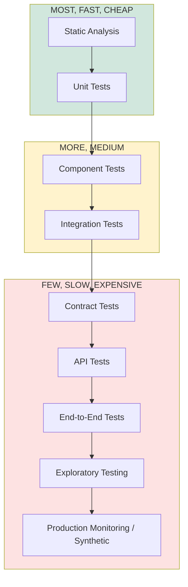

### 3.2 Layer Purpose

| Layer | What it verifies | Speed | Ownership | Primary value |
|---|---|---|---|---|
| **Static Analysis** | Format, lint, type safety, import rules, secrets | ms | Developer | Errors impossible before runtime |
| **Unit Tests** | Single unit (domain aggregate, pure function, component) in isolation | ms | Developer | Invariants and logic correctness |
| **Component Tests** | A UI component in isolation (props, states, a11y roles) | ms–s | Developer | UI behavior and accessibility |
| **Integration Tests** | Units working together (service+repo, module boundaries, adapters) | s | Developer/QA | Boundary and wiring correctness |
| **Contract Tests** | Provider/consumer agreement (API schema, event schema) | s | Developer/QA | Breaking-change protection |
| **API Tests** | Public endpoints: auth, validation, errors, pagination, idempotency | s | QA/DevOps | Wire-level behavior |
| **End-to-End Tests** | User journeys across frontend + backend + data | min | QA | Business flows work end to end |
| **Exploratory Testing** | Unscripted, risk-focused human testing | human | QA | Discovery of blind spots |
| **Production Monitoring** | Synthetic probes + real traffic observability | continuous | SRE | Production behavior and regressions |

### 3.3 Target Ratios (guidance)

| Layer | Approximate ratio (of automated tests) | Gate |
|---|---|---|
| Static + Unit | 60–70% | Per-commit |
| Component | 10–15% | Per-commit |
| Integration + Contract | 15–20% | Per-PR / nightly |
| API | 5–8% | Per-PR / nightly |
| E2E | 1–3% | Release gate / nightly |
| Synthetic | Continuous | Production |

**Balance principle:** if E2E grows beyond ~3%, the deficit is a **signal** that lower layers are missing coverage — fix the pyramid, don't grow the top (a classic trade-off: top-heavy suites are flaky, slow, and expensive).

### 3.4 Pyramid Trade-offs

| Decision | Benefit | Cost | Mitigation |
|---|---|---|---|
| Heavy unit/component base | Fast, precise, cheap feedback | Mocks can drift from reality | Contract + integration anchors |
| Contract tests | Cheap breaking-change detection | Extra test surface | Contracts shared from AIS types |
| Lean E2E set | Stable, fast release gate | Misses cross-cutting bugs | Exploratory + synthetic in production |
| Per-commit static gates | Errors stop at author's desk | Setup friction | Enforced via CI, local pre-commit |

### 3.5 Where the "Customers" Are (FAG/BAG alignment)

- The **frontend's customer is the user**: components and journeys are tested from the user's perspective (a11y roles, keyboard, states).
- The **backend's customer is the frontend and integrations**: contract and API tests protect the AIS boundary the FAG consumes.
- The **platform's customer is the operator**: synthetic monitoring, health checks, and chaos prove operational quality.

---

## 4. Test Types

This chapter defines the strategy for every test type. Each entry states **purpose, scope, who, when, and key risks**.

### 4.1 Unit Testing

- **Purpose:** verify a single unit (domain aggregate method, pure helper, state reducer) in isolation; prove invariants.
- **Scope:** domain layer (BAG Ch. 6–7) — QA gate transitions, privacy redaction, ownership rules, WorkLog duration, value objects; frontend pure logic (state, date/time, utilities).
- **Ownership:** Developer. **When:** alongside code; runs per-commit.
- **Key rule (BAG Ch. 23):** domain invariants have ≥ 90% line coverage; unit tests use in-memory fakes of ports.
- **Risks covered:** logic errors, boundary conditions, state-transition violations, formatting/parsing bugs.

### 4.2 Component Testing

- **Purpose:** verify a UI component in isolation: props, states (loading/error/empty/success), user interaction, a11y roles (FAG Ch. 5).
- **Scope:** FAG component library; DSS/DTS token application; Mission Control widgets; forms; charts accessibility.
- **Ownership:** Developer. **When:** per feature; per-commit.
- **Key rule:** component tests assert behavior through the a11y tree (roles, names) — not implementation selectors (FAG testing guidance).
- **Risks covered:** rendering regressions, interaction bugs, state leaks, contrast/role errors at component level.

### 4.3 Integration Testing

- **Purpose:** verify that units work together across a real boundary — service + repository, module → outbox → consumer, realtime subscribe/push, component + API mock.
- **Scope:** BAG Ch. 23.3 boundaries; real Mongo/Redis via testcontainers; frontend module boundaries with real state stores.
- **Ownership:** Developer/QA. **When:** per-PR + nightly.
- **Key rule:** testcontainers-based real deps; no hand-rolled mocks at the seam being verified.
- **Risks covered:** wiring bugs, mapping round-trips, optimistic-concurrency, outbox atomicity, realtime ordering.

### 4.4 Contract Testing

- **Purpose:** prove provider and consumer agree on the **contract** (AIS schemas, event envelopes) without a full system.
- **Scope:** REST schema conformance (server response ⊧ contract), event envelope conformance (publish and consume), DTO drift between backend and FAG (shared `contracts` package, BAG Ch. 4).
- **Ownership:** Developer/QA. **When:** per-PR; contract drift blocks merge.
- **Key rule (BAG Ch. 23.4):** server responses and frontend types derive from the same contract source; drift is a hard failure.
- **Risks covered:** breaking changes, schema drift, version mismatch (AIS §22).

### 4.5 API Testing

- **Purpose:** verify public endpoints at the wire level: authN/authZ, validation, errors, pagination/filtering/sorting, idempotency, rate limits, envelope conformance (AIS §8–9).
- **Scope:** all `/api/v1` endpoints; gateway behavior.
- **Ownership:** QA/DevOps. **When:** per-PR (subset) + nightly (full) + release gate.
- **Key rule:** API tests are black-box (no internal access); run against a real environment.
- **Risks covered:** contract deviations, authZ bypass, validation gaps, error-code correctness, concurrency.

### 4.6 UI Testing

- **Purpose:** verify rendered UI behavior and appearance against design intent; distinct from component tests (which are isolated) — UI tests run in a real browser.
- **Scope:** responsive behavior, theme switching (DSS/DTS), layouts, navigation, animation behavior (with motion-preference respect).
- **Ownership:** QA. **When:** per-PR (targeted) + nightly.
- **Key rule:** visual verification uses token-consistent golden baselines per theme/breakpoint (DSS/DTS) with tolerance thresholds.
- **Risks covered:** layout breakage, theme inconsistency, motion/perf regressions.

### 4.7 System Testing

- **Purpose:** verify the integrated system (services, data, realtime, jobs) as a whole against end-to-end scenarios — including degraded states.
- **Scope:** a feature across modules (e.g., task → QA → notification → Mission Control update); failure injection.
- **Ownership:** QA/SRE. **When:** nightly + release gate.
- **Risks covered:** cross-module interactions, integration defects not visible at API/E2E levels, resource behavior.

### 4.8 End-to-End (E2E) Testing

- **Purpose:** verify complete user journeys in a production-like environment through the real UI + API + data.
- **Scope:** critical journeys (BAG Ch. 23.5): registration → invite → role → permissions; task lifecycle with QA gate; privacy; realtime/offline; reports; calendar sync; file security.
- **Ownership:** QA. **When:** release gate + nightly; smoke subset per deploy.
- **Key rule:** lean and stable; E2E failures must be triaged, not ignored (flaky = bug in the test or the system).
- **Risks covered:** journey-level regressions, cross-service state, realtime propagation.

### 4.9 Regression Testing

- **Purpose:** protect existing guarantees from new change.
- **Scope:** the full automated pyramid re-run + targeted regression set per release.
- **Ownership:** QA with developer support. **When:** nightly + every release; triggered automatically on merge.
- **Key rule:** every defect fix adds a regression test that reproduces the original failure (bug → test first → fix).
- **Risks covered:** unintended breakage of QA gate, privacy, RBAC, offline sync, reports.

### 4.10 Smoke Testing

- **Purpose:** fast, shallow verification that a build/environment is alive and the critical path works — minutes, not hours.
- **Scope:** boot, login, load workspace, board renders, API health, realtime connect, key read models.
- **Ownership:** QA/DevOps. **When:** post-deploy to every environment; pre-release.
- **Key rule:** always-green requirement; a red smoke test blocks the environment.
- **Risks covered:** broken deploys, misconfig, dead services.

### 4.11 Sanity Testing

- **Purpose:** after a specific fix/change, verify the affected area still behaves (narrower than full regression).
- **Scope:** the changed feature + adjacent flows identified by impact analysis.
- **Ownership:** Developer/QA. **When:** after fixes in a release candidate.
- **Key rule:** sanity is evidence-based — it targets the change, not everything.
- **Risks covered:** fix side effects in the touched area.

### 4.12 Exploratory Testing

- **Purpose:** unscripted, session-based, risk-focused human testing to discover what scripted tests miss.
- **Scope:** new features, complex interactions (command palette, Mission Control), edge cases, a11y, mobile.
- **Ownership:** QA. **When:** per feature (risk-based), per release; charters recorded.
- **Key rule:** time-boxed charters with a mission ("Explore X under Y to find Z"); findings become bugs or new test cases.
- **Risks covered:** blind spots, UX friction, unexpected interactions, perception/feel issues.

### 4.13 Acceptance Testing

- **Purpose:** prove the delivered feature meets acceptance criteria (Given/When/Then, Ch. 2.4) — the business says "this is what we asked for."
- **Scope:** feature ACs mapped to automated tests + manual confirmation where needed.
- **Ownership:** QA + Product. **When:** feature completion, release gate.
- **Key rule:** AC traceability is required (Ch. 19 traceability matrix).
- **Risks covered:** delivered-but-not-required behavior, unmet requirements.

### 4.14 User / Alpha / Beta Testing

- **Purpose:** validate real usability, value, and edge behavior with real users before/after launch.
- **Scope:** Alpha (internal testers, feature-complete core), Beta (selected external users, near-production).
- **Ownership:** Product + QA (instrumentation, feedback triage). **When:** per WPS §18.1 phase gates.
- **Key rule:** telemetry and feedback pipelines (Ch. 14) capture issues from real usage to feed the regression suite.
- **Risks covered:** adoption friction, real-world data shapes, platform variety.

### 4.15 Compatibility Testing

- **Purpose:** ensure behavior across supported browsers, OS, devices, resolutions, and the desktop/mobile surfaces (WPS roadmap).
- **Scope:** evergreen browsers × OS (per FAG support matrix); breakpoints (DSS); desktop vs. mobile; future Electron/PWA surface.
- **Ownership:** QA. **When:** per release (targeted matrix) + nightly (rotating matrix).
- **Key rule:** matrix is defined by FAG support policy and pruned deliberately (never "we test everything").
- **Risks covered:** platform-specific rendering, layout, input, storage, realtime behavior.

### 4.16 Accessibility Testing

- **Purpose:** verify WCAG 2.2 AA (Ch. 12) — keyboard, focus, screen readers, contrast, motion, forms, charts.
- **Scope:** every UI feature; design-token contrast; component a11y roles.
- **Ownership:** Developer (component-level) + QA (E2E + audits) + Accessibility champion (review).
- **When:** every PR (static + component a11y), per release (full audit).
- **Key rule:** a11y gates are hard (Ch. 15); failures block merge/release.
- **Risks covered:** excluded users, compliance, keyboard dead-ends, contrast failures.

### 4.17 Security Testing

- **Purpose:** verify security controls (BAG Ch. 21): authN/authZ/RBAC, workspace isolation, input validation, injection, XSS/CSRF, replay, secrets, dependencies, plugins, AI.
- **Scope:** full security pipeline (Ch. 11): SAST/DAST/IAST, dependency audit, manual pentest cadence, red-team for enterprise.
- **Ownership:** Security Engineer + QA security specialists. **When:** continuous (CI) + periodic (releases) + adversarial (quarterly).
- **Key rule:** security findings follow the bug lifecycle with severity-based SLA (Ch. 20).
- **Risks covered:** the entire threat model (BAG Ch. 21.1).

### 4.18 Performance Testing

- **Purpose:** verify the system meets latency budgets and scales (BAG Ch. 22.7).
- **Scope:** frontend, backend, database, search, realtime, jobs, caching, files, reports, Mission Control, AI (Ch. 13).
- **Ownership:** SRE/Performance Engineer with QA support. **When:** continuous budgets + scheduled load/stress + pre-release.
- **Key rule:** performance is a budget with alerts, not a one-time benchmark (Ch. 13).
- **Risks covered:** regressions, capacity surprises, hot-workspace degradation.

### 4.19 Load / Stress / Chaos / DR Testing

| Type | Purpose | Example for FocusFlow |
|---|---|---|
| **Load** | Verify behavior at expected peak (capacity model per plan) | 10k concurrent workspace sessions; report burst |
| **Stress** | Find the breaking point and behavior beyond it | Saturation beyond peak; queue pile-up behavior |
| **Soak** | Verify stability over time (leaks, drift) | 24–72 h sustained mixed load |
| **Chaos** | Verify resilience under injected failure (BAG Ch. 22.9) | Kill Redis/Mongo/search/queue; measure degraded path |
| **DR** | Verify backup/restore and recovery objectives | Restore drill; region-loss scenario (Ch. 8, 14) |

- **Ownership:** SRE with QA. **When:** scheduled per milestone + chaos in staging before release + DR quarterly (BAG Ch. 25.7).
- **Key rule:** chaos/DR must never run in production without explicit approved window (staging first).

### 4.20 Offline Testing

- **Purpose:** verify offline queue, temp IDs, conflict resolution, sync, merge, and recovery (Ch. 10; AIS offline model; FAG offline).
- **Scope:** the offline contract end to end — device offline → queue → reconnect → sync cursor → conflict handling.
- **Ownership:** QA with developer support. **When:** per offline-affecting change + nightly + release gate.
- **Key rule:** offline is a first-class contract, tested with fault injection and network throttling, not only happy-path reconnection.

### 4.21 Realtime Testing

- **Purpose:** verify presence, live updates, Mission Control, notifications, live progress, WebSocket recovery, and synchronization (Ch. 9).
- **Scope:** Socket.IO gateway behavior; room/capability mapping; ordering; recovery; backpressure.
- **Ownership:** QA with backend support. **When:** per realtime-affecting change + nightly.
- **Key rule:** realtime tests are deterministic — they control event ordering, connections, and failure points (no time-dependent sleeps).
- **Risks covered:** missed/duplicate/out-of-order events, presence staleness, capability leaks, reconnect storms.

### 4.22 Plugin Testing

- **Purpose:** verify plugin lifecycle, isolation, capability scoping, and core integrity (BAG Ch. 26).
- **Scope:** install/disable/uninstall; sandbox isolation; permission enforcement; event/command boundaries; marketplace review tests.
- **Ownership:** QA + Security + Plugin Manager. **When:** per plugin release + continuous (sandbox fuzzing).
- **Key rule:** plugins are tested as untrusted third-party code: capability overreach, resource abuse, and crash containment are primary risks.

### 4.23 AI Validation Testing

- **Purpose:** verify AI outputs are correct, scoped, safe, and explainable (Ch. 21; BAG Ch. 27).
- **Scope:** summaries, insights, suggestions; context scoping; privacy redaction; provenance; model behavior over time.
- **Ownership:** AI Engineer + QA AI specialists. **When:** continuous (prompt regression) + per model/config change.
- **Key rule:** AI testing is evidence-driven (Ch. 21): every claim verified against labeled datasets and provenance.

### 4.24 Test-Type Selection Matrix

| Scenario | Primary types | Depth |
|---|---|---|
| New domain rule (QA gate, ownership) | Unit (invariant) + Integration | Deep |
| New endpoint | API + Contract + Validation | Deep |
| New UI page | Component + a11y + UI + E2E | Medium |
| New realtime channel | Realtime + Integration | Deep |
| Offline change | Offline + E2E | Deep |
| Security control change | Security + API (authZ) | Deep |
| AI workload | AI validation + Performance | Deep |
| Backend worker/job | Unit + Integration + Jobs | Medium |
| Visual/theme change | UI (token consistency) + a11y | Medium |

---

## 5. Frontend Testing

### 5.1 Strategy Overview

Frontend quality verifies the FAG architecture and the UXS/DSS/DTS experience: **behavior through the a11y tree, token-consistent appearance, responsive and motion-safe rendering, resilient state, and correct offline behavior.** The pyramid: component (most) → UI/integration (some) → E2E (few).

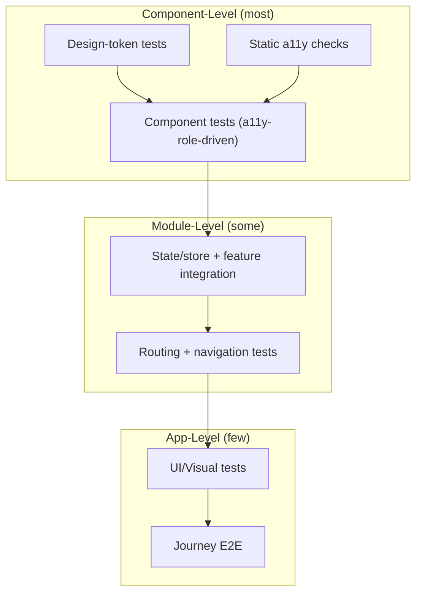

### 5.2 Components

- Test each component: props, states (loading/empty/error/success), interactions, a11y roles/names, theme variants.
- Query by role/name/label (user-visible), never by implementation selector.
- Motion tests respect `prefers-reduced-motion` (DSS motion guidance): reduced-motion users must get equivalent content without animation.
- Keyboard: full component operable by keyboard alone (Ch. 12).

### 5.3 Layouts & Responsive Design

- Test at DSS breakpoints: layout integrity, no overflow, no hidden-forever content, correct reflow.
- Golden-visual baselines per breakpoint per theme, with tolerance thresholds (Ch. 4.6).
- Verify tables/charts adapt: horizontal scroll + accessible caption, chart summaries remain readable (Ch. 12).

### 5.4 Forms

- Validation: required, format, max-length, cross-field (server is authoritative; client UX is tested as UX).
- Error display: inline, announced to screen readers (`aria-live`), focus moved to first error.
- Submission: loading, success, failure, idempotency (no double-submit), offline queueing (Ch. 10).
- Autofill/paste; disabled states; label/name association.

### 5.5 Routing & Navigation

- Route correctness: deep links, param handling, 404s, redirects (auth redirect per role), back/forward.
- Command palette (UXS): search → selection → navigation; keyboard-first operation; empty/typo states.
- Navigation state preserved on route change (query filters, tab position) where FAG specifies.

### 5.6 Theme Switching (DSS/DTS)

- Token tests: components render only from tokens (no hard-coded colors/spacing); both light/dark (and future contrast themes) apply correctly.
- Contrast: every theme/state combination meets WCAG 2.2 AA (Ch. 12); verified automatically.
- Persistence: theme preference persists; switch is instant and consistent across routes; system-preference respect (DSS).

### 5.7 State Management

- Test store reducers/actions as units; feature integration tests with real store + mocked API (per FAG state architecture).
- Derived state: board filters, Mission Control metrics, timeline aggregation — tested against fixture projections.
- **Stale/async correctness:** loading → data → error transitions; cancellation of outdated requests (races) covered.
- Optimistic updates (FAG): apply → reconcile → rollback on failure, verified in integration tests.

### 5.8 Offline Behaviour (frontend)

- Offline queue behavior: enqueue, badge/indicator, persistence across reload (Ch. 10).
- Temporary IDs: client-generated IDs used optimistically; reconciliation with server IDs after sync.
- Conflict UI: user is informed; resolution follows AIS merge semantics (Ch. 10).
- Network-state transitions: online→offline→online (throttled), no lost user input, no corrupted state.

### 5.9 Animations & Motion

- Motion correctness per DSS: durations, easing, reduced-motion compliance.
- Perf: animation smoothness (no jank) — instrument via frame stats in perf tests (Ch. 13).
- Content safety: no information conveyed by motion alone (a11y Ch. 12).

### 5.10 Accessibility (frontend)

- Static a11y lint on every component (Ch. 12); role/name assertions in component tests; full audit per release.
- Focus management: modals, command palette, timelines; visible focus indicator.
- Screen-reader flows for critical journeys (E2E with real assistive tech in QA; automated heuristics in CI).

### 5.11 Mission Control

- Data rendering: live metrics update correctly from projections (realtime); empty/loading states; refresh on reconnect.
- Aggregations correctness vs. fixture data (worklogs, task states, sprint health).
- Interaction: drill-down navigation; keyboard access; chart accessibility (Ch. 12).
- Realtime-driven updates don't cause visual thrash; cached then pushed updates reconcile (FAG cache + realtime).

### 5.12 Workspace

- Workspace tree/boards/lists/timelines render from projections; navigation across projects/teams.
- Create/edit task flows (modal vs. inline) behave per UXS; optimistic + server reconcile.
- Permissions-aware UI: what a Developer vs. Viewer sees/does is enforced server-side but rendered correctly (no dead actions, clear empty states).
- Template and workflow configuration flows (WPS) verified against role capabilities.

### 5.13 Dashboard

- Widgets render correct data from their read-model slices; filters/sort/pagination (cursor) work.
- Report/export flows: request → progress → ready → download (async path, BAG Ch. 14).
- Empty/error/partial-data states per widget are tested (robustness).

### 5.14 Frontend Test Ownership & Gates

| Layer | Owner | Gate |
|---|---|---|
| Static a11y + lint + type | Developer | Per-commit |
| Component + token tests | Developer | Per-PR |
| Store/feature integration + routing | Developer/QA | Per-PR |
| UI/visual + theme matrix | QA | Nightly + release |
| E2E journeys | QA | Release gate |

---

## 6. Backend Testing

### 6.1 Strategy Overview

Backend quality verifies the BAG architecture: **domain invariants at the core, wiring and boundaries at the edges, and cross-module behavior through contracts and events.** Backend tests are predominantly fast unit/integration tests with real dependencies via testcontainers (BAG Ch. 23).

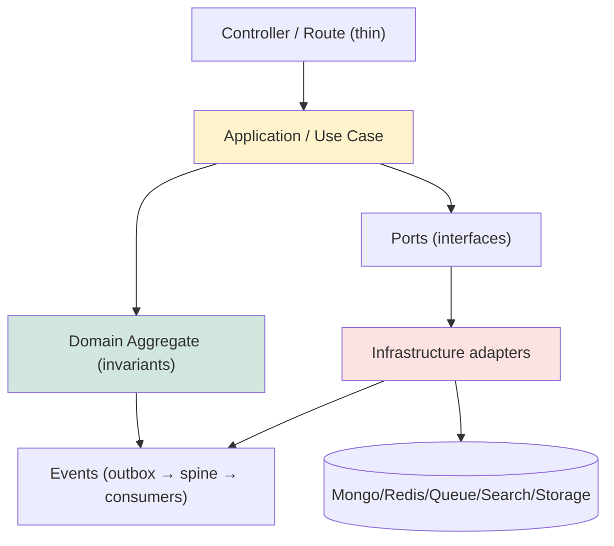

### 6.2 Domain Layer

- **Purpose:** prove business invariants with no infrastructure.
- **Tests:** every aggregate method and its transitions (BAG Ch. 7.3); QA gate transitions (WPS §3.6.3 + Owner override audit), ownership rules (DDD §2.5), privacy boundary redaction (DDD §13.3), WorkLog duration rules (DDD §4.4), value-object validations.
- **Technique:** in-memory fakes of ports; deterministic clocks/IDs (injectable `Clock`/`IdProvider`, BAG Ch. 6.2).
- **Gate:** ≥ 90% line coverage on domain layer (BAG Ch. 23.7).

### 6.3 Application Layer

- **Purpose:** verify use-case orchestration: validation, authorization, command/query separation (BAG Ch. 8).
- **Tests:** each use case with fake ports: authorized/unauthorized, invalid input, aggregate-not-found, event published on success, idempotency-key behavior.
- **Key checks:** `UseCaseContext` threading (memberId, workspaceId, capabilities, correlationId); envelope mapping (AIS §8–9); capability enforcement (BAG Ch. 12).
- **Gate:** use cases covered per-PR for changed code.

### 6.4 Repositories

- **Purpose:** verify persistence mapping, scoping, and concurrency (BAG Ch. 9).
- **Tests (integration, real DB):** save/load round-trips via mappers; optimistic-concurrency conflict (`_version` guard); workspace-scoped queries always applied; cursor pagination correctness.
- **Privacy:** repository-level tests assert that member-private reads are impossible cross-member (structural, BAG Ch. 12.4).
- **Gate:** per-PR for changed repos; nightly full.

### 6.5 Events

- **Purpose:** verify the event backbone (BAG Ch. 10): outbox atomicity, relay, spine append-only, consumer idempotency, schema conformance, replay/rebuild.
- **Tests:** outbox write+event atomic on failure; relay publishes exactly once (at-least-once); projectors idempotent on duplicate delivery; replay from `afterPosition` rebuilds read models; DLQ behavior on poison.
- **Contract:** event envelope schema validated on publish and consume (Ch. 4.4).
- **Gate:** nightly full + per-PR for changed event flow.

### 6.6 Queues & Jobs

- **Purpose:** verify job lifecycle and reliability (BAG Ch. 14).
- **Tests:** enqueue → process → complete/failed; retry with backoff; max-attempts → DLQ; idempotency on duplicate job id; progress checkpoints; cron schedule correctness.
- **Chaos-adjacent:** worker crash mid-job → re-queue → resume without duplicate side effects.
- **Gate:** per-PR for changed jobs; nightly.

### 6.7 Authentication

- **Purpose:** verify BAG Ch. 11: token issue/refresh/rotation, revocation, session lifecycle, credential storage, multi-workspace scope.
- **Tests:** login success/failure (rate-limited), token expiry, refresh rotation invalidates old, logout revokes, revoked session denied (Redis deny-list), credential hashing (bcrypt cost), MFA path, invite magic-link validity window.
- **Security:** brute-force/rate-limit tests; token claim verification (iss/aud/exp/jti).
- **Gate:** API-level, per-PR for auth changes + release gate.

### 6.8 Authorization

- **Purpose:** verify BAG Ch. 12: role→capability resolution, enforcement points, QA override, privacy boundary.
- **Tests:** capability matrix coverage (every role × every capability per AIS §21 table); deny-by-default; workspace-scope enforcement; QA-gate override capability (Owner-only) + audit event; capability cache invalidation on role change.
- **Key rule:** authorization tests run at API level (black-box) **and** service level (guard unit tests).
- **Gate:** per-PR for permission changes + release gate.

### 6.9 Search

- **Purpose:** verify indexing pipeline and query behavior (BAG Ch. 17).
- **Tests:** indexer transforms events → indexed docs (workspace-partitioned, redacted); upsert idempotency; tombstone deletes; query capabilities (full-text, facets, cursor, ranking); lag within SLA; reindex rebuild.
- **Privacy:** no member-private data in index (structural verification).
- **Gate:** nightly + per-PR for search changes.

### 6.10 Notifications

- **Purpose:** verify notification pipeline (events → workers → delivery channels).
- **Tests:** notification produced per triggering event; dedupe; batching; delivery success/failure/retry; subscription preferences respected (per member, WPS); realtime push + email/desktop path; privacy (mentions only to intended members).
- **Gate:** per-PR for notification changes + nightly.

### 6.11 Realtime (backend)

- **Purpose:** verify BAG Ch. 13: subscribe authz, room mapping, ordering, recovery, presence, backpressure.
- **Tests:** subscribe requires capability+workspace scope; session revoke drops socket; per-room ordering; offline cursor resume; presence heartbeat/expiry; Redis-adapter fan-out across instances (integration with 2 instances).
- **Gate:** nightly + per-PR for realtime changes (Ch. 9).

### 6.12 Caching

- **Purpose:** verify BAG Ch. 18: cache-aside correctness, event-driven invalidation, TTL backstop, Redis-failure degradation.
- **Tests:** read → miss → populate; invalidate on event; read-after-write freshness; Redis down → cache bypass → projection (no inconsistency); jittered TTL behavior.
- **Gate:** per-PR for cache changes + nightly.

### 6.13 AI Services

- **Purpose:** verify BAG Ch. 27: intelligence gateway, context scoping/redaction, output artifact validation, provenance, guardrails, fallback.
- **Tests:** context builder refuses non-consented data; outputs conform to artifact schema; provenance recorded; sensitive-content filter; provider failure → typed error + fallback; rate/cost quotas enforced. (Full AI-quality strategy: Ch. 21.)
- **Gate:** per-PR for AI changes + nightly + model/config-change pipeline (Ch. 21).

### 6.14 Plugins (backend)

- **Purpose:** verify BAG Ch. 26: lifecycle, sandbox isolation, capability grants, resource quotas, core integrity.
- **Tests:** install/disable/uninstall; permission overreach blocked; crash contained (core survives); timeout + circuit on callbacks; audit trail completeness; marketplace verification (signature/checksum).
- **Gate:** per-plugin release (independent gate) + continuous sandbox fuzzing.

### 6.15 Backend Gate Summary

| Area | Primary type | Minimum frequency |
|---|---|---|
| Domain | Unit | Per-commit/PR |
| Application | Unit | Per-PR |
| Repositories | Integration (real DB) | Per-PR + nightly |
| Events/outbox | Integration | Per-PR + nightly |
| Queues/jobs | Integration | Per-PR + nightly |
| AuthN/AuthZ | API | Per-PR + release |
| Search/Notifications | Integration/API | Nightly |
| Realtime | Integration | Nightly |
| AI | AI-validation | Per model change + nightly |
| Plugins | Security + integration | Per plugin release |

---

## 7. API Testing

### 7.1 Strategy Overview

API tests are **black-box, wire-level** verifications of the public surface defined by the AIS. They run against a real environment through the gateway — the same path the FAG and integrations use.

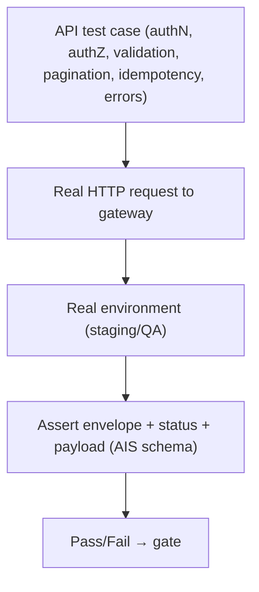

### 7.2 Authentication

- Login success/failure; wrong password; unknown user (generic error, no oracle); locked/rate-limited account (429 + `Retry-After`).
- Access token expiry → 401; refresh rotation; reuse of rotated token → denied; logout → revocation; revoked session → 401 everywhere.
- MFA: challenge → success/failure; recovery codes single-use.
- Invitation magic-link: valid window, single-use, workspace scoping, expiry.

### 7.3 Authorization

- Capability matrix: every role × protected action (AIS §21) → expected 200/403.
- Workspace isolation: member of workspace A cannot read/write workspace B (both same role) — **structural** check, never by guessing IDs.
- Deny-by-default: unknown capability → 403; member with no membership → 403/404 (no leak).
- QA-gate override: Owner-only; non-Owner denied; override audited.
- Membership change: role change reflected immediately (capability cache invalidation verified).

### 7.4 Validation

- Field types, required, max-length, format (email, URL, date), enum values — per AIS field rules and DSS/DTS text guidance.
- Cross-field validation; nested validation errors aggregated (`invalid_request` with field issues, AIS §9).
- Oversized payloads; malformed JSON; unknown fields (policy per AIS: reject or ignore — tested to contract).
- **Server is authoritative:** client-sent invalid data is rejected regardless of UI.

### 7.5 Pagination

- Cursor semantics (AIS): opaque cursor, stable ordering, `next_cursor`/`has_more`; empty pages; last page ends cleanly.
- Cursor stability under concurrent writes (no duplicates/omissions within a page batch).
- Page-size bounds: requested size clamped; oversized rejected/accepted per contract.
- Off-by-one at boundaries (size = total, total+1).

### 7.6 Filtering

- Filter params validated; unknown filter rejected or ignored per contract.
- Combination of filters (status + assignee + tags) correctness; empty-result filters; filter + pagination combined.
- Privacy filters: member-private data never returned for others (structural assertion).

### 7.7 Sorting

- Sortable fields per AIS; direction asc/desc; multi-key sort stability; invalid sort key rejected.
- Sort + filter + pagination combined determinism.

### 7.8 Caching

- Cache-control headers honored (`Cache-Control`/`ETag` per AIS); conditional GET (304) correctness.
- After a write, hot read models reflect new state within SLA (read-after-write via realtime/projection) — no stale-cache leak.
- Cache invalidation on entity events verified at API level (indirect via response freshness).

### 7.9 Concurrency

- Optimistic concurrency: stale version → 409 `conflict` with fresh read path (AIS §9).
- Concurrent identical writes → idempotency dedupe → single effect, same response.
- Concurrent conflicting writes on one aggregate → exactly one succeeds per version; no partial states.

### 7.10 Rate Limiting

- Per-member/workspace/IP limits (BAG Ch. 21.4) → 429 `rate_limited` + `Retry-After`; burst behavior; after window reset, requests succeed.
- Limit headers present and consistent; abuse signals produce audit events.

### 7.11 Idempotency

- Same `Idempotency-Key` + same payload → same response, single side effect (replay test: duplicate request).
- Same key + different payload → `idempotency_conflict` (409).
- Key TTL expiry → new request treated fresh.
- Idempotency across retries of transient failures (network drop mid-request).

### 7.12 Error Responses

- Envelope conformance (AIS §8–9): code, message, requestId/correlationId, detail, retryability.
- Error taxonomy mapped correctly (Ch. 4.5 / BAG Ch. 20): 400/401/403/404/409/429/5xx.
- No stack traces, no internal detail, no secrets in errors; generic messages for security errors (no oracle).
- `Retry-After` present on retryable codes; 5xx classified retryable per contract.

### 7.13 Performance (API level)

- Per-endpoint budgets (BAG Ch. 22.7) asserted in perf pipeline (Ch. 13): p50/p95/p99 within budget.
- Slow-endpoint regression detection via perf baseline comparisons.

### 7.14 Compatibility & Versioning

- Versioned endpoints (AIS §22): old version continues to work after new version ships; deprecated headers/warnings; breaking-change policy verified (no silent breakage).
- Backward compatibility of additive changes (new optional fields don't break old clients).
- Contract conformance for each versioned surface.

### 7.15 API Test Organization

| Test suite | Runs | Environment |
|---|---|---|
| Critical-path smoke (login + workspace + board) | Post-deploy | Every env |
| Full API regression (all endpoints × roles) | Nightly | QA/Staging |
| Contract conformance (schema drift) | Per-PR | CI (contract-only) |
| Performance (budget assertions) | Per release + nightly | Staging |
| Security (authZ matrix, rate limits) | Per-PR + release | QA/Staging |

---

## 8. Database Testing

### 8.1 Strategy Overview

Database quality verifies the DDD design and BAG repository architecture: **data integrity, relationships, transactions, indexes, migrations, backup/restore, performance, and consistency** — against real databases (testcontainers for tests, staging for schema/perf).

### 8.2 Data Integrity

- Constraint verification: required fields, enums, lengths, unique keys (email, slug, membership pairs) — enforced and tested at the repository boundary (BAG Ch. 9).
- No orphaned references: created entities reference existing aggregates (test with seeded DDD fixtures).
- Optimistic concurrency: `_version` increments and stale-write rejection (BAG Ch. 9.1).
- Privacy: member-private fields never readable cross-member at the data layer (structural test).

### 8.3 Relationships

- Aggregates ↔ children (task → worklogs, sprint → tasks) consistency via events/projections.
- Membership relationships (member ↔ workspace ↔ role) integrity.
- Reference integrity is **event-enforced** (no FKs in Mongo): tests verify tombstone/soft-delete semantics keep references consistent (DDD, SAD ADR 5).

### 8.4 Transactions

- **Single-aggregate transaction rule** (DDD §2.4): write + outbox event are atomic (rollback test: fail persist → no event leaked).
- No distributed transactions: cross-aggregate flows are event-driven — tests verify eventual consistency within SLA.
- Failure injection: mid-transaction crash leaves no partial aggregate state.

### 8.5 Indexes

- Every DDD §10 index verified: present in schema, used by hot queries (explain-plan checks in perf tests), no redundant indexes (index bloat detected nightly).
- Index builds time-boxed and safe (BAG Ch. 25.5): migration applies without outage; test on cloned staging data.

### 8.6 Migration Testing

- **Forward:** schema migration applies cleanly on staging data at production scale and shape.
- **Backward (downgrade path):** rollback plan executed and verified (additive changes are backward-compatible; BAG Ch. 25.5).
- **Idempotency:** re-running a migration is safe (no-op on repeat).
- **Data migration:** existing data transformed correctly (row-count and sample assertions); dry-run in CI against synthetic dataset + staging snapshot.
- **Zero-downtime:** migrations complete within allowed window; new code is compatible with old schema and vice versa (per AIS versioning).

### 8.7 Archive Strategy

- Retention-driven archival (spine/read-model retention, BAG Ch. 10.8): archived records no longer served; export path verified before archive.
- Orphan file cleanup and reference tombstones tested (Ch. 16 in BAG).
- Audit retention: exports before prune; append-only spine never rewritten.

### 8.8 Backup & Restore

- **Backup:** snapshots + point-in-time per BAG Ch. 25.7; backup integrity checks (restorable, consistent).
- **Restore:** quarterly restore drill (BAG Ch. 25.7) — time to restore within RTO; restored data passes integrity smoke (login, board, reports).
- **Recovery (DR):** region-loss scenario; read models rebuilt from event spine replay (BAG Ch. 10.6); outbox/queue recovery to exactly-once-effect semantics (at-least-once + idempotency).

### 8.9 Performance

- Query plan review for hot paths (board load, timeline, Mission Control, search slices).
- Index-backed sort/filter; no unbounded scans (BAG Ch. 22.4); p95 within budget under load (Ch. 13).
- Hot-workspace isolation: a large workspace doesn't degrade others (partition-aware behavior).

### 8.10 Consistency

- **Read-model lag:** projection lag within SLA (< 5 s p95, BAG Ch. 22.7); monitored in staging + production (Ch. 14).
- **Eventual consistency:** after a write burst, projections converge within SLA; no permanent divergence (nightly consistency checks).
- **Rebuild:** full projection rebuild from spine yields state identical to live (replay tests, BAG Ch. 10.6).

### 8.11 Database Test Matrix

| Concern | Test type | Frequency |
|---|---|---|
| Integrity/constraints | Repository integration | Per-PR |
| Transactions/outbox atomicity | Integration + fault injection | Per-PR + nightly |
| Indexes/explain plans | Perf/DB tests | Nightly |
| Migrations (forward/back/idempotent) | DB pipeline (staging data) | Per-PR + release |
| Backup/restore/DR | Drill | Quarterly |
| Consistency/lag | Staging + prod monitoring | Continuous |
| Archive/retention | Integration | Nightly |

---

## 9. Realtime Testing

### 9.1 Strategy Overview

Realtime behavior is a first-class contract (AIS realtime/offline; BAG Ch. 13; FAG realtime). Tests are **deterministic**: they control event ordering, connection state, and failure points — no time-dependent sleeps.

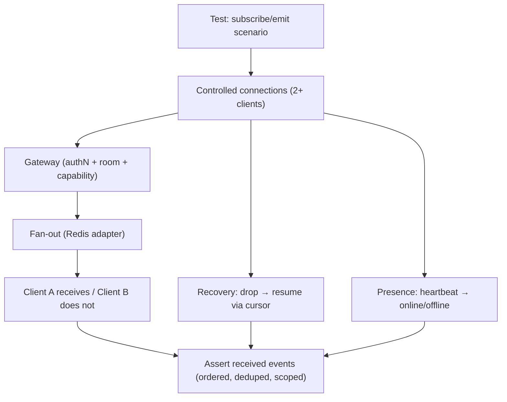

### 9.2 Presence

- Login → online; logout/session revoke → offline; heartbeat refresh; inactivity timeout → offline (config).
- Presence is per-member room; privacy (opt-in for focus, BAG Ch. 13.6).
- Presence converges across multiple realtime instances (Redis adapter).
- Focus privacy: member in focus does not leak presence/activity to others (DDD §13.3).

### 9.3 Mission Control

- Live metric updates pushed correctly from projections (task states, worklogs, sprint health).
- Subscribed member receives updates only for their workspace scope; capabilities respected.
- High-frequency updates are batched/coalesced without visual thrash (reconcile with cache, FAG).
- Reconnect resumes to latest projection state (no missed metric, no stale freeze).

### 9.4 Notifications

- Event → notification → realtime push (mention, status change, QA request) reaches intended member only.
- Preferences respected; dedupe (no double notifications); batching per policy.
- Offline members receive queued notifications on reconnect (sync cursor, AIS offline model).

### 9.5 Live Progress

- Long-running flows (report generation, intelligence, imports) stream progress states (queued → running → done/failed) correctly.
- Progress idempotent: duplicate/restated events don't double-count.
- Completion push includes result reference (read model) consistent with projection.

### 9.6 Workspace Activity

- Universal Timeline (UXS) live entries: correct ordering, dedupe, member visibility rules.
- Presence/typing-style indicators (where FAG specifies) scoped to room and capabilities.

### 9.7 Sprint Updates

- Sprint events (start, close, task moved) propagate to all board subscribers with correct ordering.
- Per-aggregate ordering preserved (BAG Ch. 10.5); cross-aggregate ordering not guaranteed — clients reconcile by cursor.

### 9.8 WebSocket Recovery

- Drop → reconnect with backoff → resume via sync cursor (no gap, no duplicate).
- Session revoked mid-connection → socket terminated, no further events.
- Server restart (drain → re-establish): rooms re-subscribed; presence reconciled (BAG Ch. 13.7).
- Reconnect storm protection: backoff jitter; server accepts after auth re-validation.

### 9.9 Connection Loss

- Degraded mode (polling/sync cursor) when realtime unavailable (BAG Ch. 13.7); client recovers automatically; data still consistent.
- No silent data loss: server-side projections are truth; UI converges on reconnect.

### 9.10 Synchronization

- Realtime is a hint; projections are truth (BAG Ch. 13.5). Tests assert: after reconnect, UI state == projection state (consistency oracle).
- Cross-instance fan-out correctness (2 realtime instances integration test).
- Backpressure: slow consumer → bounded queue, drop-oldest only for non-critical metrics; critical events always delivered.

### 9.11 Realtime Test Scenarios (minimum)

| Scenario | Verify |
|---|---|
| Subscribe authz | Capability + workspace required; denial produces no events |
| Ordered updates | Task lifecycle events received in order per room |
| Scoped delivery | Only intended members receive |
| Reconnect resume | Cursor replay fills gap exactly |
| Revoke mid-session | Connection dropped, no further events |
| Two-instance fan-out | Both clients on different instances receive |
| Presence lifecycle | Online → offline on timeout/revoke |
| Focus privacy | No cross-member leak during focus |
| Backpressure | Slow consumer doesn't break critical path |

---

## 10. Offline Testing

### 10.1 Strategy Overview

Offline is an **end-to-end contract** (AIS offline model; FAG offline queue; BAG offline-ready). Tests simulate network transitions with fault injection and throttling — never only happy-path reconnection.

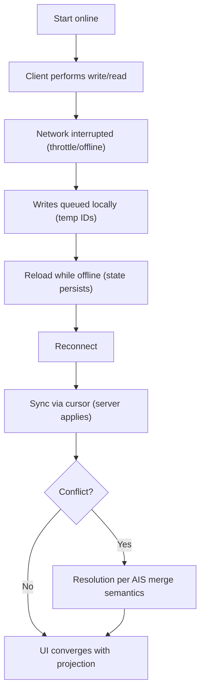

### 10.2 Offline Queue

- Writes enqueued while offline (create/update/delete commands) with full payload + `Idempotency-Key`.
- Queue persists across reload (FAG storage); user sees pending indicator.
- Queue bounded: overflow policy defined and tested (block with guidance, never silent loss).
- Reads: cached projections served; stale marked appropriately.

### 10.3 Conflict Resolution

- Same-entity edit offline vs. server: resolution follows AIS merge semantics (server-side anchors, LWW with conflict event logged — BAG Ch. 15.6).
- Conflict surfaced to user with options; never silently overwritten without event.
- Deterministic outcome: same input → same resolution (replay tests).

### 10.4 Synchronization

- Reconnect triggers sync via cursor; order preserved per entity; idempotent application (no duplicates from retries).
- Sync progress visibility; large queues sync in batches; failures retry with backoff.
- Server responses (success/failure per item) mapped back to queued items; temp IDs reconciled with server IDs.

### 10.5 Temporary IDs

- Client-generated temp IDs used optimistically; after sync, references (task↔subtask, comments) resolve to server IDs.
- Reconciliation correctness: no dangling temp refs; UI updates references atomically.
- Temp ID collisions avoided (ULID-based, DDD §4).

### 10.6 Retry

- Failed sync items retried with exponential backoff + jitter; item-level success/failure granularity.
- `Idempotency-Key` prevents duplicate side effects on retry.
- Permanently failing items (validation) surfaced with reason; not retried forever.

### 10.7 Merge Strategy

- Merge outcomes verified per AIS: server-wins fields, client-wins fields, append-only collections (comments, worklogs) merge correctly.
- WorkLog duration integrity after merge (DDD §4.4 — no double-counted time).
- QA-gate state machine safe under offline edits (cannot bypass gate offline).

### 10.8 Recovery

- Crash/reload during sync: resume from cursor, no corruption.
- Full offline→online convergence assertion: UI state == projection state after settle.
- Offline-then-expired-auth: re-authenticate (refresh) before sync; queue preserved through auth transition.

### 10.9 Offline Test Techniques

| Technique | Use |
|---|---|
| Network throttling/offline simulation | Realistic transitions (mobile + desktop) |
| Cache-control toggles | Fresh vs. stale projection reads |
| Fault injection (API/WS drops) | Retry/backoff paths |
| Restart/reload mid-sync | Durability of queue + cursor |
| Multi-device offline | Cross-device conflict scenarios |
| Clock manipulation | Expired temp refs, TTLs |

### 10.10 Offline Gate Scenarios (minimum)

1. Offline create → reload → reconnect → appears with server ID.
2. Offline edit conflicts with server edit → resolved + conflict event logged.
3. Offline worklog entries merge without double-count (DDD §4.4).
4. Reconnect with expired session → re-auth → queue preserved → sync completes.
5. Crash mid-sync → resume without duplicates (idempotency).

---

## 11. Security Testing

### 11.1 Strategy Overview

Security verification is **continuous and layered** (BAG Ch. 21): static at commit, dynamic per-PR/release, adversarial periodically. It verifies the BAG threat model (Ch. 21.1) through automated pipelines and manual expertise.

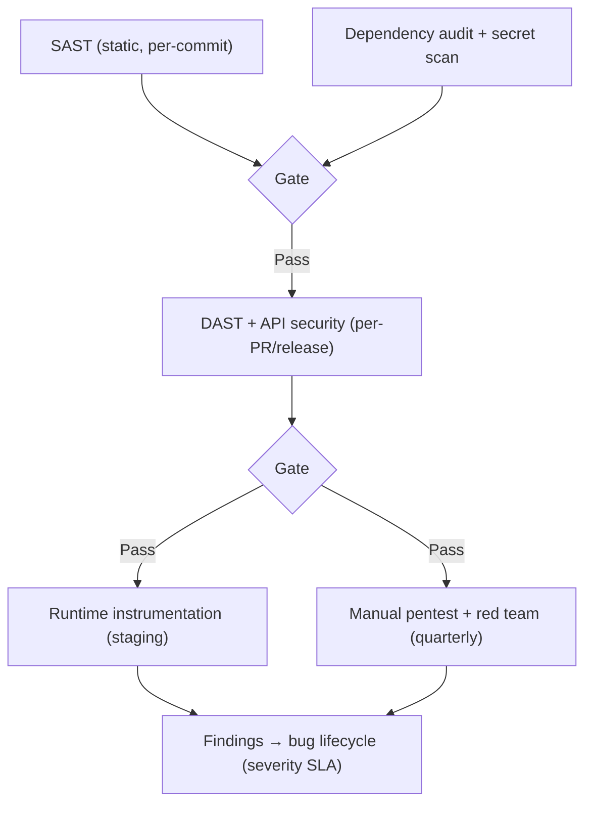

### 11.2 Authentication

- Credential handling (bcrypt cost, no plaintext/reversible); MFA flows; token lifecycle (issue/refresh/rotate/revoke).
- Rate limiting on login/register/invite; account lockout; generic error messages (no user enumeration oracle).
- Session hijacking surface: HttpOnly cookies, CSRF, jti rotation, denial lists (BAG Ch. 11.5).

### 11.3 Authorization (incl. RBAC & Workspace Isolation)

- Capability matrix tests (every role × action, AIS §21) at API level.
- **Workspace isolation:** cross-workspace access attempts (read/write, IDs guessed/enumerated) → denied; no data leak via error/response differences.
- **RBAC:** role change propagation (capability cache invalidation); deny-by-default; QA override Owner-only.
- **Horizontal/vertical privilege tests:** low-priv member cannot escalate; Viewer cannot mutate.
- **Realtime isolation:** subscribe to another workspace's room → denied (Ch. 9).

### 11.4 Input Validation & Injection

- NoSQL injection: malicious query operators in filters/IDs neutralized (typed specs, BAG Ch. 9).
- Command injection, path traversal (file access by ID only, BAG Ch. 16), SSRF (ACL allow-lists, BAG Ch. 15).
- Payload size limits; type confusion; unicode edge cases.
- All validation is server-side; tested with adversarial input sets (fuzzing on boundaries).

### 11.5 XSS & CSRF

- XSS: stored (rich text sanitization), reflected, DOM-based; sanitize-on-ingest verified (BAG Ch. 21.6).
- CSRF: token enforcement for cookie-transported auth; SameSite verification; state-changing requests without token → rejected.
- Content-type/sniffing headers; no executable content returned.

### 11.6 Replay Attacks

- Idempotency keys dedupe replayed writes (Ch. 7.11); webhook signatures + timestamp window (BAG Ch. 15.3).
- JWT nonce/exp/jti; token replay after logout → denied.
- Realtime cursor replay cannot cause duplicate side effects.

### 11.7 Secrets

- No secrets in code/logs/repos (secret-scanning gate, Ch. 15); env-injected KMS-managed (BAG Ch. 21.3).
- Provider tokens encrypted at rest, masked in logs, rotation verified.
- API/webhook secrets single-display (never re-returnable); rotation flow tested.

### 11.8 Dependency Scanning

- Lockfile audit per-commit; critical/high → block (BAG Ch. 21.8).
- Supply chain: checksum/signature verification; no floating ranges; reproducible builds.
- Runtime image surface minimized (distroless) — verified in build pipeline (BAG Ch. 25.3).

### 11.9 Plugin Security

- Sandbox isolation; capability overreach blocked; resource quotas; crash containment (BAG Ch. 26).
- Marketplace verification (signature/checksum); install requires Owner/Admin; audit trail completeness.
- Malicious plugin fuzzing: events/commands beyond granted scope rejected; DoS via plugin calls contained.

### 11.10 AI Security

- Prompt injection resistance: untrusted content cannot redirect AI outputs (guardrails, BAG Ch. 27.4).
- Context scoping: AI never receives non-consented/member-private data (DDD §13.3).
- Output safety: sensitive-content filter; injection via AI-generated content into XSS surfaces (verified at output boundary).
- Provenance + audit for AI actions; no write-path bypass (BAG Ch. 27.1).

### 11.11 Security Test Frequency & Ownership

| Activity | Frequency | Owner | Gate |
|---|---|---|---|
| SAST + secret scan + dependency audit | Per-commit | Dev/Sec | Blocking |
| API security (authZ matrix, injection, rate limits) | Per-PR + release | QA-Sec | Blocking |
| DAST/IAST (staging) | Per-release | QA-Sec | Blocking |
| Webhook/CSRF/replay suite | Per-PR (webhook/contract changes) | Dev/Sec | Blocking |
| Plugin sandbox fuzz | Continuous | Sec | Blocking (plugin) |
| Manual pentest | Quarterly | External/Internal Sec | Advisory |
| Red team (enterprise phase) | Semi-annual | Sec | Advisory |

### 11.12 Security Risk Priorities (BAG threat model)

| Risk | Severity | Test depth |
|---|---|---|
| Workspace isolation breach | Critical | Deep (API + realtime + data layer) |
| AuthZ bypass | Critical | Deep (matrix + adversarial) |
| Secrets exposure | Critical | Deep (static + runtime) |
| Replay/CSRF | High | Medium |
| XSS/injection | High | Medium-Deep |
| Plugin/SSRF | High | Deep |
| AI misuse | High | Deep (Ch. 21) |
| DoS/rate | Medium | Medium |

---

## 12. Accessibility Testing

### 12.1 Strategy Overview

Accessibility is a **hard requirement** (WCAG 2.2 AA), built into the design system (DSS/DTS) and verified continuously. The workflow combines automated checks at every level with periodic expert audits and real assistive-technology testing.

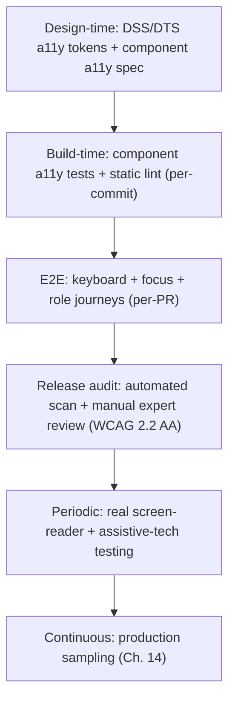

### 12.2 WCAG 2.2 AA Baseline

- All new features and components **must** meet WCAG 2.2 AA (new/updated criteria included: focus not obscured, dragging alternatives, accessible authentication, consistent help).
- DSS/DTS tokens guarantee contrast at design time; automated checks enforce at build time.
- Conformance statement per release: automated + manual evidence (Ch. 19 a11y score).

### 12.3 Keyboard

- Every interactive element operable by keyboard (Tab order logical, no keyboard traps, shortcuts with documented disclosure — command palette, etc.).
- Keyboard-accessible drag/reorder with a non-drag alternative (WCAG 2.2 drag criterion).
- Focus order matches visual order in boards, timelines, tables, Mission Control.

### 12.4 Focus

- Visible focus indicator everywhere (DSS focus tokens).
- Focus management: modals trap + return, command palette opens/closes with focus, error focus-to-field, timeline/feeds manage focus on update (no scroll jumps on realtime push — UXS).
- Focus not obscured by sticky headers/toasts (WCAG 2.2).

### 12.5 Screen Readers

- Correct landmarks, headings, labels, and live regions (`aria-live` for realtime updates and async status).
- Tables and charts have accessible captions/summaries; chart data available in non-visual form (Mission Control).
- Real assistive-tech testing for critical journeys (task lifecycle, board, command palette, offline indicator) periodically.

### 12.6 Contrast

- All text/UI meets AA contrast (DSS/DTS tokens) in every theme (light/dark/contrast) and state (hover, focus, disabled, selected).
- Charts/status colors distinguishable without color alone (patterns/labels in addition to color).
- Automated contrast checks per theme; visual audits for charts.

### 12.7 Touch Targets

- Minimum target size per DSS (and WCAG 2.2 target-size guidance) on all touch surfaces; adequate spacing.
- Responsive touch behavior: tap zones not overlapped; multi-touch gestures have alternatives (drag alternative).

### 12.8 Motion

- `prefers-reduced-motion` respected: essential content/state changes never conveyed by motion alone; animations reduced or removed.
- Motion triggered by interaction vs. on-load distinction (DSS motion guidance); no seizure-risk flashing content.

### 12.9 Responsive

- Accessibility preserved across breakpoints: no content hidden forever, no trap at any size, readable zoom at 200% and reflow (no horizontal loss of meaning).
- Tables/boards degrade accessibly (scroll with caption, or alternate presentation).

### 12.10 Tables & Charts

- Tables: proper headers/scope, captions, no merged-cell traps, sorting announced.
- Charts (Mission Control, reports): accessible text summary, color-plus-pattern encoding, keyboard navigation for interactive charts, screen-reader description.

### 12.11 Forms

- Labels/name association for all inputs; error messages linked + announced; required indicated programmatically; autocomplete attributes where applicable.
- Multi-step forms: step announcements, progress state, review/confirm accessible.
- Time/date inputs (calendar sync, scheduling) have accessible alternatives (text input + validation).

### 12.12 Accessibility Checklist (enforced)

- [ ] Component meets DSS/DTS a11y spec (roles, focus, contrast, motion)
- [ ] Static a11y lint clean
- [ ] Component tests assert a11y roles/names/keyboard behavior
- [ ] E2E keyboard + focus journeys pass
- [ ] Automated scan (per-page, per theme) below threshold
- [ ] Manual expert review for new feature (risk-based)
- [ ] Real screen-reader test for critical journeys (periodic)
- [ ] No information conveyed by color/motion alone
- [ ] Reduced-motion mode respected
- [ ] Contrast AA in all themes/states

### 12.13 Accessibility Ownership & Gates

| Level | Owner | Gate |
|---|---|---|
| Design tokens/spec | Design systems (DSS/DTS) | Design review |
| Component/static checks | Developer | Per-commit/PR |
| Keyboard/focus E2E | QA | Per-PR + release |
| Automated scan + audit | QA a11y specialist | Release gate |
| Real assistive tech | QA + external users | Quarterly + beta |

---

## 13. Performance Testing

### 13.1 Strategy Overview

Performance is a **budget enforced continuously** (BAG Ch. 22.7), not a one-time benchmark. The pipeline runs baseline comparisons, budget assertions, and scheduled load/stress/soak/chaos campaigns.

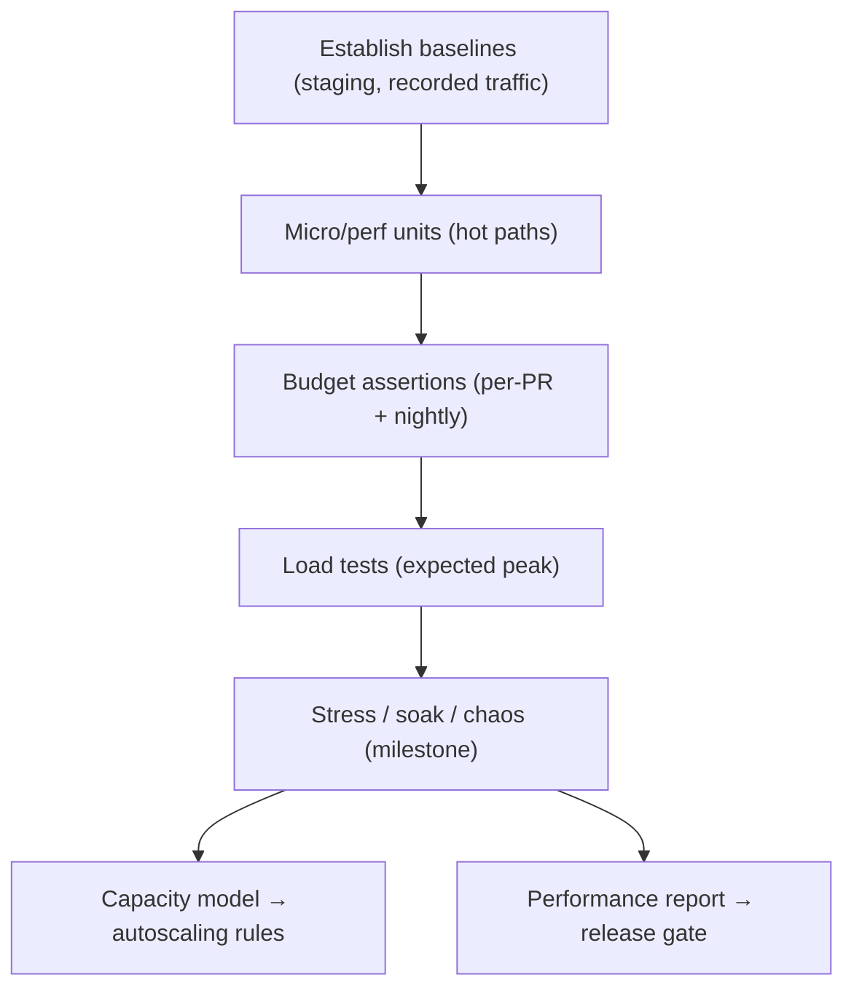

### 13.2 Frontend Performance

- Bundle size budgets (FAG build config); code-splitting verification; no runaway bundles.
- Core Web Vitals per route (LCP, INP, CLS) at representative devices; regressions alert.
- Rendering perf: list virtualization on boards/timelines; no jank (frame stats); reduced-motion perf path.
- Memory: long sessions (Mission Control live updates) don't leak (soak on frontend).

### 13.3 Backend Performance

- Per-endpoint budgets (BAG Ch. 22.7): p50 < 150 ms, p95 < 500 ms, p99 < 1 s (excluding jobs).
- Gateway overhead, authN/authZ latency, read-model serving, cache hit/miss paths.
- CPU-bound work correctly moved to workers (no event-loop blockage); event-loop delay monitored.

### 13.4 Database Performance

- Query plans for hot paths; index-backed operations; no unbounded scans (Ch. 8.9).
- Read replicas/projections serve hot reads; write store protected.
- Lock/contention under concurrent writes; hot-workspace isolation (partition-aware).

### 13.5 Search Performance

- Search query latency < 100 ms p95 (BAG Ch. 22.7); facet/aggregation cost; index lag < 60 s alert.
- Reindex/rebuild impact measured (doesn't degrade serving).
- Query under load (concurrent search during high activity).

### 13.6 Realtime Performance

- Push latency < 200 ms p95 (BAG Ch. 22.7); fan-out capacity; large-workspace fan-out bounded.
- Reconnect storm behavior (N clients reconnect) — server stable, presence converges.
- Backpressure: slow consumers don't block critical events.

### 13.7 Background Jobs

- Job processing time by queue; queue depth/backlog; DLQ behavior.
- Report generation and intelligence within expected duration (async progress); no head-of-line blocking of critical queues.
- Worker concurrency tuning verified under load.

### 13.8 Caching

- Cache hit rates; TTL/jitter correctness; invalidation storms avoided (thundering herd).
- Redis capacity; eviction behavior; cache-aside latency under miss.
- Degraded (Redis down) path latency — within degraded budget.

### 13.9 File Upload

- Direct-to-object-storage upload throughput (BAG Ch. 16); concurrent uploads; large-file behavior; thumbnail pipeline latency.
- Upload doesn't degrade API latency (isolated path).

### 13.10 Reports & Mission Control

- Report generation async with progress; generation duration budgets by report type/volume.
- Mission Control live updates under high event rate — UI stable, no backlog growth.
- Dashboard load with large datasets (render + query budgets).

### 13.11 AI

- Intelligence request latency (queued → result) budgets; cost per request monitored.
- Batching under load; provider fallback latency; no regression in non-AI paths during AI load.

### 13.12 Scalability Targets

- Capacity model per workspace tier (WPS plans): concurrent members, sessions, events/sec, reports/hour.
- Horizontal scale tests: adding service/worker instances reduces latency/backlog proportionally (BAG Ch. 22.1–22.6).
- Statelessness verified under scale (any instance serves any request; no affinity leaks).

### 13.13 Latency Budgets (summary — authoritative in BAG Ch. 22.7)

| Metric | Budget |
|---|---|
| Request p50 | < 150 ms |
| Request p95 | < 500 ms |
| Request p99 | < 1 s |
| Event → projection lag | < 5 s p95 |
| Realtime push | < 200 ms p95 |
| Search query | < 100 ms p95 |
| Report generation | Async, progress-tracked |

### 13.14 Performance Pipeline & Gates

| Stage | Runs | Gate |
|---|---|---|
| Perf unit/budget tests | Per-PR (hot paths) | Non-blocking alert → nightly blocking |
| Baseline comparison | Nightly | Regression > threshold → fail |
| Load tests | Milestone + pre-release | Capacity target met |
| Stress/soak | Milestone | Break point documented |
| Chaos (perf impact) | Pre-release staging | Degraded path within budget |
| Production trend monitoring | Continuous | Alerts (Ch. 14) |

### 13.15 Performance Test Data & Environments

- Performance tests run on **staging with production-shaped data** (anonymized volume, realistic distribution, Ch. 16).
- Synthetic load reflects WPS usage patterns (boards, worklogs, realtime, reports).
- Test isolation: dedicated perf environment (no concurrent CI interference) for load/stress.

---

## 14. Observability

### 14.1 Strategy Overview

Observability is how quality is verified **in production** and how the next test cycle learns from production (Observability-Driven Testing). It implements the BAG observability model (Ch. 19) and closes the loop: production evidence → test backlog → future regression suites.

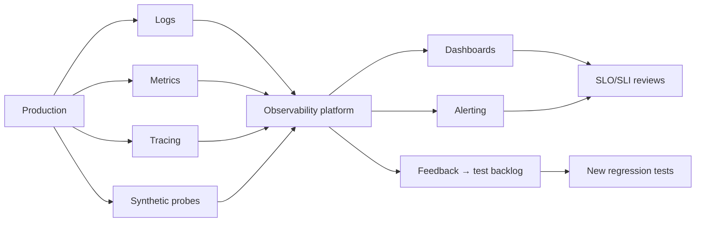

### 14.2 Logging

- Structured logs (Winston/Pino per BAG Ch. 19.2) with required fields: `correlationId`, `requestId`, `memberId`, `workspaceId`, service, event/job, duration, status.
- No PII/secrets/member-private data in logs (verified by lint + runtime checks).
- Log at boundaries: gateway, service entry/exit, outbox, consumers, external calls, jobs.
- Log quality gates: new code with logs must include correlationId threading (Ch. 6.15, BAG Ch. 24).

### 14.3 Metrics

- RED (request rate/errors/duration) + USE (utilization/saturation/errors) per BAG Ch. 19.3.
- Queue metrics (depth, active, delayed, failed), projection lag, index lag, cache hit rate, external-provider health, event-loop delay, resources.
- Product metrics: realtime push latency, report generation duration, AI cost, Mission Control backlog.
- **SLOs** (from BAG budgets + availability expectations): error budget tracking per service.

### 14.4 Tracing

- OpenTelemetry spans (BAG Ch. 19.5): gateway → service → repo → outbox → consumer → external.
- Span attributes: `workspaceId`, `aggregateId`, `operation`, `provider`, `queue`; trace-to-log correlation via `traceId`.
- Sampling strategy verified: hot paths sampled, jobs/events full.

### 14.5 Error Reporting

- Central error reporting for all 4xx/5xx, job failures, DLQ events, outbox failures.
- Error grouping by root-cause signature; stack traces sanitized (no secrets/PII).
- Error trends feed the risk register (Ch. 20) and regression backlog.

### 14.6 Crash Reporting

- Frontend crash reporting (FAG): crashes grouped by route/component; user context (workspace-scoped, PII-safe).
- Backend crash: process-level restart observability; crash dump capture policy.
- Crash trends → top fixes prioritized in quality reviews (Ch. 20).

### 14.7 Performance Monitoring (RUM + APM)

- Real User Monitoring: Core Web Vitals per route (LCP/INP/CLS), real device distribution.
- APM: request traces, slow queries, dependency latency.
- Performance trends compared to BAG budgets (Ch. 13.13); drift → alert → perf backlog.

### 14.8 Synthetic Monitoring

- Synthetic probes in production for critical journeys: login, workspace load, board, Mission Control, realtime connect, report generation.
- Frequency: high-frequency for health, low-frequency for depth (journey step assertions).
- Synthetics verify: availability, key latency, functional health of the critical path (Ch. 4.19 complement).

### 14.9 Health Checks

- Liveness (process up) and readiness (DB/Redis/queue/search reachable) per BAG Ch. 19.7.
- Readiness gates routing; degraded dependency → readiness reports unready → traffic drained.
- Health-check contract tested in staging; used by orchestration (future K8s, BAG Ch. 25.9).

### 14.10 Alerting

- Alert tiers (P1/P2/P3) with ownership and runbooks (BAG Ch. 19.4 thresholds).
- Alert quality: no page-on-noise; alert fatigue controlled; every alert has an owner + runbook link.
- On-call rotation per service area; post-incident process feeds bug backlog and test additions (Ch. 20).

### 14.11 Observability-Driven Testing Loop

| Production signal | Action in QA |
|---|---|
| New error signature | Add regression test reproducing it |
| RUM slow route | Perf test for that route; budget added |
| Projection lag spike | Consistency test + capacity review |
| Realtime latency p95 breach | Realtime perf test + backpressure review |
| Crash cluster in component | Component test + E2E for the flow |
| AI cost/model drift | AI validation pipeline update (Ch. 21) |

### 14.12 Observability Quality Gates

- [ ] Every service/module exports structured logs with correlationId
- [ ] RED/USE metrics exposed for every service + queue
- [ ] Traces span the full path (gateway→consumer)
- [ ] Error/crash reporting integrated with PII-safe redaction
- [ ] Synthetic probes cover all critical journeys
- [ ] Dashboards exist per service area; alerts have runbooks
- [ ] SLOs defined; error budgets tracked

---

## 15. CI/CD Quality Gates

### 15.1 Strategy Overview

Quality gates are **automated, blocking, and staged** — the cheapest gate runs first, and nothing proceeds past a failed gate. This implements the BAG CI pipeline (Ch. 25.2) with quality verification at every stage.

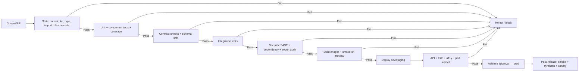

### 15.2 Static Analysis

- Formatting (Prettier), lint (ESLint + import rules, BAG Ch. 24), TypeScript strict.
- Secrets scan; no `any`; no cross-module imports; no dead code.
- **Gate:** blocking per-commit/PR; zero-tolerance on errors.

### 15.3 Unit Tests & Coverage

- Unit + component suites run per-PR; domain coverage ≥ 90%, overall ≥ 80% (BAG Ch. 23.7).
- **Gate:** coverage thresholds enforced on changed code (no coverage drop); failing test blocks merge.
- Determinism: no flaky/order-dependent tests (flaky detection → quarantine → fix).

### 15.4 Integration Tests

- Real dependencies via testcontainers (Mongo/Redis/queue/search) for repository/outbox/queue/realtime integration (Ch. 6).
- **Gate:** per-PR for affected modules + nightly full suite.

### 15.5 Contract Tests

- Server response conformance to AIS schemas; event envelope conformance (publish + consume).
- DTO drift between backend and FAG (shared `contracts` package) → hard fail (BAG Ch. 23.4).
- **Gate:** per-PR blocking; schema versioning respected (AIS §22).

### 15.6 Security Scans

- SAST, dependency audit (critical/high block), secret scan (Ch. 11.8, BAG Ch. 21.8).
- **Gate:** blocking; exemptions require security-owner approval with expiry.

### 15.7 Accessibility

- Static a11y lint + component a11y assertions per-PR; automated scan thresholds per release.
- **Gate:** blocking for new UI; a11y score must not regress (Ch. 12, 19).

### 15.8 Performance

- Perf unit/budget tests on hot paths per-PR (alert-level); baseline comparison nightly (blocking on regression > threshold).
- **Gate:** no budget regression in changed hot paths; full budget assertion at release gate.

### 15.9 Build Validation

- Reproducible, immutable, signed builds (distroless images, BAG Ch. 25.3).
- Image size/contents checks; no secrets baked.
- **Gate:** blocking; artifact immutability verified.

### 15.10 Deployment Approval

- Manual/automated approval before prod; deploy via canary/blue-green (Ch. 18).
- Deployment requires: release gate green (API + E2E + a11y + perf subset), security sign-off, runbook/dashboards ready.
- **Gate:** explicit approval; emergency hotfix path documented (fast, still smoke-gated).

### 15.11 Gate Summary Table

| Gate | Runs | Blocking | Owner |
|---|---|---|---|
| Static (format/lint/type/imports/secrets) | Per-commit | Yes | Developer |
| Unit + component + coverage | Per-PR | Yes | Developer |
| Contract + drift | Per-PR | Yes | Developer/QA |
| Integration | Per-PR (affected) + nightly | Yes | Developer/QA |
| Security (SAST/deps/secrets) | Per-commit/PR | Yes | Security |
| Accessibility (static/component) | Per-PR | Yes | Developer/QA |
| Performance (budgets) | Per-PR (alert) + nightly (block) | Yes at release | SRE/Perf |
| Build validation | Per-PR | Yes | DevOps |
| API + E2E | Release gate + nightly | Yes | QA |
| Deployment approval | Release | Yes | Release Manager |

### 15.12 Flaky Test Policy

- Any flaky test is a **defect** (test or system); triaged with SLA.
- Quarantine + fix under priority; unquarantined failures block.
- Flake rate tracked (Ch. 19) as a developer-experience metric.

---

## 16. Test Data Strategy

### 16.1 Strategy Overview

Test data is **managed, versioned, isolated, and privacy-safe**. The strategy provides deterministic data for tests, realistic data for performance, and anonymized production data for integration/staging.

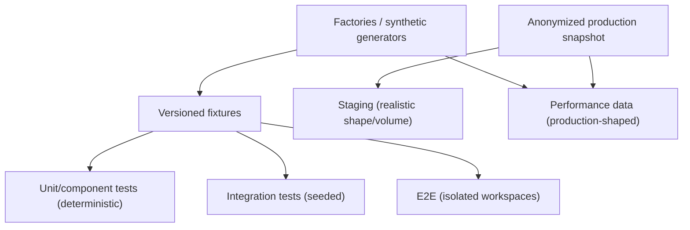

### 16.2 Seed Data

- Baseline seed: roles, workspace types, permissions matrix, sample projects/tasks/sprints — aligned to DDD entities and WPS workspace types.
- Seed versioning: seeds evolve with schema; migration of seeds tested (Ch. 8.6).
- Seeds are deterministic (fixed ULIDs where stability needed) for reproducible assertions.

### 16.3 Fixtures

- Versioned fixture sets for domain scenarios: QA-gate transitions, privacy scenarios, offline conflicts, realtime ordering, report volumes.
- Fixtures live with the modules that own them (BAG module structure); shared fixtures in a common test package.
- Schema-validated against contracts (a fixture out-of-contract fails fast).

### 16.4 Factories

- Data factories generate valid entities from defaults (task, worklog, membership, project, document) with override capabilities.
- Factories respect invariants: cannot produce invalid aggregates (QA gate impossible states), so tests focus on behavior not construction.
- Property-based helpers for value objects (email, duration, slugs) to broaden coverage.

### 16.5 Mock Services

- External integrations (calendar, git, CI/CD, Slack) mocked at the ACL boundary (BAG Ch. 15) with recorded contract fixtures.
- Time: deterministic `Clock` (BAG Ch. 6.2) for schedules, TTLs, presence, retries.
- Providers: recorded responses replayed; failure modes injectable (timeout, 429, circuit-open).

### 16.6 Synthetic Data

- Generators produce realistic, production-shaped data: project sizes, worklog distributions, sprint histories, realtime event rates, report volumes.
- Used for performance, load, and soak tests (Ch. 13) and for large-UI rendering tests.
- Statistical realism validated (distributions match WPS usage patterns).

### 16.7 Anonymized Production Data

- Snapshots of production data **anonymized** (PII/member-private fields irreversibly transformed; DDD §13.3 respected).
- Used in staging for realistic integration/perf; never member-identifiable.
- Governance: anonymization verified by automated checks + spot audit; access restricted.
- Refresh cadence: periodic snapshot refresh on a schedule; consumers handle versioned shapes.

### 16.8 Versioning

- Test-data version matches schema/contract version; a fixture set is valid for exactly one contract version.
- Seed/fixture migration tested with schema migrations (Ch. 8.6) to catch data-shape drift.

### 16.9 Isolation

- Test data is **isolated per test run** (transaction rollback or dedicated DB/workspace per suite).
- No cross-test leakage: E2E uses fresh isolated workspaces per run.
- Parallel-safe: data generation is partition-aware (no shared mutable fixtures).
- Anonymized staging data never mixed with unit/integration fixtures.

### 16.10 Test Data Ownership

| Data type | Owner |
|---|---|
| Fixtures/factories/seeds | Feature teams (with QA) |
| Synthetic generators | Perf/QA |
| Anonymized production pipeline | Data/Platform (with Security) |
| Mock provider contracts | Integration/QA |

---

## 17. Environment Strategy

### 17.1 Strategy Overview

Environments are **purpose-built, promotion-aligned, and data-managed** so that verification at each stage reflects what will actually reach production (BAG Ch. 25.1).

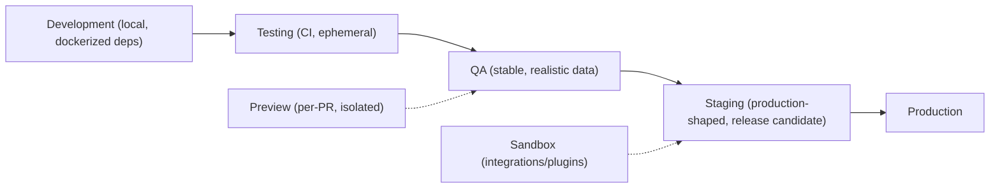

### 17.2 Development

- Local environment with dockerized dependencies (Mongo, Redis, queue, search, storage) per BAG Ch. 25.1.
- Fast feedback: static + unit + component gates locally (pre-commit).
- Seeded minimal data for development; determinism for local debugging.

### 17.3 Testing (CI)

- Ephemeral environments created per-PR/nightly; parallel; disposable.
- Full dependency set (testcontainers); contract + integration + security suites.
- **Gate:** every PR must pass in a clean ephemeral environment (no local-only green).

### 17.4 QA

- Stable environment for manual + exploratory + acceptance testing; realistic (anonymized) data.
- Full API + E2E + a11y suites; risk-based test cycles (Ch. 20).
- Feature-flag states configurable to test in-progress features.

### 17.5 Staging

- **Release candidate** environment: production-shaped data (volume + distribution), production-like config, performance + chaos + DR tests.
- Mirrors production topology as closely as feasible (BAG Ch. 25.1).
- **Gate:** staging green is required for production approval.

### 17.6 Production

- Canary/blue-green deployments (Ch. 18); synthetic monitoring + RUM + APM live.
- Feature flags enable gradual exposure; post-release validation (Ch. 18.8).
- Read-only access for QA via least-privilege tooling; never direct prod data mutation in tests.

### 17.7 Preview

- Per-PR isolated preview for visual/UX review (FAG-driven), a11y spot checks, and early PM feedback.
- Auto-deployed per PR; auto-destroyed on merge/close.

### 17.8 Sandbox

- Integration sandbox for external providers (calendar sync, webhooks) and **plugin development** (BAG Ch. 26): isolated credentials, no production data.
- Webhook/marketplace verification runs in sandbox.

### 17.9 Data Management

| Env | Data source | Refresh |
|---|---|---|
| Development | Local seeds | On demand |
| Testing/CI | Fixtures + factories | Per run |
| QA | Anonymized snapshot (subset) + seeds | Weekly |
| Staging | Anonymized snapshot (full shape) | Weekly |
| Sandbox | Synthetic + integration fixtures | On demand |
| Production | Real | N/A |

- Staging/QA anonymization verified before use (Ch. 16.7).
- No production data in development/CI; no development data in staging (config guard).

### 17.10 Configuration

- Typed, validated config (Zod at boot, BAG Ch. 25.4); environment-specific values injected; secrets never in config files.
- Config drift detection between staging and production (same deployment artifacts, differing only by env values).
- Feature flags consistent per environment matrix (dev/QA/staging/prod) with kill-switch capability (Ch. 18.6).

---

## 18. Release Quality

### 18.1 Strategy Overview

Release quality is about **controlled, reversible, evidence-backed deployment**. Releases follow a pipeline that verifies at every step and provides fast rollback (BAG Ch. 25.8).

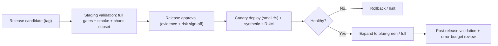

### 18.2 Definition of Done (release)

A release is Done only when:
- [ ] All CI/CD gates green on the release candidate (Ch. 15).
- [ ] Staging validated: full API + E2E + a11y + perf + security subset.
- [ ] Smoke green post-deploy to staging.
- [ ] Rollback plan exercised (rehearsed) and ready.
- [ ] Feature flags verified; kill-switch paths tested.
- [ ] Dashboards/runbooks updated; on-call briefed.
- [ ] Post-release validation defined and scheduled.

### 18.3 Release Checklist (summary — full checklist in Ch. 20)

| Stage | Items |
|---|---|
| Pre-release | Gates green, RC tagged, changelog, flag states, rollback plan |
| During | Canary metrics watched, smoke, synthetic, no error-budget breach |
| Post | RUM/APM review, SLO review, incident-free watch window, feedback → backlog |

### 18.4 Feature Readiness

- Feature passes its own quality lifecycle before inclusion: DoD met, AC traceability verified, exploratory + acceptance done (Ch. 2, 4).
- Risk assessment per feature (Ch. 20 risk matrix) determines release depth (canary percentage, watch window).
- In-progress features ship **off** behind feature flags (never half-done in production).

### 18.5 Rollback Readiness

- Immutable artifacts → rollback = redeploy previous tag (BAG Ch. 25.8).
- **Schema backward compatibility** (additive migrations, AIS versioning) so code rollback is safe.
- Realtime/queue drain during rollback; cursors resume.
- Rollback rehearsed in staging before every release; rollback runbook current.

### 18.6 Feature Flags & Canary

- Feature flags: staged rollouts, kill-switch, A/B (BAG Ch. 25.4). Flag behavior tested: on/off/percentage states; no dead-code branches (expired flags removed).
- Canary: small traffic → health checks (error rate, latency, RUM) → expand/halt decision with automated + human gates.
- Realtime-sensitive features: canary verifies realtime health (push latency, reconnect) before full rollout.

### 18.7 Blue-Green Strategy

- Blue (current) / Green (new): switch with zero-downtime; immediate revert by DNS/router flip (BAG Ch. 25.8).
- Realtime/websockets: drain + re-establish handled by design (BAG Ch. 13.7); verified in staging rehearsals.
- Database dual-compat during switchover (migrations additive) verified.

### 18.8 Post-Release Validation

- Immediate: smoke + synthetic on production; error rates, latency, queue depth within budget.
- Watch window (per release risk): RUM/APM, SLO/error-budget review, anomaly detection.
- 24–72 h: soak observation for memory/queue drift (Ch. 13 soak).
- Post-release report: evidence, metrics, incidents, learnings → backlog and process improvements (Ch. 20).

### 18.9 Emergency Hotfix Path

- Documented fast path: small patch, full static + smoke gates (reduced but never zero), expedited approval, canary-minimum, watch window.
- Hotfixes still respect schema compatibility and rollback; hotfix learnings fed back to prevent recurrence.

### 18.10 Release Ownership

| Role | Responsibility |
|---|---|
| Release Manager | Gate coordination, approval, watch window |
| QA | Release evidence, smoke, E2E gate, post-release validation |
| SRE/DevOps | Deploy, canary/blue-green execution, rollback, monitoring |
| Security | Security sign-off, incident triage |
| Tech Leads | Risk assessment, rollback readiness |
| Product | Feature-readiness sign-off, go/no-go input |

---

## 19. Quality Metrics

### 19.1 Strategy Overview

Metrics make quality **visible, measurable, and improvable** (Evidence-Driven Testing). A small, meaningful set of metrics is tracked with targets, trends, and ownership — not a metric zoo.

### 19.2 Coverage

| Metric | Target | Notes |
|---|---|---|
| Domain line coverage | ≥ 90% | Structural invariants (QA gate, privacy, ownership) |
| Overall line coverage | ≥ 80% | BAG Ch. 23.7 |
| Branch coverage (domain) | ≥ 85% | State transitions |
| Traceability | 100% of ACs mapped to tests | AC→test matrix (Ch. 2.4) |

- Coverage is trended, not gamed: coverage of **changed code** is the operative gate (Ch. 15.3).

### 19.3 Defect Density

- Defects per 1,000 LOC (or per feature area) per release.
- **Purpose:** identify high-risk areas; compare areas within product, not across companies.
- Trend: stable-or-decreasing density signals effective shift-left.

### 19.4 Bug Escape Rate

- **Escape rate** = bugs found in production ÷ (bugs found in test + production) per release.
- Target: < 5% for high-severity bugs (P1/P2); trending down.
- Feed: post-release incidents traced to the gate that should have caught them (blameless, Ch. 20).

### 19.5 MTTR / MTBF

| Metric | Definition | Target |
|---|---|---|
| MTTR | Mean time to restore (incident → resolved) | Per SLO; trending down |
| MTBF | Mean time between failures | Stable/increasing for core |

- MTTR tracked per severity; post-incident reviews improve runbooks + automation (Ch. 14, 18).

### 19.6 Performance

- Latency budgets (Ch. 13.13) trended per release: p50/p95/p99, realtime push, search, projection lag.
- Core Web Vitals per route; RUM trends vs. lab perf tests.
- Gate: regression > threshold → release risk.

### 19.7 Accessibility Score

- Automated a11y score per release (per page, per theme) + manual audit coverage.
- Target: WCAG 2.2 AA conformance; score never regresses; zero critical a11y findings.
- Tracked: total violations, keyboard dead-ends, contrast failures by theme.

### 19.8 Security Score

- Security posture score: open findings by severity, time-to-remediate, scan coverage (SAST/DAST/deps).
- Target: zero critical/high open beyond SLA; dependency audit clean at release.
- Trend: remediation velocity (Ch. 20 severity SLA).

### 19.9 Release Stability

- Release success rate (deploy → healthy watch window without rollback).
- Rollback rate; hotfix rate per release cadence.
- Target: ≥ 98% release success; rollback rate trending down.

### 19.10 Regression Rate

- Regression defects per release (bugs that break previously-passing behavior).
- Target: trending down; every regression requires a test-gap review (why wasn't it caught).

### 19.11 Build Success Rate

- CI green rate (PRs passing on first/second run).
- Flake rate (Ch. 15.12).
- Target: ≥ 95% first-pass; flake rate < 1%.

### 19.12 Developer Experience Metrics

| Metric | Purpose |
|---|---|
| Time from commit to merge (CI duration) | Feedback speed |
| Flake rate | Trust in tests |
| Local gate time | Shift-left friction |
| Test suite duration (full) | Release velocity |
| Coverage confidence | Do developers trust the suite? |

- DX metrics are reviewed in quality reviews; high friction → invest in faster/stable tests.

### 19.13 Metrics Dashboard & Reviews

- Single quality dashboard (CI green, coverage, escape rate, perf, a11y, security, release stability, SLOs).
- **Quality review cadence:** per-release quality report + per-milestone deep review (Ch. 20).
- Every metric has an owner; trends drive backlog priorities.

### 19.14 Metric Anti-Patterns

- Avoid: vanity metrics (total test count), coverage gaming, targets without owners, metrics without action loops.
- **Rule:** a metric without an owner and a decision is decoration; every metric on the dashboard changes a decision or a backlog item.

---

## 20. QA Governance

### 20.1 Strategy Overview

Governance makes quality **owned, repeatable, and continuously improved**: bug lifecycle, severity/priority discipline, test planning, review process, quality reviews, documentation standards, test ownership, and approval workflows.

### 20.2 Bug Lifecycle

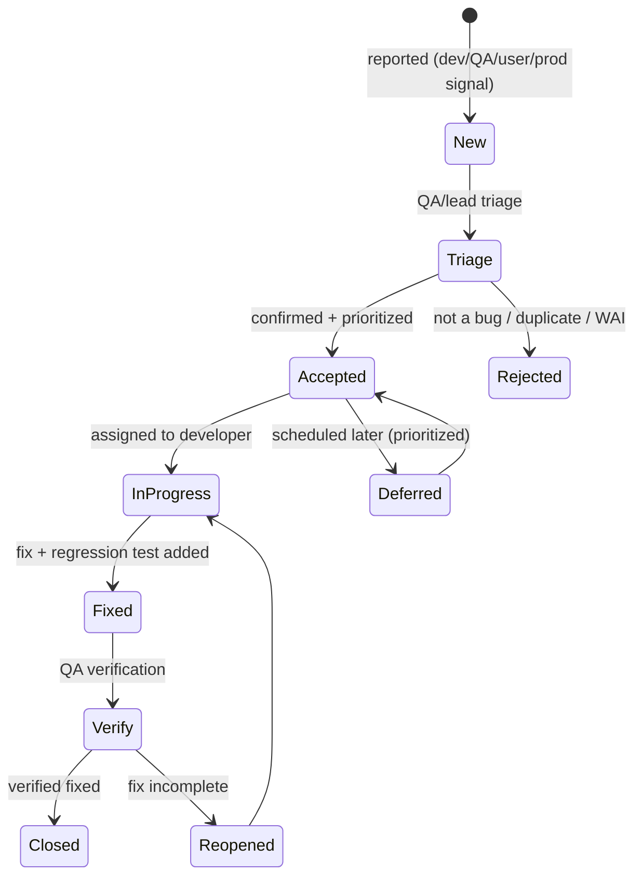

- **Every defect ships with a regression test** that reproduces it (bug → test → fix → verify).
- Production incidents become bugs with severity + test-gap analysis (Ch. 19.4).
- No `Closed` without verification (mirrors the product QA gate: Done requires Approved QA).

### 20.3 Severity

| Severity | Definition | Example | SLA |
|---|---|---|---|
| S1 Critical | Blocks core workflow / data loss / security | Workspace isolation breach, data corruption | Immediate; hotfix path |
| S2 High | Major feature broken; workaround none/poor | QA gate bypass, realtime desync | Same sprint |
| S3 Medium | Feature partially broken; workaround exists | Search facet wrong, report edge case | Next sprint |
| S4 Low | Cosmetic / minor | Wording, spacing | Backlog |

### 20.4 Priority

| Priority | Meaning | Basis |
|---|---|---|
| P1 | Fix immediately (blocks release/incident) | Severity × impact × risk |
| P2 | Fix this sprint | Risk matrix |
| P3 | Schedule | Backlog |
| P4 | Nice-to-have | Product triage |

Priority is a **business decision** (severity × likelihood × impact per risk matrix); severity is technical.

### 20.5 Test Planning

- **Per feature:** test plan (approach, data, environments, risks) drafted at DoR (Ch. 2.3), executed at completion.
- **Per release:** release test plan (scope, gates, environments, regression set, exit criteria).
- **Risk-based selection (Ch. 4.24):** depth ∝ likelihood × impact; risk register per release.

| Risk | Likelihood | Impact | Test depth |
|---|---|---|---|
| QA-gate bypass | Low | Critical | Deep (unit + API + E2E) |
| Workspace leakage | Low | Critical | Deep (security + data) |
| Offline data loss | Medium | High | Deep (offline suite) |
| Realtime desync | Medium | High | Deep (realtime suite) |
| Report inaccuracy | Medium | Medium | Medium (fixtures + perf) |
| UI a11y regression | High | Medium | Medium (a11y gates) |

### 20.6 Review Process

- **Test plan review** for high-risk features (QA + developer + PM).
- **Code review** includes test quality (checklist Ch. 20.8): tests assert behavior, cover the AC, and add value (no tautological tests).
- **Quality review** (per milestone): metrics, escape analysis, risk register, process improvements.

### 20.7 Documentation Standards

- Test plans/reports follow a template: scope, approach, data, environments, results, risks, exit criteria.
- Bug reports: reproducible steps, expected vs. actual, environment, evidence (logs/screenshots), severity/priority, traceability to AC.
- Every release has a **quality report**: evidence (gates, coverage, perf, a11y, security) + risks + sign-off.

### 20.8 Test Ownership

| Asset | Owner |
|---|---|
| Unit/component tests | Developer |
| Integration/contract | Developer/QA |
| API/UI/E2E | QA |
| Security/accessibility | QA specialists + Security |
| Performance/chaos/DR | SRE/Perf |
| Test data | Feature teams + QA (Ch. 16.10) |
| Quality metrics/dashboard | QA lead / Engineering manager |

### 20.9 Approval Workflow

- **Feature:** PM/QA sign-off on acceptance (AC met).
- **Release:** Release Manager approval gated by evidence (Ch. 18.2); security + SRE sign-off.
- **Emergency:** expedited with minimum gates (Ch. 18.9), post-hoc evidence.
- **No release without a quality report.**

---

## 20.10 Required Checklists

### A. Developer Checklist (per task)

- [ ] Acceptance criteria understood; test approach defined (DoR)
- [ ] Code follows FAG/BAG patterns; no `any`, no cross-module imports
- [ ] Domain invariants covered by unit tests (≥ 90% domain coverage)
- [ ] Component/unit tests for changed code; a11y roles asserted
- [ ] New endpoints/events registered in AIS + contract-tested
- [ ] Static gates green locally (format, lint, type, secrets)
- [ ] No secrets, no PII in code/logs
- [ ] Feature-flag behavior covered (on/off/percentage)
- [ ] Performance budget respected for hot paths
- [ ] DoD (Ch. 2.2) checklist complete

### B. Pull Request Checklist

- [ ] Tests written/updated for the change (unit + affected integration)
- [ ] Contract/schema drift check green
- [ ] Static analysis + typecheck green
- [ ] Security: no new dependency without justification; no secrets; SAST clean
- [ ] Accessibility: static a11y clean; component a11y assertions
- [ ] Observability: correlationId threading; logs at boundaries
- [ ] No flaky tests introduced; existing suites pass
- [ ] Description references the work item + ACs + test plan
- [ ] Reviewer checklist (C) signed off

### C. Code Review Checklist

- [ ] Change matches stated intent/AC (no scope creep)
- [ ] Logic correctness: edge cases, error paths, concurrency
- [ ] Tests assert behavior (not implementation); cover the AC; no tautologies
- [ ] Invariants preserved (QA gate, privacy boundary, ownership)
- [ ] Authorization enforced server-side; no client-trusted decisions
- [ ] Performance: no blocking event-loop work, indexed queries, cache discipline
- [ ] Security: input validation, error messages sanitized, no secrets
- [ ] API/event contract honored (AIS); versioning respected
- [ ] Observability fields present; logs sanitized
- [ ] Documentation (FAG/BAG/AIS/TQS) updated if behavior changed

### D. QA Checklist (per feature/release)

- [ ] Test plan written at DoR; risk matrix updated
- [ ] AC traceability matrix maintained (AC → tests → results)
- [ ] Unit/component/integration/API/E2E suites green
- [ ] Exploratory testing executed per charter; findings triaged
- [ ] Accessibility audit (WCAG 2.2 AA) for the feature
- [ ] Security verification (authZ matrix, injection, rate limits) done
- [ ] Offline + realtime scenarios executed (Ch. 9–10)
- [ ] Test data isolated and versioned (Ch. 16)
- [ ] Defects triaged with severity/priority + regression tests
- [ ] Quality report produced with evidence + sign-off

### E. Release Checklist

- [ ] All CI/CD gates green on RC (Ch. 15)
- [ ] Staging validated: API + E2E + a11y + perf + security subset
- [ ] Staging smoke green post-deploy
- [ ] Rollback plan rehearsed; runbook current (Ch. 18.5)
- [ ] Feature flags verified (states + kill-switch)
- [ ] Canary criteria defined (error rate, latency, RUM)
- [ ] Dashboards/runbooks updated; on-call briefed
- [ ] Security sign-off obtained
- [ ] Quality report produced; release approved
- [ ] Post-release validation scheduled (Ch. 18.8)

### F. Security Checklist

- [ ] Authentication: credentials hashed, tokens rotated/revocable, rate-limited
- [ ] Authorization: capability matrix enforced, deny-by-default, workspace isolation tested
- [ ] Input validation server-side; injection/path-traversal/SSRF covered
- [ ] XSS/CSRF controls verified (sanitization, tokens)
- [ ] Replay protection (idempotency, webhook signatures, nonce)
- [ ] Secrets: no secrets in code/logs; encrypted at rest; rotation tested
- [ ] Dependencies audited (critical/high clean); supply-chain checks
- [ ] Plugin sandbox + capability grants verified (where applicable)
- [ ] AI guardrails (scope, output safety, provenance) verified (Ch. 11.10)
- [ ] Audit trail complete for security-relevant actions

### G. Accessibility Checklist (WCAG 2.2 AA)

- [ ] Keyboard operable; no traps; focus visible and not obscured
- [ ] Focus order logical; modal/palette focus management correct
- [ ] Screen-reader: landmarks, labels, live regions for updates
- [ ] Contrast AA in all themes/states; charts color-plus-pattern
- [ ] Touch targets meet minimum size/spacing
- [ ] Reduced-motion respected; no motion-only information
- [ ] Responsive: reflow at 200% zoom; no lost content at breakpoints
- [ ] Tables: headers, captions, sorting announced
- [ ] Forms: labels, errors announced, required indicated
- [ ] Automated scan below threshold; expert review for new features

### H. Performance Checklist

- [ ] Endpoint budgets met (p50/p95/p99, Ch. 13.13)
- [ ] No unbounded queries; indexes used; no event-loop blocking
- [ ] Frontend: bundle budgets, Web Vitals within target, virtualized lists
- [ ] Realtime push latency within budget; fan-out bounded
- [ ] Queue backlogs stable; no head-of-line blocking of critical queues
- [ ] Cache hit rate healthy; invalidation correct; Redis capacity OK
- [ ] Report/AI generation within duration budgets; async progress
- [ ] Degraded paths (Redis/provider down) within degraded budget
- [ ] Load test evidence at target capacity; soak observed
- [ ] Performance trends vs. baseline reviewed (no regression > threshold)

### I. Regression Checklist

- [ ] Full pyramid re-run green (unit → E2E)
- [ ] All previously-fixed defects re-verified (regression suite)
- [ ] Critical journeys pass: QA gate, privacy, RBAC, realtime, offline, reports
- [ ] Compatibility matrix spot-check (browsers/devices)
- [ ] Contract conformance across versioned endpoints
- [ ] A11y + security suites green (no regression)
- [ ] Escapes reviewed: would a regression test have caught each? (Ch. 19.4)
- [ ] Flake triage complete (no ignored failures)

### J. Production Readiness Checklist

- [ ] Release gates green + quality report produced
- [ ] SLOs/error budgets reviewed; dashboards + alerts verified live
- [ ] Synthetic probes covering critical journeys passing
- [ ] RUM/APM enabled; baseline captured
- [ ] Rollback + incident runbooks tested and current
- [ ] Backup/restore + DR drills current (Ch. 8.8)
- [ ] Secret rotation and access controls verified
- [ ] Feature flags + kill-switch verified in production config
- [ ] On-call briefed; escalation paths confirmed
- [ ] Post-release watch window scheduled; incident feedback loop armed

---

## 21. AI Quality Strategy

### 21.1 Strategy Overview

AI quality is **evidence-driven and safety-gated** (BAG Ch. 27): AI is a consumer, not a writer; outputs are artifacts with provenance; every claim is verified against labeled data and guardrails. The pipeline treats AI as a first-class system under continuous validation.

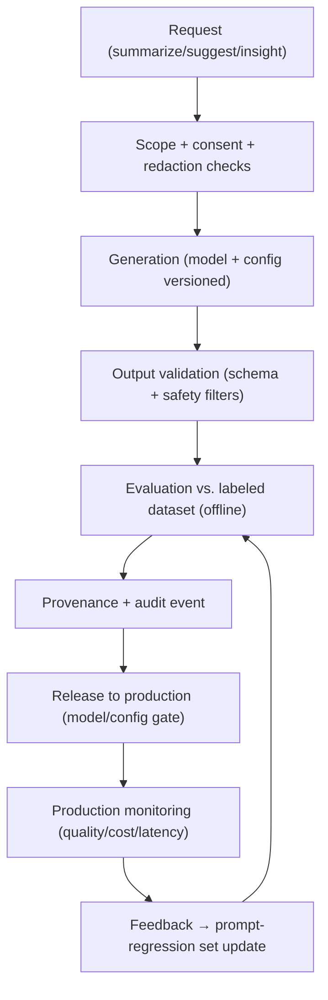

### 21.2 AI Validation

- **Ground truth datasets** per workload (summary, insight, suggestion) — labeled, versioned, redacted-safe.
- Offline evaluation gates: correctness, scope adherence, style/format conformance to DTS/DSS tone.
- **Release gate:** a new model/config must beat (or match) the incumbent on the eval set within tolerance.
- Human-in-the-loop sampling: QA/AI engineers review a sample of outputs per release (inter-rater on quality).

### 21.3 Prompt Regression

- A **prompt regression suite** captures known-good prompts/contexts and their expected output characteristics.
- Any prompt/template/model change runs the suite; regressions (wrong scope, format drift, hallucination) block.
- Golden prompts stored versioned alongside model/config versions.

### 21.4 Hallucination Prevention

- **Grounded context only:** outputs must reference provided context; ungrounded claims flagged (attribution checks).
- **Evidence/attribution:** insights carry source refs; outputs without basis are rejected or marked uncertain.
- **Confidence signaling:** low-confidence outputs surface as suggestions (reviewable), never as authoritative facts.
- Safety-critical outputs (QA-related advice) never implied as system state; the QA gate remains structurally enforced (BAG Ch. 7.2).

### 21.5 Context Validation

- Context builder (BAG Ch. 27.4) verified: refuses non-consented data; redacts member-private data (DDD §13.3); workspace-scoped only.
- **Injection resistance:** untrusted content cannot redirect the model (prompt-injection tests in the suite).
- Context truncation/boundaries: behavior at max context length tested (quality + cost).

### 21.6 Output Verification

- **Schema conformance:** outputs validated against artifact types (Zod, BAG Ch. 27.4).
- **Safety filters:** sensitive-content filter tested with adversarial set.
- **Determinism policy:** where determinism is required (same input → same summary shape), temperature/pinning verified.
- **Downstream safety:** AI-generated content can't become XSS (output boundary sanitized, Ch. 11.10); suggestions routed to normal commands (no write-path bypass).

### 21.7 Safety Evaluation

- Adversarial evaluation: prompt-injection, scope-exfiltration attempts, PII-elicitation attempts — all must fail safely.
- Dual-use check per workload (no data-exfil, no instruction bypass).
- Safety eval runs on every model/config change **and** periodically against production prompts.

### 21.8 Model Versioning

- Model/config/prompt **triple is versioned**; every generation records `modelId`, `promptHash`, `contextRefs` (BAG Ch. 27.4 provenance).
- Rollback = config rollback (model pinned in config); tested in staging.
- Deprecation path: model EOL → migration eval gate before cutover.

### 21.9 Cost Monitoring

- Per-workspace quotas + budget (WPS plan) enforced and tested (Ch. 6.13).
- Cost per request tracked; anomaly alerts (cost spikes → review prompt/context).
- Efficiency: batching/caching of repeated contexts verified; no unbounded retries.

### 21.10 AI Quality Gates

- [ ] Eval set green vs. incumbent (within tolerance) for the workload
- [ ] Prompt regression suite green
- [ ] Context validation + redaction tests pass (privacy, scope)
- [ ] Injection/safety adversarial suite passes
- [ ] Output schema + safety filters green
- [ ] Provenance recorded; rollback path tested
- [ ] Cost/quotas enforced; monitoring wired
- [ ] Human sample review complete (risk-based)

### 21.11 AI Test Matrix

| Concern | Test type | Frequency |
|---|---|---|
| Output quality vs. ground truth | Offline eval | Per model/config change |
| Prompt regression | Regression suite | Per prompt change |
| Context/privacy | Unit + integration (Ch. 6.13) | Per change + nightly |
| Injection/safety | Adversarial suite | Per change + periodic |
| Schema/format conformance | Contract-style validation | Per change |
| Cost/quota | Integration + monitoring | Nightly + continuous |
| Production drift | Monitoring + sampling | Continuous |

---

## 22. Future Evolution

### 22.1 How Testing Evolves

The quality program evolves in five phases aligned with the product roadmap (WPS §18.1). Each phase **extends** the philosophy — the pyramid, gates, and principles stay constant; tooling, depth, and intelligence increase.

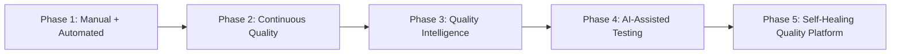

### 22.2 Phase 1 — Manual + Automated (Core, v1)

- **State:** the foundation — pyramid established, CI gates live, core suites built.
- **In place:** static + unit + component + integration + contract + API + E2E; smoke per deploy; release gates.
- **Focus:** stabilize the suites; coverage targets met; flake discipline; risk-based exploratory for new features (Mission Control, realtime, offline).
- **Exit criteria:** CI green ≥ 95% first pass; escape rate < 10%; release cadence predictable.

### 22.3 Phase 2 — Continuous Quality (Advanced Team)

- **State:** quality is verified continuously, not only at release.
- **In place:** nightly full suites + scheduled perf/chaos; synthetic monitoring in production; SLOs with error budgets; realtime/offline suites mature; AI validation pipeline (Ch. 21) live.
- **Focus:** shift-left deepens (contract-first everywhere); flake rate < 1%; self-service QA tooling; quality dashboards owned by teams.
- **Exit criteria:** escape rate < 5%; releases green without firefighting; teams self-serve quality evidence.

### 22.4 Phase 3 — Quality Intelligence (Engineering Platform)

- **State:** quality is data-driven and predictive.
- **In place:** quality metrics feed risk models; test selection by change-impact (risk-based auto-selection); defect prediction for high-risk areas; anomaly detection in production (Ch. 14) auto-queues regression tests.
- **Focus:** reduce test time via targeted selection; observability-driven test backlog (Ch. 14.11) fully operational; plugin/marketplace quality gates standardized.
- **Exit criteria:** CI suite runs only what's relevant (e.g., 40% reduction in runtime); escapes predicted and prevented before release.

### 22.5 Phase 4 — AI-Assisted Testing (AI Workspace)

- **State:** AI assists human verification.
- **In place:** AI-assisted test generation from ACs (unit/E2E scaffolding, human-reviewed); AI exploratory-testing companion (session suggestions, coverage gap hints); AI triage of failures (root-cause clustering); prompt-regression + AI-quality pipelines integrated (Ch. 21).
- **Focus:** human judgment remains authoritative; AI outputs reviewed under the same quality gates; a11y/security audits AI-augmented but expert-signed.
- **Exit criteria:** AI-generated tests reach production-quality acceptance rate; triage time cut significantly; AI quality measured by the same evidence standards.

### 22.6 Phase 5 — Self-Healing Quality Platform (Developer OS)

- **State:** the quality platform sustains and improves itself.
- **In place:** self-healing test maintenance (auto-fix selector drift, auto-quarantine flaky, auto-suggest regressions); autonomous canary analysis with auto-rollback on quality signals; predictive capacity/DR with automated drills; quality contract enforcement across the whole platform (apps, plugins, enterprise).
- **Focus:** humans govern policy; the platform executes verification continuously and safely. Automation is always **reversible, observable, and human-overridable** (never silent authority).
- **Exit criteria:** quality platform handles the majority of regression detection/maintenance; humans focus on novel risks and policy.

### 22.7 Evolution Invariants

Across all five phases, the following never change:

1. **The pyramid** — balance is preserved (Ch. 3.3).
2. **The gates** — evidence before release (Ch. 15, 18).
3. **Ownership** — developers own quality; QA enables (Ch. 2.9).
4. **Invariants** — QA gate, privacy boundary, ownership, RBAC verified structurally (Ch. 6, 11).
5. **Human authority** — automation proposes; humans approve; audits exist.
6. **Evidence over opinion** — every quality claim is measurable (Ch. 19).

### 22.8 New Surfaces (mobile, desktop, enterprise)

- **Mobile/Desktop:** compatibility, offline, and realtime suites extend to new surfaces with the same contracts (AIS offline/realtime models); device matrix added to compatibility testing (Ch. 4.15).
- **Enterprise Edition:** SSO/SCIM, compliance, and audit suites added under the same security pipeline (Ch. 11); DR/region requirements extend chaos/DR programs (Ch. 4.19).
- **Plugins/Marketplace:** plugin quality gates standardize with core gates (sandbox, capability, perf, a11y) at Phase 3+ (Ch. 6.14, 11.9).

### 22.9 Keeping This Strategy Alive

The TQS is a **living document**: it evolves through the quality review process (Ch. 20), absorbs production learnings (Ch. 14), and is re-baselined at each roadmap phase. When it changes, the change is deliberate, evidence-backed, and consistent with PRD, WPS, UXS, DSS, DTS, DDD, SAD, AIS, FAG, and BAG.

---

## Revision History

| Version | Date | Author | Summary of Changes |
|---|---|---|---|
| v1.0 | TBD | Quality Engineering Team | Initial release — complete Testing & Quality Strategy (22 chapters, required diagrams + checklists) |
| | | | |
