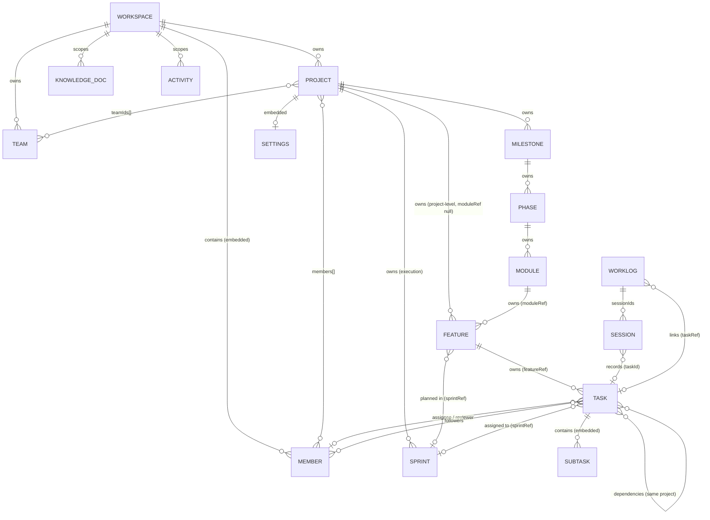
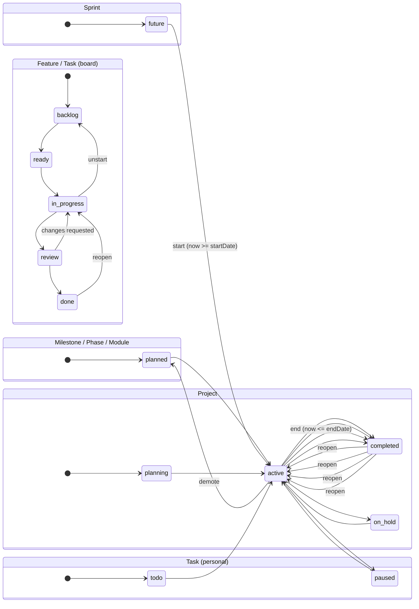

# DDS — Domain Design Specification

**Status:** Official · Approved · Canonical
**Supersedes / incorporates:** [`ark-information-architecture.md`](ark-information-architecture.md) (navigation & layers), [`ark-domain-model-architecture.md`](ark-domain-model-architecture.md) (product-hierarchy design), [`migration-recommendation-1.md`](migration-recommendation-1.md) (spine/execution groundwork).
**Binding:** Every future backend model, frontend component, API route, database collection, analytics calculation, insight, and AI feature MUST conform to this specification.

**Scope guardrails (locked):**
- Roadmap represents **PRODUCT STRUCTURE**. Sprint Planning represents **EXECUTION**. They are independent.
- Tasks belong to Features. Sprints only *reference* Tasks (assignment), never own them.
- The personal (non-workspace) stack is preserved: every workspace extension defaults to null/empty.
- Convention markers used throughout: **[exists]** = implemented today; **[proposed]** = specified here, not yet implemented; **[derived]** = computed, never stored.

---

## 1. Vision

ARK is a single engineering companion covering the personal focus loop and team delivery loop from one spine. A developer should be able to move from "what should I do now" (Today) to "what are we delivering" (Mission Control) to "what does the product require" (Roadmap) — through the same Task and Session objects — without ever losing their thread.

The engineering hierarchy makes the **product's structure** explicit and separate from **how work is executed**. Structure lives on the Roadmap; execution lives in Sprints. The Task is the hinge that connects the two.

> **Guiding statement:** "Structure is durable, execution is temporary, and the Task is the unit that both the product and the team agree on."

---

## 2. Domain Principles

| # | Principle | Rule |
|---|---|---|
| P1 | **One hierarchy, two dimensions.** Product structure (Roadmap → Milestone → Phase → Module → Feature → Task → Subtask) is independent of execution (Sprint). Nothing on the Roadmap is scheduled by being created. |
| P2 | **Ownership is exclusive; assignment is optional.** A child has exactly one owner-parent. A Task is owned by exactly one Feature and may be *assigned* to at most one Sprint. Assignment never changes ownership. |
| P3 | **Denormalize scope, derive authority.** Every collaborative entity carries a denormalized `workspaceRef`; its value is **always derived server-side from the owning Project** — never accepted from a client body. |
| P4 | **Same-project integrity.** Every ref beneath a Project must resolve to the same `projectRef`. Cross-project refs are rejected. |
| P5 | **Deletion nulls, never cascades.** Deleting a parent detaches children by nulling their parent ref; it never deletes them. Deletion is destructive and permission-gated; archive is the non-destructive alternative. |
| P6 | **Queries over containers.** "Virtual" groupings (Project Backlog, Roadmap) are queries over entity sets, not empty collection containers. |
| P7 | **Additive evolution.** New fields default null/empty. Personal tasks (`workspaceRef: null`) are byte-for-byte unchanged. |
| P8 | **One Task system.** There is a single Task entity for personal and workspace work. Ref is the discriminator, not the model. |
| P9 | **Personal stack preserved.** `workspaceRef: null` + `userId` scope = personal. Every workspace feature is additive. |
| P10 | **Permission by workspace role, applied at the resource.** The four workspace gates (member / editor / owner-admin / owner) are the only authorization vocabulary for collaborative entities. |
| P11 | **Audit everything.** Meaningful writes emit an `Activity` record. Activity is the versioning surrogate for non-versioned entities. |
| P12 | **Reports are derived.** Velocity, completion, and effort are computed from Tasks/Sessions/WorkLogs. Nothing is stored twice. |

---

## 3. Engineering Hierarchy

### 3.1 The full hierarchy

```
Workspace  [top-level collaborative container]
│
├── Member (membership: role · status · teams · joinedAt)
├── Team (member grouping)
├── KnowledgeDoc (shared knowledge; workspace-scoped, project-scoped optional)
│
└── Project
    │
    ├── Project Information   → Project document (description · key · status · visibility · members · teamIds · settings)
    │
    ├── Roadmap  (PRODUCT STRUCTURE — virtual = ordered Milestones)
    │   └── Milestone
    │       └── Phase
    │           └── Module
    │               └── Feature
    │                   └── Task
    │                       └── Subtask
    │
    ├── Sprint Planning  (EXECUTION — Sprint collection)
    │   └── Sprint  ──assigned──►  Task.sprintRef   (Sprints reference Tasks; they never own them)
    │
    ├── Knowledge Base  → project-scoped KnowledgeDoc
    ├── Reports        → [derived] from Tasks · Sessions · WorkLogs · Sprints
    ├── Members        → Project.members[] · Project.teamIds[]
    └── Settings       → Project.settings (visibility · review policy · defaults)
```

### 3.2 Product structure vs execution

| Aspect | Roadmap (structure) | Sprint (execution) |
|---|---|---|
| Answers | "What must the product contain?" | "What are we shipping this iteration?" |
| Backbone | Milestone → Phase → Module → Feature | Sprint with start/end dates |
| Units | Feature (and its Tasks) | Task assignments (`sprintRef`) |
| Mutable | Reorganize freely (move, re-parent, reorder) | Time-boxed; dates validated start < end |
| Lifecycle | planned → active → completed | future → active → completed |
| Independence | Exists without any sprint | Cannot exist without a project; carries no structure |

**Invariant:** planning a Feature/Task into a Sprint never alters its position in the Roadmap, and restructuring the Roadmap never alters sprint assignments.

### 3.3 Layers (from IA)

- **L1 Personal Companion** — Today · Tasks · Current Task · Focus · Work Log · Journal · Knowledge · Reports · Habits · Settings.
- **L2 Project Companion** — Mission Control · Project Info · Roadmap · Sprint · Backlog · Features · Reviews · Blockers · Activity · Reports · Calendar · Knowledge.
- **L3 Workspace Administration** — Workspace Home · Projects · Teams · Members · Roles · Settings · Audit.

---

## 4. Entity Specifications

Notation: **[exists]** currently implemented · **[proposed]** specified here, to implement · **[derived]** computed, never persisted.
Field names follow Mongo/Mongoose conventions (camelCase, `Ref` suffix for refs).

---

### 4.1 Workspace **[exists]**

- **Purpose:** Top-level collaborative container — "where a team works." Groups members, teams, projects, knowledge, and activity under one permission boundary.
- **Responsibilities:** Owns membership & roles; owns teams; owns projects; owns workspace-scoped activity, notifications, knowledge, blockers, calendar; defines collaboration defaults.
- **Parent:** — (root of the collaboration domain; `organizationRef` deferred).
- **Children:** Member (embedded), Team, Project, KnowledgeDoc, Activity, Notification, CalendarEvent (mock today), Blocker (mock today).
- **Ownership:** Workspace owns its members, teams, projects, and settings. Members have a per-workspace role: `Owner | Admin | Manager | Developer | Viewer`.
- **Lifecycle:** Created by a user (becomes sole `Owner`) → active → deleted by an Owner.
- **Status values:** `type`: `Personal | Startup | College Project | Open Source | Internship | Enterprise`. No lifecycle status enum; existence = active.
- **Required fields:** `name`.
- **Optional fields:** `description`, `type`, `icon`, `members[]`, `settings`.
  - `settings`: `allowMemberInvites` (bool) · `requireReviewForDone` (bool) · `autoSyncTimerWorkLogs` (bool) · `defaultVisibility` (`Private | Team | Project | Workspace`).
- **Relationships:** Has many Members; has many Teams; has many Projects; scopes Activity/Notification/KnowledgeDoc.
- **Permissions:** Member = read surface. `Owner|Admin` = settings + membership management. `Owner` = deletion. (`requireWorkspaceMember` / `requireManager` / `requireOwner`.)
- **Business rules:**
  - A workspace always has at least one `Owner`.
  - Role checks are pure role checks; platform admin has no implicit workspace membership.
- **Validation rules:** Membership roles from the enum; at most one membership per user.
- **Deletion behaviour:** Hard delete by Owner only. Removes membership rows; projects and knowledge in scope are handled per their own rules (orphan protection — see §4.4, §4.12). TTL expires Activity/Notifications.
- **Archive behaviour:** None defined; deletion is the terminal action.
- **Versioning behaviour:** None; writes audited via Activity.

---

### 4.2 Member (workspace membership) **[exists]**

- **Purpose:** Grants a user access and a role inside a workspace.
- **Responsibilities:** Carries role, availability status, team memberships, and focus signal for the workspace.
- **Parent:** Workspace (embedded in `Workspace.members`).
- **Children:** — (references Tasks via `assigneeId`/`reviewerId`/`followerIds`, Teams via `teams`).
- **Ownership:** Workspace owns memberships; the user owns their own identity/status.
- **Lifecycle:** Invited/joined (`joinedAt`) → role changes → removed.
- **Status values:** `role`: `Owner | Admin | Manager | Developer | Viewer`; `status`: `available | in_focus | away | in_meeting | offline`.
- **Required fields:** `userId`, `role`, `joinedAt`.
- **Optional fields:** `status`, `teams[]`, `currentFocusTask?`, `currentFocusTimeMs?`.
- **Relationships:** Belongs to a Workspace; belongs to Teams; may be assignee/reviewer/follower of Tasks.
- **Permissions:** Managed by `Owner|Admin` (invite, remove, role change) at workspace scope.
- **Business rules:** A user can be a member of many workspaces; exactly one membership per workspace.
- **Validation rules:** `role`/`status` from enums; `userId` unique within a workspace.
- **Deletion behaviour:** Removing a member: their assignee/reviewer refs on Tasks are nulled, they leave teams, and visibility to workspace resources is revoked. (Null-out, consistent with P5.)
- **Archive behaviour:** None.
- **Versioning behaviour:** Role/status changes are audited via Activity.

---

### 4.3 Team **[exists]**

- **Purpose:** Group workspace members (e.g. Frontend, Backend, QA) for assignment and reporting.
- **Responsibilities:** Defines a named group with a leader; members may belong to many teams.
- **Parent:** Workspace (`workspaceRef`; legacy `null` = admin-only team).
- **Children:** Members (membership association only — no ownership).
- **Ownership:** Workspace owns teams.
- **Lifecycle:** Create → manage members → delete.
- **Status values:** None (presence = active).
- **Required fields:** `name`.
- **Optional fields:** `description`, `members[]`, `leaderId`, `color`.
- **Relationships:** Scoped to a workspace; projects may reference teams via `Project.teamIds`; members reference teams via `Member.teams`.
- **Permissions:** Create/update by editors; delete by Owner/Admin; membership edits by Owner/Admin.
- **Business rules:** A project's team list is a subset of the workspace's teams.
- **Validation rules:** `leaderId` and `members[]` must be workspace members.
- **Deletion behaviour:** Hard delete; teams are references only — nothing is cascade-deleted; `Project.teamIds` entries are left stale and reconciled on next write (documented boundary).
- **Archive behaviour:** None.
- **Versioning behaviour:** None.

---

### 4.4 Project **[exists] (to extend)**

- **Purpose:** The unit of product delivery. Owns the entire Roadmap, all Sprints, its members, knowledge, reports, and settings. **The Project is the single point from which `workspaceRef` is derived for every child.**
- **Responsibilities:** Project Information (metadata); owns Milestones/Phases/Modules/Features/Tasks (spine) and Sprints (execution); scopes knowledge; defines settings.
- **Parent:** Workspace (optional — `workspaceRef: null` = **personal project**, user-owned).
- **Children:** Milestone, Sprint, Feature (moduleRef-null → project-level), KnowledgeDoc (project-scoped), Members/Teams (reference lists), Settings.
- **Ownership:** Workspace owns a workspace project; a user owns their personal project. Project *owns* all spine entities and Sprints.
- **Lifecycle:** `planning → active → completed | on_hold`. Reversible between `active`/`on_hold`; `completed` can reopen to `active`.
- **Status values:** `planning | active | completed | on_hold`.
- **Required fields:** `name`, `nameKey` (lowercased mirror of `name`). Workspace projects: unique per `(workspaceRef, nameKey)`; personal: unique per `(userId, nameKey)`.
- **Optional fields:** `description`, `key` (max 10), Google Drive folder ids (`googleFolderId`, `workLogsFolderId`, `designDocsFolderId`, `meetingNotesFolderId`, `reportsFolderId`), `members[]`, `teamIds[]`, `settings` **[proposed]**.
- **Relationships:** Belongs to a Workspace; owns Milestones + Sprints + Features (project-level); references Members/Teams; scopes KnowledgeDocs.
- **Permissions:** Reads = workspace members. Create = non-Viewer members. Edit `description`/`key`/`status` = editors. Edit `members[]`/`teamIds[]`/`settings` = Owner/Admin. Delete = Owner/Admin.
- **Business rules:**
  - `workspaceRef` is the workspace scope; `null` = personal (user-only, no collaboration).
  - Legacy embedded `milestones[]` is **deprecated** — the Roadmap lives in the `Milestone` collection (§4.5). Read-compat during transition; removed after migration `0013` is fully applied.
  - Google Drive folders are created on connect/sync; Drive errors surface as a reconnect flag.
- **Validation rules:** Name required + unique per scope (case-insensitive via `nameKey`); `status` from enum; `key` max 10.
- **Deletion behaviour:** Hard delete (Owner/Admin for workspace projects; owner user for personal). Children are **nulled, not deleted**: Milestones/Phases/Modules/Features/Sprints keep docs with their `projectRef` (features/sprints already orphan-protect their tasks by nulling `sprintRef`/`featureRef` on delete); a full cascade is documented as a follow-up decision.
- **Archive behaviour:** Archive = set `status: on_hold` (non-destructive, reversible). A full soft-archive (`archivedAt`) is a **[proposed]** extension point (§13).
- **Versioning behaviour:** None; Activity records project lifecycle events.

---

### 4.5 Milestone **[proposed]**

- **Purpose:** A dated, outcome-level commitment on the Roadmap ("GA launch"). The Roadmap is the ordered set of a project's Milestones.
- **Responsibilities:** Owns Phases; carries the primary Roadmap ordering (`order`, `targetDate`).
- **Parent:** Project (`projectRef` required).
- **Children:** Phase.
- **Ownership:** Project owns Milestones.
- **Lifecycle:** `planned → active → completed` (reversible: `completed → active` to reopen; `active → planned` to demote).
- **Status values:** `planned | active | completed`.
- **Required fields:** `projectRef`, `workspaceRef` (derived), `name`, `createdBy`.
- **Optional fields:** `description`, `targetDate`, `order`, `status`.
- **Relationships:** Belongs to a Project; owns Phases.
- **Permissions:** Reads = members; create/update = editors; delete = Owner/Admin.
- **Business rules:** Roadmap ordering = `order` asc, then `targetDate` asc. A milestone is complete only when all Phases are complete (derived check; not stored).
- **Validation rules:** `projectRef` must be a workspace-scoped project; `status` from enum; `name` max 150; `targetDate` a valid date.
- **Deletion behaviour:** Hard delete (Owner/Admin) → **nulls `phase.milestoneRef`** on all child Phases (Phases become project-level orphans).
- **Archive behaviour:** `status: completed` is the archive-like terminal; a soft `archived` flag is **[proposed]**.
- **Versioning behaviour:** None; creation/edit/deletion audited via Activity (`milestone.created` / `.updated` / `.deleted`).

---

### 4.6 Phase **[proposed]**

- **Purpose:** A delivery stage inside a Milestone ("Phase 1: Core platform").
- **Responsibilities:** Owns Modules; gives the Roadmap a second ordering level.
- **Parent:** Milestone (`milestoneRef` required; `projectRef` denormalized).
- **Children:** Module.
- **Ownership:** Milestone owns Phases (Project is the ultimate owner).
- **Lifecycle:** `planned → active → completed` (reversible).
- **Status values:** `planned | active | completed`.
- **Required fields:** `milestoneRef`, `projectRef`, `workspaceRef` (derived), `name`, `createdBy`.
- **Optional fields:** `description`, `status`, `order`, `startDate`, `endDate`.
- **Relationships:** Belongs to a Milestone; owns Modules.
- **Permissions:** Reads = members; create/update = editors; delete = Owner/Admin.
- **Business rules:** Re-parenting (change `milestoneRef`) revalidates the new milestone's `projectRef` equals the phase's `projectRef`. `startDate`/`endDate` optional but `startDate < endDate` when both set.
- **Validation rules:** `milestoneRef` must exist and share `projectRef`; `status` from enum; `name` max 150.
- **Deletion behaviour:** Hard delete (Owner/Admin) → **nulls `module.phaseRef`** on child Modules.
- **Archive behaviour:** `status: completed`; soft archive **[proposed]**.
- **Versioning behaviour:** None; Activity records events (`phase.created` / `.updated` / `.deleted`).

---

### 4.7 Module **[proposed]**

- **Purpose:** A capability area inside a Phase ("Auth module").
- **Responsibilities:** Owns Features; optional `ownerId` for accountability.
- **Parent:** Phase (`phaseRef` required; `projectRef` denormalized).
- **Children:** Feature.
- **Ownership:** Phase owns Modules (Project is ultimate owner).
- **Lifecycle:** `planned → active → completed` (reversible).
- **Status values:** `planned | active | completed`.
- **Required fields:** `phaseRef`, `projectRef`, `workspaceRef` (derived), `name`, `createdBy`.
- **Optional fields:** `description`, `status`, `order`, `ownerId`.
- **Relationships:** Belongs to a Phase; owns Features.
- **Permissions:** Reads = members; create/update = editors; delete = Owner/Admin.
- **Business rules:** Re-parenting revalidates same-project. `ownerId` must be a workspace member.
- **Validation rules:** `phaseRef` must exist and share `projectRef`; `status` from enum; `name` max 150.
- **Deletion behaviour:** Hard delete (Owner/Admin) → **nulls `feature.moduleRef`** on child Features (Features become project-level).
- **Archive behaviour:** `status: completed`; soft archive **[proposed]**.
- **Versioning behaviour:** None; Activity records events.

---

### 4.8 Feature **[exists] (to extend)**

- **Purpose:** A discrete, shippable work item / capability. **The hinge entity:** it carries both product ownership (`moduleRef`) and sprint planning (`sprintRef`). A Feature with `sprintRef: null` lives in the **Project Backlog** (a query, not a collection).
- **Responsibilities:** Owns Tasks; groups work by `type`; carries estimation, labels, and an owner; can be planned into exactly one Sprint.
- **Parent:** Project (`projectRef` required); optionally Module (`moduleRef` **[proposed]**, null = project-level feature).
- **Children:** Task.
- **Ownership:** Project owns Features (Module is the structural parent when `moduleRef` set).
- **Lifecycle:** `backlog → ready → in_progress → review → done`, with backward moves (soft enforcement).
- **Status values:** `backlog | ready | in_progress | review | done`.
- **Required fields:** `projectRef`, `workspaceRef` (derived), `name`, `createdBy`.
- **Optional fields:** `sprintRef` (null = Backlog), `moduleRef` **[proposed]** (null = project-level), `description`, `type`, `labels[]`, `ownerId`, `estimatedHours`, `status`, `order`.
- **Relationships:** Belongs to a Project; optionally to a Module; optionally planned into a Sprint; owns Tasks.
- **Permissions:** Reads = members; create/update = editors; delete = Owner/Admin. **Backlog** = the query `{ projectRef, sprintRef: null }`.
- **Business rules:**
  - `sprintRef` and `moduleRef` are independent. Planning into a Sprint never changes module ownership and vice versa.
  - `Feature↔Sprint` must share `projectRef`; `Feature↔Module` must share `projectRef`.
  - Backlog ordering = `order` asc; drag into Sprint = `PATCH { sprintRef }` (same-project revalidation).
  - `type`: `feature | bug | spike | chore | research | debt | improvement` (default `feature`).
- **Validation rules:** `sprintRef`/`moduleRef` same-project; `type`/`status` from enums; `name` max 150; `description` max 5000; `labels` max 50 × max 50 chars; `estimatedHours ≥ 0`.
- **Deletion behaviour:** Hard delete (Owner/Admin) → **nulls `task.featureRef`** on child Tasks (already implemented; Tasks return to unlinked state).
- **Archive behaviour:** `status: done` is terminal (reopenable to `in_progress`); soft archive **[proposed]**.
- **Versioning behaviour:** None; Activity records `feature.created` / `.updated` / `.deleted`.

---

### 4.9 Task **[exists]**

- **Purpose:** The unit of work. The hinge between product structure and execution: **owned by exactly one Feature**, optionally **assigned to one Sprint**. Also the personal-stack task when `workspaceRef: null`.
- **Responsibilities:** Carries the work, its status on both the board (`sprintStatus`) and the personal list (`status`), time tracking (`totalTime`), git context, assignment (assignee/reviewer/followers), dependencies, estimation, and embedded Subtasks.
- **Parent:** Feature (`featureRef`); for personal tasks: the owning user only.
- **Children:** Subtask (embedded), Session (via `session.taskId`), WorkLog (via `worklog.taskRef`).
- **Ownership:** Feature owns a workspace Task; a user owns a personal Task. Sprint never owns a Task — only references it.
- **Lifecycle:** Board status: `backlog → ready → in_progress → review → done` (with reverts). Personal status: `todo → active → paused → completed`.
- **Status values:** `sprintStatus`: `backlog | ready | in_progress | review | done`; `status`: `todo | active | paused | completed`.
- **Required fields:** `title`; `userId` (creator/owner).
- **Optional fields:** `description`, `priority` (`low|medium|high|urgent`), `category`, `deadline` (calendar date in user tz), `color`, `tags[]`, `subtasks[]`, `totalTime`, and the collaboration set: `workspaceRef`, `projectRef`, `sprintRef`, `featureRef`, `assigneeId`, `reviewerId`, `followerIds[]`, `labels[]`, `dependencies[]`, `estimatedHours`, `actualHours`, `sprintStatus`, `gitContext`.
- **Relationships:** Owned by a Feature; optionally assigned to a Sprint; may depend on Tasks (same project); assignable to Members; tracked by Sessions/WorkLogs.
- **Permissions:** Reads = members (workspace) / self (personal). Create/update = editors (workspace) / self (personal). Delete = editors / self. Assignee/reviewer/follower must be workspace members.
- **Business rules:**
  - **Task assignment rule:** a workspace Task is created under a Feature (`featureRef`); assigning `sprintRef` never changes `featureRef`.
  - A Task can be assigned to at most one Sprint (single `sprintRef`); a Feature can be planned into at most one Sprint.
  - `dependencies[]` must reference Tasks of the same `projectRef`.
  - `gitContext` is managed by its own endpoint and mirrors the git state of the branch/PR.
  - Deleting a Task cascades to its Sessions/Journal and reconciles linked WorkLogs (implemented).
- **Validation rules:** title required (max 200); description max 5000; enums enforced; deadline encoded to the user's timezone; refs same-project; subtasks max 100.
- **Deletion behaviour:** Hard delete (owner/editor). Cascades: delete Sessions + Journal for the task, recompute and unlink WorkLogs by `taskRef`, remove `taskRef`. Workspace edit/delete additionally gated by editor role on the task's `workspaceRef`.
- **Archive behaviour:** None today. `completed` status is terminal-and-reopenable. Soft archive **[proposed]** for board hygiene (§13).
- **Versioning behaviour:** None; `gitContext` captures code versioning; Activity records `task.created` / `.completed` / `.deleted`.

---

### 4.10 Subtask **[exists]**

- **Purpose:** A checklist line inside a Task ("test the login flow"). The leaf of the spine.
- **Responsibilities:** Tracks discrete completion of a step; supports the "subtasks x/y" progress signal.
- **Parent:** Task (embedded in `Task.subtasks[]`).
- **Children:** — (leaf).
- **Ownership:** Task owns its Subtasks.
- **Lifecycle:** Created → marked `completed` → deleted.
- **Status values:** `completed: boolean` (default false).
- **Required fields:** `title`.
- **Optional fields:** `completed`.
- **Relationships:** Belongs to exactly one Task.
- **Permissions:** Managed through the owning Task's permissions (owner/editor).
- **Business rules:** Subtasks are checklists — they are **not** independently assignable, schedulable, or time-tracked. Promotion to a real entity is deferred (§13).
- **Validation rules:** `title` required (max 200); per-Task subtask count ≤ 100.
- **Deletion behaviour:** Hard delete of the embedded subdocument (`$pull`).
- **Archive behaviour:** None.
- **Versioning behaviour:** None.

---

### 4.11 Sprint **[exists]**

- **Purpose:** A time-boxed execution container. Sprint Planning is **EXECUTION**, fully independent of the Roadmap.
- **Responsibilities:** Defines an iteration (dates, goal, capacity, target velocity); provides a board for assigned Tasks/Features.
- **Parent:** Project (`projectRef` required; `workspaceRef` derived, required).
- **Children:** None (references Tasks via `Task.sprintRef`; references Features via `Feature.sprintRef`). **Sprints do not own children.**
- **Ownership:** Project owns Sprints.
- **Lifecycle:** `future → active → completed` (start on/after `startDate`; end by `endDate`; completed can reopen to active).
- **Status values:** `future | active | completed`.
- **Required fields:** `projectRef`, `workspaceRef` (derived), `name`, `startDate`, `endDate`, `createdBy`.
- **Optional fields:** `goal`, `capacityHours`, `targetVelocity`, `status`.
- **Relationships:** Belongs to a Project; references Tasks (assignment) and Features (planning); never the parent of either.
- **Permissions:** Reads = members; create/update = editors; delete = Owner/Admin.
- **Business rules:**
  - `startDate < endDate` always.
  - Planning a Feature/Task into a Sprint requires same-`projectRef` (no cross-project sprints).
  - Deleting a Sprint returns its Features and Tasks to the Backlog/unscheduled state by nulling `sprintRef`.
  - Only one active sprint per project at a time is a product recommendation, not a hard rule.
- **Validation rules:** dates required and ordered; `status` from enum; `name` max 150; `capacityHours`/`targetVelocity ≥ 0`.
- **Deletion behaviour:** Hard delete (Owner/Admin) → **nulls `sprintRef`** on Features and Tasks (`Promise.all` updateMany; implemented).
- **Archive behaviour:** `status: completed` is the archive-like terminal; soft archive **[proposed]**.
- **Versioning behaviour:** None; Activity records `sprint.created` / `.updated` / `.deleted`.

---

### 4.12 KnowledgeDoc **[proposed]** (replaces client-mock)

- **Purpose:** Durable team knowledge — the Knowledge Base.
- **Responsibilities:** Stores markdown documentation; supports versioning; links to the spine.
- **Parent:** Workspace (`workspaceRef`); optionally Project (`projectRef` for project-scoped docs).
- **Children:** — (may be linked from Tasks/WorkLogs).
- **Ownership:** Workspace owns knowledge; Project scopes project knowledge; author edits.
- **Lifecycle:** Created → versioned edits → archived.
- **Status values:** `version` (number). Active/archived by `archivedAt` **[proposed]**.
- **Required fields:** `workspaceRef`, `title`, `category`, `content`, `authorId`, `version`.
- **Optional fields:** `projectRef`, `tags[]`, `archivedAt` **[proposed]**.
- **Relationships:** Scoped to a workspace; optionally scoped to a project; linkable from Tasks/WorkLogs/Features.
- **Permissions:** Reads = members; create/edit = editors; delete/archive = editors; workspace-level docs managed at workspace scope.
- **Business rules:** Every edit increments `version` and retains the prior version (snapshot on update) **[proposed]**.
- **Validation rules:** `title` required (max 150); `content` markdown (bounded); `category` from `Architecture | Meeting Notes | API Documentation | Coding Standards | Onboarding | Retrospectives`.
- **Deletion behaviour:** Soft delete (archive) recommended; hard delete for irrecoverable content by Owner/Admin.
- **Archive behaviour:** `archivedAt` excludes from active lists, retains history **[proposed]**.
- **Versioning behaviour:** **Versioned** — version counter + prior-content snapshots **[proposed]**.

---

### 4.13 Report **[derived]**

- **Purpose:** Retrospective answers — "How did we / I spend time and effort?"
- **Responsibilities:** Compute personal and project summaries, day reports, and share tokens.
- **Parent:** Personal (user) or Project (workspace scope).
- **Children:** — (share tokens via `ReportShare`).
- **Ownership:** Computed on demand; owned by the requesting scope.
- **Lifecycle:** N/A — derived at request time from Sessions/WorkLogs/Tasks/Sprints.
- **Status values:** N/A.
- **Required fields:** N/A (inputs: worklog sessions, task totals, sprint velocity).
- **Optional fields:** Share token, filters (day/week/type/member).
- **Relationships:** Reads WorkLogs (user), Sessions (user), Tasks (project/workspace), Sprints (project).
- **Permissions:** Personal = self; project reports = members; share tokens are public-by-token only.
- **Business rules:** All KPI calculations are single-source pure helpers (§P12). Never persist aggregates.
- **Validation rules:** N/A.
- **Deletion behaviour:** Share token revocation (implemented). No stored report data to delete.
- **Archive behaviour:** N/A.
- **Versioning behaviour:** N/A.

---

### 4.14 Session (supporting) **[exists]**

- **Purpose:** A recorded focus block against a Task.
- **Responsibilities:** Tracks start/pause/resume/stop, active time, and heartbeat; feeds WorkLogs and Reports.
- **Parent:** Task (`session.taskId`); user-owned.
- **Children:** — (a WorkLog references it via `sessionIds`).
- **Ownership:** User owns their Sessions.
- **Lifecycle:** running → paused → stopped (reaper closes stale sessions).
- **Status values:** running / paused / stopped (derived from timestamps).
- **Required fields:** `taskId`, `userId`, start time.
- **Optional fields:** end time, pauses, active totals.
- **Relationships:** Belongs to a Task; recorded into WorkLogs; drives `totalTime`.
- **Permissions:** Self only.
- **Business rules:** Finalization recomputes WorkLog totals from Sessions (single source of truth); stale sessions are reaped.
- **Validation rules:** Task ownership enforced; future-skew and max-age guards.
- **Deletion behaviour:** Hard delete with the parent Task (cascade) or explicit stop.
- **Archive behaviour:** None.
- **Versioning behaviour:** None; Activity/WorkLog history is the record.

---

### 4.15 WorkLog (supporting) **[exists]**

- **Purpose:** Engineering memory — "what happened during this work."
- **Responsibilities:** Captures timeline entries, decisions, blockers, snapshots, reflections, tomorrow plan, links, and attachments per day/task.
- **Parent:** User; optionally Task (`taskRef`) and Project (`projectId`).
- **Children:** Entries/decisions/blockers/snapshots/links/attachments (embedded), linked Sessions.
- **Ownership:** User owns the log; Task/Project scoping is a link.
- **Lifecycle:** open → closed → continue.
- **Status values:** open / closed.
- **Required fields:** `userId`, `date`/dayKey.
- **Optional fields:** `taskRef`, `projectId`, `timelineEntries[]`, `decisions[]`, `blockerList[]`, `snapshots[]`, `reflection`, `tomorrowPlan`, `links[]`, `attachments[]`, `sessionIds[]`, `totalActiveMs`.
- **Relationships:** Links to a Task, a Project, and Sessions.
- **Permissions:** Self; shared via ReportShare tokens.
- **Business rules:** `totalActiveMs` recomputed from Sessions on task deletion; timeline is the temporal spine (IA).
- **Validation rules:** per-field zod bounds; date/day-key timezone handling.
- **Deletion behaviour:** Hard delete (self); task deletion unlinks (does not delete) logs.
- **Archive behaviour:** Closed status; physical retention via Reports.
- **Versioning behaviour:** None; editing appends to timeline.

---

### 4.16 Activity (audit) **[exists]**

- **Purpose:** Immutable, time-boxed audit trail.
- **Responsibilities:** Records meaningful writes across the collaboration domain.
- **Parent:** Workspace (`workspaceRef`).
- **Children:** —.
- **Ownership:** System-recorded.
- **Lifecycle:** Write → TTL-expired.
- **Status values:** N/A (action string).
- **Required fields:** `userId`, `action`, timestamp.
- **Optional fields:** `workspaceRef`, `details`.
- **Relationships:** References the acting user and scoped workspace.
- **Permissions:** Read = workspace members (Activity feed) / audit (Owner/Admin).
- **Business rules:** Best-effort writes (`.catch(() => {})`); never blocks the primary mutation.
- **Validation rules:** `action` string convention (`<entity>.<verb>`).
- **Deletion behaviour:** TTL auto-expiry (implemented).
- **Archive behaviour:** TTL is the retention mechanism.
- **Versioning behaviour:** Activity is the versioning surrogate for non-versioned entities (P11).

---

### 4.17 Project Settings **[proposed]**

- **Purpose:** Project-level configuration overriding workspace defaults.
- **Responsibilities:** Holds project visibility, review policy, and defaults.
- **Parent:** Project (embedded `Project.settings`).
- **Children:** —.
- **Ownership:** Project (Owner/Admin edit).
- **Lifecycle:** N/A.
- **Status values:** N/A.
- **Required fields:** none (empty default object).
- **Optional fields:** `defaultVisibility`, `requireReviewForDone` (inherit workspace default), notifications, etc. — **[proposed]** minimal set, extended as needs arise (YAGNI).
- **Relationships:** Inherits from Workspace.settings; applies to project Tasks/Features/Sprints.
- **Permissions:** Owner/Admin edit; all members read.
- **Business rules:** Project settings override workspace defaults for that project only.
- **Validation rules:** Values mirrored from the workspace settings schema.
- **Deletion behaviour:** N/A (dies with Project).
- **Archive behaviour:** N/A.
- **Versioning behaviour:** None.

---

## 5. Relationships

### 5.1 Entity Relationship Diagram



### 5.2 Cardinality table

| From | To | Cardinality | Nature | Via |
|---|---|---|---|---|
| Workspace | Member | 1..* | containment | embedded |
| Workspace | Team | 1..* | ownership | `Team.workspaceRef` |
| Workspace | Project | 1..* | ownership | `Project.workspaceRef` (null = personal) |
| Workspace | KnowledgeDoc | 1..* | scoping | `KnowledgeDoc.workspaceRef` |
| Project | Milestone | 1..* | ownership | `Milestone.projectRef` |
| Project | Sprint | 1..* | ownership (execution) | `Sprint.projectRef` |
| Project | Feature | 1..* | ownership (project-level) | `Feature.projectRef` |
| Project | Member | *..* | reference | `Project.members[]` |
| Project | Team | *..* | reference | `Project.teamIds[]` |
| Milestone | Phase | 1..* | ownership | `Phase.milestoneRef` |
| Phase | Module | 1..* | ownership | `Module.phaseRef` |
| Module | Feature | 1..* | ownership | `Feature.moduleRef` (null = project-level) |
| Feature | Task | 1..* | ownership | `Task.featureRef` |
| Task | Subtask | 1..* | containment (embedded) | `Task.subtasks[]` |
| Feature | Sprint | *..0..1 | planning (optional) | `Feature.sprintRef` |
| Task | Sprint | *..0..1 | assignment (optional) | `Task.sprintRef` |
| Task | Task | *..* | dependency | `Task.dependencies[]` |
| Member | Task | 1..* | assignee/reviewer/follower | `Task.assigneeId` / `reviewerId` / `followerIds` |
| Task | Session | 1..* | recording | `Session.taskId` |
| Task | WorkLog | 1..* | linking | `WorkLog.taskRef` |

### 5.3 Ownership rules (canonical)

1. **Exclusive owner-parent chain:** Workspace → Project → (Milestone → Phase → Module → Feature → Task → Subtask). Each child has exactly one structural parent.
2. **`workspaceRef` is derived**, never client-supplied. The owning Project is the single source.
3. **Same-project invariant:** every ref chain (`milestoneRef`, `phaseRef`, `moduleRef`, `sprintRef`, `featureRef`) resolves within one `projectRef`.
4. **Sprint owns nothing** — it references. Deleting a Sprint nulls references, not data.
5. **Deletion nulls, never cascades** (except the defined Task→Session/Journal/WorkLog reconciliation cascade).

---

## 6. Lifecycle Diagrams

### 6.1 State transitions



### 6.2 Creation flow (Roadmap cascade)

```
Start → pick Project → create Milestone (Roadmap entry) ──► create Phase ──► create Module ──► create Feature
                                                                                          │
                                                                                          ▼
                                                                          create Task (featureRef) ──► add Subtasks
```
Guards at every step: member read · editor create · `workspaceRef` derived · same-`projectRef` validated. Features may be created without a Module (project-level backlog) and Tasks without a Feature (personal only).

### 6.3 Deletion flow

```
Request DELETE <entity>   (Owner/Admin; personal: self)
   ├─ entity: Project   → hard delete; child docs remain with projectRef (nulled refs per child rule)
   ├─ entity: Milestone → null phase.milestoneRef
   ├─ entity: Phase     → null module.phaseRef
   ├─ entity: Module    → null feature.moduleRef
   ├─ entity: Feature   → null task.featureRef          [implemented]
   ├─ entity: Sprint    → null task.sprintRef + feature.sprintRef  [implemented]
   ├─ entity: Task      → delete Sessions + Journal; reconcile & unlink WorkLogs  [implemented]
   └─ every case       → write Activity('X.deleted')
```
No cascade deletes except the documented Task reconciliation cascade.

### 6.4 Archive flow

```
Request archive <entity> → soft terminal state, reversible
   ├─ Milestone/Phase/Module: status = completed
   ├─ Feature/Task:           status = done (or [proposed] archivedAt)
   ├─ Project:                status = on_hold
   └─ KnowledgeDoc:           [proposed] archivedAt (keeps history)
```
Archived items remain queryable, excluded from active surfaces, and never delete children.

### 6.5 Execution flow (task through a sprint)

```
Backlog ──plan──► Sprint (assign task.sprintRef)
   │  ready → in_progress (start a Session)
   │     Session: start ▸ pause ▸ resume ▸ stop   (heartbeat every ~min)
   │     WorkLog: timeline entries, decisions, blockers, snapshots
   ▼
review ──► done     (if workspace requireReviewForDone: reviewer approval first)
   │
   └──► Reports: velocity · completion · effort (derived from done tasks + sessions)
```

### 6.6 Sprint flow

```
future ──(startDate)──► active ──(endDate)──► completed
   capacityHours = budget      | burn = Σ assigned task.estimatedHours
   targetVelocity = plan       | actualVelocity = Σ done task estimatedHours (derived)
   • planning: Feature/Task assigned via PATCH { sprintRef } (same-project)
   • completion: remaining Tasks returned to backlog on sprint delete
```

---

## 7. Permission Matrix

Gates (existing): `requireWorkspaceMember` (any role incl. Viewer) · `requireWorkspaceEditor` (any except Viewer) · `requireWorkspaceOwnerAdmin` (Owner|Admin) · `requireOwner` (Owner). Personal scope = self-only.

| Action \ Role | Viewer | Developer | Manager | Admin | Owner | Personal (self) |
|---|---|---|---|---|---|---|
| Read workspace/project/roadmap/sprint/feature/task/knowledge | ✅ | ✅ | ✅ | ✅ | ✅ | ✅ |
| Create/update Milestone, Phase, Module, Feature, Sprint, Task | ❌ | ✅ | ✅ | ✅ | ✅ | ✅ |
| Delete Milestone/Phase/Module/Feature/Sprint | ❌ | ❌ | ❌ | ✅ | ✅ | ✅* |
| Edit Project `description`/`key`/`status` | ❌ | ✅ | ✅ | ✅ | ✅ | ✅ |
| Edit Project `members[]`/`teamIds[]`/`settings` | ❌ | ❌ | ❌ | ✅ | ✅ | — |
| Manage workspace members/teams/settings | ❌ | ❌ | ❌ | ✅ | ✅ | — |
| Delete workspace | ❌ | ❌ | ❌ | ❌ | ✅ | — |
| Write WorkLog / Session | n/a | self | self | self | self | self |
| Assign/review Tasks | ❌ | ✅ (editors) | ✅ | ✅ | ✅ | self |
| Archive (soft) any entity | ❌ | ✅ (own scope) | ✅ | ✅ | ✅ | self |

\* Personal Tasks/Projects: self is full owner (create/read/update/delete/archive).

Reads are member-scoped (`workspaceRef`); writes additionally role-gated per the table. Platform admin has no implicit workspace membership (pure role checks).

---

## 8. Navigation Model

### 8.1 Layers & shells
- **Global shell** (all layers): top bar (workspace switcher · search/`Cmd+K` palette · notifications · profile) + persistent **Now strip** (current task · session clock · subtasks x/y · branch/PR · last snapshot).
- **L1 Personal** — `AppLayout` sidebar: Today · Tasks · Focus · Work Log · Journal · Knowledge · Reports | Habits · Settings.
- **L2 Project** — `ProjectLayout` sidebar: Overview · Roadmap · Sprints · Backlog · Features · Knowledge · Members · Reports · Settings.
- **L3 Workspace Admin** — Workspace Home · Projects · Teams · Members · Settings · Audit.

### 8.2 Context spine (breadcrumbs)
`Workspace › Project › Milestone › Phase › Module › Feature › Task › Session › Work Log`

Every segment is a clickable link back up. Switching context is a re-frame, never a reset.

### 8.3 Route tree **[proposed]**

```
/w/:workspaceId/projects/:projectId
   ├── (index)            Project Info      (existing ProjectOverviewPage)
   ├── roadmap            Roadmap           (new — milestones timeline)
   ├── roadmap/:milestoneId                 (new — phases of a milestone)
   ├── phases/:phaseId                      (new — modules of a phase)
   ├── modules/:moduleId                    (new — features of a module)
   ├── sprints            Sprint Planning   (existing SprintBoardPage)
   ├── backlog            Project Backlog   (existing BacklogPage)
   ├── features           Features          (existing FeaturesPage)
   ├── knowledge          Knowledge Base    (existing TeamKnowledgePage, project-scoped)
   ├── members            Project Members   (new lightweight)
   ├── reports            Project Reports   (existing ReportsAnalyticsPage)
   └── settings           Project Settings  (new lightweight)
```
Personal routes remain unchanged. All additions are additive — deep links/bookmarks survive.

---

## 9. Roadmap Model (Product Structure)

- **Shape:** virtual — the Roadmap is the ordered `Milestone` set of a Project: `GET /api/milestones?projectId=` ordered by `order`, then `targetDate`. Creating a Milestone creates a roadmap entry.
- **Levels:** Milestone (outcome + date) → Phase (stage) → Module (capability) → Feature (discrete work item) → Task → Subtask.
- **Rule of independence:** Roadmap restructure (reorder, re-parent, move between modules) never affects Sprints; planning into Sprints never affects the Roadmap.
- **Completion:** a Milestone is "done" when all its Phases are `completed` (derived). Progress rolls up Feature → Module → Phase → Milestone by summing done children (single derived source, P12).
- **Flex point:** `Feature.moduleRef` (ownership) vs `Feature.sprintRef` (planning). A Feature may be in the Project Backlog (`sprintRef: null`) while being module-owned, and vice versa.
- **Backlog:** `{ projectRef, sprintRef: null }` query — the virtual holding area for unscheduled Features.

---

## 10. Sprint Planning Model (Execution)

- **Container:** `Sprint` per Project; time-boxed (`startDate < endDate`), with `goal`, `capacityHours`, `targetVelocity`.
- **Planning operation:** assign a Feature or Task into a Sprint via `PATCH { sprintRef }` (same-project revalidation). Unassign = `sprintRef: null` (Feature/Task returns to Backlog).
- **Independence:** Sprints reference, never own. `Task.featureRef` (ownership) and `Task.sprintRef` (assignment) are orthogonal.
- **Capacity:** plan budget = Σ `estimatedHours` of assigned Tasks; target = `targetVelocity`; actual = Σ done Tasks' `estimatedHours` (derived).
- **Lifecycle:** future → active → completed; completed can reopen.
- **Rule:** one Sprint per Project may be active at a time (product recommendation).

---

## 11. Business Rules

| ID | Rule |
|---|---|
| BR-1 | A workspace Task MUST be created under a Feature. Sprints only reference Tasks. |
| BR-2 | `workspaceRef` on every collaborative entity is server-derived from the owning Project — never from a client body. |
| BR-3 | All refs beneath a Project must resolve to the same `projectRef`. |
| BR-4 | Deleting a parent nulls child refs; it never deletes children. (Only exception: Task deletion reconciles its Sessions/Journal/WorkLogs.) |
| BR-5 | Backlog and Roadmap are queries, not collections. |
| BR-6 | Sprint dates are immutable in direction: `startDate < endDate` always. |
| BR-7 | A Task/Feature may be assigned to at most one Sprint; a Feature may belong to at most one Module; a Task to exactly one Feature. |
| BR-8 | `dependencies[]` must reference Tasks of the same Project. |
| BR-9 | Assignee/reviewer/follower/module-owner refs must reference workspace members. |
| BR-10 | `Project.nameKey` mirrors `name` (lowercased) for case-insensitive uniqueness within scope. |
| BR-11 | Reports and all KPIs are derived from source entities; never stored. |
| BR-12 | Workspace settings provide defaults; Project settings override them per project. |
| BR-13 | Meaningful writes emit an Activity record (best-effort, non-blocking). |
| BR-14 | Every edit of a KnowledgeDoc increments `version` and preserves the prior version. |
| BR-15 | Personal entities (`workspaceRef: null`) are self-owned, self-managed, and exempt from workspace gates. |
| BR-16 | `gitContext` reflects the state of the branch/PR and is managed through its dedicated endpoint. |
| BR-17 | Milestone completion is derived: all Phases complete ⇒ Milestone complete. |
| BR-18 | Re-parenting (move feature to another module, phase to another milestone) requires same-project validation and never touches sprint assignment. |

---

## 12. Validation Rules

### 12.1 Cross-cutting
- ObjectId fields validate as Mongo ObjectIds.
- Ref validation on every write to a ref-bearing entity: parent exists, parent's `projectRef` == child's `projectRef`, parent's `workspaceRef` == derived `workspaceRef`.
- Enums validated for every status/type field (see per-entity lists).
- `workspaceRef` never accepted in a request body for collaborative entities.

### 12.2 Length & count bounds
| Field | Bound |
|---|---|
| Project.name | ≤ 100 |
| Project.key | ≤ 10 |
| Feature.name / Sprint.name / Milestone/Phase/Module name / KnowledgeDoc.title | ≤ 150 |
| Task.title / Subtask.title | ≤ 200 |
| description fields | ≤ 5000 |
| labels / tags | ≤ 50 items, ≤ 50 chars each |
| subtasks per Task | ≤ 100 |
| dependencies / followerIds | ≤ 100 |

### 12.3 Numeric & date
- `estimatedHours`, `actualHours`, `capacityHours`, `targetVelocity` ≥ 0 and finite.
- Sprint/Milestone/Phase dates valid; `startDate < endDate` when both present.
- Deadline: calendar date in the user's timezone, stored as that day's tz-midnight instant (round-trip stable).

### 12.4 Reference integrity on delete
| Delete | Effect (must hold) |
|---|---|
| Milestone | Phases keep docs, `milestoneRef: null` |
| Phase | Modules keep docs, `phaseRef: null` |
| Module | Features keep docs, `moduleRef: null` |
| Feature | Tasks keep docs, `featureRef: null` |
| Sprint | Features/Tasks keep docs, `sprintRef: null` |
| Task | Sessions/Journal deleted; WorkLogs recomputed + `taskRef` unlinked |

---

## 13. Future Extension Points

All documented here — **nothing is implemented.** Each is designed to be additive (P7).

| # | Extension | Trigger | Design |
|---|---|---|---|
| E1 | **Epics** (Feature grouping above Feature) | Real demand for parent/child work items | Single nullable `parentRef` on Feature; no rewrite (deferred deliberately in `migration-recommendation-1.md` §9.2) |
| E2 | **Subtasks as real entities** | Checklists need ownership/assignees/estimates | New `Subtask` collection + `Task.subtaskRef`; null-backfilled |
| E3 | **Organization** above Workspace | Enterprise multi-workspace | `organizationRef` field on Workspace only; denormalized `workspaceRef` already supports org rollups |
| E4 | **Soft archive** (`archivedAt`) on spine entities | Board/roadmap hygiene | Boolean + timestamp on each spine entity; excludes from active surfaces |
| E5 | **Project Settings** growth | Concrete setting needs | Extend embedded `Project.settings` (visibility, review, notifications, AI toggles) |
| E6 | **Batch reorder endpoints** | Drag-reorder milestones/features | Batch `PATCH` reorder; plain `order` updates today |
| E7 | **Project aggregate endpoint** | N+1 at deep drill-down | Project-scoped aggregate read; only if profiling shows need |
| E8 | **KnowledgeDoc collection + versioning** | Replace client-mock | Specified in §4.12; independent workstream |

### 13.1 Future AI touchpoints (documentation only)

| Area | Inputs | Output |
|---|---|---|
| Roadmap auto-planning | Project goal / vision text | Draft Milestone → Phase → Module decomposition |
| Estimation | Historical `actualHours` by feature `type` | Suggested `estimatedHours` |
| Task decomposition | Feature description, git context | Draft Task list + Subtasks |
| Sprint capacity balancing | `capacityHours`, assignments, member availability | Suggested sprint assignment |
| Risk prediction | Status transitions, velocity, blocker reports | "at risk" flags on milestones/sprints |
| Dependency detection | Feature/Task titles + descriptions | Suggested `dependencies[]` |
| Knowledge auto-linking | Doc content ↔ Task/WorkLog/decision text | Suggested knowledge links (Knowledge linking rule: link edges are `taskRef`/`projectRef` on KnowledgeDoc or `links[]` on WorkLog) |
| Report narratives | Derived KPIs (§4.13) | Natural-language report summaries |
| Palette & search ranking | Spine titles, status, recent activity | Ranked command-palette/global-search results |

AI features read the same derived, permission-gated views as the UI; they never bypass workspace membership or role gates.

---

## 14. Glossary

| Term | Definition |
|---|---|
| **Workspace** | Top-level collaborative container owning members, teams, projects, knowledge, activity. |
| **Project** | Unit of product delivery; sole scope-authority (`workspaceRef` source) for everything beneath it. |
| **Roadmap** | Virtual, ordered Milestone list of a Project — PRODUCT STRUCTURE. |
| **Milestone** | Dated, outcome-level Roadmap commitment; owns Phases. |
| **Phase** | Delivery stage inside a Milestone; owns Modules. |
| **Module** | Capability area inside a Phase; owns Features. |
| **Feature** | Discrete shippable work item; the hinge between structure (`moduleRef`) and planning (`sprintRef`); owns Tasks. |
| **Project Backlog** | Virtual set `{ projectRef, sprintRef: null }`; unscheduled Features. |
| **Task** | Unit of work; owned by a Feature, optionally assigned to a Sprint; the personal/workspace shared entity. |
| **Subtask** | Embedded checklist item of a Task (leaf of the spine). |
| **Sprint** | Time-boxed EXECUTION container; references Tasks/Features, owns nothing. |
| **Sprint Planning** | The execution dimension: Sprint + Task assignment via `sprintRef`. |
| **Knowledge Base / KnowledgeDoc** | Versioned markdown knowledge, workspace- and optionally project-scoped. |
| **Member** | Workspace membership carrying role/status; may own projects, lead teams, be assigned Tasks. |
| **Team** | Named member group within a workspace. |
| **Report** | Derived retrospective views; never stored. |
| **Session** | Recorded focus block against a Task. |
| **WorkLog** | Engineering-memory document (timeline/decisions/blockers/reflection). |
| **Activity** | Immutable audit trail (TTL-bounded). |
| **Personal stack** | `workspaceRef: null` + user-scoped entities; no collaboration, self-only. |
| **workspaceRef (denormalized)** | Cached workspace scope on children, always server-derived from the owning Project. |
| **Null-out delete** | Parent deletion detaches children by nulling their parent ref — never cascades. |
| **Execution vs structure** | Sprints (execution) are independent of the Roadmap (structure); Tasks are the shared hinge. |
